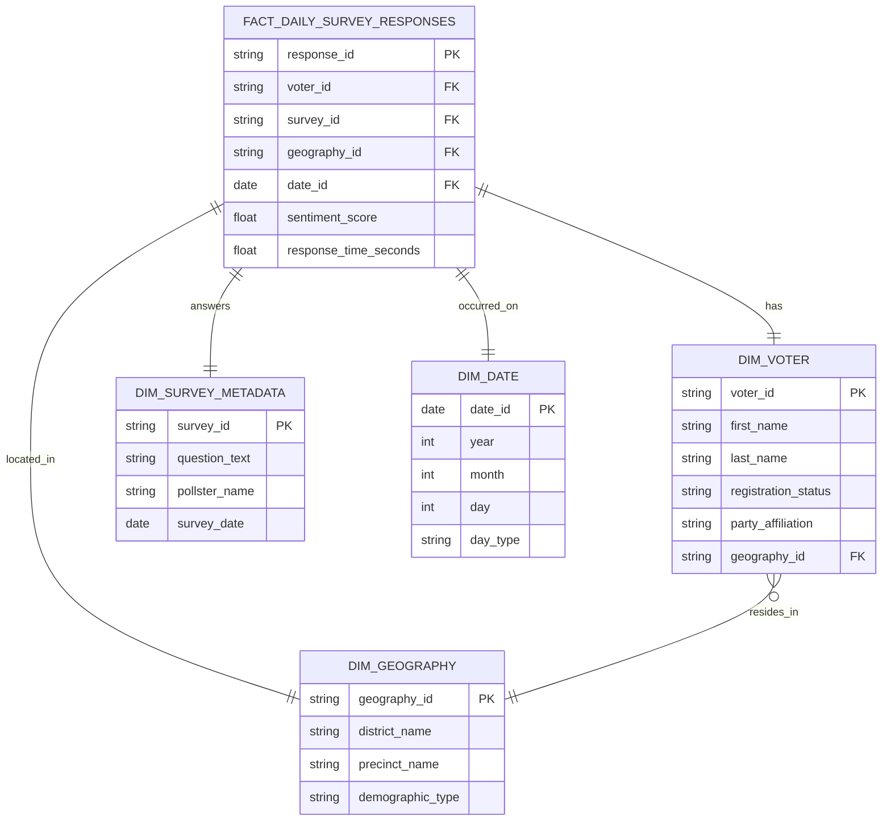

# TIMSAdvantaged Codebase

Generated: 09/18/2026 19:51:54

---

## Table of Contents

- .gitignore
- docker-compose.yml
- docs\.gitkeep
- docs\voter_survey_erd.md
- Generate-Codebook-TIMSAdvantaged.ps1
- infrastructure\environments\.gitkeep
- infrastructure\modules\.gitkeep
- ingestion\lambda_functions\.gitkeep
- ingestion\survey_api\app\.gitkeep
- internal_tools\streamlit_app\pages\.gitkeep
- pipelines\airflow\dags\.gitkeep
- pipelines\data_quality\.gitkeep
- pipelines\dbt\.gitignore
- pipelines\dbt\.user.yml
- pipelines\dbt\civic_pulse.duckdb
- pipelines\dbt\dbt_packages\dbt_utils\.circleci\config.yml
- pipelines\dbt\dbt_packages\dbt_utils\.gitignore
- pipelines\dbt\dbt_packages\dbt_utils\CHANGELOG.md
- pipelines\dbt\dbt_packages\dbt_utils\CONTRIBUTING.md
- pipelines\dbt\dbt_packages\dbt_utils\dbt_project.yml
- pipelines\dbt\dbt_packages\dbt_utils\dev-requirements.txt
- pipelines\dbt\dbt_packages\dbt_utils\docker-compose.yml
- pipelines\dbt\dbt_packages\dbt_utils\docs\decisions\adr-0000-documenting-architecture-decisions.md
- pipelines\dbt\dbt_packages\dbt_utils\docs\decisions\adr-0001-decision-record-format.md
- pipelines\dbt\dbt_packages\dbt_utils\docs\decisions\adr-0002-cross-database-utils.md
- pipelines\dbt\dbt_packages\dbt_utils\docs\decisions\README.md
- pipelines\dbt\dbt_packages\dbt_utils\integration_tests\.env\bigquery.env
- pipelines\dbt\dbt_packages\dbt_utils\integration_tests\.env\postgres.env
- pipelines\dbt\dbt_packages\dbt_utils\integration_tests\.env\redshift.env
- pipelines\dbt\dbt_packages\dbt_utils\integration_tests\.env\snowflake.env
- pipelines\dbt\dbt_packages\dbt_utils\integration_tests\.gitignore
- pipelines\dbt\dbt_packages\dbt_utils\integration_tests\ci\sample.profiles.yml
- pipelines\dbt\dbt_packages\dbt_utils\integration_tests\data\.gitkeep
- pipelines\dbt\dbt_packages\dbt_utils\integration_tests\data\schema_tests\schema.yml
- pipelines\dbt\dbt_packages\dbt_utils\integration_tests\dbt_project.yml
- pipelines\dbt\dbt_packages\dbt_utils\integration_tests\macros\.gitkeep
- pipelines\dbt\dbt_packages\dbt_utils\integration_tests\macros\assert_equal_values.sql
- pipelines\dbt\dbt_packages\dbt_utils\integration_tests\macros\limit_zero.sql
- pipelines\dbt\dbt_packages\dbt_utils\integration_tests\macros\tests.sql
- pipelines\dbt\dbt_packages\dbt_utils\integration_tests\models\datetime\schema.yml
- pipelines\dbt\dbt_packages\dbt_utils\integration_tests\models\datetime\test_date_spine.sql
- pipelines\dbt\dbt_packages\dbt_utils\integration_tests\models\generic_tests\recency_time_excluded.sql
- pipelines\dbt\dbt_packages\dbt_utils\integration_tests\models\generic_tests\recency_time_included.sql
- pipelines\dbt\dbt_packages\dbt_utils\integration_tests\models\generic_tests\schema.yml
- pipelines\dbt\dbt_packages\dbt_utils\integration_tests\models\generic_tests\test_equal_column_subset.sql
- pipelines\dbt\dbt_packages\dbt_utils\integration_tests\models\generic_tests\test_equal_rowcount.sql
- pipelines\dbt\dbt_packages\dbt_utils\integration_tests\models\generic_tests\test_fewer_rows_than.sql
- pipelines\dbt\dbt_packages\dbt_utils\integration_tests\models\geo\schema.yml
- pipelines\dbt\dbt_packages\dbt_utils\integration_tests\models\geo\test_haversine_distance_km.sql
- pipelines\dbt\dbt_packages\dbt_utils\integration_tests\models\geo\test_haversine_distance_mi.sql
- pipelines\dbt\dbt_packages\dbt_utils\integration_tests\models\sql\schema.yml
- pipelines\dbt\dbt_packages\dbt_utils\integration_tests\models\sql\test_deduplicate.sql
- pipelines\dbt\dbt_packages\dbt_utils\integration_tests\models\sql\test_generate_series.sql
- pipelines\dbt\dbt_packages\dbt_utils\integration_tests\models\sql\test_generate_surrogate_key.sql
- pipelines\dbt\dbt_packages\dbt_utils\integration_tests\models\sql\test_get_column_values.sql
- pipelines\dbt\dbt_packages\dbt_utils\integration_tests\models\sql\test_get_column_values_where.sql
- pipelines\dbt\dbt_packages\dbt_utils\integration_tests\models\sql\test_get_filtered_columns_in_relation.sql
- pipelines\dbt\dbt_packages\dbt_utils\integration_tests\models\sql\test_get_relations_by_pattern.sql
- pipelines\dbt\dbt_packages\dbt_utils\integration_tests\models\sql\test_get_relations_by_prefix_and_union.sql
- pipelines\dbt\dbt_packages\dbt_utils\integration_tests\models\sql\test_get_single_value.sql
- pipelines\dbt\dbt_packages\dbt_utils\integration_tests\models\sql\test_get_single_value_default.sql
- pipelines\dbt\dbt_packages\dbt_utils\integration_tests\models\sql\test_groupby.sql
- pipelines\dbt\dbt_packages\dbt_utils\integration_tests\models\sql\test_not_empty_string_failing.sql
- pipelines\dbt\dbt_packages\dbt_utils\integration_tests\models\sql\test_not_empty_string_passing.sql
- pipelines\dbt\dbt_packages\dbt_utils\integration_tests\models\sql\test_nullcheck_table.sql
- pipelines\dbt\dbt_packages\dbt_utils\integration_tests\models\sql\test_pivot.sql
- pipelines\dbt\dbt_packages\dbt_utils\integration_tests\models\sql\test_pivot_apostrophe.sql
- pipelines\dbt\dbt_packages\dbt_utils\integration_tests\models\sql\test_safe_add.sql
- pipelines\dbt\dbt_packages\dbt_utils\integration_tests\models\sql\test_safe_divide.sql
- pipelines\dbt\dbt_packages\dbt_utils\integration_tests\models\sql\test_safe_subtract.sql
- pipelines\dbt\dbt_packages\dbt_utils\integration_tests\models\sql\test_star.sql
- pipelines\dbt\dbt_packages\dbt_utils\integration_tests\models\sql\test_star_aggregate.sql
- pipelines\dbt\dbt_packages\dbt_utils\integration_tests\models\sql\test_star_no_columns.sql
- pipelines\dbt\dbt_packages\dbt_utils\integration_tests\models\sql\test_star_prefix_suffix.sql
- pipelines\dbt\dbt_packages\dbt_utils\integration_tests\models\sql\test_star_quote_identifiers.sql
- pipelines\dbt\dbt_packages\dbt_utils\integration_tests\models\sql\test_star_uppercase.sql
- pipelines\dbt\dbt_packages\dbt_utils\integration_tests\models\sql\test_union.sql
- pipelines\dbt\dbt_packages\dbt_utils\integration_tests\models\sql\test_union_base.sql
- pipelines\dbt\dbt_packages\dbt_utils\integration_tests\models\sql\test_union_exclude_base_lowercase.sql
- pipelines\dbt\dbt_packages\dbt_utils\integration_tests\models\sql\test_union_exclude_base_uppercase.sql
- pipelines\dbt\dbt_packages\dbt_utils\integration_tests\models\sql\test_union_exclude_lowercase.sql
- pipelines\dbt\dbt_packages\dbt_utils\integration_tests\models\sql\test_union_exclude_uppercase.sql
- pipelines\dbt\dbt_packages\dbt_utils\integration_tests\models\sql\test_union_no_source_column.sql
- pipelines\dbt\dbt_packages\dbt_utils\integration_tests\models\sql\test_union_where.sql
- pipelines\dbt\dbt_packages\dbt_utils\integration_tests\models\sql\test_union_where_base.sql
- pipelines\dbt\dbt_packages\dbt_utils\integration_tests\models\sql\test_unpivot.sql
- pipelines\dbt\dbt_packages\dbt_utils\integration_tests\models\sql\test_unpivot_bool.sql
- pipelines\dbt\dbt_packages\dbt_utils\integration_tests\models\sql\test_width_bucket.sql
- pipelines\dbt\dbt_packages\dbt_utils\integration_tests\models\web\schema.yml
- pipelines\dbt\dbt_packages\dbt_utils\integration_tests\models\web\test_url_host.sql
- pipelines\dbt\dbt_packages\dbt_utils\integration_tests\models\web\test_url_path.sql
- pipelines\dbt\dbt_packages\dbt_utils\integration_tests\models\web\test_urls.sql
- pipelines\dbt\dbt_packages\dbt_utils\integration_tests\packages.yml
- pipelines\dbt\dbt_packages\dbt_utils\integration_tests\README.md
- pipelines\dbt\dbt_packages\dbt_utils\integration_tests\tests\assert_get_query_results_as_dict_objects_equal.sql
- pipelines\dbt\dbt_packages\dbt_utils\integration_tests\tests\generic\expect_table_columns_to_match_set.sql
- pipelines\dbt\dbt_packages\dbt_utils\integration_tests\tests\jinja_helpers\assert_pretty_output_msg_is_string.sql
- pipelines\dbt\dbt_packages\dbt_utils\integration_tests\tests\jinja_helpers\assert_pretty_time_is_string.sql
- pipelines\dbt\dbt_packages\dbt_utils\integration_tests\tests\jinja_helpers\test_slugify.sql
- pipelines\dbt\dbt_packages\dbt_utils\integration_tests\tests\sql\test_get_column_values_use_default.sql
- pipelines\dbt\dbt_packages\dbt_utils\integration_tests\tests\sql\test_get_single_value_multiple_rows.sql
- pipelines\dbt\dbt_packages\dbt_utils\LICENSE
- pipelines\dbt\dbt_packages\dbt_utils\macros\generic_tests\accepted_range.sql
- pipelines\dbt\dbt_packages\dbt_utils\macros\generic_tests\at_least_one.sql
- pipelines\dbt\dbt_packages\dbt_utils\macros\generic_tests\cardinality_equality.sql
- pipelines\dbt\dbt_packages\dbt_utils\macros\generic_tests\equal_rowcount.sql
- pipelines\dbt\dbt_packages\dbt_utils\macros\generic_tests\equality.sql
- pipelines\dbt\dbt_packages\dbt_utils\macros\generic_tests\expression_is_true.sql
- pipelines\dbt\dbt_packages\dbt_utils\macros\generic_tests\fewer_rows_than.sql
- pipelines\dbt\dbt_packages\dbt_utils\macros\generic_tests\mutually_exclusive_ranges.sql
- pipelines\dbt\dbt_packages\dbt_utils\macros\generic_tests\not_accepted_values.sql
- pipelines\dbt\dbt_packages\dbt_utils\macros\generic_tests\not_constant.sql
- pipelines\dbt\dbt_packages\dbt_utils\macros\generic_tests\not_empty_string.sql
- pipelines\dbt\dbt_packages\dbt_utils\macros\generic_tests\not_null_proportion.sql
- pipelines\dbt\dbt_packages\dbt_utils\macros\generic_tests\recency.sql
- pipelines\dbt\dbt_packages\dbt_utils\macros\generic_tests\relationships_where.sql
- pipelines\dbt\dbt_packages\dbt_utils\macros\generic_tests\sequential_values.sql
- pipelines\dbt\dbt_packages\dbt_utils\macros\generic_tests\unique_combination_of_columns.sql
- pipelines\dbt\dbt_packages\dbt_utils\macros\jinja_helpers\_is_ephemeral.sql
- pipelines\dbt\dbt_packages\dbt_utils\macros\jinja_helpers\_is_relation.sql
- pipelines\dbt\dbt_packages\dbt_utils\macros\jinja_helpers\log_info.sql
- pipelines\dbt\dbt_packages\dbt_utils\macros\jinja_helpers\pretty_log_format.sql
- pipelines\dbt\dbt_packages\dbt_utils\macros\jinja_helpers\pretty_time.sql
- pipelines\dbt\dbt_packages\dbt_utils\macros\jinja_helpers\slugify.sql
- pipelines\dbt\dbt_packages\dbt_utils\macros\sql\date_spine.sql
- pipelines\dbt\dbt_packages\dbt_utils\macros\sql\deduplicate.sql
- pipelines\dbt\dbt_packages\dbt_utils\macros\sql\generate_series.sql
- pipelines\dbt\dbt_packages\dbt_utils\macros\sql\generate_surrogate_key.sql
- pipelines\dbt\dbt_packages\dbt_utils\macros\sql\get_column_values.sql
- pipelines\dbt\dbt_packages\dbt_utils\macros\sql\get_filtered_columns_in_relation.sql
- pipelines\dbt\dbt_packages\dbt_utils\macros\sql\get_query_results_as_dict.sql
- pipelines\dbt\dbt_packages\dbt_utils\macros\sql\get_relations_by_pattern.sql
- pipelines\dbt\dbt_packages\dbt_utils\macros\sql\get_relations_by_prefix.sql
- pipelines\dbt\dbt_packages\dbt_utils\macros\sql\get_single_value.sql
- pipelines\dbt\dbt_packages\dbt_utils\macros\sql\get_table_types_sql.sql
- pipelines\dbt\dbt_packages\dbt_utils\macros\sql\get_tables_by_pattern_sql.sql
- pipelines\dbt\dbt_packages\dbt_utils\macros\sql\get_tables_by_prefix_sql.sql
- pipelines\dbt\dbt_packages\dbt_utils\macros\sql\groupby.sql
- pipelines\dbt\dbt_packages\dbt_utils\macros\sql\haversine_distance.sql
- pipelines\dbt\dbt_packages\dbt_utils\macros\sql\nullcheck.sql
- pipelines\dbt\dbt_packages\dbt_utils\macros\sql\nullcheck_table.sql
- pipelines\dbt\dbt_packages\dbt_utils\macros\sql\pivot.sql
- pipelines\dbt\dbt_packages\dbt_utils\macros\sql\safe_add.sql
- pipelines\dbt\dbt_packages\dbt_utils\macros\sql\safe_divide.sql
- pipelines\dbt\dbt_packages\dbt_utils\macros\sql\safe_subtract.sql
- pipelines\dbt\dbt_packages\dbt_utils\macros\sql\star.sql
- pipelines\dbt\dbt_packages\dbt_utils\macros\sql\surrogate_key.sql
- pipelines\dbt\dbt_packages\dbt_utils\macros\sql\union.sql
- pipelines\dbt\dbt_packages\dbt_utils\macros\sql\unpivot.sql
- pipelines\dbt\dbt_packages\dbt_utils\macros\sql\width_bucket.sql
- pipelines\dbt\dbt_packages\dbt_utils\macros\web\get_url_host.sql
- pipelines\dbt\dbt_packages\dbt_utils\macros\web\get_url_parameter.sql
- pipelines\dbt\dbt_packages\dbt_utils\macros\web\get_url_path.sql
- pipelines\dbt\dbt_packages\dbt_utils\Makefile
- pipelines\dbt\dbt_packages\dbt_utils\pytest.ini
- pipelines\dbt\dbt_packages\dbt_utils\README.md
- pipelines\dbt\dbt_packages\dbt_utils\RELEASE.md
- pipelines\dbt\dbt_packages\dbt_utils\run_functional_test.sh
- pipelines\dbt\dbt_packages\dbt_utils\run_test.sh
- pipelines\dbt\dbt_packages\dbt_utils\tests\__init__.py
- pipelines\dbt\dbt_packages\dbt_utils\tests\conftest.py
- pipelines\dbt\dbt_project.yml
- pipelines\dbt\macros\.gitkeep
- pipelines\dbt\models\marts\dim_date.sql
- pipelines\dbt\models\marts\dim_geography.sql
- pipelines\dbt\models\marts\dim_survey_metadata.sql
- pipelines\dbt\models\marts\dim_voter.sql
- pipelines\dbt\models\marts\fact_daily_survey_responses.sql
- pipelines\dbt\models\marts\schema.yml
- pipelines\dbt\models\staging\stg_geography.sql
- pipelines\dbt\models\staging\stg_survey_metadata.sql
- pipelines\dbt\models\staging\stg_survey_responses.sql
- pipelines\dbt\models\staging\stg_voters.sql
- pipelines\dbt\package-lock.yml
- pipelines\dbt\packages.yml
- pipelines\dbt\profiles.yml
- pipelines\dbt\README.md
- pipelines\dbt\target\compiled\civic_pulse\models\example\my_first_dbt_model.sql
- pipelines\dbt\target\compiled\civic_pulse\models\example\schema.yml\not_null_my_first_dbt_model_id.sql
- pipelines\dbt\target\compiled\civic_pulse\models\example\schema.yml\unique_my_first_dbt_model_id.sql
- pipelines\dbt\target\compiled\civic_pulse\models\marts\dim_date.sql
- pipelines\dbt\target\compiled\civic_pulse\models\marts\dim_geography.sql
- pipelines\dbt\target\compiled\civic_pulse\models\marts\dim_survey_metadata.sql
- pipelines\dbt\target\compiled\civic_pulse\models\marts\dim_voter.sql
- pipelines\dbt\target\compiled\civic_pulse\models\marts\fact_daily_survey_responses.sql
- pipelines\dbt\target\compiled\civic_pulse\models\marts\schema.yml\not_null_dim_date_date_id.sql
- pipelines\dbt\target\compiled\civic_pulse\models\marts\schema.yml\not_null_dim_geography_geography_id.sql
- pipelines\dbt\target\compiled\civic_pulse\models\marts\schema.yml\not_null_dim_survey_metadata_survey_id.sql
- pipelines\dbt\target\compiled\civic_pulse\models\marts\schema.yml\not_null_dim_voter_voter_id.sql
- pipelines\dbt\target\compiled\civic_pulse\models\marts\schema.yml\not_null_fact_daily_survey_responses_response_id.sql
- pipelines\dbt\target\compiled\civic_pulse\models\marts\schema.yml\not_null_fact_daily_survey_responses_sentiment_score.sql
- pipelines\dbt\target\compiled\civic_pulse\models\marts\schema.yml\unique_dim_date_date_id.sql
- pipelines\dbt\target\compiled\civic_pulse\models\marts\schema.yml\unique_dim_geography_geography_id.sql
- pipelines\dbt\target\compiled\civic_pulse\models\marts\schema.yml\unique_dim_survey_metadata_survey_id.sql
- pipelines\dbt\target\compiled\civic_pulse\models\marts\schema.yml\unique_dim_voter_voter_id.sql
- pipelines\dbt\target\compiled\civic_pulse\models\marts\schema.yml\unique_fact_daily_survey_responses_response_id.sql
- pipelines\dbt\target\compiled\civic_pulse\models\staging\stg_geography.sql
- pipelines\dbt\target\compiled\civic_pulse\models\staging\stg_survey_metadata.sql
- pipelines\dbt\target\compiled\civic_pulse\models\staging\stg_survey_responses.sql
- pipelines\dbt\target\compiled\civic_pulse\models\staging\stg_voters.sql
- pipelines\dbt\target\graph.gpickle
- pipelines\dbt\target\graph_summary.json
- pipelines\dbt\target\manifest.json
- pipelines\dbt\target\partial_parse.msgpack
- pipelines\dbt\target\run\civic_pulse\models\example\my_first_dbt_model.sql
- pipelines\dbt\target\run\civic_pulse\models\example\schema.yml\not_null_my_first_dbt_model_id.sql
- pipelines\dbt\target\run\civic_pulse\models\example\schema.yml\unique_my_first_dbt_model_id.sql
- pipelines\dbt\target\run\civic_pulse\models\marts\dim_date.sql
- pipelines\dbt\target\run\civic_pulse\models\marts\dim_geography.sql
- pipelines\dbt\target\run\civic_pulse\models\marts\dim_survey_metadata.sql
- pipelines\dbt\target\run\civic_pulse\models\marts\dim_voter.sql
- pipelines\dbt\target\run\civic_pulse\models\marts\fact_daily_survey_responses.sql
- pipelines\dbt\target\run\civic_pulse\models\marts\schema.yml\not_null_dim_date_date_id.sql
- pipelines\dbt\target\run\civic_pulse\models\marts\schema.yml\not_null_dim_geography_geography_id.sql
- pipelines\dbt\target\run\civic_pulse\models\marts\schema.yml\not_null_dim_survey_metadata_survey_id.sql
- pipelines\dbt\target\run\civic_pulse\models\marts\schema.yml\not_null_dim_voter_voter_id.sql
- pipelines\dbt\target\run\civic_pulse\models\marts\schema.yml\not_null_fact_daily_survey_responses_response_id.sql
- pipelines\dbt\target\run\civic_pulse\models\marts\schema.yml\not_null_fact_daily_survey_responses_sentiment_score.sql
- pipelines\dbt\target\run\civic_pulse\models\marts\schema.yml\unique_dim_date_date_id.sql
- pipelines\dbt\target\run\civic_pulse\models\marts\schema.yml\unique_dim_geography_geography_id.sql
- pipelines\dbt\target\run\civic_pulse\models\marts\schema.yml\unique_dim_survey_metadata_survey_id.sql
- pipelines\dbt\target\run\civic_pulse\models\marts\schema.yml\unique_dim_voter_voter_id.sql
- pipelines\dbt\target\run\civic_pulse\models\marts\schema.yml\unique_fact_daily_survey_responses_response_id.sql
- pipelines\dbt\target\run\civic_pulse\models\staging\stg_geography.sql
- pipelines\dbt\target\run\civic_pulse\models\staging\stg_survey_metadata.sql
- pipelines\dbt\target\run\civic_pulse\models\staging\stg_survey_responses.sql
- pipelines\dbt\target\run\civic_pulse\models\staging\stg_voters.sql
- pipelines\dbt\target\run_results.json
- pipelines\dbt\target\semantic_manifest.json
- pipelines\dbt\tests\.gitkeep
- README.md
- requirements.txt
- scripts\.gitkeep
- tests\integration\.gitkeep
- tests\unit\.gitkeep

---


<div style='page-break-after: always;'></div>

# File: .gitignore

```gitignore
# Python
__pycache__/
*.py[cod]
*.class
*.so
.Python
env/
venv/
.venv/
ENV/
build/
dist/
*.egg-info/

# Environment Variables & Secrets
.env
.env.*
*.pem
aws_credentials.json

# IDE
.vscode/
.idea/
*.swp
*.swo

# OS
.DS_Store
Thumbs.db

# Data & Logs (Don't commit raw data or massive logs)
data/
logs/
*.csv
*.parquet

```


<div style='page-break-after: always;'></div>

# File: docker-compose.yml

```yaml
```


<div style='page-break-after: always;'></div>

# File: docs\.gitkeep

```gitkeep
```


<div style='page-break-after: always;'></div>

# File: docs\voter_survey_erd.md

```md
# CivicPulse Star Schema ERD

Copy the code block below into [mermaid.live](https://mermaid.live) to generate and download the PDF for your interview portfolio.




<div style='page-break-after: always;'></div>

# File: Generate-Codebook-TIMSAdvantaged.ps1

```ps1
<#
.EXAMPLE
.\Generate-Codebook-TIMSAdvantaged.ps1 -ProjectPath "C:\Data\CivicPulse"
#>

param(
    [string]$ProjectPath = (Get-Location).Path,
    [switch]$GeneratePdf
)

# ============================================================
# Configuration
# ============================================================

$Root = (Resolve-Path $ProjectPath).Path

$MarkdownFile = Join-Path $Root "Codebase.md"
$PdfFile      = Join-Path $Root "Codebase.pdf"

# 1. Directories to completely ignore (Added TIMS specific folders)
$ExcludedDirectories = @(
    ".git", ".github", ".idea", ".vscode", ".cursor",
    "node_modules", "venv", ".venv", "env", "Lib", "Include", "site-packages",
    "__pycache__", ".pytest_cache", ".mypy_cache", ".ruff_cache", "htmlcov",
    "coverage", "dist", "build", "bin", "obj", "out", ".next",
    "migrations", "trash", "staticfiles", "media",
    ".cache", ".data", ".logs", ".reports" 
)

# 2. File extensions to ignore (Added Excel, Certs, CSVs)
$ExcludedExtensions = @(
    ".png",".jpg",".jpeg",".gif",".bmp",".ico",".svg",".webp",".avif",
    ".pdf",".zip",".7z",".rar",".tar",".gz",
    ".exe",".dll",".so",".dylib",".pyd",
    ".woff",".woff2",".ttf",".eot",
    ".pyc",".pyo",".class",
    ".db",".sqlite3",".sqlite",".log",
    ".map", ".mo", ".lock", ".pth", ".bak", ".tmp",
    ".xlsx", ".xls", ".csv", ".pem", ".crt", ".key", ".tpl"
)

# 3. Specific files to ignore (CRITICAL: Added .secrets.toml for security)
$ExcludedFiles = @(
    "package-lock.json",
    "yarn.lock",
    "pnpm-lock.yaml",
    "Pipfile.lock",
    "poetry.lock",
    "db.sqlite3",
    ".secrets.toml", 
    "Codebase.md",
    "Codebase.pdf"
)

# Delete old markdown if it exists
if (Test-Path $MarkdownFile) {
    Remove-Item $MarkdownFile -Force
}

# ============================================================
# Helper Function
# ============================================================

function Add-Line {
    param([string]$Text)
    Add-Content -Path $MarkdownFile -Value $Text -Encoding UTF8
}

# ============================================================
# Scan Files
# ============================================================

Write-Host ""
Write-Host "Scanning TIMSAdvantaged repository..."
Write-Host ""

$Files = Get-ChildItem -Path $Root -Recurse -File | Where-Object {
    $relative = $_.FullName.Substring($Root.Length).TrimStart('\', '/')
    $fileName = $_.Name

    # Check Directories (Windows and Linux/Mac path separators)
    $pathParts = $relative -split '[\\/]'
    foreach ($dir in $ExcludedDirectories) {
        if ($pathParts -contains $dir) {
            return $false
        }
    }

    # Check Extensions
    if ($ExcludedExtensions -contains $_.Extension.ToLower()) {
        return $false
    }

    # Check Exact Filenames
    if ($ExcludedFiles -contains $fileName) {
        return $false
    }

    return $true

} | Sort-Object FullName

Write-Host "Found $($Files.Count) valid source code files."
Write-Host ""

# ============================================================
# Markdown Header
# ============================================================

Add-Line "# TIMSAdvantaged Codebase"
Add-Line ""
Add-Line "Generated: $(Get-Date)"
Add-Line ""
Add-Line "---"
Add-Line ""

# ============================================================
# Table of Contents
# ============================================================

Add-Line "## Table of Contents"
Add-Line ""

foreach ($file in $Files) {
    $relative = $file.FullName.Substring($Root.Length).TrimStart('\', '/')
    Add-Line "- $relative"
}

Add-Line ""
Add-Line "---"
Add-Line ""

# ============================================================
# Add Every File
# ============================================================

$index = 1

foreach ($file in $Files) {
    $relative = $file.FullName.Substring($Root.Length).TrimStart('\', '/')

    Write-Host "[$index/$($Files.Count)] $relative"

    $language = $file.Extension.TrimStart('.')
    if ([string]::IsNullOrWhiteSpace($language)) { $language = "text" }
    
    # Map specific extensions to markdown code block languages
    switch ($language) {
        "py" { $language = "python" }
        "js" { $language = "javascript" }
        "ts" { $language = "typescript" }
        "tsx" { $language = "tsx" }
        "jsx" { $language = "jsx" }
        "yml" { $language = "yaml" }
        "sh" { $language = "bash" }
        "toml" { $language = "toml" }
    }

    Add-Line ""
    Add-Line "<div style='page-break-after: always;'></div>"
    Add-Line ""
    Add-Line "# File: $relative"
    Add-Line ""
    Add-Line ('```' + $language)

    try {
        $content = Get-Content $file.FullName -Raw -Encoding UTF8
        Add-Content -Path $MarkdownFile -Value $content -Encoding UTF8
    }
    catch {
        Add-Line "[Unable to read file.]"
    }

    Add-Line '```'
    Add-Line ""
    $index++
}

Write-Host ""
Write-Host "Markdown created successfully!"
Write-Host $MarkdownFile


# ============================================================
# Optional PDF Generation
# ============================================================

if ($GeneratePdf) {

    $Pandoc = Get-Command pandoc -ErrorAction SilentlyContinue

    if ($Pandoc) {

        Write-Host ""
        Write-Host "Generating PDF..."

        & pandoc `
            $MarkdownFile `
            -o $PdfFile `
            --toc `
            --highlight-style=tango

        Write-Host ""
        Write-Host "PDF created:"
        Write-Host $PdfFile

    }
    else {

        Write-Host ""
        Write-Host "Pandoc was not found."
        Write-Host ""
        Write-Host "Install it from:"
        Write-Host "https://pandoc.org/installing.html"

    }

}
```


<div style='page-break-after: always;'></div>

# File: infrastructure\environments\.gitkeep

```gitkeep
```


<div style='page-break-after: always;'></div>

# File: infrastructure\modules\.gitkeep

```gitkeep
```


<div style='page-break-after: always;'></div>

# File: ingestion\lambda_functions\.gitkeep

```gitkeep
```


<div style='page-break-after: always;'></div>

# File: ingestion\survey_api\app\.gitkeep

```gitkeep
```


<div style='page-break-after: always;'></div>

# File: internal_tools\streamlit_app\pages\.gitkeep

```gitkeep
```


<div style='page-break-after: always;'></div>

# File: pipelines\airflow\dags\.gitkeep

```gitkeep
```


<div style='page-break-after: always;'></div>

# File: pipelines\data_quality\.gitkeep

```gitkeep
```


<div style='page-break-after: always;'></div>

# File: pipelines\dbt\.gitignore

```gitignore

target/
dbt_packages/
logs/

```


<div style='page-break-after: always;'></div>

# File: pipelines\dbt\.user.yml

```yaml
id: d27010aa-b517-4b62-ba88-098219038bc3

```


<div style='page-break-after: always;'></div>

# File: pipelines\dbt\civic_pulse.duckdb

```duckdb
�o'�ڳ�DUCK@v1.5.5d8cdaa33fdO��P}%		��s��)L0@P�(dcddfmaini����cddecivic_pulsefmaini�my_first_dbt_model�ddided
��gh������ed��������eh��fgh��cddfmainij�/* {"app": "dbt", "dbt_version": "1.7.13", "profile_name": "civic_pulse", "target_name": "dev", "node_id": "model.civic_pulse.dim_date"} */

  
  create view "civic_pulse"."main"."dim_date__dbt_tmp" as (
    -- Universal date dimension for time-series analysis
-- Note: DuckDB uses standard SQL INTERVAL syntax for date arithmetic
WITH RECURSIVE date_spine AS (
    SELECT CAST('2026-01-01' AS DATE) AS date_day
    UNION ALL
    SELECT date_day + INTERVAL 1 DAY FROM date_spine WHERE date_day < '2026-12-31'
)
SELECT 
    date_day AS date_id,
    EXTRACT(YEAR FROM date_day) AS year,
    EXTRACT(MONTH FROM date_day) AS month,
    EXTRACT(DAY FROM date_day) AS day,
    CASE 
        WHEN EXTRACT(DOW FROM date_day) IN (0, 6) THEN 'Weekend'
        ELSE 'Weekday'
    END AS day_type
FROM date_spine
  );
�dim_date�d��d��d��d��d���ddfd
date_spineeddf���
date_spine��df���defdate_dayg��deKg��dd��ef
2026-01-01�����d�����d������df���d	e�g��+�de�g��date_day��d	e�g��to_days�de�d	e��trunc�deg��deKg��dd
��ef�����d�����d�����d
�����d�����d������dg��
date_spine���deg��de�g��date_day���deKg��dd��ef
2026-12-31�������������f�������de�fdate_idg��date_day��d	e�fyearg��	date_part�main�deKg��dd��efyear����de�g��date_day���d����d	e�fmonthg��	date_part�main�deKg��dd��efmonth����de�g��date_day���d����d	e�fdayg��	date_part�main�deKg��dd��efday����de�g��date_day���d����de�fday_typeg��dd
e#g��d	e�g��	date_part�main�deKg��dd��efDOW����de�g��date_day���d����deKg��dd
��ef����deKg��dd
��ef������edeKg��dd��efWeekend�������deKg��dd��efWeekday�������dg��
date_spine��������date_idyearmonthdayday_type����cddfmainij�/* {"app": "dbt", "dbt_version": "1.7.13", "profile_name": "civic_pulse", "target_name": "dev", "node_id": "model.civic_pulse.dim_geography"} */

  
  create view "civic_pulse"."main"."dim_geography__dbt_tmp" as (
    WITH staged AS (
    SELECT * FROM "civic_pulse"."main"."stg_geography"
)
SELECT 
    geography_id,
    district_name,
    precinct_name,
    demographic_type
FROM staged
  );
�
dim_geography�d��d��d��d���ddfdstagededdf���de�g�����dg��main�
stg_geography�civic_pulse�������f�������de�g��geography_id��de�g��
district_name��de�g��
precinct_name��de�g��demographic_type���dg��staged��������geography_id
district_name
precinct_namedemographic_type����cddfmainij�/* {"app": "dbt", "dbt_version": "1.7.13", "profile_name": "civic_pulse", "target_name": "dev", "node_id": "model.civic_pulse.dim_survey_metadata"} */

  
  create view "civic_pulse"."main"."dim_survey_metadata__dbt_tmp" as (
    WITH staged AS (
    SELECT * FROM "civic_pulse"."main"."stg_survey_metadata"
)
SELECT 
    survey_id,
    question_text,
    pollster_name,
    CAST(survey_date AS DATE) AS survey_date
FROM staged
  );
�dim_survey_metadata�d��d��d��d���ddfdstagededdf���de�g�����dg��main�stg_survey_metadata�civic_pulse�������f�������de�g��	survey_id��de�g��
question_text��de�g��
pollster_name��defsurvey_dateg��de�g��survey_date���d�����dg��staged��������	survey_id
question_text
pollster_namesurvey_date����cddfmainij�/* {"app": "dbt", "dbt_version": "1.7.13", "profile_name": "civic_pulse", "target_name": "dev", "node_id": "model.civic_pulse.dim_voter"}��������defd��ghdefg�de���de��������edefd��ghdefg����������dddefg�de���de������edefde�HYLL������ede��e������defd��������e��g�� */

  
  create view "civic_pulse"."main"."dim_voter__dbt_tmp" as (
    WITH staged AS (
    SELECT * FROM "civic_pulse"."main"."stg_voters"
)
SELECT 
    voter_id,
    first_name,
    last_name,
    registration_status,
    party_affiliation,
    geography_id
FROM staged
  );
�	dim_voter�d��d��d��d��d��d���ddfdstagededdf���de�g�����dg��main�
stg_voters�civic_pulse�������f�������de�g��voter_id��de�g��
first_name��de�g��	last_name��de�g��registration_status��de�g��party_affiliation��de�g��geography_id���dg��staged��������voter_id
first_name	last_nameregistration_statusparty_affiliationgeography_id����cddfmainij�/* {"app": "dbt", "dbt_version": "1.7.13", "profile_name": "civic_pulse", "target_name": "dev", "node_id": "model.civic_pulse.fact_daily_survey_responses"} */

  
  create view "civic_pulse"."main"."fact_daily_survey_responses__dbt_tmp" as (
    -- The central Fact Table connecting all dimensions
WITH responses AS (
    SELECT * FROM "civic_pulse"."main"."stg_survey_responses"
),
voters AS (
    SELECT * FROM "civic_pulse"."main"."dim_voter"
),
geography AS (
    SELECT * FROM "civic_pulse"."main"."dim_geography"
),
surveys AS (
    SELECT * FROM "civic_pulse"."main"."dim_survey_metadata"
),
dates AS (
    SELECT * FROM "civic_pulse"."main"."dim_date"
)

SELECT 
    r.response_id,
    r.voter_id,
    r.survey_id,
    v.geography_id,
    CAST(r.response_date AS DATE) AS date_id,
    r.sentiment_score,
    r.response_time_seconds,
    g.district_name,
    s.pollster_name
FROM responses r
LEFT JOIN voters v ON r.voter_id = v.voter_id
LEFT JOIN geography g ON v.geography_id = g.geography_id
LEFT JOIN surveys s ON r.survey_id = s.survey_id
LEFT JOIN dates d ON CAST(r.response_date AS DATE) = d.date_id
  );
�fact_daily_survey_responses�	d��d��d��d��d��ded������ded������d��d���ddfd	responseseddf���de�g�����dg��main�stg_survey_responses�civic_pulse�������f����voterseddf���de�g�����dg��main�	dim_voter�civic_pulse�������f����	geographyeddf���de�g�����dg��main�
dim_geography�civic_pulse�������f����surveyseddf���de�g�����dg��main�dim_survey_metadata�civic_pulse�������f����dateseddf���de�g�����dg��main�dim_date�civic_pulse�������f�������	de�g��rresponse_id��de�g��rvoter_id��de�g��r	survey_id��de�g��vgeography_id��defdate_idg��de�g��r
response_date���d����de�g��rsentiment_score��de�g��rresponse_time_seconds��de�g��g
district_name��de�g��s
pollster_name���d�d�d�d�derg��	responses���devg��voters���deg��de�g��rvoter_id���de�g��vvoter_id���������degg��	geography���deg��de�g��vgeography_id���de�g��ggeography_id���������desg��surveys���deg��de�g��r	survey_id���de�g��s	survey_id���������dedg��dates���deg��deg��de�g��r
response_date���d�����de�g��ddate_id��������������	response_idvoter_id	survey_idgeography_iddate_idsentiment_scoreresponse_time_seconds
district_name
pollster_name����cddfmainij�/* {"app": "dbt", "dbt_version": "1.7.13", "profile_name": "civic_pulse", "target_name": "dev", "node_id": "model.civic_pulse.stg_geography"} */

  
  create view "civic_pulse"."main"."stg_geography__dbt_tmp" as (
    -- Simulates raw geography/precinct data
SELECT 
    'GEO-101' AS geography_id,
    'District 5' AS district_name,
    'Precinct A' AS precinct_name,
    'Urban' AS demographic_type
UNION ALL
SELECT 
    'GEO-102', 'District 8', 'Precinct B', 'Suburban'
  );
�
stg_geography�d��d��d��d���ddf����df���deKfgeography_idg��dd��efGEO-101����deKf
district_nameg��dd��ef
District 5����deKf
precinct_nameg��dd��ef
Precinct A����deKfdemographic_typeg��dd��efUrban�����d������df���deKg��dd��efGEO-102����deKg��dd��ef
District 8����deKg��dd��ef
Precinct B����deKg��dd��efSuburban�����d����������geography_id
district_name
precinct_namedemographic_type����cddfmainij�/* {"app": "dbt", "dbt_version": "1.7.13", "profile_name": "civic_pulse", "target_name": "dev", "node_id": "model.civic_pulse.stg_survey_metadata"} */

  
  create view "civic_pulse"."main"."stg_survey_metadata__dbt_tmp" as (
    -- Simulates survey question definitions
SELECT 
    'SRV-001' AS survey_id,
    'Do you support the new infrastructure bill?' AS question_text,
    'Pew Research Mock' AS pollster_name,
    '2026-09-01' AS survey_date
  );
�stg_survey_metadata�d��d��d��d���ddf���deKf	survey_idg��dd��efSRV-001����deKf
question_textg��dd��ef+Do you support the new infrastructure bill?����deKf
pollster_nameg��dd��efPew Research Mock����deKfsurvey_dateg��dd��ef
2026-09-01�����d��������	survey_id
question_text
pollster_namesurvey_date����cddfmainij�/* {"app": "dbt", "dbt_version": "1.7.13", "profile_name": "civic_pulse", "target_name": "dev", "node_id": "model.civic_pulse.stg_survey_responses"} */

  
  create view "civic_pulse"."main"."stg_survey_responses__dbt_tmp" as (
    -- Simulates high-velocity microservice survey responses
SELECT 
    'RESP-001' AS response_id,
    'VTR-001' AS voter_id,
    'SRV-001' AS survey_id,
    0.85 AS sentiment_score, -- 0.0 to 1.0
    12.5 AS response_time_seconds,
    '2026-09-15' AS response_date
UNION ALL
SELECT 
    'RESP-002', 'VTR-002', 'SRV-001', 0.45, 8.2, '2026-09-15'
  );
�stg_survey_responses�d��d��d��ded������ded������d���ddf����df���deKfresponse_idg��dd��efRESP-001����deKfvoter_idg��dd��efVTR-001����deKf	survey_idg��dd��efSRV-001����deKfsentiment_scoreg��dded������ef�����deKfresponse_time_secondsg��dded������ef�����deKf
response_dateg��dd��ef
2026-09-15�����d������df���deKg��dd��efRESP-002����deKg��dd��efVTR-002����deKg��dd��efSRV-001����deKg��dded������ef-����deKg��dded������ef�����deKg��dd��ef
2026-09-15�����d����������response_idvoter_id	survey_idsentiment_scoreresponse_time_seconds
response_date����cddfmainij�/* {"app": "dbt", "dbt_version": "1.7.13", "profile_name": "civic_pulse", "target_name": "dev", "node_id": "model.civic_pulse.stg_voters"} */

  
  create view "civic_pulse"."main"."stg_voters__dbt_tmp" as (
    -- Simulates raw voter file data from S3
SELECT 
    'VTR-001' AS voter_id,
    'John' AS first_name,
    'Doe' AS last_name,
    'Active' AS registration_status,
    'Democrat' AS party_affiliation,
    'GEO-101' AS geography_id
UNION ALL
SELECT 
    'VTR-002', 'Jane', 'Smith', 'Active', 'Independent', 'GEO-102'
  );
�
stg_voters�d��d��d��d��d��d���ddf����df���deKfvoter_idg��dd��efVTR-001����deKf
first_nameg��dd��efJohn����deKf	last_nameg��dd��efDoe����deKfregistration_statusg��dd��efActive����deKfparty_affiliationg��dd��efDemocrat����deKfgeography_idg��dd��efGEO-101�����d������df���deKg��dd��efVTR-002����deKg��dd��efJane����deKg��dd��efSmith����deKg��dd��efActive����deKg��dd��efIndependent����deKg��dd��efGEO-102�����d����������voter_id
first_name	last_nameregisd
cddfmaini����cddecivic_pulsefmaini�my_first_dbt_model�ddided
��gh������ed��������eh��fgh��cddfmainij�/* {"app": "dbt", "dbt_version": "1.7.13", "profile_name": "civic_pulse", "target_name": "dev", "node_id": "model.civic_pulse.dim_date"} */

  
  create view "civic_pulse"."main"."dim_date__dbt_tmp" as (
    -- Universal date dimension for time-series analysis
-- Note: DuckDB uses standard SQL INTERVAL syntax for date arithmetic
WITH RECURSIVE date_spine AS (
    SELECT CAST('2026-01-01' AS DATE) AS date_day
    UNION ALL
    SELECT date_day + INTERVAL 1 DAY FROM date_spine WHERE date_day < '2026-12-31'
)
SELECT 
    date_day AS date_id,
    EXTRACT(YEAR FROM date_day) AS year,
    EXTRACT(MONTH FROM date_day) AS month,
    EXTRACT(DAY FROM date_day) AS day,
    CASE 
        WHEN EXTRACT(DOW FROM date_day) IN (0, 6) THEN 'Weekend'
        ELSE 'Weekday'
    END AS day_type
FROM date_spine
  );
�dim_date�d��d��d��d��d���ddfd
date_spineeddf���
date_spine��df���defdate_dayg��deKg��dd��ef
2026-01-01�����d�����d������df���d	e�g��+�de�g��date_day��d	e�g��to_days�de�d	e��trunc�deg��deKg��dd
��ef�����d�����d�����d
�����d�����d������dg��
date_spine���deg��de�g��date_day���deKg��dd��ef
2026-12-31�������������f�������de�fdate_idg��date_day��d	e�fyearg��	date_part�main�deKg��dd��efyear����de�g��date_day���d����d	e�fmonthg��	date_part�main�deKg��dd��efmonth����de�g��date_day���d����d	e�fdayg��	date_part�main�deKg��dd��efday����de�g��date_day���d����de�fday_typeg��dd
e#g��d	e�g��	date_part�main�deKg��dd��efDOW����de�g��date_day���d����deKg��dd
��ef����deKg��dd
��ef������edeKg��dd��efWeekend�������deKg��dd��efWeekday�������dg��
date_spine��������date_idyearmonthdayday_type����cddfmainij�/* {"app": "dbt", "dbt_version": "1.7.13", "profile_name": "civic_pulse", "target_name": "dev", "node_id": "model.civic_pulse.dim_geography"} */

  
  create view "civic_pulse"."main"."dim_geography__dbt_tmp" as (
    WITH staged AS (
    SELECT * FROM "civic_pulse"."main"."stg_geography"
)
SELECT 
    geography_id,
    district_name,
    precinct_name,
    demographic_type
FROM staged
  );
�
dim_geography�d��d��d��d���ddfdstagededdf���de�g�����dg��main�
stg_geography�civic_pulse�������f�������de�g��geography_id��de�g��
district_name��de�g��
precinct_name��de�g��demographic_type���dg��staged��������geography_id
district_name
precinct_namedemographic_type����cddfmainij�/* {"app": "dbt", "dbt_version": "1.7.13", "profile_name": "civic_pulse", "target_name": "dev", "node_id": "model.civic_pulse.dim_survey_metadata"} */

  
  create view "civic_pulse"."main"."dim_survey_metadata__dbt_tmp" as (
    WITH staged AS (
    SELECT * FROM "civic_pulse"."main"."stg_survey_metadata"
)
SELECT 
    survey_id,
    question_text,
    pollster_name,
    CAST(survey_date AS DATE) AS survey_date
FROM staged
  );
�dim_survey_metadata�d��d��d��d���ddfdstagededdf���de�g�����dg��main�stg_survey_metadata�civic_pulse�������f�������de�g��	survey_id��de�g��
question_text��de�g��
pollster_name��defsurvey_dateg��de�g��survey_date���d�����dg��staged��������	survey_id
question_text
pollster_namesurvey_date����cddfmainij�/* {"app": "dbt", "dbt_version": "1.7.13", "profile_name": "civic_pulse", "target_name": "dev", "node_id": "model.civic_pulse.dim_voter"} */

  
  create view "civic_pulse"."main"."dim_voter__dbt_tmp" as (
    WITH staged AS (
    SELECT * FROM "civic_pulse"."main"."stg_voters"
)
SELECT 
    voter_id,
    first_name,
    last_name,
    registration_status,
    party_affiliation,
    geography_id
FROM staged
  );
�	dim_voter�d��d��d��d��d��d���ddfdstagededdf���de�g�����dg��main�
stg_voters�civic_pulse�������f�������de�g��voter_id��de�g��
first_name��de�g��	last_name��de�g��registration_status��de�g��party_affiliation��de�g��geography_id���dg��staged��������voter_id
first_name	last_nameregistration_statusparty_affiliationgeography_id����cddfmainij�/* {"app": "dbt", "dbt_version": "1.7.13", "profile_name": "civic_pulse", "target_name": "dev", "node_id": "model.civic_pulse.stg_geography"} */

  
  create view "civic_pulse"."main"."stg_geography__dbt_tmp" as (
    -- Simulates raw geography/precinct data
SELECT 
    'GEO-101' AS geography_id,
    'District 5' AS district_name,
    'Precinct A' AS precinct_name,
    'Urban' AS demographic_type
UNION ALL
SELECT 
    'GEO-102', 'District 8', 'Precinct B', 'Suburban'
  );
�
stg_geography�d��d��d��d���ddf����df���deKfgeography_idg��dd��efGEO-101����deKf
district_nameg��dd��ef
District 5����deKf
precinct_nameg��dd��ef
Precinct A����deKfdemographic_typeg��dd��efUrban�����d������df���deKg��dd��efGEO-102����deKg��dd��ef
District 8����deKg��dd��ef
Precinct B����deKg��dd��efSuburban�����d����������geography_id
district_name
precinct_namedemographic_type����cddfmainij�/* {"app": "dbt", "dbt_version": "1.7.13", "profile_name": "civic_pulse", "target_name": "dev", "node_id": "model.civic_pulse.stg_survey_metadata"} */

  
  create view "civic_pulse"."main"."stg_survey_metadata__dbt_tmp" as (
    -- Simulates survey question definitions
SELECT 
    'SRV-001' AS survey_id,
    'Do you support the new infrastructure bill?' AS question_text,
    'Pew Research Mock' AS pollster_name,
    '2026-09-01' AS survey_date
  );
�stg_survey_metadata�d��d��d��d���ddf���deKf	survey_idg��dd��efSRV-001����deKf
question_textg��dd��ef+Do you support the new infrastructure bill?����deKf
pollster_nameg��dd��efPew Research Mock����deKfsurvey_dateg��dd��ef
2026-09-01�����d��������	survey_id
question_text
pollster_namesurvey_date����cddfmainij�/* {"app": "dbt", "dbt_version": "1.7.13", "profile_name": "civic_pulse", "target_name": "dev", "node_id": "model.civic_pulse.stg_survey_responses"} */

  
  create view "civic_pulse"."main"."stg_survey_responses__dbt_tmp" as (
    -- Simulates high-velocity microservice survey responses
SELECT 
    'RESP-001' AS response_id,
    'VTR-001' AS voter_id,
    'SRV-001' AS survey_id,
    0.85 AS sentiment_score, -- 0.0 to 1.0
    12.5 AS response_time_seconds,
    '2026-09-15' AS response_date
UNION ALL
SELECT 
    'RESP-002', 'VTR-002', 'SRV-001', 0.45, 8.2, '2026-09-15'
  );
�stg_survey_responses�d��d��d��ded������ded������d���ddf����df���deKfresponse_idg��dd��efRESP-001����deKfvoter_idg��dd��efVTR-001����deKf	survey_idg��dd��efSRV-001����deKfsentiment_scoreg��dded������ef�����deKfresponse_time_secondsg��dded������ef�����deKf
response_dateg��dd��ef
2026-09-15�����d������df���deKg��dd��efRESP-002����deKg��dd��efVTR-002����deKg��dd��efSRV-001����deKg��dded������ef-����deKg��dded������ef�����deKg��dd��ef
2026-09-15�����d����������response_idvoter_id	survey_idsentiment_scoreresponse��������_time_seconds
response_date����cddfmainij�/* {"app": "dbt", "dbt_version": "1.7.13", "profile_name": "civic_pulse", "target_name": "dev", "node_id": "model.civic_pulse.stg_voters"} */

  
  create view "civic_pulse"."main"."stg_voters__dbt_tmp" as (
    -- Simulates raw voter file data from S3
SELECT 
    'VTR-001' AS voter_id,
    'John' AS first_name,
    'Doe' AS last_name,
    'Active' AS registration_status,
    'Democrat' AS party_affiliation,
    'GEO-101' AS geography_id
UNION ALL
SELECT 
    'VTR-002', 'Jane', 'Smith', 'Active', 'Independent', 'GEO-102'
  );
�
stg_voters�d��d��d��d��d��d���ddf����df���deKfvoter_idg��dd��efVTR-001����deKf
first_nameg��dd��efJohn����deKf	last_nameg��dd��efDoe����deKfregistration_statusg��dd��efActive����deKfparty_affiliationg��dd��efDemocrat����deKfgeography_idg��dd��efGEO-101�����d������df���deKg��dd��efVTR-002����deKg��dd��efJane����deKg��dd��efSmith����deKg��dd��efActive����deKg��dd��efIndependent����deKg��dd��efGEO-102�����d����������voter_id
first_name	last_nameregistration_statusparty_affiliationgeography_id��������������
���������������tration_statusparty_affiliationgeography_id�����������������������AJJ*�P�����������������������������������������������������������������������������������������������������������������������������������������������������������������������������������������������������������������������������������������������������������������
```


<div style='page-break-after: always;'></div>

# File: pipelines\dbt\dbt_packages\dbt_utils\.circleci\config.yml

```yaml

version: 2.1

jobs:
  
  integration-postgres:
    docker:
      - image: cimg/python:3.9
      - image: cimg/postgres:9.6
        environment:
          POSTGRES_USER: root
    environment:
      POSTGRES_TEST_HOST: localhost
      POSTGRES_TEST_USER: root
      POSTGRES_TEST_PASS: ''
      POSTGRES_TEST_PORT: 5432
      POSTGRES_TEST_DBNAME: circle_test

    steps:
      - checkout
      - run: pip install --pre dbt-postgres -r dev-requirements.txt
      - run:
          name: "Run OG Tests - Postgres"
          command: ./run_test.sh postgres
      - store_artifacts:
          path: integration_tests/logs
      - store_artifacts:
          path: integration_tests/target

    # The resource_class feature allows configuring CPU and RAM resources for each job. Different resource classes are available for different executors. https://circleci.com/docs/2.0/configuration-reference/#resourceclass    
    resource_class: large

  integration-redshift:
    docker:
      - image: cimg/python:3.9
    steps:
      - checkout
      - run: pip install --pre dbt-redshift -r dev-requirements.txt
      - run:
          name: "Run OG Tests - Redshift"
          command: ./run_test.sh redshift
      - store_artifacts:
          path: integration_tests/logs
      - store_artifacts:
          path: integration_tests/target
    # The resource_class feature allows configuring CPU and RAM resources for each job. Different resource classes are available for different executors. https://circleci.com/docs/2.0/configuration-reference/#resourceclass    
    resource_class: large

  integration-snowflake:
    docker:
      - image: cimg/python:3.9
    steps:
      - checkout
      - run: pip install --pre dbt-snowflake -r dev-requirements.txt
      - run:
          name: "Run OG Tests - Snowflake"
          command: ./run_test.sh snowflake
      - store_artifacts:
          path: integration_tests/logs          
      - store_artifacts:
          path: integration_tests/target
    # The resource_class feature allows configuring CPU and RAM resources for each job. Different resource classes are available for different executors. https://circleci.com/docs/2.0/configuration-reference/#resourceclass    
    resource_class: large

  integration-bigquery:
    environment:
      BIGQUERY_SERVICE_KEY_PATH: "/home/circleci/bigquery-service-key.json"
    docker:
      - image: cimg/python:3.9
    steps:
      - checkout
      - run: pip install --pre dbt-bigquery -r dev-requirements.txt
      - run:
          name: "Set up credentials"
          command: echo $BIGQUERY_SERVICE_ACCOUNT_JSON > ${HOME}/bigquery-service-key.json
      - run:
          name: "Run OG Tests - BigQuery"
          command: ./run_test.sh bigquery
      - store_artifacts:
          path: integration_tests/logs
      - store_artifacts:
          path: integration_tests/target
    # The resource_class feature allows configuring CPU and RAM resources for each job. Different resource classes are available for different executors. https://circleci.com/docs/2.0/configuration-reference/#resourceclass    
    resource_class: large

workflows:
  version: 2
  test-all:
    jobs:
      - integration-postgres
      - integration-redshift:
          context: profile-redshift
          requires:
            - integration-postgres
      - integration-snowflake:
          context: profile-snowflake
          requires:
            - integration-postgres
      - integration-bigquery:
          context: profile-bigquery
          requires:
            - integration-postgres

```


<div style='page-break-after: always;'></div>

# File: pipelines\dbt\dbt_packages\dbt_utils\.gitignore

```gitignore

target/
dbt_modules/
dbt_packages/
logs/
venv/
env/
test.env
__pycache__
```


<div style='page-break-after: always;'></div>

# File: pipelines\dbt\dbt_packages\dbt_utils\CHANGELOG.md

```md
<!--- Copy, paste, and uncomment the following headers as-needed for unreleased features
# Unreleased
## New features
* ZZZ by @YYY in https://github.com/dbt-labs/dbt-utils/pull/XXX
## Fixes
## Quality of life
## Under the hood
## Contributors:
--->

# dbt utils v1.1.1
## New features
* Improve the performance of the `at_least_one` test by pruning early. This is especially helpful when running against external tables. By @joshuahuntley in https://github.com/dbt-labs/dbt-utils/pull/775
## Fixes
* Fix legacy links in README by @dbeatty10 in https://github.com/dbt-labs/dbt-utils/pull/796

# dbt utils v1.1.0
## What's Changed
### New functionality
* Safe subtract by @dchess in https://github.com/dbt-labs/dbt-utils/pull/748
* Add Databricks handler for get_table_types_sql.sql by @Harmuth94 in https://github.com/dbt-labs/dbt-utils/pull/769

### Documentation
* Typo fix by @AndrewLane in https://github.com/dbt-labs/dbt-utils/pull/738
* Removed remark about Dbt 0.9.6 as utils 1.0.0 is now the the default by @ilanbenb in https://github.com/dbt-labs/dbt-utils/pull/740
* Fix link in README by @b-per in https://github.com/dbt-labs/dbt-utils/pull/743
* Update README.md about use `where` with `accepted_range` tests by @eitsupi in https://github.com/dbt-labs/dbt-utils/pull/739
* doc: clarify that `union_relations()` uses `union all` by @owenprough-sift in https://github.com/dbt-labs/dbt-utils/pull/760
* Automatically generate TOC for utils readme by @joellabes in https://github.com/dbt-labs/dbt-utils/pull/486

### Behind the scenes
* Use CircleCI contexts for environment variables by @dbeatty10 in https://github.com/dbt-labs/dbt-utils/pull/754
* fix: #755 - add whitespace control to generate_surrogate_key macro by @akv-akv in https://github.com/dbt-labs/dbt-utils/pull/756
* Fix CI by @joellabes in https://github.com/dbt-labs/dbt-utils/pull/771

## New Contributors
* @AndrewLane made their first contribution in https://github.com/dbt-labs/dbt-utils/pull/738
* @ilanbenb made their first contribution in https://github.com/dbt-labs/dbt-utils/pull/740
* @eitsupi made their first contribution in https://github.com/dbt-labs/dbt-utils/pull/739
* @owenprough-sift made their first contribution in https://github.com/dbt-labs/dbt-utils/pull/760
* @akv-akv made their first contribution in https://github.com/dbt-labs/dbt-utils/pull/756
* @dchess made their first contribution in https://github.com/dbt-labs/dbt-utils/pull/748
* @Harmuth94 made their first contribution in https://github.com/dbt-labs/dbt-utils/pull/769


# dbt utils v1.0

## Migration Guide
The full migration guide is at https://docs.getdbt.com/guides/migration/versions/upgrading-to-dbt-utils-v1.0

## New features
- New macro `get_single_value` ([#696](https://github.com/dbt-labs/dbt-utils/pull/696))
- New macro safe_divide() — Returns null when the denominator is 0, instead of throwing a divide-by-zero error.
- Add `not_empty_string` generic test that asserts column values are not an empty string. ([#632](https://github.com/dbt-labs/dbt-utils/issues/632), [#634](https://github.com/dbt-labs/dbt-utils/pull/634))

## Enhancements
- Implemented an optional `group_by_columns` argument across many of the generic testing macros to test for properties that only pertain to group-level or are can be more rigorously conducted at the group level. Property available in `recency`, `at_least_one`, `equal_row_count`, `fewer_rows_than`, `not_constant`, `not_null_proportion`, and `sequential` tests [#633](https://github.com/dbt-labs/dbt-utils/pull/633)
- With the addition of an on-by-default quote_identifiers flag in the star() macro, you can now disable quoting if necessary. ([#706](https://github.com/dbt-labs/dbt-utils/pull/706))

## Fixes
- `union()` now includes/excludes columns case-insensitively
- The `expression_is_true test` doesn’t output * unless storing failures, a cost improvement for BigQuery ([#683](https://github.com/dbt-labs/dbt-utils/issues/683), [#686](https://github.com/dbt-labs/dbt-utils/pull/686))
- Updated the `slugify` macro to prepend "_" to column names beginning with a number since most databases do not allow names to begin with numbers.

## Under the hood
- Remove deprecated table argument from `unpivot` ([#671](https://github.com/dbt-labs/dbt-utils/pull/671))
- Delete the deprecated identifier macro ([#672](https://github.com/dbt-labs/dbt-utils/pull/672))
- Handle deprecations in deduplicate macro ([#673](https://github.com/dbt-labs/dbt-utils/pull/673))
- Fully remove varargs usage in `surrogate_key` and `safe_add` ([#674](https://github.com/dbt-labs/dbt-utils/pull/674))
- Remove obsolete condition argument from `expression_is_true` ([#699](https://github.com/dbt-labs/dbt-utils/pull/699))
- Explicitly stating the namespace for cross-db macros so that the dispatch logic works correctly by restoring the dbt. prefix for all migrated cross-db macros ([#701](https://github.com/dbt-labs/dbt-utils/pull/701))

## Contributors:
- [@CR-Lough] (https://github.com/CR-Lough) (#706) (#696)
- [@fivetran-catfritz](https://github.com/fivetran-catfritz)
- [@crowemi](https://github.com/crowemi)
- [@SimonQuvang](https://github.com/SimonQuvang) (#701)
- [@christineberger](https://github.com/christineberger) (#624)
- [@epapineau](https://github.com/epapineau) (#634)
- [@courentin](https://github.com/courentin) (#651)
- [@zachoj10](https://github.com/zachoj10) (#692)
- [@miles170](https://github.com/miles170)
- [@emilyriederer](https://github.com/emilyriederer)
# 0.9.5
## Fixes
- Stop showing cross-db deprecation warnings for macros who have already been migrated ([#725](https://github.com/dbt-labs/dbt-utils/pull/725))

## 0.9.3 and 0.9.4
Rolled back due to accidental incompatibilities
# dbt-utils 0.9.2
## What's Changed
* Remove unnecessary generated new lines in `star` by @courentin in https://github.com/dbt-labs/dbt-utils/pull/651
* fix: Actually suppress `union_relations` source_column_name when passing `none` by @kmclaugh in https://github.com/dbt-labs/dbt-utils/pull/661
* Make `mutually_exclusive_ranges`' test deterministic by adding `upper_bound_column` to `order by` clause by @sfc-gh-ancoleman in https://github.com/dbt-labs/dbt-utils/pull/660
* update union_relations to use core string literal macro by @dave-connors-3 in https://github.com/dbt-labs/dbt-utils/pull/665
* Add where clause example to get_column_values documentation by @arsenkhy in https://github.com/dbt-labs/dbt-utils/pull/623

## New Contributors
* @courentin made their first contribution in https://github.com/dbt-labs/dbt-utils/pull/651
* @kmclaugh made their first contribution in https://github.com/dbt-labs/dbt-utils/pull/661
* @sfc-gh-ancoleman made their first contribution in https://github.com/dbt-labs/dbt-utils/pull/660
* @dave-connors-3 made their first contribution in https://github.com/dbt-labs/dbt-utils/pull/665
* @arsenkhy made their first contribution in https://github.com/dbt-labs/dbt-utils/pull/623

# dbt-utils 0.9.1
## Fixes
- Remove cross-db dbt_utils references by @clausherther in #650


# dbt-utils 0.9.0
## Changed functionality
* 🚨 (Almost all) cross-db macros are now implemented in dbt Core instead of dbt-utils. A backwards-compatibility layer remains for now and will be removed in dbt utils 1.0 later this year. Completed by @dbeatty10 and @jtcohen6 in https://github.com/dbt-labs/dbt-utils/pull/597, https://github.com/dbt-labs/dbt-utils/pull/586 and https://github.com/dbt-labs/dbt-utils/pull/615
  * See #487 for further discussion on the backstory
  * If you are a package maintainer with a dependency on these macros, prepare for their removal by switching to `{{ dbt.some_macro() }}`. Refer to [#package-ecosystem in the Community Slack](https://getdbt.slack.com/archives/CU4MRJ7QB/p1658467817852129) for further assistance
* Feature: Add option to remove the `source_column_name` on the `union_relations` macro by @christineberger in https://github.com/dbt-labs/dbt-utils/pull/624

## Fixes
* Use adapter.quote() instead of hardcoded BQ quoting for get_table_types_sql by @alla-bongard in https://github.com/dbt-labs/dbt-utils/pull/636

## Documentation
* standardize yml indentation under the 'models:' line on the README by @leoebfolsom in https://github.com/dbt-labs/dbt-utils/pull/613
* Use MADR 3.0.0 for formatting decision records by @dbeatty10 in https://github.com/dbt-labs/dbt-utils/pull/614
* Docs cleanup by @dbeatty10 in https://github.com/dbt-labs/dbt-utils/pull/620
* Add not_accepted_values to README ToC by @david-beallor in https://github.com/dbt-labs/dbt-utils/pull/646

# New Contributors
* @leoebfolsom made their first contribution in https://github.com/dbt-labs/dbt-utils/pull/613
* @christineberger made their first contribution in https://github.com/dbt-labs/dbt-utils/pull/624
* @alla-bongard made their first contribution in https://github.com/dbt-labs/dbt-utils/pull/636
* @david-beallor made their first contribution in https://github.com/dbt-labs/dbt-utils/pull/646
# dbt-utils v0.8.6

## New features
- New macros `array_append` and `array_construct` ([#595](https://github.com/dbt-labs/dbt-utils/pull/595))

## Fixes
- Use `*` in `star` macro if no columns (for SQLFluff) ([#605](https://github.com/dbt-labs/dbt-utils/issues/605), [#561](https://github.com/dbt-labs/dbt-utils/pull/561))
- Only raise error within `union_relations` for `build`/`run` sub-commands ([#606](https://github.com/dbt-labs/dbt-utils/issues/606), [#607](https://github.com/dbt-labs/dbt-utils/pull/607))

## Quality of life
- Add slugify to list of Jinja Helpers ([#602](https://github.com/dbt-labs/dbt-utils/pull/602))

## Under the hood
- Fix `make test` for running integration tests locally ([#344](https://github.com/dbt-labs/dbt-utils/issues/344), [#564](https://github.com/dbt-labs/dbt-utils/issues/564), [#591](https://github.com/dbt-labs/dbt-utils/pull/591))

## Contributors:
- [@swanjson](https://github.com/swanjson) (#561)
- [@dataders](https://github.com/dataders) (#561)
- [@epapineau](https://github.com/epapineau) (#583)
- [@graciegoheen](https://github.com/graciegoheen) (#595)
- [@jeremyyeo](https://github.com/jeremyyeo) (#606)

# dbt-utils v0.8.5
## 🚨 deduplicate ([#542](https://github.com/dbt-labs/dbt-utils/pull/542), [#548](https://github.com/dbt-labs/dbt-utils/pull/548))

The call signature of `deduplicate` has changed. The previous call signature is marked as deprecated and will be removed in the next minor version.

- The `group_by` argument is now deprecated and replaced by `partition_by`.
- The `order_by` argument is now required.
- The `relation_alias` argument has been removed as the macro now supports `relation` as a string directly. If you were using `relation_alias` to point to a CTE previously then you can now pass the alias directly to `relation`.

Before:
```jinja

...

```

After:
```jinja

...

```

## New features
- Add an optional `where` clause parameter to `get_column_values()` to filter values returned ([#511](https://github.com/dbt-labs/dbt-utils/issues/511), [#583](https://github.com/dbt-labs/dbt-utils/pull/583))
- Add `where` parameter to `union_relations` macro ([#554](https://github.com/dbt-labs/dbt-utils/pull/554))
- Add Postgres specific implementation of `deduplicate()` ([#548](https://github.com/dbt-labs/dbt-utils/pull/548))
- Add Snowflake specific implementation of `deduplicate()` ([#543](https://github.com/dbt-labs/dbt-utils/issues/543), [#548](https://github.com/dbt-labs/dbt-utils/pull/548))

## Fixes
- Fix `union_relations` `source_column_name` none option.
- Enable a negative part_number for `split_part()` ([#557](https://github.com/dbt-labs/dbt-utils/issues/557), [#559](https://github.com/dbt-labs/dbt-utils/pull/559))
- Make `exclude` case insensitive for `union_relations()` ([#578](https://github.com/dbt-labs/dbt-utils/issues/557), [#587](https://github.com/dbt-labs/dbt-utils/issues/587))

## Quality of life
- Documentation about listagg macro ([#544](https://github.com/dbt-labs/dbt-utils/issues/544), [#560](https://github.com/dbt-labs/dbt-utils/pull/560))
- Fix links to macro section in table of contents ([#555](https://github.com/dbt-labs/dbt-utils/pull/555))
- Use the ADR (Architectural Design Record) pattern for documenting significant decisions ([#573](https://github.com/dbt-labs/dbt-utils/pull/573))
- Contributing guide ([#574](https://github.com/dbt-labs/dbt-utils/pull/574))
- Add better documentation for `deduplicate()` ([#542](https://github.com/dbt-labs/dbt-utils/pull/542), [#548](https://github.com/dbt-labs/dbt-utils/pull/548))

## Under the hood
- Fail integration tests appropriately ([#540](https://github.com/dbt-labs/dbt-utils/issues/540), [#545](https://github.com/dbt-labs/dbt-utils/pull/545))
- Upgrade CircleCI postgres convenience image ([#584](https://github.com/dbt-labs/dbt-utils/issues/584), [#585](https://github.com/dbt-labs/dbt-utils/pull/585))
- Run test for `deduplicate` ([#579](https://github.com/dbt-labs/dbt-utils/issues/579), [#580](https://github.com/dbt-labs/dbt-utils/pull/580))
- Reduce warnings when executing integration tests ([#558](https://github.com/dbt-labs/dbt-utils/issues/558), [#581](https://github.com/dbt-labs/dbt-utils/pull/581))
- Framework for functional testing using `pytest` ([#588](https://github.com/dbt-labs/dbt-utils/pull/588))

## Contributors:
- [@graciegoheen](https://github.com/graciegoheen) (#560)
- [@judahrand](https://github.com/judahrand) (#548)
- [@clausherther](https://github.com/clausherther) (#555)
- [@LewisDavies](https://github.com/LewisDavies) (#554)
- [@epapineau](https://github.com/epapineau) (#583)
- [@b-per](https://github.com/b-per) (#559)
- [@dbeatty10](https://github.com/dbeatty10), [@jeremyyeo](https://github.com/jeremyyeo) (#587)

# dbt-utils v0.8.4
## Fixes
- Change from quotes to backticks for BQ ([#536](https://github.com/dbt-labs/dbt-utils/issues/536), [#537](https://github.com/dbt-labs/dbt-utils/pull/537))

# dbt-utils v0.8.3
## New features
- A macro for deduplicating data, `deduplicate()` ([#335](https://github.com/dbt-labs/dbt-utils/issues/335), [#512](https://github.com/dbt-labs/dbt-utils/pull/512))
- A cross-database implementation of `listagg()` ([#530](https://github.com/dbt-labs/dbt-utils/pull/530))
- A new macro to get the columns in a relation as a list, `get_filtered_columns_in_relation()`. This is similar to the `star()` macro, but creates a Jinja list instead of a comma-separated string. ([#516](https://github.com/dbt-labs/dbt-utils/pull/516))

## Fixes
- `get_column_values()` once more raises an error when the model doesn't exist and there is no default provided ([#531](https://github.com/dbt-labs/dbt-utils/issues/531), [#533](https://github.com/dbt-labs/dbt-utils/pull/533))
- `get_column_values()` raises an error when used with an ephemeral model, instead of getting stuck in a compilation loop ([#358](https://github.com/dbt-labs/dbt-utils/issues/358), [#518](https://github.com/dbt-labs/dbt-utils/pull/518))
- BigQuery materialized views work correctly with `get_relations_by_pattern()` ([#525](https://github.com/dbt-labs/dbt-utils/pull/525))

## Quality of life
- Updated references to 'schema test' in project file structure and documentation ([#485](https://github.com/dbt-labs/dbt-utils/issues/485), [#521](https://github.com/dbt-labs/dbt-utils/pull/521))
- `date_trunc()` and `datediff()` default macros now have whitespace control to assist with linting and readability [#529](https://github.com/dbt-labs/dbt-utils/pull/529)
- `star()` no longer raises an error during SQLFluff linting ([#506](https://github.com/dbt-labs/dbt-utils/issues/506), [#532](https://github.com/dbt-labs/dbt-utils/pull/532))

## Contributors:
- [@judahrand](https://github.com/judahrand) (#512)
- [@b-moynihan](https://github.com/b-moynihan) (#521)
- [@sunriselong](https://github.com/sunriselong) (#529)
- [@jpmmcneill](https://github.com/jpmmcneill) (#533)
- [@KamranAMalik](https://github.com/KamranAMalik) (#532)
- [@graciegoheen](https://github.com/graciegoheen) (#530)
- [@luisleon90](https://github.com/luisleon90) (#525)
- [@epapineau](https://github.com/epapineau) (#518)
- [@patkearns10](https://github.com/patkearns10) (#516)

# dbt-utils v0.8.2
## Fixes
- Fix union_relations error from [#473](https://github.com/dbt-labs/dbt-utils/pull/473) when no include/exclude parameters are provided ([#505](https://github.com/dbt-labs/dbt-utils/issues/505), [#509](https://github.com/dbt-labs/dbt-utils/pull/509))

# dbt-utils v0.8.1
## New features
- A cross-database implementation of `any_value()` ([#497](https://github.com/dbt-labs/dbt-utils/issues/497), [#501](https://github.com/dbt-labs/dbt-utils/pull/501))
- A cross-database implementation of `bool_or()` ([#504](https://github.com/dbt-labs/dbt-utils/pull/504))

## Under the hood
- also ignore `dbt_packages/` directory [#463](https://github.com/dbt-labs/dbt-utils/pull/463)
- Remove block comments to make date_spine macro compatible with the Athena connector ([#462](https://github.com/dbt-labs/dbt-utils/pull/462))

## Fixes
- `type_timestamp` macro now explicitly casts postgres and redshift warehouse timestamp data types as `timestamp without time zone`, to be consistent with Snowflake behaviour (`timestamp_ntz`).
- `union_relations` macro will now raise an exception if the use of `include` or `exclude` results in no columns ([#473](https://github.com/dbt-labs/dbt-utils/pull/473), [#266](https://github.com/dbt-labs/dbt-utils/issues/266)).
- `get_relations_by_pattern()` works with foreign data wrappers on Postgres again. ([#357](https://github.com/dbt-labs/dbt-utils/issues/357), [#476](https://github.com/dbt-labs/dbt-utils/pull/476))
- `star()` will only alias columns if a prefix/suffix is provided, to allow the unmodified output to still be used in `group by` clauses etc. [#468](https://github.com/dbt-labs/dbt-utils/pull/468)
- The `sequential_values` test is now compatible with quoted columns [#479](https://github.com/dbt-labs/dbt-utils/pull/479)
- `pivot()` escapes values containing apostrophes [#503](https://github.com/dbt-labs/dbt-utils/pull/503)

## Contributors:
- [grahamwetzler](https://github.com/grahamwetzler) (#473)
- [Aesthet](https://github.com/Aesthet) (#476)
- [Kamitenshi](https://github.com/Kamitenshi) (#462)
- [nickperrott](https://github.com/nickperrott) (#468)
- [jelstongreen](https://github.com/jelstongreen) (#468)
- [armandduijn](https://github.com/armandduijn) (#479)
- [mdutoo](https://github.com/mdutoo) (#503)

# dbt-utils v0.8.0
## 🚨 Breaking changes
- dbt ONE POINT OH is here! This version of dbt-utils requires _any_ version (minor and patch) of v1, which means far less need for compatibility releases in the future.
- The partition column in the `mutually_exclusive_ranges` test is now always called `partition_by_col`. This enables compatibility with `--store-failures` when multiple columns are concatenated together. If you have models built on top of the failures table, update them to reflect the new column name. ([#423](https://github.com/dbt-labs/dbt-utils/issues/423), [#430](https://github.com/dbt-labs/dbt-utils/pull/430))

## Contributors:
- [codigo-ergo-sum](https://github.com/codigo-ergo-sum) (#430)

# dbt-utils 0.7.5
🚨 This is a compatibility release in preparation for `dbt-core` v1.0.0 (🎉). Projects using dbt-utils 0.7.4 with dbt-core v1.0.0 can expect to see a deprecation warning. This will be resolved in dbt_utils v0.8.0.

## Fixes
- Regression in `get_column_values()` where the default would not be respected if the model didn't exist. ([#444](https://github.com/dbt-labs/dbt-utils/issues/444), [#448](https://github.com/dbt-labs/dbt-utils/pull/448))

## Under the hood
- get_url_host() macro now correctly handles URLs beginning with android-app:// (#426)

## Contributors:
- [foundinblank](https://github.com/foundinblank)

# dbt-utils v0.7.4
## Fixes
- `get_column_values()` now works correctly with mixed-quoting styles on Snowflake ([#424](https://github.com/dbt-labs/dbt-utils/issues/424), [#440](https://github.com/dbt-labs/dbt-utils/pull/440))
- Remove extra semicolon in `insert_by_period` materialization that was causing errors ([#439](https://github.com/dbt-labs/dbt-utils/pull/439))
- Swap `limit 0` out for `{{ limit_zero() }}` on the `slugify()` tests to allow for compatibility with [tsql-utils](https://github.com/dbt-msft/tsql-utils) ([#437](https://github.com/dbt-labs/dbt-utils/pull/437))

## Contributors:
- [sean-rose](https://github.com/sean-rose)
- [@swanderz](https://github.com/swanderz)


# dbt-utils v0.7.4b1
:rotating_light:🚨 We have renamed the `master` branch to `main`. If you have a local version of `dbt-utils`, you will need to update to the new branch. See the [GitHub docs](https://docs.github.com/en/repositories/configuring-branches-and-merges-in-your-repository/managing-branches-in-your-repository/renaming-a-branch#updating-a-local-clone-after-a-branch-name-changes) for more details.

## Under the hood
- Bump `require-dbt-version` to have an upper bound of `'<=1.0.0'`.
- Url link fixes within the README for `not_constant`, `dateadd`, `datediff` and updated the header `Logger` to `Jinja Helpers`. ([#431](https://github.com/dbt-labs/dbt-utils/pull/431))
- Fully qualified a `cte_name.*` in the `equality` test to avoid an Exasol error ([#420](https://github.com/dbt-labs/dbt-utils/pull/420))
- `get_url_host()` macro now correctly handles URLs beginning with `android-app://` ([#426](https://github.com/dbt-labs/dbt-utils/pull/426))

## Contributors:
- [joemarkiewicz](https://github.com/fivetran-joemarkiewicz)
- [TimoKruth](https://github.com/TimoKruth)
- [foundinblank](https://github.com/foundinblank)

# dbt-utils v0.7.3

## Under the hood

- Fix bug introduced in 0.7.2 in dbt_utils.star which could cause the except argument to drop columns that were not explicitly specified ([#418](https://github.com/dbt-labs/dbt-utils/pull/418))
- Remove deprecated argument from not_null_proportion ([#416](https://github.com/dbt-labs/dbt-utils/pull/416))
- Change final select statement in not_null_proportion to avoid false positive failures ([#416](https://github.com/dbt-labs/dbt-utils/pull/416))

# dbt-utils v0.7.2

## Features

- Add `not_null_proportion` generic test that allows the user to specify the minimum (`at_least`) tolerated proportion (e.g., `0.95`) of non-null values ([#411](https://github.com/dbt-labs/dbt-utils/pull/411))


## Under the hood
- Allow user to provide any case type when defining the `exclude` argument in `dbt_utils.star()` ([#403](https://github.com/dbt-labs/dbt-utils/pull/403))
- Log whole row instead of just column name in 'accepted_range' generic test to allow better visibility into failures ([#413](https://github.com/dbt-labs/dbt-utils/pull/413))
- Use column name to group in 'get_column_values ' to allow better cross db functionality ([#407](https://github.com/dbt-labs/dbt-utils/pull/407))

# dbt-utils v0.7.1

## Under the hood

- Declare compatibility with dbt v0.21.0, which has no breaking changes for this package ([#398](https://github.com/dbt-labs/dbt-utils/pull/398))


# dbt-utils v0.7.0
## Breaking changes

### 🚨 New dbt version

dbt v0.20.0 or greater is required for this release. If you are not ready to upgrade, consider using a previous release of this package.

In accordance with the version upgrade, this package release includes breaking changes to:
- Generic (schema) tests
- `dispatch` functionality

### 🚨 get_column_values
The order of (optional) arguments has changed in the `get_column_values` macro.

Before:
```jinja

...

```

After:
```jinja

...

```
If you were relying on the position to match up your optional arguments, this may be a breaking change — in general, we recommend that you explicitly declare any optional arguments (if not all of your arguments!)
```
-- before: This works on previous version of dbt-utils, but on 0.7.0, the `50` would be passed through as the `order_by` argument


-- after

```

## Features
* Add new argument, `order_by`, to `get_column_values` (code originally in [#289](https://github.com/dbt-labs/dbt-utils/pull/289/) from [@clausherther](https://github.com/clausherther), merged via [#349](https://github.com/dbt-labs/dbt-utils/pull/349/))
* Add `slugify` macro, and use it in the pivot macro. :rotating_light: This macro uses the `re` module, which is only available in dbt v0.19.0+. As a result, this feature introduces a breaking change. ([#314](https://github.com/dbt-labs/dbt-utils/pull/314))
* Add `not_null_proportion` generic test that allows the user to specify the minimum (`at_least`) tolerated proportion (e.g., `0.95`) of non-null values

## Under the hood
* Update the default implementation of concat macro to use `||` operator ([#373](https://github.com/dbt-labs/dbt-utils/pull/314) from [@ChristopheDuong](https://github.com/ChristopheDuong)). Note this may be a breaking change for adapters that support `concat()` but not `||`, such as Apache Spark.
- Use `power()` instead of `pow()` in `generate_series()` and `haversine_distance()` as they are synonyms in most SQL dialects, but some dialects only have `power()` ([#354](https://github.com/dbt-labs/dbt-utils/pull/354) from [@swanderz](https://github.com/swanderz))
- Make `get_column_values` return the default value passed as a parameter instead of an empty string before compilation ([#304](https://github.com/dbt-labs/dbt-utils/pull/386) from [@jmriego](https://github.com/jmriego)

# dbt-utils v0.6.6

## Fixes

- make `sequential_values` generic test use `dbt_utils.type_timestamp()` to allow for compatibility with db's without timestamp data type. [#376](https://github.com/dbt-labs/dbt-utils/pull/376) from [@swanderz](https://github.com/swanderz)

# dbt-utils v0.6.5
## Features
* Add new `accepted_range` test ([#276](https://github.com/dbt-labs/dbt-utils/pull/276) [@joellabes](https://github.com/joellabes))
* Make `expression_is_true` work as a column test (code originally in [#226](https://github.com/dbt-labs/dbt-utils/pull/226/) from [@elliottohara](https://github.com/elliottohara), merged via [#313](https://github.com/dbt-labs/dbt-utils/pull/313/))
* Add new generic test, `not_accepted_values` ([#284](https://github.com/dbt-labs/dbt-utils/pull/284) [@JavierMonton](https://github.com/JavierMonton))
* Support a new argument, `zero_length_range_allowed` in the `mutually_exclusive_ranges` test ([#307](https://github.com/dbt-labs/dbt-utils/pull/307) [@zemekeneng](https://github.com/zemekeneng))
* Add new generic test, `sequential_values` ([#318](https://github.com/dbt-labs/dbt-utils/pull/318), inspired by [@hundredwatt](https://github.com/hundredwatt))
* Support `quarter` in the `postgres__last_day` macro ([#333](https://github.com/dbt-labs/dbt-utils/pull/333/files) [@seunghanhong](https://github.com/seunghanhong))
* Add new argument, `unit`, to `haversine_distance` ([#340](https://github.com/dbt-labs/dbt-utils/pull/340) [@bastienboutonnet](https://github.com/bastienboutonnet))
* Add new generic test, `fewer_rows_than` (code originally in [#221](https://github.com/dbt-labs/dbt-utils/pull/230/) from [@dmarts](https://github.com/dmarts), merged via [#343](https://github.com/dbt-labs/dbt-utils/pull/343/))

## Fixes
* Handle booleans gracefully in the unpivot macro ([#305](https://github.com/dbt-labs/dbt-utils/pull/305) [@avishalom](https://github.com/avishalom))
* Fix a bug in `get_relation_by_prefix` that happens with Snowflake external tables. Now the macro will retrieve tables that match the prefix which are external tables ([#351](https://github.com/dbt-labs/dbt-utils/pull/351))
* Fix `cardinality_equality` test when the two tables' column names differed ([#334](https://github.com/dbt-labs/dbt-utils/pull/334) [@joellabes](https://github.com/joellabes))

## Under the hood
* Fix Markdown formatting for hub rendering ([#336](https://github.com/dbt-labs/dbt-utils/issues/350) [@coapacetic](https://github.com/coapacetic))
* Reorder readme and improve docs

# dbt-utils v0.6.4

### Fixes
- Fix `insert_by_period` to support `dbt v0.19.0`, with backwards compatibility for earlier versions ([#319](https://github.com/dbt-labs/dbt-utils/pull/319), [#320](https://github.com/dbt-labs/dbt-utils/pull/320))

### Under the hood
- Speed up CI via threads, workflows ([#315](https://github.com/dbt-labs/dbt-utils/pull/315), [#316](https://github.com/dbt-labs/dbt-utils/pull/316))
- Fix `equality` test when used with ephemeral models + explicit column set ([#321](https://github.com/dbt-labs/dbt-utils/pull/321))
- Fix `get_query_results_as_dict` integration test with consistent ordering ([#322](https://github.com/dbt-labs/dbt-utils/pull/322))
- All macros are now properly dispatched, making it possible for non-core adapters to implement a shim package for dbt-utils ([#312](https://github.com/dbt-labs/dbt-utils/pull/312)) Thanks [@chaerinlee1](https://github.com/chaerinlee1) and [@swanderz](https://github.com/swanderz)
- Small, non-breaking changes to accomodate TSQL (can't group by column number references, no real TRUE/FALSE values, aggregation CTEs need named columns) ([#310](https://github.com/dbt-labs/dbt-utils/pull/310)) Thanks [@swanderz](https://github.com/swanderz)
- Make `get_relations_by_pattern` and `get_relations_by_prefix` more powerful by returning `relation.type` ([#323](https://github.com/dbt-labs/dbt-utils/pull/323))

# dbt-utils v0.6.3

- Bump `require-dbt-version` to `[">=0.18.0", "<0.20.0"]` to support dbt v0.19.0 ([#308](https://github.com/dbt-labs/dbt-utils/pull/308), [#309](https://github.com/dbt-labs/dbt-utils/pull/309))

# dbt-utils v0.6.2

## Fixes
- Fix the logic in `get_tables_by_pattern_sql` to ensure non-default arguments are respected ([#279](https://github.com/dbt-labs/dbt-utils/pull/279))


# dbt-utils v0.6.1

## Fixes
- Fix the logic in `get_tables_by_pattern_sql` for matching a schema pattern on BigQuery ([#275](https://github.com/dbt-labs/dbt-utils/pull/275/))

# dbt-utils v0.6.0

## Breaking changes
- :rotating_light: dbt v0.18.0 or greater is required for this release. If you are not ready to upgrade, consider using a previous release of this package
- :rotating_light: The `get_tables_by_prefix`, `union_tables` and `get_tables_by_pattern` macros have been removed

## Migration instructions
- Upgrade your dbt project to v0.18.0 using [these instructions](https://discourse.getdbt.com/t/prerelease-v0-18-0-marian-anderson/1545).
- Upgrade your `packages.yml` file to use version `0.6.0` of this package. Run `dbt clean` and `dbt deps`.
- If your project uses the `get_tables_by_prefix` macro, replace it with `get_relations_by_prefix`. All arguments have retained the same name.
- If your project uses the `union_tables` macro, replace it with `union_relations`. While the order of arguments has stayed consistent, the `tables` argument has been renamed to `relations`. Further, the default value for the `source_column_name` argument has changed from `'_dbt_source_table'` to `'_dbt_source_relation'` — you may want to explicitly define this argument to avoid breaking changes.

```
-- before:
{{ dbt_utils.union_tables(
    tables=[ref('my_model'), source('my_source', 'my_table')],
    exclude=["_loaded_at"]
) }}

-- after:
{{ dbt_utils.union_relations(
    relations=[ref('my_model'), source('my_source', 'my_table')],
    exclude=["_loaded_at"],
    source_column_name='_dbt_source_table'
) }}
```
- If your project uses the `get_tables_by_pattern` macro, replace it with `get_tables_by_pattern_sql` — all arguments are consistent.

## Features

* Switch usage of `adapter_macro` to `adapter.dispatch`, and define `dbt_utils_dispatch_list`,
enabling users of community-supported database plugins to add or override macro implementations
specific to their database ([#267](https://github.com/dbt-labs/dbt-utils/pull/267))
* Use `add_ephemeral_prefix` instead of hard-coding a string literal, to support
database adapters that use different prefixes ([#267](https://github.com/dbt-labs/dbt-utils/pull/267))
* Implement a quote_columns argument in the unique_combination_of_columns generic test ([#270](https://github.com/dbt-labs/dbt-utils/pull/270) [@JoshuaHuntley](https://github.com/JoshuaHuntley))

## Quality of life
* Remove deprecated macros `get_tables_by_prefix` and `union_tables` ([#268](https://github.com/dbt-labs/dbt-utils/pull/268))
* Remove `get_tables_by_pattern` macro, which is equivalent to the `get_tables_by_pattern_sql` macro (the latter has a more logical name) ([#268](https://github.com/dbt-labs/dbt-utils/pull/268))

# dbt-utils v0.5.1

## Quality of life
* Improve release process, and fix tests ([#251](https://github.com/dbt-labs/dbt-utils/pull/251))
* Make deprecation warnings more useful ([#258](https://github.com/dbt-labs/dbt-utils/pull/258) [@tayloramurphy](https://github.com/tayloramurphy))
* Add more docs for `date_spine` ([#265](https://github.com/dbt-labs/dbt-utils/pull/265) [@calvingiles](https://github.com/calvingiles))

```


<div style='page-break-after: always;'></div>

# File: pipelines\dbt\dbt_packages\dbt_utils\CONTRIBUTING.md

```md
# Contributing to `dbt-utils`

`dbt-utils` is open source software. It is what it is today because community members have opened issues, provided feedback, and [contributed to the knowledge loop](https://www.getdbt.com/dbt-labs/values/). Whether you are a seasoned open source contributor or a first-time committer, we welcome and encourage you to contribute code, documentation, ideas, or problem statements to this project.

Remember: all PRs (apart from cosmetic fixes like typos) should be [associated with an issue](https://docs.getdbt.com/docs/contributing/oss-expectations#pull-requests).

1. [About this document](#about-this-document)
1. [Getting the code](#getting-the-code)
1. [Setting up an environment](#setting-up-an-environment)
1. [Implementation guidelines](#implementation-guidelines)
1. [Testing dbt-utils](#testing)
1. [Adding CHANGELOG Entry](#adding-changelog-entry)
1. [Submitting a Pull Request](#submitting-a-pull-request)

## About this document

There are many ways to contribute to the ongoing development of `dbt-utils`, such as by participating in discussions and issues. We encourage you to first read our higher-level document: ["Expectations for Open Source Contributors"](https://docs.getdbt.com/docs/contributing/oss-expectations).

The rest of this document serves as a more granular guide for contributing code changes to `dbt-utils` (this repository). It is not intended as a guide for using `dbt-utils`, and some pieces assume a level of familiarity with Python development (virtualenvs, `pip`, etc). Specific code snippets in this guide assume you are using macOS or Linux and are comfortable with the command line.

### Notes

- **CLA:** Please note that anyone contributing code to `dbt-utils` must sign the [Contributor License Agreement](https://docs.getdbt.com/docs/contributor-license-agreements). If you are unable to sign the CLA, the `dbt-utils` maintainers will unfortunately be unable to merge any of your Pull Requests. We welcome you to participate in discussions, open issues, and comment on existing ones.
- **Branches:** All pull requests from community contributors should target the `main` branch (default). If the change is needed as a patch for a version of `dbt-utils` that has already been released (or is already a release candidate), a maintainer will backport the changes in your PR to the relevant branch.

## Getting the code

### Installing git

You will need `git` in order to download and modify the `dbt-utils` source code. On macOS, the best way to download git is to just install [Xcode](https://developer.apple.com/support/xcode/).

### External contributors

If you are not a member of the `dbt-labs` GitHub organization, you can contribute to `dbt-utils` by forking the `dbt-utils` repository. For a detailed overview on forking, check out the [GitHub docs on forking](https://help.github.com/en/articles/fork-a-repo). In short, you will need to:

1. Fork the `dbt-utils` repository
2. Clone your fork locally
3. Check out a new branch for your proposed changes
4. Push changes to your fork
5. Open a pull request against `dbt-labs/dbt-utils` from your forked repository

### dbt Labs contributors

If you are a member of the `dbt-labs` GitHub organization, you will have push access to the `dbt-utils` repo. Rather than forking `dbt-utils` to make your changes, just clone the repository, check out a new branch, and push directly to that branch.

## Setting up an environment

There are some tools that will be helpful to you in developing locally. While this is the list relevant for `dbt-utils` development, many of these tools are used commonly across open-source python projects.

### Tools

These are the tools used in `dbt-utils` development and testing:
- [`make`](https://users.cs.duke.edu/~ola/courses/programming/Makefiles/Makefiles.html) to run multiple setup or test steps in combination. Don't worry too much, nobody _really_ understands how `make` works, and our Makefile aims to be super simple.
- [CircleCI](https://circleci.com/) for automating tests and checks, once a PR is pushed to the `dbt-utils` repository

A deep understanding of these tools in not required to effectively contribute to `dbt-utils`, but we recommend checking out the attached documentation if you're interested in learning more about each one.

## Implementation guidelines

Ensure that changes will work on "non-core" adapters by:
- dispatching any new macro(s) so non-core adapters can also use them (e.g. [the `star()` source](https://github.com/dbt-labs/dbt-utils/blob/main/macros/sql/star.sql))
- using the `limit_zero()` macro in place of the literal string: `limit 0`
- using [`type_*` macros](https://docs.getdbt.com/reference/dbt-jinja-functions/cross-database-macros#data-type-functions) instead of explicit datatypes (e.g. [`type_timestamp()`](https://docs.getdbt.com/reference/dbt-jinja-functions/cross-database-macros#type_timestamp) instead of `TIMESTAMP`

## Testing

Once you're able to manually test that your code change is working as expected, it's important to run existing automated tests, as well as adding some new ones. These tests will ensure that:
- Your code changes do not unexpectedly break other established functionality
- Your code changes can handle all known edge cases
- The functionality you're adding will _keep_ working in the future

See here for details for running existing integration tests and adding new ones:
- [integration_tests/README.md](integration_tests/README.md)

## Adding CHANGELOG Entry

Unlike `dbt-core`, we edit the `CHANGELOG.md` directly.

You don't need to worry about which `dbt-utils` version your change will go into. Just create the changelog entry at the top of CHANGELOG.md and open your PR against the `main` branch. All merged changes will be included in the next minor version of `dbt-utils`. The maintainers _may_ choose to "backport" specific changes in order to patch older minor versions. In that case, a maintainer will take care of that backport after merging your PR, before releasing the new version of `dbt-utils`.

## Submitting a Pull Request

A `dbt-utils` maintainer will review your PR. They may suggest code revision for style or clarity, or request that you add unit or integration test(s). These are good things! We believe that, with a little bit of help, anyone can contribute high-quality code.

Automated tests run via CircleCI. If you're a first-time contributor, all tests (including code checks and unit tests) will require a maintainer to approve. Changes in the `dbt-utils` repository trigger integration tests.

Once all tests are passing and your PR has been approved, a `dbt-utils` maintainer will merge your changes into the active development branch. And that's it! Happy developing :tada:

```


<div style='page-break-after: always;'></div>

# File: pipelines\dbt\dbt_packages\dbt_utils\dbt_project.yml

```yaml
name: 'dbt_utils'
version: '0.1.0'

require-dbt-version: [">=1.3.0", "<2.0.0"]

config-version: 2

target-path: "target"
clean-targets: ["target", "dbt_modules", "dbt_packages"]
macro-paths: ["macros"]
log-path: "logs"

```


<div style='page-break-after: always;'></div>

# File: pipelines\dbt\dbt_packages\dbt_utils\dev-requirements.txt

```txt
pytest
pytest-dotenv
git+https://github.com/dbt-labs/dbt-core.git#egg=dbt-core&subdirectory=core
git+https://github.com/dbt-labs/dbt-core.git#egg=dbt-tests-adapter&subdirectory=tests/adapter
git+https://github.com/dbt-labs/dbt-core.git#egg=dbt-postgres&subdirectory=plugins/postgres
git+https://github.com/dbt-labs/dbt-redshift.git
git+https://github.com/dbt-labs/dbt-snowflake.git
git+https://github.com/dbt-labs/dbt-bigquery.git
pytest-xdist

```


<div style='page-break-after: always;'></div>

# File: pipelines\dbt\dbt_packages\dbt_utils\docker-compose.yml

```yaml
version: "3.7"
services:
  postgres:
    image: cimg/postgres:9.6
    environment:
      - POSTGRES_USER=root
    ports:
      - "5432:5432"

```


<div style='page-break-after: always;'></div>

# File: pipelines\dbt\dbt_packages\dbt_utils\docs\decisions\adr-0000-documenting-architecture-decisions.md

```md
Source: https://www.cognitect.com/blog/2011/11/15/documenting-architecture-decisions

# DOCUMENTING ARCHITECTURE DECISIONS
Michael Nygard - November 15, 2011

## CONTEXT
Architecture for agile projects has to be described and defined differently. Not all decisions will be made at once, nor will all of them be done when the project begins.

Agile methods are not opposed to documentation, only to valueless documentation. Documents that assist the team itself can have value, but only if they are kept up to date. Large documents are never kept up to date. Small, modular documents have at least a chance at being updated.

Nobody ever reads large documents, either. Most developers have been on at least one project where the specification document was larger (in bytes) than the total source code size. Those documents are too large to open, read, or update. Bite sized pieces are easier for for all stakeholders to consume.

One of the hardest things to track during the life of a project is the motivation behind certain decisions. A new person coming on to a project may be perplexed, baffled, delighted, or infuriated by some past decision. Without understanding the rationale or consequences, this person has only two choices:

1. **Blindly accept the decision.**
This response may be OK, if the decision is still valid. It may not be good, however, if the context has changed and the decision should really be revisited. If the project accumulates too many decisions accepted without understanding, then the development team becomes afraid to change anything and the project collapses under its own weight.

2. **Blindly change it.**
Again, this may be OK if the decision needs to be reversed. On the other hand, changing the decision without understanding its motivation or consequences could mean damaging the project's overall value without realizing it. (E.g., the decision supported a non-functional requirement that hasn't been tested yet.)

It's better to avoid either blind acceptance or blind reversal.

## DECISION
We will keep a collection of records for "architecturally significant" decisions: those that affect the structure, non-functional characteristics, dependencies, interfaces, or construction techniques.

An architecture decision record is a short text file in a format similar to an Alexandrian pattern. (Though the decisions themselves are not necessarily patterns, they share the characteristic balancing of forces.) Each record describes a set of forces and a single decision in response to those forces. Note that the decision is the central piece here, so specific forces may appear in multiple ADRs.

We will keep ADRs in the project repository under doc/arch/adr-NNN.md

We should use a lightweight text formatting language like Markdown or Textile.

ADRs will be numbered sequentially and monotonically. Numbers will not be reused.

If a decision is reversed, we will keep the old one around, but mark it as superseded. (It's still relevant to know that it was the decision, but is no longer the decision.)

We will use a format with just a few parts, so each document is easy to digest. The format has just a few parts.

**Title** These documents have names that are short noun phrases. For example, "ADR 1: Deployment on Ruby on Rails 3.0.10" or "ADR 9: LDAP for Multitenant Integration"

**Context** This section describes the forces at play, including technological, political, social, and project local. These forces are probably in tension, and should be called out as such. The language in this section is value-neutral. It is simply describing facts.

**Decision** This section describes our response to these forces. It is stated in full sentences, with active voice. "We will …"

**Status** A decision may be "proposed" if the project stakeholders haven't agreed with it yet, or "accepted" once it is agreed. If a later ADR changes or reverses a decision, it may be marked as "deprecated" or "superseded" with a reference to its replacement.

**Consequences** This section describes the resulting context, after applying the decision. All consequences should be listed here, not just the "positive" ones. A particular decision may have positive, negative, and neutral consequences, but all of them affect the team and project in the future.

The whole document should be one or two pages long. We will write each ADR as if it is a conversation with a future developer. This requires good writing style, with full sentences organized into paragraphs. Bullets are acceptable only for visual style, not as an excuse for writing sentence fragments. (Bullets kill people, even PowerPoint bullets.)

## STATUS
Superseded by [ADR-0001](adr-0001-decision-record-format.md).

## CONSEQUENCES
One ADR describes one significant decision for a specific project. It should be something that has an effect on how the rest of the project will run.

The consequences of one ADR are very likely to become the context for subsequent ADRs. This is also similar to Alexander's idea of a pattern language: the large-scale responses create spaces for the smaller scale to fit into.

Developers and project stakeholders can see the ADRs, even as the team composition changes over time.

The motivation behind previous decisions is visible for everyone, present and future. Nobody is left scratching their heads to understand, "What were they thinking?" and the time to change old decisions will be clear from changes in the project's context.

```


<div style='page-break-after: always;'></div>

# File: pipelines\dbt\dbt_packages\dbt_utils\docs\decisions\adr-0001-decision-record-format.md

```md
# FORMAT AND STRUCTURE OF DECISION RECORDS

## CONTEXT
We previousy decicded to record any decisions made in this project using Nygard's architecture decision record (ADR) format. Should we continue with this format or adopt an alternative?

There are multiple options for formatting:
* [MADR 3.0.0-beta.2](https://github.com/adr/madr/blob/3.0.0-beta.2/template/adr-template.md) – Markdown Any Decision Records
* [Michael Nygard's template](http://thinkrelevance.com/blog/2011/11/15/documenting-architecture-decisions) – What we are using currently
* [Sustainable Architectural Decisions](https://www.infoq.com/articles/sustainable-architectural-design-decisions) – The Y-Statements
* Other templates listed at <https://github.com/joelparkerhenderson/architecture_decision_record>

If we choose to adopt a new format, we'll need to also choose whether to re-format previous decisions. The two main options are:
1. Keep the original formatting
1. Re-format all previous records according to MADR

Keeping the original formatting would have the benefit of not altering Nygard's original post, which was adopted as-is for its elegant self-describing nature. It would have the downside of inconsistent formatting though.

Re-formatting would resolve consistency at the cost of altering Nygard's original work.

## DECISION
Chosen option: "MADR 3.0.0-beta.2", because

* MADR is a matured version of the original ADR proposal that represents the state-of-the-art for ADR.
* MADR has ongoing development and is maintained similar to a software project.
* MADR explicitly uses Markdown, which is easy to read and write.
* MADR 3.0 (optionally) contains structured elements in a YAML block for machine-readability.

* MADR allows for structured capturing of any decision.
* The MADR project is active and continues to iterate with new versions.
* The MADR project itself is maintained like sofware with specifications and new versions.

Choosen option: "keep original formatting", because it feels special and deserves to be celebrated, even if there is slight inconsistency of formatting as a result. This decision is easily reversible in the future, if need be.

## STATUS
Accepted.

## CONSEQUENCES
New decisions will follow the MADR 3.0.0-beta.2 format, and we will update this decision and following decisions once MADR 3.0.0 is officially released. However, previous decisions may retain the original Nygard format. All decision records will be renamed according to MADR conventions including moving from `doc/arch` to `docs/decisions`.

```


<div style='page-break-after: always;'></div>

# File: pipelines\dbt\dbt_packages\dbt_utils\docs\decisions\adr-0002-cross-database-utils.md

```md
---
status: accepted
date: 2022-03-01
deciders: Joel Labes and Jeremy Cohen
consulted: dbt community
informed: dbt community
---
# The future of `dbt_utils` - break it into more logical chunks

## Context and Problem Statement

`dbt_utils` is the most-used package in the [dbt Hub]() by a wide margin and it is installed in 1/3 of weekly active projects (as-of early 2022). The functionality with this package can be categorized into different use cases (each having their own rate of iteration):
- Cross-database macros serve as a foundation to enable compatibility in other packages
- Macros to abstract away complex work
- Useful tests which aren't built into dbt Core
- A catchall for experiments

The `dbt_utils` package is doing a lot, and it could be split up into more logical chunks. If we pull out each category into a stand-alone package, they can each do their own thing without interfering with one another.

How would this affect users, package maintainers, and adapter maintainers?

## Considered Options

For each category of functionality, there are four main options for its future home:
* stay in `dbt_utils`
* move to its own stand-alone package or another existing repository (e.g. [dbt-expectations](https://github.com/calogica/dbt-expectations) in the case of tests, and [dbt-labs-experimental-features](https://github.com/dbt-labs/dbt-labs-experimental-features) in the case of experiments)
* move to definition in Core, implementation in adapters
* complete abandonment / deprecation

Since there are four categories and 4 possibilities for destinations, that gives 4^4 = 256 unique options. Rather than enumerate all of them, we'll restrict discussion to a shorter list:

* Migrate cross-db functions from `dbt_utils` to definition in Core, implementation in adapters
* Split `dbt_utils` into multiple stand-alone packages
* Keep `dbt_utils` as-is

## Decision Outcome

Chosen option: "Migrate cross-db functions from `dbt_utils` to definition in Core, implementation in adapters", because
that was the consensus that emerged from the discussion in [dbt-utils #487](https://github.com/dbt-labs/dbt-utils/discussions/487).

Passthroughs will be left behind for migrated macros (so that calls to `dbt_utils.hash` don't suddenly start failing). New cross-database macros can be added in minor and major releases for dbt Core (but not patch releases). End users will retain the ability to use `dispatch` to shim/extend packages to adapters that don't yet support a particular macro.

Additional decisions:
- Keep tests and non-cross-database macros together in `dbt_utils`
- Move experiments to a separate repo (i.e., the `load_by_period` macro)

## Validation

Each moved macro will be validated by leaving a definition in `dbt_utils` and dispatching it to `dbt-core`. Independent continuous integration (CI) testing will exist within `dbt-core`, adapters, and `dbt_utils` using the [new pytest framework](https://docs.getdbt.com/docs/contributing/testing-a-new-adapter).

## Pros and Cons of the Options

### Definition in Core, implementation in adapters

* Good, because common, reusable functionality that differs across databases will work "out of the box"
* Good, because functionality can subjected to more [rigorous testing](https://docs.getdbt.com/docs/contributing/testing-a-new-adapter)
* Good, because we hope that many package vendors could drop their dependencies on `dbt_utils` altogether, which makes version resolution easier
* Good, because it's more convenient to reference the macro as `dateadd` instead of `dbt_utils.dateadd` (and `dbt.dateadd` is preserved as an option for those that appreciate an explicit namespace)
* Good, because overriding global macros is more simple than overriding package macros
* Good, because changes to macros are more clearly tied to `dbt-core` versions, rather than needing to worry about breaking changes in the matrix of `dbt-core` + `dbt_utils` minor versions
* Good, because it establishes a precedent and pathway for battle-testing and maturing functionality before being promoted to Core
* Neutral, because new cross-database macros will need to wait for the next minor (or major version) of `dbt-core` -- patch versions aren't an option
    * End users can use `dispatch` or the macro can be added to a release of `dbt_utils` until it is promoted to `dbt-core`
* Bad, because **higher barrier to contribution**
    * to contribute to `dbt_utils` today, you just need to be a fairly skilled user of dbt. Even the integration tests are "just" a dbt project. To contribute to `dbt-core` or adapter plugins, you need to also know enough to set up a local development environment, to feel comfortable writing/updating Pythonic integration tests.
* Bad, because unknown **maturity**
    * adding these macros into `dbt-core` "locks" them in. Changes to any macros may result in uglier code due to our commitment to backwards compatibility (e.g. addition of new arguments)
* Bad, because less **macro discoverability**
    * Arguably, the macros in `dbt-core` are less discoverable than the ones in `dbt_utils`. This can be mitigated somewhat via significant manual effort over at [docs.getdbt.com](https://docs.getdbt.com/)
* Bad, because less opportunity to **teach users about macros/packages**
    * The fact that so many projects install `dbt_utils` feels like a good thing — in the process, users are prompted to learn about packages (an essential dbt feature), explore other available packages, and realize that anything written in `dbt_utils` is something they fully have the power to write themselves, in their own projects. (That's not the case for most code in `dbt-core` + adapter plugins). In particular, users can write their own generic tests. We want to empower users to realize that they can write their own and not feel constrained by what's available out of the box.

### Split `dbt_utils` into multiple stand-alone packages

* Good, because all the tests could be in one package, which would make the purpose of each package more clear and logically separated.
* Bad, because it is easier to install a single package and then discover more functionality within it. It is non-trivial to search the whole hub for more packages which is a higher barrier than looking within a single `dbt_utils` package curated by dbt Labs.

### Keep `dbt_utils` as-is

* Good, because we wouldn't have to do anything.
* Good, because the user only has to install one package and gets a ton of functionality.
* Bad, because it feels like the `dbt_utils` package is trying to do too much.
* Bad, because each category of macros can't target their own users and dictate their own rate of iteration.

## More Information

The initial public discussion is in [dbt-utils #487](https://github.com/dbt-labs/dbt-utils/discussions/487), and [dbt-core #4813](https://github.com/dbt-labs/dbt-core/issues/4813) captures the main story.

```


<div style='page-break-after: always;'></div>

# File: pipelines\dbt\dbt_packages\dbt_utils\docs\decisions\README.md

```md
## ADRs

For any architectural/engineering decisions we make, we will create an [ADR (Architectural Decision Record)](https://cognitect.com/blog/2011/11/15/documenting-architecture-decisions) to keep track of what decision we made and why. This allows us to refer back to decisions in the future and see if the reasons we made a choice still holds true. This also allows for others to more easily understand the code. ADRs will follow this process (or its replacement):
- [adr-0000-documenting-architecture-decisions.md](adr-0000-documenting-architecture-decisions.md)

```


<div style='page-break-after: always;'></div>

# File: pipelines\dbt\dbt_packages\dbt_utils\integration_tests\.env\bigquery.env

```env
BIGQUERY_SERVICE_KEY_PATH=
BIGQUERY_TEST_DATABASE=
```


<div style='page-break-after: always;'></div>

# File: pipelines\dbt\dbt_packages\dbt_utils\integration_tests\.env\postgres.env

```env
POSTGRES_TEST_HOST=localhost
POSTGRES_TEST_USER=root
POSTGRES_TEST_PASS=''
POSTGRES_TEST_PORT=5432
POSTGRES_TEST_DBNAME=circle_test

```


<div style='page-break-after: always;'></div>

# File: pipelines\dbt\dbt_packages\dbt_utils\integration_tests\.env\redshift.env

```env
REDSHIFT_TEST_HOST=
REDSHIFT_TEST_USER=
REDSHIFT_TEST_PASS=
REDSHIFT_TEST_DBNAME=
REDSHIFT_TEST_PORT=
```


<div style='page-break-after: always;'></div>

# File: pipelines\dbt\dbt_packages\dbt_utils\integration_tests\.env\snowflake.env

```env
SNOWFLAKE_TEST_ACCOUNT=
SNOWFLAKE_TEST_USER=
SNOWFLAKE_TEST_PASSWORD=
SNOWFLAKE_TEST_ROLE=
SNOWFLAKE_TEST_DATABASE=
SNOWFLAKE_TEST_WAREHOUSE=
```


<div style='page-break-after: always;'></div>

# File: pipelines\dbt\dbt_packages\dbt_utils\integration_tests\.gitignore

```gitignore

target/
dbt_modules/
logs/
.env/
profiles.yml

```


<div style='page-break-after: always;'></div>

# File: pipelines\dbt\dbt_packages\dbt_utils\integration_tests\ci\sample.profiles.yml

```yaml

# HEY! This file is used in the dbt-utils integrations tests with CircleCI.
# You should __NEVER__ check credentials into version control. Thanks for reading :)

config:
    send_anonymous_usage_stats: False
    use_colors: True

integration_tests:
  target: postgres
  outputs:
    postgres:
      type: postgres
      host: "{{ env_var('POSTGRES_TEST_HOST') }}"
      user: "{{ env_var('POSTGRES_TEST_USER') }}"
      pass: "{{ env_var('POSTGRES_TEST_PASS') }}"
      port: "{{ env_var('POSTGRES_TEST_PORT') | as_number }}"
      dbname: "{{ env_var('POSTGRES_TEST_DBNAME') }}"
      schema: dbt_utils_integration_tests_postgres
      threads: 5

    redshift:
      type: redshift
      host: "{{ env_var('REDSHIFT_TEST_HOST') }}"
      user: "{{ env_var('REDSHIFT_TEST_USER') }}"
      pass: "{{ env_var('REDSHIFT_TEST_PASS') }}"
      dbname: "{{ env_var('REDSHIFT_TEST_DBNAME') }}"
      port: "{{ env_var('REDSHIFT_TEST_PORT') | as_number }}"
      schema: dbt_utils_integration_tests_redshift
      threads: 5

    bigquery:
      type: bigquery
      method: service-account
      keyfile: "{{ env_var('BIGQUERY_SERVICE_KEY_PATH') }}"
      project: "{{ env_var('BIGQUERY_TEST_DATABASE') }}"
      schema: dbt_utils_integration_tests_bigquery
      threads: 10

    snowflake:
      type: snowflake
      account: "{{ env_var('SNOWFLAKE_TEST_ACCOUNT') }}"
      user: "{{ env_var('SNOWFLAKE_TEST_USER') }}"
      password: "{{ env_var('SNOWFLAKE_TEST_PASSWORD') }}"
      role: "{{ env_var('SNOWFLAKE_TEST_ROLE') }}"
      database: "{{ env_var('SNOWFLAKE_TEST_DATABASE') }}"
      warehouse: "{{ env_var('SNOWFLAKE_TEST_WAREHOUSE') }}"
      schema: dbt_utils_integration_tests_snowflake
      threads: 10

```


<div style='page-break-after: always;'></div>

# File: pipelines\dbt\dbt_packages\dbt_utils\integration_tests\data\.gitkeep

```gitkeep
```


<div style='page-break-after: always;'></div>

# File: pipelines\dbt\dbt_packages\dbt_utils\integration_tests\data\schema_tests\schema.yml

```yaml
version: 2

seeds:
  - name: data_test_sequential_values
    columns:
      - name: my_even_sequence
        tests:
          - dbt_utils.sequential_values:
              interval: 2
          - dbt_utils.sequential_values:
              interval: 2
              group_by_columns: ['col_a']


  - name: data_test_sequential_timestamps
    columns:
      - name: my_timestamp
        tests:
          - dbt_utils.sequential_values:
              interval: 1
              datepart: 'hour'

```


<div style='page-break-after: always;'></div>

# File: pipelines\dbt\dbt_packages\dbt_utils\integration_tests\dbt_project.yml

```yaml

name: 'dbt_utils_integration_tests'
version: '1.0'

profile: 'integration_tests'

# require-dbt-version: inherit this from dbt-utils

config-version: 2

model-paths: ["models"]
analysis-paths: ["analysis"]
test-paths: ["tests"]
seed-paths: ["data"]
macro-paths: ["macros"]

target-path: "target"  # directory which will store compiled SQL files
clean-targets:         # directories to be removed by `dbt clean`
    - "target"
    - "dbt_modules"
    - "dbt_packages"

dispatch:
  - macro_namespace: 'dbt_utils'
    search_order: ['dbt_utils_integration_tests', 'dbt_utils']

seeds:

  +quote_columns: false
  dbt_utils_integration_tests:

    sql:
      data_events_20180103:
        +schema: events
      
      data_get_column_values_dropped:
        # this.incorporate() to hardcode the node's type as otherwise dbt doesn't know it yet
        +post-hook: ""

      data_get_single_value:
        +column_types:
          date_value: timestamp
          float_value: float
          int_value: integer

      data_width_bucket:
        +column_types:
          num_buckets: integer
          min_value: float
          max_value: float

    schema_tests:
      data_test_sequential_timestamps:
        +column_types:
          my_timestamp: timestamp

```


<div style='page-break-after: always;'></div>

# File: pipelines\dbt\dbt_packages\dbt_utils\integration_tests\macros\.gitkeep

```gitkeep
```


<div style='page-break-after: always;'></div>

# File: pipelines\dbt\dbt_packages\dbt_utils\integration_tests\macros\assert_equal_values.sql

```sql



    {# pass #}



    
    Expected did not match actual

    -----------
    Actual:
    -----------
    --->{{ actual_object }}<---

    -----------
    Expected:
    -----------
    --->{{ expected_object }}<---

    

    {{ log(msg, info=True) }}

    select 'fail'



    select 'ok' {{ limit_zero() }}



```


<div style='page-break-after: always;'></div>

# File: pipelines\dbt\dbt_packages\dbt_utils\integration_tests\macros\limit_zero.sql

```sql

    whatever



    {{ return(adapter.dispatch('limit_zero', 'dbt_utils')()) }}



    {{ return('limit 0') }}

```


<div style='page-break-after: always;'></div>

# File: pipelines\dbt\dbt_packages\dbt_utils\integration_tests\macros\tests.sql

```sql


select * from {{ model }} where {{ actual }} != {{ expected }}






select * from {{ model }} where {{ column_name }} = ''



```


<div style='page-break-after: always;'></div>

# File: pipelines\dbt\dbt_packages\dbt_utils\integration_tests\models\datetime\schema.yml

```yaml
version: 2

models:
  - name: test_date_spine
    tests:
      - dbt_utils.equality:
          compare_model: ref('data_date_spine')

```


<div style='page-break-after: always;'></div>

# File: pipelines\dbt\dbt_packages\dbt_utils\integration_tests\models\datetime\test_date_spine.sql

```sql

-- snowflake doesn't like this as a view because the `generate_series`
-- call creates a CTE called `unioned`, as does the `equality` generic test.
-- Ideally, Snowflake would be smart enough to know that these CTE names are
-- different, as they live in different relations. TODO: use a less common cte name

{{ config(materialized='table') }}

with date_spine as (

    
        {{ dbt_utils.date_spine("day", "'2018-01-01'::date", "'2018-01-10'::date") }}
        
    
        select cast(date_day as date) as date_day
        from ({{ dbt_utils.date_spine("day", "'2018-01-01'", "'2018-01-10'") }})
    
    
        {{ dbt_utils.date_spine("day", "'2018-01-01'", "'2018-01-10'") }}
    

)

select date_day
from date_spine


```


<div style='page-break-after: always;'></div>

# File: pipelines\dbt\dbt_packages\dbt_utils\integration_tests\models\generic_tests\recency_time_excluded.sql

```sql
with yesterday_time as (
select
    1 as col1,
    2 as col2,
    {{ dbt.dateadd('day', -1, dbt.current_timestamp()) }} as created_at
)

select 
    col1, 
    col2, 
    {{ dbt.date_trunc('day', 'created_at') }} as created_at
from yesterday_time
```


<div style='page-break-after: always;'></div>

# File: pipelines\dbt\dbt_packages\dbt_utils\integration_tests\models\generic_tests\recency_time_included.sql

```sql
select
    1 as col1,
    2 as col2,
    cast({{ dbt.dateadd('hour', -23, dbt.current_timestamp()) }} as {{ dbt.type_timestamp() }}) as created_at

```


<div style='page-break-after: always;'></div>

# File: pipelines\dbt\dbt_packages\dbt_utils\integration_tests\models\generic_tests\schema.yml

```yaml
version: 2

seeds:
  - name: data_test_not_constant
    columns:
      - name: field
        tests:
          - dbt_utils.not_constant
          - dbt_utils.not_constant:
              group_by_columns: ['col_a']

  - name: data_test_at_least_one
    columns:
      - name: field
        tests:
          - dbt_utils.at_least_one
          - dbt_utils.at_least_one:
              group_by_columns: ['field']

  - name: data_test_expression_is_true
    tests:
      - dbt_utils.expression_is_true:
          expression: col_a + col_b = 1
      - dbt_utils.expression_is_true:
          expression: col_a = 0.5
          config:
            where: col_b = 0.5
    columns:
      - name: col_a
        tests:
          - dbt_utils.expression_is_true:
              expression: + col_b = 1
      - name: col_b
        tests:
          - dbt_utils.expression_is_true:
              expression: = 0.5
              config:
                where: col_a = 0.5

  - name: data_people
    columns:
      - name: is_active
        tests:
          - dbt_utils.cardinality_equality:
              field: is_active
              to: ref('data_people')

  - name: data_test_not_accepted_values
    columns:
      - name: city
        tests:
          - dbt_utils.not_accepted_values:
              values: ['Madrid', 'Berlin']

  - name: data_test_relationships_where_table_2
    columns:
      - name: id
        tests:
          - dbt_utils.relationships_where:
              to: ref('data_test_relationships_where_table_1')
              field: id
              from_condition: id <> 4

  - name: data_test_mutually_exclusive_ranges_no_gaps
    tests:
      - dbt_utils.mutually_exclusive_ranges:
          lower_bound_column: lower_bound
          upper_bound_column: upper_bound
          gaps: not_allowed

  - name: data_test_mutually_exclusive_ranges_with_gaps
    tests:
      - dbt_utils.mutually_exclusive_ranges:
          lower_bound_column: valid_from
          upper_bound_column: coalesce(valid_to, '2099-01-01')
          partition_by: subscription_id
          gaps: allowed

      - dbt_utils.mutually_exclusive_ranges:
          lower_bound_column: valid_from
          upper_bound_column: coalesce(valid_to, '2099-01-01')
          partition_by: subscription_id
          gaps: required

  - name: data_test_mutually_exclusive_ranges_with_gaps_zero_length
    tests:
      - dbt_utils.mutually_exclusive_ranges:
          lower_bound_column: valid_from
          upper_bound_column: valid_to
          partition_by: subscription_id
          zero_length_range_allowed: true

  - name: data_unique_combination_of_columns
    tests:
      - dbt_utils.unique_combination_of_columns:
          combination_of_columns:
            - month
            - product

  - name: data_cardinality_equality_a
    columns:
      - name: same_name
        tests:
          - dbt_utils.cardinality_equality:
              to: ref('data_cardinality_equality_b')
              field: same_name
          - dbt_utils.cardinality_equality:
              to: ref('data_cardinality_equality_b')
              field: different_name

  - name: data_test_accepted_range
    columns:
      - name: id
        tests:
          - dbt_utils.accepted_range:
              min_value: -1
              max_value: 11
              inclusive: true

          - dbt_utils.accepted_range:
              min_value: -2
              max_value: 11.1
              inclusive: false

          - dbt_utils.accepted_range:
              min_value: 0
              inclusive: true
              where: "id <> -1"

  - name: data_not_null_proportion
    columns:
      - name: point_5
        tests:
          - dbt_utils.not_null_proportion:
              at_least: 0.5
              at_most: 0.5
          - dbt_utils.not_null_proportion:
              at_least: 0
              group_by_columns: ['point_9']
      - name: point_9
        tests:
          - dbt_utils.not_null_proportion:
              at_least: 0.9

models:
  - name: recency_time_included
    tests:
      - dbt_utils.recency:
          datepart: day
          field: created_at
          interval: 1
      - dbt_utils.recency:
          datepart: day
          field: created_at
          interval: 1
          group_by_columns: ['col1']
      - dbt_utils.recency:
          datepart: day
          field: created_at
          interval: 1
          group_by_columns: ['col1', 'col2']

  - name: recency_time_excluded
    tests:
      - dbt_utils.recency:
          datepart: day
          field: created_at
          interval: 1
          ignore_time_component: true
      - dbt_utils.recency:
          datepart: day
          field: created_at
          interval: 1
          ignore_time_component: false
          error_if: "<1" #sneaky way to ensure that the test is returning failing rows
          warn_if: "<0"

  - name: test_equal_rowcount
    tests:
      - dbt_utils.equal_rowcount:
          compare_model: ref('test_equal_rowcount')
      - dbt_utils.equal_rowcount:
          compare_model: ref('test_equal_rowcount')
          group_by_columns: ['field']

  - name: test_equal_column_subset
    tests:
      - dbt_utils.equality:
          compare_model: ref('data_people')
          compare_columns:
            - first_name
            - last_name
            - email

  - name: test_fewer_rows_than
    tests:
      - dbt_utils.fewer_rows_than:
          compare_model: ref('data_test_fewer_rows_than_table_2')
      - dbt_utils.fewer_rows_than:
          compare_model: ref('data_test_fewer_rows_than_table_2')
          group_by_columns: ['col_a']

```


<div style='page-break-after: always;'></div>

# File: pipelines\dbt\dbt_packages\dbt_utils\integration_tests\models\generic_tests\test_equal_column_subset.sql

```sql
{{ config(materialized='ephemeral') }}

select

  first_name,
  last_name,
  email

from {{ ref('data_people') }}

```


<div style='page-break-after: always;'></div>

# File: pipelines\dbt\dbt_packages\dbt_utils\integration_tests\models\generic_tests\test_equal_rowcount.sql

```sql
with data as (

    select * from {{ ref('data_test_equal_rowcount') }}

)

select
    field
from data
```


<div style='page-break-after: always;'></div>

# File: pipelines\dbt\dbt_packages\dbt_utils\integration_tests\models\generic_tests\test_fewer_rows_than.sql

```sql
with data as (

    select * from {{ ref('data_test_fewer_rows_than_table_1') }}

)

select
   col_a, field
from data
```


<div style='page-break-after: always;'></div>

# File: pipelines\dbt\dbt_packages\dbt_utils\integration_tests\models\geo\schema.yml

```yaml
version: 2

models:
  - name: test_haversine_distance_km
    tests:
      - assert_equal:
          actual: actual
          expected: expected
  - name: test_haversine_distance_mi
    tests:
      - assert_equal:
          actual: actual
          expected: expected

```


<div style='page-break-after: always;'></div>

# File: pipelines\dbt\dbt_packages\dbt_utils\integration_tests\models\geo\test_haversine_distance_km.sql

```sql
with data as (
    select * from {{ ref('data_haversine_km') }}
),
final as (
    select
        output as expected,
        cast(
            {{
                dbt_utils.haversine_distance(
                    lat1='lat_1',
                    lon1='lon_1',
                    lat2='lat_2',
                    lon2='lon_2',
                    unit='km'
                    )
            }} as {{ type_numeric() }}
        ) as actual
    from data
)
select
    expected,
    round(actual,0) as actual
from final

```


<div style='page-break-after: always;'></div>

# File: pipelines\dbt\dbt_packages\dbt_utils\integration_tests\models\geo\test_haversine_distance_mi.sql

```sql
with data as (
    select * from {{ ref('data_haversine_mi') }}
),
final as (
    select
        output as expected,
        cast(
            {{
                dbt_utils.haversine_distance(
                    lat1='lat_1',
                    lon1='lon_1',
                    lat2='lat_2',
                    lon2='lon_2',
                    unit='mi'
                    )
            }} as {{ type_numeric() }}
        ) as actual
    from data

    union all

    select
        output as expected,
        cast(
            {{
                dbt_utils.haversine_distance(
                    lat1='lat_1',
                    lon1='lon_1',
                    lat2='lat_2',
                    lon2='lon_2',
                    )
            }} as {{ type_numeric() }}
        ) as actual
    from data
)
select
    expected,
    round(actual,0) as actual
from final

```


<div style='page-break-after: always;'></div>

# File: pipelines\dbt\dbt_packages\dbt_utils\integration_tests\models\sql\schema.yml

```yaml
version: 2

models:
  - name: test_get_single_value
    tests:
      - assert_equal:
          actual: date_actual
          expected: date_expected
      - assert_equal:
          actual: float_actual
          expected: float_expected
      - assert_equal:
          actual: int_actual
          expected: int_expected
      - assert_equal:
          actual: string_actual
          expected: string_expected

  - name: test_get_single_value_default
    tests:
      - assert_equal:
          actual: date_actual
          expected: date_expected
      - assert_equal:
          actual: float_actual
          expected: float_expected
      - assert_equal:
          actual: int_actual
          expected: int_expected
      - assert_equal:
          actual: string_actual
          expected: string_expected

  - name: test_generate_series
    tests:
      - dbt_utils.equality:
          compare_model: ref('data_generate_series')

  - name: test_get_column_values
    columns:
      - name: count_a
        tests:
          - accepted_values:
              values:
                - '1'

      - name: count_b
        tests:
          - accepted_values:
              values:
                - '1'

      - name: count_c
        tests:
          - accepted_values:
              values:
                - '1'

      - name: count_d
        tests:
          - accepted_values:
              values:
                - '1'

      - name: count_e
        tests:
          - accepted_values:
              values:
                - '1'

      - name: count_f
        tests:
          - accepted_values:
              values:
                - '1'

      - name: count_g
        tests:
          - accepted_values:
              values:
                - '5'

  - name: test_get_column_values_where
    tests:
      - dbt_utils.equality:
          compare_model: ref('data_get_column_values_where_expected')

  - name: test_get_filtered_columns_in_relation
    tests:
      - dbt_utils.equality:
          compare_model: ref('data_filtered_columns_in_relation_expected')

  - name: test_get_relations_by_prefix_and_union
    columns:
      - name: event
        tests:
          - not_null
      - name: user_id
        tests:
          - dbt_utils.at_least_one
          - not_null
          - unique

  - name: test_nullcheck_table
    columns:
      - name: field_1
        tests:
          - not_empty_string

      - name: field_2
        tests:
          - not_empty_string

      - name: field_3
        tests:
          - not_empty_string

  - name: test_safe_add
    tests:
      - assert_equal:
          actual: actual
          expected: expected
  
  - name: test_safe_subtract
    tests:
      - assert_equal:
          actual: actual
          expected: expected

  - name: test_safe_divide
    tests:
      - assert_equal:
          actual: actual
          expected: expected

  - name: test_pivot
    tests:
      - dbt_utils.equality:
          compare_model: ref('data_pivot_expected')

  - name: test_pivot_apostrophe
    tests:
      - dbt_utils.equality:
          compare_model: ref('data_pivot_expected_apostrophe')

  - name: test_unpivot_original_api
    tests:
      - dbt_utils.equality:
          compare_model: ref('data_unpivot_original_api_expected')

  - name: test_unpivot
    tests:
      - dbt_utils.equality:
          compare_model: ref('data_unpivot_expected')

  - name: test_unpivot_bool
    tests:
      - dbt_utils.equality:
          compare_model: ref('data_unpivot_bool_expected')

  - name: test_star
    tests:
      - dbt_utils.equality:
          compare_model: ref('data_star_expected')

  - name: test_star_quote_identifiers
    tests:
      - assert_equal:
          actual: actual
          expected: expected

  - name: test_star_prefix_suffix
    tests:
      - dbt_utils.equality:
          compare_model: ref('data_star_prefix_suffix_expected')

  - name: test_star_aggregate
    tests:
      - dbt_utils.equality:
          compare_model: ref('data_star_aggregate_expected')

  - name: test_star_uppercase
    tests:
      - dbt_utils.equality:
          compare_model: ref('data_star_expected')

  - name: test_star_no_columns
    columns: 
      - name: canary_column #If the no-columns state isn't hit, this table won't be queryable because there will be a missing comma
        tests: 
          - not_null

  - name: test_generate_surrogate_key
    tests:
      - assert_equal:
          actual: actual_column_1_only
          expected: expected_column_1_only
      - assert_equal:
          actual: actual_all_columns_list
          expected: expected_all_columns

  - name: test_union
    tests:
      - dbt_utils.equality:
          compare_model: ref('data_union_expected')

  - name: test_union_where
    columns:
      - name: id
        tests:
          - dbt_utils.expression_is_true:
              expression: "= 1"
      - name: favorite_number
        tests:
          - dbt_utils.not_constant
  
  - name: test_union_no_source_column
    tests:
      - expect_table_columns_to_match_set:
          column_list: ["id", "name", "favorite_color", "favorite_number"]

  - name: test_union_exclude_lowercase
    tests:
      - dbt_utils.equality:
          compare_model: ref('data_union_exclude_expected')

  - name: test_union_exclude_uppercase
    tests:
      - dbt_utils.equality:
          compare_model: ref('data_union_exclude_expected')

  - name: test_get_relations_by_pattern
    tests:
      - dbt_utils.equality:
          compare_model: ref('data_union_events_expected')

  - name: test_deduplicate
    tests:
      - dbt_utils.equality:
          compare_model: ref('data_deduplicate_expected')

  - name: test_not_empty_string_failing
    columns:
      - name: string_trim_whitespace_true
        tests:
          - dbt_utils.not_empty_string:
              config:
                severity: error
                error_if: "<1"
                warn_if: "<0"

  - name: test_not_empty_string_passing
    columns:
      - name: string_trim_whitespace_true
        tests:
          - dbt_utils.not_empty_string
      - name: string_trim_whitespace_false
        tests:
          - dbt_utils.not_empty_string:
              trim_whitespace: false

  - name: test_width_bucket
    tests:
      - assert_equal:
          actual: actual
          expected: expected

```


<div style='page-break-after: always;'></div>

# File: pipelines\dbt\dbt_packages\dbt_utils\integration_tests\models\sql\test_deduplicate.sql

```sql
with

source as (
    select *
    from {{ ref('data_deduplicate') }}
    where user_id = 1
),

deduped as (

    {{
        dbt_utils.deduplicate(
            'source',
            partition_by='user_id',
            order_by='version desc',
        ) | indent
    }}

)

select * from deduped

```


<div style='page-break-after: always;'></div>

# File: pipelines\dbt\dbt_packages\dbt_utils\integration_tests\models\sql\test_generate_series.sql

```sql

-- snowflake doesn't like this as a view because the `generate_series`
-- call creates a CTE called `unioned`, as does the `equality` generic test.
-- Ideally, Snowflake would be smart enough to know that these CTE names are
-- different, as they live in different relations. TODO: use a less common cte name

{{ config(materialized='table') }}

with data as (

    {{ dbt_utils.generate_series(10) }}

)

select generated_number from data

```


<div style='page-break-after: always;'></div>

# File: pipelines\dbt\dbt_packages\dbt_utils\integration_tests\models\sql\test_generate_surrogate_key.sql

```sql

with data as (

    select * from {{ ref('data_generate_surrogate_key') }}

)

select
    {{ dbt_utils.generate_surrogate_key(['column_1']) }} as actual_column_1_only,
    expected_column_1_only,
    {{ dbt_utils.generate_surrogate_key(['column_1', 'column_2', 'column_3']) }} as actual_all_columns_list,
    expected_all_columns

from data

```


<div style='page-break-after: always;'></div>

# File: pipelines\dbt\dbt_packages\dbt_utils\integration_tests\models\sql\test_get_column_values.sql

```sql






select
    

        sum(case when field = '{{ val }}' then 1 else 0 end) as count_{{ val }}
        ,

    

from {{ ref('data_get_column_values') }}



select
    

        {{ safe_cast("sum(case when field = '" ~ val ~ "' then 1 else 0 end)", type_string()) }} as count_{{ val }}
        ,

    

from {{ ref('data_get_column_values') }}



```


<div style='page-break-after: always;'></div>

# File: pipelines\dbt\dbt_packages\dbt_utils\integration_tests\models\sql\test_get_column_values_where.sql

```sql


-- Create a relation using the values

select {{ string_literal(val) }} as field union all 

```


<div style='page-break-after: always;'></div>

# File: pipelines\dbt\dbt_packages\dbt_utils\integration_tests\models\sql\test_get_filtered_columns_in_relation.sql

```sql



with data as (

    select

        
            max({{ column_name }}) as {{ column_name }} ,
        

    from {{ ref('data_filtered_columns_in_relation') }}

)

select * from data

```


<div style='page-break-after: always;'></div>

# File: pipelines\dbt\dbt_packages\dbt_utils\integration_tests\models\sql\test_get_relations_by_pattern.sql

```sql
{{ config(materialized = 'table') }}

-- depends_on: {{ ref('data_events_20180101') }}, {{ ref('data_events_20180102') }}, {{ ref('data_events_20180103') }}

{% set relations = dbt_utils.get_relations_by_pattern(target.schema ~ '%', 'data_events_%') %}

with unioned as (
    
    {{ dbt_utils.union_relations(relations) }}
    
)

select

    user_id,
    event

from unioned

```


<div style='page-break-after: always;'></div>

# File: pipelines\dbt\dbt_packages\dbt_utils\integration_tests\models\sql\test_get_relations_by_prefix_and_union.sql

```sql
{{ config(materialized = 'table') }}

-- depends_on: {{ ref('data_events_20180101') }}, {{ ref('data_events_20180102') }}, {{ ref('data_events_20180103') }}


{{ dbt_utils.union_relations(relations) }}

```


<div style='page-break-after: always;'></div>

# File: pipelines\dbt\dbt_packages\dbt_utils\integration_tests\models\sql\test_get_single_value.sql

```sql
{# 
    Dear future reader, 
    Before you go restructuring the delicate web of casts and quotes below, a warning:
    I once thought as you are thinking. Proceed with caution.
#}


    select date_value from {{ ref('data_get_single_value') }}



    select float_value from {{ ref('data_get_single_value') }}



    select int_value from {{ ref('data_get_single_value') }}



    select string_value from {{ ref('data_get_single_value') }}


with default_data as (

    select
        cast(date_value as {{ dbt.type_timestamp() }}) as date_expected, 
        cast({{ dbt.string_literal(dbt_utils.get_single_value(date_statement)) }} as {{ dbt.type_timestamp() }}) as date_actual,

        float_value as float_expected,
        {{ dbt_utils.get_single_value(float_statement) }} as float_actual,

        int_value as int_expected,
        {{ dbt_utils.get_single_value(int_statement) }} as int_actual,

        string_value as string_expected,    
        cast({{ dbt.string_literal(dbt_utils.get_single_value(string_statement)) }} as {{ dbt.type_string() }}) as string_actual

    from {{ ref('data_get_single_value') }}
)

select * 
from default_data
```


<div style='page-break-after: always;'></div>

# File: pipelines\dbt\dbt_packages\dbt_utils\integration_tests\models\sql\test_get_single_value_default.sql

```sql
{# 
    Dear future reader, 
    Before you go restructuring the delicate web of casts and quotes below, a warning:
    I once thought as you are thinking. Proceed with caution.
#}



with default_data as (

    select
        cast({{ dbt.string_literal('2022-01-01') }} as {{ dbt.type_timestamp() }}) as date_expected,
        cast({{ dbt.string_literal(dbt_utils.get_single_value(false_statement, '2022-01-01')) }} as {{ dbt.type_timestamp() }}) as date_actual,

        1.23456 as float_expected,
        {{ dbt_utils.get_single_value(false_statement, 1.23456) }} as float_actual,

        123456 as int_expected,
        {{ dbt_utils.get_single_value(false_statement, 123456) }} as int_actual,

        cast({{ dbt.string_literal('fallback') }} as {{ dbt.type_string() }}) as string_expected,    
        cast({{ dbt.string_literal(dbt_utils.get_single_value(false_statement, 'fallback')) }} as {{ dbt.type_string() }}) as string_actual

    from {{ ref('data_get_single_value') }}
)

select * 
from default_data
```


<div style='page-break-after: always;'></div>

# File: pipelines\dbt\dbt_packages\dbt_utils\integration_tests\models\sql\test_groupby.sql

```sql
with test_data as (
    
    select
    
        {{ safe_cast("'a'", type_string() )}} as column_1,
        {{ safe_cast("'b'", type_string() )}} as column_2
    
),

grouped as (

    select 
        *,
        count(*) as total

    from test_data
    {{ dbt_utils.group_by(2) }}
    
)

select * from grouped


```


<div style='page-break-after: always;'></div>

# File: pipelines\dbt\dbt_packages\dbt_utils\integration_tests\models\sql\test_not_empty_string_failing.sql

```sql
-- dbt seed casts '' as NULL, so we need to select empty strings to enable testing

with blank_data as (

    select
        1 as id,
        'not an empty string' as string_trim_whitespace_true

    union all

    select
        2 as id,
        'also not an empty string' as string_trim_whitespace_true

    union all

    select
        3 as id,
        'string with trailing whitespace  ' as string_trim_whitespace_true

    union all

    select
        4 as id,
        '   ' as string_trim_whitespace_true

    union all

    select
        5 as id,
        '' as string_trim_whitespace_true

    union all

    select
        6 as id,
        null as string_trim_whitespace_true

)

select * from blank_data
```


<div style='page-break-after: always;'></div>

# File: pipelines\dbt\dbt_packages\dbt_utils\integration_tests\models\sql\test_not_empty_string_passing.sql

```sql
-- dbt seed casts '' as NULL, so we need to select empty strings to enable testing

with blank_data as (

    select
        1 as id,
        'not an empty string' as string_trim_whitespace_true,
        'not an empty string' as string_trim_whitespace_false

    union all

    select
        2 as id,
        'also not an empty string' as string_trim_whitespace_true,
        'also not an empty string' as string_trim_whitespace_false

    union all

    select
        3 as id,
        'string with trailing whitespace  ' as string_trim_whitespace_true,
        '   ' as string_trim_whitespace_false  -- This will cause a failure when trim_whitespace = true

    union all

    select
        6 as id,
        null as string_trim_whitespace_true,
        null as string_trim_whitespace_false

)

select * from blank_data
```


<div style='page-break-after: always;'></div>

# File: pipelines\dbt\dbt_packages\dbt_utils\integration_tests\models\sql\test_nullcheck_table.sql

```sql
{{ config( materialized = "table" ) }}
 
-- TO DO: remove if-statement
 



with nulled as (

    {{ dbt_utils.nullcheck_table(tbl) }}

)



select
    field_1::varchar as field_1,
    field_2::varchar as field_2,
    field_3::varchar as field_3

from nulled



select

    {{ safe_cast('field_1',
        type_string()
    )}} as field_1,

    {{ safe_cast('field_2',
        type_string()
    )}} as field_2,

    {{ safe_cast('field_3',
        type_string()
    )}} as field_3

from nulled



```


<div style='page-break-after: always;'></div>

# File: pipelines\dbt\dbt_packages\dbt_utils\integration_tests\models\sql\test_pivot.sql

```sql

-- TODO: How do we make this work nicely on Snowflake too?


    
    

    
    


select
    size,
    {{ dbt_utils.pivot('color', column_values, cmp=cmp) }}

from {{ ref('data_pivot') }}
group by size

```


<div style='page-break-after: always;'></div>

# File: pipelines\dbt\dbt_packages\dbt_utils\integration_tests\models\sql\test_pivot_apostrophe.sql

```sql

-- TODO: How do we make this work nicely on Snowflake too?


    
    

    
    


select
    size,
    {{ dbt_utils.pivot('color', column_values, cmp=cmp, quote_identifiers=False) }}

from {{ ref('data_pivot') }}
group by size

```


<div style='page-break-after: always;'></div>

# File: pipelines\dbt\dbt_packages\dbt_utils\integration_tests\models\sql\test_safe_add.sql

```sql

with data as (

    select * from {{ ref('data_safe_add') }}

)

select
    {{ dbt_utils.safe_add(['field_1', 'field_2', 'field_3']) }} as actual,
    expected

from data

```


<div style='page-break-after: always;'></div>

# File: pipelines\dbt\dbt_packages\dbt_utils\integration_tests\models\sql\test_safe_divide.sql

```sql
 
with data_safe_divide as (

    select * from {{ ref('data_safe_divide') }}

),

data_safe_divide_numerator_expressions as (

    select * from {{ ref('data_safe_divide_numerator_expressions') }}
),

data_safe_divide_denominator_expressions as (

    select * from {{ ref('data_safe_divide_denominator_expressions') }}
)

select
    {{ dbt_utils.safe_divide('numerator', 'denominator') }} as actual,
    output as expected

from data_safe_divide

union all

select 
    {{ dbt_utils.safe_divide('numerator_1 * numerator_2', 'denominator') }} as actual,
    output as expected

from data_safe_divide_numerator_expressions

union all

select 
    {{ dbt_utils.safe_divide('numerator', 'denominator_1 * denominator_2') }} as actual,
    output as expected

from data_safe_divide_denominator_expressions
```


<div style='page-break-after: always;'></div>

# File: pipelines\dbt\dbt_packages\dbt_utils\integration_tests\models\sql\test_safe_subtract.sql

```sql

with data as (

    select * from {{ ref('data_safe_subtract') }}

)

select
    {{ dbt_utils.safe_subtract(['field_1', 'field_2', 'field_3']) }} as actual,
    expected

from data

```


<div style='page-break-after: always;'></div>

# File: pipelines\dbt\dbt_packages\dbt_utils\integration_tests\models\sql\test_star.sql

```sql



with data as (

    select
        {{ dbt_utils.star(from=ref('data_star'), except=[exclude_field]) }}

    from {{ ref('data_star') }}

)

select * from data

```


<div style='page-break-after: always;'></div>

# File: pipelines\dbt\dbt_packages\dbt_utils\integration_tests\models\sql\test_star_aggregate.sql

```sql
/*This test checks that column aliases aren't applied unless there's a prefix/suffix necessary, to ensure that GROUP BYs keep working*/



with data as (

    select
        {{ selected_columns }},
        sum(value_field) as value_field_sum

    from {{ ref('data_star_aggregate') }}
    group by {{ selected_columns }}

)

select * from data

```


<div style='page-break-after: always;'></div>

# File: pipelines\dbt\dbt_packages\dbt_utils\integration_tests\models\sql\test_star_no_columns.sql

```sql
with data as (

    select
        {{ dbt_utils.star(from=ref('data_star'), except=['field_1', 'field_2', 'field_3']) }}
        -- if star() returns `*` or a list of columns, this query will fail because there's no comma between the columns
        1 as canary_column
    from {{ ref('data_star') }}

)

select * from data

```


<div style='page-break-after: always;'></div>

# File: pipelines\dbt\dbt_packages\dbt_utils\integration_tests\models\sql\test_star_prefix_suffix.sql

```sql



with data as (

    select
        {{ dbt_utils.star(from=ref('data_star'), prefix=prefix_with, suffix=suffix_with) }}

    from {{ ref('data_star') }}

)

select * from data
```


<div style='page-break-after: always;'></div>

# File: pipelines\dbt\dbt_packages\dbt_utils\integration_tests\models\sql\test_star_quote_identifiers.sql

```sql
select
    {{ dbt.string_literal(adapter.quote("column_one")) | lower }} as expected,
    {{ dbt.string_literal(dbt_utils.star(from=ref('data_star_quote_identifiers'), quote_identifiers=True)) | trim | lower }} as actual

union all

select
    {{ dbt.string_literal("column_one") | lower }} as expected,
    {{ dbt.string_literal(dbt_utils.star(from=ref('data_star_quote_identifiers'), quote_identifiers=False)) | trim | lower }} as actual
```


<div style='page-break-after: always;'></div>

# File: pipelines\dbt\dbt_packages\dbt_utils\integration_tests\models\sql\test_star_uppercase.sql

```sql



with data as (

    select
        {{ dbt_utils.star(from=ref('data_star'), except=[exclude_field]) }}

    from {{ ref('data_star') }}

)

select * from data

```


<div style='page-break-after: always;'></div>

# File: pipelines\dbt\dbt_packages\dbt_utils\integration_tests\models\sql\test_union.sql

```sql

select
    id,
    name,
    favorite_color

from {{ ref('test_union_base') }}


```


<div style='page-break-after: always;'></div>

# File: pipelines\dbt\dbt_packages\dbt_utils\integration_tests\models\sql\test_union_base.sql

```sql

{{ dbt_utils.union_relations([
        ref('data_union_table_1'),
        ref('data_union_table_2')]
) }}

```


<div style='page-break-after: always;'></div>

# File: pipelines\dbt\dbt_packages\dbt_utils\integration_tests\models\sql\test_union_exclude_base_lowercase.sql

```sql

{{ dbt_utils.union_relations(
    relations=[
        ref('data_union_table_1'),
        ref('data_union_table_2'),
    ],
    exclude=['name']
) }}

```


<div style='page-break-after: always;'></div>

# File: pipelines\dbt\dbt_packages\dbt_utils\integration_tests\models\sql\test_union_exclude_base_uppercase.sql

```sql

{{ dbt_utils.union_relations(
    relations=[
        ref('data_union_table_1'),
        ref('data_union_table_2'),
    ],
    exclude=['NAME']
) }}

```


<div style='page-break-after: always;'></div>

# File: pipelines\dbt\dbt_packages\dbt_utils\integration_tests\models\sql\test_union_exclude_lowercase.sql

```sql
select
    {{ dbt_utils.star(ref("test_union_exclude_base_lowercase"), except=["_dbt_source_relation"]) }}

from {{ ref("test_union_exclude_base_lowercase") }}

```


<div style='page-break-after: always;'></div>

# File: pipelines\dbt\dbt_packages\dbt_utils\integration_tests\models\sql\test_union_exclude_uppercase.sql

```sql
select
    {{ dbt_utils.star(ref("test_union_exclude_base_uppercase"), except=["_DBT_SOURCE_RELATION"]) }}

from {{ ref("test_union_exclude_base_uppercase") }}

```


<div style='page-break-after: always;'></div>

# File: pipelines\dbt\dbt_packages\dbt_utils\integration_tests\models\sql\test_union_no_source_column.sql

```sql
{{ dbt_utils.union_relations([
       ref('data_union_table_1'),
       ref('data_union_table_2')
   ],
   source_column_name = none
) }}
```


<div style='page-break-after: always;'></div>

# File: pipelines\dbt\dbt_packages\dbt_utils\integration_tests\models\sql\test_union_where.sql

```sql
select 
    id, 
    favorite_number
from 
    {{ ref('test_union_where_base') }}

```


<div style='page-break-after: always;'></div>

# File: pipelines\dbt\dbt_packages\dbt_utils\integration_tests\models\sql\test_union_where_base.sql

```sql
{{ dbt_utils.union_relations(
    [ref('data_union_table_1'), ref('data_union_table_2')],
    where="id = 1"
) }}

```


<div style='page-break-after: always;'></div>

# File: pipelines\dbt\dbt_packages\dbt_utils\integration_tests\models\sql\test_unpivot.sql

```sql

-- snowflake messes with these tests pretty badly since the
-- output of the macro considers the casing of the source
-- table columns. Using some hacks here to get this to work,
-- but we should consider lowercasing the unpivot macro output
-- at some point in the future for consistency


    

    



select
    customer_id,
    created_at,
    case
        when '{{ target.name }}' = 'snowflake' then lower(prop)
        else prop
    end as prop,
    val

from (
    {{ dbt_utils.unpivot(
        relation=ref('data_unpivot'),
        cast_to=type_string(),
        exclude=exclude,
        remove=['name'],
        field_name='prop',
        value_name='val'
    ) }}
) as sbq

```


<div style='page-break-after: always;'></div>

# File: pipelines\dbt\dbt_packages\dbt_utils\integration_tests\models\sql\test_unpivot_bool.sql

```sql

-- snowflake messes with these tests pretty badly since the
-- output of the macro considers the casing of the source
-- table columns. Using some hacks here to get this to work,
-- but we should consider lowercasing the unpivot macro output
-- at some point in the future for consistency


    

    



select
    customer_id,
    created_at,
    case
        when '{{ target.name }}' = 'snowflake' then lower(prop)
        else prop
    end as prop,
    val

from (
    {{ dbt_utils.unpivot(
        relation=ref('data_unpivot_bool'),
        cast_to=type_string(),
        exclude=exclude,
        field_name='prop',
        value_name='val'
    ) }}
) as sbq

```


<div style='page-break-after: always;'></div>

# File: pipelines\dbt\dbt_packages\dbt_utils\integration_tests\models\sql\test_width_bucket.sql

```sql

with data as (

    select * from {{ ref('data_width_bucket') }}

)

select
    {{ dbt_utils.width_bucket('amount', 'min_value', 'max_value', 'num_buckets') }} as actual,
    bucket as expected

from data

```


<div style='page-break-after: always;'></div>

# File: pipelines\dbt\dbt_packages\dbt_utils\integration_tests\models\web\schema.yml

```yaml
version: 2

models:
  - name: test_urls
    tests:
      - assert_equal:
          actual: actual
          expected: expected
          
  - name: test_url_host
    tests:
      - assert_equal:
          actual: actual
          expected: expected
          
  - name: test_url_path
    tests:
      - assert_equal:
          actual: actual
          expected: expected
```


<div style='page-break-after: always;'></div>

# File: pipelines\dbt\dbt_packages\dbt_utils\integration_tests\models\web\test_url_host.sql

```sql
with data as (
    
    select * from {{ref('data_url_host')}}
    
)

select

    {{ dbt_utils.get_url_host('original_url') }} as actual,
    parsed_url as expected
    
from data
```


<div style='page-break-after: always;'></div>

# File: pipelines\dbt\dbt_packages\dbt_utils\integration_tests\models\web\test_url_path.sql

```sql
with data as (
    
    select * from {{ref('data_url_path')}}
    
)

select

    coalesce({{ dbt_utils.get_url_path('original_url') }}, '') as actual,
    coalesce(parsed_path, '') as expected
    
from data
```


<div style='page-break-after: always;'></div>

# File: pipelines\dbt\dbt_packages\dbt_utils\integration_tests\models\web\test_urls.sql

```sql

with data as (

    select * from {{ ref('data_urls') }}

)

select
    {{ dbt_utils.get_url_parameter('url', 'utm_medium') }} as actual,
    medium as expected

from data

union all

select
    {{ dbt_utils.get_url_parameter('url', 'utm_source') }} as actual,
    source as expected

from data

```


<div style='page-break-after: always;'></div>

# File: pipelines\dbt\dbt_packages\dbt_utils\integration_tests\packages.yml

```yaml

packages:
    - local: ../

```


<div style='page-break-after: always;'></div>

# File: pipelines\dbt\dbt_packages\dbt_utils\integration_tests\README.md

```md
### Overview
1. Prerequisites
1. Configure credentials
1. Setup Postgres (optional)
1. Setup virtual environment
1. Installation for development
1. Run the integration tests
1. Run tests
1. Creating a new integration test

### Prerequisites
- python3
- Docker

### Configure credentials
Edit the env file for your TARGET in `integration_tests/.env/[TARGET].env`.

Load the environment variables:
```shell
set -a; source integration_tests/.env/[TARGET].env; set +a
```

or more specific:
```shell
set -a; source integration_tests/.env/postgres.env; set +a
```

#### Setup Postgres (optional)

Docker and `docker-compose` are both used in testing. Specific instructions for your OS can be found [here](https://docs.docker.com/get-docker/).

Postgres offers the easiest way to test most `dbt-utils` functionality today. Its tests are the fastest to run, and the easiest to set up. To run the Postgres integration tests, you'll have to do one extra step of setting up the test database:

```shell
make setup-db
```
or, alternatively:
```shell
docker-compose up --detach postgres
```

### Setup virtual environment

We strongly recommend using virtual environments when developing code in `dbt-utils`. We recommend creating this virtualenv
in the root of the `dbt-utils` repository. To create a new virtualenv, run:
```shell
python3 -m venv env
source env/bin/activate
```

This will create and activate a new Python virtual environment.

### Installation for development

First make sure that you set up your virtual environment as described above.  Also ensure you have the latest version of pip installed with `pip install --upgrade pip`. Next, install `dbt-core` (and its dependencies) with:

```shell
make dev target=[postgres|redshift|...]
# or
pip install --pre dbt-[postgres|redshift|...] -r dev-requirements.txt
```

or more specific:

```shell
make dev target=postgres
# or
pip install --pre dbt-postgres -r dev-requirements.txt
```

### Run the integration tests

To run all the integration tests on your local machine like they will get run in the CI (using CircleCI):

```shell
make test target=postgres
```

or, to run tests for a single model:
```shell
make test target=[postgres|redshift|...]
```

or more specific:

```shell
make test target=postgres
```

Where possible, targets are being run in docker containers (this works for Postgres or in the future Spark for example). For managed services like Snowflake, BigQuery and Redshift this is not possible, hence your own configuration for these services has to be provided in the appropriate env files in `integration_tests/.env/[TARGET].env`

### Creating a new integration test

#### Set up profiles
Do either one of the following:
1. Use `DBT_PROFILES_DIR`
    ```shell
    cp integration_tests/ci/sample.profiles.yml integration_tests/profiles.yml
    export DBT_PROFILES_DIR=$(cd integration_tests && pwd)
    ```
2. Use `~/.dbt/profiles.yml`
    - Copy contents from `integration_tests/ci/sample.profiles.yml` into `~/.dbt/profiles.yml`.

#### Add your integration test
This directory contains an example dbt project which tests the macros in the `dbt-utils` package. An integration test typically involves making 1) a new seed file 2) a new model file 3) a generic test to assert anticipated behaviour.

For an example integration tests, check out the tests for the `get_url_parameter` macro:

1. [Macro definition](https://github.com/dbt-labs/dbt-utils/blob/main/macros/web/get_url_parameter.sql)
2. [Seed file with fake data](https://github.com/dbt-labs/dbt-utils/blob/main/integration_tests/data/web/data_urls.csv)
3. [Model to test the macro](https://github.com/dbt-labs/dbt-utils/blob/main/integration_tests/models/web/test_urls.sql)
4. [A generic test to assert the macro works as expected](https://github.com/dbt-labs/dbt-utils/blob/main/integration_tests/models/web/schema.yml)

Once you've added all of these files, you should be able to run:

Assuming you are in the `integration_tests` folder,
```shell
dbt deps --target {your_target}
dbt seed --target {your_target}
dbt run --target {your_target} --model {your_model_name}
dbt test --target {your_target} --model {your_model_name}
```

Alternatively:
```shell
dbt deps --target {your_target}
dbt build --target {your_target} --select +{your_model_name}
```

If the tests all pass, then you're good to go! All tests will be run automatically when you create a PR against this repo.
```


<div style='page-break-after: always;'></div>

# File: pipelines\dbt\dbt_packages\dbt_utils\integration_tests\tests\assert_get_query_results_as_dict_objects_equal.sql

```sql
-- depends_on: {{ ref('data_get_query_results_as_dict') }}



{#- Handle snowflake casing silliness -#}






{#-
For reasons that remain unclear, Jinja won't return True for actual_dictionary == expected_dictionary.
Instead, we'll manually check that the values of these dictionaries are equivalent.
-#}



{#- Check that the dictionaries have the same keys -#}




    
    
    The two dictionaries have different keys:
      expected_dictionary has keys: {{ expected_keys }}
      actual_dictionary has keys: {{ actual_keys }}
    




    
    

    
        
        
    The {{ key }} column has different lengths:
      expected_dictionary[{{ key }}] has length {{ expected_length }}
      actual_dictionary[{{ key }}] has length {{ actual_length }}
        

    

        
            
            
            
                
                
    The {{ key }} column has differing values:
      expected_dictionary[{{ key }}][{{ i }}] == {{ expected_value }}
      actual_dictionary[{{ key }}][{{ i }}] == {{ actual_value }}
                

            
        
    





{{ log(ns.err_msg, info=True) }}
select 1 as col_name  {{ limit_zero() }} 


```


<div style='page-break-after: always;'></div>

# File: pipelines\dbt\dbt_packages\dbt_utils\integration_tests\tests\generic\expect_table_columns_to_match_set.sql

```sql
{#
    This macro is copied and slightly edited from the dbt_expectations package.
    At the time of this addition, dbt_expectations couldn't be added because
    integration_tests is installing dbt_utils from local without a hard-coded
    path. dbt is not able to resolve duplicate dependencies of dbt_utils
    due to this.
#}



    

    {# Replaces dbt_expectations._get_column_list() #}
    

    {# Replaces dbt_expectations._list_intersect() #}
    
    
        
            
        
    

    with relation_columns as (

        
        select cast('{{ col_name }}' as {{ type_string() }}) as relation_column
        union all
        
    ),
    input_columns as (

        
        select cast('{{ col_name }}' as {{ type_string() }}) as input_column
        union all
        
    )
    select *
    from
        relation_columns r
        full outer join
        input_columns i on r.relation_column = i.input_column
    where
        -- catch any column in input list that is not in the list of table columns
        -- or any table column that is not in the input list
        r.relation_column is null or
        i.input_column is null




```


<div style='page-break-after: always;'></div>

# File: pipelines\dbt\dbt_packages\dbt_utils\integration_tests\tests\jinja_helpers\assert_pretty_output_msg_is_string.sql

```sql

    {# Return 0 rows for the test to pass #}
    select 1 as col_name {{ limit_zero() }}

    {# Return >0 rows for the test to fail #}
    select 1


```


<div style='page-break-after: always;'></div>

# File: pipelines\dbt\dbt_packages\dbt_utils\integration_tests\tests\jinja_helpers\assert_pretty_time_is_string.sql

```sql

    {# Return 0 rows for the test to pass #}
    select 1 as col_name {{ limit_zero() }}

    {# Return >0 rows for the test to fail #}
    select 1


```


<div style='page-break-after: always;'></div>

# File: pipelines\dbt\dbt_packages\dbt_utils\integration_tests\tests\jinja_helpers\test_slugify.sql

```sql
with comparisons as (
  select '{{ dbt_utils.slugify("!Hell0 world-hi") }}' as output, 'hell0_world_hi' as expected
  union all
  select '{{ dbt_utils.slugify("0Hell0 world-hi") }}' as output, '_0hell0_world_hi' as expected
)

select * 
from comparisons
where output != expected
```


<div style='page-break-after: always;'></div>

# File: pipelines\dbt\dbt_packages\dbt_utils\integration_tests\tests\sql\test_get_column_values_use_default.sql

```sql

{#
This keeps succeeding locally and failing in CI. Disabling it to get everything else out, but it should still be tested.
https://github.com/dbt-labs/dbt-utils/issues/788
#}

{{ config(enabled = false)}}



with expected as (
    select {{ safe_cast("'y'", type_string()) }} as expected_column_value union all
    select {{ safe_cast("'z'", type_string()) }} as expected_column_value
),

actual as (
     
        
            select {{ safe_cast("'" ~ val ~ "'", type_string()) }} as actual_column_value
            
                union all
            
        
),

failures as (
    select * from actual
    where actual.actual_column_value not in (
        select expected.expected_column_value from expected
    )
)

select * from failures

```


<div style='page-break-after: always;'></div>

# File: pipelines\dbt\dbt_packages\dbt_utils\integration_tests\tests\sql\test_get_single_value_multiple_rows.sql

```sql

with input as (
    select 1 as id, 4 as di 
    union all 
    select 2 as id, 5 as di
    union all 
    select 3 as id, 6 as di
)


with comparisons as (
    select {{ dbt_utils.get_single_value(query ~ " select min(id) from input") }} as output, 1 as expected
    union all
    select {{ dbt_utils.get_single_value(query ~ " select max(di) from input") }} as output, 6 as expected
)
select * 
from comparisons
where output != expected
```


<div style='page-break-after: always;'></div>

# File: pipelines\dbt\dbt_packages\dbt_utils\LICENSE

```text
                                 Apache License
                           Version 2.0, January 2004
                        http://www.apache.org/licenses/

   TERMS AND CONDITIONS FOR USE, REPRODUCTION, AND DISTRIBUTION

   1. Definitions.

      "License" shall mean the terms and conditions for use, reproduction,
      and distribution as defined by Sections 1 through 9 of this document.

      "Licensor" shall mean the copyright owner or entity authorized by
      the copyright owner that is granting the License.

      "Legal Entity" shall mean the union of the acting entity and all
      other entities that control, are controlled by, or are under common
      control with that entity. For the purposes of this definition,
      "control" means (i) the power, direct or indirect, to cause the
      direction or management of such entity, whether by contract or
      otherwise, or (ii) ownership of fifty percent (50%) or more of the
      outstanding shares, or (iii) beneficial ownership of such entity.

      "You" (or "Your") shall mean an individual or Legal Entity
      exercising permissions granted by this License.

      "Source" form shall mean the preferred form for making modifications,
      including but not limited to software source code, documentation
      source, and configuration files.

      "Object" form shall mean any form resulting from mechanical
      transformation or translation of a Source form, including but
      not limited to compiled object code, generated documentation,
      and conversions to other media types.

      "Work" shall mean the work of authorship, whether in Source or
      Object form, made available under the License, as indicated by a
      copyright notice that is included in or attached to the work
      (an example is provided in the Appendix below).

      "Derivative Works" shall mean any work, whether in Source or Object
      form, that is based on (or derived from) the Work and for which the
      editorial revisions, annotations, elaborations, or other modifications
      represent, as a whole, an original work of authorship. For the purposes
      of this License, Derivative Works shall not include works that remain
      separable from, or merely link (or bind by name) to the interfaces of,
      the Work and Derivative Works thereof.

      "Contribution" shall mean any work of authorship, including
      the original version of the Work and any modifications or additions
      to that Work or Derivative Works thereof, that is intentionally
      submitted to Licensor for inclusion in the Work by the copyright owner
      or by an individual or Legal Entity authorized to submit on behalf of
      the copyright owner. For the purposes of this definition, "submitted"
      means any form of electronic, verbal, or written communication sent
      to the Licensor or its representatives, including but not limited to
      communication on electronic mailing lists, source code control systems,
      and issue tracking systems that are managed by, or on behalf of, the
      Licensor for the purpose of discussing and improving the Work, but
      excluding communication that is conspicuously marked or otherwise
      designated in writing by the copyright owner as "Not a Contribution."

      "Contributor" shall mean Licensor and any individual or Legal Entity
      on behalf of whom a Contribution has been received by Licensor and
      subsequently incorporated within the Work.

   2. Grant of Copyright License. Subject to the terms and conditions of
      this License, each Contributor hereby grants to You a perpetual,
      worldwide, non-exclusive, no-charge, royalty-free, irrevocable
      copyright license to reproduce, prepare Derivative Works of,
      publicly display, publicly perform, sublicense, and distribute the
      Work and such Derivative Works in Source or Object form.

   3. Grant of Patent License. Subject to the terms and conditions of
      this License, each Contributor hereby grants to You a perpetual,
      worldwide, non-exclusive, no-charge, royalty-free, irrevocable
      (except as stated in this section) patent license to make, have made,
      use, offer to sell, sell, import, and otherwise transfer the Work,
      where such license applies only to those patent claims licensable
      by such Contributor that are necessarily infringed by their
      Contribution(s) alone or by combination of their Contribution(s)
      with the Work to which such Contribution(s) was submitted. If You
      institute patent litigation against any entity (including a
      cross-claim or counterclaim in a lawsuit) alleging that the Work
      or a Contribution incorporated within the Work constitutes direct
      or contributory patent infringement, then any patent licenses
      granted to You under this License for that Work shall terminate
      as of the date such litigation is filed.

   4. Redistribution. You may reproduce and distribute copies of the
      Work or Derivative Works thereof in any medium, with or without
      modifications, and in Source or Object form, provided that You
      meet the following conditions:

      (a) You must give any other recipients of the Work or
          Derivative Works a copy of this License; and

      (b) You must cause any modified files to carry prominent notices
          stating that You changed the files; and

      (c) You must retain, in the Source form of any Derivative Works
          that You distribute, all copyright, patent, trademark, and
          attribution notices from the Source form of the Work,
          excluding those notices that do not pertain to any part of
          the Derivative Works; and

      (d) If the Work includes a "NOTICE" text file as part of its
          distribution, then any Derivative Works that You distribute must
          include a readable copy of the attribution notices contained
          within such NOTICE file, excluding those notices that do not
          pertain to any part of the Derivative Works, in at least one
          of the following places: within a NOTICE text file distributed
          as part of the Derivative Works; within the Source form or
          documentation, if provided along with the Derivative Works; or,
          within a display generated by the Derivative Works, if and
          wherever such third-party notices normally appear. The contents
          of the NOTICE file are for informational purposes only and
          do not modify the License. You may add Your own attribution
          notices within Derivative Works that You distribute, alongside
          or as an addendum to the NOTICE text from the Work, provided
          that such additional attribution notices cannot be construed
          as modifying the License.

      You may add Your own copyright statement to Your modifications and
      may provide additional or different license terms and conditions
      for use, reproduction, or distribution of Your modifications, or
      for any such Derivative Works as a whole, provided Your use,
      reproduction, and distribution of the Work otherwise complies with
      the conditions stated in this License.

   5. Submission of Contributions. Unless You explicitly state otherwise,
      any Contribution intentionally submitted for inclusion in the Work
      by You to the Licensor shall be under the terms and conditions of
      this License, without any additional terms or conditions.
      Notwithstanding the above, nothing herein shall supersede or modify
      the terms of any separate license agreement you may have executed
      with Licensor regarding such Contributions.

   6. Trademarks. This License does not grant permission to use the trade
      names, trademarks, service marks, or product names of the Licensor,
      except as required for reasonable and customary use in describing the
      origin of the Work and reproducing the content of the NOTICE file.

   7. Disclaimer of Warranty. Unless required by applicable law or
      agreed to in writing, Licensor provides the Work (and each
      Contributor provides its Contributions) on an "AS IS" BASIS,
      WITHOUT WARRANTIES OR CONDITIONS OF ANY KIND, either express or
      implied, including, without limitation, any warranties or conditions
      of TITLE, NON-INFRINGEMENT, MERCHANTABILITY, or FITNESS FOR A
      PARTICULAR PURPOSE. You are solely responsible for determining the
      appropriateness of using or redistributing the Work and assume any
      risks associated with Your exercise of permissions under this License.

   8. Limitation of Liability. In no event and under no legal theory,
      whether in tort (including negligence), contract, or otherwise,
      unless required by applicable law (such as deliberate and grossly
      negligent acts) or agreed to in writing, shall any Contributor be
      liable to You for damages, including any direct, indirect, special,
      incidental, or consequential damages of any character arising as a
      result of this License or out of the use or inability to use the
      Work (including but not limited to damages for loss of goodwill,
      work stoppage, computer failure or malfunction, or any and all
      other commercial damages or losses), even if such Contributor
      has been advised of the possibility of such damages.

   9. Accepting Warranty or Additional Liability. While redistributing
      the Work or Derivative Works thereof, You may choose to offer,
      and charge a fee for, acceptance of support, warranty, indemnity,
      or other liability obligations and/or rights consistent with this
      License. However, in accepting such obligations, You may act only
      on Your own behalf and on Your sole responsibility, not on behalf
      of any other Contributor, and only if You agree to indemnify,
      defend, and hold each Contributor harmless for any liability
      incurred by, or claims asserted against, such Contributor by reason
      of your accepting any such warranty or additional liability.

   END OF TERMS AND CONDITIONS

   APPENDIX: How to apply the Apache License to your work.

      To apply the Apache License to your work, attach the following
      boilerplate notice, with the fields enclosed by brackets "[]"
      replaced with your own identifying information. (Don't include
      the brackets!)  The text should be enclosed in the appropriate
      comment syntax for the file format. We also recommend that a
      file or class name and description of purpose be included on the
      same "printed page" as the copyright notice for easier
      identification within third-party archives.

   Copyright 2022 dbt Labs, Inc.

   Licensed under the Apache License, Version 2.0 (the "License");
   you may not use this file except in compliance with the License.
   You may obtain a copy of the License at

       http://www.apache.org/licenses/LICENSE-2.0

   Unless required by applicable law or agreed to in writing, software
   distributed under the License is distributed on an "AS IS" BASIS,
   WITHOUT WARRANTIES OR CONDITIONS OF ANY KIND, either express or implied.
   See the License for the specific language governing permissions and
   limitations under the License.

```


<div style='page-break-after: always;'></div>

# File: pipelines\dbt\dbt_packages\dbt_utils\macros\generic_tests\accepted_range.sql

```sql

  {{ return(adapter.dispatch('test_accepted_range', 'dbt_utils')(model, column_name, min_value, max_value, inclusive)) }}




with meet_condition as(
  select *
  from {{ model }}
),

validation_errors as (
  select *
  from meet_condition
  where
    -- never true, defaults to an empty result set. Exists to ensure any combo of the `or` clauses below succeeds
    1 = 2

  
    -- records with a value >= min_value are permitted. The `not` flips this to find records that don't meet the rule.
    or not {{ column_name }} > {{- "=" if inclusive }} {{ min_value }}
  

  
    -- records with a value <= max_value are permitted. The `not` flips this to find records that don't meet the rule.
    or not {{ column_name }} < {{- "=" if inclusive }} {{ max_value }}
  
)

select *
from validation_errors



```


<div style='page-break-after: always;'></div>

# File: pipelines\dbt\dbt_packages\dbt_utils\macros\generic_tests\at_least_one.sql

```sql

  {{ return(adapter.dispatch('test_at_least_one', 'dbt_utils')(model, column_name, group_by_columns)) }}








  
  
  

  
    
  





select *
from (
    with pruned_rows as (
      select
        {{ select_pruned_cols }}
      from {{ model }}
      where {{ column_name }} is not null
      limit 1
    )
    select
        {# In TSQL, subquery aggregate columns need aliases #}
        {# thus: a filler col name, 'filler_column' #}
      {{select_gb_cols}}
      count({{ column_name }}) as filler_column

    from pruned_rows

    {{groupby_gb_cols}}

    having count({{ column_name }}) = 0

) validation_errors



```


<div style='page-break-after: always;'></div>

# File: pipelines\dbt\dbt_packages\dbt_utils\macros\generic_tests\cardinality_equality.sql

```sql

    {{ return(adapter.dispatch('test_cardinality_equality', 'dbt_utils')(model, column_name, to, field)) }}




{# T-SQL does not let you use numbers as aliases for columns #}
{# Thus, no "GROUP BY 1" #}

with table_a as (
select
  {{ column_name }},
  count(*) as num_rows
from {{ model }}
group by {{ column_name }}
),

table_b as (
select
  {{ field }},
  count(*) as num_rows
from {{ to }}
group by {{ field }}
),

except_a as (
  select *
  from table_a
  {{ dbt.except() }}
  select *
  from table_b
),

except_b as (
  select *
  from table_b
  {{ dbt.except() }}
  select *
  from table_a
),

unioned as (
  select *
  from except_a
  union all
  select *
  from except_b
)

select *
from unioned



```


<div style='page-break-after: always;'></div>

# File: pipelines\dbt\dbt_packages\dbt_utils\macros\generic_tests\equal_rowcount.sql

```sql

  {{ return(adapter.dispatch('test_equal_rowcount', 'dbt_utils')(model, compare_model, group_by_columns)) }}




{#-- Needs to be set at parse time, before we return '' below --#}
{{ config(fail_calc = 'sum(coalesce(diff_count, 0))') }}

{#-- Prevent querying of db in parsing mode. This works because this macro does not create any new refs. #}

    {{ return('') }}



  
  
    
      and a.{{c}} = b.{{c}}
    
  
  


{#-- We must add a fake join key in case additional grouping variables are not provided --#}
{#-- Redshift does not allow for dynamically created join conditions (e.g. full join on 1 = 1 --#}
{#-- The same logic is used in fewer_rows_than. In case of changes, maintain consistent logic --#}



with a as (

    select 
      {{select_gb_cols}}
      1 as id_dbtutils_test_equal_rowcount,
      count(*) as count_a 
    from {{ model }}
    {{groupby_gb_cols}}


),
b as (

    select 
      {{select_gb_cols}}
      1 as id_dbtutils_test_equal_rowcount,
      count(*) as count_b 
    from {{ compare_model }}
    {{groupby_gb_cols}}

),
final as (

    select
    
        
          a.{{c}} as {{c}}_a,
          b.{{c}} as {{c}}_b,
        

        count_a,
        count_b,
        abs(count_a - count_b) as diff_count

    from a
    full join b
    on
    a.id_dbtutils_test_equal_rowcount = b.id_dbtutils_test_equal_rowcount
    {{join_gb_cols}}


)

select * from final



```


<div style='page-break-after: always;'></div>

# File: pipelines\dbt\dbt_packages\dbt_utils\macros\generic_tests\equality.sql

```sql

  {{ return(adapter.dispatch('test_equality', 'dbt_utils')(model, compare_model, compare_columns)) }}





    count(*) + coalesce(abs(
        sum(case when which_diff = 'a_minus_b' then 1 else 0 end) -
        sum(case when which_diff = 'b_minus_a' then 1 else 0 end)
    ), 0)


{#-- Needs to be set at parse time, before we return '' below --#}
{{ config(fail_calc = set_diff) }}

{#-- Prevent querying of db in parsing mode. This works because this macro does not create any new refs. #}

    {{ return('') }}


-- setup


{#-
If the compare_cols arg is provided, we can run this test without querying the
information schema — this allows the model to be an ephemeral model
-#}


    
    




with a as (

    select * from {{ model }}

),

b as (

    select * from {{ compare_model }}

),

a_minus_b as (

    select {{compare_cols_csv}} from a
    {{ dbt.except() }}
    select {{compare_cols_csv}} from b

),

b_minus_a as (

    select {{compare_cols_csv}} from b
    {{ dbt.except() }}
    select {{compare_cols_csv}} from a

),

unioned as (

    select 'a_minus_b' as which_diff, a_minus_b.* from a_minus_b
    union all
    select 'b_minus_a' as which_diff, b_minus_a.* from b_minus_a

)

select * from unioned



```


<div style='page-break-after: always;'></div>

# File: pipelines\dbt\dbt_packages\dbt_utils\macros\generic_tests\expression_is_true.sql

```sql

  {{ return(adapter.dispatch('test_expression_is_true', 'dbt_utils')(model, expression, column_name)) }}






select
    {{ column_list }}
from {{ model }}

where not({{ expression }})

where not({{ column_name }} {{ expression }})




```


<div style='page-break-after: always;'></div>

# File: pipelines\dbt\dbt_packages\dbt_utils\macros\generic_tests\fewer_rows_than.sql

```sql

  {{ return(adapter.dispatch('test_fewer_rows_than', 'dbt_utils')(model, compare_model, group_by_columns)) }}




{{ config(fail_calc = 'sum(coalesce(row_count_delta, 0))') }}


  
  
    
      and a.{{c}} = b.{{c}}
    
  
  


{#-- We must add a fake join key in case additional grouping variables are not provided --#}
{#-- Redshift does not allow for dynamically created join conditions (e.g. full join on 1 = 1 --#}
{#-- The same logic is used in equal_rowcount. In case of changes, maintain consistent logic --#}




with a as (

    select 
      {{select_gb_cols}}
      1 as id_dbtutils_test_fewer_rows_than,
      count(*) as count_our_model 
    from {{ model }}
    {{ groupby_gb_cols }}

),
b as (

    select 
      {{select_gb_cols}}
      1 as id_dbtutils_test_fewer_rows_than,
      count(*) as count_comparison_model 
    from {{ compare_model }}
    {{ groupby_gb_cols }}

),
counts as (

    select

        
          a.{{c}} as {{c}}_a,
          b.{{c}} as {{c}}_b,
        

        count_our_model,
        count_comparison_model
    from a
    full join b on 
    a.id_dbtutils_test_fewer_rows_than = b.id_dbtutils_test_fewer_rows_than
    {{ join_gb_cols }}

),
final as (

    select *,
        case
            -- fail the test if we have more rows than the reference model and return the row count delta
            when count_our_model > count_comparison_model then (count_our_model - count_comparison_model)
            -- fail the test if they are the same number
            when count_our_model = count_comparison_model then 1
            -- pass the test if the delta is positive (i.e. return the number 0)
            else 0
    end as row_count_delta
    from counts

)

select * from final



```


<div style='page-break-after: always;'></div>

# File: pipelines\dbt\dbt_packages\dbt_utils\macros\generic_tests\mutually_exclusive_ranges.sql

```sql

  {{ return(adapter.dispatch('test_mutually_exclusive_ranges', 'dbt_utils')(model, lower_bound_column, upper_bound_column, partition_by, gaps, zero_length_range_allowed)) }}




    
    

    
    

    
    

    {{ exceptions.raise_compiler_error(
        "`gaps` argument for mutually_exclusive_ranges test must be one of ['not_allowed', 'allowed', 'required'] Got: '" ~ gaps ~"'.'"
    ) }}


    
    

    
    

    {{ exceptions.raise_compiler_error(
        "`zero_length_range_allowed` argument for mutually_exclusive_ranges test must be one of [true, false] Got: '" ~ zero_length_range_allowed ~"'.'"
    ) }}




with window_functions as (

    select
        
        {{ partition_by }} as partition_by_col,
        
        {{ lower_bound_column }} as lower_bound,
        {{ upper_bound_column }} as upper_bound,

        lead({{ lower_bound_column }}) over (
            {{ partition_clause }}
            order by {{ lower_bound_column }}, {{ upper_bound_column }}
        ) as next_lower_bound,

        row_number() over (
            {{ partition_clause }}
            order by {{ lower_bound_column }} desc, {{ upper_bound_column }} desc
        ) = 1 as is_last_record

    from {{ model }}

),

calc as (
    -- We want to return records where one of our assumptions fails, so we'll use
    -- the `not` function with `and` statements so we can write our assumptions more cleanly
    select
        *,

        -- For each record: lower_bound should be < upper_bound.
        -- Coalesce it to return an error on the null case (implicit assumption
        -- these columns are not_null)
        coalesce(
            lower_bound {{ allow_zero_length_operator }} upper_bound,
            false
        ) as lower_bound_{{ allow_zero_length_operator_in_words }}_upper_bound,

        -- For each record: upper_bound {{ allow_gaps_operator }} the next lower_bound.
        -- Coalesce it to handle null cases for the last record.
        coalesce(
            upper_bound {{ allow_gaps_operator }} next_lower_bound,
            is_last_record,
            false
        ) as upper_bound_{{ allow_gaps_operator_in_words }}_next_lower_bound

    from window_functions

),

validation_errors as (

    select
        *
    from calc

    where not(
        -- THE FOLLOWING SHOULD BE TRUE --
        lower_bound_{{ allow_zero_length_operator_in_words }}_upper_bound
        and upper_bound_{{ allow_gaps_operator_in_words }}_next_lower_bound
    )
)

select * from validation_errors


```


<div style='page-break-after: always;'></div>

# File: pipelines\dbt\dbt_packages\dbt_utils\macros\generic_tests\not_accepted_values.sql

```sql

  {{ return(adapter.dispatch('test_not_accepted_values', 'dbt_utils')(model, column_name, values, quote)) }}



with all_values as (

    select distinct
        {{ column_name }} as value_field

    from {{ model }}

),

validation_errors as (

    select
        value_field

    from all_values
    where value_field in (
        
            
            '{{ value }}'
            
            {{ value }}
            
            ,
        
        )

)

select *
from validation_errors



```


<div style='page-break-after: always;'></div>

# File: pipelines\dbt\dbt_packages\dbt_utils\macros\generic_tests\not_constant.sql

```sql


  {{ return(adapter.dispatch('test_not_constant', 'dbt_utils')(model, column_name, group_by_columns)) }}





  
  



select
    {# In TSQL, subquery aggregate columns need aliases #}
    {# thus: a filler col name, 'filler_column' #}
    {{select_gb_cols}}
    count(distinct {{ column_name }}) as filler_column

from {{ model }}

  {{groupby_gb_cols}}

having count(distinct {{ column_name }}) = 1




```


<div style='page-break-after: always;'></div>

# File: pipelines\dbt\dbt_packages\dbt_utils\macros\generic_tests\not_empty_string.sql

```sql


  {{ return(adapter.dispatch('test_not_empty_string', 'dbt_utils')(model, column_name, trim_whitespace)) }}





    with
    
    all_values as (

        select 


            

                trim({{ column_name }}) as {{ column_name }}

            

                {{ column_name }}

            
            
        from {{ model }}

    ),

    errors as (

        select * from all_values
        where {{ column_name }} = ''

    )

    select * from errors


```


<div style='page-break-after: always;'></div>

# File: pipelines\dbt\dbt_packages\dbt_utils\macros\generic_tests\not_null_proportion.sql

```sql

  {{ return(adapter.dispatch('test_not_null_proportion', 'dbt_utils')(model, group_by_columns, **kwargs)) }}









  
  


with validation as (
  select
    {{select_gb_cols}}
    sum(case when {{ column_name }} is null then 0 else 1 end) / cast(count(*) as numeric) as not_null_proportion
  from {{ model }}
  {{groupby_gb_cols}}
),
validation_errors as (
  select
    {{select_gb_cols}}
    not_null_proportion
  from validation
  where not_null_proportion < {{ at_least }} or not_null_proportion > {{ at_most }}
)
select
  *
from validation_errors



```


<div style='page-break-after: always;'></div>

# File: pipelines\dbt\dbt_packages\dbt_utils\macros\generic_tests\recency.sql

```sql

  {{ return(adapter.dispatch('test_recency', 'dbt_utils')(model, field, datepart, interval, ignore_time_component, group_by_columns)) }}







  
  



with recency as (

    select 

      {{ select_gb_cols }}
      
        cast(max({{ field }}) as date) as most_recent
      
        max({{ field }}) as most_recent
      

    from {{ model }}

    {{ groupby_gb_cols }}

)

select

    {{ select_gb_cols }}
    most_recent,
    {{ threshold }} as threshold

from recency
where most_recent < {{ threshold }}



```


<div style='page-break-after: always;'></div>

# File: pipelines\dbt\dbt_packages\dbt_utils\macros\generic_tests\relationships_where.sql

```sql

  {{ return(adapter.dispatch('test_relationships_where', 'dbt_utils')(model, column_name, to, field, from_condition, to_condition)) }}




{# T-SQL has no boolean data type so we use 1=1 which returns TRUE #}
{# ref https://stackoverflow.com/a/7170753/3842610 #}

with left_table as (

  select
    {{column_name}} as id

  from {{model}}

  where {{column_name}} is not null
    and {{from_condition}}

),

right_table as (

  select
    {{field}} as id

  from {{to}}

  where {{field}} is not null
    and {{to_condition}}

),

exceptions as (

  select
    left_table.id,
    right_table.id as right_id

  from left_table

  left join right_table
         on left_table.id = right_table.id

  where right_table.id is null

)

select * from exceptions



```


<div style='page-break-after: always;'></div>

# File: pipelines\dbt\dbt_packages\dbt_utils\macros\generic_tests\sequential_values.sql

```sql


  {{ return(adapter.dispatch('test_sequential_values', 'dbt_utils')(model, column_name, interval, datepart, group_by_columns)) }}








  
  


with windowed as (

    select
        {{ select_gb_cols }}
        {{ column_name }},
        lag({{ column_name }}) over (
            {{partition_gb_cols}}
            order by {{ column_name }}
        ) as {{ previous_column_name }}
    from {{ model }}
),

validation_errors as (
    select
        *
    from windowed
    
    where not(cast({{ column_name }} as {{ dbt.type_timestamp() }})= cast({{ dbt.dateadd(datepart, interval, previous_column_name) }} as {{ dbt.type_timestamp() }}))
    
    where not({{ column_name }} = {{ previous_column_name }} + {{ interval }})
    
)

select *
from validation_errors



```


<div style='page-break-after: always;'></div>

# File: pipelines\dbt\dbt_packages\dbt_utils\macros\generic_tests\unique_combination_of_columns.sql

```sql

  {{ return(adapter.dispatch('test_unique_combination_of_columns', 'dbt_utils')(model, combination_of_columns, quote_columns)) }}





    

    
        
            
        

    {{ exceptions.raise_compiler_error(
        "`quote_columns` argument for unique_combination_of_columns test must be one of [True, False] Got: '" ~ quote ~"'.'"
    ) }}





with validation_errors as (

    select
        {{ columns_csv }}
    from {{ model }}
    group by {{ columns_csv }}
    having count(*) > 1

)

select *
from validation_errors




```


<div style='page-break-after: always;'></div>

# File: pipelines\dbt\dbt_packages\dbt_utils\macros\jinja_helpers\_is_ephemeral.sql

```sql

    
        
        
            
        
            
        
        
The `{{ macro }}` macro cannot be used with ephemeral models, as it relies on the information schema.

`{{ model_name }}` is an ephemeral model. Consider making it a view or table instead.
        
        
    


```


<div style='page-break-after: always;'></div>

# File: pipelines\dbt\dbt_packages\dbt_utils\macros\jinja_helpers\_is_relation.sql

```sql

    
        
    


```


<div style='page-break-after: always;'></div>

# File: pipelines\dbt\dbt_packages\dbt_utils\macros\jinja_helpers\log_info.sql

```sql

    {{ return(adapter.dispatch('log_info', 'dbt_utils')(message)) }}



    {{ log(dbt_utils.pretty_log_format(message), info=True) }}


```


<div style='page-break-after: always;'></div>

# File: pipelines\dbt\dbt_packages\dbt_utils\macros\jinja_helpers\pretty_log_format.sql

```sql

    {{ return(adapter.dispatch('pretty_log_format', 'dbt_utils')(message)) }}



    {{ return( dbt_utils.pretty_time() ~ ' + ' ~ message) }}


```


<div style='page-break-after: always;'></div>

# File: pipelines\dbt\dbt_packages\dbt_utils\macros\jinja_helpers\pretty_time.sql

```sql
{% macro pretty_time(format='%H:%M:%S') %}
    {{ return(adapter.dispatch('pretty_time', 'dbt_utils')(format)) }}


{% macro default__pretty_time(format='%H:%M:%S') %}
    {{ return(modules.datetime.datetime.now().strftime(format)) }}


```


<div style='page-break-after: always;'></div>

# File: pipelines\dbt\dbt_packages\dbt_utils\macros\jinja_helpers\slugify.sql

```sql


{#- Lower case the string -#}

{#- Replace spaces and dashes with underscores -#}

{#- Only take letters, numbers, and underscores -#}

{#- Prepends "_" if string begins with a number -#}


{{ return(string) }}


```


<div style='page-break-after: always;'></div>

# File: pipelines\dbt\dbt_packages\dbt_utils\macros\sql\date_spine.sql

```sql

    {{ return(adapter.dispatch('get_intervals_between', 'dbt_utils')(start_date, end_date, datepart)) }}



    

        select {{ dbt.datediff(start_date, end_date, datepart) }}

    

    

    
        
        {{ return(values[0]) }}
    
        {{ return(1) }}
    





    {{ return(adapter.dispatch('date_spine', 'dbt_utils')(datepart, start_date, end_date)) }}





{# call as follows:

date_spine(
    "day",
    "to_date('01/01/2016', 'mm/dd/yyyy')",
    "dbt.dateadd(week, 1, current_date)"
) #}


with rawdata as (

    {{dbt_utils.generate_series(
        dbt_utils.get_intervals_between(start_date, end_date, datepart)
    )}}

),

all_periods as (

    select (
        {{
            dbt.dateadd(
                datepart,
                "row_number() over (order by 1) - 1",
                start_date
            )
        }}
    ) as date_{{datepart}}
    from rawdata

),

filtered as (

    select *
    from all_periods
    where date_{{datepart}} <= {{ end_date }}

)

select * from filtered



```


<div style='page-break-after: always;'></div>

# File: pipelines\dbt\dbt_packages\dbt_utils\macros\sql\deduplicate.sql

```sql

    {{ return(adapter.dispatch('deduplicate', 'dbt_utils')(relation, partition_by, order_by)) }}




    with row_numbered as (
        select
            _inner.*,
            row_number() over (
                partition by {{ partition_by }}
                order by {{ order_by }}
            ) as rn
        from {{ relation }} as _inner
    )

    select
        distinct data.*
    from {{ relation }} as data
    {#
    -- Not all DBs will support natural joins but the ones that do include:
    -- Oracle, MySQL, SQLite, Redshift, Teradata, Materialize, Databricks
    -- Apache Spark, SingleStore, Vertica
    -- Those that do not appear to support natural joins include:
    -- SQLServer, Trino, Presto, Rockset, Athena
    #}
    natural join row_numbered
    where row_numbered.rn = 1



{# Redshift should use default instead of Postgres #}


    {{ return(dbt_utils.default__deduplicate(relation, partition_by, order_by=order_by)) }}



{#
-- Postgres has the `DISTINCT ON` syntax:
-- https://www.postgresql.org/docs/current/sql-select.html#SQL-DISTINCT
#}


    select
        distinct on ({{ partition_by }}) *
    from {{ relation }}
    order by {{ partition_by }}{{ ',' ~ order_by }}



{#
-- Snowflake has the `QUALIFY` syntax:
-- https://docs.snowflake.com/en/sql-reference/constructs/qualify.html
#}


    select *
    from {{ relation }}
    qualify
        row_number() over (
            partition by {{ partition_by }}
            order by {{ order_by }}
        ) = 1



{#
--  It is more performant to deduplicate using `array_agg` with a limit
--  clause in BigQuery:
--  https://github.com/dbt-labs/dbt-utils/issues/335#issuecomment-788157572
#}


    select unique.*
    from (
        select
            array_agg (
                original
                order by {{ order_by }}
                limit 1
            )[offset(0)] unique
        from {{ relation }} original
        group by {{ partition_by }}
    )



```


<div style='page-break-after: always;'></div>

# File: pipelines\dbt\dbt_packages\dbt_utils\macros\sql\generate_series.sql

```sql

    {{ return(adapter.dispatch('get_powers_of_two', 'dbt_utils')(upper_bound)) }}




    
    {{ exceptions.raise_compiler_error("upper bound must be positive") }}
    

    
       {{ return(loop.index) }}
    





    {{ return(adapter.dispatch('generate_series', 'dbt_utils')(upper_bound)) }}




    

    with p as (
        select 0 as generated_number union all select 1
    ), unioned as (

    select

    
    p{{i}}.generated_number * power(2, {{i}})
     + 
    
    + 1
    as generated_number

    from

    
    p as p{{i}}
     cross join 
    

    )

    select *
    from unioned
    where generated_number <= {{upper_bound}}
    order by generated_number



```


<div style='page-break-after: always;'></div>

# File: pipelines\dbt\dbt_packages\dbt_utils\macros\sql\generate_surrogate_key.sql

```sql

    {{ return(adapter.dispatch('generate_surrogate_key', 'dbt_utils')(field_list)) }}





    

    






    

    
        
    



{{ dbt.hash(dbt.concat(fields)) }}



```


<div style='page-break-after: always;'></div>

# File: pipelines\dbt\dbt_packages\dbt_utils\macros\sql\get_column_values.sql

```sql

    {{ return(adapter.dispatch('get_column_values', 'dbt_utils')(table, column, order_by, max_records, default, where)) }}



    {#-- Prevent querying of db in parsing mode. This works because this macro does not create any new refs. #}
    
        
        {{ return(default) }}
    

    

    {# Not all relations are tables. Renaming for internal clarity without breaking functionality for anyone using named arguments #}
    {# TODO: Change the method signature in a future 0.x.0 release #}
    

    {# adapter.load_relation is a convenience wrapper to avoid building a Relation when we already have one #}
    

    

        

          {{ exceptions.raise_compiler_error("In get_column_values(): relation " ~ target_relation ~ " does not exist and no default value was provided.") }}

        

          {{ log("Relation " ~ target_relation ~ " does not exist. Returning the default value: " ~ default) }}

          {{ return(default) }}

        


            select
                {{ column }} as value

            from {{ target_relation }}

            
            where {{ where }}
            

            group by {{ column }}
            order by {{ order_by }}

            
            limit {{ max_records }}
            

        

    

    

    
        
        {{ return(values) }}
    
        {{ return(default) }}
    



```


<div style='page-break-after: always;'></div>

# File: pipelines\dbt\dbt_packages\dbt_utils\macros\sql\get_filtered_columns_in_relation.sql

```sql

    {{ return(adapter.dispatch('get_filtered_columns_in_relation', 'dbt_utils')(from, except)) }}



    
    

    {# -- Prevent querying of db in parsing mode. This works because this macro does not create any new refs. #}
    
        {{ return('') }}
    

    
    
    
    
        
            
        
    

    {{ return(include_cols) }}


```


<div style='page-break-after: always;'></div>

# File: pipelines\dbt\dbt_packages\dbt_utils\macros\sql\get_query_results_as_dict.sql

```sql

    {{ return(adapter.dispatch('get_query_results_as_dict', 'dbt_utils')(query)) }}




{# This macro returns a dictionary of the form {column_name: (tuple_of_results)} #}

    

        {{ query }}

    

    

    
        
        
            
        
    

    {{ return(sql_results) }}



```


<div style='page-break-after: always;'></div>

# File: pipelines\dbt\dbt_packages\dbt_utils\macros\sql\get_relations_by_pattern.sql

```sql

    {{ return(adapter.dispatch('get_relations_by_pattern', 'dbt_utils')(schema_pattern, table_pattern, exclude, database)) }}




    

      {{ dbt_utils.get_tables_by_pattern_sql(schema_pattern, table_pattern, exclude, database) }}

    

    

    
        
        
            
            
        

        {{ return(tbl_relations) }}
    
        {{ return([]) }}
    



```


<div style='page-break-after: always;'></div>

# File: pipelines\dbt\dbt_packages\dbt_utils\macros\sql\get_relations_by_prefix.sql

```sql

    {{ return(adapter.dispatch('get_relations_by_prefix', 'dbt_utils')(schema, prefix, exclude, database)) }}




    

      {{ dbt_utils.get_tables_by_prefix_sql(schema, prefix, exclude, database) }}

    

    

    
        
        
            
            
        

        {{ return(tbl_relations) }}
    
        {{ return([]) }}
    



```


<div style='page-break-after: always;'></div>

# File: pipelines\dbt\dbt_packages\dbt_utils\macros\sql\get_single_value.sql

```sql

    {{ return(adapter.dispatch('get_single_value', 'dbt_utils')(query, default)) }}




{# This macro returns the (0, 0) record in a query, i.e. the first row of the first column #}

    

        {{ query }}

    

    

        
        
            
            
        
            
        
        
    
    
        
    
    

    


```


<div style='page-break-after: always;'></div>

# File: pipelines\dbt\dbt_packages\dbt_utils\macros\sql\get_table_types_sql.sql

```sql

  {{ return(adapter.dispatch('get_table_types_sql', 'dbt_utils')()) }}



            case table_type
                when 'BASE TABLE' then 'table'
                when 'EXTERNAL TABLE' then 'external'
                when 'MATERIALIZED VIEW' then 'materializedview'
                else lower(table_type)
            end as {{ adapter.quote('table_type') }}




            case table_type
                when 'BASE TABLE' then 'table'
                when 'FOREIGN' then 'external'
                when 'MATERIALIZED VIEW' then 'materializedview'
                else lower(table_type)
            end as {{ adapter.quote('table_type') }}




            case table_type
                when 'MANAGED' then 'table'
                when 'BASE TABLE' then 'table'
                when 'MATERIALIZED VIEW' then 'materializedview'
                else lower(table_type)
            end as {{ adapter.quote('table_type') }}


```


<div style='page-break-after: always;'></div>

# File: pipelines\dbt\dbt_packages\dbt_utils\macros\sql\get_tables_by_pattern_sql.sql

```sql

    {{ return(adapter.dispatch('get_tables_by_pattern_sql', 'dbt_utils')
        (schema_pattern, table_pattern, exclude, database)) }}




        select distinct
            table_schema as {{ adapter.quote('table_schema') }},
            table_name as {{ adapter.quote('table_name') }},
            {{ dbt_utils.get_table_types_sql() }}
        from {{ database }}.information_schema.tables
        where table_schema ilike '{{ schema_pattern }}'
        and table_name ilike '{{ table_pattern }}'
        and table_name not ilike '{{ exclude }}'






    {% if '%' in schema_pattern %}
        
    
        
    

    
        
            select distinct
                table_schema,
                table_name,
                {{ dbt_utils.get_table_types_sql() }}

            from {{ adapter.quote(database) }}.{{ schema }}.INFORMATION_SCHEMA.TABLES
            where lower(table_name) like lower ('{{ table_pattern }}')
                and lower(table_name) not like lower ('{{ exclude }}')

             union all 

        
    

    {{ return(sql) }}





    

        
        select schema_name from {{ adapter.quote(database) }}.INFORMATION_SCHEMA.SCHEMATA
        where lower(schema_name) like lower('{{ schema_pattern }}')
        

        

        

        {{ return(schemata) }}

    

        {{ return([]) }}

    




```


<div style='page-break-after: always;'></div>

# File: pipelines\dbt\dbt_packages\dbt_utils\macros\sql\get_tables_by_prefix_sql.sql

```sql

    {{ return(adapter.dispatch('get_tables_by_prefix_sql', 'dbt_utils')(schema, prefix, exclude, database)) }}




    {{ dbt_utils.get_tables_by_pattern_sql(
        schema_pattern = schema,
        table_pattern = prefix ~ '%',
        exclude = exclude,
        database = database
    ) }}
    


```


<div style='page-break-after: always;'></div>

# File: pipelines\dbt\dbt_packages\dbt_utils\macros\sql\groupby.sql

```sql

    {{ return(adapter.dispatch('group_by', 'dbt_utils')(n)) }}




  group by 
      {{ i }}{{ ',' if not loop.last }}   
   



```


<div style='page-break-after: always;'></div>

# File: pipelines\dbt\dbt_packages\dbt_utils\macros\sql\haversine_distance.sql

```sql
{#
This calculates the distance between two sets of latitude and longitude.
The formula is from the following blog post:
http://daynebatten.com/2015/09/latitude-longitude-distance-sql/

The arguments should be float type.
#}


    acos(-1) * {{degrees}} / 180



    {{ return(adapter.dispatch('haversine_distance', 'dbt_utils')(lat1,lon1,lat2,lon2,unit)) }}




    

    

    {{ exceptions.raise_compiler_error("unit input must be one of 'mi' or 'km'. Got " ~ unit) }}


    2 * 3961 * asin(sqrt(power((sin(radians(({{ lat2 }} - {{ lat1 }}) / 2))), 2) +
    cos(radians({{lat1}})) * cos(radians({{lat2}})) *
    power((sin(radians(({{ lon2 }} - {{ lon1 }}) / 2))), 2))) * {{ conversion_rate }}










    

    

    {{ exceptions.raise_compiler_error("unit input must be one of 'mi' or 'km'. Got " ~ unit) }}

    2 * 3961 * asin(sqrt(power(sin(({{ radians_lat2 }} - {{ radians_lat1 }}) / 2), 2) +
    cos({{ radians_lat1 }}) * cos({{ radians_lat2 }}) *
    power(sin(({{ radians_lon2 }} - {{ radians_lon1 }}) / 2), 2))) * {{ conversion_rate }}




```


<div style='page-break-after: always;'></div>

# File: pipelines\dbt\dbt_packages\dbt_utils\macros\sql\nullcheck.sql

```sql

    {{ return(adapter.dispatch('nullcheck', 'dbt_utils')(cols)) }}





    

    nullif({{col.name}},'') as {{col.name}}

    

    {{col.name}}

    

 , 




```


<div style='page-break-after: always;'></div>

# File: pipelines\dbt\dbt_packages\dbt_utils\macros\sql\nullcheck_table.sql

```sql

    {{ return(adapter.dispatch('nullcheck_table', 'dbt_utils')(relation)) }}




  
  
  

  select {{ dbt_utils.nullcheck(cols) }}
  from {{relation}}



```


<div style='page-break-after: always;'></div>

# File: pipelines\dbt\dbt_packages\dbt_utils\macros\sql\pivot.sql

```sql
{#
Pivot values from rows to columns.

Example:

    Input: `public.test`

    | size | color |
    |------+-------|
    | S    | red   |
    | S    | blue  |
    | S    | red   |
    | M    | red   |

    select
      size,
      {{ dbt_utils.pivot('color', dbt_utils.get_column_values('public.test',
                                                              'color')) }}
    from public.test
    group by size

    Output:

    | size | red | blue |
    |------+-----+------|
    | S    | 2   | 1    |
    | M    | 1   | 0    |

Arguments:
    column: Column name, required
    values: List of row values to turn into columns, required
    alias: Whether to create column aliases, default is True
    agg: SQL aggregation function, default is sum
    cmp: SQL value comparison, default is =
    prefix: Column alias prefix, default is blank
    suffix: Column alias postfix, default is blank
    then_value: Value to use if comparison succeeds, default is 1
    else_value: Value to use if comparison fails, default is 0
    quote_identifiers: Whether to surround column aliases with double quotes, default is true
    distinct: Whether to use distinct in the aggregation, default is False
#}


    {{ return(adapter.dispatch('pivot', 'dbt_utils')(column, values, alias, agg, cmp, prefix, suffix, then_value, else_value, quote_identifiers, distinct)) }}



  
    {{ agg }}(
       distinct 
      case
      when {{ column }} {{ cmp }} '{{ dbt.escape_single_quotes(value) }}'
        then {{ then_value }}
      else {{ else_value }}
      end
    )
    
      
            as {{ adapter.quote(prefix ~ value ~ suffix) }}
      
        as {{ dbt_utils.slugify(prefix ~ value ~ suffix) }}
      
    
    ,
  


```


<div style='page-break-after: always;'></div>

# File: pipelines\dbt\dbt_packages\dbt_utils\macros\sql\safe_add.sql

```sql

    {{ return(adapter.dispatch('safe_add', 'dbt_utils')(field_list)) }}
















    



{{ fields|join(' +\n  ') }}



```


<div style='page-break-after: always;'></div>

# File: pipelines\dbt\dbt_packages\dbt_utils\macros\sql\safe_divide.sql

```sql

  {{ return(adapter.dispatch('safe_divide', 'dbt_utils')(numerator, denominator)) }}



    ( {{ numerator }} ) / nullif( ( {{ denominator }} ), 0)

```


<div style='page-break-after: always;'></div>

# File: pipelines\dbt\dbt_packages\dbt_utils\macros\sql\safe_subtract.sql

```sql

    {{ return(adapter.dispatch('safe_subtract', 'dbt_utils')(field_list)) }}
















    



{{ fields|join(' -\n  ') }}



```


<div style='page-break-after: always;'></div>

# File: pipelines\dbt\dbt_packages\dbt_utils\macros\sql\star.sql

```sql

    {{ return(adapter.dispatch('star', 'dbt_utils')(from, relation_alias, except, prefix, suffix, quote_identifiers)) }}



    
    

    {#-- Prevent querying of db in parsing mode. This works because this macro does not create any new refs. #}
    
        
    

    

    
        
            
*
/* No columns were returned. Maybe the relation doesn't exist yet 
or all columns were excluded. This star is only output during  
dbt compile, and exists to keep SQLFluff happy. */
            
            
        
            
        
    
        
            {{ relation_alias }}.
                
                    {{ adapter.quote(col)|trim }}  as {{ adapter.quote(prefix ~ col ~ suffix)|trim }} 
                
                    {{ col|trim }}  as {{ (prefix ~ col ~ suffix)|trim }} 
                
            ,{{ '\n  ' }}
        
    



```


<div style='page-break-after: always;'></div>

# File: pipelines\dbt\dbt_packages\dbt_utils\macros\sql\surrogate_key.sql

```sql

    
    {{ return(adapter.dispatch('surrogate_key', 'dbt_utils')(field_list, *varargs)) }}










```


<div style='page-break-after: always;'></div>

# File: pipelines\dbt\dbt_packages\dbt_utils\macros\sql\union.sql

```sql

    {{ return(adapter.dispatch('union_relations', 'dbt_utils')(relations, column_override, include, exclude, source_column_name, where)) }}




    
        {{ exceptions.raise_compiler_error("Both an exclude and include list were provided to the `union` macro. Only one is allowed") }}
    

    {#-- Prevent querying of db in parsing mode. This works because this macro does not create any new refs. -#}
    
        {{ return('') }}
    

    

    
    
    
    

    
        
            
        
    

    
        
            
        
    

    

        

        
        
        
        

        {#- If an exclude list was provided and the column is in the list, do nothing -#}
        

        {#- If an include list was provided and the column is not in the list, do nothing -#}
        

        {#- Otherwise add the column to the column superset -#}
        

            {#- update the list of columns in this relation -#}
            

            

                
                

                    

                

            

                

            

        

        
    

    
    


    
    
        
            
                {{ relation.name }}
            , 
            
        

        
            There were no columns found to union for relations {{ relations_string }}
        

        {{ exceptions.raise_compiler_error(error_message) }}
    
    

    

        (
            select

                
                cast({{ dbt.string_literal(relation) }} as {{ dbt.type_string() }}) as {{ source_column_name }},
                

                

                    
                    
                    
                    cast({{ col_name }} as {{ col_type }}) as {{ col.quoted }} ,

                

            from {{ relation }}

            
            where {{ where }}
            
        )

        
            union all
        

    



```


<div style='page-break-after: always;'></div>

# File: pipelines\dbt\dbt_packages\dbt_utils\macros\sql\unpivot.sql

```sql
{#
Pivot values from columns to rows. Similar to pandas DataFrame melt() function.

Example Usage: {{ unpivot(relation=ref('users'), cast_to='integer', exclude=['id','created_at']) }}

Arguments:
    relation: Relation object, required.
    cast_to: The datatype to cast all unpivoted columns to. Default is varchar.
    exclude: A list of columns to keep but exclude from the unpivot operation. Default is none.
    remove: A list of columns to remove from the resulting table. Default is none.
    field_name: Destination table column name for the source table column names.
    value_name: Destination table column name for the pivoted values
#}


    {{ return(adapter.dispatch('unpivot', 'dbt_utils')(relation, cast_to, exclude, remove, field_name, value_name)) }}




    
        {{ exceptions.raise_compiler_error("Error: argument `relation` is required for `unpivot` macro.") }}
    

  
  

  

  

  

  
  
  

  
    
      
    
  


  
    select
      
        {{ exclude_col }},
      

      cast('{{ col.column }}' as {{ dbt.type_string() }}) as {{ field_name }},
      cast(  
           {{ dbt.cast_bool_to_text(col.column) }}
             
           {{ col.column }}
             
           as {{ cast_to }}) as {{ value_name }}

    from {{ relation }}

    
      union all
    
  



```


<div style='page-break-after: always;'></div>

# File: pipelines\dbt\dbt_packages\dbt_utils\macros\sql\width_bucket.sql

```sql

  {{ return(adapter.dispatch('width_bucket', 'dbt_utils') (expr, min_value, max_value, num_buckets)) }}





    
    (( {{ max_value }} - {{ min_value }} ) / {{ num_buckets }} )
    
    (
        -- to break ties when the amount is eaxtly at the bucket egde
        case
            when
                mod(
                    {{ dbt.safe_cast(expr, dbt.type_numeric() ) }},
                    {{ dbt.safe_cast(bin_size, dbt.type_numeric() ) }}
                ) = 0
            then 1
            else 0
        end
    ) +
      -- Anything over max_value goes the N+1 bucket
    least(
        ceil(
            ({{ expr }} - {{ min_value }})/{{ bin_size }}
        ),
        {{ num_buckets }} + 1
    )



    width_bucket({{ expr }}, {{ min_value }}, {{ max_value }}, {{ num_buckets }} )


```


<div style='page-break-after: always;'></div>

# File: pipelines\dbt\dbt_packages\dbt_utils\macros\web\get_url_host.sql

```sql

    {{ return(adapter.dispatch('get_url_host', 'dbt_utils')(field)) }}







    {{ dbt.safe_cast(
        parsed,
        dbt.type_string()
        )}}



```


<div style='page-break-after: always;'></div>

# File: pipelines\dbt\dbt_packages\dbt_utils\macros\web\get_url_parameter.sql

```sql

    {{ return(adapter.dispatch('get_url_parameter', 'dbt_utils')(field, url_parameter)) }}








nullif({{ split }},'')



```


<div style='page-break-after: always;'></div>

# File: pipelines\dbt\dbt_packages\dbt_utils\macros\web\get_url_path.sql

```sql

    {{ return(adapter.dispatch('get_url_path', 'dbt_utils')(field)) }}




    

    
        coalesce(
            nullif({{ dbt.position("'/'", stripped_url) }}, 0),
            {{ dbt.position("'?'", stripped_url) }} - 1
            )
    

    

    {{ dbt.safe_cast(
        parsed_path,
        dbt.type_string()
    )}}



```


<div style='page-break-after: always;'></div>

# File: pipelines\dbt\dbt_packages\dbt_utils\Makefile

```text
.DEFAULT_GOAL:=help

.PHONY: test
test: ## Run the integration tests.
	@./run_test.sh $(target)

.PHONY: dev
dev: ## Installs dbt-* packages in develop mode along with development dependencies.
	@\
    echo "Install dbt-$(target)..."; \
    pip install --upgrade pip setuptools; \
	pip install --pre "dbt-$(target)" -r dev-requirements.txt;

.PHONY: setup-db
setup-db: ## Setup Postgres database with docker-compose for system testing.
	@\
	docker-compose up --detach postgres

.PHONY: help
help: ## Show this help message.
	@echo 'usage: make [target]'
	@echo
	@echo 'targets:'
	@grep -E '^[8+a-zA-Z_-]+:.*?## .*$$' $(MAKEFILE_LIST) | awk 'BEGIN {FS = ":.*?## "}; {printf "\033[36m%-30s\033[0m %s\n", $$1, $$2}'

```


<div style='page-break-after: always;'></div>

# File: pipelines\dbt\dbt_packages\dbt_utils\pytest.ini

```ini
[pytest]
filterwarnings =
    ignore:.*'soft_unicode' has been renamed to 'soft_str'*:DeprecationWarning
    ignore:unclosed file .*:ResourceWarning
env_files =
    test.env
testpaths =
    tests/functional
```


<div style='page-break-after: always;'></div>

# File: pipelines\dbt\dbt_packages\dbt_utils\README.md

```md
This [dbt](https://github.com/dbt-labs/dbt) package contains macros that can be (re)used across dbt projects.

## Installation Instructions

Check [dbt Hub](https://hub.getdbt.com/dbt-labs/dbt_utils/latest/) for the latest installation instructions, or [read the docs](https://docs.getdbt.com/docs/package-management) for more information on installing packages.

----

<!--This table of contents is automatically generated. Any manual changes between the ts and te tags will be overridden!-->
<!--ts-->
   * [Installation Instructions](#installation-instructions)
   * [Generic Tests](#generic-tests)
      * [equal_rowcount (<a href="macros/generic_tests/equal_rowcount.sql">source</a>)](#equal_rowcount-source)
      * [fewer_rows_than (<a href="macros/generic_tests/fewer_rows_than.sql">source</a>)](#fewer_rows_than-source)
      * [equality (<a href="macros/generic_tests/equality.sql">source</a>)](#equality-source)
      * [expression_is_true (<a href="macros/generic_tests/expression_is_true.sql">source</a>)](#expression_is_true-source)
      * [recency (<a href="macros/generic_tests/recency.sql">source</a>)](#recency-source)
      * [at_least_one (<a href="macros/generic_tests/at_least_one.sql">source</a>)](#at_least_one-source)
      * [not_constant (<a href="macros/generic_tests/not_constant.sql">source</a>)](#not_constant-source)
      * [not_empty_string (<a href="macros/generic_tests/not_empty_string.sql">source</a>)](#not_empty_string-source)
      * [cardinality_equality (<a href="macros/generic_tests/cardinality_equality.sql">source</a>)](#cardinality_equality-source)
      * [not_null_proportion (<a href="macros/generic_tests/not_null_proportion.sql">source</a>)](#not_null_proportion-source)
      * [not_accepted_values (<a href="macros/generic_tests/not_accepted_values.sql">source</a>)](#not_accepted_values-source)
      * [relationships_where (<a href="macros/generic_tests/relationships_where.sql">source</a>)](#relationships_where-source)
      * [mutually_exclusive_ranges (<a href="macros/generic_tests/mutually_exclusive_ranges.sql">source</a>)](#mutually_exclusive_ranges-source)
      * [sequential_values (<a href="macros/generic_tests/sequential_values.sql">source</a>)](#sequential_values-source)
      * [unique_combination_of_columns (<a href="macros/generic_tests/unique_combination_of_columns.sql">source</a>)](#unique_combination_of_columns-source)
      * [accepted_range (<a href="macros/generic_tests/accepted_range.sql">source</a>)](#accepted_range-source)
      * [Grouping in tests](#grouping-in-tests)
   * [Macros](#macros)
   * [Introspective macros](#introspective-macros)
      * [get_column_values (<a href="macros/sql/get_column_values.sql">source</a>)](#get_column_values-source)
      * [get_filtered_columns_in_relation (<a href="macros/sql/get_filtered_columns_in_relation.sql">source</a>)](#get_filtered_columns_in_relation-source)
      * [get_relations_by_pattern (<a href="macros/sql/get_relations_by_pattern.sql">source</a>)](#get_relations_by_pattern-source)
      * [get_relations_by_prefix (<a href="macros/sql/get_relations_by_prefix.sql">source</a>)](#get_relations_by_prefix-source)
      * [get_query_results_as_dict (<a href="macros/sql/get_query_results_as_dict.sql">source</a>)](#get_query_results_as_dict-source)
      * [get_single_value (<a href="macros/sql/get_single_value.sql">source</a>)](#get_single_value-source)
   * [SQL generators](#sql-generators)
      * [date_spine (<a href="macros/sql/date_spine.sql">source</a>)](#date_spine-source)
      * [deduplicate (<a href="macros/sql/deduplicate.sql">source</a>)](#deduplicate-source)
      * [haversine_distance (<a href="macros/sql/haversine_distance.sql">source</a>)](#haversine_distance-source)
      * [group_by (<a href="macros/sql/groupby.sql">source</a>)](#group_by-source)
      * [star (<a href="macros/sql/star.sql">source</a>)](#star-source)
      * [union_relations (<a href="macros/sql/union.sql">source</a>)](#union_relations-source)
      * [generate_series (<a href="macros/sql/generate_series.sql">source</a>)](#generate_series-source)
      * [generate_surrogate_key (<a href="macros/sql/generate_surrogate_key.sql">source</a>)](#generate_surrogate_key-source)
      * [safe_add (<a href="macros/sql/safe_add.sql">source</a>)](#safe_add-source)
      * [safe_divide (<a href="macros/sql/safe_divide.sql">source</a>)](#safe_divide-source)
      * [safe_subtract (<a href="macros/sql/safe_subtract.sql">source</a>)](#safe_subtract-source)
      * [pivot (<a href="macros/sql/pivot.sql">source</a>)](#pivot-source)
      * [unpivot (<a href="macros/sql/unpivot.sql">source</a>)](#unpivot-source)
      * [width_bucket (<a href="macros/sql/width_bucket.sql">source</a>)](#width_bucket-source)
   * [Web macros](#web-macros)
      * [get_url_parameter (<a href="macros/web/get_url_parameter.sql">source</a>)](#get_url_parameter-source)
      * [get_url_host (<a href="macros/web/get_url_host.sql">source</a>)](#get_url_host-source)
      * [get_url_path (<a href="macros/web/get_url_path.sql">source</a>)](#get_url_path-source)
   * [Cross-database macros](#cross-database-macros)
   * [Jinja Helpers](#jinja-helpers)
      * [pretty_time (<a href="macros/jinja_helpers/pretty_time.sql">source</a>)](#pretty_time-source)
      * [pretty_log_format (<a href="macros/jinja_helpers/pretty_log_format.sql">source</a>)](#pretty_log_format-source)
      * [log_info (<a href="macros/jinja_helpers/log_info.sql">source</a>)](#log_info-source)
      * [slugify (<a href="macros/jinja_helpers/slugify.sql">source</a>)](#slugify-source)
   * [Materializations](#materializations)
      * [insert_by_period](#insert_by_period)
   * [Reporting bugs and contributing code](#reporting-bugs-and-contributing-code)
   * [Dispatch macros](#dispatch-macros)
   * [Getting started with dbt](#getting-started-with-dbt)
   * [Code of Conduct](#code-of-conduct)

<!-- Created by https://github.com/ekalinin/github-markdown-toc -->
<!-- Added by: runner, at: Thu Feb  9 00:20:43 UTC 2023 -->

<!--te-->
----

## Generic Tests

### equal_rowcount ([source](macros/generic_tests/equal_rowcount.sql))

Asserts that two relations have the same number of rows.

**Usage:**

```yaml
version: 2

models:
  - name: model_name
    tests:
      - dbt_utils.equal_rowcount:
          compare_model: ref('other_table_name')

```

This test supports the `group_by_columns` parameter; see [Grouping in tests](#grouping-in-tests) for details.

### fewer_rows_than ([source](macros/generic_tests/fewer_rows_than.sql))

Asserts that the respective model has fewer rows than the model being compared.

Usage:

```yaml
version: 2

models:
  - name: model_name
    tests:
      - dbt_utils.fewer_rows_than:
          compare_model: ref('other_table_name')
```

This test supports the `group_by_columns` parameter; see [Grouping in tests](#grouping-in-tests) for details.

### equality ([source](macros/generic_tests/equality.sql))

Asserts the equality of two relations. Optionally specify a subset of columns to compare.

**Usage:**

```yaml
version: 2

models:
  - name: model_name
    tests:
      - dbt_utils.equality:
          compare_model: ref('other_table_name')
          compare_columns:
            - first_column
            - second_column
```

### expression_is_true ([source](macros/generic_tests/expression_is_true.sql))

Asserts that a valid SQL expression is true for all records. This is useful when checking integrity across columns.
Examples:

- Verify an outcome based on the application of basic algebraic operations between columns.
- Verify the length of a column.
- Verify the truth value of a column.

**Usage:**

```yaml
version: 2

models:
  - name: model_name
    tests:
      - dbt_utils.expression_is_true:
          expression: "col_a + col_b = total"
```

The macro accepts an optional argument `where` that allows for asserting
the `expression` on a subset of all records.

**Usage:**

```yaml
version: 2

models:
  - name: model_name
    tests:
      - dbt_utils.expression_is_true:
          expression: "col_a + col_b = total"
          config:
            where: "created_at > '2018-12-31'"
```

```yaml
version: 2
models:
  - name: model_name
    columns:
      - name: col_a
        tests:
          - dbt_utils.expression_is_true:
              expression: '>= 1'
      - name: col_b
        tests:
          - dbt_utils.expression_is_true:
              expression: '= 1'
              config:
                where: col_a = 1
```

### recency ([source](macros/generic_tests/recency.sql))

Asserts that a timestamp column in the reference model contains data that is at least as recent as the defined date interval.

**Usage:**

```yaml
version: 2

models:
  - name: model_name
    tests:
      - dbt_utils.recency:
          datepart: day
          field: created_at
          interval: 1
```
This test supports the `group_by_columns` parameter; see [Grouping in tests](#grouping-in-tests) for details.

### at_least_one ([source](macros/generic_tests/at_least_one.sql))

Asserts that a column has at least one value.

**Usage:**

```yaml
version: 2

models:
  - name: model_name
    columns:
      - name: col_name
        tests:
          - dbt_utils.at_least_one
```

This test supports the `group_by_columns` parameter; see [Grouping in tests](#grouping-in-tests) for details.

### not_constant ([source](macros/generic_tests/not_constant.sql))

Asserts that a column does not have the same value in all rows.

**Usage:**

```yaml
version: 2

models:
  - name: model_name
    columns:
      - name: column_name
        tests:
          - dbt_utils.not_constant
```

This test supports the `group_by_columns` parameter; see [Grouping in tests](#grouping-in-tests) for details.

### not_empty_string ([source](macros/generic_tests/not_empty_string.sql))
Asserts that a column does not have any values equal to `''`. 

**Usage:**
```yaml
version: 2

models:
  - name: model_name
    columns:
      - name: column_name
        tests:
          - dbt_utils.not_empty_string
```

The macro accepts an optional argument `trim_whitespace` that controls whether whitespace should be trimmed from the column when evaluating. The default is `true`. 

**Usage:**
```yaml
version: 2

models:
  - name: model_name
    columns:
      - name: column_name
        tests:
          - dbt_utils.not_empty_string:
              trim_whitespace: false
              
```

### cardinality_equality ([source](macros/generic_tests/cardinality_equality.sql))

Asserts that values in a given column have exactly the same cardinality as values from a different column in a different model.

**Usage:**

```yaml
version: 2

models:
  - name: model_name
    columns:
      - name: from_column
        tests:
          - dbt_utils.cardinality_equality:
              field: other_column_name
              to: ref('other_model_name')
```


### not_null_proportion ([source](macros/generic_tests/not_null_proportion.sql))

Asserts that the proportion of non-null values present in a column is between a specified range [`at_least`, `at_most`] where `at_most` is an optional argument (default: `1.0`).

**Usage:**

```yaml
version: 2

models:
  - name: my_model
    columns:
      - name: id
        tests:
          - dbt_utils.not_null_proportion:
              at_least: 0.95
```

This test supports the `group_by_columns` parameter; see [Grouping in tests](#grouping-in-tests) for details.

### not_accepted_values ([source](macros/generic_tests/not_accepted_values.sql))

Asserts that there are no rows that match the given values.

Usage:

```yaml
version: 2

models:
  - name: my_model
    columns:
      - name: city
        tests:
          - dbt_utils.not_accepted_values:
              values: ['Barcelona', 'New York']
```

### relationships_where ([source](macros/generic_tests/relationships_where.sql))

Asserts the referential integrity between two relations (same as the core relationships assertions) with an added predicate to filter out some rows from the test. This is useful to exclude records such as test entities, rows created in the last X minutes/hours to account for temporary gaps due to ETL limitations, etc.

**Usage:**

```yaml
version: 2

models:
  - name: model_name
    columns:
      - name: id
        tests:
          - dbt_utils.relationships_where:
              to: ref('other_model_name')
              field: client_id
              from_condition: id <> '4ca448b8-24bf-4b88-96c6-b1609499c38b'
              to_condition: created_date >= '2020-01-01'
```

### mutually_exclusive_ranges ([source](macros/generic_tests/mutually_exclusive_ranges.sql))

Asserts that for a given lower_bound_column and upper_bound_column,
the ranges between the lower and upper bounds do not overlap with the ranges
of another row.

**Usage:**

```yaml
version: 2

models:
  # test that age ranges do not overlap
  - name: age_brackets
    tests:
      - dbt_utils.mutually_exclusive_ranges:
          lower_bound_column: min_age
          upper_bound_column: max_age
          gaps: not_allowed

  # test that each customer can only have one subscription at a time
  - name: subscriptions
    tests:
      - dbt_utils.mutually_exclusive_ranges:
          lower_bound_column: started_at
          upper_bound_column: ended_at
          partition_by: customer_id
          gaps: required

  # test that each customer can have subscriptions that start and end on the same date
  - name: subscriptions
    tests:
      - dbt_utils.mutually_exclusive_ranges:
          lower_bound_column: started_at
          upper_bound_column: ended_at
          partition_by: customer_id
          zero_length_range_allowed: true
```

**Args:**

- `lower_bound_column` (required): The name of the column that represents the
lower value of the range. Must be not null.
- `upper_bound_column` (required): The name of the column that represents the
upper value of the range. Must be not null.
- `partition_by` (optional): If a subset of records should be mutually exclusive
(e.g. all periods for a single subscription_id are mutually exclusive), use this
argument to indicate which column to partition by. `default=none`
- `gaps` (optional): Whether there can be gaps are allowed between ranges.
`default='allowed', one_of=['not_allowed', 'allowed', 'required']`
- `zero_length_range_allowed` (optional): Whether ranges can start and end on the same date.
`default=False`

**Note:** Both `lower_bound_column` and `upper_bound_column` should be not null.
If this is not the case in your data source, consider passing a coalesce function
to the `lower_` and `upper_bound_column` arguments, like so:

```yaml
version: 2

models:
  - name: subscriptions
    tests:
      - dbt_utils.mutually_exclusive_ranges:
          lower_bound_column: coalesce(started_at, '1900-01-01')
          upper_bound_column: coalesce(ended_at, '2099-12-31')
          partition_by: customer_id
          gaps: allowed
```

<details>
<summary>Additional `gaps` and `zero_length_range_allowed` examples</summary>
  **Understanding the `gaps` argument:**

  Here are a number of examples for each allowed `gaps` argument.

- `gaps: not_allowed`: The upper bound of one record must be the lower bound of
  the next record.

  | lower_bound | upper_bound |
  |-------------|-------------|
  | 0           | 1           |
  | 1           | 2           |
  | 2           | 3           |

- `gaps: allowed` (default): There may be a gap between the upper bound of one
  record and the lower bound of the next record.

  | lower_bound | upper_bound |
  |-------------|-------------|
  | 0           | 1           |
  | 2           | 3           |
  | 3           | 4           |

- `gaps: required`: There must be a gap between the upper bound of one record and
  the lower bound of the next record (common for date ranges).

  | lower_bound | upper_bound |
  |-------------|-------------|
  | 0           | 1           |
  | 2           | 3           |
  | 4           | 5           |

  **Understanding the `zero_length_range_allowed` argument:**
  Here are a number of examples for each allowed `zero_length_range_allowed` argument.

- `zero_length_range_allowed: false`: (default) The upper bound of each record must be greater than its lower bound.

  | lower_bound | upper_bound |
  |-------------|-------------|
  | 0           | 1           |
  | 1           | 2           |
  | 2           | 3           |

- `zero_length_range_allowed: true`: The upper bound of each record can be greater than or equal to its lower bound.

  | lower_bound | upper_bound |
  |-------------|-------------|
  | 0           | 1           |
  | 2           | 2           |
  | 3           | 4           |

</details>

### sequential_values ([source](macros/generic_tests/sequential_values.sql))

This test confirms that a column contains sequential values. It can be used
for both numeric values, and datetime values, as follows:

```yml
version: 2

seeds:
  - name: util_even_numbers
    columns:
      - name: i
        tests:
          - dbt_utils.sequential_values:
              interval: 2


  - name: util_hours
    columns:
      - name: date_hour
        tests:
          - dbt_utils.sequential_values:
              interval: 1
              datepart: 'hour'
```

**Args:**

- `interval` (default=1): The gap between two sequential values
- `datepart` (default=None): Used when the gaps are a unit of time. If omitted, the test will check for a numeric gap.

This test supports the `group_by_columns` parameter; see [Grouping in tests](#grouping-in-tests) for details.

### unique_combination_of_columns ([source](macros/generic_tests/unique_combination_of_columns.sql))

Asserts that the combination of columns is unique. For example, the
combination of month and product is unique, however neither column is unique
in isolation.

We generally recommend testing this uniqueness condition by either:

- generating a [surrogate_key](#generate_surrogate_key-source) for your model and testing
the uniqueness of said key, OR
- passing the `unique` test a concatenation of the columns (as discussed [here](https://docs.getdbt.com/docs/building-a-dbt-project/testing-and-documentation/testing/#testing-expressions)).

However, these approaches can become non-perfomant on large data sets, in which
case we recommend using this test instead.

**Usage:**

```yaml
- name: revenue_by_product_by_month
  tests:
    - dbt_utils.unique_combination_of_columns:
        combination_of_columns:
          - month
          - product
```

An optional `quote_columns` argument (`default=false`) can also be used if a column name needs to be quoted.

```yaml
- name: revenue_by_product_by_month
  tests:
    - dbt_utils.unique_combination_of_columns:
        combination_of_columns:
          - month
          - group
        quote_columns: true

```

### accepted_range ([source](macros/generic_tests/accepted_range.sql))

Asserts that a column's values fall inside an expected range. Any combination of `min_value` and `max_value` is allowed, and the range can be inclusive or exclusive. Provide [a `where` argument](https://docs.getdbt.com/reference/resource-configs/where) to filter to specific records only.

In addition to comparisons to a scalar value, you can also compare to another column's values. Any data type that supports the `>` or `<` operators can be compared, so you could also run tests like checking that all order dates are in the past.

**Usage:**

```yaml
version: 2

models:
  - name: model_name
    columns:
      - name: user_id
        tests:
          - dbt_utils.accepted_range:
              min_value: 0
              inclusive: false

      - name: account_created_at
        tests:
          - dbt_utils.accepted_range:
              max_value: "getdate()"
              #inclusive is true by default

      - name: num_returned_orders
        tests:
          - dbt_utils.accepted_range:
              min_value: 0
              max_value: "num_orders"

      - name: num_web_sessions
        tests:
          - dbt_utils.accepted_range:
              min_value: 0
              inclusive: false
              config:
                where: "num_orders > 0"
```

----

### Grouping in tests

Certain tests support the optional `group_by_columns` argument to provide more granularity in performing tests. This can be useful when:

- Some data checks can only be expressed within a group (e.g. ID values should be unique within a group but can be repeated between groups)
- Some data checks are more precise when done by group (e.g. not only should table rowcounts be equal but the counts within each group should be equal)

This feature is currently available for the following tests:

- equal_rowcount()
- fewer_rows_than()
- recency()
- at_least_one()
- not_constant()
- sequential_values()
- non_null_proportion()

To use this feature, the names of grouping variables can be passed as a list. For example, to test for at least one valid value by group, the `group_by_columns` argument could be used as follows:

```
  - name: data_test_at_least_one
    columns:
      - name: field
        tests:
          - dbt_utils.at_least_one:
              group_by_columns: ['customer_segment']
```

## Macros

## Introspective macros

These macros run a query and return the results of the query as objects. They are typically abstractions over the [statement blocks](https://docs.getdbt.com/reference/dbt-jinja-functions/statement-blocks) in dbt.

### get_column_values ([source](macros/sql/get_column_values.sql))

This macro returns the unique values for a column in a given [relation](https://docs.getdbt.com/docs/writing-code-in-dbt/class-reference/#relation) as an array.

**Args:**

- `table` (required): a [Relation](https://docs.getdbt.com/reference/dbt-classes#relation) (a `ref` or `source`) that contains the list of columns you wish to select from
- `column` (required): The name of the column you wish to find the column values of
- `where` (optional, default=`none`): A where clause to filter the column values by.
- `order_by` (optional, default=`'count(*) desc'`): How the results should be ordered. The default is to order by `count(*) desc`, i.e. decreasing frequency. Setting this as `'my_column'` will sort alphabetically, while `'min(created_at)'` will sort by when thevalue was first observed.
- `max_records` (optional, default=`none`): The maximum number of column values you want to return
- `default` (optional, default=`[]`): The results this macro should return if the relation has not yet been created (and therefore has no column values).

**Usage:**

```sql
-- Returns a list of the payment_methods in the stg_payments model_



    ...


...
```

```sql
-- Returns the list sorted alphabetically

```

```sql
-- Returns the list sorted my most recently observed

...
```

### get_filtered_columns_in_relation ([source](macros/sql/get_filtered_columns_in_relation.sql))

This macro returns an iterable Jinja list of columns for a given [relation](https://docs.getdbt.com/docs/writing-code-in-dbt/class-reference/#relation), (i.e. not from a CTE)

- optionally exclude columns
- the input values are not case-sensitive (input uppercase or lowercase and it will work!)

> Note: The native [`adapter.get_columns_in_relation` macro](https://docs.getdbt.com/reference/dbt-jinja-functions/adapter#get_columns_in_relation) allows you
to pull column names in a non-filtered fashion, also bringing along with it other (potentially unwanted) information, such as dtype, char_size, numeric_precision, etc.

**Args:**

- `from` (required): a [Relation](https://docs.getdbt.com/reference/dbt-classes#relation) (a `ref` or `source`) that contains the list of columns you wish to select from
- `except` (optional, default=`[]`): The name of the columns you wish to exclude. (case-insensitive)

**Usage:**

```sql
-- Returns a list of the columns from a relation, so you can then iterate in a for loop

...

    max({{ column_name }}) ... as max_'{{ column_name }}',

...
```

### get_relations_by_pattern ([source](macros/sql/get_relations_by_pattern.sql))

Returns a list of [Relations](https://docs.getdbt.com/docs/writing-code-in-dbt/class-reference/#relation)
that match a given schema- or table-name pattern.

This macro is particularly handy when paired with `union_relations`.

**Usage:**

```
-- Returns a list of relations that match schema_pattern%.table
{% set relations = dbt_utils.get_relations_by_pattern('schema_pattern%', 'table_pattern') %}

-- Returns a list of relations that match schema_pattern.table_pattern%
{% set relations = dbt_utils.get_relations_by_pattern('schema_pattern', 'table_pattern%') %}

-- Returns a list of relations as above, excluding any that end in `deprecated`
{% set relations = dbt_utils.get_relations_by_pattern('schema_pattern', 'table_pattern%', '%deprecated') %}

-- Example using the union_relations macro
{% set event_relations = dbt_utils.get_relations_by_pattern('venue%', 'clicks') %}
{{ dbt_utils.union_relations(relations = event_relations) }}
```

**Args:**

- `schema_pattern` (required): The schema pattern to inspect for relations.
- `table_pattern` (required): The name of the table/view (case insensitive).
- `exclude` (optional): Exclude any relations that match this table pattern.
- `database` (optional, default = `target.database`): The database to inspect
for relations.

**Examples:**
Generate drop statements for all Relations that match a naming pattern:

```sql
{% set relations_to_drop = dbt_utils.get_relations_by_pattern(
    schema_pattern='public',
    table_pattern='dbt\_%'
) %}



{{ log('Statements to run:', info=True) }}


    
    -- drop {{ relation.type }} {{ relation }} cascade;
    
    
    

```

### get_relations_by_prefix ([source](macros/sql/get_relations_by_prefix.sql))

> This macro will soon be deprecated in favor of the more flexible `get_relations_by_pattern` macro (above)

Returns a list of [Relations](https://docs.getdbt.com/docs/writing-code-in-dbt/class-reference/#relation)
that match a given prefix, with an optional exclusion pattern. It's particularly
handy paired with `union_relations`.

**Usage:**

```
-- Returns a list of relations that match schema.prefix%


-- Returns a list of relations as above, excluding any that end in `deprecated`
{% set relations = dbt_utils.get_relations_by_prefix('my_schema', 'my_prefix', '%deprecated') %}

-- Example using the union_relations macro

{{ dbt_utils.union_relations(relations = event_relations) }}
```

**Args:**

- `schema` (required): The schema to inspect for relations.
- `prefix` (required): The prefix of the table/view (case insensitive)
- `exclude` (optional): Exclude any relations that match this pattern.
- `database` (optional, default = `target.database`): The database to inspect
for relations.

### get_query_results_as_dict ([source](macros/sql/get_query_results_as_dict.sql))

This macro returns a dictionary from a sql query, so that you don't need to interact with the Agate library to operate on the result

**Usage:**

```

    select city, state from {{ ref('users') }}




select

    
      sum(case when city = '{{ city }}' then 1 else 0 end) as users_in_{{ dbt_utils.slugify(city) }},
    

    
      sum(case when state = '{{ state }}' then 1 else 0 end) as users_in_{{ state }},
    

    count(*) as total_total

from {{ ref('users') }}
```

### get_single_value ([source](macros/sql/get_single_value.sql))

This macro returns a single value from a sql query, so that you don't need to interact with the Agate library to operate on the result

**Usage:**

```

    select max(created_at) from {{ ref('processed_orders') }}




select

    *,
    last_order_at > '{{ newest_processed_order }}' as has_unprocessed_order

from {{ ref('users') }}
```

## SQL generators

These macros generate SQL (either a complete query, or a part of a query). They often implement patterns that should be easy in SQL, but for some reason are much harder than they need to be.

### date_spine ([source](macros/sql/date_spine.sql))

This macro returns the sql required to build a date spine. The spine will include the `start_date` (if it is aligned to the `datepart`), but it will not include the `end_date`.

**Usage:**

```
{{ dbt_utils.date_spine(
    datepart="day",
    start_date="cast('2019-01-01' as date)",
    end_date="cast('2020-01-01' as date)"
   )
}}
```

### deduplicate ([source](macros/sql/deduplicate.sql))

This macro returns the sql required to remove duplicate rows from a model, source, or CTE.

**Args:**

- `relation` (required): a [Relation](https://docs.getdbt.com/reference/dbt-classes#relation) (a `ref` or `source`) or string which identifies the model to deduplicate.
- `partition_by` (required): column names (or expressions) to use to identify a set/window of rows out of which to select one as the deduplicated row.
- `order_by` (required): column names (or expressions) that determine the priority order of which row should be chosen if there are duplicates (comma-separated string). *NB.* if this order by clause results in ties then which row is returned may be nondeterministic across runs.

**Usage:**

```
{{ dbt_utils.deduplicate(
    relation=source('my_source', 'my_table'),
    partition_by='user_id, cast(timestamp as day)',
    order_by="timestamp desc",
   )
}}
```

```
{{ dbt_utils.deduplicate(
    relation=ref('my_model'),
    partition_by='user_id',
    order_by='effective_date desc, effective_sequence desc',
   )
}}
```

```
with my_cte as (
    select *
    from {{ source('my_source', 'my_table') }}
    where user_id = 1
)

{{ dbt_utils.deduplicate(
    relation='my_cte',
    partition_by='user_id, cast(timestamp as day)',
    order_by='timestamp desc',
   )
}}
```

### haversine_distance ([source](macros/sql/haversine_distance.sql))

This macro calculates the [haversine distance](http://daynebatten.com/2015/09/latitude-longitude-distance-sql/) between a pair of x/y coordinates.

Optionally takes a `unit` string argument ('km' or 'mi') which defaults to miles (imperial system).

**Usage:**

```
{{ dbt_utils.haversine_distance(48.864716, 2.349014, 52.379189, 4.899431) }}

{{ dbt_utils.haversine_distance(
    lat1=48.864716,
    lon1=2.349014,
    lat2=52.379189,
    lon2=4.899431,
    unit='km'
) }}
```

**Args:**

- `lat1` (required): latitude of first location
- `lon1` (required): longitude of first location
- `lat2` (required): latitude of second location
- `lon3` (required): longitude of second location
- `unit` (optional, default=`'mi'`): one of `mi` (miles) or `km` (kilometers)

### group_by ([source](macros/sql/groupby.sql))

This macro builds a group by statement for fields 1...N

**Usage:**

```
{{ dbt_utils.group_by(n=3) }}
```

Would compile to:

```sql
group by 1,2,3
```

### star ([source](macros/sql/star.sql))

This macro generates a comma-separated list of all fields that exist in the `from` relation, excluding any fields
listed in the `except` argument. The construction is identical to `select * from {{ref('my_model')}}`, replacing star (`*`) with
the star macro.
This macro also has an optional `relation_alias` argument that will prefix all generated fields with an alias (`relation_alias`.`field_name`).
The macro also has optional `prefix` and `suffix` arguments. When one or both are provided, they will be concatenated onto each field's alias
in the output (`prefix` ~ `field_name` ~ `suffix`). NB: This prevents the output from being used in any context other than a select statement.
This macro also has an optional `quote_identifiers` argument that will encase the selected columns and their aliases in double quotes.

**Args:**

- `from` (required): a [Relation](https://docs.getdbt.com/reference/dbt-classes#relation) (a `ref` or `source`) that contains the list of columns you wish to select from
- `except` (optional, default=`[]`): The name of the columns you wish to exclude. (case-insensitive)
- `relation_alias` (optional, default=`''`): will prefix all generated fields with an alias (`relation_alias`.`field_name`).
- `prefix` (optional, default=`''`): will prefix the output `field_name` (`field_name as prefix_field_name`).
- `suffix` (optional, default=`''`): will suffix the output `field_name` (`field_name as field_name_suffix`).
- `quote_identifiers` (optional, default=`True`): will encase selected columns and aliases in double quotes (`"field_name" as "field_name"`).

**Usage:**

```sql
select
  {{ dbt_utils.star(ref('my_model')) }}
from {{ ref('my_model') }}

```

```sql
select
  {{ dbt_utils.star(from=ref('my_model'), quote_identifiers=False) }}
from {{ ref('my_model') }}

```

```sql
select
{{ dbt_utils.star(from=ref('my_model'), except=["exclude_field_1", "exclude_field_2"]) }}
from {{ ref('my_model') }}

```

```sql
select
{{ dbt_utils.star(from=ref('my_model'), except=["exclude_field_1", "exclude_field_2"], prefix="max_") }}
from {{ ref('my_model') }}

```

### union_relations ([source](macros/sql/union.sql))

This macro combines via `union all` an array of [Relations](https://docs.getdbt.com/docs/writing-code-in-dbt/class-reference/#relation),
even when columns have differing orders in each Relation, and/or some columns are
missing from some relations. Any columns exclusive to a subset of these
relations will be filled with `null` where not present. A new column
(`_dbt_source_relation`) is also added to indicate the source for each record.

**Usage:**

```
{{ dbt_utils.union_relations(
    relations=[ref('my_model'), source('my_source', 'my_table')],
    exclude=["_loaded_at"]
) }}
```

**Args:**

- `relations` (required): An array of [Relations](https://docs.getdbt.com/docs/writing-code-in-dbt/class-reference/#relation).
- `exclude` (optional): A list of column names that should be excluded from
the final query.
- `include` (optional): A list of column names that should be included in the
final query. Note the `include` and `exclude` arguments are mutually exclusive.
- `column_override` (optional): A dictionary of explicit column type overrides,
e.g. `{"some_field": "varchar(100)"}`.``
- `source_column_name` (optional, `default="_dbt_source_relation"`): The name of
the column that records the source of this row. Pass `None` to omit this column from the results.
- `where` (optional): Filter conditions to include in the `where` clause.

### generate_series ([source](macros/sql/generate_series.sql))

This macro implements a cross-database mechanism to generate an arbitrarily long list of numbers. Specify the maximum number you'd like in your list and it will create a 1-indexed SQL result set.

**Usage:**

```
{{ dbt_utils.generate_series(upper_bound=1000) }}
```

### generate_surrogate_key ([source](macros/sql/generate_surrogate_key.sql))

This macro implements a cross-database way to generate a hashed surrogate key using the fields specified.

**Usage:**

```
{{ dbt_utils.generate_surrogate_key(['field_a', 'field_b'[,...]]) }}
```

A precursor to this macro, `surrogate_key()`, treated nulls and blanks strings the same. If you need to enable this incorrect behaviour for backward compatibility reasons, add the following variable to your `dbt_project.yml`: 

```yaml
#dbt_project.yml
vars:
  surrogate_key_treat_nulls_as_empty_strings: true #turn on legacy behaviour
```

### safe_add ([source](macros/sql/safe_add.sql))

This macro implements a cross-database way to sum nullable fields using the fields specified.

**Usage:**

```
{{ dbt_utils.safe_add(['field_a', 'field_b', ...]) }}
```

### safe_divide ([source](macros/sql/safe_divide.sql))

This macro performs division but returns null if the denominator is 0. 

**Args:**

- `numerator` (required): The number or SQL expression you want to divide.
- `denominator` (required): The number or SQL expression you want to divide by.

**Usage:**

```
{{ dbt_utils.safe_divide('numerator', 'denominator') }}
```

### safe_subtract ([source](macros/sql/safe_subtract.sql))

This macro implements a cross-database way to take the difference of nullable fields using the fields specified.

**Usage:**

```
{{ dbt_utils.safe_subtract(['field_a', 'field_b', ...]) }}
```

### pivot ([source](macros/sql/pivot.sql))

This macro pivots values from rows to columns.

**Usage:**

```
{{ dbt_utils.pivot(<column>, <list of values>) }}
```

**Examples:**

    Input: orders

    | size | color |
    |------|-------|
    | S    | red   |
    | S    | blue  |
    | S    | red   |
    | M    | red   |

    select
      size,
      {{ dbt_utils.pivot(
          'color',
          dbt_utils.get_column_values(ref('orders'), 'color')
      ) }}
    from {{ ref('orders') }}
    group by size

    Output:

    | size | red | blue |
    |------|-----|------|
    | S    | 2   | 1    |
    | M    | 1   | 0    |

    Input: orders

    | size | color | quantity |
    |------|-------|----------|
    | S    | red   | 1        |
    | S    | blue  | 2        |
    | S    | red   | 4        |
    | M    | red   | 8        |

    select
      size,
      {{ dbt_utils.pivot(
          'color',
          dbt_utils.get_column_values(ref('orders'), 'color'),
          agg='sum',
          then_value='quantity',
          prefix='pre_',
          suffix='_post'
      ) }}
    from {{ ref('orders') }}
    group by size

    Output:

    | size | pre_red_post | pre_blue_post |
    |------|--------------|---------------|
    | S    | 5            | 2             |
    | M    | 8            | 0             |


**Args:**

- `column`: Column name, required
- `values`: List of row values to turn into columns, required
- `alias`: Whether to create column aliases, default is True
- `agg`: SQL aggregation function, default is sum
- `cmp`: SQL value comparison, default is =
- `prefix`: Column alias prefix, default is blank
- `suffix`: Column alias postfix, default is blank
- `then_value`: Value to use if comparison succeeds, default is 1
- `else_value`: Value to use if comparison fails, default is 0
- `quote_identifiers`: Whether to surround column aliases with double quotes, default is true

### unpivot ([source](macros/sql/unpivot.sql))

This macro "un-pivots" a table from wide format to long format. Functionality is similar to pandas [melt](http://pandas.pydata.org/pandas-docs/stable/generated/pandas.melt.html) function.
Boolean values are replaced with the strings 'true'|'false'

**Usage:**

```
{{ dbt_utils.unpivot(
  relation=ref('table_name'),
  cast_to='datatype',
  exclude=[<list of columns to exclude from unpivot>],
  remove=[<list of columns to remove>],
  field_name=<column name for field>,
  value_name=<column name for value>
) }}
```

**Usage:**

    Input: orders

    | date       | size | color | status     |
    |------------|------|-------|------------|
    | 2017-01-01 | S    | red   | complete   |
    | 2017-03-01 | S    | red   | processing |

    {{ dbt_utils.unpivot(ref('orders'), cast_to='varchar', exclude=['date','status']) }}

    Output:

    | date       | status     | field_name | value |
    |------------|------------|------------|-------|
    | 2017-01-01 | complete   | size       | S     |
    | 2017-01-01 | complete   | color      | red   |
    | 2017-03-01 | processing | size       | S     |
    | 2017-03-01 | processing | color      | red   |

**Args:**

- `relation`: The [Relation](https://docs.getdbt.com/docs/writing-code-in-dbt/class-reference/#relation) to unpivot.
- `cast_to`: The data type to cast the unpivoted values to, default is varchar
- `exclude`: A list of columns to exclude from the unpivot operation but keep in the resulting table.
- `remove`: A list of columns to remove from the resulting table.
- `field_name`: column name in the resulting table for field
- `value_name`: column name in the resulting table for value

### width_bucket ([source](macros/sql/width_bucket.sql))

This macro is modeled after the `width_bucket` function natively available in Snowflake.

From the original Snowflake [documentation](https://docs.snowflake.net/manuals/sql-reference/functions/width_bucket.html):

Constructs equi-width histograms, in which the histogram range is divided into intervals of identical size, and returns the bucket number into which the value of an expression falls, after it has been evaluated. The function returns an integer value or null (if any input is null).
Notes:

**Args:**

- `expr`: The expression for which the histogram is created. This expression must evaluate to a numeric value or to a value that can be implicitly converted to a numeric value.

- `min_value` and `max_value`: The low and high end points of the acceptable range for the expression. The end points must also evaluate to numeric values and not be equal.

- `num_buckets`:  The desired number of buckets; must be a positive integer value. A value from the expression is assigned to each bucket, and the function then returns the corresponding bucket number.

When an expression falls outside the range, the function returns:

- `0` if the expression is less than min_value.
- `num_buckets + 1` if the expression is greater than or equal to max_value.

**Usage:**

```
{{ dbt_utils.width_bucket(expr, min_value, max_value, num_buckets) }}
```

## Web macros

### get_url_parameter ([source](macros/web/get_url_parameter.sql))

This macro extracts a url parameter from a column containing a url.

**Usage:**

```
{{ dbt_utils.get_url_parameter(field='page_url', url_parameter='utm_source') }}
```

### get_url_host ([source](macros/web/get_url_host.sql))

This macro extracts a hostname from a column containing a url.

**Usage:**

```
{{ dbt_utils.get_url_host(field='page_url') }}
```

### get_url_path ([source](macros/web/get_url_path.sql))

This macro extracts a page path from a column containing a url.

**Usage:**

```
{{ dbt_utils.get_url_path(field='page_url') }}
```

----

## Cross-database macros

These macros were removed from `dbt_utils` version 1.0, as they have been implemented in dbt Core instead. See [https://docs.getdbt.com/reference/dbt-jinja-functions/cross-database-macros](https://docs.getdbt.com/reference/dbt-jinja-functions/cross-database-macros).

---

## Jinja Helpers

### pretty_time ([source](macros/jinja_helpers/pretty_time.sql))

This macro returns a string of the current timestamp, optionally taking a datestring format.

```sql
{#- This will return a string like '14:50:34' -#}
{{ dbt_utils.pretty_time() }}

{#- This will return a string like '2019-05-02 14:50:34' -#}
{{ dbt_utils.pretty_time(format='%Y-%m-%d %H:%M:%S') }}
```

### pretty_log_format ([source](macros/jinja_helpers/pretty_log_format.sql))

This macro formats the input in a way that will print nicely to the command line when you `log` it.

```sql
{#- This will return a string like:
"11:07:31 + my pretty message"
-#}

{{ dbt_utils.pretty_log_format("my pretty message") }}
```

### log_info ([source](macros/jinja_helpers/log_info.sql))

This macro logs a formatted message (with a timestamp) to the command line.

```sql
{{ dbt_utils.log_info("my pretty message") }}
```

```
11:07:28 | 1 of 1 START table model analytics.fct_orders........................ [RUN]
11:07:31 + my pretty message
```

### slugify ([source](macros/jinja_helpers/slugify.sql))

This macro is useful for transforming Jinja strings into "slugs", and can be useful when using a Jinja object as a column name, especially when that Jinja object is not hardcoded.

For this example, let's pretend that we have payment methods in our payments table like `['venmo App', 'ca$h-money', '1337pay']`, which we can't use as a column name due to the spaces and special characters. This macro does its best to strip those out in a sensible way: `['venmo_app',
'cah_money', '_1337pay']`.

```sql


select
order_id,

sum(case when payment_method = '{{ payment_method }}' then amount end)
  as {{ dbt_utils.slugify(payment_method) }}_amount,


...
```

```sql
select
order_id,

sum(case when payment_method = 'Venmo App' then amount end)
  as venmo_app_amount,

sum(case when payment_method = 'ca$h money' then amount end)
  as cah_money_amount,

sum(case when payment_method = '1337pay' then amount end)
  as _1337pay_amount,
...
```
---
## Materializations

### insert_by_period 
In dbt_utils v1.0, this materialization moved to the [experimental features repository](https://github.com/dbt-labs/dbt-labs-experimental-features/tree/main/insert_by_period). 

----

## Reporting bugs and contributing code

- Want to report a bug or request a feature? Let us know in the `#package-ecosystem` channel on [Slack](https://getdbt.com/community), or open [an issue](https://github.com/dbt-labs/dbt-utils/issues/new)
- Want to help us build dbt-utils? Check out the [Contributing Guide](https://github.com/dbt-labs/dbt-utils/blob/main/CONTRIBUTING.md)
  - **TL;DR** Open a Pull Request with 1) your changes, 2) updated documentation for the `README.md` file, and 3) a working integration test.

----

## Dispatch macros

**Note:** This is primarily relevant to:

- Users and maintainers of community-supported [adapter plugins](https://docs.getdbt.com/docs/available-adapters)
- Users who wish to override a low-lying `dbt_utils` macro with a custom implementation, and have that implementation used by other `dbt_utils` macros

If you use Postgres, Redshift, Snowflake, or BigQuery, this likely does not apply to you.

[`adapter.dispatch()`](https://docs.getdbt.com/reference/dbt-jinja-functions/adapter#dispatch) provides a reliable way to define different implementations of the same macro across different databases.

In `dbt_project.yml`, you can define a project-level `dispatch` config that enables an "override" setting for all dispatched macros. When dbt searches for implementations of a macro in the `dbt_utils` namespace, it will search through your list of packages instead of just looking in the `dbt_utils` package.

Set the config in `dbt_project.yml`:

```yml
dispatch:
  - macro_namespace: dbt_utils
    search_order:
      - first_package_to_search    # likely the name of your root project
      - second_package_to_search   # could be a "shim" package, such as spark_utils
      - dbt_utils                  # always include dbt_utils as the last place to search
```

If overriding a dispatched macro with a custom implementation in your own project's `macros/` directory, you must name your custom macro with a prefix: either `default__` (note the two underscores), or the name of your adapter followed by two underscores. For example, if you're running on Postgres and wish to override the behavior of `dbt_utils.safe_add` (such that other macros will use your version instead), you can do this by defining a macro called either `default__safe_add` or `postgres__safe_add`.

Let's say we have the config defined above, and we're running on Spark. When dbt goes to dispatch `dbt_utils.safe_add`, it will search for macros the following in order:

```
first_package_to_search.spark__safe_add
first_package_to_search.default__safe_add
second_package_to_search.spark__safe_add
second_package_to_search.default__safe_add
dbt_utils.spark__safe_add
dbt_utils.default__safe_add
```

----

## Getting started with dbt

- [What is dbt](https://docs.getdbt.com/docs/introduction)?
- Read the [dbt viewpoint](https://docs.getdbt.com/docs/about/viewpoint)
- [Installation](https://docs.getdbt.com/docs/get-started/getting-started/overview)
- Join the [chat](https://www.getdbt.com/community/) on Slack for live questions and support.

## Code of Conduct

Everyone interacting in the dbt project's codebases, issue trackers, chat rooms, and mailing lists is expected to follow the [PyPA Code of Conduct](https://www.pypa.io/en/latest/code-of-conduct/).

```


<div style='page-break-after: always;'></div>

# File: pipelines\dbt\dbt_packages\dbt_utils\RELEASE.md

```md
# dbt-utils releases

TODO - update the following content since it is not up-to-date.

## When do we release?
There's a few scenarios that might prompt a release:

| Scenario                                   | Release type |
|--------------------------------------------|--------------|
| New functionality¹                         | minor        |
| Breaking changes to existing macros        | minor        |
| Fixes to existing macros                   | patch        |
| dbt minor release with no breaking changes | patch        |
| dbt minor release with breaking changes    | minor        |

¹New macros were previously considered patch releases — we have brought them up to minor releases to make versioning for dependencies clearer.

## Branching strategy

At any point, there should be two long-lived branches:
- `main` (default): This reflects the most recent release of dbt-utils
- `dev/0.x.0`: This reflects the next minor release, where `x` will be replaced with the minor version number

The `dev/0.x.0` branch should be merged into `main` branch when new releases are created.

## Process for minor releases
e.g. for releasing `0.x.0`
1. Create the PR to merge `dev/0.x.0` into `main`. Also update the `CHANGELOG` as part of this PR, and merge it.
2. Create the GitHub release from the `main` branch.
3. Delete the `dev/0.x.0` branch, and create a new branch `dev/0.x+1.0` from `main`, adding branch protection to it.
4. [Create a new issue](https://github.com/dbt-labs/dbt-utils/issues/new/choose) from the "dbt-utils Minor Release Follow-Up" template to also update any dependencies.

## Process for patch releases
1. Create the release.
2. Then rebase the current `dev/0.x.0` branch on top of the `main` branch so that any fixes will be included in the next minor release.

No dependent packages need to be updated for patch releases (e.g. codegen, audit-helper)

```


<div style='page-break-after: always;'></div>

# File: pipelines\dbt\dbt_packages\dbt_utils\run_functional_test.sh

```bash
#!/bin/bash

python3 -m pytest tests/functional -n4 --profile $1

```


<div style='page-break-after: always;'></div>

# File: pipelines\dbt\dbt_packages\dbt_utils\run_test.sh

```bash
#!/bin/bash

# Show location of local install of dbt
echo $(which dbt)

# Show version and installed adapters
dbt --version

# Set the profile
cd integration_tests
cp ci/sample.profiles.yml profiles.yml
export DBT_PROFILES_DIR=.

# Show the location of the profiles directory and test the connection
dbt debug --target $1

dbt deps --target $1 || exit 1
dbt build --target $1 --full-refresh || exit 1

```


<div style='page-break-after: always;'></div>

# File: pipelines\dbt\dbt_packages\dbt_utils\tests\__init__.py

```python
```


<div style='page-break-after: always;'></div>

# File: pipelines\dbt\dbt_packages\dbt_utils\tests\conftest.py

```python
import pytest
import os

pytest_plugins = ["dbt.tests.fixtures.project"]


def pytest_addoption(parser):
    parser.addoption("--profile", action="store", default="postgres", type=str)


# Using @pytest.mark.skip_profile('postgres') uses the 'skip_by_profile_type'
# autouse fixture below
def pytest_configure(config):
    config.addinivalue_line(
        "markers",
        "skip_profile(profile): skip test for the given profile",
    )
    config.addinivalue_line(
        "markers",
        "only_profile(profile): only test the given profile",
    )


@pytest.fixture(scope="session")
def dbt_profile_target(request):
    profile_type = request.config.getoption("--profile")
    if profile_type == "postgres":
        target = postgres_target()
    elif profile_type == "redshift":
        target = redshift_target()
    elif profile_type == "snowflake":
        target = snowflake_target()
    elif profile_type == "bigquery":
        target = bigquery_target()
    else:
        raise ValueError(f"Invalid profile type '{profile_type}'")
    return target


def postgres_target():
    return {
        "type": "postgres",
        "host": os.getenv('POSTGRES_TEST_HOST'),
        "user": os.getenv('POSTGRES_TEST_USER'),
        "pass": os.getenv('POSTGRES_TEST_PASS'),
        "port": int(os.getenv('POSTGRES_TEST_PORT')),
        "dbname": os.getenv('POSTGRES_TEST_DBNAME'),
    }


def redshift_target():
    return {
        "type": "redshift",
        "host": os.getenv('REDSHIFT_TEST_HOST'),
        "user": os.getenv('REDSHIFT_TEST_USER'),
        "pass": os.getenv('REDSHIFT_TEST_PASS'),
        "port": int(os.getenv('REDSHIFT_TEST_PORT')),
        "dbname": os.getenv('REDSHIFT_TEST_DBNAME'),
    }


def bigquery_target():
    return {
        "type": "bigquery",
        "method": "service-account",
        "keyfile": os.getenv('BIGQUERY_SERVICE_KEY_PATH'),
        "project": os.getenv('BIGQUERY_TEST_DATABASE'),
    }


def snowflake_target():
    return {
        "type": "snowflake",
        "account": os.getenv('SNOWFLAKE_TEST_ACCOUNT'),
        "user": os.getenv('SNOWFLAKE_TEST_USER'),
        "password": os.getenv('SNOWFLAKE_TEST_PASSWORD'),
        "role": os.getenv('SNOWFLAKE_TEST_ROLE'),
        "database": os.getenv('SNOWFLAKE_TEST_DATABASE'),
        "warehouse": os.getenv('SNOWFLAKE_TEST_WAREHOUSE'),
    }


@pytest.fixture(autouse=True)
def skip_by_profile_type(request):
    profile_type = request.config.getoption("--profile")
    if request.node.get_closest_marker("skip_profile"):
        for skip_profile_type in request.node.get_closest_marker("skip_profile").args:
            if skip_profile_type == profile_type:
                pytest.skip("skipped on '{profile_type}' profile")


@pytest.fixture(autouse=True)
def only_profile_type(request):
    profile_type = request.config.getoption("--profile")
    if request.node.get_closest_marker("only_profile"):
        for only_profile_type in request.node.get_closest_marker("only_profile").args:
            if only_profile_type != profile_type:
                pytest.skip("skipped on '{profile_type}' profile")

```


<div style='page-break-after: always;'></div>

# File: pipelines\dbt\dbt_project.yml

```yaml

# Name your project! Project names should contain only lowercase characters
# and underscores. A good package name should reflect your organization's
# name or the intended use of these models
name: 'civic_pulse'
version: '1.0.0'
config-version: 2

# This setting configures which "profile" dbt uses for this project.
profile: 'civic_pulse'

# These configurations specify where dbt should look for different types of files.
# The `model-paths` config, for example, states that models in this project can be
# found in the "models/" directory. You probably won't need to change these!
model-paths: ["models"]
analysis-paths: ["analyses"]
test-paths: ["tests"]
seed-paths: ["seeds"]
macro-paths: ["macros"]
snapshot-paths: ["snapshots"]

clean-targets:         # directories to be removed by `dbt clean`
  - "target"
  - "dbt_packages"


# Configuring models
# Full documentation: https://docs.getdbt.com/docs/configuring-models

# In this example config, we tell dbt to build all models in the example/
# directory as views. These settings can be overridden in the individual model
# files using the `{{ config(...) }}` macro.
models:
  civic_pulse:
    # Config indicated by + and applies to all files under models/example/
    example:
      +materialized: view

```


<div style='page-break-after: always;'></div>

# File: pipelines\dbt\macros\.gitkeep

```gitkeep
```


<div style='page-break-after: always;'></div>

# File: pipelines\dbt\models\marts\dim_date.sql

```sql
-- Universal date dimension for time-series analysis
-- Note: DuckDB uses standard SQL INTERVAL syntax for date arithmetic
WITH RECURSIVE date_spine AS (
    SELECT CAST('2026-01-01' AS DATE) AS date_day
    UNION ALL
    SELECT date_day + INTERVAL 1 DAY FROM date_spine WHERE date_day < '2026-12-31'
)
SELECT 
    date_day AS date_id,
    EXTRACT(YEAR FROM date_day) AS year,
    EXTRACT(MONTH FROM date_day) AS month,
    EXTRACT(DAY FROM date_day) AS day,
    CASE 
        WHEN EXTRACT(DOW FROM date_day) IN (0, 6) THEN 'Weekend'
        ELSE 'Weekday'
    END AS day_type
FROM date_spine
```


<div style='page-break-after: always;'></div>

# File: pipelines\dbt\models\marts\dim_geography.sql

```sql
WITH staged AS (
    SELECT * FROM {{ ref('stg_geography') }}
)
SELECT 
    geography_id,
    district_name,
    precinct_name,
    demographic_type
FROM staged
```


<div style='page-break-after: always;'></div>

# File: pipelines\dbt\models\marts\dim_survey_metadata.sql

```sql
WITH staged AS (
    SELECT * FROM {{ ref('stg_survey_metadata') }}
)
SELECT 
    survey_id,
    question_text,
    pollster_name,
    CAST(survey_date AS DATE) AS survey_date
FROM staged
```


<div style='page-break-after: always;'></div>

# File: pipelines\dbt\models\marts\dim_voter.sql

```sql
WITH staged AS (
    SELECT * FROM {{ ref('stg_voters') }}
)
SELECT 
    voter_id,
    first_name,
    last_name,
    registration_status,
    party_affiliation,
    geography_id
FROM staged
```


<div style='page-break-after: always;'></div>

# File: pipelines\dbt\models\marts\fact_daily_survey_responses.sql

```sql
-- The central Fact Table connecting all dimensions
WITH responses AS (
    SELECT * FROM {{ ref('stg_survey_responses') }}
),
voters AS (
    SELECT * FROM {{ ref('dim_voter') }}
),
geography AS (
    SELECT * FROM {{ ref('dim_geography') }}
),
surveys AS (
    SELECT * FROM {{ ref('dim_survey_metadata') }}
),
dates AS (
    SELECT * FROM {{ ref('dim_date') }}
)

SELECT 
    r.response_id,
    r.voter_id,
    r.survey_id,
    v.geography_id,
    CAST(r.response_date AS DATE) AS date_id,
    r.sentiment_score,
    r.response_time_seconds,
    g.district_name,
    s.pollster_name
FROM responses r
LEFT JOIN voters v ON r.voter_id = v.voter_id
LEFT JOIN geography g ON v.geography_id = g.geography_id
LEFT JOIN surveys s ON r.survey_id = s.survey_id
LEFT JOIN dates d ON CAST(r.response_date AS DATE) = d.date_id
```


<div style='page-break-after: always;'></div>

# File: pipelines\dbt\models\marts\schema.yml

```yaml
version: 2

models:
  - name: dim_voter
    description: "Dimension table containing voter demographic and registration details."
    columns:
      - name: voter_id
        description: "Unique identifier for the voter."
        tests:
          - unique
          - not_null

  - name: dim_geography
    description: "Dimension table mapping geographic districts and precincts."
    columns:
      - name: geography_id
        description: "Unique identifier for the geographic area."
        tests:
          - unique
          - not_null

  - name: dim_survey_metadata
    description: "Dimension table containing survey question text and pollster information."
    columns:
      - name: survey_id
        description: "Unique identifier for the survey."
        tests:
          - unique
          - not_null

  - name: dim_date
    description: "Standard date dimension for time-series aggregation."
    columns:
      - name: date_id
        description: "Primary key for the date."
        tests:
          - unique
          - not_null

  - name: fact_daily_survey_responses
    description: "Central fact table recording daily survey responses, linked to voter, geography, and survey dimensions."
    columns:
      - name: response_id
        description: "Unique identifier for the survey response."
        tests:
          - unique
          - not_null
      - name: sentiment_score
        description: "Calculated sentiment score of the response (0.0 to 1.0)."
        tests:
          - not_null
          - dbt_utils.accepted_range: # Advanced test (requires dbt-utils, but shows deep knowledge)
              arguments:
                min_value: 0.0
                max_value: 1.0
```


<div style='page-break-after: always;'></div>

# File: pipelines\dbt\models\staging\stg_geography.sql

```sql
-- Simulates raw geography/precinct data
SELECT 
    'GEO-101' AS geography_id,
    'District 5' AS district_name,
    'Precinct A' AS precinct_name,
    'Urban' AS demographic_type
UNION ALL
SELECT 
    'GEO-102', 'District 8', 'Precinct B', 'Suburban'
```


<div style='page-break-after: always;'></div>

# File: pipelines\dbt\models\staging\stg_survey_metadata.sql

```sql
-- Simulates survey question definitions
SELECT 
    'SRV-001' AS survey_id,
    'Do you support the new infrastructure bill?' AS question_text,
    'Pew Research Mock' AS pollster_name,
    '2026-09-01' AS survey_date
```


<div style='page-break-after: always;'></div>

# File: pipelines\dbt\models\staging\stg_survey_responses.sql

```sql
-- Simulates high-velocity microservice survey responses
SELECT 
    'RESP-001' AS response_id,
    'VTR-001' AS voter_id,
    'SRV-001' AS survey_id,
    0.85 AS sentiment_score, -- 0.0 to 1.0
    12.5 AS response_time_seconds,
    '2026-09-15' AS response_date
UNION ALL
SELECT 
    'RESP-002', 'VTR-002', 'SRV-001', 0.45, 8.2, '2026-09-15'
```


<div style='page-break-after: always;'></div>

# File: pipelines\dbt\models\staging\stg_voters.sql

```sql
-- Simulates raw voter file data from S3
SELECT 
    'VTR-001' AS voter_id,
    'John' AS first_name,
    'Doe' AS last_name,
    'Active' AS registration_status,
    'Democrat' AS party_affiliation,
    'GEO-101' AS geography_id
UNION ALL
SELECT 
    'VTR-002', 'Jane', 'Smith', 'Active', 'Independent', 'GEO-102'
```


<div style='page-break-after: always;'></div>

# File: pipelines\dbt\package-lock.yml

```yaml
packages:
- package: dbt-labs/dbt_utils
  version: 1.1.1
sha1_hash: a158c48c59c2bb7d729d2a4e215aabe5bb4f3353

```


<div style='page-break-after: always;'></div>

# File: pipelines\dbt\packages.yml

```yaml
packages:
  - package: dbt-labs/dbt_utils
    version: 1.1.1
```


<div style='page-break-after: always;'></div>

# File: pipelines\dbt\profiles.yml

```yaml
civic_pulse:
  target: dev
  outputs:
    dev:
      type: duckdb
      path: 'civic_pulse.duckdb'
      threads: 4
```


<div style='page-break-after: always;'></div>

# File: pipelines\dbt\README.md

```md
Welcome to your new dbt project!

### Using the starter project

Try running the following commands:
- dbt run
- dbt test


### Resources:
- Learn more about dbt [in the docs](https://docs.getdbt.com/docs/introduction)
- Check out [Discourse](https://discourse.getdbt.com/) for commonly asked questions and answers
- Join the [chat](https://community.getdbt.com/) on Slack for live discussions and support
- Find [dbt events](https://events.getdbt.com) near you
- Check out [the blog](https://blog.getdbt.com/) for the latest news on dbt's development and best practices

```


<div style='page-break-after: always;'></div>

# File: pipelines\dbt\target\compiled\civic_pulse\models\example\my_first_dbt_model.sql

```sql
/*
    Welcome to your first dbt model!
    Did you know that you can also configure models directly within SQL files?
    This will override configurations stated in dbt_project.yml

    Try changing "table" to "view" below
*/


with source_data as (

    select 1 as id
    union all
    select null as id

)

select *
from source_data

/*
    Uncomment the line below to remove records with null `id` values
*/

-- where id is not null
```


<div style='page-break-after: always;'></div>

# File: pipelines\dbt\target\compiled\civic_pulse\models\example\schema.yml\not_null_my_first_dbt_model_id.sql

```sql

    
    


select id
from "civic_pulse"."main"."my_first_dbt_model"
where id is null


```


<div style='page-break-after: always;'></div>

# File: pipelines\dbt\target\compiled\civic_pulse\models\example\schema.yml\unique_my_first_dbt_model_id.sql

```sql

    
    

select
    id as unique_field,
    count(*) as n_records

from "civic_pulse"."main"."my_first_dbt_model"
where id is not null
group by id
having count(*) > 1


```


<div style='page-break-after: always;'></div>

# File: pipelines\dbt\target\compiled\civic_pulse\models\marts\dim_date.sql

```sql
-- Universal date dimension for time-series analysis
-- Note: DuckDB uses standard SQL INTERVAL syntax for date arithmetic
WITH RECURSIVE date_spine AS (
    SELECT CAST('2026-01-01' AS DATE) AS date_day
    UNION ALL
    SELECT date_day + INTERVAL 1 DAY FROM date_spine WHERE date_day < '2026-12-31'
)
SELECT 
    date_day AS date_id,
    EXTRACT(YEAR FROM date_day) AS year,
    EXTRACT(MONTH FROM date_day) AS month,
    EXTRACT(DAY FROM date_day) AS day,
    CASE 
        WHEN EXTRACT(DOW FROM date_day) IN (0, 6) THEN 'Weekend'
        ELSE 'Weekday'
    END AS day_type
FROM date_spine
```


<div style='page-break-after: always;'></div>

# File: pipelines\dbt\target\compiled\civic_pulse\models\marts\dim_geography.sql

```sql
WITH staged AS (
    SELECT * FROM "civic_pulse"."main"."stg_geography"
)
SELECT 
    geography_id,
    district_name,
    precinct_name,
    demographic_type
FROM staged
```


<div style='page-break-after: always;'></div>

# File: pipelines\dbt\target\compiled\civic_pulse\models\marts\dim_survey_metadata.sql

```sql
WITH staged AS (
    SELECT * FROM "civic_pulse"."main"."stg_survey_metadata"
)
SELECT 
    survey_id,
    question_text,
    pollster_name,
    CAST(survey_date AS DATE) AS survey_date
FROM staged
```


<div style='page-break-after: always;'></div>

# File: pipelines\dbt\target\compiled\civic_pulse\models\marts\dim_voter.sql

```sql
WITH staged AS (
    SELECT * FROM "civic_pulse"."main"."stg_voters"
)
SELECT 
    voter_id,
    first_name,
    last_name,
    registration_status,
    party_affiliation,
    geography_id
FROM staged
```


<div style='page-break-after: always;'></div>

# File: pipelines\dbt\target\compiled\civic_pulse\models\marts\fact_daily_survey_responses.sql

```sql
-- The central Fact Table connecting all dimensions
WITH responses AS (
    SELECT * FROM "civic_pulse"."main"."stg_survey_responses"
),
voters AS (
    SELECT * FROM "civic_pulse"."main"."dim_voter"
),
geography AS (
    SELECT * FROM "civic_pulse"."main"."dim_geography"
),
surveys AS (
    SELECT * FROM "civic_pulse"."main"."dim_survey_metadata"
),
dates AS (
    SELECT * FROM "civic_pulse"."main"."dim_date"
)

SELECT 
    r.response_id,
    r.voter_id,
    r.survey_id,
    v.geography_id,
    CAST(r.response_date AS DATE) AS date_id,
    r.sentiment_score,
    r.response_time_seconds,
    g.district_name,
    s.pollster_name
FROM responses r
LEFT JOIN voters v ON r.voter_id = v.voter_id
LEFT JOIN geography g ON v.geography_id = g.geography_id
LEFT JOIN surveys s ON r.survey_id = s.survey_id
LEFT JOIN dates d ON CAST(r.response_date AS DATE) = d.date_id
```


<div style='page-break-after: always;'></div>

# File: pipelines\dbt\target\compiled\civic_pulse\models\marts\schema.yml\not_null_dim_date_date_id.sql

```sql

    
    


select date_id
from "civic_pulse"."main"."dim_date"
where date_id is null


```


<div style='page-break-after: always;'></div>

# File: pipelines\dbt\target\compiled\civic_pulse\models\marts\schema.yml\not_null_dim_geography_geography_id.sql

```sql

    
    


select geography_id
from "civic_pulse"."main"."dim_geography"
where geography_id is null


```


<div style='page-break-after: always;'></div>

# File: pipelines\dbt\target\compiled\civic_pulse\models\marts\schema.yml\not_null_dim_survey_metadata_survey_id.sql

```sql

    
    


select survey_id
from "civic_pulse"."main"."dim_survey_metadata"
where survey_id is null


```


<div style='page-break-after: always;'></div>

# File: pipelines\dbt\target\compiled\civic_pulse\models\marts\schema.yml\not_null_dim_voter_voter_id.sql

```sql

    
    


select voter_id
from "civic_pulse"."main"."dim_voter"
where voter_id is null


```


<div style='page-break-after: always;'></div>

# File: pipelines\dbt\target\compiled\civic_pulse\models\marts\schema.yml\not_null_fact_daily_survey_responses_response_id.sql

```sql

    
    


select response_id
from "civic_pulse"."main"."fact_daily_survey_responses"
where response_id is null


```


<div style='page-break-after: always;'></div>

# File: pipelines\dbt\target\compiled\civic_pulse\models\marts\schema.yml\not_null_fact_daily_survey_responses_sentiment_score.sql

```sql

    
    


select sentiment_score
from "civic_pulse"."main"."fact_daily_survey_responses"
where sentiment_score is null


```


<div style='page-break-after: always;'></div>

# File: pipelines\dbt\target\compiled\civic_pulse\models\marts\schema.yml\unique_dim_date_date_id.sql

```sql

    
    

select
    date_id as unique_field,
    count(*) as n_records

from "civic_pulse"."main"."dim_date"
where date_id is not null
group by date_id
having count(*) > 1


```


<div style='page-break-after: always;'></div>

# File: pipelines\dbt\target\compiled\civic_pulse\models\marts\schema.yml\unique_dim_geography_geography_id.sql

```sql

    
    

select
    geography_id as unique_field,
    count(*) as n_records

from "civic_pulse"."main"."dim_geography"
where geography_id is not null
group by geography_id
having count(*) > 1


```


<div style='page-break-after: always;'></div>

# File: pipelines\dbt\target\compiled\civic_pulse\models\marts\schema.yml\unique_dim_survey_metadata_survey_id.sql

```sql

    
    

select
    survey_id as unique_field,
    count(*) as n_records

from "civic_pulse"."main"."dim_survey_metadata"
where survey_id is not null
group by survey_id
having count(*) > 1


```


<div style='page-break-after: always;'></div>

# File: pipelines\dbt\target\compiled\civic_pulse\models\marts\schema.yml\unique_dim_voter_voter_id.sql

```sql

    
    

select
    voter_id as unique_field,
    count(*) as n_records

from "civic_pulse"."main"."dim_voter"
where voter_id is not null
group by voter_id
having count(*) > 1


```


<div style='page-break-after: always;'></div>

# File: pipelines\dbt\target\compiled\civic_pulse\models\marts\schema.yml\unique_fact_daily_survey_responses_response_id.sql

```sql

    
    

select
    response_id as unique_field,
    count(*) as n_records

from "civic_pulse"."main"."fact_daily_survey_responses"
where response_id is not null
group by response_id
having count(*) > 1


```


<div style='page-break-after: always;'></div>

# File: pipelines\dbt\target\compiled\civic_pulse\models\staging\stg_geography.sql

```sql
-- Simulates raw geography/precinct data
SELECT 
    'GEO-101' AS geography_id,
    'District 5' AS district_name,
    'Precinct A' AS precinct_name,
    'Urban' AS demographic_type
UNION ALL
SELECT 
    'GEO-102', 'District 8', 'Precinct B', 'Suburban'
```


<div style='page-break-after: always;'></div>

# File: pipelines\dbt\target\compiled\civic_pulse\models\staging\stg_survey_metadata.sql

```sql
-- Simulates survey question definitions
SELECT 
    'SRV-001' AS survey_id,
    'Do you support the new infrastructure bill?' AS question_text,
    'Pew Research Mock' AS pollster_name,
    '2026-09-01' AS survey_date
```


<div style='page-break-after: always;'></div>

# File: pipelines\dbt\target\compiled\civic_pulse\models\staging\stg_survey_responses.sql

```sql
-- Simulates high-velocity microservice survey responses
SELECT 
    'RESP-001' AS response_id,
    'VTR-001' AS voter_id,
    'SRV-001' AS survey_id,
    0.85 AS sentiment_score, -- 0.0 to 1.0
    12.5 AS response_time_seconds,
    '2026-09-15' AS response_date
UNION ALL
SELECT 
    'RESP-002', 'VTR-002', 'SRV-001', 0.45, 8.2, '2026-09-15'
```


<div style='page-break-after: always;'></div>

# File: pipelines\dbt\target\compiled\civic_pulse\models\staging\stg_voters.sql

```sql
-- Simulates raw voter file data from S3
SELECT 
    'VTR-001' AS voter_id,
    'John' AS first_name,
    'Doe' AS last_name,
    'Active' AS registration_status,
    'Democrat' AS party_affiliation,
    'GEO-101' AS geography_id
UNION ALL
SELECT 
    'VTR-002', 'Jane', 'Smith', 'Active', 'Independent', 'GEO-102'
```


<div style='page-break-after: always;'></div>

# File: pipelines\dbt\target\graph.gpickle

```gpickle
���X�networkx.classes.digraph��DiGraph���)��}�(�graph�}��_node�}�(�model.civic_pulse.dim_geography�}�(�database��civic_pulse��schema��main��name��
dim_geography��
resource_type��model��package_name��civic_pulse��path��marts\dim_geography.sql��original_file_path��models\marts\dim_geography.sql��	unique_id�h	�fqn�]�(�civic_pulse��marts��
dim_geography�e�alias��
dim_geography��checksum�}�(h�sha256�h!�@eb6bba472821e7a40a2a26b4db893f6d6b6ce29e9bda68748c0b2ec139ea7947�u�config�}�(�enabled���tags�]��meta�}��materialized��view��persist_docs�}��	post-hook�]��pre-hook�]��quoting�}��column_types�}��on_schema_change��ignore��on_configuration_change��apply��grants�}��packages�]��docs�}��show��s�contract�}�(�enforced���alias_types��u�access��	protected�uh(]��description��;Dimension table mapping geographic districts and precincts.��columns�}��geography_id�}�(h�geography_id�hJ�*Unique identifier for the geographic area.�h*}��constraints�]�h(]�ush*}�h@}�hB�s�
patch_path��%civic_pulse://models\marts\schema.yml��deferred���unrendered_config�}��
created_at�GAګY�T�config_call_dict�}��
relation_name��$"civic_pulse"."main"."dim_geography"��raw_code���WITH staged AS (
    SELECT * FROM {{ ref('stg_geography') }}
)
SELECT 
    geography_id,
    district_name,
    precinct_name,
    demographic_type
FROM staged��language��sql��refs�]�}�h�
stg_geography�sa�sources�]��metrics�]��
depends_on�}�(�macros�]��nodes�]��model.civic_pulse.stg_geography�auhC}�(hE�hF�uhGhHhS]�u�model.civic_pulse.stg_geography�}�(h�civic_pulse�h
�main�h�
stg_geography�hhh�civic_pulse�h�staging\stg_geography.sql�h� models\staging\stg_geography.sql�hhwh]�(�civic_pulse��staging��
stg_geography�eh�
stg_geography�h!}�(h�sha256�h!�@ba59e7e7e1121330c2d83986144ea1789c756cab8013bc3343ea68d0f94ecdc2�uh%}�(h'�h(]�h*}�h,�view�h.}�h0]�h2]�h4}�h6}�h8�ignore�h:h;h<}�h>]�h@}�hB�shC}�(hE�hF�uhGhHuh(]�hJ��hL}�h*}�h@}�hB�shZ�h[}�h]GAګYࡴrh^}�h`�$"civic_pulse"."main"."stg_geography"�hbX-- Simulates raw geography/precinct data
SELECT 
    'GEO-101' AS geography_id,
    'District 5' AS district_name,
    'Precinct A' AS precinct_name,
    'Urban' AS demographic_type
UNION ALL
SELECT 
    'GEO-102', 'District 8', 'Precinct B', 'Suburban'�hd�sql�hf]�hj]�hl]�hn}�(hp]�hr]�uhC}�(hE�hF�uhGhHhS]�u�%model.civic_pulse.dim_survey_metadata�}�(h�civic_pulse�h
�main�h�dim_survey_metadata�hhh�civic_pulse�h�marts\dim_survey_metadata.sql�h�$models\marts\dim_survey_metadata.sql�hh�h]�(�civic_pulse��marts��dim_survey_metadata�eh�dim_survey_metadata�h!}�(h�sha256�h!�@3493ff132f43248f88f4fbdf7f228f4d737bbf6edc1026f822170d3222270a7e�uh%}�(h'�h(]�h*}�h,�view�h.}�h0]�h2]�h4}�h6}�h8�ignore�h:h;h<}�h>]�h@}�hB�shC}�(hE�hF�uhGhHuh(]�hJ�IDimension table containing survey question text and pollster information.�hL}��	survey_id�}�(h�	survey_id�hJ�!Unique identifier for the survey.�h*}�hS]�h(]�ush*}�h@}�hB�shX�%civic_pulse://models\marts\schema.yml�hZ�h[}�h]GAګY�<eh^}�h`�*"civic_pulse"."main"."dim_survey_metadata"�hb��WITH staged AS (
    SELECT * FROM {{ ref('stg_survey_metadata') }}
)
SELECT 
    survey_id,
    question_text,
    pollster_name,
    CAST(survey_date AS DATE) AS survey_date
FROM staged�hd�sql�hf]�}�h�stg_survey_metadata�sahj]�hl]�hn}�(hp]�hr]��%model.civic_pulse.stg_survey_metadata�auhC}�(hE�hF�uhGhHhS]�u�%model.civic_pulse.stg_survey_metadata�}�(h�civic_pulse�h
�main�h�stg_survey_metadata�hhh�civic_pulse�h�staging\stg_survey_metadata.sql�h�&models\staging\stg_survey_metadata.sql�hh�h]�(�civic_pulse��staging��stg_survey_metadata�eh�stg_survey_metadata�h!}�(h�sha256�h!�@4f5a10c93d92609f3c72da1a088afa141b9c4bdf0006304ac24aec6b59cb18b0�uh%}�(h'�h(]�h*}�h,�view�h.}�h0]�h2]�h4}�h6}�h8�ignore�h:h;h<}�h>]�h@}�hB�shC}�(hE�hF�uhGhHuh(]�hJh�hL}�h*}�h@}�hB�shZ�h[}�h]GAګY�+h^}�h`�*"civic_pulse"."main"."stg_survey_metadata"�hb��-- Simulates survey question definitions
SELECT 
    'SRV-001' AS survey_id,
    'Do you support the new infrastructure bill?' AS question_text,
    'Pew Research Mock' AS pollster_name,
    '2026-09-01' AS survey_date�hd�sql�hf]�hj]�hl]�hn}�(hp]�hr]�uhC}�(hE�hF�uhGhHhS]�u�model.civic_pulse.dim_voter�}�(h�civic_pulse�h
�main�h�	dim_voter�hhh�civic_pulse�h�marts\dim_voter.sql�h�models\marts\dim_voter.sql�hjh]�(�civic_pulse��marts��	dim_voter�eh�	dim_voter�h!}�(h�sha256�h!�@2e52db7e5c020d1ec1c4a60fccdf21f61d52f97073d07442277481d1c33e32ac�uh%}�(h'�h(]�h*}�h,�view�h.}�h0]�h2]�h4}�h6}�h8�ignore�h:h;h<}�h>]�h@}�hB�shC}�(hE�hF�uhGhHuh(]�hJ�FDimension table containing voter demographic and registration details.�hL}��voter_id�}�(h�voter_id�hJ� Unique identifier for the voter.�h*}�hS]�h(]�ush*}�h@}�hB�shX�%civic_pulse://models\marts\schema.yml�hZ�h[}�h]GAګY�h^}�h`� "civic_pulse"."main"."dim_voter"�hb��WITH staged AS (
    SELECT * FROM {{ ref('stg_voters') }}
)
SELECT 
    voter_id,
    first_name,
    last_name,
    registration_status,
    party_affiliation,
    geography_id
FROM staged�hd�sql�hf]�}�h�
stg_voters�sahj]�hl]�hn}�(hp]�hr]��model.civic_pulse.stg_voters�auhC}�(hE�hF�uhGhHhS]�u�model.civic_pulse.stg_voters�}�(h�civic_pulse�h
�main�h�
stg_voters�hhh�civic_pulse�h�staging\stg_voters.sql�h�models\staging\stg_voters.sql�hjLh]�(�civic_pulse��staging��
stg_voters�eh�
stg_voters�h!}�(h�sha256�h!�@a729db2ebcf1148a2dc03847f7a62b4317bab0e466ad9cb3ae454a12c72b3aa7�uh%}�(h'�h(]�h*}�h,�view�h.}�h0]�h2]�h4}�h6}�h8�ignore�h:h;h<}�h>]�h@}�hB�shC}�(hE�hF�uhGhHuh(]�hJh�hL}�h*}�h@}�hB�shZ�h[}�h]GAګYࢁ�h^}�h`�!"civic_pulse"."main"."stg_voters"�hbXD-- Simulates raw voter file data from S3
SELECT 
    'VTR-001' AS voter_id,
    'John' AS first_name,
    'Doe' AS last_name,
    'Active' AS registration_status,
    'Democrat' AS party_affiliation,
    'GEO-101' AS geography_id
UNION ALL
SELECT 
    'VTR-002', 'Jane', 'Smith', 'Active', 'Independent', 'GEO-102'�hd�sql�hf]�hj]�hl]�hn}�(hp]�hr]�uhC}�(hE�hF�uhGhHhS]�u�-model.civic_pulse.fact_daily_survey_responses�}�(h�civic_pulse�h
�main�h�fact_daily_survey_responses�hhh�civic_pulse�h�%marts\fact_daily_survey_responses.sql�h�,models\marts\fact_daily_survey_responses.sql�hj{h]�(�civic_pulse��marts��fact_daily_survey_responses�eh�fact_daily_survey_responses�h!}�(h�sha256�h!�@10b82c4529f63e0858a02457d851431b5d049e82e3d2e6cf19974cdcdf0bc5af�uh%}�(h'�h(]�h*}�h,�view�h.}�h0]�h2]�h4}�h6}�h8�ignore�h:h;h<}�h>]�h@}�hB�shC}�(hE�hF�uhGhHuh(]�hJ�gCentral fact table recording daily survey responses, linked to voter, geography, and survey dimensions.�hL}�(�response_id�}�(h�response_id�hJ�*Unique identifier for the survey response.�h*}�hS]�h(]�u�sentiment_score�}�(h�sentiment_score�hJ�8Calculated sentiment score of the response (0.0 to 1.0).�h*}�hS]�h(]�uuh*}�h@}�hB�shX�%civic_pulse://models\marts\schema.yml�hZ�h[}�h]GAګYಉ<h^}�h`�2"civic_pulse"."main"."fact_daily_survey_responses"�hbXP-- The central Fact Table connecting all dimensions
WITH responses AS (
    SELECT * FROM {{ ref('stg_survey_responses') }}
),
voters AS (
    SELECT * FROM {{ ref('dim_voter') }}
),
geography AS (
    SELECT * FROM {{ ref('dim_geography') }}
),
surveys AS (
    SELECT * FROM {{ ref('dim_survey_metadata') }}
),
dates AS (
    SELECT * FROM {{ ref('dim_date') }}
)

SELECT 
    r.response_id,
    r.voter_id,
    r.survey_id,
    v.geography_id,
    CAST(r.response_date AS DATE) AS date_id,
    r.sentiment_score,
    r.response_time_seconds,
    g.district_name,
    s.pollster_name
FROM responses r
LEFT JOIN voters v ON r.voter_id = v.voter_id
LEFT JOIN geography g ON v.geography_id = g.geography_id
LEFT JOIN surveys s ON r.survey_id = s.survey_id
LEFT JOIN dates d ON CAST(r.response_date AS DATE) = d.date_id�hd�sql�hf]�(}�h�stg_survey_responses�s}�h�	dim_voter�s}�h�
dim_geography�s}�h�dim_survey_metadata�s}�h�dim_date�sehj]�hl]�hn}�(hp]�hr]�(�&model.civic_pulse.stg_survey_responses��model.civic_pulse.dim_voter��model.civic_pulse.dim_geography��%model.civic_pulse.dim_survey_metadata��model.civic_pulse.dim_date�euhC}�(hE�hF�uhGhHhS]�u�&model.civic_pulse.stg_survey_responses�}�(h�civic_pulse�h
�main�h�stg_survey_responses�hhh�civic_pulse�h� staging\stg_survey_responses.sql�h�'models\staging\stg_survey_responses.sql�hj�h]�(�civic_pulse��staging��stg_survey_responses�eh�stg_survey_responses�h!}�(h�sha256�h!�@b51030574afefb602147ea1b6f593a4ff519bb458d05b9c03a3fddc7df32d1f6�uh%}�(h'�h(]�h*}�h,�view�h.}�h0]�h2]�h4}�h6}�h8�ignore�h:h;h<}�h>]�h@}�hB�shC}�(hE�hF�uhGhHuh(]�hJh�hL}�h*}�h@}�hB�shZ�h[}�h]GAګY�I�h^}�h`�+"civic_pulse"."main"."stg_survey_responses"�hbX`-- Simulates high-velocity microservice survey responses
SELECT 
    'RESP-001' AS response_id,
    'VTR-001' AS voter_id,
    'SRV-001' AS survey_id,
    0.85 AS sentiment_score, -- 0.0 to 1.0
    12.5 AS response_time_seconds,
    '2026-09-15' AS response_date
UNION ALL
SELECT 
    'RESP-002', 'VTR-002', 'SRV-001', 0.45, 8.2, '2026-09-15'�hd�sql�hf]�hj]�hl]�hn}�(hp]�hr]�uhC}�(hE�hF�uhGhHhS]�u�model.civic_pulse.dim_date�}�(h�civic_pulse�h
�main�h�dim_date�hhh�civic_pulse�h�marts\dim_date.sql�h�models\marts\dim_date.sql�hj�h]�(�civic_pulse��marts��dim_date�eh�dim_date�h!}�(h�sha256�h!�@635a8886a27ecd36415cd7ab5fa26673c258ab923d5e33196f1c49ad8cf036be�uh%}�(h'�h(]�h*}�h,�view�h.}�h0]�h2]�h4}�h6}�h8�ignore�h:h;h<}�h>]�h@}�hB�shC}�(hE�hF�uhGhHuh(]�hJ�4Standard date dimension for time-series aggregation.�hL}��date_id�}�(hjhJ�Primary key for the date.�h*}�hS]�h(]�ush*}�h@}�hB�shX�%civic_pulse://models\marts\schema.yml�hZ�h[}�h]GAګZ��o4h^}�h`�"civic_pulse"."main"."dim_date"�hbX`-- Universal date dimension for time-series analysis
-- Note: DuckDB uses standard SQL INTERVAL syntax for date arithmetic
WITH RECURSIVE date_spine AS (
    SELECT CAST('2026-01-01' AS DATE) AS date_day
    UNION ALL
    SELECT date_day + INTERVAL 1 DAY FROM date_spine WHERE date_day < '2026-12-31'
)
SELECT 
    date_day AS date_id,
    EXTRACT(YEAR FROM date_day) AS year,
    EXTRACT(MONTH FROM date_day) AS month,
    EXTRACT(DAY FROM date_day) AS day,
    CASE 
        WHEN EXTRACT(DOW FROM date_day) IN (0, 6) THEN 'Weekend'
        ELSE 'Weekday'
    END AS day_type
FROM date_spine�hd�sql�hf]�hj]�hl]�hn}�(hp]�hr]�uhC}�(hE�hF�uhGhHhS]�u�5test.civic_pulse.unique_dim_voter_voter_id.1c5c882893�}�(�
test_metadata�}�(h�unique��kwargs�}�(�column_name��voter_id�h�*{{ get_where_subquery(ref('dim_voter')) }}�uuh�civic_pulse�h
�main_dbt_test__audit�h�unique_dim_voter_voter_id�h�test�h�civic_pulse�h�unique_dim_voter_voter_id.sql�h�models\marts\schema.yml�hj/h]�(�civic_pulse��marts��unique_dim_voter_voter_id�eh�unique_dim_voter_voter_id�h!}�(h�none�h!h�uh%}�(h'�h
�dbt_test__audit�h(]�h*}�h,�test��severity��ERROR��	fail_calc��count(*)��warn_if��!= 0��error_if��!= 0�uh(]�hJh�hL}�h*}�h@}�hB�shZ�h[}�h]GAګYಞ%h^}�hb�-{{ test_unique(**_dbt_generic_test_kwargs) }}�hd�sql�hf]�}�h�	dim_voter�sahj]�hl]�hn}�(hp]��macro.dbt.test_unique�ahr]��model.civic_pulse.dim_voter�auhC}�(hE�hF�uj6�voter_id��
file_key_name��models.dim_voter��
attached_node��model.civic_pulse.dim_voter�u�7test.civic_pulse.not_null_dim_voter_voter_id.23172808d6�}�(j1}�(h�not_null�j4}�(j6�voter_id�h�*{{ get_where_subquery(ref('dim_voter')) }}�uuh�civic_pulse�h
�main_dbt_test__audit�h�not_null_dim_voter_voter_id�hj<h�civic_pulse�h�not_null_dim_voter_voter_id.sql�h�models\marts\schema.yml�hjlh]�(�civic_pulse��marts��not_null_dim_voter_voter_id�eh�not_null_dim_voter_voter_id�h!}�(h�none�h!h�uh%}�(h'�h
�dbt_test__audit�h(]�h*}�h,�test�jL�ERROR�jN�count(*)�jP�!= 0�jR�!= 0�uh(]�hJh�hL}�h*}�h@}�hB�shZ�h[}�h]GAګY���h^}�hb�/{{ test_not_null(**_dbt_generic_test_kwargs) }}�hd�sql�hf]�}�h�	dim_voter�sahj]�hl]�hn}�(hp]��macro.dbt.test_not_null�ahr]��model.civic_pulse.dim_voter�auhC}�(hE�hF�uj6�voter_id�jh�models.dim_voter�jj�model.civic_pulse.dim_voter�u�=test.civic_pulse.unique_dim_geography_geography_id.d6065c8c10�}�(j1}�(h�unique�j4}�(j6�geography_id�h�.{{ get_where_subquery(ref('dim_geography')) }}�uuh�civic_pulse�h
�main_dbt_test__audit�h�!unique_dim_geography_geography_id�hj<h�civic_pulse�h�%unique_dim_geography_geography_id.sql�h�models\marts\schema.yml�hj�h]�(�civic_pulse��marts��!unique_dim_geography_geography_id�eh�!unique_dim_geography_geography_id�h!}�(h�none�h!h�uh%}�(h'�h
�dbt_test__audit�h(]�h*}�h,�test�jL�ERROR�jN�count(*)�jP�!= 0�jR�!= 0�uh(]�hJh�hL}�h*}�h@}�hB�shZ�h[}�h]GAګY��mh^}�hb�-{{ test_unique(**_dbt_generic_test_kwargs) }}�hd�sql�hf]�}�h�
dim_geography�sahj]�hl]�hn}�(hp]��macro.dbt.test_unique�ahr]��model.civic_pulse.dim_geography�auhC}�(hE�hF�uj6�geography_id�jh�models.dim_geography�jj�model.civic_pulse.dim_geography�u�?test.civic_pulse.not_null_dim_geography_geography_id.2e590571d0�}�(j1}�(h�not_null�j4}�(j6�geography_id�h�.{{ get_where_subquery(ref('dim_geography')) }}�uuh�civic_pulse�h
�main_dbt_test__audit�h�#not_null_dim_geography_geography_id�hj<h�civic_pulse�h�'not_null_dim_geography_geography_id.sql�h�models\marts\schema.yml�hj�h]�(�civic_pulse��marts��#not_null_dim_geography_geography_id�eh�#not_null_dim_geography_geography_id�h!}�(h�none�h!h�uh%}�(h'�h
�dbt_test__audit�h(]�h*}�h,�test�jL�ERROR�jN�count(*)�jP�!= 0�jR�!= 0�uh(]�hJh�hL}�h*}�h@}�hB�shZ�h[}�h]GAګY��}h^}�hb�/{{ test_not_null(**_dbt_generic_test_kwargs) }}�hd�sql�hf]�}�h�
dim_geography�sahj]�hl]�hn}�(hp]��macro.dbt.test_not_null�ahr]��model.civic_pulse.dim_geography�auhC}�(hE�hF�uj6�geography_id�jh�models.dim_geography�jj�model.civic_pulse.dim_geography�u�@test.civic_pulse.unique_dim_survey_metadata_survey_id.9b757d22ea�}�(j1}�(h�unique�j4}�(j6�	survey_id�h�4{{ get_where_subquery(ref('dim_survey_metadata')) }}�uuh�civic_pulse�h
�main_dbt_test__audit�h�$unique_dim_survey_metadata_survey_id�hj<h�civic_pulse�h�(unique_dim_survey_metadata_survey_id.sql�h�models\marts\schema.yml�hjh]�(�civic_pulse��marts��$unique_dim_survey_metadata_survey_id�eh�$unique_dim_survey_metadata_survey_id�h!}�(h�none�h!h�uh%}�(h'�h
�dbt_test__audit�h(]�h*}�h,�test�jL�ERROR�jN�count(*)�jP�!= 0�jR�!= 0�uh(]�hJh�hL}�h*}�h@}�hB�shZ�h[}�h]GAګY�,|h^}�hb�-{{ test_unique(**_dbt_generic_test_kwargs) }}�hd�sql�hf]�}�h�dim_survey_metadata�sahj]�hl]�hn}�(hp]��macro.dbt.test_unique�ahr]��%model.civic_pulse.dim_survey_metadata�auhC}�(hE�hF�uj6�	survey_id�jh�models.dim_survey_metadata�jj�%model.civic_pulse.dim_survey_metadata�u�Btest.civic_pulse.not_null_dim_survey_metadata_survey_id.e610dae442�}�(j1}�(h�not_null�j4}�(j6�	survey_id�h�4{{ get_where_subquery(ref('dim_survey_metadata')) }}�uuh�civic_pulse�h
�main_dbt_test__audit�h�&not_null_dim_survey_metadata_survey_id�hj<h�civic_pulse�h�*not_null_dim_survey_metadata_survey_id.sql�h�models\marts\schema.yml�hj8h]�(�civic_pulse��marts��&not_null_dim_survey_metadata_survey_id�eh�&not_null_dim_survey_metadata_survey_id�h!}�(h�none�h!h�uh%}�(h'�h
�dbt_test__audit�h(]�h*}�h,�test�jL�ERROR�jN�count(*)�jP�!= 0�jR�!= 0�uh(]�hJh�hL}�h*}�h@}�hB�shZ�h[}�h]GAګY�F�h^}�hb�/{{ test_not_null(**_dbt_generic_test_kwargs) }}�hd�sql�hf]�}�h�dim_survey_metadata�sahj]�hl]�hn}�(hp]��macro.dbt.test_not_null�ahr]��%model.civic_pulse.dim_survey_metadata�auhC}�(hE�hF�uj6�	survey_id�jh�models.dim_survey_metadata�jj�%model.civic_pulse.dim_survey_metadata�u�Jtest.civic_pulse.unique_fact_daily_survey_responses_response_id.c4acc8bcf1�}�(j1}�(h�unique�j4}�(j6�response_id�h�<{{ get_where_subquery(ref('fact_daily_survey_responses')) }}�uuh�civic_pulse�h
�main_dbt_test__audit�h�.unique_fact_daily_survey_responses_response_id�hj<h�civic_pulse�h�2unique_fact_daily_survey_responses_response_id.sql�h�models\marts\schema.yml�hjkh]�(�civic_pulse��marts��.unique_fact_daily_survey_responses_response_id�eh�.unique_fact_daily_survey_responses_response_id�h!}�(h�none�h!h�uh%}�(h'�h
�dbt_test__audit�h(]�h*}�h,�test�jL�ERROR�jN�count(*)�jP�!= 0�jR�!= 0�uh(]�hJh�hL}�h*}�h@}�hB�shZ�h[}�h]GAګY೻jh^}�hb�-{{ test_unique(**_dbt_generic_test_kwargs) }}�hd�sql�hf]�}�h�fact_daily_survey_responses�sahj]�hl]�hn}�(hp]��macro.dbt.test_unique�ahr]��-model.civic_pulse.fact_daily_survey_responses�auhC}�(hE�hF�uj6�response_id�jh�"models.fact_daily_survey_responses�jj�-model.civic_pulse.fact_daily_survey_responses�u�Ltest.civic_pulse.not_null_fact_daily_survey_responses_response_id.d18eda0ade�}�(j1}�(h�not_null�j4}�(j6�response_id�h�<{{ get_where_subquery(ref('fact_daily_survey_responses')) }}�uuh�civic_pulse�h
�main_dbt_test__audit�h�0not_null_fact_daily_survey_responses_response_id�hj<h�civic_pulse�h�4not_null_fact_daily_survey_responses_response_id.sql�h�models\marts\schema.yml�hj�h]�(�civic_pulse��marts��0not_null_fact_daily_survey_responses_response_id�eh�0not_null_fact_daily_survey_responses_response_id�h!}�(h�none�h!h�uh%}�(h'�h
�dbt_test__audit�h(]�h*}�h,�test�jL�ERROR�jN�count(*)�jP�!= 0�jR�!= 0�uh(]�hJh�hL}�h*}�h@}�hB�shZ�h[}�h]GAګY��dh^}�hb�/{{ test_not_null(**_dbt_generic_test_kwargs) }}�hd�sql�hf]�}�h�fact_daily_survey_responses�sahj]�hl]�hn}�(hp]��macro.dbt.test_not_null�ahr]��-model.civic_pulse.fact_daily_survey_responses�auhC}�(hE�hF�uj6�response_id�jh�"models.fact_daily_survey_responses�jj�-model.civic_pulse.fact_daily_survey_responses�u�Ptest.civic_pulse.not_null_fact_daily_survey_responses_sentiment_score.3c620bdb10�}�(j1}�(h�not_null�j4}�(j6�sentiment_score�h�<{{ get_where_subquery(ref('fact_daily_survey_responses')) }}�uuh�civic_pulse�h
�main_dbt_test__audit�h�4not_null_fact_daily_survey_responses_sentiment_score�hj<h�civic_pulse�h�8not_null_fact_daily_survey_responses_sentiment_score.sql�h�models\marts\schema.yml�hj�h]�(�civic_pulse��marts��4not_null_fact_daily_survey_responses_sentiment_score�eh�4not_null_fact_daily_survey_responses_sentiment_score�h!}�(h�none�h!h�uh%}�(h'�h
�dbt_test__audit�h(]�h*}�h,�test�jL�ERROR�jN�count(*)�jP�!= 0�jR�!= 0�uh(]�hJh�hL}�h*}�h@}�hB�shZ�h[}�h]GAګY�!�h^}�hb�/{{ test_not_null(**_dbt_generic_test_kwargs) }}�hd�sql�hf]�}�h�fact_daily_survey_responses�sahj]�hl]�hn}�(hp]��macro.dbt.test_not_null�ahr]��-model.civic_pulse.fact_daily_survey_responses�auhC}�(hE�hF�uj6�sentiment_score�jh�"models.fact_daily_survey_responses�jj�-model.civic_pulse.fact_daily_survey_responses�u�jtest.civic_pulse.dbt_utils_accepted_range_fact_daily_survey_responses_0_0__1_0__sentiment_score.0c9f6adee9�}�(j1}�(h�accepted_range�j4}�(�	arguments�}�(�	min_value�G�	max_value�G?�uj6�sentiment_score�h�<{{ get_where_subquery(ref('fact_daily_survey_responses')) }}�u�	namespace��	dbt_utils�uh�civic_pulse�h
�main_dbt_test__audit�h�Ndbt_utils_accepted_range_fact_daily_survey_responses_0_0__1_0__sentiment_score�hj<h�civic_pulse�h�Cdbt_utils_accepted_range_fact__795dc87af7eb7084b3a650de8c46b080.sql�h�models\marts\schema.yml�hjh]�(�civic_pulse��marts��Ndbt_utils_accepted_range_fact_daily_survey_responses_0_0__1_0__sentiment_score�eh�?dbt_utils_accepted_range_fact__795dc87af7eb7084b3a650de8c46b080�h!}�(h�none�h!h�uh%}�(h'�h�?dbt_utils_accepted_range_fact__795dc87af7eb7084b3a650de8c46b080�h
�dbt_test__audit�h(]�h*}�h,�test�jL�ERROR�jN�count(*)�jP�!= 0�jR�!= 0�uh(]�hJh�hL}�h*}�h@}�hB�shZ�h[}�h�?dbt_utils_accepted_range_fact__795dc87af7eb7084b3a650de8c46b080�sh]GAګY�=h^}�h�?dbt_utils_accepted_range_fact__795dc87af7eb7084b3a650de8c46b080�shb��{{ dbt_utils.test_accepted_range(**_dbt_generic_test_kwargs) }}{{ config(alias="dbt_utils_accepted_range_fact__795dc87af7eb7084b3a650de8c46b080") }}�hd�sql�hf]�}�h�fact_daily_survey_responses�sahj]�hl]�hn}�(hp]�(�None��macro.dbt.get_where_subquery�ehr]��-model.civic_pulse.fact_daily_survey_responses�auhC}�(hE�hF�uj6�sentiment_score�jh�"models.fact_daily_survey_responses�jj�-model.civic_pulse.fact_daily_survey_responses�u�3test.civic_pulse.unique_dim_date_date_id.7286dcb90d�}�(j1}�(h�unique�j4}�(j6jh�){{ get_where_subquery(ref('dim_date')) }}�uuhj�h
�main_dbt_test__audit�h�unique_dim_date_date_id�hj<h�civic_pulse�h�unique_dim_date_date_id.sql�h�models\marts\schema.yml�hjAh]�(�civic_pulse��marts�jHehjHh!}�(h�none�h!h�uh%}�(h'�h
�dbt_test__audit�h(]�h*}�h,j<jL�ERROR�jN�count(*)�jP�!= 0�jRjWuh(]�hJh�hL}�h*}�h@}�hB�shZ�h[}�h]GAګZ���h^}�hb�-{{ test_unique(**_dbt_generic_test_kwargs) }}�hdj&hf]�}�hj�sahj]�hl]�hn}�(hp]��macro.dbt.test_unique�ahr]�j�auhC}�(hE�hF�uj6jjh�models.dim_date�jjj�u�5test.civic_pulse.not_null_dim_date_date_id.3077875806�}�(j1}�(h�not_null�j4}�(j6jh�){{ get_where_subquery(ref('dim_date')) }}�uuhj�h
�main_dbt_test__audit�h�not_null_dim_date_date_id�hj<h�civic_pulse�h�not_null_dim_date_date_id.sql�hjKhjih]�(�civic_pulse��marts�jpehjph!}�(hjPh!h�uh%}�(h'�h
jRh(]�h*}�h,j<jL�ERROR�jNjVjPjWjRjWuh(]�hJh�hL}�h*}�h@}�hB�shZ�h[}�h]GAګZ��0�h^}�hb�/{{ test_not_null(**_dbt_generic_test_kwargs) }}�hdj&hf]�}�hj�sahj]�hl]�hn}�(hp]��macro.dbt.test_not_null�ahr]�j�auhC}�(hE�hF�uj6jjh�models.dim_date�jjj�uu�_adj�}�(h	}�(j{}�j�}�j�}�uhw}�h	}�sh�}�(j{}�j}�j8}�uh�}�h�}�sj}�(j{}�j/}�jl}�ujL}�j}�sj{}�(jk}�j�}�j�}�j}�uj�}�j{}�sj�}�(j{}�jA}�ji}�uj/}�j{}��	edge_type��parent_test�ssjl}�j{}�j�j�ssj�}�j{}�j�j�ssj�}�j{}�j�j�ssj}�j{}�j�j�ssj8}�j{}�j�j�ssjk}�j�}�j�}�j}�jA}�j{}�j�j�ssji}�j{}�j�j�ssu�_succ�j��_pred�}�(h	}�hwj�shw}�h�}�h�j�sh�}�j}�jLj�sjL}�j{}�(h	j�h�j�jj�j�j�j�j�j/j�jlj�j�j�j�j�jj�j8j�jAj�jij�uj�}�j�}�j/}�jj�sjl}�jj�sj�}�h	j�sj�}�h	j�sj}�h�j�sj8}�h�j�sjk}�j{j�sj�}�j{j�sj�}�j{j�sj}�j{j�sjA}�j�j�sji}�j�j�su�__networkx_cache__�}�ub.
```


<div style='page-break-after: always;'></div>

# File: pipelines\dbt\target\graph_summary.json

```json
{"_invocation_id": "cb4763ee-5064-4922-9687-5d083f8da85b", "linked": {"0": {"name": "model.civic_pulse.dim_geography", "type": "model", "succ": [6, 11, 12]}, "1": {"name": "model.civic_pulse.stg_geography", "type": "model", "succ": [0]}, "2": {"name": "model.civic_pulse.dim_survey_metadata", "type": "model", "succ": [6, 13, 14]}, "3": {"name": "model.civic_pulse.stg_survey_metadata", "type": "model", "succ": [2]}, "4": {"name": "model.civic_pulse.dim_voter", "type": "model", "succ": [6, 9, 10]}, "5": {"name": "model.civic_pulse.stg_voters", "type": "model", "succ": [4]}, "6": {"name": "model.civic_pulse.fact_daily_survey_responses", "type": "model", "succ": [15, 16, 17, 18]}, "7": {"name": "model.civic_pulse.stg_survey_responses", "type": "model", "succ": [6]}, "8": {"name": "model.civic_pulse.dim_date", "type": "model", "succ": [6, 19, 20]}, "9": {"name": "test.civic_pulse.unique_dim_voter_voter_id.1c5c882893", "type": "test"}, "10": {"name": "test.civic_pulse.not_null_dim_voter_voter_id.23172808d6", "type": "test"}, "11": {"name": "test.civic_pulse.unique_dim_geography_geography_id.d6065c8c10", "type": "test"}, "12": {"name": "test.civic_pulse.not_null_dim_geography_geography_id.2e590571d0", "type": "test"}, "13": {"name": "test.civic_pulse.unique_dim_survey_metadata_survey_id.9b757d22ea", "type": "test"}, "14": {"name": "test.civic_pulse.not_null_dim_survey_metadata_survey_id.e610dae442", "type": "test"}, "15": {"name": "test.civic_pulse.unique_fact_daily_survey_responses_response_id.c4acc8bcf1", "type": "test"}, "16": {"name": "test.civic_pulse.not_null_fact_daily_survey_responses_response_id.d18eda0ade", "type": "test"}, "17": {"name": "test.civic_pulse.not_null_fact_daily_survey_responses_sentiment_score.3c620bdb10", "type": "test"}, "18": {"name": "test.civic_pulse.dbt_utils_accepted_range_fact_daily_survey_responses_0_0__1_0__sentiment_score.0c9f6adee9", "type": "test"}, "19": {"name": "test.civic_pulse.unique_dim_date_date_id.7286dcb90d", "type": "test"}, "20": {"name": "test.civic_pulse.not_null_dim_date_date_id.3077875806", "type": "test"}}, "with_test_edges": {"0": {"name": "model.civic_pulse.dim_geography", "type": "model", "succ": [6, 11, 12]}, "1": {"name": "model.civic_pulse.stg_geography", "type": "model", "succ": [0]}, "2": {"name": "model.civic_pulse.dim_survey_metadata", "type": "model", "succ": [6, 13, 14]}, "3": {"name": "model.civic_pulse.stg_survey_metadata", "type": "model", "succ": [2]}, "4": {"name": "model.civic_pulse.dim_voter", "type": "model", "succ": [6, 9, 10]}, "5": {"name": "model.civic_pulse.stg_voters", "type": "model", "succ": [4]}, "6": {"name": "model.civic_pulse.fact_daily_survey_responses", "type": "model", "succ": [15, 16, 17, 18]}, "7": {"name": "model.civic_pulse.stg_survey_responses", "type": "model", "succ": [6]}, "8": {"name": "model.civic_pulse.dim_date", "type": "model", "succ": [6, 19, 20]}, "9": {"name": "test.civic_pulse.unique_dim_voter_voter_id.1c5c882893", "type": "test", "succ": [6]}, "10": {"name": "test.civic_pulse.not_null_dim_voter_voter_id.23172808d6", "type": "test", "succ": [6]}, "11": {"name": "test.civic_pulse.unique_dim_geography_geography_id.d6065c8c10", "type": "test", "succ": [6]}, "12": {"name": "test.civic_pulse.not_null_dim_geography_geography_id.2e590571d0", "type": "test", "succ": [6]}, "13": {"name": "test.civic_pulse.unique_dim_survey_metadata_survey_id.9b757d22ea", "type": "test", "succ": [6]}, "14": {"name": "test.civic_pulse.not_null_dim_survey_metadata_survey_id.e610dae442", "type": "test", "succ": [6]}, "15": {"name": "test.civic_pulse.unique_fact_daily_survey_responses_response_id.c4acc8bcf1", "type": "test"}, "16": {"name": "test.civic_pulse.not_null_fact_daily_survey_responses_response_id.d18eda0ade", "type": "test"}, "17": {"name": "test.civic_pulse.not_null_fact_daily_survey_responses_sentiment_score.3c620bdb10", "type": "test"}, "18": {"name": "test.civic_pulse.dbt_utils_accepted_range_fact_daily_survey_responses_0_0__1_0__sentiment_score.0c9f6adee9", "type": "test"}, "19": {"name": "test.civic_pulse.unique_dim_date_date_id.7286dcb90d", "type": "test", "succ": [6]}, "20": {"name": "test.civic_pulse.not_null_dim_date_date_id.3077875806", "type": "test", "succ": [6]}}}
```


<div style='page-break-after: always;'></div>

# File: pipelines\dbt\target\manifest.json

```json
{"metadata": {"dbt_schema_version": "https://schemas.getdbt.com/dbt/manifest/v11.json", "dbt_version": "1.7.13", "generated_at": "2026-09-18T16:45:06.701587Z", "invocation_id": "cb4763ee-5064-4922-9687-5d083f8da85b", "env": {}, "project_name": "civic_pulse", "project_id": "d1f9bffab5d3d70c65ece2adf4e5aa38", "user_id": "d27010aa-b517-4b62-ba88-098219038bc3", "send_anonymous_usage_stats": true, "adapter_type": "duckdb"}, "nodes": {"model.civic_pulse.dim_geography": {"database": "civic_pulse", "schema": "main", "name": "dim_geography", "resource_type": "model", "package_name": "civic_pulse", "path": "marts\\dim_geography.sql", "original_file_path": "models\\marts\\dim_geography.sql", "unique_id": "model.civic_pulse.dim_geography", "fqn": ["civic_pulse", "marts", "dim_geography"], "alias": "dim_geography", "checksum": {"name": "sha256", "checksum": "eb6bba472821e7a40a2a26b4db893f6d6b6ce29e9bda68748c0b2ec139ea7947"}, "config": {"enabled": true, "alias": null, "schema": null, "database": null, "tags": [], "meta": {}, "group": null, "materialized": "view", "incremental_strategy": null, "persist_docs": {}, "post-hook": [], "pre-hook": [], "quoting": {}, "column_types": {}, "full_refresh": null, "unique_key": null, "on_schema_change": "ignore", "on_configuration_change": "apply", "grants": {}, "packages": [], "docs": {"show": true, "node_color": null}, "contract": {"enforced": false, "alias_types": true}, "access": "protected"}, "tags": [], "description": "Dimension table mapping geographic districts and precincts.", "columns": {"geography_id": {"name": "geography_id", "description": "Unique identifier for the geographic area.", "meta": {}, "data_type": null, "constraints": [], "quote": null, "tags": []}}, "meta": {}, "group": null, "docs": {"show": true, "node_color": null}, "patch_path": "civic_pulse://models\\marts\\schema.yml", "build_path": "target\\run\\civic_pulse\\models\\marts\\dim_geography.sql", "deferred": false, "unrendered_config": {}, "created_at": 1789749122.783162, "relation_name": "\"civic_pulse\".\"main\".\"dim_geography\"", "raw_code": "WITH staged AS (\r\n    SELECT * FROM {{ ref('stg_geography') }}\r\n)\r\nSELECT \r\n    geography_id,\r\n    district_name,\r\n    precinct_name,\r\n    demographic_type\r\nFROM staged", "language": "sql", "refs": [{"name": "stg_geography", "package": null, "version": null}], "sources": [], "metrics": [], "depends_on": {"macros": [], "nodes": ["model.civic_pulse.stg_geography"]}, "compiled_path": "target\\compiled\\civic_pulse\\models\\marts\\dim_geography.sql", "compiled": true, "compiled_code": "WITH staged AS (\n    SELECT * FROM \"civic_pulse\".\"main\".\"stg_geography\"\n)\nSELECT \n    geography_id,\n    district_name,\n    precinct_name,\n    demographic_type\nFROM staged", "extra_ctes_injected": true, "extra_ctes": [], "contract": {"enforced": false, "alias_types": true, "checksum": null}, "access": "protected", "constraints": [], "version": null, "latest_version": null, "deprecation_date": null}, "model.civic_pulse.dim_survey_metadata": {"database": "civic_pulse", "schema": "main", "name": "dim_survey_metadata", "resource_type": "model", "package_name": "civic_pulse", "path": "marts\\dim_survey_metadata.sql", "original_file_path": "models\\marts\\dim_survey_metadata.sql", "unique_id": "model.civic_pulse.dim_survey_metadata", "fqn": ["civic_pulse", "marts", "dim_survey_metadata"], "alias": "dim_survey_metadata", "checksum": {"name": "sha256", "checksum": "3493ff132f43248f88f4fbdf7f228f4d737bbf6edc1026f822170d3222270a7e"}, "config": {"enabled": true, "alias": null, "schema": null, "database": null, "tags": [], "meta": {}, "group": null, "materialized": "view", "incremental_strategy": null, "persist_docs": {}, "post-hook": [], "pre-hook": [], "quoting": {}, "column_types": {}, "full_refresh": null, "unique_key": null, "on_schema_change": "ignore", "on_configuration_change": "apply", "grants": {}, "packages": [], "docs": {"show": true, "node_color": null}, "contract": {"enforced": false, "alias_types": true}, "access": "protected"}, "tags": [], "description": "Dimension table containing survey question text and pollster information.", "columns": {"survey_id": {"name": "survey_id", "description": "Unique identifier for the survey.", "meta": {}, "data_type": null, "constraints": [], "quote": null, "tags": []}}, "meta": {}, "group": null, "docs": {"show": true, "node_color": null}, "patch_path": "civic_pulse://models\\marts\\schema.yml", "build_path": "target\\run\\civic_pulse\\models\\marts\\dim_survey_metadata.sql", "deferred": false, "unrendered_config": {}, "created_at": 1789749122.7849362, "relation_name": "\"civic_pulse\".\"main\".\"dim_survey_metadata\"", "raw_code": "WITH staged AS (\r\n    SELECT * FROM {{ ref('stg_survey_metadata') }}\r\n)\r\nSELECT \r\n    survey_id,\r\n    question_text,\r\n    pollster_name,\r\n    CAST(survey_date AS DATE) AS survey_date\r\nFROM staged", "language": "sql", "refs": [{"name": "stg_survey_metadata", "package": null, "version": null}], "sources": [], "metrics": [], "depends_on": {"macros": [], "nodes": ["model.civic_pulse.stg_survey_metadata"]}, "compiled_path": "target\\compiled\\civic_pulse\\models\\marts\\dim_survey_metadata.sql", "compiled": true, "compiled_code": "WITH staged AS (\n    SELECT * FROM \"civic_pulse\".\"main\".\"stg_survey_metadata\"\n)\nSELECT \n    survey_id,\n    question_text,\n    pollster_name,\n    CAST(survey_date AS DATE) AS survey_date\nFROM staged", "extra_ctes_injected": true, "extra_ctes": [], "contract": {"enforced": false, "alias_types": true, "checksum": null}, "access": "protected", "constraints": [], "version": null, "latest_version": null, "deprecation_date": null}, "model.civic_pulse.dim_voter": {"database": "civic_pulse", "schema": "main", "name": "dim_voter", "resource_type": "model", "package_name": "civic_pulse", "path": "marts\\dim_voter.sql", "original_file_path": "models\\marts\\dim_voter.sql", "unique_id": "model.civic_pulse.dim_voter", "fqn": ["civic_pulse", "marts", "dim_voter"], "alias": "dim_voter", "checksum": {"name": "sha256", "checksum": "2e52db7e5c020d1ec1c4a60fccdf21f61d52f97073d07442277481d1c33e32ac"}, "config": {"enabled": true, "alias": null, "schema": null, "database": null, "tags": [], "meta": {}, "group": null, "materialized": "view", "incremental_strategy": null, "persist_docs": {}, "post-hook": [], "pre-hook": [], "quoting": {}, "column_types": {}, "full_refresh": null, "unique_key": null, "on_schema_change": "ignore", "on_configuration_change": "apply", "grants": {}, "packages": [], "docs": {"show": true, "node_color": null}, "contract": {"enforced": false, "alias_types": true}, "access": "protected"}, "tags": [], "description": "Dimension table containing voter demographic and registration details.", "columns": {"voter_id": {"name": "voter_id", "description": "Unique identifier for the voter.", "meta": {}, "data_type": null, "constraints": [], "quote": null, "tags": []}}, "meta": {}, "group": null, "docs": {"show": true, "node_color": null}, "patch_path": "civic_pulse://models\\marts\\schema.yml", "build_path": "target\\run\\civic_pulse\\models\\marts\\dim_voter.sql", "deferred": false, "unrendered_config": {}, "created_at": 1789749122.782379, "relation_name": "\"civic_pulse\".\"main\".\"dim_voter\"", "raw_code": "WITH staged AS (\r\n    SELECT * FROM {{ ref('stg_voters') }}\r\n)\r\nSELECT \r\n    voter_id,\r\n    first_name,\r\n    last_name,\r\n    registration_status,\r\n    party_affiliation,\r\n    geography_id\r\nFROM staged", "language": "sql", "refs": [{"name": "stg_voters", "package": null, "version": null}], "sources": [], "metrics": [], "depends_on": {"macros": [], "nodes": ["model.civic_pulse.stg_voters"]}, "compiled_path": "target\\compiled\\civic_pulse\\models\\marts\\dim_voter.sql", "compiled": true, "compiled_code": "WITH staged AS (\n    SELECT * FROM \"civic_pulse\".\"main\".\"stg_voters\"\n)\nSELECT \n    voter_id,\n    first_name,\n    last_name,\n    registration_status,\n    party_affiliation,\n    geography_id\nFROM staged", "extra_ctes_injected": true, "extra_ctes": [], "contract": {"enforced": false, "alias_types": true, "checksum": null}, "access": "protected", "constraints": [], "version": null, "latest_version": null, "deprecation_date": null}, "model.civic_pulse.fact_daily_survey_responses": {"database": "civic_pulse", "schema": "main", "name": "fact_daily_survey_responses", "resource_type": "model", "package_name": "civic_pulse", "path": "marts\\fact_daily_survey_responses.sql", "original_file_path": "models\\marts\\fact_daily_survey_responses.sql", "unique_id": "model.civic_pulse.fact_daily_survey_responses", "fqn": ["civic_pulse", "marts", "fact_daily_survey_responses"], "alias": "fact_daily_survey_responses", "checksum": {"name": "sha256", "checksum": "10b82c4529f63e0858a02457d851431b5d049e82e3d2e6cf19974cdcdf0bc5af"}, "config": {"enabled": true, "alias": null, "schema": null, "database": null, "tags": [], "meta": {}, "group": null, "materialized": "view", "incremental_strategy": null, "persist_docs": {}, "post-hook": [], "pre-hook": [], "quoting": {}, "column_types": {}, "full_refresh": null, "unique_key": null, "on_schema_change": "ignore", "on_configuration_change": "apply", "grants": {}, "packages": [], "docs": {"show": true, "node_color": null}, "contract": {"enforced": false, "alias_types": true}, "access": "protected"}, "tags": [], "description": "Central fact table recording daily survey responses, linked to voter, geography, and survey dimensions.", "columns": {"response_id": {"name": "response_id", "description": "Unique identifier for the survey response.", "meta": {}, "data_type": null, "constraints": [], "quote": null, "tags": []}, "sentiment_score": {"name": "sentiment_score", "description": "Calculated sentiment score of the response (0.0 to 1.0).", "meta": {}, "data_type": null, "constraints": [], "quote": null, "tags": []}}, "meta": {}, "group": null, "docs": {"show": true, "node_color": null}, "patch_path": "civic_pulse://models\\marts\\schema.yml", "build_path": "target\\run\\civic_pulse\\models\\marts\\fact_daily_survey_responses.sql", "deferred": false, "unrendered_config": {}, "created_at": 1789749122.7896261, "relation_name": "\"civic_pulse\".\"main\".\"fact_daily_survey_responses\"", "raw_code": "-- The central Fact Table connecting all dimensions\r\nWITH responses AS (\r\n    SELECT * FROM {{ ref('stg_survey_responses') }}\r\n),\r\nvoters AS (\r\n    SELECT * FROM {{ ref('dim_voter') }}\r\n),\r\ngeography AS (\r\n    SELECT * FROM {{ ref('dim_geography') }}\r\n),\r\nsurveys AS (\r\n    SELECT * FROM {{ ref('dim_survey_metadata') }}\r\n),\r\ndates AS (\r\n    SELECT * FROM {{ ref('dim_date') }}\r\n)\r\n\r\nSELECT \r\n    r.response_id,\r\n    r.voter_id,\r\n    r.survey_id,\r\n    v.geography_id,\r\n    CAST(r.response_date AS DATE) AS date_id,\r\n    r.sentiment_score,\r\n    r.response_time_seconds,\r\n    g.district_name,\r\n    s.pollster_name\r\nFROM responses r\r\nLEFT JOIN voters v ON r.voter_id = v.voter_id\r\nLEFT JOIN geography g ON v.geography_id = g.geography_id\r\nLEFT JOIN surveys s ON r.survey_id = s.survey_id\r\nLEFT JOIN dates d ON CAST(r.response_date AS DATE) = d.date_id", "language": "sql", "refs": [{"name": "stg_survey_responses", "package": null, "version": null}, {"name": "dim_voter", "package": null, "version": null}, {"name": "dim_geography", "package": null, "version": null}, {"name": "dim_survey_metadata", "package": null, "version": null}, {"name": "dim_date", "package": null, "version": null}], "sources": [], "metrics": [], "depends_on": {"macros": [], "nodes": ["model.civic_pulse.stg_survey_responses", "model.civic_pulse.dim_voter", "model.civic_pulse.dim_geography", "model.civic_pulse.dim_survey_metadata", "model.civic_pulse.dim_date"]}, "compiled_path": "target\\compiled\\civic_pulse\\models\\marts\\fact_daily_survey_responses.sql", "compiled": true, "compiled_code": "-- The central Fact Table connecting all dimensions\nWITH responses AS (\n    SELECT * FROM \"civic_pulse\".\"main\".\"stg_survey_responses\"\n),\nvoters AS (\n    SELECT * FROM \"civic_pulse\".\"main\".\"dim_voter\"\n),\ngeography AS (\n    SELECT * FROM \"civic_pulse\".\"main\".\"dim_geography\"\n),\nsurveys AS (\n    SELECT * FROM \"civic_pulse\".\"main\".\"dim_survey_metadata\"\n),\ndates AS (\n    SELECT * FROM \"civic_pulse\".\"main\".\"dim_date\"\n)\n\nSELECT \n    r.response_id,\n    r.voter_id,\n    r.survey_id,\n    v.geography_id,\n    CAST(r.response_date AS DATE) AS date_id,\n    r.sentiment_score,\n    r.response_time_seconds,\n    g.district_name,\n    s.pollster_name\nFROM responses r\nLEFT JOIN voters v ON r.voter_id = v.voter_id\nLEFT JOIN geography g ON v.geography_id = g.geography_id\nLEFT JOIN surveys s ON r.survey_id = s.survey_id\nLEFT JOIN dates d ON CAST(r.response_date AS DATE) = d.date_id", "extra_ctes_injected": true, "extra_ctes": [], "contract": {"enforced": false, "alias_types": true, "checksum": null}, "access": "protected", "constraints": [], "version": null, "latest_version": null, "deprecation_date": null}, "model.civic_pulse.stg_geography": {"database": "civic_pulse", "schema": "main", "name": "stg_geography", "resource_type": "model", "package_name": "civic_pulse", "path": "staging\\stg_geography.sql", "original_file_path": "models\\staging\\stg_geography.sql", "unique_id": "model.civic_pulse.stg_geography", "fqn": ["civic_pulse", "staging", "stg_geography"], "alias": "stg_geography", "checksum": {"name": "sha256", "checksum": "ba59e7e7e1121330c2d83986144ea1789c756cab8013bc3343ea68d0f94ecdc2"}, "config": {"enabled": true, "alias": null, "schema": null, "database": null, "tags": [], "meta": {}, "group": null, "materialized": "view", "incremental_strategy": null, "persist_docs": {}, "post-hook": [], "pre-hook": [], "quoting": {}, "column_types": {}, "full_refresh": null, "unique_key": null, "on_schema_change": "ignore", "on_configuration_change": "apply", "grants": {}, "packages": [], "docs": {"show": true, "node_color": null}, "contract": {"enforced": false, "alias_types": true}, "access": "protected"}, "tags": [], "description": "", "columns": {}, "meta": {}, "group": null, "docs": {"show": true, "node_color": null}, "patch_path": null, "build_path": "target\\run\\civic_pulse\\models\\staging\\stg_geography.sql", "deferred": false, "unrendered_config": {}, "created_at": 1789749122.5266385, "relation_name": "\"civic_pulse\".\"main\".\"stg_geography\"", "raw_code": "-- Simulates raw geography/precinct data\r\nSELECT \r\n    'GEO-101' AS geography_id,\r\n    'District 5' AS district_name,\r\n    'Precinct A' AS precinct_name,\r\n    'Urban' AS demographic_type\r\nUNION ALL\r\nSELECT \r\n    'GEO-102', 'District 8', 'Precinct B', 'Suburban'", "language": "sql", "refs": [], "sources": [], "metrics": [], "depends_on": {"macros": [], "nodes": []}, "compiled_path": "target\\compiled\\civic_pulse\\models\\staging\\stg_geography.sql", "compiled": true, "compiled_code": "-- Simulates raw geography/precinct data\r\nSELECT \r\n    'GEO-101' AS geography_id,\r\n    'District 5' AS district_name,\r\n    'Precinct A' AS precinct_name,\r\n    'Urban' AS demographic_type\r\nUNION ALL\r\nSELECT \r\n    'GEO-102', 'District 8', 'Precinct B', 'Suburban'", "extra_ctes_injected": true, "extra_ctes": [], "contract": {"enforced": false, "alias_types": true, "checksum": null}, "access": "protected", "constraints": [], "version": null, "latest_version": null, "deprecation_date": null}, "model.civic_pulse.stg_survey_metadata": {"database": "civic_pulse", "schema": "main", "name": "stg_survey_metadata", "resource_type": "model", "package_name": "civic_pulse", "path": "staging\\stg_survey_metadata.sql", "original_file_path": "models\\staging\\stg_survey_metadata.sql", "unique_id": "model.civic_pulse.stg_survey_metadata", "fqn": ["civic_pulse", "staging", "stg_survey_metadata"], "alias": "stg_survey_metadata", "checksum": {"name": "sha256", "checksum": "4f5a10c93d92609f3c72da1a088afa141b9c4bdf0006304ac24aec6b59cb18b0"}, "config": {"enabled": true, "alias": null, "schema": null, "database": null, "tags": [], "meta": {}, "group": null, "materialized": "view", "incremental_strategy": null, "persist_docs": {}, "post-hook": [], "pre-hook": [], "quoting": {}, "column_types": {}, "full_refresh": null, "unique_key": null, "on_schema_change": "ignore", "on_configuration_change": "apply", "grants": {}, "packages": [], "docs": {"show": true, "node_color": null}, "contract": {"enforced": false, "alias_types": true}, "access": "protected"}, "tags": [], "description": "", "columns": {}, "meta": {}, "group": null, "docs": {"show": true, "node_color": null}, "patch_path": null, "build_path": "target\\run\\civic_pulse\\models\\staging\\stg_survey_metadata.sql", "deferred": false, "unrendered_config": {}, "created_at": 1789749122.5312603, "relation_name": "\"civic_pulse\".\"main\".\"stg_survey_metadata\"", "raw_code": "-- Simulates survey question definitions\r\nSELECT \r\n    'SRV-001' AS survey_id,\r\n    'Do you support the new infrastructure bill?' AS question_text,\r\n    'Pew Research Mock' AS pollster_name,\r\n    '2026-09-01' AS survey_date", "language": "sql", "refs": [], "sources": [], "metrics": [], "depends_on": {"macros": [], "nodes": []}, "compiled_path": "target\\compiled\\civic_pulse\\models\\staging\\stg_survey_metadata.sql", "compiled": true, "compiled_code": "-- Simulates survey question definitions\r\nSELECT \r\n    'SRV-001' AS survey_id,\r\n    'Do you support the new infrastructure bill?' AS question_text,\r\n    'Pew Research Mock' AS pollster_name,\r\n    '2026-09-01' AS survey_date", "extra_ctes_injected": true, "extra_ctes": [], "contract": {"enforced": false, "alias_types": true, "checksum": null}, "access": "protected", "constraints": [], "version": null, "latest_version": null, "deprecation_date": null}, "model.civic_pulse.stg_survey_responses": {"database": "civic_pulse", "schema": "main", "name": "stg_survey_responses", "resource_type": "model", "package_name": "civic_pulse", "path": "staging\\stg_survey_responses.sql", "original_file_path": "models\\staging\\stg_survey_responses.sql", "unique_id": "model.civic_pulse.stg_survey_responses", "fqn": ["civic_pulse", "staging", "stg_survey_responses"], "alias": "stg_survey_responses", "checksum": {"name": "sha256", "checksum": "b51030574afefb602147ea1b6f593a4ff519bb458d05b9c03a3fddc7df32d1f6"}, "config": {"enabled": true, "alias": null, "schema": null, "database": null, "tags": [], "meta": {}, "group": null, "materialized": "view", "incremental_strategy": null, "persist_docs": {}, "post-hook": [], "pre-hook": [], "quoting": {}, "column_types": {}, "full_refresh": null, "unique_key": null, "on_schema_change": "ignore", "on_configuration_change": "apply", "grants": {}, "packages": [], "docs": {"show": true, "node_color": null}, "contract": {"enforced": false, "alias_types": true}, "access": "protected"}, "tags": [], "description": "", "columns": {}, "meta": {}, "group": null, "docs": {"show": true, "node_color": null}, "patch_path": null, "build_path": "target\\run\\civic_pulse\\models\\staging\\stg_survey_responses.sql", "deferred": false, "unrendered_config": {}, "created_at": 1789749122.5357504, "relation_name": "\"civic_pulse\".\"main\".\"stg_survey_responses\"", "raw_code": "-- Simulates high-velocity microservice survey responses\r\nSELECT \r\n    'RESP-001' AS response_id,\r\n    'VTR-001' AS voter_id,\r\n    'SRV-001' AS survey_id,\r\n    0.85 AS sentiment_score, -- 0.0 to 1.0\r\n    12.5 AS response_time_seconds,\r\n    '2026-09-15' AS response_date\r\nUNION ALL\r\nSELECT \r\n    'RESP-002', 'VTR-002', 'SRV-001', 0.45, 8.2, '2026-09-15'", "language": "sql", "refs": [], "sources": [], "metrics": [], "depends_on": {"macros": [], "nodes": []}, "compiled_path": "target\\compiled\\civic_pulse\\models\\staging\\stg_survey_responses.sql", "compiled": true, "compiled_code": "-- Simulates high-velocity microservice survey responses\r\nSELECT \r\n    'RESP-001' AS response_id,\r\n    'VTR-001' AS voter_id,\r\n    'SRV-001' AS survey_id,\r\n    0.85 AS sentiment_score, -- 0.0 to 1.0\r\n    12.5 AS response_time_seconds,\r\n    '2026-09-15' AS response_date\r\nUNION ALL\r\nSELECT \r\n    'RESP-002', 'VTR-002', 'SRV-001', 0.45, 8.2, '2026-09-15'", "extra_ctes_injected": true, "extra_ctes": [], "contract": {"enforced": false, "alias_types": true, "checksum": null}, "access": "protected", "constraints": [], "version": null, "latest_version": null, "deprecation_date": null}, "model.civic_pulse.stg_voters": {"database": "civic_pulse", "schema": "main", "name": "stg_voters", "resource_type": "model", "package_name": "civic_pulse", "path": "staging\\stg_voters.sql", "original_file_path": "models\\staging\\stg_voters.sql", "unique_id": "model.civic_pulse.stg_voters", "fqn": ["civic_pulse", "staging", "stg_voters"], "alias": "stg_voters", "checksum": {"name": "sha256", "checksum": "a729db2ebcf1148a2dc03847f7a62b4317bab0e466ad9cb3ae454a12c72b3aa7"}, "config": {"enabled": true, "alias": null, "schema": null, "database": null, "tags": [], "meta": {}, "group": null, "materialized": "view", "incremental_strategy": null, "persist_docs": {}, "post-hook": [], "pre-hook": [], "quoting": {}, "column_types": {}, "full_refresh": null, "unique_key": null, "on_schema_change": "ignore", "on_configuration_change": "apply", "grants": {}, "packages": [], "docs": {"show": true, "node_color": null}, "contract": {"enforced": false, "alias_types": true}, "access": "protected"}, "tags": [], "description": "", "columns": {}, "meta": {}, "group": null, "docs": {"show": true, "node_color": null}, "patch_path": null, "build_path": "target\\run\\civic_pulse\\models\\staging\\stg_voters.sql", "deferred": false, "unrendered_config": {}, "created_at": 1789749122.5391572, "relation_name": "\"civic_pulse\".\"main\".\"stg_voters\"", "raw_code": "-- Simulates raw voter file data from S3\r\nSELECT \r\n    'VTR-001' AS voter_id,\r\n    'John' AS first_name,\r\n    'Doe' AS last_name,\r\n    'Active' AS registration_status,\r\n    'Democrat' AS party_affiliation,\r\n    'GEO-101' AS geography_id\r\nUNION ALL\r\nSELECT \r\n    'VTR-002', 'Jane', 'Smith', 'Active', 'Independent', 'GEO-102'", "language": "sql", "refs": [], "sources": [], "metrics": [], "depends_on": {"macros": [], "nodes": []}, "compiled_path": "target\\compiled\\civic_pulse\\models\\staging\\stg_voters.sql", "compiled": true, "compiled_code": "-- Simulates raw voter file data from S3\r\nSELECT \r\n    'VTR-001' AS voter_id,\r\n    'John' AS first_name,\r\n    'Doe' AS last_name,\r\n    'Active' AS registration_status,\r\n    'Democrat' AS party_affiliation,\r\n    'GEO-101' AS geography_id\r\nUNION ALL\r\nSELECT \r\n    'VTR-002', 'Jane', 'Smith', 'Active', 'Independent', 'GEO-102'", "extra_ctes_injected": true, "extra_ctes": [], "contract": {"enforced": false, "alias_types": true, "checksum": null}, "access": "protected", "constraints": [], "version": null, "latest_version": null, "deprecation_date": null}, "test.civic_pulse.unique_dim_voter_voter_id.1c5c882893": {"test_metadata": {"name": "unique", "kwargs": {"column_name": "voter_id", "model": "{{ get_where_subquery(ref('dim_voter')) }}"}, "namespace": null}, "database": "civic_pulse", "schema": "main_dbt_test__audit", "name": "unique_dim_voter_voter_id", "resource_type": "test", "package_name": "civic_pulse", "path": "unique_dim_voter_voter_id.sql", "original_file_path": "models\\marts\\schema.yml", "unique_id": "test.civic_pulse.unique_dim_voter_voter_id.1c5c882893", "fqn": ["civic_pulse", "marts", "unique_dim_voter_voter_id"], "alias": "unique_dim_voter_voter_id", "checksum": {"name": "none", "checksum": ""}, "config": {"enabled": true, "alias": null, "schema": "dbt_test__audit", "database": null, "tags": [], "meta": {}, "group": null, "materialized": "test", "severity": "ERROR", "store_failures": null, "store_failures_as": null, "where": null, "limit": null, "fail_calc": "count(*)", "warn_if": "!= 0", "error_if": "!= 0"}, "tags": [], "description": "", "columns": {}, "meta": {}, "group": null, "docs": {"show": true, "node_color": null}, "patch_path": null, "build_path": "target\\run\\civic_pulse\\models\\marts\\schema.yml\\unique_dim_voter_voter_id.sql", "deferred": false, "unrendered_config": {}, "created_at": 1789749122.7909024, "relation_name": null, "raw_code": "{{ test_unique(**_dbt_generic_test_kwargs) }}", "language": "sql", "refs": [{"name": "dim_voter", "package": null, "version": null}], "sources": [], "metrics": [], "depends_on": {"macros": ["macro.dbt.test_unique", "macro.dbt.get_where_subquery", "macro.dbt.should_store_failures", "macro.dbt.statement"], "nodes": ["model.civic_pulse.dim_voter"]}, "compiled_path": "target\\compiled\\civic_pulse\\models\\marts\\schema.yml\\unique_dim_voter_voter_id.sql", "compiled": true, "compiled_code": "\n    \n    \n\nselect\n    voter_id as unique_field,\n    count(*) as n_records\n\nfrom \"civic_pulse\".\"main\".\"dim_voter\"\nwhere voter_id is not null\ngroup by voter_id\nhaving count(*) > 1\n\n\n", "extra_ctes_injected": true, "extra_ctes": [], "contract": {"enforced": false, "alias_types": true, "checksum": null}, "column_name": "voter_id", "file_key_name": "models.dim_voter", "attached_node": "model.civic_pulse.dim_voter"}, "test.civic_pulse.not_null_dim_voter_voter_id.23172808d6": {"test_metadata": {"name": "not_null", "kwargs": {"column_name": "voter_id", "model": "{{ get_where_subquery(ref('dim_voter')) }}"}, "namespace": null}, "database": "civic_pulse", "schema": "main_dbt_test__audit", "name": "not_null_dim_voter_voter_id", "resource_type": "test", "package_name": "civic_pulse", "path": "not_null_dim_voter_voter_id.sql", "original_file_path": "models\\marts\\schema.yml", "unique_id": "test.civic_pulse.not_null_dim_voter_voter_id.23172808d6", "fqn": ["civic_pulse", "marts", "not_null_dim_voter_voter_id"], "alias": "not_null_dim_voter_voter_id", "checksum": {"name": "none", "checksum": ""}, "config": {"enabled": true, "alias": null, "schema": "dbt_test__audit", "database": null, "tags": [], "meta": {}, "group": null, "materialized": "test", "severity": "ERROR", "store_failures": null, "store_failures_as": null, "where": null, "limit": null, "fail_calc": "count(*)", "warn_if": "!= 0", "error_if": "!= 0"}, "tags": [], "description": "", "columns": {}, "meta": {}, "group": null, "docs": {"show": true, "node_color": null}, "patch_path": null, "build_path": "target\\run\\civic_pulse\\models\\marts\\schema.yml\\not_null_dim_voter_voter_id.sql", "deferred": false, "unrendered_config": {}, "created_at": 1789749122.7931406, "relation_name": null, "raw_code": "{{ test_not_null(**_dbt_generic_test_kwargs) }}", "language": "sql", "refs": [{"name": "dim_voter", "package": null, "version": null}], "sources": [], "metrics": [], "depends_on": {"macros": ["macro.dbt.test_not_null", "macro.dbt.get_where_subquery", "macro.dbt.should_store_failures", "macro.dbt.statement"], "nodes": ["model.civic_pulse.dim_voter"]}, "compiled_path": "target\\compiled\\civic_pulse\\models\\marts\\schema.yml\\not_null_dim_voter_voter_id.sql", "compiled": true, "compiled_code": "\n    \n    \n\n\n\nselect voter_id\nfrom \"civic_pulse\".\"main\".\"dim_voter\"\nwhere voter_id is null\n\n\n", "extra_ctes_injected": true, "extra_ctes": [], "contract": {"enforced": false, "alias_types": true, "checksum": null}, "column_name": "voter_id", "file_key_name": "models.dim_voter", "attached_node": "model.civic_pulse.dim_voter"}, "test.civic_pulse.unique_dim_geography_geography_id.d6065c8c10": {"test_metadata": {"name": "unique", "kwargs": {"column_name": "geography_id", "model": "{{ get_where_subquery(ref('dim_geography')) }}"}, "namespace": null}, "database": "civic_pulse", "schema": "main_dbt_test__audit", "name": "unique_dim_geography_geography_id", "resource_type": "test", "package_name": "civic_pulse", "path": "unique_dim_geography_geography_id.sql", "original_file_path": "models\\marts\\schema.yml", "unique_id": "test.civic_pulse.unique_dim_geography_geography_id.d6065c8c10", "fqn": ["civic_pulse", "marts", "unique_dim_geography_geography_id"], "alias": "unique_dim_geography_geography_id", "checksum": {"name": "none", "checksum": ""}, "config": {"enabled": true, "alias": null, "schema": "dbt_test__audit", "database": null, "tags": [], "meta": {}, "group": null, "materialized": "test", "severity": "ERROR", "store_failures": null, "store_failures_as": null, "where": null, "limit": null, "fail_calc": "count(*)", "warn_if": "!= 0", "error_if": "!= 0"}, "tags": [], "description": "", "columns": {}, "meta": {}, "group": null, "docs": {"show": true, "node_color": null}, "patch_path": null, "build_path": "target\\run\\civic_pulse\\models\\marts\\schema.yml\\unique_dim_geography_geography_id.sql", "deferred": false, "unrendered_config": {}, "created_at": 1789749122.7947648, "relation_name": null, "raw_code": "{{ test_unique(**_dbt_generic_test_kwargs) }}", "language": "sql", "refs": [{"name": "dim_geography", "package": null, "version": null}], "sources": [], "metrics": [], "depends_on": {"macros": ["macro.dbt.test_unique", "macro.dbt.get_where_subquery", "macro.dbt.should_store_failures", "macro.dbt.statement"], "nodes": ["model.civic_pulse.dim_geography"]}, "compiled_path": "target\\compiled\\civic_pulse\\models\\marts\\schema.yml\\unique_dim_geography_geography_id.sql", "compiled": true, "compiled_code": "\n    \n    \n\nselect\n    geography_id as unique_field,\n    count(*) as n_records\n\nfrom \"civic_pulse\".\"main\".\"dim_geography\"\nwhere geography_id is not null\ngroup by geography_id\nhaving count(*) > 1\n\n\n", "extra_ctes_injected": true, "extra_ctes": [], "contract": {"enforced": false, "alias_types": true, "checksum": null}, "column_name": "geography_id", "file_key_name": "models.dim_geography", "attached_node": "model.civic_pulse.dim_geography"}, "test.civic_pulse.not_null_dim_geography_geography_id.2e590571d0": {"test_metadata": {"name": "not_null", "kwargs": {"column_name": "geography_id", "model": "{{ get_where_subquery(ref('dim_geography')) }}"}, "namespace": null}, "database": "civic_pulse", "schema": "main_dbt_test__audit", "name": "not_null_dim_geography_geography_id", "resource_type": "test", "package_name": "civic_pulse", "path": "not_null_dim_geography_geography_id.sql", "original_file_path": "models\\marts\\schema.yml", "unique_id": "test.civic_pulse.not_null_dim_geography_geography_id.2e590571d0", "fqn": ["civic_pulse", "marts", "not_null_dim_geography_geography_id"], "alias": "not_null_dim_geography_geography_id", "checksum": {"name": "none", "checksum": ""}, "config": {"enabled": true, "alias": null, "schema": "dbt_test__audit", "database": null, "tags": [], "meta": {}, "group": null, "materialized": "test", "severity": "ERROR", "store_failures": null, "store_failures_as": null, "where": null, "limit": null, "fail_calc": "count(*)", "warn_if": "!= 0", "error_if": "!= 0"}, "tags": [], "description": "", "columns": {}, "meta": {}, "group": null, "docs": {"show": true, "node_color": null}, "patch_path": null, "build_path": "target\\run\\civic_pulse\\models\\marts\\schema.yml\\not_null_dim_geography_geography_id.sql", "deferred": false, "unrendered_config": {}, "created_at": 1789749122.7962945, "relation_name": null, "raw_code": "{{ test_not_null(**_dbt_generic_test_kwargs) }}", "language": "sql", "refs": [{"name": "dim_geography", "package": null, "version": null}], "sources": [], "metrics": [], "depends_on": {"macros": ["macro.dbt.test_not_null", "macro.dbt.get_where_subquery", "macro.dbt.should_store_failures", "macro.dbt.statement"], "nodes": ["model.civic_pulse.dim_geography"]}, "compiled_path": "target\\compiled\\civic_pulse\\models\\marts\\schema.yml\\not_null_dim_geography_geography_id.sql", "compiled": true, "compiled_code": "\n    \n    \n\n\n\nselect geography_id\nfrom \"civic_pulse\".\"main\".\"dim_geography\"\nwhere geography_id is null\n\n\n", "extra_ctes_injected": true, "extra_ctes": [], "contract": {"enforced": false, "alias_types": true, "checksum": null}, "column_name": "geography_id", "file_key_name": "models.dim_geography", "attached_node": "model.civic_pulse.dim_geography"}, "test.civic_pulse.unique_dim_survey_metadata_survey_id.9b757d22ea": {"test_metadata": {"name": "unique", "kwargs": {"column_name": "survey_id", "model": "{{ get_where_subquery(ref('dim_survey_metadata')) }}"}, "namespace": null}, "database": "civic_pulse", "schema": "main_dbt_test__audit", "name": "unique_dim_survey_metadata_survey_id", "resource_type": "test", "package_name": "civic_pulse", "path": "unique_dim_survey_metadata_survey_id.sql", "original_file_path": "models\\marts\\schema.yml", "unique_id": "test.civic_pulse.unique_dim_survey_metadata_survey_id.9b757d22ea", "fqn": ["civic_pulse", "marts", "unique_dim_survey_metadata_survey_id"], "alias": "unique_dim_survey_metadata_survey_id", "checksum": {"name": "none", "checksum": ""}, "config": {"enabled": true, "alias": null, "schema": "dbt_test__audit", "database": null, "tags": [], "meta": {}, "group": null, "materialized": "test", "severity": "ERROR", "store_failures": null, "store_failures_as": null, "where": null, "limit": null, "fail_calc": "count(*)", "warn_if": "!= 0", "error_if": "!= 0"}, "tags": [], "description": "", "columns": {}, "meta": {}, "group": null, "docs": {"show": true, "node_color": null}, "patch_path": null, "build_path": "target\\run\\civic_pulse\\models\\marts\\schema.yml\\unique_dim_survey_metadata_survey_id.sql", "deferred": false, "unrendered_config": {}, "created_at": 1789749122.79959, "relation_name": null, "raw_code": "{{ test_unique(**_dbt_generic_test_kwargs) }}", "language": "sql", "refs": [{"name": "dim_survey_metadata", "package": null, "version": null}], "sources": [], "metrics": [], "depends_on": {"macros": ["macro.dbt.test_unique", "macro.dbt.get_where_subquery", "macro.dbt.should_store_failures", "macro.dbt.statement"], "nodes": ["model.civic_pulse.dim_survey_metadata"]}, "compiled_path": "target\\compiled\\civic_pulse\\models\\marts\\schema.yml\\unique_dim_survey_metadata_survey_id.sql", "compiled": true, "compiled_code": "\n    \n    \n\nselect\n    survey_id as unique_field,\n    count(*) as n_records\n\nfrom \"civic_pulse\".\"main\".\"dim_survey_metadata\"\nwhere survey_id is not null\ngroup by survey_id\nhaving count(*) > 1\n\n\n", "extra_ctes_injected": true, "extra_ctes": [], "contract": {"enforced": false, "alias_types": true, "checksum": null}, "column_name": "survey_id", "file_key_name": "models.dim_survey_metadata", "attached_node": "model.civic_pulse.dim_survey_metadata"}, "test.civic_pulse.not_null_dim_survey_metadata_survey_id.e610dae442": {"test_metadata": {"name": "not_null", "kwargs": {"column_name": "survey_id", "model": "{{ get_where_subquery(ref('dim_survey_metadata')) }}"}, "namespace": null}, "database": "civic_pulse", "schema": "main_dbt_test__audit", "name": "not_null_dim_survey_metadata_survey_id", "resource_type": "test", "package_name": "civic_pulse", "path": "not_null_dim_survey_metadata_survey_id.sql", "original_file_path": "models\\marts\\schema.yml", "unique_id": "test.civic_pulse.not_null_dim_survey_metadata_survey_id.e610dae442", "fqn": ["civic_pulse", "marts", "not_null_dim_survey_metadata_survey_id"], "alias": "not_null_dim_survey_metadata_survey_id", "checksum": {"name": "none", "checksum": ""}, "config": {"enabled": true, "alias": null, "schema": "dbt_test__audit", "database": null, "tags": [], "meta": {}, "group": null, "materialized": "test", "severity": "ERROR", "store_failures": null, "store_failures_as": null, "where": null, "limit": null, "fail_calc": "count(*)", "warn_if": "!= 0", "error_if": "!= 0"}, "tags": [], "description": "", "columns": {}, "meta": {}, "group": null, "docs": {"show": true, "node_color": null}, "patch_path": null, "build_path": "target\\run\\civic_pulse\\models\\marts\\schema.yml\\not_null_dim_survey_metadata_survey_id.sql", "deferred": false, "unrendered_config": {}, "created_at": 1789749122.8012033, "relation_name": null, "raw_code": "{{ test_not_null(**_dbt_generic_test_kwargs) }}", "language": "sql", "refs": [{"name": "dim_survey_metadata", "package": null, "version": null}], "sources": [], "metrics": [], "depends_on": {"macros": ["macro.dbt.test_not_null", "macro.dbt.get_where_subquery", "macro.dbt.should_store_failures", "macro.dbt.statement"], "nodes": ["model.civic_pulse.dim_survey_metadata"]}, "compiled_path": "target\\compiled\\civic_pulse\\models\\marts\\schema.yml\\not_null_dim_survey_metadata_survey_id.sql", "compiled": true, "compiled_code": "\n    \n    \n\n\n\nselect survey_id\nfrom \"civic_pulse\".\"main\".\"dim_survey_metadata\"\nwhere survey_id is null\n\n\n", "extra_ctes_injected": true, "extra_ctes": [], "contract": {"enforced": false, "alias_types": true, "checksum": null}, "column_name": "survey_id", "file_key_name": "models.dim_survey_metadata", "attached_node": "model.civic_pulse.dim_survey_metadata"}, "test.civic_pulse.unique_fact_daily_survey_responses_response_id.c4acc8bcf1": {"test_metadata": {"name": "unique", "kwargs": {"column_name": "response_id", "model": "{{ get_where_subquery(ref('fact_daily_survey_responses')) }}"}, "namespace": null}, "database": "civic_pulse", "schema": "main_dbt_test__audit", "name": "unique_fact_daily_survey_responses_response_id", "resource_type": "test", "package_name": "civic_pulse", "path": "unique_fact_daily_survey_responses_response_id.sql", "original_file_path": "models\\marts\\schema.yml", "unique_id": "test.civic_pulse.unique_fact_daily_survey_responses_response_id.c4acc8bcf1", "fqn": ["civic_pulse", "marts", "unique_fact_daily_survey_responses_response_id"], "alias": "unique_fact_daily_survey_responses_response_id", "checksum": {"name": "none", "checksum": ""}, "config": {"enabled": true, "alias": null, "schema": "dbt_test__audit", "database": null, "tags": [], "meta": {}, "group": null, "materialized": "test", "severity": "ERROR", "store_failures": null, "store_failures_as": null, "where": null, "limit": null, "fail_calc": "count(*)", "warn_if": "!= 0", "error_if": "!= 0"}, "tags": [], "description": "", "columns": {}, "meta": {}, "group": null, "docs": {"show": true, "node_color": null}, "patch_path": null, "build_path": "target\\run\\civic_pulse\\models\\marts\\schema.yml\\unique_fact_daily_survey_responses_response_id.sql", "deferred": false, "unrendered_config": {}, "created_at": 1789749122.8083138, "relation_name": null, "raw_code": "{{ test_unique(**_dbt_generic_test_kwargs) }}", "language": "sql", "refs": [{"name": "fact_daily_survey_responses", "package": null, "version": null}], "sources": [], "metrics": [], "depends_on": {"macros": ["macro.dbt.test_unique", "macro.dbt.get_where_subquery", "macro.dbt.should_store_failures", "macro.dbt.statement"], "nodes": ["model.civic_pulse.fact_daily_survey_responses"]}, "compiled_path": "target\\compiled\\civic_pulse\\models\\marts\\schema.yml\\unique_fact_daily_survey_responses_response_id.sql", "compiled": true, "compiled_code": "\n    \n    \n\nselect\n    response_id as unique_field,\n    count(*) as n_records\n\nfrom \"civic_pulse\".\"main\".\"fact_daily_survey_responses\"\nwhere response_id is not null\ngroup by response_id\nhaving count(*) > 1\n\n\n", "extra_ctes_injected": true, "extra_ctes": [], "contract": {"enforced": false, "alias_types": true, "checksum": null}, "column_name": "response_id", "file_key_name": "models.fact_daily_survey_responses", "attached_node": "model.civic_pulse.fact_daily_survey_responses"}, "test.civic_pulse.not_null_fact_daily_survey_responses_response_id.d18eda0ade": {"test_metadata": {"name": "not_null", "kwargs": {"column_name": "response_id", "model": "{{ get_where_subquery(ref('fact_daily_survey_responses')) }}"}, "namespace": null}, "database": "civic_pulse", "schema": "main_dbt_test__audit", "name": "not_null_fact_daily_survey_responses_response_id", "resource_type": "test", "package_name": "civic_pulse", "path": "not_null_fact_daily_survey_responses_response_id.sql", "original_file_path": "models\\marts\\schema.yml", "unique_id": "test.civic_pulse.not_null_fact_daily_survey_responses_response_id.d18eda0ade", "fqn": ["civic_pulse", "marts", "not_null_fact_daily_survey_responses_response_id"], "alias": "not_null_fact_daily_survey_responses_response_id", "checksum": {"name": "none", "checksum": ""}, "config": {"enabled": true, "alias": null, "schema": "dbt_test__audit", "database": null, "tags": [], "meta": {}, "group": null, "materialized": "test", "severity": "ERROR", "store_failures": null, "store_failures_as": null, "where": null, "limit": null, "fail_calc": "count(*)", "warn_if": "!= 0", "error_if": "!= 0"}, "tags": [], "description": "", "columns": {}, "meta": {}, "group": null, "docs": {"show": true, "node_color": null}, "patch_path": null, "build_path": "target\\run\\civic_pulse\\models\\marts\\schema.yml\\not_null_fact_daily_survey_responses_response_id.sql", "deferred": false, "unrendered_config": {}, "created_at": 1789749122.8116693, "relation_name": null, "raw_code": "{{ test_not_null(**_dbt_generic_test_kwargs) }}", "language": "sql", "refs": [{"name": "fact_daily_survey_responses", "package": null, "version": null}], "sources": [], "metrics": [], "depends_on": {"macros": ["macro.dbt.test_not_null", "macro.dbt.get_where_subquery", "macro.dbt.should_store_failures", "macro.dbt.statement"], "nodes": ["model.civic_pulse.fact_daily_survey_responses"]}, "compiled_path": "target\\compiled\\civic_pulse\\models\\marts\\schema.yml\\not_null_fact_daily_survey_responses_response_id.sql", "compiled": true, "compiled_code": "\n    \n    \n\n\n\nselect response_id\nfrom \"civic_pulse\".\"main\".\"fact_daily_survey_responses\"\nwhere response_id is null\n\n\n", "extra_ctes_injected": true, "extra_ctes": [], "contract": {"enforced": false, "alias_types": true, "checksum": null}, "column_name": "response_id", "file_key_name": "models.fact_daily_survey_responses", "attached_node": "model.civic_pulse.fact_daily_survey_responses"}, "test.civic_pulse.not_null_fact_daily_survey_responses_sentiment_score.3c620bdb10": {"test_metadata": {"name": "not_null", "kwargs": {"column_name": "sentiment_score", "model": "{{ get_where_subquery(ref('fact_daily_survey_responses')) }}"}, "namespace": null}, "database": "civic_pulse", "schema": "main_dbt_test__audit", "name": "not_null_fact_daily_survey_responses_sentiment_score", "resource_type": "test", "package_name": "civic_pulse", "path": "not_null_fact_daily_survey_responses_sentiment_score.sql", "original_file_path": "models\\marts\\schema.yml", "unique_id": "test.civic_pulse.not_null_fact_daily_survey_responses_sentiment_score.3c620bdb10", "fqn": ["civic_pulse", "marts", "not_null_fact_daily_survey_responses_sentiment_score"], "alias": "not_null_fact_daily_survey_responses_sentiment_score", "checksum": {"name": "none", "checksum": ""}, "config": {"enabled": true, "alias": null, "schema": "dbt_test__audit", "database": null, "tags": [], "meta": {}, "group": null, "materialized": "test", "severity": "ERROR", "store_failures": null, "store_failures_as": null, "where": null, "limit": null, "fail_calc": "count(*)", "warn_if": "!= 0", "error_if": "!= 0"}, "tags": [], "description": "", "columns": {}, "meta": {}, "group": null, "docs": {"show": true, "node_color": null}, "patch_path": null, "build_path": "target\\run\\civic_pulse\\models\\marts\\schema.yml\\not_null_fact_daily_survey_responses_sentiment_score.sql", "deferred": false, "unrendered_config": {}, "created_at": 1789749122.8145702, "relation_name": null, "raw_code": "{{ test_not_null(**_dbt_generic_test_kwargs) }}", "language": "sql", "refs": [{"name": "fact_daily_survey_responses", "package": null, "version": null}], "sources": [], "metrics": [], "depends_on": {"macros": ["macro.dbt.test_not_null", "macro.dbt.get_where_subquery", "macro.dbt.should_store_failures", "macro.dbt.statement"], "nodes": ["model.civic_pulse.fact_daily_survey_responses"]}, "compiled_path": "target\\compiled\\civic_pulse\\models\\marts\\schema.yml\\not_null_fact_daily_survey_responses_sentiment_score.sql", "compiled": true, "compiled_code": "\n    \n    \n\n\n\nselect sentiment_score\nfrom \"civic_pulse\".\"main\".\"fact_daily_survey_responses\"\nwhere sentiment_score is null\n\n\n", "extra_ctes_injected": true, "extra_ctes": [], "contract": {"enforced": false, "alias_types": true, "checksum": null}, "column_name": "sentiment_score", "file_key_name": "models.fact_daily_survey_responses", "attached_node": "model.civic_pulse.fact_daily_survey_responses"}, "test.civic_pulse.dbt_utils_accepted_range_fact_daily_survey_responses_0_0__1_0__sentiment_score.0c9f6adee9": {"test_metadata": {"name": "accepted_range", "kwargs": {"arguments": {"min_value": 0.0, "max_value": 1.0}, "column_name": "sentiment_score", "model": "{{ get_where_subquery(ref('fact_daily_survey_responses')) }}"}, "namespace": "dbt_utils"}, "database": "civic_pulse", "schema": "main_dbt_test__audit", "name": "dbt_utils_accepted_range_fact_daily_survey_responses_0_0__1_0__sentiment_score", "resource_type": "test", "package_name": "civic_pulse", "path": "dbt_utils_accepted_range_fact__795dc87af7eb7084b3a650de8c46b080.sql", "original_file_path": "models\\marts\\schema.yml", "unique_id": "test.civic_pulse.dbt_utils_accepted_range_fact_daily_survey_responses_0_0__1_0__sentiment_score.0c9f6adee9", "fqn": ["civic_pulse", "marts", "dbt_utils_accepted_range_fact_daily_survey_responses_0_0__1_0__sentiment_score"], "alias": "dbt_utils_accepted_range_fact__795dc87af7eb7084b3a650de8c46b080", "checksum": {"name": "none", "checksum": ""}, "config": {"enabled": true, "alias": "dbt_utils_accepted_range_fact__795dc87af7eb7084b3a650de8c46b080", "schema": "dbt_test__audit", "database": null, "tags": [], "meta": {}, "group": null, "materialized": "test", "severity": "ERROR", "store_failures": null, "store_failures_as": null, "where": null, "limit": null, "fail_calc": "count(*)", "warn_if": "!= 0", "error_if": "!= 0"}, "tags": [], "description": "", "columns": {}, "meta": {}, "group": null, "docs": {"show": true, "node_color": null}, "patch_path": null, "build_path": null, "deferred": false, "unrendered_config": {"alias": "dbt_utils_accepted_range_fact__795dc87af7eb7084b3a650de8c46b080"}, "created_at": 1789749122.8162231, "relation_name": null, "raw_code": "{{ dbt_utils.test_accepted_range(**_dbt_generic_test_kwargs) }}{{ config(alias=\"dbt_utils_accepted_range_fact__795dc87af7eb7084b3a650de8c46b080\") }}", "language": "sql", "refs": [{"name": "fact_daily_survey_responses", "package": null, "version": null}], "sources": [], "metrics": [], "depends_on": {"macros": ["None", "macro.dbt.get_where_subquery"], "nodes": ["model.civic_pulse.fact_daily_survey_responses"]}, "compiled_path": null, "contract": {"enforced": false, "alias_types": true, "checksum": null}, "column_name": "sentiment_score", "file_key_name": "models.fact_daily_survey_responses", "attached_node": "model.civic_pulse.fact_daily_survey_responses"}, "model.civic_pulse.dim_date": {"database": "civic_pulse", "schema": "main", "name": "dim_date", "resource_type": "model", "package_name": "civic_pulse", "path": "marts\\dim_date.sql", "original_file_path": "models\\marts\\dim_date.sql", "unique_id": "model.civic_pulse.dim_date", "fqn": ["civic_pulse", "marts", "dim_date"], "alias": "dim_date", "checksum": {"name": "sha256", "checksum": "635a8886a27ecd36415cd7ab5fa26673c258ab923d5e33196f1c49ad8cf036be"}, "config": {"enabled": true, "alias": null, "schema": null, "database": null, "tags": [], "meta": {}, "group": null, "materialized": "view", "incremental_strategy": null, "persist_docs": {}, "post-hook": [], "pre-hook": [], "quoting": {}, "column_types": {}, "full_refresh": null, "unique_key": null, "on_schema_change": "ignore", "on_configuration_change": "apply", "grants": {}, "packages": [], "docs": {"show": true, "node_color": null}, "contract": {"enforced": false, "alias_types": true}, "access": "protected"}, "tags": [], "description": "Standard date dimension for time-series aggregation.", "columns": {"date_id": {"name": "date_id", "description": "Primary key for the date.", "meta": {}, "data_type": null, "constraints": [], "quote": null, "tags": []}}, "meta": {}, "group": null, "docs": {"show": true, "node_color": null}, "patch_path": "civic_pulse://models\\marts\\schema.yml", "build_path": "target\\run\\civic_pulse\\models\\marts\\dim_date.sql", "deferred": false, "unrendered_config": {}, "created_at": 1789749906.9130373, "relation_name": "\"civic_pulse\".\"main\".\"dim_date\"", "raw_code": "-- Universal date dimension for time-series analysis\r\n-- Note: DuckDB uses standard SQL INTERVAL syntax for date arithmetic\r\nWITH RECURSIVE date_spine AS (\r\n    SELECT CAST('2026-01-01' AS DATE) AS date_day\r\n    UNION ALL\r\n    SELECT date_day + INTERVAL 1 DAY FROM date_spine WHERE date_day < '2026-12-31'\r\n)\r\nSELECT \r\n    date_day AS date_id,\r\n    EXTRACT(YEAR FROM date_day) AS year,\r\n    EXTRACT(MONTH FROM date_day) AS month,\r\n    EXTRACT(DAY FROM date_day) AS day,\r\n    CASE \r\n        WHEN EXTRACT(DOW FROM date_day) IN (0, 6) THEN 'Weekend'\r\n        ELSE 'Weekday'\r\n    END AS day_type\r\nFROM date_spine", "language": "sql", "refs": [], "sources": [], "metrics": [], "depends_on": {"macros": [], "nodes": []}, "compiled_path": "target\\compiled\\civic_pulse\\models\\marts\\dim_date.sql", "compiled": true, "compiled_code": "-- Universal date dimension for time-series analysis\r\n-- Note: DuckDB uses standard SQL INTERVAL syntax for date arithmetic\r\nWITH RECURSIVE date_spine AS (\r\n    SELECT CAST('2026-01-01' AS DATE) AS date_day\r\n    UNION ALL\r\n    SELECT date_day + INTERVAL 1 DAY FROM date_spine WHERE date_day < '2026-12-31'\r\n)\r\nSELECT \r\n    date_day AS date_id,\r\n    EXTRACT(YEAR FROM date_day) AS year,\r\n    EXTRACT(MONTH FROM date_day) AS month,\r\n    EXTRACT(DAY FROM date_day) AS day,\r\n    CASE \r\n        WHEN EXTRACT(DOW FROM date_day) IN (0, 6) THEN 'Weekend'\r\n        ELSE 'Weekday'\r\n    END AS day_type\r\nFROM date_spine", "extra_ctes_injected": true, "extra_ctes": [], "contract": {"enforced": false, "alias_types": true, "checksum": null}, "access": "protected", "constraints": [], "version": null, "latest_version": null, "deprecation_date": null}, "test.civic_pulse.unique_dim_date_date_id.7286dcb90d": {"test_metadata": {"name": "unique", "kwargs": {"column_name": "date_id", "model": "{{ get_where_subquery(ref('dim_date')) }}"}, "namespace": null}, "database": "civic_pulse", "schema": "main_dbt_test__audit", "name": "unique_dim_date_date_id", "resource_type": "test", "package_name": "civic_pulse", "path": "unique_dim_date_date_id.sql", "original_file_path": "models\\marts\\schema.yml", "unique_id": "test.civic_pulse.unique_dim_date_date_id.7286dcb90d", "fqn": ["civic_pulse", "marts", "unique_dim_date_date_id"], "alias": "unique_dim_date_date_id", "checksum": {"name": "none", "checksum": ""}, "config": {"enabled": true, "alias": null, "schema": "dbt_test__audit", "database": null, "tags": [], "meta": {}, "group": null, "materialized": "test", "severity": "ERROR", "store_failures": null, "store_failures_as": null, "where": null, "limit": null, "fail_calc": "count(*)", "warn_if": "!= 0", "error_if": "!= 0"}, "tags": [], "description": "", "columns": {}, "meta": {}, "group": null, "docs": {"show": true, "node_color": null}, "patch_path": null, "build_path": "target\\run\\civic_pulse\\models\\marts\\schema.yml\\unique_dim_date_date_id.sql", "deferred": false, "unrendered_config": {}, "created_at": 1789749907.0007122, "relation_name": null, "raw_code": "{{ test_unique(**_dbt_generic_test_kwargs) }}", "language": "sql", "refs": [{"name": "dim_date", "package": null, "version": null}], "sources": [], "metrics": [], "depends_on": {"macros": ["macro.dbt.test_unique", "macro.dbt.get_where_subquery", "macro.dbt.should_store_failures", "macro.dbt.statement"], "nodes": ["model.civic_pulse.dim_date"]}, "compiled_path": "target\\compiled\\civic_pulse\\models\\marts\\schema.yml\\unique_dim_date_date_id.sql", "compiled": true, "compiled_code": "\n    \n    \n\nselect\n    date_id as unique_field,\n    count(*) as n_records\n\nfrom \"civic_pulse\".\"main\".\"dim_date\"\nwhere date_id is not null\ngroup by date_id\nhaving count(*) > 1\n\n\n", "extra_ctes_injected": true, "extra_ctes": [], "contract": {"enforced": false, "alias_types": true, "checksum": null}, "column_name": "date_id", "file_key_name": "models.dim_date", "attached_node": "model.civic_pulse.dim_date"}, "test.civic_pulse.not_null_dim_date_date_id.3077875806": {"test_metadata": {"name": "not_null", "kwargs": {"column_name": "date_id", "model": "{{ get_where_subquery(ref('dim_date')) }}"}, "namespace": null}, "database": "civic_pulse", "schema": "main_dbt_test__audit", "name": "not_null_dim_date_date_id", "resource_type": "test", "package_name": "civic_pulse", "path": "not_null_dim_date_date_id.sql", "original_file_path": "models\\marts\\schema.yml", "unique_id": "test.civic_pulse.not_null_dim_date_date_id.3077875806", "fqn": ["civic_pulse", "marts", "not_null_dim_date_date_id"], "alias": "not_null_dim_date_date_id", "checksum": {"name": "none", "checksum": ""}, "config": {"enabled": true, "alias": null, "schema": "dbt_test__audit", "database": null, "tags": [], "meta": {}, "group": null, "materialized": "test", "severity": "ERROR", "store_failures": null, "store_failures_as": null, "where": null, "limit": null, "fail_calc": "count(*)", "warn_if": "!= 0", "error_if": "!= 0"}, "tags": [], "description": "", "columns": {}, "meta": {}, "group": null, "docs": {"show": true, "node_color": null}, "patch_path": null, "build_path": "target\\run\\civic_pulse\\models\\marts\\schema.yml\\not_null_dim_date_date_id.sql", "deferred": false, "unrendered_config": {}, "created_at": 1789749907.0029786, "relation_name": null, "raw_code": "{{ test_not_null(**_dbt_generic_test_kwargs) }}", "language": "sql", "refs": [{"name": "dim_date", "package": null, "version": null}], "sources": [], "metrics": [], "depends_on": {"macros": ["macro.dbt.test_not_null", "macro.dbt.get_where_subquery", "macro.dbt.should_store_failures", "macro.dbt.statement"], "nodes": ["model.civic_pulse.dim_date"]}, "compiled_path": "target\\compiled\\civic_pulse\\models\\marts\\schema.yml\\not_null_dim_date_date_id.sql", "compiled": true, "compiled_code": "\n    \n    \n\n\n\nselect date_id\nfrom \"civic_pulse\".\"main\".\"dim_date\"\nwhere date_id is null\n\n\n", "extra_ctes_injected": true, "extra_ctes": [], "contract": {"enforced": false, "alias_types": true, "checksum": null}, "column_name": "date_id", "file_key_name": "models.dim_date", "attached_node": "model.civic_pulse.dim_date"}}, "sources": {}, "macros": {"macro.dbt_duckdb.duckdb__create_schema": {"name": "duckdb__create_schema", "resource_type": "macro", "package_name": "dbt_duckdb", "path": "macros\\adapters.sql", "original_file_path": "macros\\adapters.sql", "unique_id": "macro.dbt_duckdb.duckdb__create_schema", "macro_sql": "\n  \n    \n        select type from duckdb_databases()\n        where database_name='{{ relation.database }}'\n        and type='sqlite'\n    \n    \n    \n        create schema if not exists {{ relation.without_identifier() }}\n    \n        \n            {{ exceptions.raise_compiler_error(\n                \"Schema must be 'main' when writing to sqlite \"\n                ~ \"instead got \" ~ relation.schema\n            )}}\n        \n    \n  \n", "depends_on": {"macros": ["macro.dbt.statement", "macro.dbt.run_query"]}, "description": "", "meta": {}, "docs": {"show": true, "node_color": null}, "patch_path": null, "arguments": [], "created_at": 1789749121.7344618, "supported_languages": null}, "macro.dbt_duckdb.duckdb__drop_schema": {"name": "duckdb__drop_schema", "resource_type": "macro", "package_name": "dbt_duckdb", "path": "macros\\adapters.sql", "original_file_path": "macros\\adapters.sql", "unique_id": "macro.dbt_duckdb.duckdb__drop_schema", "macro_sql": "\n  \n    drop schema if exists {{ relation.without_identifier() }} cascade\n  \n", "depends_on": {"macros": ["macro.dbt.statement"]}, "description": "", "meta": {}, "docs": {"show": true, "node_color": null}, "patch_path": null, "arguments": [], "created_at": 1789749121.7351046, "supported_languages": null}, "macro.dbt_duckdb.duckdb__list_schemas": {"name": "duckdb__list_schemas", "resource_type": "macro", "package_name": "dbt_duckdb", "path": "macros\\adapters.sql", "original_file_path": "macros\\adapters.sql", "unique_id": "macro.dbt_duckdb.duckdb__list_schemas", "macro_sql": "\n  \n    select schema_name\n    from system.information_schema.schemata\n    \n    where catalog_name = '{{ database }}'\n    \n  \n  {{ return(run_query(sql)) }}\n", "depends_on": {"macros": ["macro.dbt.run_query"]}, "description": "", "meta": {}, "docs": {"show": true, "node_color": null}, "patch_path": null, "arguments": [], "created_at": 1789749121.7358532, "supported_languages": null}, "macro.dbt_duckdb.duckdb__check_schema_exists": {"name": "duckdb__check_schema_exists", "resource_type": "macro", "package_name": "dbt_duckdb", "path": "macros\\adapters.sql", "original_file_path": "macros\\adapters.sql", "unique_id": "macro.dbt_duckdb.duckdb__check_schema_exists", "macro_sql": "\n  \n        select count(*)\n        from system.information_schema.schemata\n        where schema_name = '{{ schema }}'\n        and catalog_name = '{{ information_schema.database }}'\n  \n  {{ return(run_query(sql)) }}\n", "depends_on": {"macros": ["macro.dbt.run_query"]}, "description": "", "meta": {}, "docs": {"show": true, "node_color": null}, "patch_path": null, "arguments": [], "created_at": 1789749121.7367706, "supported_languages": null}, "macro.dbt_duckdb.get_column_names": {"name": "get_column_names", "resource_type": "macro", "package_name": "dbt_duckdb", "path": "macros\\adapters.sql", "original_file_path": "macros\\adapters.sql", "unique_id": "macro.dbt_duckdb.get_column_names", "macro_sql": "\n  {# loop through user_provided_columns to get column names #}\n    \n    (\n    \n      \n      {{ col['name'] }} {{ \",\" if not loop.last }}\n    \n  )\n", "depends_on": {"macros": []}, "description": "", "meta": {}, "docs": {"show": true, "node_color": null}, "patch_path": null, "arguments": [], "created_at": 1789749121.7377944, "supported_languages": null}, "macro.dbt_duckdb.duckdb__create_table_as": {"name": "duckdb__create_table_as", "resource_type": "macro", "package_name": "dbt_duckdb", "path": "macros\\adapters.sql", "original_file_path": "macros\\adapters.sql", "unique_id": "macro.dbt_duckdb.duckdb__create_table_as", "macro_sql": "\n  \n    \n    \n      {{ get_assert_columns_equivalent(compiled_code) }}\n    \n    \n\n    {{ sql_header if sql_header is not none }}\n\n    create temporary table\n      {{ relation.include(database=(not temporary), schema=(not temporary)) }}\n  \n    {#-- DuckDB doesnt support constraints on temp tables --#}\n    {{ get_table_columns_and_constraints() }} ;\n    insert into {{ relation }} {{ get_column_names() }} (\n      {{ get_select_subquery(compiled_code) }}\n    );\n  \n    as (\n      {{ compiled_code }}\n    );\n  \n  \n    {{ py_write_table(temporary=temporary, relation=relation, compiled_code=compiled_code) }}\n  \n      {% do exceptions.raise_compiler_error(\"duckdb__create_table_as macro didn't get supported language, it got %s\" % language) %}\n  \n", "depends_on": {"macros": ["macro.dbt.get_assert_columns_equivalent", "macro.dbt.get_table_columns_and_constraints", "macro.dbt_duckdb.get_column_names", "macro.dbt.get_select_subquery", "macro.dbt_duckdb.py_write_table"]}, "description": "", "meta": {}, "docs": {"show": true, "node_color": null}, "patch_path": null, "arguments": [], "created_at": 1789749121.74051, "supported_languages": null}, "macro.dbt_duckdb.py_write_table": {"name": "py_write_table", "resource_type": "macro", "package_name": "dbt_duckdb", "path": "macros\\adapters.sql", "original_file_path": "macros\\adapters.sql", "unique_id": "macro.dbt_duckdb.py_write_table", "macro_sql": "\n{{ compiled_code }}\n\ndef materialize(df, con):\n    try:\n        import pyarrow\n        pyarrow_available = True\n    except ImportError:\n        pyarrow_available = False\n    finally:\n        if pyarrow_available and isinstance(df, pyarrow.Table):\n            # https://github.com/duckdb/duckdb/issues/6584\n            import pyarrow.dataset\n    con.execute('create table {{ relation }} as select * from df')\n", "depends_on": {"macros": []}, "description": "", "meta": {}, "docs": {"show": true, "node_color": null}, "patch_path": null, "arguments": [], "created_at": 1789749121.7410026, "supported_languages": null}, "macro.dbt_duckdb.duckdb__create_view_as": {"name": "duckdb__create_view_as", "resource_type": "macro", "package_name": "dbt_duckdb", "path": "macros\\adapters.sql", "original_file_path": "macros\\adapters.sql", "unique_id": "macro.dbt_duckdb.duckdb__create_view_as", "macro_sql": "\n  \n  \n    {{ get_assert_columns_equivalent(sql) }}\n  \n  \n\n  {{ sql_header if sql_header is not none }}\n  create view {{ relation }} as (\n    {{ sql }}\n  );\n", "depends_on": {"macros": ["macro.dbt.get_assert_columns_equivalent"]}, "description": "", "meta": {}, "docs": {"show": true, "node_color": null}, "patch_path": null, "arguments": [], "created_at": 1789749121.7420385, "supported_languages": null}, "macro.dbt_duckdb.duckdb__get_columns_in_relation": {"name": "duckdb__get_columns_in_relation", "resource_type": "macro", "package_name": "dbt_duckdb", "path": "macros\\adapters.sql", "original_file_path": "macros\\adapters.sql", "unique_id": "macro.dbt_duckdb.duckdb__get_columns_in_relation", "macro_sql": "\n  \n      select\n          column_name,\n          data_type,\n          character_maximum_length,\n          numeric_precision,\n          numeric_scale\n\n      from system.information_schema.columns\n      where table_name = '{{ relation.identifier }}'\n      \n      and table_schema = '{{ relation.schema }}'\n      \n      \n      and table_catalog = '{{ relation.database }}'\n      \n      order by ordinal_position\n\n  \n  \n  {{ return(sql_convert_columns_in_relation(table)) }}\n", "depends_on": {"macros": ["macro.dbt.statement", "macro.dbt.sql_convert_columns_in_relation"]}, "description": "", "meta": {}, "docs": {"show": true, "node_color": null}, "patch_path": null, "arguments": [], "created_at": 1789749121.7432585, "supported_languages": null}, "macro.dbt_duckdb.duckdb__list_relations_without_caching": {"name": "duckdb__list_relations_without_caching", "resource_type": "macro", "package_name": "dbt_duckdb", "path": "macros\\adapters.sql", "original_file_path": "macros\\adapters.sql", "unique_id": "macro.dbt_duckdb.duckdb__list_relations_without_caching", "macro_sql": "\n  \n    select\n      '{{ schema_relation.database }}' as database,\n      table_name as name,\n      table_schema as schema,\n      CASE table_type\n        WHEN 'BASE TABLE' THEN 'table'\n        WHEN 'VIEW' THEN 'view'\n        WHEN 'LOCAL TEMPORARY' THEN 'table'\n        END as type\n    from system.information_schema.tables\n    where table_schema = '{{ schema_relation.schema }}'\n    and table_catalog = '{{ schema_relation.database }}'\n  \n  {{ return(load_result('list_relations_without_caching').table) }}\n", "depends_on": {"macros": ["macro.dbt.statement"]}, "description": "", "meta": {}, "docs": {"show": true, "node_color": null}, "patch_path": null, "arguments": [], "created_at": 1789749121.744125, "supported_languages": null}, "macro.dbt_duckdb.duckdb__drop_relation": {"name": "duckdb__drop_relation", "resource_type": "macro", "package_name": "dbt_duckdb", "path": "macros\\adapters.sql", "original_file_path": "macros\\adapters.sql", "unique_id": "macro.dbt_duckdb.duckdb__drop_relation", "macro_sql": "\n  \n    drop {{ relation.type }} if exists {{ relation }} cascade\n  \n", "depends_on": {"macros": ["macro.dbt.statement"]}, "description": "", "meta": {}, "docs": {"show": true, "node_color": null}, "patch_path": null, "arguments": [], "created_at": 1789749121.744656, "supported_languages": null}, "macro.dbt_duckdb.duckdb__rename_relation": {"name": "duckdb__rename_relation", "resource_type": "macro", "package_name": "dbt_duckdb", "path": "macros\\adapters.sql", "original_file_path": "macros\\adapters.sql", "unique_id": "macro.dbt_duckdb.duckdb__rename_relation", "macro_sql": "\n  \n  \n    alter {{ to_relation.type }} {{ from_relation }} rename to {{ target_name }}\n  \n", "depends_on": {"macros": ["macro.dbt.statement"]}, "description": "", "meta": {}, "docs": {"show": true, "node_color": null}, "patch_path": null, "arguments": [], "created_at": 1789749121.7453988, "supported_languages": null}, "macro.dbt_duckdb.duckdb__make_temp_relation": {"name": "duckdb__make_temp_relation", "resource_type": "macro", "package_name": "dbt_duckdb", "path": "macros\\adapters.sql", "original_file_path": "macros\\adapters.sql", "unique_id": "macro.dbt_duckdb.duckdb__make_temp_relation", "macro_sql": "\n    \n    \n", "depends_on": {"macros": ["macro.dbt.py_current_timestring"]}, "description": "", "meta": {}, "docs": {"show": true, "node_color": null}, "patch_path": null, "arguments": [], "created_at": 1789749121.7464154, "supported_languages": null}, "macro.dbt_duckdb.duckdb__current_timestamp": {"name": "duckdb__current_timestamp", "resource_type": "macro", "package_name": "dbt_duckdb", "path": "macros\\adapters.sql", "original_file_path": "macros\\adapters.sql", "unique_id": "macro.dbt_duckdb.duckdb__current_timestamp", "macro_sql": "\n  now()\n", "depends_on": {"macros": []}, "description": "", "meta": {}, "docs": {"show": true, "node_color": null}, "patch_path": null, "arguments": [], "created_at": 1789749121.746631, "supported_languages": null}, "macro.dbt_duckdb.duckdb__snapshot_string_as_time": {"name": "duckdb__snapshot_string_as_time", "resource_type": "macro", "package_name": "dbt_duckdb", "path": "macros\\adapters.sql", "original_file_path": "macros\\adapters.sql", "unique_id": "macro.dbt_duckdb.duckdb__snapshot_string_as_time", "macro_sql": "\n    \n    {{ return(result) }}\n", "depends_on": {"macros": []}, "description": "", "meta": {}, "docs": {"show": true, "node_color": null}, "patch_path": null, "arguments": [], "created_at": 1789749121.747256, "supported_languages": null}, "macro.dbt_duckdb.duckdb__snapshot_get_time": {"name": "duckdb__snapshot_get_time", "resource_type": "macro", "package_name": "dbt_duckdb", "path": "macros\\adapters.sql", "original_file_path": "macros\\adapters.sql", "unique_id": "macro.dbt_duckdb.duckdb__snapshot_get_time", "macro_sql": "\n  {{ current_timestamp() }}::timestamp\n", "depends_on": {"macros": ["macro.dbt.current_timestamp"]}, "description": "", "meta": {}, "docs": {"show": true, "node_color": null}, "patch_path": null, "arguments": [], "created_at": 1789749121.747553, "supported_languages": null}, "macro.dbt_duckdb.duckdb__get_incremental_default_sql": {"name": "duckdb__get_incremental_default_sql", "resource_type": "macro", "package_name": "dbt_duckdb", "path": "macros\\adapters.sql", "original_file_path": "macros\\adapters.sql", "unique_id": "macro.dbt_duckdb.duckdb__get_incremental_default_sql", "macro_sql": "\n  \n", "depends_on": {"macros": ["macro.dbt.get_incremental_delete_insert_sql"]}, "description": "", "meta": {}, "docs": {"show": true, "node_color": null}, "patch_path": null, "arguments": [], "created_at": 1789749121.7480183, "supported_languages": null}, "macro.dbt_duckdb.location_exists": {"name": "location_exists", "resource_type": "macro", "package_name": "dbt_duckdb", "path": "macros\\adapters.sql", "original_file_path": "macros\\adapters.sql", "unique_id": "macro.dbt_duckdb.location_exists", "macro_sql": "\n  \n", "depends_on": {"macros": []}, "description": "", "meta": {}, "docs": {"show": true, "node_color": null}, "patch_path": null, "arguments": [], "created_at": 1789749121.7483957, "supported_languages": null}, "macro.dbt_duckdb.write_to_file": {"name": "write_to_file", "resource_type": "macro", "package_name": "dbt_duckdb", "path": "macros\\adapters.sql", "original_file_path": "macros\\adapters.sql", "unique_id": "macro.dbt_duckdb.write_to_file", "macro_sql": "\n  \n    copy {{ relation }} to '{{ location }}' ({{ options }})\n  \n", "depends_on": {"macros": ["macro.dbt.statement"]}, "description": "", "meta": {}, "docs": {"show": true, "node_color": null}, "patch_path": null, "arguments": [], "created_at": 1789749121.7489216, "supported_languages": null}, "macro.dbt_duckdb.store_relation": {"name": "store_relation", "resource_type": "macro", "package_name": "dbt_duckdb", "path": "macros\\adapters.sql", "original_file_path": "macros\\adapters.sql", "unique_id": "macro.dbt_duckdb.store_relation", "macro_sql": "\n  \n  \n", "depends_on": {"macros": []}, "description": "", "meta": {}, "docs": {"show": true, "node_color": null}, "patch_path": null, "arguments": [], "created_at": 1789749121.7496076, "supported_languages": null}, "macro.dbt_duckdb.render_write_options": {"name": "render_write_options", "resource_type": "macro", "package_name": "dbt_duckdb", "path": "macros\\adapters.sql", "original_file_path": "macros\\adapters.sql", "unique_id": "macro.dbt_duckdb.render_write_options", "macro_sql": "\n  \n  \n    \n  \n\n  \n    \n  \n\n  {# legacy top-level write options #}\n  \n    \n  \n  \n    \n  \n\n  \n", "depends_on": {"macros": []}, "description": "", "meta": {}, "docs": {"show": true, "node_color": null}, "patch_path": null, "arguments": [], "created_at": 1789749121.7533233, "supported_languages": null}, "macro.dbt_duckdb.duckdb__get_catalog": {"name": "duckdb__get_catalog", "resource_type": "macro", "package_name": "dbt_duckdb", "path": "macros\\catalog.sql", "original_file_path": "macros\\catalog.sql", "unique_id": "macro.dbt_duckdb.duckdb__get_catalog", "macro_sql": "\n  \n    select\n        '{{ database }}' as table_database,\n        t.table_schema,\n        t.table_name,\n        t.table_type,\n        '' as table_comment,\n        c.column_name,\n        c.ordinal_position as column_index,\n        c.data_type column_type,\n        '' as column_comment,\n        '' as table_owner\n    FROM information_schema.tables t JOIN information_schema.columns c ON t.table_schema = c.table_schema AND t.table_name = c.table_name\n    WHERE (\n        \n          upper(t.table_schema) = upper('{{ schema }}') or \n        \n    )\n    AND t.table_type IN ('BASE TABLE', 'VIEW')\n    ORDER BY\n        t.table_schema,\n        t.table_name,\n        c.ordinal_position\n  \n  {{ return(load_result('catalog').table) }}\n", "depends_on": {"macros": ["macro.dbt.statement"]}, "description": "", "meta": {}, "docs": {"show": true, "node_color": null}, "patch_path": null, "arguments": [], "created_at": 1789749121.7552993, "supported_languages": null}, "macro.dbt_duckdb.duckdb__alter_relation_add_remove_columns": {"name": "duckdb__alter_relation_add_remove_columns", "resource_type": "macro", "package_name": "dbt_duckdb", "path": "macros\\columns.sql", "original_file_path": "macros\\columns.sql", "unique_id": "macro.dbt_duckdb.duckdb__alter_relation_add_remove_columns", "macro_sql": "\n\n  \n    \n      \n         alter {{ relation.type }} {{ relation }} add column\n           {{ column.name }} {{ column.data_type }}\n      \n      \n    \n  \n\n  \n    \n      \n        alter {{ relation.type }} {{ relation }} drop column\n          {{ column.name }}\n      \n      \n    \n  \n\n", "depends_on": {"macros": ["macro.dbt.run_query"]}, "description": "", "meta": {}, "docs": {"show": true, "node_color": null}, "patch_path": null, "arguments": [], "created_at": 1789749121.7576184, "supported_languages": null}, "macro.dbt_duckdb.duckdb__get_delete_insert_merge_sql": {"name": "duckdb__get_delete_insert_merge_sql", "resource_type": "macro", "package_name": "dbt_duckdb", "path": "macros\\incremental_helper.sql", "original_file_path": "macros\\incremental_helper.sql", "unique_id": "macro.dbt_duckdb.duckdb__get_delete_insert_merge_sql", "macro_sql": "\n\n    \n\n    \n        \n            delete from {{target }} as DBT_INCREMENTAL_TARGET\n            using {{ source }}\n            where (\n                \n                    {{ source }}.{{ key }} = DBT_INCREMENTAL_TARGET.{{ key }}\n                    {{ \"and \" if not loop.last}}\n                \n                \n                    \n                        and {{ predicate }}\n                    \n                \n            );\n        \n            delete from {{ target }}\n            where (\n                {{ unique_key }}) in (\n                select ({{ unique_key }})\n                from {{ source }}\n            )\n            \n                \n                    and {{ predicate }}\n                \n            ;\n\n        \n    \n\n    insert into {{ target }} ({{ dest_cols_csv }})\n    (\n        select {{ dest_cols_csv }}\n        from {{ source }}\n    )\n\n", "depends_on": {"macros": ["macro.dbt.get_quoted_csv"]}, "description": "", "meta": {}, "docs": {"show": true, "node_color": null}, "patch_path": null, "arguments": [], "created_at": 1789749121.7646325, "supported_languages": null}, "macro.dbt_duckdb.duckdb__get_binding_char": {"name": "duckdb__get_binding_char", "resource_type": "macro", "package_name": "dbt_duckdb", "path": "macros\\seed.sql", "original_file_path": "macros\\seed.sql", "unique_id": "macro.dbt_duckdb.duckdb__get_binding_char", "macro_sql": "\n  {{ return(adapter.get_binding_char()) }}\n", "depends_on": {"macros": []}, "description": "", "meta": {}, "docs": {"show": true, "node_color": null}, "patch_path": null, "arguments": [], "created_at": 1789749121.7699363, "supported_languages": null}, "macro.dbt_duckdb.duckdb__get_batch_size": {"name": "duckdb__get_batch_size", "resource_type": "macro", "package_name": "dbt_duckdb", "path": "macros\\seed.sql", "original_file_path": "macros\\seed.sql", "unique_id": "macro.dbt_duckdb.duckdb__get_batch_size", "macro_sql": "\n  {{ return(10000) }}\n", "depends_on": {"macros": []}, "description": "", "meta": {}, "docs": {"show": true, "node_color": null}, "patch_path": null, "arguments": [], "created_at": 1789749121.7703586, "supported_languages": null}, "macro.dbt_duckdb.duckdb__load_csv_rows": {"name": "duckdb__load_csv_rows", "resource_type": "macro", "package_name": "dbt_duckdb", "path": "macros\\seed.sql", "original_file_path": "macros\\seed.sql", "unique_id": "macro.dbt_duckdb.duckdb__load_csv_rows", "macro_sql": "\n    \n        \n        \n        \n          COPY {{ this.render() }} FROM '{{ seed_file_path }}' (FORMAT CSV, HEADER TRUE, DELIMITER '{{ delimiter }}')\n        \n        \n        {{ return(sql) }}\n    \n\n    \n    \n    \n    \n\n    \n\n    \n        \n\n        \n            \n        \n\n        \n            insert into {{ this.render() }} ({{ cols_sql }}) values\n            \n                (\n                    {{ get_binding_char() }}\n                    ,\n                )\n                ,\n            \n        \n\n        \n\n        \n            \n        \n    \n\n    {# Return SQL so we can render it out into the compiled files #}\n    {{ return(statements[0]) }}\n", "depends_on": {"macros": ["macro.dbt.get_batch_size", "macro.dbt.get_seed_column_quoted_csv", "macro.dbt.get_binding_char"]}, "description": "", "meta": {}, "docs": {"show": true, "node_color": null}, "patch_path": null, "arguments": [], "created_at": 1789749121.7803934, "supported_languages": null}, "macro.dbt_duckdb.duckdb__snapshot_merge_sql": {"name": "duckdb__snapshot_merge_sql", "resource_type": "macro", "package_name": "dbt_duckdb", "path": "macros\\snapshot_helper.sql", "original_file_path": "macros\\snapshot_helper.sql", "unique_id": "macro.dbt_duckdb.duckdb__snapshot_merge_sql", "macro_sql": "\n    \n\n    update {{ target }} as DBT_INTERNAL_TARGET\n    set dbt_valid_to = DBT_INTERNAL_SOURCE.dbt_valid_to\n    from {{ source }} as DBT_INTERNAL_SOURCE\n    where DBT_INTERNAL_SOURCE.dbt_scd_id::text = DBT_INTERNAL_TARGET.dbt_scd_id::text\n      and DBT_INTERNAL_SOURCE.dbt_change_type::text in ('update'::text, 'delete'::text)\n      and DBT_INTERNAL_TARGET.dbt_valid_to is null;\n\n    insert into {{ target }} ({{ insert_cols_csv }})\n    select \n        DBT_INTERNAL_SOURCE.{{ column }} , \n    \n    from {{ source }} as DBT_INTERNAL_SOURCE\n    where DBT_INTERNAL_SOURCE.dbt_change_type::text = 'insert'::text;\n\n", "depends_on": {"macros": []}, "description": "", "meta": {}, "docs": {"show": true, "node_color": null}, "patch_path": null, "arguments": [], "created_at": 1789749121.7857249, "supported_languages": null}, "macro.dbt_duckdb.build_snapshot_staging_table": {"name": "build_snapshot_staging_table", "resource_type": "macro", "package_name": "dbt_duckdb", "path": "macros\\snapshot_helper.sql", "original_file_path": "macros\\snapshot_helper.sql", "unique_id": "macro.dbt_duckdb.build_snapshot_staging_table", "macro_sql": "\n    \n\n    \n\n    \n        {{ create_table_as(False, temp_relation, select) }}\n    \n\n    \n", "depends_on": {"macros": ["macro.dbt.make_temp_relation", "macro.dbt.snapshot_staging_table", "macro.dbt.statement", "macro.dbt.create_table_as"]}, "description": "", "meta": {}, "docs": {"show": true, "node_color": null}, "patch_path": null, "arguments": [], "created_at": 1789749121.7872715, "supported_languages": null}, "macro.dbt_duckdb.duckdb__post_snapshot": {"name": "duckdb__post_snapshot", "resource_type": "macro", "package_name": "dbt_duckdb", "path": "macros\\snapshot_helper.sql", "original_file_path": "macros\\snapshot_helper.sql", "unique_id": "macro.dbt_duckdb.duckdb__post_snapshot", "macro_sql": "\n    \n", "depends_on": {"macros": ["macro.dbt.drop_relation"]}, "description": "", "meta": {}, "docs": {"show": true, "node_color": null}, "patch_path": null, "arguments": [], "created_at": 1789749121.7876964, "supported_languages": null}, "macro.dbt_duckdb.materialization_external_duckdb": {"name": "materialization_external_duckdb", "resource_type": "macro", "package_name": "dbt_duckdb", "path": "macros\\materializations\\external.sql", "original_file_path": "macros\\materializations\\external.sql", "unique_id": "macro.dbt_duckdb.materialization_external_duckdb", "macro_sql": "\n\n  )\n  \n  \n  \n  \n\n  -- set language - python or sql\n  \n\n  \n\n  -- Continue as normal materialization\n  \n  \n  \n  -- the intermediate_relation should not already exist in the database; get_relation\n  -- will return None in that case. Otherwise, we get a relation that we can drop\n  -- later, before we try to use this name for the current operation\n  \n  \n  /*\n      See ../view/view.sql for more information about this relation.\n  */\n  \n  \n  -- as above, the backup_relation should not already exist\n  \n  -- grab current tables grants config for comparision later on\n  \n\n  -- drop the temp relations if they exist already in the database\n  {{ drop_relation_if_exists(preexisting_intermediate_relation) }}\n  {{ drop_relation_if_exists(preexisting_temp_relation) }}\n  {{ drop_relation_if_exists(preexisting_backup_relation) }}\n\n  {{ run_hooks(pre_hooks, inside_transaction=False) }}\n\n  -- `BEGIN` happens here:\n  {{ run_hooks(pre_hooks, inside_transaction=True) }}\n\n  -- build model\n  \n    {{- create_table_as(False, temp_relation, compiled_code, language) }}\n  \n\n  -- write an temp relation into file\n  {{ write_to_file(temp_relation, location, write_options) }}\n  -- create a view on top of the location\n  \n    create or replace view {{ intermediate_relation }} as (\n        select * from '{{ read_location }}'\n    );\n  \n\n  -- cleanup\n  \n      {{ adapter.rename_relation(existing_relation, backup_relation) }}\n  \n\n  {{ adapter.rename_relation(intermediate_relation, target_relation) }}\n\n  {{ run_hooks(post_hooks, inside_transaction=True) }}\n\n  \n  \n\n  \n\n  -- `COMMIT` happens here\n  {{ adapter.commit() }}\n\n  -- finally, drop the existing/backup relation after the commit\n  {{ drop_relation_if_exists(backup_relation) }}\n  {{ drop_relation_if_exists(temp_relation) }}\n\n  -- register table into glue\n  \n  \n  \n    \n      {# legacy hack to set the glue database name, deprecate this #}\n      \n    \n    \n  \n\n  {{ run_hooks(post_hooks, inside_transaction=False) }}\n\n  {{ return({'relations': [target_relation]}) }}\n\n", "depends_on": {"macros": ["macro.dbt_duckdb.external_location", "macro.dbt_duckdb.render_write_options", "macro.dbt.load_cached_relation", "macro.dbt.make_intermediate_relation", "macro.dbt.make_backup_relation", "macro.dbt.drop_relation_if_exists", "macro.dbt.run_hooks", "macro.dbt.statement", "macro.dbt.create_table_as", "macro.dbt_duckdb.write_to_file", "macro.dbt.should_revoke", "macro.dbt.apply_grants", "macro.dbt.persist_docs", "macro.dbt_duckdb.store_relation"]}, "description": "", "meta": {}, "docs": {"show": true, "node_color": null}, "patch_path": null, "arguments": [], "created_at": 1789749121.7983644, "supported_languages": ["sql", "python"]}, "macro.dbt_duckdb.materialization_incremental_duckdb": {"name": "materialization_incremental_duckdb", "resource_type": "macro", "package_name": "dbt_duckdb", "path": "macros\\materializations\\incremental.sql", "original_file_path": "macros\\materializations\\incremental.sql", "unique_id": "macro.dbt_duckdb.materialization_incremental_duckdb", "macro_sql": "\n\n  \n\n  -- relations\n  \n  \n  \n  \n  \n  \n\n  -- configs\n  \n  \n  \n\n  -- the temp_ and backup_ relations should not already exist in the database; get_relation\n  -- will return None in that case. Otherwise, we get a relation that we can drop\n  -- later, before we try to use this name for the current operation. This has to happen before\n  -- BEGIN, in a separate transaction\n  \n  \n   -- grab current tables grants config for comparision later on\n  \n  {{ drop_relation_if_exists(preexisting_intermediate_relation) }}\n  {{ drop_relation_if_exists(preexisting_backup_relation) }}\n\n  {{ run_hooks(pre_hooks, inside_transaction=False) }}\n\n  -- `BEGIN` happens here:\n  {{ run_hooks(pre_hooks, inside_transaction=True) }}\n\n  \n\n  \n    \n  \n    \n    \n  \n    \n      \n      \n        {{- build_python }}\n      \n     {# SQL #}\n      \n    \n    \n    {#-- Process schema changes. Returns dict of changes if successful. Use source columns for upserting/merging --#}\n    \n    \n      \n    \n\n    {#-- Get the incremental_strategy, the macro to use for the strategy, and build the sql --#}\n    \n    \n    \n    \n    \n    \n\n  \n\n  \n      {{- build_sql }}\n  \n\n  \n      \n      \n      \n  \n\n  \n  \n\n  \n\n  \n    \n  \n\n  {{ run_hooks(post_hooks, inside_transaction=True) }}\n\n  -- `COMMIT` happens here\n  \n\n  \n      \n  \n\n  {{ run_hooks(post_hooks, inside_transaction=False) }}\n\n  {{ return({'relations': [target_relation]}) }}\n\n", "depends_on": {"macros": ["macro.dbt.load_cached_relation", "macro.dbt.make_temp_relation", "macro.dbt.make_intermediate_relation", "macro.dbt.make_backup_relation", "macro.dbt.should_full_refresh", "macro.dbt.incremental_validate_on_schema_change", "macro.dbt.drop_relation_if_exists", "macro.dbt.run_hooks", "macro.dbt.create_table_as", "macro.dbt.statement", "macro.dbt.run_query", "macro.dbt.process_schema_changes", "macro.dbt.should_revoke", "macro.dbt.apply_grants", "macro.dbt.persist_docs", "macro.dbt.create_indexes"]}, "description": "", "meta": {}, "docs": {"show": true, "node_color": null}, "patch_path": null, "arguments": [], "created_at": 1789749121.81286, "supported_languages": ["sql", "python"]}, "macro.dbt_duckdb.materialization_table_duckdb": {"name": "materialization_table_duckdb", "resource_type": "macro", "package_name": "dbt_duckdb", "path": "macros\\materializations\\table.sql", "original_file_path": "macros\\materializations\\table.sql", "unique_id": "macro.dbt_duckdb.materialization_table_duckdb", "macro_sql": "\n\n  \n\n  \n  \n  \n  -- the intermediate_relation should not already exist in the database; get_relation\n  -- will return None in that case. Otherwise, we get a relation that we can drop\n  -- later, before we try to use this name for the current operation\n  \n  /*\n      See ../view/view.sql for more information about this relation.\n  */\n  \n  \n  -- as above, the backup_relation should not already exist\n  \n  -- grab current tables grants config for comparision later on\n  \n\n  -- drop the temp relations if they exist already in the database\n  {{ drop_relation_if_exists(preexisting_intermediate_relation) }}\n  {{ drop_relation_if_exists(preexisting_backup_relation) }}\n\n  {{ run_hooks(pre_hooks, inside_transaction=False) }}\n\n  -- `BEGIN` happens here:\n  {{ run_hooks(pre_hooks, inside_transaction=True) }}\n\n  -- build model\n  \n    {{- create_table_as(False, intermediate_relation, compiled_code, language) }}\n  \n\n  -- cleanup\n  \n      {{ adapter.rename_relation(existing_relation, backup_relation) }}\n  \n\n  {{ adapter.rename_relation(intermediate_relation, target_relation) }}\n\n  \n\n  {{ run_hooks(post_hooks, inside_transaction=True) }}\n\n  \n  \n\n  \n\n  -- `COMMIT` happens here\n  {{ adapter.commit() }}\n\n  -- finally, drop the existing/backup relation after the commit\n  {{ drop_relation_if_exists(backup_relation) }}\n\n  {{ run_hooks(post_hooks, inside_transaction=False) }}\n\n  {{ return({'relations': [target_relation]}) }}\n", "depends_on": {"macros": ["macro.dbt.load_cached_relation", "macro.dbt.make_intermediate_relation", "macro.dbt.make_backup_relation", "macro.dbt.drop_relation_if_exists", "macro.dbt.run_hooks", "macro.dbt.statement", "macro.dbt.create_table_as", "macro.dbt.create_indexes", "macro.dbt.should_revoke", "macro.dbt.apply_grants", "macro.dbt.persist_docs"]}, "description": "", "meta": {}, "docs": {"show": true, "node_color": null}, "patch_path": null, "arguments": [], "created_at": 1789749121.8182938, "supported_languages": ["sql", "python"]}, "macro.dbt_duckdb.duckdb__any_value": {"name": "duckdb__any_value", "resource_type": "macro", "package_name": "dbt_duckdb", "path": "macros\\utils\\any_value.sql", "original_file_path": "macros\\utils\\any_value.sql", "unique_id": "macro.dbt_duckdb.duckdb__any_value", "macro_sql": "\n\n    arbitrary({{ expression }})\n\n", "depends_on": {"macros": []}, "description": "", "meta": {}, "docs": {"show": true, "node_color": null}, "patch_path": null, "arguments": [], "created_at": 1789749121.8187785, "supported_languages": null}, "macro.dbt_duckdb.duckdb__dateadd": {"name": "duckdb__dateadd", "resource_type": "macro", "package_name": "dbt_duckdb", "path": "macros\\utils\\dateadd.sql", "original_file_path": "macros\\utils\\dateadd.sql", "unique_id": "macro.dbt_duckdb.duckdb__dateadd", "macro_sql": "\n\n    {{ from_date_or_timestamp }} + ((interval '1 {{ datepart }}') * ({{ interval }}))\n\n", "depends_on": {"macros": []}, "description": "", "meta": {}, "docs": {"show": true, "node_color": null}, "patch_path": null, "arguments": [], "created_at": 1789749121.8192906, "supported_languages": null}, "macro.dbt_duckdb.duckdb__datediff": {"name": "duckdb__datediff", "resource_type": "macro", "package_name": "dbt_duckdb", "path": "macros\\utils\\datediff.sql", "original_file_path": "macros\\utils\\datediff.sql", "unique_id": "macro.dbt_duckdb.duckdb__datediff", "macro_sql": "\n\n    \n        (date_part('year', ({{second_date}})::date) - date_part('year', ({{first_date}})::date))\n    \n        ({{ datediff(first_date, second_date, 'year') }} * 4 + date_part('quarter', ({{second_date}})::date) - date_part('quarter', ({{first_date}})::date))\n    \n        ({{ datediff(first_date, second_date, 'year') }} * 12 + date_part('month', ({{second_date}})::date) - date_part('month', ({{first_date}})::date))\n    \n        (({{second_date}})::date - ({{first_date}})::date)\n    \n        ({{ datediff(first_date, second_date, 'day') }} / 7 + case\n            when date_part('dow', ({{first_date}})::timestamp) <= date_part('dow', ({{second_date}})::timestamp) then\n                case when {{first_date}} <= {{second_date}} then 0 else -1 end\n            else\n                case when {{first_date}} <= {{second_date}} then 1 else 0 end\n        end)\n    \n        ({{ datediff(first_date, second_date, 'day') }} * 24 + date_part('hour', ({{second_date}})::timestamp) - date_part('hour', ({{first_date}})::timestamp))\n    \n        ({{ datediff(first_date, second_date, 'hour') }} * 60 + date_part('minute', ({{second_date}})::timestamp) - date_part('minute', ({{first_date}})::timestamp))\n    \n        ({{ datediff(first_date, second_date, 'minute') }} * 60 + floor(date_part('second', ({{second_date}})::timestamp)) - floor(date_part('second', ({{first_date}})::timestamp)))\n    \n        ({{ datediff(first_date, second_date, 'minute') }} * 60000 + floor(date_part('millisecond', ({{second_date}})::timestamp)) - floor(date_part('millisecond', ({{first_date}})::timestamp)))\n    \n        ({{ datediff(first_date, second_date, 'minute') }} * 60000000 + floor(date_part('microsecond', ({{second_date}})::timestamp)) - floor(date_part('microsecond', ({{first_date}})::timestamp)))\n    \n        {{ exceptions.raise_compiler_error(\"Unsupported datepart for macro datediff in postgres: {!r}\".format(datepart)) }}\n    \n\n", "depends_on": {"macros": ["macro.dbt.datediff"]}, "description": "", "meta": {}, "docs": {"show": true, "node_color": null}, "patch_path": null, "arguments": [], "created_at": 1789749121.8238616, "supported_languages": null}, "macro.dbt_duckdb.external_location": {"name": "external_location", "resource_type": "macro", "package_name": "dbt_duckdb", "path": "macros\\utils\\external_location.sql", "original_file_path": "macros\\utils\\external_location.sql", "unique_id": "macro.dbt_duckdb.external_location", "macro_sql": "\n  \n    \n    {{- adapter.external_root() }}/{{ relation.identifier }}.{{ format }}\n  \n    {{- adapter.external_root() }}/{{ relation.identifier }}\n  \n", "depends_on": {"macros": []}, "description": "", "meta": {}, "docs": {"show": true, "node_color": null}, "patch_path": null, "arguments": [], "created_at": 1789749121.8251376, "supported_languages": null}, "macro.dbt_duckdb.duckdb__last_day": {"name": "duckdb__last_day", "resource_type": "macro", "package_name": "dbt_duckdb", "path": "macros\\utils\\lastday.sql", "original_file_path": "macros\\utils\\lastday.sql", "unique_id": "macro.dbt_duckdb.duckdb__last_day", "macro_sql": "\n\n    \n    -- duckdb dateadd does not support quarter interval.\n    cast(\n        {{dbt.dateadd('day', '-1',\n        dbt.dateadd('month', '3', dbt.date_trunc(datepart, date))\n        )}}\n        as date)\n    \n    {{dbt.default_last_day(date, datepart)}}\n    \n\n", "depends_on": {"macros": ["macro.dbt.dateadd", "macro.dbt.date_trunc", "macro.dbt.default_last_day"]}, "description": "", "meta": {}, "docs": {"show": true, "node_color": null}, "patch_path": null, "arguments": [], "created_at": 1789749121.8259404, "supported_languages": null}, "macro.dbt_duckdb.duckdb__listagg": {"name": "duckdb__listagg", "resource_type": "macro", "package_name": "dbt_duckdb", "path": "macros\\utils\\listagg.sql", "original_file_path": "macros\\utils\\listagg.sql", "unique_id": "macro.dbt_duckdb.duckdb__listagg", "macro_sql": "\n    \n    list_aggr(\n        (array_agg(\n            {{ measure }}\n            \n            {{ order_by_clause }}\n            \n        ))[1:{{ limit_num }}],\n        'string_agg',\n        {{ delimiter_text }}\n        )\n    \n    string_agg(\n        {{ measure }},\n        {{ delimiter_text }}\n        \n        {{ order_by_clause }}\n        \n        )\n    \n", "depends_on": {"macros": []}, "description": "", "meta": {}, "docs": {"show": true, "node_color": null}, "patch_path": null, "arguments": [], "created_at": 1789749121.826863, "supported_languages": null}, "macro.dbt_duckdb.duckdb__split_part": {"name": "duckdb__split_part", "resource_type": "macro", "package_name": "dbt_duckdb", "path": "macros\\utils\\splitpart.sql", "original_file_path": "macros\\utils\\splitpart.sql", "unique_id": "macro.dbt_duckdb.duckdb__split_part", "macro_sql": "\n    string_split({{ string_text }}, {{ delimiter_text }})[ {{ part_number }} ]\n", "depends_on": {"macros": []}, "description": "", "meta": {}, "docs": {"show": true, "node_color": null}, "patch_path": null, "arguments": [], "created_at": 1789749121.8271844, "supported_languages": null}, "macro.dbt_duckdb.register_upstream_external_models": {"name": "register_upstream_external_models", "resource_type": "macro", "package_name": "dbt_duckdb", "path": "macros\\utils\\upstream.sql", "original_file_path": "macros\\utils\\upstream.sql", "unique_id": "macro.dbt_duckdb.register_upstream_external_models", "macro_sql": "\n\n\n\n\n  \n    \n      \n      \n      \n        \n        \n        \n        \n        \n          \n            create schema if not exists {{ upstream_rel.schema }}\n          \n          \n        \n        \n          create or replace view {{ upstream_rel }} as (\n            select * from '{{ upstream_location }}'\n          );\n        \n      \n    \n  \n\n\n\n", "depends_on": {"macros": ["macro.dbt_duckdb.external_location", "macro.dbt_duckdb.render_write_options", "macro.dbt.statement"]}, "description": "", "meta": {}, "docs": {"show": true, "node_color": null}, "patch_path": null, "arguments": [], "created_at": 1789749121.8308635, "supported_languages": null}, "macro.dbt.copy_grants": {"name": "copy_grants", "resource_type": "macro", "package_name": "dbt", "path": "macros\\adapters\\apply_grants.sql", "original_file_path": "macros\\adapters\\apply_grants.sql", "unique_id": "macro.dbt.copy_grants", "macro_sql": "\n    {{ return(adapter.dispatch('copy_grants', 'dbt')()) }}\n", "depends_on": {"macros": ["macro.dbt.default__copy_grants"]}, "description": "", "meta": {}, "docs": {"show": true, "node_color": null}, "patch_path": null, "arguments": [], "created_at": 1789749121.835803, "supported_languages": null}, "macro.dbt.default__copy_grants": {"name": "default__copy_grants", "resource_type": "macro", "package_name": "dbt", "path": "macros\\adapters\\apply_grants.sql", "original_file_path": "macros\\adapters\\apply_grants.sql", "unique_id": "macro.dbt.default__copy_grants", "macro_sql": "\n    {{ return(True) }}\n", "depends_on": {"macros": []}, "description": "", "meta": {}, "docs": {"show": true, "node_color": null}, "patch_path": null, "arguments": [], "created_at": 1789749121.8361967, "supported_languages": null}, "macro.dbt.support_multiple_grantees_per_dcl_statement": {"name": "support_multiple_grantees_per_dcl_statement", "resource_type": "macro", "package_name": "dbt", "path": "macros\\adapters\\apply_grants.sql", "original_file_path": "macros\\adapters\\apply_grants.sql", "unique_id": "macro.dbt.support_multiple_grantees_per_dcl_statement", "macro_sql": "\n    {{ return(adapter.dispatch('support_multiple_grantees_per_dcl_statement', 'dbt')()) }}\n", "depends_on": {"macros": ["macro.dbt.default__support_multiple_grantees_per_dcl_statement"]}, "description": "", "meta": {}, "docs": {"show": true, "node_color": null}, "patch_path": null, "arguments": [], "created_at": 1789749121.8367252, "supported_languages": null}, "macro.dbt.default__support_multiple_grantees_per_dcl_statement": {"name": "default__support_multiple_grantees_per_dcl_statement", "resource_type": "macro", "package_name": "dbt", "path": "macros\\adapters\\apply_grants.sql", "original_file_path": "macros\\adapters\\apply_grants.sql", "unique_id": "macro.dbt.default__support_multiple_grantees_per_dcl_statement", "macro_sql": "\n\n\n    {{ return(True) }}\n\n\n\n", "depends_on": {"macros": []}, "description": "", "meta": {}, "docs": {"show": true, "node_color": null}, "patch_path": null, "arguments": [], "created_at": 1789749121.837085, "supported_languages": null}, "macro.dbt.should_revoke": {"name": "should_revoke", "resource_type": "macro", "package_name": "dbt", "path": "macros\\adapters\\apply_grants.sql", "original_file_path": "macros\\adapters\\apply_grants.sql", "unique_id": "macro.dbt.should_revoke", "macro_sql": "\n\n    \n        {#-- The table doesn't already exist, so no grants to copy over --#}\n        {{ return(False) }}\n    \n        {#-- The object is being REPLACED -- whether grants are copied over depends on the value of user config --#}\n        {{ return(copy_grants()) }}\n    \n        {#-- The table is being merged/upserted/inserted -- grants will be carried over --#}\n        {{ return(True) }}\n    \n\n", "depends_on": {"macros": ["macro.dbt.copy_grants"]}, "description": "", "meta": {}, "docs": {"show": true, "node_color": null}, "patch_path": null, "arguments": [], "created_at": 1789749121.8380678, "supported_languages": null}, "macro.dbt.get_show_grant_sql": {"name": "get_show_grant_sql", "resource_type": "macro", "package_name": "dbt", "path": "macros\\adapters\\apply_grants.sql", "original_file_path": "macros\\adapters\\apply_grants.sql", "unique_id": "macro.dbt.get_show_grant_sql", "macro_sql": "\n    {{ return(adapter.dispatch(\"get_show_grant_sql\", \"dbt\")(relation)) }}\n", "depends_on": {"macros": ["macro.dbt.default__get_show_grant_sql"]}, "description": "", "meta": {}, "docs": {"show": true, "node_color": null}, "patch_path": null, "arguments": [], "created_at": 1789749121.838573, "supported_languages": null}, "macro.dbt.default__get_show_grant_sql": {"name": "default__get_show_grant_sql", "resource_type": "macro", "package_name": "dbt", "path": "macros\\adapters\\apply_grants.sql", "original_file_path": "macros\\adapters\\apply_grants.sql", "unique_id": "macro.dbt.default__get_show_grant_sql", "macro_sql": "\n    show grants on {{ relation }}\n", "depends_on": {"macros": []}, "description": "", "meta": {}, "docs": {"show": true, "node_color": null}, "patch_path": null, "arguments": [], "created_at": 1789749121.838861, "supported_languages": null}, "macro.dbt.get_grant_sql": {"name": "get_grant_sql", "resource_type": "macro", "package_name": "dbt", "path": "macros\\adapters\\apply_grants.sql", "original_file_path": "macros\\adapters\\apply_grants.sql", "unique_id": "macro.dbt.get_grant_sql", "macro_sql": "\n    {{ return(adapter.dispatch('get_grant_sql', 'dbt')(relation, privilege, grantees)) }}\n", "depends_on": {"macros": ["macro.dbt.default__get_grant_sql"]}, "description": "", "meta": {}, "docs": {"show": true, "node_color": null}, "patch_path": null, "arguments": [], "created_at": 1789749121.8393917, "supported_languages": null}, "macro.dbt.default__get_grant_sql": {"name": "default__get_grant_sql", "resource_type": "macro", "package_name": "dbt", "path": "macros\\adapters\\apply_grants.sql", "original_file_path": "macros\\adapters\\apply_grants.sql", "unique_id": "macro.dbt.default__get_grant_sql", "macro_sql": "\n\n\n    grant {{ privilege }} on {{ relation }} to {{ grantees | join(', ') }}\n\n\n\n", "depends_on": {"macros": []}, "description": "", "meta": {}, "docs": {"show": true, "node_color": null}, "patch_path": null, "arguments": [], "created_at": 1789749121.8398488, "supported_languages": null}, "macro.dbt.get_revoke_sql": {"name": "get_revoke_sql", "resource_type": "macro", "package_name": "dbt", "path": "macros\\adapters\\apply_grants.sql", "original_file_path": "macros\\adapters\\apply_grants.sql", "unique_id": "macro.dbt.get_revoke_sql", "macro_sql": "\n    {{ return(adapter.dispatch('get_revoke_sql', 'dbt')(relation, privilege, grantees)) }}\n", "depends_on": {"macros": ["macro.dbt.default__get_revoke_sql"]}, "description": "", "meta": {}, "docs": {"show": true, "node_color": null}, "patch_path": null, "arguments": [], "created_at": 1789749121.8403654, "supported_languages": null}, "macro.dbt.default__get_revoke_sql": {"name": "default__get_revoke_sql", "resource_type": "macro", "package_name": "dbt", "path": "macros\\adapters\\apply_grants.sql", "original_file_path": "macros\\adapters\\apply_grants.sql", "unique_id": "macro.dbt.default__get_revoke_sql", "macro_sql": "\n\n\n    revoke {{ privilege }} on {{ relation }} from {{ grantees | join(', ') }}\n\n\n\n", "depends_on": {"macros": []}, "description": "", "meta": {}, "docs": {"show": true, "node_color": null}, "patch_path": null, "arguments": [], "created_at": 1789749121.840835, "supported_languages": null}, "macro.dbt.get_dcl_statement_list": {"name": "get_dcl_statement_list", "resource_type": "macro", "package_name": "dbt", "path": "macros\\adapters\\apply_grants.sql", "original_file_path": "macros\\adapters\\apply_grants.sql", "unique_id": "macro.dbt.get_dcl_statement_list", "macro_sql": "\n    {{ return(adapter.dispatch('get_dcl_statement_list', 'dbt')(relation, grant_config, get_dcl_macro)) }}\n", "depends_on": {"macros": ["macro.dbt.default__get_dcl_statement_list"]}, "description": "", "meta": {}, "docs": {"show": true, "node_color": null}, "patch_path": null, "arguments": [], "created_at": 1789749121.8414502, "supported_languages": null}, "macro.dbt.default__get_dcl_statement_list": {"name": "default__get_dcl_statement_list", "resource_type": "macro", "package_name": "dbt", "path": "macros\\adapters\\apply_grants.sql", "original_file_path": "macros\\adapters\\apply_grants.sql", "unique_id": "macro.dbt.default__get_dcl_statement_list", "macro_sql": "\n\n\n    {#\n      -- Unpack grant_config into specific privileges and the set of users who need them granted/revoked.\n      -- Depending on whether this database supports multiple grantees per statement, pass in the list of\n      -- all grantees per privilege, or (if not) template one statement per privilege-grantee pair.\n      -- `get_dcl_macro` will be either `get_grant_sql` or `get_revoke_sql`\n    #}\n    \n    \n        \n          \n          \n        \n          \n              \n              \n          \n        \n    \n    {{ return(dcl_statements) }}\n", "depends_on": {"macros": ["macro.dbt.support_multiple_grantees_per_dcl_statement"]}, "description": "", "meta": {}, "docs": {"show": true, "node_color": null}, "patch_path": null, "arguments": [], "created_at": 1789749121.8432477, "supported_languages": null}, "macro.dbt.call_dcl_statements": {"name": "call_dcl_statements", "resource_type": "macro", "package_name": "dbt", "path": "macros\\adapters\\apply_grants.sql", "original_file_path": "macros\\adapters\\apply_grants.sql", "unique_id": "macro.dbt.call_dcl_statements", "macro_sql": "\n    {{ return(adapter.dispatch(\"call_dcl_statements\", \"dbt\")(dcl_statement_list)) }}\n", "depends_on": {"macros": ["macro.dbt.default__call_dcl_statements"]}, "description": "", "meta": {}, "docs": {"show": true, "node_color": null}, "patch_path": null, "arguments": [], "created_at": 1789749121.8438911, "supported_languages": null}, "macro.dbt.default__call_dcl_statements": {"name": "default__call_dcl_statements", "resource_type": "macro", "package_name": "dbt", "path": "macros\\adapters\\apply_grants.sql", "original_file_path": "macros\\adapters\\apply_grants.sql", "unique_id": "macro.dbt.default__call_dcl_statements", "macro_sql": "\n    {#\n      -- By default, supply all grant + revoke statements in a single semicolon-separated block,\n      -- so that they're all processed together.\n\n      -- Some databases do not support this. Those adapters will need to override this macro\n      -- to run each statement individually.\n    #}\n    \n        \n            {{ dcl_statement }};\n        \n    \n", "depends_on": {"macros": ["macro.dbt.statement"]}, "description": "", "meta": {}, "docs": {"show": true, "node_color": null}, "patch_path": null, "arguments": [], "created_at": 1789749121.844604, "supported_languages": null}, "macro.dbt.apply_grants": {"name": "apply_grants", "resource_type": "macro", "package_name": "dbt", "path": "macros\\adapters\\apply_grants.sql", "original_file_path": "macros\\adapters\\apply_grants.sql", "unique_id": "macro.dbt.apply_grants", "macro_sql": "\n    {{ return(adapter.dispatch(\"apply_grants\", \"dbt\")(relation, grant_config, should_revoke)) }}\n", "depends_on": {"macros": ["macro.dbt.default__apply_grants"]}, "description": "", "meta": {}, "docs": {"show": true, "node_color": null}, "patch_path": null, "arguments": [], "created_at": 1789749121.8451636, "supported_languages": null}, "macro.dbt.default__apply_grants": {"name": "default__apply_grants", "resource_type": "macro", "package_name": "dbt", "path": "macros\\adapters\\apply_grants.sql", "original_file_path": "macros\\adapters\\apply_grants.sql", "unique_id": "macro.dbt.default__apply_grants", "macro_sql": "\n    {#-- If grant_config is {} or None, this is a no-op --#}\n    \n        \n            {#-- We think previous grants may have carried over --#}\n            {#-- Show current grants and calculate diffs --#}\n            \n            \n            \n            \n            \n                {{ log('On ' ~ relation ~': All grants are in place, no revocation or granting needed.')}}\n            \n        \n            {#-- We don't think there's any chance of previous grants having carried over. --#}\n            {#-- Jump straight to granting what the user has configured. --#}\n            \n            \n        \n        \n            \n            \n            \n            \n                {{ call_dcl_statements(dcl_statement_list) }}\n            \n        \n    \n", "depends_on": {"macros": ["macro.dbt.run_query", "macro.dbt.get_show_grant_sql", "macro.dbt.get_dcl_statement_list", "macro.dbt.call_dcl_statements"]}, "description": "", "meta": {}, "docs": {"show": true, "node_color": null}, "patch_path": null, "arguments": [], "created_at": 1789749121.8480914, "supported_languages": null}, "macro.dbt.get_columns_in_relation": {"name": "get_columns_in_relation", "resource_type": "macro", "package_name": "dbt", "path": "macros\\adapters\\columns.sql", "original_file_path": "macros\\adapters\\columns.sql", "unique_id": "macro.dbt.get_columns_in_relation", "macro_sql": "\n  {{ return(adapter.dispatch('get_columns_in_relation', 'dbt')(relation)) }}\n", "depends_on": {"macros": ["macro.dbt_duckdb.duckdb__get_columns_in_relation"]}, "description": "", "meta": {}, "docs": {"show": true, "node_color": null}, "patch_path": null, "arguments": [], "created_at": 1789749121.851493, "supported_languages": null}, "macro.dbt.default__get_columns_in_relation": {"name": "default__get_columns_in_relation", "resource_type": "macro", "package_name": "dbt", "path": "macros\\adapters\\columns.sql", "original_file_path": "macros\\adapters\\columns.sql", "unique_id": "macro.dbt.default__get_columns_in_relation", "macro_sql": "\n  {{ exceptions.raise_not_implemented(\n    'get_columns_in_relation macro not implemented for adapter '+adapter.type()) }}\n", "depends_on": {"macros": []}, "description": "", "meta": {}, "docs": {"show": true, "node_color": null}, "patch_path": null, "arguments": [], "created_at": 1789749121.8517866, "supported_languages": null}, "macro.dbt.sql_convert_columns_in_relation": {"name": "sql_convert_columns_in_relation", "resource_type": "macro", "package_name": "dbt", "path": "macros\\adapters\\columns.sql", "original_file_path": "macros\\adapters\\columns.sql", "unique_id": "macro.dbt.sql_convert_columns_in_relation", "macro_sql": "\n  \n  \n    \n  \n  {{ return(columns) }}\n", "depends_on": {"macros": []}, "description": "", "meta": {}, "docs": {"show": true, "node_color": null}, "patch_path": null, "arguments": [], "created_at": 1789749121.8523061, "supported_languages": null}, "macro.dbt.get_empty_subquery_sql": {"name": "get_empty_subquery_sql", "resource_type": "macro", "package_name": "dbt", "path": "macros\\adapters\\columns.sql", "original_file_path": "macros\\adapters\\columns.sql", "unique_id": "macro.dbt.get_empty_subquery_sql", "macro_sql": "\n  {{ return(adapter.dispatch('get_empty_subquery_sql', 'dbt')(select_sql, select_sql_header)) }}\n", "depends_on": {"macros": ["macro.dbt.default__get_empty_subquery_sql"]}, "description": "", "meta": {}, "docs": {"show": true, "node_color": null}, "patch_path": null, "arguments": [], "created_at": 1789749121.8526518, "supported_languages": null}, "macro.dbt.default__get_empty_subquery_sql": {"name": "default__get_empty_subquery_sql", "resource_type": "macro", "package_name": "dbt", "path": "macros\\adapters\\columns.sql", "original_file_path": "macros\\adapters\\columns.sql", "unique_id": "macro.dbt.default__get_empty_subquery_sql", "macro_sql": "\n    \n    {{ select_sql_header }}\n    \n    select * from (\n        {{ select_sql }}\n    ) as __dbt_sbq\n    where false\n    limit 0\n", "depends_on": {"macros": []}, "description": "", "meta": {}, "docs": {"show": true, "node_color": null}, "patch_path": null, "arguments": [], "created_at": 1789749121.8530068, "supported_languages": null}, "macro.dbt.get_empty_schema_sql": {"name": "get_empty_schema_sql", "resource_type": "macro", "package_name": "dbt", "path": "macros\\adapters\\columns.sql", "original_file_path": "macros\\adapters\\columns.sql", "unique_id": "macro.dbt.get_empty_schema_sql", "macro_sql": "\n  {{ return(adapter.dispatch('get_empty_schema_sql', 'dbt')(columns)) }}\n", "depends_on": {"macros": ["macro.dbt.default__get_empty_schema_sql"]}, "description": "", "meta": {}, "docs": {"show": true, "node_color": null}, "patch_path": null, "arguments": [], "created_at": 1789749121.8533075, "supported_languages": null}, "macro.dbt.default__get_empty_schema_sql": {"name": "default__get_empty_schema_sql", "resource_type": "macro", "package_name": "dbt", "path": "macros\\adapters\\columns.sql", "original_file_path": "macros\\adapters\\columns.sql", "unique_id": "macro.dbt.default__get_empty_schema_sql", "macro_sql": "\n    \n    \n    select\n    \n      \n      \n        \n      {#-- If this column's type is just 'numeric' then it is missing precision/scale, raise a warning --#}\n      \n        \n      \n      \n      cast(null as {{ col['data_type'] }}) as {{ col_name }}{{ \", \" if not loop.last }}\n    \n    \n      {{ exceptions.column_type_missing(column_names=col_err) }}\n    \n      {{ exceptions.warn(\"Detected columns with numeric type and unspecified precision/scale, this can lead to unintended rounding: \" ~ col_naked_numeric ~ \"`\") }}\n    \n", "depends_on": {"macros": []}, "description": "", "meta": {}, "docs": {"show": true, "node_color": null}, "patch_path": null, "arguments": [], "created_at": 1789749121.8551464, "supported_languages": null}, "macro.dbt.get_column_schema_from_query": {"name": "get_column_schema_from_query", "resource_type": "macro", "package_name": "dbt", "path": "macros\\adapters\\columns.sql", "original_file_path": "macros\\adapters\\columns.sql", "unique_id": "macro.dbt.get_column_schema_from_query", "macro_sql": "\n    \n    {# -- Using an 'empty subquery' here to get the same schema as the given select_sql statement, without necessitating a data scan.#}\n    \n    \n    {{ return(column_schema) }}\n", "depends_on": {"macros": ["macro.dbt.get_empty_subquery_sql"]}, "description": "", "meta": {}, "docs": {"show": true, "node_color": null}, "patch_path": null, "arguments": [], "created_at": 1789749121.8557034, "supported_languages": null}, "macro.dbt.get_columns_in_query": {"name": "get_columns_in_query", "resource_type": "macro", "package_name": "dbt", "path": "macros\\adapters\\columns.sql", "original_file_path": "macros\\adapters\\columns.sql", "unique_id": "macro.dbt.get_columns_in_query", "macro_sql": "\n  {{ return(adapter.dispatch('get_columns_in_query', 'dbt')(select_sql)) }}\n", "depends_on": {"macros": ["macro.dbt.default__get_columns_in_query"]}, "description": "", "meta": {}, "docs": {"show": true, "node_color": null}, "patch_path": null, "arguments": [], "created_at": 1789749121.855993, "supported_languages": null}, "macro.dbt.default__get_columns_in_query": {"name": "default__get_columns_in_query", "resource_type": "macro", "package_name": "dbt", "path": "macros\\adapters\\columns.sql", "original_file_path": "macros\\adapters\\columns.sql", "unique_id": "macro.dbt.default__get_columns_in_query", "macro_sql": "\n    \n        {{ get_empty_subquery_sql(select_sql) }}\n    \n    {{ return(load_result('get_columns_in_query').table.columns | map(attribute='name') | list) }}\n", "depends_on": {"macros": ["macro.dbt.statement", "macro.dbt.get_empty_subquery_sql"]}, "description": "", "meta": {}, "docs": {"show": true, "node_color": null}, "patch_path": null, "arguments": [], "created_at": 1789749121.8565266, "supported_languages": null}, "macro.dbt.alter_column_type": {"name": "alter_column_type", "resource_type": "macro", "package_name": "dbt", "path": "macros\\adapters\\columns.sql", "original_file_path": "macros\\adapters\\columns.sql", "unique_id": "macro.dbt.alter_column_type", "macro_sql": "\n  {{ return(adapter.dispatch('alter_column_type', 'dbt')(relation, column_name, new_column_type)) }}\n", "depends_on": {"macros": ["macro.dbt.default__alter_column_type"]}, "description": "", "meta": {}, "docs": {"show": true, "node_color": null}, "patch_path": null, "arguments": [], "created_at": 1789749121.8573315, "supported_languages": null}, "macro.dbt.default__alter_column_type": {"name": "default__alter_column_type", "resource_type": "macro", "package_name": "dbt", "path": "macros\\adapters\\columns.sql", "original_file_path": "macros\\adapters\\columns.sql", "unique_id": "macro.dbt.default__alter_column_type", "macro_sql": "\n  {#\n    1. Create a new column (w/ temp name and correct type)\n    2. Copy data over to it\n    3. Drop the existing column (cascade!)\n    4. Rename the new column to existing column\n  #}\n  \n\n  \n    alter table {{ relation }} add column {{ adapter.quote(tmp_column) }} {{ new_column_type }};\n    update {{ relation }} set {{ adapter.quote(tmp_column) }} = {{ adapter.quote(column_name) }};\n    alter table {{ relation }} drop column {{ adapter.quote(column_name) }} cascade;\n    alter table {{ relation }} rename column {{ adapter.quote(tmp_column) }} to {{ adapter.quote(column_name) }}\n  \n\n", "depends_on": {"macros": ["macro.dbt.statement"]}, "description": "", "meta": {}, "docs": {"show": true, "node_color": null}, "patch_path": null, "arguments": [], "created_at": 1789749121.8589056, "supported_languages": null}, "macro.dbt.alter_relation_add_remove_columns": {"name": "alter_relation_add_remove_columns", "resource_type": "macro", "package_name": "dbt", "path": "macros\\adapters\\columns.sql", "original_file_path": "macros\\adapters\\columns.sql", "unique_id": "macro.dbt.alter_relation_add_remove_columns", "macro_sql": "\n  {{ return(adapter.dispatch('alter_relation_add_remove_columns', 'dbt')(relation, add_columns, remove_columns)) }}\n", "depends_on": {"macros": ["macro.dbt_duckdb.duckdb__alter_relation_add_remove_columns"]}, "description": "", "meta": {}, "docs": {"show": true, "node_color": null}, "patch_path": null, "arguments": [], "created_at": 1789749121.8595388, "supported_languages": null}, "macro.dbt.default__alter_relation_add_remove_columns": {"name": "default__alter_relation_add_remove_columns", "resource_type": "macro", "package_name": "dbt", "path": "macros\\adapters\\columns.sql", "original_file_path": "macros\\adapters\\columns.sql", "unique_id": "macro.dbt.default__alter_relation_add_remove_columns", "macro_sql": "\n\n  \n    \n  \n  \n    \n  \n\n  \n\n     alter {{ relation.type }} {{ relation }}\n\n            \n               add column {{ column.name }} {{ column.data_type }}{{ ',' if not loop.last }}\n            {{ ',' if add_columns and remove_columns }}\n\n            \n                drop column {{ column.name }}{{ ',' if not loop.last }}\n            \n\n  \n\n  \n\n", "depends_on": {"macros": ["macro.dbt.run_query"]}, "description": "", "meta": {}, "docs": {"show": true, "node_color": null}, "patch_path": null, "arguments": [], "created_at": 1789749121.8614771, "supported_languages": null}, "macro.dbt.collect_freshness": {"name": "collect_freshness", "resource_type": "macro", "package_name": "dbt", "path": "macros\\adapters\\freshness.sql", "original_file_path": "macros\\adapters\\freshness.sql", "unique_id": "macro.dbt.collect_freshness", "macro_sql": "\n  {{ return(adapter.dispatch('collect_freshness', 'dbt')(source, loaded_at_field, filter))}}\n", "depends_on": {"macros": ["macro.dbt.default__collect_freshness"]}, "description": "", "meta": {}, "docs": {"show": true, "node_color": null}, "patch_path": null, "arguments": [], "created_at": 1789749121.8624845, "supported_languages": null}, "macro.dbt.default__collect_freshness": {"name": "default__collect_freshness", "resource_type": "macro", "package_name": "dbt", "path": "macros\\adapters\\freshness.sql", "original_file_path": "macros\\adapters\\freshness.sql", "unique_id": "macro.dbt.default__collect_freshness", "macro_sql": "\n  \n    select\n      max({{ loaded_at_field }}) as max_loaded_at,\n      {{ current_timestamp() }} as snapshotted_at\n    from {{ source }}\n    \n    where {{ filter }}\n    \n  \n  {{ return(load_result('collect_freshness')) }}\n", "depends_on": {"macros": ["macro.dbt.statement", "macro.dbt.current_timestamp"]}, "description": "", "meta": {}, "docs": {"show": true, "node_color": null}, "patch_path": null, "arguments": [], "created_at": 1789749121.8634796, "supported_languages": null}, "macro.dbt.get_create_index_sql": {"name": "get_create_index_sql", "resource_type": "macro", "package_name": "dbt", "path": "macros\\adapters\\indexes.sql", "original_file_path": "macros\\adapters\\indexes.sql", "unique_id": "macro.dbt.get_create_index_sql", "macro_sql": "\n  {{ return(adapter.dispatch('get_create_index_sql', 'dbt')(relation, index_dict)) }}\n", "depends_on": {"macros": ["macro.dbt.default__get_create_index_sql"]}, "description": "", "meta": {}, "docs": {"show": true, "node_color": null}, "patch_path": null, "arguments": [], "created_at": 1789749121.8649526, "supported_languages": null}, "macro.dbt.default__get_create_index_sql": {"name": "default__get_create_index_sql", "resource_type": "macro", "package_name": "dbt", "path": "macros\\adapters\\indexes.sql", "original_file_path": "macros\\adapters\\indexes.sql", "unique_id": "macro.dbt.default__get_create_index_sql", "macro_sql": "\n  \n", "depends_on": {"macros": []}, "description": "", "meta": {}, "docs": {"show": true, "node_color": null}, "patch_path": null, "arguments": [], "created_at": 1789749121.8652885, "supported_languages": null}, "macro.dbt.create_indexes": {"name": "create_indexes", "resource_type": "macro", "package_name": "dbt", "path": "macros\\adapters\\indexes.sql", "original_file_path": "macros\\adapters\\indexes.sql", "unique_id": "macro.dbt.create_indexes", "macro_sql": "\n  {{ adapter.dispatch('create_indexes', 'dbt')(relation) }}\n", "depends_on": {"macros": ["macro.dbt.default__create_indexes"]}, "description": "", "meta": {}, "docs": {"show": true, "node_color": null}, "patch_path": null, "arguments": [], "created_at": 1789749121.8655775, "supported_languages": null}, "macro.dbt.default__create_indexes": {"name": "default__create_indexes", "resource_type": "macro", "package_name": "dbt", "path": "macros\\adapters\\indexes.sql", "original_file_path": "macros\\adapters\\indexes.sql", "unique_id": "macro.dbt.default__create_indexes", "macro_sql": "\n  \n\n  \n    \n    \n      \n    \n  \n", "depends_on": {"macros": ["macro.dbt.get_create_index_sql", "macro.dbt.run_query"]}, "description": "", "meta": {}, "docs": {"show": true, "node_color": null}, "patch_path": null, "arguments": [], "created_at": 1789749121.866229, "supported_languages": null}, "macro.dbt.get_drop_index_sql": {"name": "get_drop_index_sql", "resource_type": "macro", "package_name": "dbt", "path": "macros\\adapters\\indexes.sql", "original_file_path": "macros\\adapters\\indexes.sql", "unique_id": "macro.dbt.get_drop_index_sql", "macro_sql": "\n    {{ adapter.dispatch('get_drop_index_sql', 'dbt')(relation, index_name) }}\n", "depends_on": {"macros": ["macro.dbt.default__get_drop_index_sql"]}, "description": "", "meta": {}, "docs": {"show": true, "node_color": null}, "patch_path": null, "arguments": [], "created_at": 1789749121.8665206, "supported_languages": null}, "macro.dbt.default__get_drop_index_sql": {"name": "default__get_drop_index_sql", "resource_type": "macro", "package_name": "dbt", "path": "macros\\adapters\\indexes.sql", "original_file_path": "macros\\adapters\\indexes.sql", "unique_id": "macro.dbt.default__get_drop_index_sql", "macro_sql": "\n    {{ exceptions.raise_compiler_error(\"`get_drop_index_sql has not been implemented for this adapter.\") }}\n", "depends_on": {"macros": []}, "description": "", "meta": {}, "docs": {"show": true, "node_color": null}, "patch_path": null, "arguments": [], "created_at": 1789749121.866745, "supported_languages": null}, "macro.dbt.get_show_indexes_sql": {"name": "get_show_indexes_sql", "resource_type": "macro", "package_name": "dbt", "path": "macros\\adapters\\indexes.sql", "original_file_path": "macros\\adapters\\indexes.sql", "unique_id": "macro.dbt.get_show_indexes_sql", "macro_sql": "\n    {{ adapter.dispatch('get_show_indexes_sql', 'dbt')(relation) }}\n", "depends_on": {"macros": ["macro.dbt.default__get_show_indexes_sql"]}, "description": "", "meta": {}, "docs": {"show": true, "node_color": null}, "patch_path": null, "arguments": [], "created_at": 1789749121.8670077, "supported_languages": null}, "macro.dbt.default__get_show_indexes_sql": {"name": "default__get_show_indexes_sql", "resource_type": "macro", "package_name": "dbt", "path": "macros\\adapters\\indexes.sql", "original_file_path": "macros\\adapters\\indexes.sql", "unique_id": "macro.dbt.default__get_show_indexes_sql", "macro_sql": "\n    {{ exceptions.raise_compiler_error(\"`get_show_indexes_sql has not been implemented for this adapter.\") }}\n", "depends_on": {"macros": []}, "description": "", "meta": {}, "docs": {"show": true, "node_color": null}, "patch_path": null, "arguments": [], "created_at": 1789749121.8672247, "supported_languages": null}, "macro.dbt.get_catalog_relations": {"name": "get_catalog_relations", "resource_type": "macro", "package_name": "dbt", "path": "macros\\adapters\\metadata.sql", "original_file_path": "macros\\adapters\\metadata.sql", "unique_id": "macro.dbt.get_catalog_relations", "macro_sql": "\n  {{ return(adapter.dispatch('get_catalog_relations', 'dbt')(information_schema, relations)) }}\n", "depends_on": {"macros": ["macro.dbt.default__get_catalog_relations"]}, "description": "", "meta": {}, "docs": {"show": true, "node_color": null}, "patch_path": null, "arguments": [], "created_at": 1789749121.870714, "supported_languages": null}, "macro.dbt.default__get_catalog_relations": {"name": "default__get_catalog_relations", "resource_type": "macro", "package_name": "dbt", "path": "macros\\adapters\\metadata.sql", "original_file_path": "macros\\adapters\\metadata.sql", "unique_id": "macro.dbt.default__get_catalog_relations", "macro_sql": "\n  \n  \n    get_catalog_relations not implemented for {{ typename }}\n  \n\n  {{ exceptions.raise_compiler_error(msg) }}\n", "depends_on": {"macros": []}, "description": "", "meta": {}, "docs": {"show": true, "node_color": null}, "patch_path": null, "arguments": [], "created_at": 1789749121.8711252, "supported_languages": null}, "macro.dbt.get_catalog": {"name": "get_catalog", "resource_type": "macro", "package_name": "dbt", "path": "macros\\adapters\\metadata.sql", "original_file_path": "macros\\adapters\\metadata.sql", "unique_id": "macro.dbt.get_catalog", "macro_sql": "\n  {{ return(adapter.dispatch('get_catalog', 'dbt')(information_schema, schemas)) }}\n", "depends_on": {"macros": ["macro.dbt_duckdb.duckdb__get_catalog"]}, "description": "", "meta": {}, "docs": {"show": true, "node_color": null}, "patch_path": null, "arguments": [], "created_at": 1789749121.8714266, "supported_languages": null}, "macro.dbt.default__get_catalog": {"name": "default__get_catalog", "resource_type": "macro", "package_name": "dbt", "path": "macros\\adapters\\metadata.sql", "original_file_path": "macros\\adapters\\metadata.sql", "unique_id": "macro.dbt.default__get_catalog", "macro_sql": "\n\n  \n  \n    get_catalog not implemented for {{ typename }}\n  \n\n  {{ exceptions.raise_compiler_error(msg) }}\n", "depends_on": {"macros": []}, "description": "", "meta": {}, "docs": {"show": true, "node_color": null}, "patch_path": null, "arguments": [], "created_at": 1789749121.8718188, "supported_languages": null}, "macro.dbt.information_schema_name": {"name": "information_schema_name", "resource_type": "macro", "package_name": "dbt", "path": "macros\\adapters\\metadata.sql", "original_file_path": "macros\\adapters\\metadata.sql", "unique_id": "macro.dbt.information_schema_name", "macro_sql": "\n  {{ return(adapter.dispatch('information_schema_name', 'dbt')(database)) }}\n", "depends_on": {"macros": ["macro.dbt.default__information_schema_name"]}, "description": "", "meta": {}, "docs": {"show": true, "node_color": null}, "patch_path": null, "arguments": [], "created_at": 1789749121.872113, "supported_languages": null}, "macro.dbt.default__information_schema_name": {"name": "default__information_schema_name", "resource_type": "macro", "package_name": "dbt", "path": "macros\\adapters\\metadata.sql", "original_file_path": "macros\\adapters\\metadata.sql", "unique_id": "macro.dbt.default__information_schema_name", "macro_sql": "\n  \n    {{ database }}.INFORMATION_SCHEMA\n  \n    INFORMATION_SCHEMA\n  \n", "depends_on": {"macros": []}, "description": "", "meta": {}, "docs": {"show": true, "node_color": null}, "patch_path": null, "arguments": [], "created_at": 1789749121.8723547, "supported_languages": null}, "macro.dbt.list_schemas": {"name": "list_schemas", "resource_type": "macro", "package_name": "dbt", "path": "macros\\adapters\\metadata.sql", "original_file_path": "macros\\adapters\\metadata.sql", "unique_id": "macro.dbt.list_schemas", "macro_sql": "\n  {{ return(adapter.dispatch('list_schemas', 'dbt')(database)) }}\n", "depends_on": {"macros": ["macro.dbt_duckdb.duckdb__list_schemas"]}, "description": "", "meta": {}, "docs": {"show": true, "node_color": null}, "patch_path": null, "arguments": [], "created_at": 1789749121.872628, "supported_languages": null}, "macro.dbt.default__list_schemas": {"name": "default__list_schemas", "resource_type": "macro", "package_name": "dbt", "path": "macros\\adapters\\metadata.sql", "original_file_path": "macros\\adapters\\metadata.sql", "unique_id": "macro.dbt.default__list_schemas", "macro_sql": "\n  \n    select distinct schema_name\n    from {{ information_schema_name(database) }}.SCHEMATA\n    where catalog_name ilike '{{ database }}'\n  \n  {{ return(run_query(sql)) }}\n", "depends_on": {"macros": ["macro.dbt.information_schema_name", "macro.dbt.run_query"]}, "description": "", "meta": {}, "docs": {"show": true, "node_color": null}, "patch_path": null, "arguments": [], "created_at": 1789749121.8732123, "supported_languages": null}, "macro.dbt.check_schema_exists": {"name": "check_schema_exists", "resource_type": "macro", "package_name": "dbt", "path": "macros\\adapters\\metadata.sql", "original_file_path": "macros\\adapters\\metadata.sql", "unique_id": "macro.dbt.check_schema_exists", "macro_sql": "\n  {{ return(adapter.dispatch('check_schema_exists', 'dbt')(information_schema, schema)) }}\n", "depends_on": {"macros": ["macro.dbt_duckdb.duckdb__check_schema_exists"]}, "description": "", "meta": {}, "docs": {"show": true, "node_color": null}, "patch_path": null, "arguments": [], "created_at": 1789749121.8739092, "supported_languages": null}, "macro.dbt.default__check_schema_exists": {"name": "default__check_schema_exists", "resource_type": "macro", "package_name": "dbt", "path": "macros\\adapters\\metadata.sql", "original_file_path": "macros\\adapters\\metadata.sql", "unique_id": "macro.dbt.default__check_schema_exists", "macro_sql": "\n  \n        select count(*)\n        from {{ information_schema.replace(information_schema_view='SCHEMATA') }}\n        where catalog_name='{{ information_schema.database }}'\n          and schema_name='{{ schema }}'\n  \n  {{ return(run_query(sql)) }}\n", "depends_on": {"macros": ["macro.dbt.replace", "macro.dbt.run_query"]}, "description": "", "meta": {}, "docs": {"show": true, "node_color": null}, "patch_path": null, "arguments": [], "created_at": 1789749121.8743703, "supported_languages": null}, "macro.dbt.list_relations_without_caching": {"name": "list_relations_without_caching", "resource_type": "macro", "package_name": "dbt", "path": "macros\\adapters\\metadata.sql", "original_file_path": "macros\\adapters\\metadata.sql", "unique_id": "macro.dbt.list_relations_without_caching", "macro_sql": "\n  {{ return(adapter.dispatch('list_relations_without_caching', 'dbt')(schema_relation)) }}\n", "depends_on": {"macros": ["macro.dbt_duckdb.duckdb__list_relations_without_caching"]}, "description": "", "meta": {}, "docs": {"show": true, "node_color": null}, "patch_path": null, "arguments": [], "created_at": 1789749121.8746316, "supported_languages": null}, "macro.dbt.default__list_relations_without_caching": {"name": "default__list_relations_without_caching", "resource_type": "macro", "package_name": "dbt", "path": "macros\\adapters\\metadata.sql", "original_file_path": "macros\\adapters\\metadata.sql", "unique_id": "macro.dbt.default__list_relations_without_caching", "macro_sql": "\n  {{ exceptions.raise_not_implemented(\n    'list_relations_without_caching macro not implemented for adapter '+adapter.type()) }}\n", "depends_on": {"macros": []}, "description": "", "meta": {}, "docs": {"show": true, "node_color": null}, "patch_path": null, "arguments": [], "created_at": 1789749121.8753211, "supported_languages": null}, "macro.dbt.get_relations": {"name": "get_relations", "resource_type": "macro", "package_name": "dbt", "path": "macros\\adapters\\metadata.sql", "original_file_path": "macros\\adapters\\metadata.sql", "unique_id": "macro.dbt.get_relations", "macro_sql": "\n  {{ return(adapter.dispatch('get_relations', 'dbt')()) }}\n", "depends_on": {"macros": ["macro.dbt.default__get_relations"]}, "description": "", "meta": {}, "docs": {"show": true, "node_color": null}, "patch_path": null, "arguments": [], "created_at": 1789749121.8755758, "supported_languages": null}, "macro.dbt.default__get_relations": {"name": "default__get_relations", "resource_type": "macro", "package_name": "dbt", "path": "macros\\adapters\\metadata.sql", "original_file_path": "macros\\adapters\\metadata.sql", "unique_id": "macro.dbt.default__get_relations", "macro_sql": "\n  {{ exceptions.raise_not_implemented(\n    'get_relations macro not implemented for adapter '+adapter.type()) }}\n", "depends_on": {"macros": []}, "description": "", "meta": {}, "docs": {"show": true, "node_color": null}, "patch_path": null, "arguments": [], "created_at": 1789749121.8758059, "supported_languages": null}, "macro.dbt.get_relation_last_modified": {"name": "get_relation_last_modified", "resource_type": "macro", "package_name": "dbt", "path": "macros\\adapters\\metadata.sql", "original_file_path": "macros\\adapters\\metadata.sql", "unique_id": "macro.dbt.get_relation_last_modified", "macro_sql": "\n  {{ return(adapter.dispatch('get_relation_last_modified', 'dbt')(information_schema, relations)) }}\n", "depends_on": {"macros": ["macro.dbt.default__get_relation_last_modified"]}, "description": "", "meta": {}, "docs": {"show": true, "node_color": null}, "patch_path": null, "arguments": [], "created_at": 1789749121.8760931, "supported_languages": null}, "macro.dbt.default__get_relation_last_modified": {"name": "default__get_relation_last_modified", "resource_type": "macro", "package_name": "dbt", "path": "macros\\adapters\\metadata.sql", "original_file_path": "macros\\adapters\\metadata.sql", "unique_id": "macro.dbt.default__get_relation_last_modified", "macro_sql": "\n  {{ exceptions.raise_not_implemented(\n    'get_relation_last_modified macro not implemented for adapter ' + adapter.type()) }}\n", "depends_on": {"macros": []}, "description": "", "meta": {}, "docs": {"show": true, "node_color": null}, "patch_path": null, "arguments": [], "created_at": 1789749121.8763382, "supported_languages": null}, "macro.dbt.alter_column_comment": {"name": "alter_column_comment", "resource_type": "macro", "package_name": "dbt", "path": "macros\\adapters\\persist_docs.sql", "original_file_path": "macros\\adapters\\persist_docs.sql", "unique_id": "macro.dbt.alter_column_comment", "macro_sql": "\n  {{ return(adapter.dispatch('alter_column_comment', 'dbt')(relation, column_dict)) }}\n", "depends_on": {"macros": ["macro.dbt.default__alter_column_comment"]}, "description": "", "meta": {}, "docs": {"show": true, "node_color": null}, "patch_path": null, "arguments": [], "created_at": 1789749121.877194, "supported_languages": null}, "macro.dbt.default__alter_column_comment": {"name": "default__alter_column_comment", "resource_type": "macro", "package_name": "dbt", "path": "macros\\adapters\\persist_docs.sql", "original_file_path": "macros\\adapters\\persist_docs.sql", "unique_id": "macro.dbt.default__alter_column_comment", "macro_sql": "\n  {{ exceptions.raise_not_implemented(\n    'alter_column_comment macro not implemented for adapter '+adapter.type()) }}\n", "depends_on": {"macros": []}, "description": "", "meta": {}, "docs": {"show": true, "node_color": null}, "patch_path": null, "arguments": [], "created_at": 1789749121.8774347, "supported_languages": null}, "macro.dbt.alter_relation_comment": {"name": "alter_relation_comment", "resource_type": "macro", "package_name": "dbt", "path": "macros\\adapters\\persist_docs.sql", "original_file_path": "macros\\adapters\\persist_docs.sql", "unique_id": "macro.dbt.alter_relation_comment", "macro_sql": "\n  {{ return(adapter.dispatch('alter_relation_comment', 'dbt')(relation, relation_comment)) }}\n", "depends_on": {"macros": ["macro.dbt.default__alter_relation_comment"]}, "description": "", "meta": {}, "docs": {"show": true, "node_color": null}, "patch_path": null, "arguments": [], "created_at": 1789749121.8777025, "supported_languages": null}, "macro.dbt.default__alter_relation_comment": {"name": "default__alter_relation_comment", "resource_type": "macro", "package_name": "dbt", "path": "macros\\adapters\\persist_docs.sql", "original_file_path": "macros\\adapters\\persist_docs.sql", "unique_id": "macro.dbt.default__alter_relation_comment", "macro_sql": "\n  {{ exceptions.raise_not_implemented(\n    'alter_relation_comment macro not implemented for adapter '+adapter.type()) }}\n", "depends_on": {"macros": []}, "description": "", "meta": {}, "docs": {"show": true, "node_color": null}, "patch_path": null, "arguments": [], "created_at": 1789749121.8779314, "supported_languages": null}, "macro.dbt.persist_docs": {"name": "persist_docs", "resource_type": "macro", "package_name": "dbt", "path": "macros\\adapters\\persist_docs.sql", "original_file_path": "macros\\adapters\\persist_docs.sql", "unique_id": "macro.dbt.persist_docs", "macro_sql": "\n  {{ return(adapter.dispatch('persist_docs', 'dbt')(relation, model, for_relation, for_columns)) }}\n", "depends_on": {"macros": ["macro.dbt.default__persist_docs"]}, "description": "", "meta": {}, "docs": {"show": true, "node_color": null}, "patch_path": null, "arguments": [], "created_at": 1789749121.878282, "supported_languages": null}, "macro.dbt.default__persist_docs": {"name": "default__persist_docs", "resource_type": "macro", "package_name": "dbt", "path": "macros\\adapters\\persist_docs.sql", "original_file_path": "macros\\adapters\\persist_docs.sql", "unique_id": "macro.dbt.default__persist_docs", "macro_sql": "\n  \n    \n  \n\n  \n    \n  \n", "depends_on": {"macros": ["macro.dbt.run_query", "macro.dbt.alter_relation_comment", "macro.dbt.alter_column_comment"]}, "description": "", "meta": {}, "docs": {"show": true, "node_color": null}, "patch_path": null, "arguments": [], "created_at": 1789749121.8789213, "supported_languages": null}, "macro.dbt.make_intermediate_relation": {"name": "make_intermediate_relation", "resource_type": "macro", "package_name": "dbt", "path": "macros\\adapters\\relation.sql", "original_file_path": "macros\\adapters\\relation.sql", "unique_id": "macro.dbt.make_intermediate_relation", "macro_sql": "\n  {{ return(adapter.dispatch('make_intermediate_relation', 'dbt')(base_relation, suffix)) }}\n", "depends_on": {"macros": ["macro.dbt.default__make_intermediate_relation"]}, "description": "", "meta": {}, "docs": {"show": true, "node_color": null}, "patch_path": null, "arguments": [], "created_at": 1789749121.8815873, "supported_languages": null}, "macro.dbt.default__make_intermediate_relation": {"name": "default__make_intermediate_relation", "resource_type": "macro", "package_name": "dbt", "path": "macros\\adapters\\relation.sql", "original_file_path": "macros\\adapters\\relation.sql", "unique_id": "macro.dbt.default__make_intermediate_relation", "macro_sql": "\n    {{ return(default__make_temp_relation(base_relation, suffix)) }}\n", "depends_on": {"macros": ["macro.dbt.default__make_temp_relation"]}, "description": "", "meta": {}, "docs": {"show": true, "node_color": null}, "patch_path": null, "arguments": [], "created_at": 1789749121.882166, "supported_languages": null}, "macro.dbt.make_temp_relation": {"name": "make_temp_relation", "resource_type": "macro", "package_name": "dbt", "path": "macros\\adapters\\relation.sql", "original_file_path": "macros\\adapters\\relation.sql", "unique_id": "macro.dbt.make_temp_relation", "macro_sql": "\n  {{ return(adapter.dispatch('make_temp_relation', 'dbt')(base_relation, suffix)) }}\n", "depends_on": {"macros": ["macro.dbt_duckdb.duckdb__make_temp_relation"]}, "description": "", "meta": {}, "docs": {"show": true, "node_color": null}, "patch_path": null, "arguments": [], "created_at": 1789749121.8827987, "supported_languages": null}, "macro.dbt.default__make_temp_relation": {"name": "default__make_temp_relation", "resource_type": "macro", "package_name": "dbt", "path": "macros\\adapters\\relation.sql", "original_file_path": "macros\\adapters\\relation.sql", "unique_id": "macro.dbt.default__make_temp_relation", "macro_sql": "\n    \n    \n\n    {{ return(temp_relation) }}\n", "depends_on": {"macros": []}, "description": "", "meta": {}, "docs": {"show": true, "node_color": null}, "patch_path": null, "arguments": [], "created_at": 1789749121.8832378, "supported_languages": null}, "macro.dbt.make_backup_relation": {"name": "make_backup_relation", "resource_type": "macro", "package_name": "dbt", "path": "macros\\adapters\\relation.sql", "original_file_path": "macros\\adapters\\relation.sql", "unique_id": "macro.dbt.make_backup_relation", "macro_sql": "\n    {{ return(adapter.dispatch('make_backup_relation', 'dbt')(base_relation, backup_relation_type, suffix)) }}\n", "depends_on": {"macros": ["macro.dbt.default__make_backup_relation"]}, "description": "", "meta": {}, "docs": {"show": true, "node_color": null}, "patch_path": null, "arguments": [], "created_at": 1789749121.8835437, "supported_languages": null}, "macro.dbt.default__make_backup_relation": {"name": "default__make_backup_relation", "resource_type": "macro", "package_name": "dbt", "path": "macros\\adapters\\relation.sql", "original_file_path": "macros\\adapters\\relation.sql", "unique_id": "macro.dbt.default__make_backup_relation", "macro_sql": "\n    \n    \n    {{ return(backup_relation) }}\n", "depends_on": {"macros": []}, "description": "", "meta": {}, "docs": {"show": true, "node_color": null}, "patch_path": null, "arguments": [], "created_at": 1789749121.883946, "supported_languages": null}, "macro.dbt.truncate_relation": {"name": "truncate_relation", "resource_type": "macro", "package_name": "dbt", "path": "macros\\adapters\\relation.sql", "original_file_path": "macros\\adapters\\relation.sql", "unique_id": "macro.dbt.truncate_relation", "macro_sql": "\n  {{ return(adapter.dispatch('truncate_relation', 'dbt')(relation)) }}\n", "depends_on": {"macros": ["macro.dbt.default__truncate_relation"]}, "description": "", "meta": {}, "docs": {"show": true, "node_color": null}, "patch_path": null, "arguments": [], "created_at": 1789749121.884173, "supported_languages": null}, "macro.dbt.default__truncate_relation": {"name": "default__truncate_relation", "resource_type": "macro", "package_name": "dbt", "path": "macros\\adapters\\relation.sql", "original_file_path": "macros\\adapters\\relation.sql", "unique_id": "macro.dbt.default__truncate_relation", "macro_sql": "\n  \n    truncate table {{ relation }}\n  \n", "depends_on": {"macros": ["macro.dbt.statement"]}, "description": "", "meta": {}, "docs": {"show": true, "node_color": null}, "patch_path": null, "arguments": [], "created_at": 1789749121.8843875, "supported_languages": null}, "macro.dbt.get_or_create_relation": {"name": "get_or_create_relation", "resource_type": "macro", "package_name": "dbt", "path": "macros\\adapters\\relation.sql", "original_file_path": "macros\\adapters\\relation.sql", "unique_id": "macro.dbt.get_or_create_relation", "macro_sql": "\n  {{ return(adapter.dispatch('get_or_create_relation', 'dbt')(database, schema, identifier, type)) }}\n", "depends_on": {"macros": ["macro.dbt.default__get_or_create_relation"]}, "description": "", "meta": {}, "docs": {"show": true, "node_color": null}, "patch_path": null, "arguments": [], "created_at": 1789749121.8846855, "supported_languages": null}, "macro.dbt.default__get_or_create_relation": {"name": "default__get_or_create_relation", "resource_type": "macro", "package_name": "dbt", "path": "macros\\adapters\\relation.sql", "original_file_path": "macros\\adapters\\relation.sql", "unique_id": "macro.dbt.default__get_or_create_relation", "macro_sql": "\n  \n\n  \n    \n  \n\n  \n  \n", "depends_on": {"macros": []}, "description": "", "meta": {}, "docs": {"show": true, "node_color": null}, "patch_path": null, "arguments": [], "created_at": 1789749121.8853679, "supported_languages": null}, "macro.dbt.load_cached_relation": {"name": "load_cached_relation", "resource_type": "macro", "package_name": "dbt", "path": "macros\\adapters\\relation.sql", "original_file_path": "macros\\adapters\\relation.sql", "unique_id": "macro.dbt.load_cached_relation", "macro_sql": "\n  \n", "depends_on": {"macros": []}, "description": "", "meta": {}, "docs": {"show": true, "node_color": null}, "patch_path": null, "arguments": [], "created_at": 1789749121.8856723, "supported_languages": null}, "macro.dbt.load_relation": {"name": "load_relation", "resource_type": "macro", "package_name": "dbt", "path": "macros\\adapters\\relation.sql", "original_file_path": "macros\\adapters\\relation.sql", "unique_id": "macro.dbt.load_relation", "macro_sql": "\n    {{ return(load_cached_relation(relation)) }}\n", "depends_on": {"macros": ["macro.dbt.load_cached_relation"]}, "description": "", "meta": {}, "docs": {"show": true, "node_color": null}, "patch_path": null, "arguments": [], "created_at": 1789749121.8858516, "supported_languages": null}, "macro.dbt.create_schema": {"name": "create_schema", "resource_type": "macro", "package_name": "dbt", "path": "macros\\adapters\\schema.sql", "original_file_path": "macros\\adapters\\schema.sql", "unique_id": "macro.dbt.create_schema", "macro_sql": "\n  {{ adapter.dispatch('create_schema', 'dbt')(relation) }}\n", "depends_on": {"macros": ["macro.dbt_duckdb.duckdb__create_schema"]}, "description": "", "meta": {}, "docs": {"show": true, "node_color": null}, "patch_path": null, "arguments": [], "created_at": 1789749121.8863132, "supported_languages": null}, "macro.dbt.default__create_schema": {"name": "default__create_schema", "resource_type": "macro", "package_name": "dbt", "path": "macros\\adapters\\schema.sql", "original_file_path": "macros\\adapters\\schema.sql", "unique_id": "macro.dbt.default__create_schema", "macro_sql": "\n  \n    create schema if not exists {{ relation.without_identifier() }}\n  \n", "depends_on": {"macros": ["macro.dbt.statement"]}, "description": "", "meta": {}, "docs": {"show": true, "node_color": null}, "patch_path": null, "arguments": [], "created_at": 1789749121.8865535, "supported_languages": null}, "macro.dbt.drop_schema": {"name": "drop_schema", "resource_type": "macro", "package_name": "dbt", "path": "macros\\adapters\\schema.sql", "original_file_path": "macros\\adapters\\schema.sql", "unique_id": "macro.dbt.drop_schema", "macro_sql": "\n  {{ adapter.dispatch('drop_schema', 'dbt')(relation) }}\n", "depends_on": {"macros": ["macro.dbt_duckdb.duckdb__drop_schema"]}, "description": "", "meta": {}, "docs": {"show": true, "node_color": null}, "patch_path": null, "arguments": [], "created_at": 1789749121.8867533, "supported_languages": null}, "macro.dbt.default__drop_schema": {"name": "default__drop_schema", "resource_type": "macro", "package_name": "dbt", "path": "macros\\adapters\\schema.sql", "original_file_path": "macros\\adapters\\schema.sql", "unique_id": "macro.dbt.default__drop_schema", "macro_sql": "\n  \n    drop schema if exists {{ relation.without_identifier() }} cascade\n  \n", "depends_on": {"macros": ["macro.dbt.statement"]}, "description": "", "meta": {}, "docs": {"show": true, "node_color": null}, "patch_path": null, "arguments": [], "created_at": 1789749121.8869846, "supported_languages": null}, "macro.dbt.get_show_sql": {"name": "get_show_sql", "resource_type": "macro", "package_name": "dbt", "path": "macros\\adapters\\show.sql", "original_file_path": "macros\\adapters\\show.sql", "unique_id": "macro.dbt.get_show_sql", "macro_sql": "\n  \n  {{ sql_header }}\n  \n  \n  {{ get_limit_subquery_sql(compiled_code, limit) }}\n  \n  {{ compiled_code }}\n  \n", "depends_on": {"macros": ["macro.dbt.get_limit_subquery_sql"]}, "description": "", "meta": {}, "docs": {"show": true, "node_color": null}, "patch_path": null, "arguments": [], "created_at": 1789749121.8876169, "supported_languages": null}, "macro.dbt.get_limit_subquery_sql": {"name": "get_limit_subquery_sql", "resource_type": "macro", "package_name": "dbt", "path": "macros\\adapters\\show.sql", "original_file_path": "macros\\adapters\\show.sql", "unique_id": "macro.dbt.get_limit_subquery_sql", "macro_sql": "\n  {{ adapter.dispatch('get_limit_subquery_sql', 'dbt')(sql, limit) }}\n", "depends_on": {"macros": ["macro.dbt.default__get_limit_subquery_sql"]}, "description": "", "meta": {}, "docs": {"show": true, "node_color": null}, "patch_path": null, "arguments": [], "created_at": 1789749121.8878558, "supported_languages": null}, "macro.dbt.default__get_limit_subquery_sql": {"name": "default__get_limit_subquery_sql", "resource_type": "macro", "package_name": "dbt", "path": "macros\\adapters\\show.sql", "original_file_path": "macros\\adapters\\show.sql", "unique_id": "macro.dbt.default__get_limit_subquery_sql", "macro_sql": "\n    select *\n    from (\n        {{ sql }}\n    ) as model_limit_subq\n    limit {{ limit }}\n", "depends_on": {"macros": []}, "description": "", "meta": {}, "docs": {"show": true, "node_color": null}, "patch_path": null, "arguments": [], "created_at": 1789749121.888036, "supported_languages": null}, "macro.dbt.current_timestamp": {"name": "current_timestamp", "resource_type": "macro", "package_name": "dbt", "path": "macros\\adapters\\timestamps.sql", "original_file_path": "macros\\adapters\\timestamps.sql", "unique_id": "macro.dbt.current_timestamp", "macro_sql": "\n    {{ adapter.dispatch('current_timestamp', 'dbt')() }}\n\n\n", "depends_on": {"macros": ["macro.dbt_duckdb.duckdb__current_timestamp"]}, "description": "", "meta": {}, "docs": {"show": true, "node_color": null}, "patch_path": null, "arguments": [], "created_at": 1789749121.888577, "supported_languages": null}, "macro.dbt.default__current_timestamp": {"name": "default__current_timestamp", "resource_type": "macro", "package_name": "dbt", "path": "macros\\adapters\\timestamps.sql", "original_file_path": "macros\\adapters\\timestamps.sql", "unique_id": "macro.dbt.default__current_timestamp", "macro_sql": "\n  {{ exceptions.raise_not_implemented(\n    'current_timestamp macro not implemented for adapter ' + adapter.type()) }}\n", "depends_on": {"macros": []}, "description": "", "meta": {}, "docs": {"show": true, "node_color": null}, "patch_path": null, "arguments": [], "created_at": 1789749121.8887835, "supported_languages": null}, "macro.dbt.snapshot_get_time": {"name": "snapshot_get_time", "resource_type": "macro", "package_name": "dbt", "path": "macros\\adapters\\timestamps.sql", "original_file_path": "macros\\adapters\\timestamps.sql", "unique_id": "macro.dbt.snapshot_get_time", "macro_sql": "\n\n\n    {{ adapter.dispatch('snapshot_get_time', 'dbt')() }}\n\n\n", "depends_on": {"macros": ["macro.dbt_duckdb.duckdb__snapshot_get_time"]}, "description": "", "meta": {}, "docs": {"show": true, "node_color": null}, "patch_path": null, "arguments": [], "created_at": 1789749121.8889613, "supported_languages": null}, "macro.dbt.default__snapshot_get_time": {"name": "default__snapshot_get_time", "resource_type": "macro", "package_name": "dbt", "path": "macros\\adapters\\timestamps.sql", "original_file_path": "macros\\adapters\\timestamps.sql", "unique_id": "macro.dbt.default__snapshot_get_time", "macro_sql": "\n    {{ current_timestamp() }}\n", "depends_on": {"macros": ["macro.dbt.current_timestamp"]}, "description": "", "meta": {}, "docs": {"show": true, "node_color": null}, "patch_path": null, "arguments": [], "created_at": 1789749121.8891032, "supported_languages": null}, "macro.dbt.current_timestamp_backcompat": {"name": "current_timestamp_backcompat", "resource_type": "macro", "package_name": "dbt", "path": "macros\\adapters\\timestamps.sql", "original_file_path": "macros\\adapters\\timestamps.sql", "unique_id": "macro.dbt.current_timestamp_backcompat", "macro_sql": "\n    {{ return(adapter.dispatch('current_timestamp_backcompat', 'dbt')()) }}\n", "depends_on": {"macros": ["macro.dbt.default__current_timestamp_backcompat"]}, "description": "", "meta": {}, "docs": {"show": true, "node_color": null}, "patch_path": null, "arguments": [], "created_at": 1789749121.889591, "supported_languages": null}, "macro.dbt.default__current_timestamp_backcompat": {"name": "default__current_timestamp_backcompat", "resource_type": "macro", "package_name": "dbt", "path": "macros\\adapters\\timestamps.sql", "original_file_path": "macros\\adapters\\timestamps.sql", "unique_id": "macro.dbt.default__current_timestamp_backcompat", "macro_sql": "\n    current_timestamp::timestamp\n", "depends_on": {"macros": []}, "description": "", "meta": {}, "docs": {"show": true, "node_color": null}, "patch_path": null, "arguments": [], "created_at": 1789749121.8897212, "supported_languages": null}, "macro.dbt.current_timestamp_in_utc_backcompat": {"name": "current_timestamp_in_utc_backcompat", "resource_type": "macro", "package_name": "dbt", "path": "macros\\adapters\\timestamps.sql", "original_file_path": "macros\\adapters\\timestamps.sql", "unique_id": "macro.dbt.current_timestamp_in_utc_backcompat", "macro_sql": "\n    {{ return(adapter.dispatch('current_timestamp_in_utc_backcompat', 'dbt')()) }}\n", "depends_on": {"macros": ["macro.dbt.default__current_timestamp_in_utc_backcompat"]}, "description": "", "meta": {}, "docs": {"show": true, "node_color": null}, "patch_path": null, "arguments": [], "created_at": 1789749121.8899431, "supported_languages": null}, "macro.dbt.default__current_timestamp_in_utc_backcompat": {"name": "default__current_timestamp_in_utc_backcompat", "resource_type": "macro", "package_name": "dbt", "path": "macros\\adapters\\timestamps.sql", "original_file_path": "macros\\adapters\\timestamps.sql", "unique_id": "macro.dbt.default__current_timestamp_in_utc_backcompat", "macro_sql": "\n    {{ return(adapter.dispatch('current_timestamp_backcompat', 'dbt')()) }}\n", "depends_on": {"macros": ["macro.dbt.current_timestamp_backcompat", "macro.dbt.default__current_timestamp_backcompat"]}, "description": "", "meta": {}, "docs": {"show": true, "node_color": null}, "patch_path": null, "arguments": [], "created_at": 1789749121.8901765, "supported_languages": null}, "macro.dbt.validate_sql": {"name": "validate_sql", "resource_type": "macro", "package_name": "dbt", "path": "macros\\adapters\\validate_sql.sql", "original_file_path": "macros\\adapters\\validate_sql.sql", "unique_id": "macro.dbt.validate_sql", "macro_sql": "\n  {{ return(adapter.dispatch('validate_sql', 'dbt')(sql)) }}\n", "depends_on": {"macros": ["macro.dbt.default__validate_sql"]}, "description": "", "meta": {}, "docs": {"show": true, "node_color": null}, "patch_path": null, "arguments": [], "created_at": 1789749121.8905356, "supported_languages": null}, "macro.dbt.default__validate_sql": {"name": "default__validate_sql", "resource_type": "macro", "package_name": "dbt", "path": "macros\\adapters\\validate_sql.sql", "original_file_path": "macros\\adapters\\validate_sql.sql", "unique_id": "macro.dbt.default__validate_sql", "macro_sql": "\n  \n    explain {{ sql }}\n  \n  {{ return(load_result('validate_sql')) }}\n", "depends_on": {"macros": ["macro.dbt.statement"]}, "description": "", "meta": {}, "docs": {"show": true, "node_color": null}, "patch_path": null, "arguments": [], "created_at": 1789749121.8908215, "supported_languages": null}, "macro.dbt.convert_datetime": {"name": "convert_datetime", "resource_type": "macro", "package_name": "dbt", "path": "macros\\etc\\datetime.sql", "original_file_path": "macros\\etc\\datetime.sql", "unique_id": "macro.dbt.convert_datetime", "macro_sql": "\n\n  \n      The provided partition date '{{ date_str }}' does not match the expected format '{{ date_fmt }}'\n  \n\n  \n  {{ return(res) }}\n\n", "depends_on": {"macros": []}, "description": "", "meta": {}, "docs": {"show": true, "node_color": null}, "patch_path": null, "arguments": [], "created_at": 1789749121.8927126, "supported_languages": null}, "macro.dbt.dates_in_range": {"name": "dates_in_range", "resource_type": "macro", "package_name": "dbt", "path": "macros\\etc\\datetime.sql", "original_file_path": "macros\\etc\\datetime.sql", "unique_id": "macro.dbt.dates_in_range", "macro_sql": "{% macro dates_in_range(start_date_str, end_date_str=none, in_fmt=\"%Y%m%d\", out_fmt=\"%Y%m%d\") %}\n    \n\n    \n    \n\n    \n    \n        \n            Partition start date is after the end date ({{ start_date }}, {{ end_date }})\n        \n\n        {{ exceptions.raise_compiler_error(msg, model) }}\n    \n\n    \n    \n        \n        \n            \n        \n            \n        \n    \n\n    {{ return(date_list) }}\n", "depends_on": {"macros": ["macro.dbt.convert_datetime"]}, "description": "", "meta": {}, "docs": {"show": true, "node_color": null}, "patch_path": null, "arguments": [], "created_at": 1789749121.8942664, "supported_languages": null}, "macro.dbt.partition_range": {"name": "partition_range", "resource_type": "macro", "package_name": "dbt", "path": "macros\\etc\\datetime.sql", "original_file_path": "macros\\etc\\datetime.sql", "unique_id": "macro.dbt.partition_range", "macro_sql": "{% macro partition_range(raw_partition_date, date_fmt='%Y%m%d') %}\n    \n\n    \n      \n      \n    \n      \n      \n    \n      {{ exceptions.raise_compiler_error(\"Invalid partition time. Expected format: {Start Date}[,{End Date}]. Got: \" ~ raw_partition_date) }}\n    \n\n    {{ return(dates_in_range(start_date, end_date, in_fmt=date_fmt)) }}\n", "depends_on": {"macros": ["macro.dbt.dates_in_range"]}, "description": "", "meta": {}, "docs": {"show": true, "node_color": null}, "patch_path": null, "arguments": [], "created_at": 1789749121.8952348, "supported_languages": null}, "macro.dbt.py_current_timestring": {"name": "py_current_timestring", "resource_type": "macro", "package_name": "dbt", "path": "macros\\etc\\datetime.sql", "original_file_path": "macros\\etc\\datetime.sql", "unique_id": "macro.dbt.py_current_timestring", "macro_sql": "\n    \n    {% do return(dt.strftime(\"%Y%m%d%H%M%S%f\")) %}\n", "depends_on": {"macros": []}, "description": "", "meta": {}, "docs": {"show": true, "node_color": null}, "patch_path": null, "arguments": [], "created_at": 1789749121.8955362, "supported_languages": null}, "macro.dbt.statement": {"name": "statement", "resource_type": "macro", "package_name": "dbt", "path": "macros\\etc\\statement.sql", "original_file_path": "macros\\etc\\statement.sql", "unique_id": "macro.dbt.statement", "macro_sql": "\n\n  \n    \n\n    \n      {{ log('Writing runtime {} for node \"{}\"'.format(language, model['unique_id'])) }}\n      {{ write(compiled_code) }}\n    \n    \n      \n    \n      \n      {#-- TODO: What should table be for python models? --#}\n      \n    \n      \n    \n\n    \n      {{ store_result(name, response=res, agate_table=table) }}\n    \n\n  \n", "depends_on": {"macros": []}, "description": "", "meta": {}, "docs": {"show": true, "node_color": null}, "patch_path": null, "arguments": [], "created_at": 1789749121.897848, "supported_languages": null}, "macro.dbt.noop_statement": {"name": "noop_statement", "resource_type": "macro", "package_name": "dbt", "path": "macros\\etc\\statement.sql", "original_file_path": "macros\\etc\\statement.sql", "unique_id": "macro.dbt.noop_statement", "macro_sql": "\n  \n\n  \n    {{ log('Writing runtime SQL for node \"{}\"'.format(model['unique_id'])) }}\n    {{ write(sql) }}\n  \n\n  \n    {{ store_raw_result(name, message=message, code=code, rows_affected=rows_affected, agate_table=res) }}\n  \n\n", "depends_on": {"macros": []}, "description": "", "meta": {}, "docs": {"show": true, "node_color": null}, "patch_path": null, "arguments": [], "created_at": 1789749121.8987043, "supported_languages": null}, "macro.dbt.run_query": {"name": "run_query", "resource_type": "macro", "package_name": "dbt", "path": "macros\\etc\\statement.sql", "original_file_path": "macros\\etc\\statement.sql", "unique_id": "macro.dbt.run_query", "macro_sql": "\n  \n    {{ sql }}\n  \n\n  \n", "depends_on": {"macros": ["macro.dbt.statement"]}, "description": "", "meta": {}, "docs": {"show": true, "node_color": null}, "patch_path": null, "arguments": [], "created_at": 1789749121.8991187, "supported_languages": null}, "macro.dbt.default__test_accepted_values": {"name": "default__test_accepted_values", "resource_type": "macro", "package_name": "dbt", "path": "macros\\generic_test_sql\\accepted_values.sql", "original_file_path": "macros\\generic_test_sql\\accepted_values.sql", "unique_id": "macro.dbt.default__test_accepted_values", "macro_sql": "\n\nwith all_values as (\n\n    select\n        {{ column_name }} as value_field,\n        count(*) as n_records\n\n    from {{ model }}\n    group by {{ column_name }}\n\n)\n\nselect *\nfrom all_values\nwhere value_field not in (\n    \n        \n        '{{ value }}'\n        \n        {{ value }}\n        \n        ,\n    \n)\n\n", "depends_on": {"macros": []}, "description": "", "meta": {}, "docs": {"show": true, "node_color": null}, "patch_path": null, "arguments": [], "created_at": 1789749121.900762, "supported_languages": null}, "macro.dbt.default__test_not_null": {"name": "default__test_not_null", "resource_type": "macro", "package_name": "dbt", "path": "macros\\generic_test_sql\\not_null.sql", "original_file_path": "macros\\generic_test_sql\\not_null.sql", "unique_id": "macro.dbt.default__test_not_null", "macro_sql": "\n\n\n\nselect {{ column_list }}\nfrom {{ model }}\nwhere {{ column_name }} is null\n\n", "depends_on": {"macros": ["macro.dbt.should_store_failures"]}, "description": "", "meta": {}, "docs": {"show": true, "node_color": null}, "patch_path": null, "arguments": [], "created_at": 1789749121.9011908, "supported_languages": null}, "macro.dbt.default__test_relationships": {"name": "default__test_relationships", "resource_type": "macro", "package_name": "dbt", "path": "macros\\generic_test_sql\\relationships.sql", "original_file_path": "macros\\generic_test_sql\\relationships.sql", "unique_id": "macro.dbt.default__test_relationships", "macro_sql": "\n\nwith child as (\n    select {{ column_name }} as from_field\n    from {{ model }}\n    where {{ column_name }} is not null\n),\n\nparent as (\n    select {{ field }} as to_field\n    from {{ to }}\n)\n\nselect\n    from_field\n\nfrom child\nleft join parent\n    on child.from_field = parent.to_field\n\nwhere parent.to_field is null\n\n", "depends_on": {"macros": []}, "description": "", "meta": {}, "docs": {"show": true, "node_color": null}, "patch_path": null, "arguments": [], "created_at": 1789749121.9016285, "supported_languages": null}, "macro.dbt.default__test_unique": {"name": "default__test_unique", "resource_type": "macro", "package_name": "dbt", "path": "macros\\generic_test_sql\\unique.sql", "original_file_path": "macros\\generic_test_sql\\unique.sql", "unique_id": "macro.dbt.default__test_unique", "macro_sql": "\n\nselect\n    {{ column_name }} as unique_field,\n    count(*) as n_records\n\nfrom {{ model }}\nwhere {{ column_name }} is not null\ngroup by {{ column_name }}\nhaving count(*) > 1\n\n", "depends_on": {"macros": []}, "description": "", "meta": {}, "docs": {"show": true, "node_color": null}, "patch_path": null, "arguments": [], "created_at": 1789749121.901948, "supported_languages": null}, "macro.dbt.generate_alias_name": {"name": "generate_alias_name", "resource_type": "macro", "package_name": "dbt", "path": "macros\\get_custom_name\\get_custom_alias.sql", "original_file_path": "macros\\get_custom_name\\get_custom_alias.sql", "unique_id": "macro.dbt.generate_alias_name", "macro_sql": "\n    \n", "depends_on": {"macros": ["macro.dbt.default__generate_alias_name"]}, "description": "", "meta": {}, "docs": {"show": true, "node_color": null}, "patch_path": null, "arguments": [], "created_at": 1789749121.902432, "supported_languages": null}, "macro.dbt.default__generate_alias_name": {"name": "default__generate_alias_name", "resource_type": "macro", "package_name": "dbt", "path": "macros\\get_custom_name\\get_custom_alias.sql", "original_file_path": "macros\\get_custom_name\\get_custom_alias.sql", "unique_id": "macro.dbt.default__generate_alias_name", "macro_sql": "\n\n    \n\n        {{ custom_alias_name | trim }}\n\n    \n\n        {{ return(node.name ~ \"_v\" ~ (node.version | replace(\".\", \"_\"))) }}\n\n    \n\n        {{ node.name }}\n\n    \n\n", "depends_on": {"macros": []}, "description": "", "meta": {}, "docs": {"show": true, "node_color": null}, "patch_path": null, "arguments": [], "created_at": 1789749121.9029188, "supported_languages": null}, "macro.dbt.generate_database_name": {"name": "generate_database_name", "resource_type": "macro", "package_name": "dbt", "path": "macros\\get_custom_name\\get_custom_database.sql", "original_file_path": "macros\\get_custom_name\\get_custom_database.sql", "unique_id": "macro.dbt.generate_database_name", "macro_sql": "\n    \n", "depends_on": {"macros": ["macro.dbt.default__generate_database_name"]}, "description": "", "meta": {}, "docs": {"show": true, "node_color": null}, "patch_path": null, "arguments": [], "created_at": 1789749121.903381, "supported_languages": null}, "macro.dbt.default__generate_database_name": {"name": "default__generate_database_name", "resource_type": "macro", "package_name": "dbt", "path": "macros\\get_custom_name\\get_custom_database.sql", "original_file_path": "macros\\get_custom_name\\get_custom_database.sql", "unique_id": "macro.dbt.default__generate_database_name", "macro_sql": "\n    \n    \n\n        {{ default_database }}\n\n    \n\n        {{ custom_database_name }}\n\n    \n\n", "depends_on": {"macros": []}, "description": "", "meta": {}, "docs": {"show": true, "node_color": null}, "patch_path": null, "arguments": [], "created_at": 1789749121.903791, "supported_languages": null}, "macro.dbt.generate_schema_name": {"name": "generate_schema_name", "resource_type": "macro", "package_name": "dbt", "path": "macros\\get_custom_name\\get_custom_schema.sql", "original_file_path": "macros\\get_custom_name\\get_custom_schema.sql", "unique_id": "macro.dbt.generate_schema_name", "macro_sql": "\n    {{ return(adapter.dispatch('generate_schema_name', 'dbt')(custom_schema_name, node)) }}\n", "depends_on": {"macros": ["macro.dbt.default__generate_schema_name"]}, "description": "", "meta": {}, "docs": {"show": true, "node_color": null}, "patch_path": null, "arguments": [], "created_at": 1789749121.9058259, "supported_languages": null}, "macro.dbt.default__generate_schema_name": {"name": "default__generate_schema_name", "resource_type": "macro", "package_name": "dbt", "path": "macros\\get_custom_name\\get_custom_schema.sql", "original_file_path": "macros\\get_custom_name\\get_custom_schema.sql", "unique_id": "macro.dbt.default__generate_schema_name", "macro_sql": "\n\n    \n    \n\n        {{ default_schema }}\n\n    \n\n        {{ default_schema }}_{{ custom_schema_name | trim }}\n\n    \n\n", "depends_on": {"macros": []}, "description": "", "meta": {}, "docs": {"show": true, "node_color": null}, "patch_path": null, "arguments": [], "created_at": 1789749121.9061844, "supported_languages": null}, "macro.dbt.generate_schema_name_for_env": {"name": "generate_schema_name_for_env", "resource_type": "macro", "package_name": "dbt", "path": "macros\\get_custom_name\\get_custom_schema.sql", "original_file_path": "macros\\get_custom_name\\get_custom_schema.sql", "unique_id": "macro.dbt.generate_schema_name_for_env", "macro_sql": "\n\n    \n    \n\n        {{ custom_schema_name | trim }}\n\n    \n\n        {{ default_schema }}\n\n    \n\n", "depends_on": {"macros": []}, "description": "", "meta": {}, "docs": {"show": true, "node_color": null}, "patch_path": null, "arguments": [], "created_at": 1789749121.9065893, "supported_languages": null}, "macro.dbt.set_sql_header": {"name": "set_sql_header", "resource_type": "macro", "package_name": "dbt", "path": "macros\\materializations\\configs.sql", "original_file_path": "macros\\materializations\\configs.sql", "unique_id": "macro.dbt.set_sql_header", "macro_sql": "\n  {{ config.set('sql_header', caller()) }}\n", "depends_on": {"macros": []}, "description": "", "meta": {}, "docs": {"show": true, "node_color": null}, "patch_path": null, "arguments": [], "created_at": 1789749121.9070559, "supported_languages": null}, "macro.dbt.should_full_refresh": {"name": "should_full_refresh", "resource_type": "macro", "package_name": "dbt", "path": "macros\\materializations\\configs.sql", "original_file_path": "macros\\materializations\\configs.sql", "unique_id": "macro.dbt.should_full_refresh", "macro_sql": "\n  \n  \n    \n  \n  \n", "depends_on": {"macros": []}, "description": "", "meta": {}, "docs": {"show": true, "node_color": null}, "patch_path": null, "arguments": [], "created_at": 1789749121.9074523, "supported_languages": null}, "macro.dbt.should_store_failures": {"name": "should_store_failures", "resource_type": "macro", "package_name": "dbt", "path": "macros\\materializations\\configs.sql", "original_file_path": "macros\\materializations\\configs.sql", "unique_id": "macro.dbt.should_store_failures", "macro_sql": "\n  \n  \n    \n  \n  \n", "depends_on": {"macros": []}, "description": "", "meta": {}, "docs": {"show": true, "node_color": null}, "patch_path": null, "arguments": [], "created_at": 1789749121.907854, "supported_languages": null}, "macro.dbt.run_hooks": {"name": "run_hooks", "resource_type": "macro", "package_name": "dbt", "path": "macros\\materializations\\hooks.sql", "original_file_path": "macros\\materializations\\hooks.sql", "unique_id": "macro.dbt.run_hooks", "macro_sql": "\n  \n    \n      \n        commit;\n      \n    \n    \n    \n      \n        {{ rendered }}\n      \n    \n  \n", "depends_on": {"macros": ["macro.dbt.statement"]}, "description": "", "meta": {}, "docs": {"show": true, "node_color": null}, "patch_path": null, "arguments": [], "created_at": 1789749121.909142, "supported_languages": null}, "macro.dbt.make_hook_config": {"name": "make_hook_config", "resource_type": "macro", "package_name": "dbt", "path": "macros\\materializations\\hooks.sql", "original_file_path": "macros\\materializations\\hooks.sql", "unique_id": "macro.dbt.make_hook_config", "macro_sql": "\n    {{ tojson({\"sql\": sql, \"transaction\": inside_transaction}) }}\n", "depends_on": {"macros": []}, "description": "", "meta": {}, "docs": {"show": true, "node_color": null}, "patch_path": null, "arguments": [], "created_at": 1789749121.909394, "supported_languages": null}, "macro.dbt.before_begin": {"name": "before_begin", "resource_type": "macro", "package_name": "dbt", "path": "macros\\materializations\\hooks.sql", "original_file_path": "macros\\materializations\\hooks.sql", "unique_id": "macro.dbt.before_begin", "macro_sql": "\n    {{ make_hook_config(sql, inside_transaction=False) }}\n", "depends_on": {"macros": ["macro.dbt.make_hook_config"]}, "description": "", "meta": {}, "docs": {"show": true, "node_color": null}, "patch_path": null, "arguments": [], "created_at": 1789749121.9095867, "supported_languages": null}, "macro.dbt.in_transaction": {"name": "in_transaction", "resource_type": "macro", "package_name": "dbt", "path": "macros\\materializations\\hooks.sql", "original_file_path": "macros\\materializations\\hooks.sql", "unique_id": "macro.dbt.in_transaction", "macro_sql": "\n    {{ make_hook_config(sql, inside_transaction=True) }}\n", "depends_on": {"macros": ["macro.dbt.make_hook_config"]}, "description": "", "meta": {}, "docs": {"show": true, "node_color": null}, "patch_path": null, "arguments": [], "created_at": 1789749121.9097853, "supported_languages": null}, "macro.dbt.after_commit": {"name": "after_commit", "resource_type": "macro", "package_name": "dbt", "path": "macros\\materializations\\hooks.sql", "original_file_path": "macros\\materializations\\hooks.sql", "unique_id": "macro.dbt.after_commit", "macro_sql": "\n    {{ make_hook_config(sql, inside_transaction=False) }}\n", "depends_on": {"macros": ["macro.dbt.make_hook_config"]}, "description": "", "meta": {}, "docs": {"show": true, "node_color": null}, "patch_path": null, "arguments": [], "created_at": 1789749121.9099698, "supported_languages": null}, "macro.dbt.materialization_materialized_view_default": {"name": "materialization_materialized_view_default", "resource_type": "macro", "package_name": "dbt", "path": "macros\\materializations\\models\\materialized_view.sql", "original_file_path": "macros\\materializations\\models\\materialized_view.sql", "unique_id": "macro.dbt.materialization_materialized_view_default", "macro_sql": "\n    \n    \n    \n    \n    \n\n    {{ materialized_view_setup(backup_relation, intermediate_relation, pre_hooks) }}\n\n        \n\n        \n            {{ materialized_view_execute_no_op(target_relation) }}\n        \n            {{ materialized_view_execute_build_sql(build_sql, existing_relation, target_relation, post_hooks) }}\n        \n\n    {{ materialized_view_teardown(backup_relation, intermediate_relation, post_hooks) }}\n\n    {{ return({'relations': [target_relation]}) }}\n\n", "depends_on": {"macros": ["macro.dbt.load_cached_relation", "macro.dbt.make_intermediate_relation", "macro.dbt.make_backup_relation", "macro.dbt.materialized_view_setup", "macro.dbt.materialized_view_get_build_sql", "macro.dbt.materialized_view_execute_no_op", "macro.dbt.materialized_view_execute_build_sql", "macro.dbt.materialized_view_teardown"]}, "description": "", "meta": {}, "docs": {"show": true, "node_color": null}, "patch_path": null, "arguments": [], "created_at": 1789749121.9153347, "supported_languages": ["sql"]}, "macro.dbt.materialized_view_setup": {"name": "materialized_view_setup", "resource_type": "macro", "package_name": "dbt", "path": "macros\\materializations\\models\\materialized_view.sql", "original_file_path": "macros\\materializations\\models\\materialized_view.sql", "unique_id": "macro.dbt.materialized_view_setup", "macro_sql": "\n\n    -- backup_relation and intermediate_relation should not already exist in the database\n    -- it's possible these exist because of a previous run that exited unexpectedly\n    \n    \n\n    -- drop the temp relations if they exist already in the database\n    {{ drop_relation_if_exists(preexisting_backup_relation) }}\n    {{ drop_relation_if_exists(preexisting_intermediate_relation) }}\n\n    {{ run_hooks(pre_hooks, inside_transaction=False) }}\n\n", "depends_on": {"macros": ["macro.dbt.load_cached_relation", "macro.dbt.drop_relation_if_exists", "macro.dbt.run_hooks"]}, "description": "", "meta": {}, "docs": {"show": true, "node_color": null}, "patch_path": null, "arguments": [], "created_at": 1789749121.9158523, "supported_languages": null}, "macro.dbt.materialized_view_teardown": {"name": "materialized_view_teardown", "resource_type": "macro", "package_name": "dbt", "path": "macros\\materializations\\models\\materialized_view.sql", "original_file_path": "macros\\materializations\\models\\materialized_view.sql", "unique_id": "macro.dbt.materialized_view_teardown", "macro_sql": "\n\n    -- drop the temp relations if they exist to leave the database clean for the next run\n    {{ drop_relation_if_exists(backup_relation) }}\n    {{ drop_relation_if_exists(intermediate_relation) }}\n\n    {{ run_hooks(post_hooks, inside_transaction=False) }}\n\n", "depends_on": {"macros": ["macro.dbt.drop_relation_if_exists", "macro.dbt.run_hooks"]}, "description": "", "meta": {}, "docs": {"show": true, "node_color": null}, "patch_path": null, "arguments": [], "created_at": 1789749121.916182, "supported_languages": null}, "macro.dbt.materialized_view_get_build_sql": {"name": "materialized_view_get_build_sql", "resource_type": "macro", "package_name": "dbt", "path": "macros\\materializations\\models\\materialized_view.sql", "original_file_path": "macros\\materializations\\models\\materialized_view.sql", "unique_id": "macro.dbt.materialized_view_get_build_sql", "macro_sql": "\n\n    \n\n    -- determine the scenario we're in: create, full_refresh, alter, refresh data\n    \n        \n    \n        \n    \n\n        -- get config options\n        \n        \n\n        \n            \n\n        \n            \n        \n            \n            {{ exceptions.warn(\"Configuration changes were identified and `on_configuration_change` was set to `continue` for `\" ~ target_relation ~ \"`\") }}\n        \n            {{ exceptions.raise_fail_fast_error(\"Configuration changes were identified and `on_configuration_change` was set to `fail` for `\" ~ target_relation ~ \"`\") }}\n\n        \n            -- this only happens if the user provides a value other than `apply`, 'skip', 'fail'\n            {{ exceptions.raise_compiler_error(\"Unexpected configuration scenario\") }}\n\n        \n\n    \n\n    \n\n", "depends_on": {"macros": ["macro.dbt.should_full_refresh", "macro.dbt.get_create_materialized_view_as_sql", "macro.dbt.get_replace_sql", "macro.dbt.get_materialized_view_configuration_changes", "macro.dbt.refresh_materialized_view", "macro.dbt.get_alter_materialized_view_as_sql"]}, "description": "", "meta": {}, "docs": {"show": true, "node_color": null}, "patch_path": null, "arguments": [], "created_at": 1789749121.9184282, "supported_languages": null}, "macro.dbt.materialized_view_execute_no_op": {"name": "materialized_view_execute_no_op", "resource_type": "macro", "package_name": "dbt", "path": "macros\\materializations\\models\\materialized_view.sql", "original_file_path": "macros\\materializations\\models\\materialized_view.sql", "unique_id": "macro.dbt.materialized_view_execute_no_op", "macro_sql": "\n    \n", "depends_on": {"macros": []}, "description": "", "meta": {}, "docs": {"show": true, "node_color": null}, "patch_path": null, "arguments": [], "created_at": 1789749121.9187438, "supported_languages": null}, "macro.dbt.materialized_view_execute_build_sql": {"name": "materialized_view_execute_build_sql", "resource_type": "macro", "package_name": "dbt", "path": "macros\\materializations\\models\\materialized_view.sql", "original_file_path": "macros\\materializations\\models\\materialized_view.sql", "unique_id": "macro.dbt.materialized_view_execute_build_sql", "macro_sql": "\n\n    -- `BEGIN` happens here:\n    {{ run_hooks(pre_hooks, inside_transaction=True) }}\n\n    \n\n    \n        {{ build_sql }}\n    \n\n    \n    \n\n    \n\n    {{ run_hooks(post_hooks, inside_transaction=True) }}\n\n    {{ adapter.commit() }}\n\n", "depends_on": {"macros": ["macro.dbt.run_hooks", "macro.dbt.statement", "macro.dbt.should_revoke", "macro.dbt.apply_grants", "macro.dbt.persist_docs"]}, "description": "", "meta": {}, "docs": {"show": true, "node_color": null}, "patch_path": null, "arguments": [], "created_at": 1789749121.9195776, "supported_languages": null}, "macro.dbt.materialization_table_default": {"name": "materialization_table_default", "resource_type": "macro", "package_name": "dbt", "path": "macros\\materializations\\models\\table.sql", "original_file_path": "macros\\materializations\\models\\table.sql", "unique_id": "macro.dbt.materialization_table_default", "macro_sql": "\n\n  \n  \n  \n  -- the intermediate_relation should not already exist in the database; get_relation\n  -- will return None in that case. Otherwise, we get a relation that we can drop\n  -- later, before we try to use this name for the current operation\n  \n  /*\n      See ../view/view.sql for more information about this relation.\n  */\n  \n  \n  -- as above, the backup_relation should not already exist\n  \n  -- grab current tables grants config for comparision later on\n  \n\n  -- drop the temp relations if they exist already in the database\n  {{ drop_relation_if_exists(preexisting_intermediate_relation) }}\n  {{ drop_relation_if_exists(preexisting_backup_relation) }}\n\n  {{ run_hooks(pre_hooks, inside_transaction=False) }}\n\n  -- `BEGIN` happens here:\n  {{ run_hooks(pre_hooks, inside_transaction=True) }}\n\n  -- build model\n  \n    {{ get_create_table_as_sql(False, intermediate_relation, sql) }}\n  \n\n  -- cleanup\n  \n     /* Do the equivalent of rename_if_exists. 'existing_relation' could have been dropped\n        since the variable was first set. */\n    \n    \n        {{ adapter.rename_relation(existing_relation, backup_relation) }}\n    \n  \n\n  {{ adapter.rename_relation(intermediate_relation, target_relation) }}\n\n  \n\n  {{ run_hooks(post_hooks, inside_transaction=True) }}\n\n  \n  \n\n  \n\n  -- `COMMIT` happens here\n  {{ adapter.commit() }}\n\n  -- finally, drop the existing/backup relation after the commit\n  {{ drop_relation_if_exists(backup_relation) }}\n\n  {{ run_hooks(post_hooks, inside_transaction=False) }}\n\n  {{ return({'relations': [target_relation]}) }}\n", "depends_on": {"macros": ["macro.dbt.load_cached_relation", "macro.dbt.make_intermediate_relation", "macro.dbt.make_backup_relation", "macro.dbt.drop_relation_if_exists", "macro.dbt.run_hooks", "macro.dbt.statement", "macro.dbt.get_create_table_as_sql", "macro.dbt.create_indexes", "macro.dbt.should_revoke", "macro.dbt.apply_grants", "macro.dbt.persist_docs"]}, "description": "", "meta": {}, "docs": {"show": true, "node_color": null}, "patch_path": null, "arguments": [], "created_at": 1789749121.9234333, "supported_languages": ["sql"]}, "macro.dbt.materialization_view_default": {"name": "materialization_view_default", "resource_type": "macro", "package_name": "dbt", "path": "macros\\materializations\\models\\view.sql", "original_file_path": "macros\\materializations\\models\\view.sql", "unique_id": "macro.dbt.materialization_view_default", "macro_sql": "\n\n  \n  \n  \n\n  -- the intermediate_relation should not already exist in the database; get_relation\n  -- will return None in that case. Otherwise, we get a relation that we can drop\n  -- later, before we try to use this name for the current operation\n  \n  /*\n     This relation (probably) doesn't exist yet. If it does exist, it's a leftover from\n     a previous run, and we're going to try to drop it immediately. At the end of this\n     materialization, we're going to rename the \"existing_relation\" to this identifier,\n     and then we're going to drop it. In order to make sure we run the correct one of:\n       - drop view ...\n       - drop table ...\n\n     We need to set the type of this relation to be the type of the existing_relation, if it exists,\n     or else \"view\" as a sane default if it does not. Note that if the existing_relation does not\n     exist, then there is nothing to move out of the way and subsequentally drop. In that case,\n     this relation will be effectively unused.\n  */\n  \n  \n  -- as above, the backup_relation should not already exist\n  \n  -- grab current tables grants config for comparision later on\n  \n\n  {{ run_hooks(pre_hooks, inside_transaction=False) }}\n\n  -- drop the temp relations if they exist already in the database\n  {{ drop_relation_if_exists(preexisting_intermediate_relation) }}\n  {{ drop_relation_if_exists(preexisting_backup_relation) }}\n\n  -- `BEGIN` happens here:\n  {{ run_hooks(pre_hooks, inside_transaction=True) }}\n\n  -- build model\n  \n    {{ get_create_view_as_sql(intermediate_relation, sql) }}\n  \n\n  -- cleanup\n  -- move the existing view out of the way\n  \n     /* Do the equivalent of rename_if_exists. 'existing_relation' could have been dropped\n        since the variable was first set. */\n    \n    \n        {{ adapter.rename_relation(existing_relation, backup_relation) }}\n    \n  \n  {{ adapter.rename_relation(intermediate_relation, target_relation) }}\n\n  \n  \n\n  \n\n  {{ run_hooks(post_hooks, inside_transaction=True) }}\n\n  {{ adapter.commit() }}\n\n  {{ drop_relation_if_exists(backup_relation) }}\n\n  {{ run_hooks(post_hooks, inside_transaction=False) }}\n\n  {{ return({'relations': [target_relation]}) }}\n\n", "depends_on": {"macros": ["macro.dbt.load_cached_relation", "macro.dbt.make_intermediate_relation", "macro.dbt.make_backup_relation", "macro.dbt.run_hooks", "macro.dbt.drop_relation_if_exists", "macro.dbt.statement", "macro.dbt.get_create_view_as_sql", "macro.dbt.should_revoke", "macro.dbt.apply_grants", "macro.dbt.persist_docs"]}, "description": "", "meta": {}, "docs": {"show": true, "node_color": null}, "patch_path": null, "arguments": [], "created_at": 1789749121.9267805, "supported_languages": ["sql"]}, "macro.dbt.can_clone_table": {"name": "can_clone_table", "resource_type": "macro", "package_name": "dbt", "path": "macros\\materializations\\models\\clone\\can_clone_table.sql", "original_file_path": "macros\\materializations\\models\\clone\\can_clone_table.sql", "unique_id": "macro.dbt.can_clone_table", "macro_sql": "\n    {{ return(adapter.dispatch('can_clone_table', 'dbt')()) }}\n", "depends_on": {"macros": ["macro.dbt.default__can_clone_table"]}, "description": "", "meta": {}, "docs": {"show": true, "node_color": null}, "patch_path": null, "arguments": [], "created_at": 1789749121.9271076, "supported_languages": null}, "macro.dbt.default__can_clone_table": {"name": "default__can_clone_table", "resource_type": "macro", "package_name": "dbt", "path": "macros\\materializations\\models\\clone\\can_clone_table.sql", "original_file_path": "macros\\materializations\\models\\clone\\can_clone_table.sql", "unique_id": "macro.dbt.default__can_clone_table", "macro_sql": "\n    {{ return(False) }}\n", "depends_on": {"macros": []}, "description": "", "meta": {}, "docs": {"show": true, "node_color": null}, "patch_path": null, "arguments": [], "created_at": 1789749121.9272692, "supported_languages": null}, "macro.dbt.materialization_clone_default": {"name": "materialization_clone_default", "resource_type": "macro", "package_name": "dbt", "path": "macros\\materializations\\models\\clone\\clone.sql", "original_file_path": "macros\\materializations\\models\\clone\\clone.sql", "unique_id": "macro.dbt.materialization_clone_default", "macro_sql": "\n\n  \n\n  \n      -- nothing to do\n      {{ log(\"No relation found in state manifest for \" ~ model.unique_id, info=True) }}\n      {{ return(relations) }}\n  \n\n  \n\n  \n      -- noop!\n      {{ log(\"Relation \" ~ existing_relation ~ \" already exists\", info=True) }}\n      {{ return(relations) }}\n  \n\n  \n\n  -- If this is a database that can do zero-copy cloning of tables, and the other relation is a table, then this will be a table\n  -- Otherwise, this will be a view\n\n  \n\n  \n\n      \n      \n        {{ log(\"Dropping relation \" ~ existing_relation ~ \" because it is of type \" ~ existing_relation.type) }}\n        {{ drop_relation_if_exists(existing_relation) }}\n      \n\n      -- as a general rule, data platforms that can clone tables can also do atomic 'create or replace'\n      \n          \n              {{ log(\"Target relation and defer relation are the same, skipping clone for relation: \" ~ target_relation) }}\n          \n              {{ create_or_replace_clone(target_relation, defer_relation) }}\n          \n\n      \n\n      \n      \n      \n\n      {{ return({'relations': [target_relation]}) }}\n\n  \n\n      \n\n      -- reuse the view materialization\n      -- TODO: support actual dispatch for materialization macros\n      -- Tracking ticket: https://github.com/dbt-labs/dbt-core/issues/7799\n      \n      \n          \n      \n      \n      \n      {{ return(relations) }}\n\n  \n\n", "depends_on": {"macros": ["macro.dbt.load_cached_relation", "macro.dbt.can_clone_table", "macro.dbt.drop_relation_if_exists", "macro.dbt.statement", "macro.dbt.create_or_replace_clone", "macro.dbt.should_revoke", "macro.dbt.apply_grants", "macro.dbt.persist_docs"]}, "description": "", "meta": {}, "docs": {"show": true, "node_color": null}, "patch_path": null, "arguments": [], "created_at": 1789749121.9317174, "supported_languages": ["sql"]}, "macro.dbt.create_or_replace_clone": {"name": "create_or_replace_clone", "resource_type": "macro", "package_name": "dbt", "path": "macros\\materializations\\models\\clone\\create_or_replace_clone.sql", "original_file_path": "macros\\materializations\\models\\clone\\create_or_replace_clone.sql", "unique_id": "macro.dbt.create_or_replace_clone", "macro_sql": "\n    {{ return(adapter.dispatch('create_or_replace_clone', 'dbt')(this_relation, defer_relation)) }}\n", "depends_on": {"macros": ["macro.dbt.default__create_or_replace_clone"]}, "description": "", "meta": {}, "docs": {"show": true, "node_color": null}, "patch_path": null, "arguments": [], "created_at": 1789749121.932137, "supported_languages": null}, "macro.dbt.default__create_or_replace_clone": {"name": "default__create_or_replace_clone", "resource_type": "macro", "package_name": "dbt", "path": "macros\\materializations\\models\\clone\\create_or_replace_clone.sql", "original_file_path": "macros\\materializations\\models\\clone\\create_or_replace_clone.sql", "unique_id": "macro.dbt.default__create_or_replace_clone", "macro_sql": "\n    create or replace table {{ this_relation }} clone {{ defer_relation }}\n", "depends_on": {"macros": []}, "description": "", "meta": {}, "docs": {"show": true, "node_color": null}, "patch_path": null, "arguments": [], "created_at": 1789749121.932329, "supported_languages": null}, "macro.dbt.get_quoted_csv": {"name": "get_quoted_csv", "resource_type": "macro", "package_name": "dbt", "path": "macros\\materializations\\models\\incremental\\column_helpers.sql", "original_file_path": "macros\\materializations\\models\\incremental\\column_helpers.sql", "unique_id": "macro.dbt.get_quoted_csv", "macro_sql": "\n\n    \n    \n        \n    \n\n    \n    {{ return(dest_cols_csv) }}\n\n", "depends_on": {"macros": []}, "description": "", "meta": {}, "docs": {"show": true, "node_color": null}, "patch_path": null, "arguments": [], "created_at": 1789749121.9347003, "supported_languages": null}, "macro.dbt.diff_columns": {"name": "diff_columns", "resource_type": "macro", "package_name": "dbt", "path": "macros\\materializations\\models\\incremental\\column_helpers.sql", "original_file_path": "macros\\materializations\\models\\incremental\\column_helpers.sql", "unique_id": "macro.dbt.diff_columns", "macro_sql": "\n\n  \n  \n  \n\n   {# --check whether the name attribute exists in the target - this does not perform a data type check #}\n   \n     \n        {{ result.append(sc) }}\n     \n   \n\n  {{ return(result) }}\n\n", "depends_on": {"macros": []}, "description": "", "meta": {}, "docs": {"show": true, "node_color": null}, "patch_path": null, "arguments": [], "created_at": 1789749121.935417, "supported_languages": null}, "macro.dbt.diff_column_data_types": {"name": "diff_column_data_types", "resource_type": "macro", "package_name": "dbt", "path": "macros\\materializations\\models\\incremental\\column_helpers.sql", "original_file_path": "macros\\materializations\\models\\incremental\\column_helpers.sql", "unique_id": "macro.dbt.diff_column_data_types", "macro_sql": "\n\n  \n  \n    \n    \n      \n        {{ result.append( { 'column_name': tc.name, 'new_type': sc.data_type } ) }}\n      \n    \n  \n\n  {{ return(result) }}\n\n", "depends_on": {"macros": []}, "description": "", "meta": {}, "docs": {"show": true, "node_color": null}, "patch_path": null, "arguments": [], "created_at": 1789749121.9362574, "supported_languages": null}, "macro.dbt.get_merge_update_columns": {"name": "get_merge_update_columns", "resource_type": "macro", "package_name": "dbt", "path": "macros\\materializations\\models\\incremental\\column_helpers.sql", "original_file_path": "macros\\materializations\\models\\incremental\\column_helpers.sql", "unique_id": "macro.dbt.get_merge_update_columns", "macro_sql": "\n  {{ return(adapter.dispatch('get_merge_update_columns', 'dbt')(merge_update_columns, merge_exclude_columns, dest_columns)) }}\n", "depends_on": {"macros": ["macro.dbt.default__get_merge_update_columns"]}, "description": "", "meta": {}, "docs": {"show": true, "node_color": null}, "patch_path": null, "arguments": [], "created_at": 1789749121.9365618, "supported_languages": null}, "macro.dbt.default__get_merge_update_columns": {"name": "default__get_merge_update_columns", "resource_type": "macro", "package_name": "dbt", "path": "macros\\materializations\\models\\incremental\\column_helpers.sql", "original_file_path": "macros\\materializations\\models\\incremental\\column_helpers.sql", "unique_id": "macro.dbt.default__get_merge_update_columns", "macro_sql": "\n  \n\n  \n    {{ exceptions.raise_compiler_error(\n        'Model cannot specify merge_update_columns and merge_exclude_columns. Please update model to use only one config'\n    )}}\n  \n    \n  \n    \n    \n      \n        \n      \n    \n  \n    \n  \n\n  {{ return(update_columns) }}\n\n", "depends_on": {"macros": []}, "description": "", "meta": {}, "docs": {"show": true, "node_color": null}, "patch_path": null, "arguments": [], "created_at": 1789749121.9374728, "supported_languages": null}, "macro.dbt.materialization_incremental_default": {"name": "materialization_incremental_default", "resource_type": "macro", "package_name": "dbt", "path": "macros\\materializations\\models\\incremental\\incremental.sql", "original_file_path": "macros\\materializations\\models\\incremental\\incremental.sql", "unique_id": "macro.dbt.materialization_incremental_default", "macro_sql": "\n\n  -- relations\n  \n  \n  \n  \n  \n  \n\n  -- configs\n  \n  \n  \n\n  -- the temp_ and backup_ relations should not already exist in the database; get_relation\n  -- will return None in that case. Otherwise, we get a relation that we can drop\n  -- later, before we try to use this name for the current operation. This has to happen before\n  -- BEGIN, in a separate transaction\n  \n  \n   -- grab current tables grants config for comparision later on\n  \n  {{ drop_relation_if_exists(preexisting_intermediate_relation) }}\n  {{ drop_relation_if_exists(preexisting_backup_relation) }}\n\n  {{ run_hooks(pre_hooks, inside_transaction=False) }}\n\n  -- `BEGIN` happens here:\n  {{ run_hooks(pre_hooks, inside_transaction=True) }}\n\n  \n\n  \n      \n  \n      \n      \n  \n    \n    \n    {#-- Process schema changes. Returns dict of changes if successful. Use source columns for upserting/merging --#}\n    \n    \n      \n    \n\n    {#-- Get the incremental_strategy, the macro to use for the strategy, and build the sql --#}\n    \n    \n    \n    \n    \n\n  \n\n  \n      {{ build_sql }}\n  \n\n  \n      \n      \n      \n  \n\n  \n  \n\n  \n\n  \n    \n  \n\n  {{ run_hooks(post_hooks, inside_transaction=True) }}\n\n  -- `COMMIT` happens here\n  \n\n  \n      \n  \n\n  {{ run_hooks(post_hooks, inside_transaction=False) }}\n\n  {{ return({'relations': [target_relation]}) }}\n\n", "depends_on": {"macros": ["macro.dbt.load_cached_relation", "macro.dbt.make_temp_relation", "macro.dbt.make_intermediate_relation", "macro.dbt.make_backup_relation", "macro.dbt.should_full_refresh", "macro.dbt.incremental_validate_on_schema_change", "macro.dbt.drop_relation_if_exists", "macro.dbt.run_hooks", "macro.dbt.get_create_table_as_sql", "macro.dbt.run_query", "macro.dbt.process_schema_changes", "macro.dbt.statement", "macro.dbt.should_revoke", "macro.dbt.apply_grants", "macro.dbt.persist_docs", "macro.dbt.create_indexes"]}, "description": "", "meta": {}, "docs": {"show": true, "node_color": null}, "patch_path": null, "arguments": [], "created_at": 1789749121.9434536, "supported_languages": ["sql"]}, "macro.dbt.is_incremental": {"name": "is_incremental", "resource_type": "macro", "package_name": "dbt", "path": "macros\\materializations\\models\\incremental\\is_incremental.sql", "original_file_path": "macros\\materializations\\models\\incremental\\is_incremental.sql", "unique_id": "macro.dbt.is_incremental", "macro_sql": "\n    {#-- do not run introspective queries in parsing #}\n    \n        {{ return(False) }}\n    \n        \n        {{ return(relation is not none\n                  and relation.type == 'table'\n                  and model.config.materialized == 'incremental'\n                  and not should_full_refresh()) }}\n    \n", "depends_on": {"macros": ["macro.dbt.should_full_refresh"]}, "description": "", "meta": {}, "docs": {"show": true, "node_color": null}, "patch_path": null, "arguments": [], "created_at": 1789749121.9442916, "supported_languages": null}, "macro.dbt.get_merge_sql": {"name": "get_merge_sql", "resource_type": "macro", "package_name": "dbt", "path": "macros\\materializations\\models\\incremental\\merge.sql", "original_file_path": "macros\\materializations\\models\\incremental\\merge.sql", "unique_id": "macro.dbt.get_merge_sql", "macro_sql": "\n   -- back compat for old kwarg name\n  \n  {{ adapter.dispatch('get_merge_sql', 'dbt')(target, source, unique_key, dest_columns, incremental_predicates) }}\n", "depends_on": {"macros": ["macro.dbt.default__get_merge_sql"]}, "description": "", "meta": {}, "docs": {"show": true, "node_color": null}, "patch_path": null, "arguments": [], "created_at": 1789749121.950748, "supported_languages": null}, "macro.dbt.default__get_merge_sql": {"name": "default__get_merge_sql", "resource_type": "macro", "package_name": "dbt", "path": "macros\\materializations\\models\\incremental\\merge.sql", "original_file_path": "macros\\materializations\\models\\incremental\\merge.sql", "unique_id": "macro.dbt.default__get_merge_sql", "macro_sql": "\n    \n    \n    \n    \n    \n    \n\n    \n        \n            \n                \n                    DBT_INTERNAL_SOURCE.{{ key }} = DBT_INTERNAL_DEST.{{ key }}\n                \n                \n            \n        \n            \n                DBT_INTERNAL_SOURCE.{{ unique_key }} = DBT_INTERNAL_DEST.{{ unique_key }}\n            \n            \n        \n    \n        \n    \n\n    {{ sql_header if sql_header is not none }}\n\n    merge into {{ target }} as DBT_INTERNAL_DEST\n        using {{ source }} as DBT_INTERNAL_SOURCE\n        on {{\"(\" ~ predicates | join(\") and (\") ~ \")\"}}\n\n    \n    when matched then update set\n        \n            {{ column_name }} = DBT_INTERNAL_SOURCE.{{ column_name }}\n            , \n        \n    \n\n    when not matched then insert\n        ({{ dest_cols_csv }})\n    values\n        ({{ dest_cols_csv }})\n\n", "depends_on": {"macros": ["macro.dbt.get_quoted_csv", "macro.dbt.get_merge_update_columns"]}, "description": "", "meta": {}, "docs": {"show": true, "node_color": null}, "patch_path": null, "arguments": [], "created_at": 1789749121.9529548, "supported_languages": null}, "macro.dbt.get_delete_insert_merge_sql": {"name": "get_delete_insert_merge_sql", "resource_type": "macro", "package_name": "dbt", "path": "macros\\materializations\\models\\incremental\\merge.sql", "original_file_path": "macros\\materializations\\models\\incremental\\merge.sql", "unique_id": "macro.dbt.get_delete_insert_merge_sql", "macro_sql": "\n  {{ adapter.dispatch('get_delete_insert_merge_sql', 'dbt')(target, source, unique_key, dest_columns, incremental_predicates) }}\n", "depends_on": {"macros": ["macro.dbt_duckdb.duckdb__get_delete_insert_merge_sql"]}, "description": "", "meta": {}, "docs": {"show": true, "node_color": null}, "patch_path": null, "arguments": [], "created_at": 1789749121.9532993, "supported_languages": null}, "macro.dbt.default__get_delete_insert_merge_sql": {"name": "default__get_delete_insert_merge_sql", "resource_type": "macro", "package_name": "dbt", "path": "macros\\materializations\\models\\incremental\\merge.sql", "original_file_path": "macros\\materializations\\models\\incremental\\merge.sql", "unique_id": "macro.dbt.default__get_delete_insert_merge_sql", "macro_sql": "\n\n    \n\n    \n        \n            delete from {{target }}\n            using {{ source }}\n            where (\n                \n                    {{ source }}.{{ key }} = {{ target }}.{{ key }}\n                    {{ \"and \" if not loop.last}}\n                \n                \n                    \n                        and {{ predicate }}\n                    \n                \n            );\n        \n            delete from {{ target }}\n            where (\n                {{ unique_key }}) in (\n                select ({{ unique_key }})\n                from {{ source }}\n            )\n            \n                \n                    and {{ predicate }}\n                \n            ;\n\n        \n    \n\n    insert into {{ target }} ({{ dest_cols_csv }})\n    (\n        select {{ dest_cols_csv }}\n        from {{ source }}\n    )\n\n", "depends_on": {"macros": ["macro.dbt.get_quoted_csv"]}, "description": "", "meta": {}, "docs": {"show": true, "node_color": null}, "patch_path": null, "arguments": [], "created_at": 1789749121.9546695, "supported_languages": null}, "macro.dbt.get_insert_overwrite_merge_sql": {"name": "get_insert_overwrite_merge_sql", "resource_type": "macro", "package_name": "dbt", "path": "macros\\materializations\\models\\incremental\\merge.sql", "original_file_path": "macros\\materializations\\models\\incremental\\merge.sql", "unique_id": "macro.dbt.get_insert_overwrite_merge_sql", "macro_sql": "\n  {{ adapter.dispatch('get_insert_overwrite_merge_sql', 'dbt')(target, source, dest_columns, predicates, include_sql_header) }}\n", "depends_on": {"macros": ["macro.dbt.default__get_insert_overwrite_merge_sql"]}, "description": "", "meta": {}, "docs": {"show": true, "node_color": null}, "patch_path": null, "arguments": [], "created_at": 1789749121.9550233, "supported_languages": null}, "macro.dbt.default__get_insert_overwrite_merge_sql": {"name": "default__get_insert_overwrite_merge_sql", "resource_type": "macro", "package_name": "dbt", "path": "macros\\materializations\\models\\incremental\\merge.sql", "original_file_path": "macros\\materializations\\models\\incremental\\merge.sql", "unique_id": "macro.dbt.default__get_insert_overwrite_merge_sql", "macro_sql": "\n    {#-- The only time include_sql_header is True: --#}\n    {#-- BigQuery + insert_overwrite strategy + \"static\" partitions config --#}\n    {#-- We should consider including the sql header at the materialization level instead --#}\n\n    \n    \n    \n\n    {{ sql_header if sql_header is not none and include_sql_header }}\n\n    merge into {{ target }} as DBT_INTERNAL_DEST\n        using {{ source }} as DBT_INTERNAL_SOURCE\n        on FALSE\n\n    when not matched by source\n         and {{ predicates | join(' and ') }} \n        then delete\n\n    when not matched then insert\n        ({{ dest_cols_csv }})\n    values\n        ({{ dest_cols_csv }})\n\n", "depends_on": {"macros": ["macro.dbt.get_quoted_csv"]}, "description": "", "meta": {}, "docs": {"show": true, "node_color": null}, "patch_path": null, "arguments": [], "created_at": 1789749121.9560606, "supported_languages": null}, "macro.dbt.incremental_validate_on_schema_change": {"name": "incremental_validate_on_schema_change", "resource_type": "macro", "package_name": "dbt", "path": "macros\\materializations\\models\\incremental\\on_schema_change.sql", "original_file_path": "macros\\materializations\\models\\incremental\\on_schema_change.sql", "unique_id": "macro.dbt.incremental_validate_on_schema_change", "macro_sql": "\n\n   \n\n     {% set log_message = 'Invalid value for on_schema_change (%s) specified. Setting default value of %s.' % (on_schema_change, default) %}\n     \n\n     {{ return(default) }}\n\n   \n\n     {{ return(on_schema_change) }}\n\n   \n\n", "depends_on": {"macros": []}, "description": "", "meta": {}, "docs": {"show": true, "node_color": null}, "patch_path": null, "arguments": [], "created_at": 1789749121.9614635, "supported_languages": null}, "macro.dbt.check_for_schema_changes": {"name": "check_for_schema_changes", "resource_type": "macro", "package_name": "dbt", "path": "macros\\materializations\\models\\incremental\\on_schema_change.sql", "original_file_path": "macros\\materializations\\models\\incremental\\on_schema_change.sql", "unique_id": "macro.dbt.check_for_schema_changes", "macro_sql": "\n\n  \n\n  \n  \n  \n  \n\n  \n\n  \n    \n  \n    \n  \n    \n  \n\n  \n\n  \n    In {{ target_relation }}:\n        Schema changed: {{ schema_changed }}\n        Source columns not in target: {{ source_not_in_target }}\n        Target columns not in source: {{ target_not_in_source }}\n        New column types: {{ new_target_types }}\n  \n\n  \n\n  {{ return(changes_dict) }}\n\n", "depends_on": {"macros": ["macro.dbt.diff_columns", "macro.dbt.diff_column_data_types"]}, "description": "", "meta": {}, "docs": {"show": true, "node_color": null}, "patch_path": null, "arguments": [], "created_at": 1789749121.9631908, "supported_languages": null}, "macro.dbt.sync_column_schemas": {"name": "sync_column_schemas", "resource_type": "macro", "package_name": "dbt", "path": "macros\\materializations\\models\\incremental\\on_schema_change.sql", "original_file_path": "macros\\materializations\\models\\incremental\\on_schema_change.sql", "unique_id": "macro.dbt.sync_column_schemas", "macro_sql": "\n\n  \n\n  \n     \n       \n     \n\n  \n     \n     \n\n     \n       \n     \n\n     \n       \n         \n         \n         \n       \n     \n\n  \n\n  \n    In {{ target_relation }}:\n        Schema change approach: {{ on_schema_change }}\n        Columns added: {{ add_to_target_arr }}\n        Columns removed: {{ remove_from_target_arr }}\n        Data types changed: {{ new_target_types }}\n  \n\n  \n\n", "depends_on": {"macros": ["macro.dbt.alter_relation_add_remove_columns", "macro.dbt.alter_column_type"]}, "description": "", "meta": {}, "docs": {"show": true, "node_color": null}, "patch_path": null, "arguments": [], "created_at": 1789749121.9653585, "supported_languages": null}, "macro.dbt.process_schema_changes": {"name": "process_schema_changes", "resource_type": "macro", "package_name": "dbt", "path": "macros\\materializations\\models\\incremental\\on_schema_change.sql", "original_file_path": "macros\\materializations\\models\\incremental\\on_schema_change.sql", "unique_id": "macro.dbt.process_schema_changes", "macro_sql": "\n\n    \n\n     {{ return({}) }}\n\n    \n\n      \n\n      \n\n        \n\n          \n              The source and target schemas on this incremental model are out of sync!\n              They can be reconciled in several ways:\n                - set the `on_schema_change` config to either append_new_columns or sync_all_columns, depending on your situation.\n                - Re-run the incremental model with `full_refresh: True` to update the target schema.\n                - update the schema manually and re-run the process.\n\n              Additional troubleshooting context:\n                 Source columns not in target: {{ schema_changes_dict['source_not_in_target'] }}\n                 Target columns not in source: {{ schema_changes_dict['target_not_in_source'] }}\n                 New column types: {{ schema_changes_dict['new_target_types'] }}\n          \n\n          \n\n        {# -- unless we ignore, run the sync operation per the config #}\n        \n\n          \n\n        \n\n      \n\n      {{ return(schema_changes_dict['source_columns']) }}\n\n    \n\n", "depends_on": {"macros": ["macro.dbt.check_for_schema_changes", "macro.dbt.sync_column_schemas"]}, "description": "", "meta": {}, "docs": {"show": true, "node_color": null}, "patch_path": null, "arguments": [], "created_at": 1789749121.966487, "supported_languages": null}, "macro.dbt.get_incremental_append_sql": {"name": "get_incremental_append_sql", "resource_type": "macro", "package_name": "dbt", "path": "macros\\materializations\\models\\incremental\\strategies.sql", "original_file_path": "macros\\materializations\\models\\incremental\\strategies.sql", "unique_id": "macro.dbt.get_incremental_append_sql", "macro_sql": "\n\n  {{ return(adapter.dispatch('get_incremental_append_sql', 'dbt')(arg_dict)) }}\n\n", "depends_on": {"macros": ["macro.dbt.default__get_incremental_append_sql"]}, "description": "", "meta": {}, "docs": {"show": true, "node_color": null}, "patch_path": null, "arguments": [], "created_at": 1789749121.9680297, "supported_languages": null}, "macro.dbt.default__get_incremental_append_sql": {"name": "default__get_incremental_append_sql", "resource_type": "macro", "package_name": "dbt", "path": "macros\\materializations\\models\\incremental\\strategies.sql", "original_file_path": "macros\\materializations\\models\\incremental\\strategies.sql", "unique_id": "macro.dbt.default__get_incremental_append_sql", "macro_sql": "\n\n  \n\n", "depends_on": {"macros": ["macro.dbt.get_insert_into_sql"]}, "description": "", "meta": {}, "docs": {"show": true, "node_color": null}, "patch_path": null, "arguments": [], "created_at": 1789749121.9683383, "supported_languages": null}, "macro.dbt.get_incremental_delete_insert_sql": {"name": "get_incremental_delete_insert_sql", "resource_type": "macro", "package_name": "dbt", "path": "macros\\materializations\\models\\incremental\\strategies.sql", "original_file_path": "macros\\materializations\\models\\incremental\\strategies.sql", "unique_id": "macro.dbt.get_incremental_delete_insert_sql", "macro_sql": "\n\n  {{ return(adapter.dispatch('get_incremental_delete_insert_sql', 'dbt')(arg_dict)) }}\n\n", "depends_on": {"macros": ["macro.dbt.default__get_incremental_delete_insert_sql"]}, "description": "", "meta": {}, "docs": {"show": true, "node_color": null}, "patch_path": null, "arguments": [], "created_at": 1789749121.968596, "supported_languages": null}, "macro.dbt.default__get_incremental_delete_insert_sql": {"name": "default__get_incremental_delete_insert_sql", "resource_type": "macro", "package_name": "dbt", "path": "macros\\materializations\\models\\incremental\\strategies.sql", "original_file_path": "macros\\materializations\\models\\incremental\\strategies.sql", "unique_id": "macro.dbt.default__get_incremental_delete_insert_sql", "macro_sql": "\n\n  \n\n", "depends_on": {"macros": ["macro.dbt.get_delete_insert_merge_sql"]}, "description": "", "meta": {}, "docs": {"show": true, "node_color": null}, "patch_path": null, "arguments": [], "created_at": 1789749121.9689536, "supported_languages": null}, "macro.dbt.get_incremental_merge_sql": {"name": "get_incremental_merge_sql", "resource_type": "macro", "package_name": "dbt", "path": "macros\\materializations\\models\\incremental\\strategies.sql", "original_file_path": "macros\\materializations\\models\\incremental\\strategies.sql", "unique_id": "macro.dbt.get_incremental_merge_sql", "macro_sql": "\n\n  {{ return(adapter.dispatch('get_incremental_merge_sql', 'dbt')(arg_dict)) }}\n\n", "depends_on": {"macros": ["macro.dbt.default__get_incremental_merge_sql"]}, "description": "", "meta": {}, "docs": {"show": true, "node_color": null}, "patch_path": null, "arguments": [], "created_at": 1789749121.9691904, "supported_languages": null}, "macro.dbt.default__get_incremental_merge_sql": {"name": "default__get_incremental_merge_sql", "resource_type": "macro", "package_name": "dbt", "path": "macros\\materializations\\models\\incremental\\strategies.sql", "original_file_path": "macros\\materializations\\models\\incremental\\strategies.sql", "unique_id": "macro.dbt.default__get_incremental_merge_sql", "macro_sql": "\n\n  \n\n", "depends_on": {"macros": ["macro.dbt.get_merge_sql"]}, "description": "", "meta": {}, "docs": {"show": true, "node_color": null}, "patch_path": null, "arguments": [], "created_at": 1789749121.9695435, "supported_languages": null}, "macro.dbt.get_incremental_insert_overwrite_sql": {"name": "get_incremental_insert_overwrite_sql", "resource_type": "macro", "package_name": "dbt", "path": "macros\\materializations\\models\\incremental\\strategies.sql", "original_file_path": "macros\\materializations\\models\\incremental\\strategies.sql", "unique_id": "macro.dbt.get_incremental_insert_overwrite_sql", "macro_sql": "\n\n  {{ return(adapter.dispatch('get_incremental_insert_overwrite_sql', 'dbt')(arg_dict)) }}\n\n", "depends_on": {"macros": ["macro.dbt.default__get_incremental_insert_overwrite_sql"]}, "description": "", "meta": {}, "docs": {"show": true, "node_color": null}, "patch_path": null, "arguments": [], "created_at": 1789749121.9697752, "supported_languages": null}, "macro.dbt.default__get_incremental_insert_overwrite_sql": {"name": "default__get_incremental_insert_overwrite_sql", "resource_type": "macro", "package_name": "dbt", "path": "macros\\materializations\\models\\incremental\\strategies.sql", "original_file_path": "macros\\materializations\\models\\incremental\\strategies.sql", "unique_id": "macro.dbt.default__get_incremental_insert_overwrite_sql", "macro_sql": "\n\n  \n\n", "depends_on": {"macros": ["macro.dbt.get_insert_overwrite_merge_sql"]}, "description": "", "meta": {}, "docs": {"show": true, "node_color": null}, "patch_path": null, "arguments": [], "created_at": 1789749121.9700913, "supported_languages": null}, "macro.dbt.get_incremental_default_sql": {"name": "get_incremental_default_sql", "resource_type": "macro", "package_name": "dbt", "path": "macros\\materializations\\models\\incremental\\strategies.sql", "original_file_path": "macros\\materializations\\models\\incremental\\strategies.sql", "unique_id": "macro.dbt.get_incremental_default_sql", "macro_sql": "\n\n  {{ return(adapter.dispatch('get_incremental_default_sql', 'dbt')(arg_dict)) }}\n\n", "depends_on": {"macros": ["macro.dbt_duckdb.duckdb__get_incremental_default_sql"]}, "description": "", "meta": {}, "docs": {"show": true, "node_color": null}, "patch_path": null, "arguments": [], "created_at": 1789749121.9703212, "supported_languages": null}, "macro.dbt.default__get_incremental_default_sql": {"name": "default__get_incremental_default_sql", "resource_type": "macro", "package_name": "dbt", "path": "macros\\materializations\\models\\incremental\\strategies.sql", "original_file_path": "macros\\materializations\\models\\incremental\\strategies.sql", "unique_id": "macro.dbt.default__get_incremental_default_sql", "macro_sql": "\n\n  \n\n", "depends_on": {"macros": ["macro.dbt.get_incremental_append_sql"]}, "description": "", "meta": {}, "docs": {"show": true, "node_color": null}, "patch_path": null, "arguments": [], "created_at": 1789749121.9705675, "supported_languages": null}, "macro.dbt.get_insert_into_sql": {"name": "get_insert_into_sql", "resource_type": "macro", "package_name": "dbt", "path": "macros\\materializations\\models\\incremental\\strategies.sql", "original_file_path": "macros\\materializations\\models\\incremental\\strategies.sql", "unique_id": "macro.dbt.get_insert_into_sql", "macro_sql": "\n\n    \n\n    insert into {{ target_relation }} ({{ dest_cols_csv }})\n    (\n        select {{ dest_cols_csv }}\n        from {{ temp_relation }}\n    )\n\n", "depends_on": {"macros": ["macro.dbt.get_quoted_csv"]}, "description": "", "meta": {}, "docs": {"show": true, "node_color": null}, "patch_path": null, "arguments": [], "created_at": 1789749121.9710813, "supported_languages": null}, "macro.dbt.create_csv_table": {"name": "create_csv_table", "resource_type": "macro", "package_name": "dbt", "path": "macros\\materializations\\seeds\\helpers.sql", "original_file_path": "macros\\materializations\\seeds\\helpers.sql", "unique_id": "macro.dbt.create_csv_table", "macro_sql": "\n  {{ adapter.dispatch('create_csv_table', 'dbt')(model, agate_table) }}\n", "depends_on": {"macros": ["macro.dbt.default__create_csv_table"]}, "description": "", "meta": {}, "docs": {"show": true, "node_color": null}, "patch_path": null, "arguments": [], "created_at": 1789749121.9758685, "supported_languages": null}, "macro.dbt.default__create_csv_table": {"name": "default__create_csv_table", "resource_type": "macro", "package_name": "dbt", "path": "macros\\materializations\\seeds\\helpers.sql", "original_file_path": "macros\\materializations\\seeds\\helpers.sql", "unique_id": "macro.dbt.default__create_csv_table", "macro_sql": "\n  \n  \n\n  \n    create table {{ this.render() }} (\n        \n            \n            \n            \n            {{ adapter.quote_seed_column(column_name, quote_seed_column) }} {{ type }} , \n        \n    )\n  \n\n  \n    {{ sql }}\n  \n\n  {{ return(sql) }}\n", "depends_on": {"macros": ["macro.dbt.statement"]}, "description": "", "meta": {}, "docs": {"show": true, "node_color": null}, "patch_path": null, "arguments": [], "created_at": 1789749121.9770308, "supported_languages": null}, "macro.dbt.reset_csv_table": {"name": "reset_csv_table", "resource_type": "macro", "package_name": "dbt", "path": "macros\\materializations\\seeds\\helpers.sql", "original_file_path": "macros\\materializations\\seeds\\helpers.sql", "unique_id": "macro.dbt.reset_csv_table", "macro_sql": "\n  {{ adapter.dispatch('reset_csv_table', 'dbt')(model, full_refresh, old_relation, agate_table) }}\n", "depends_on": {"macros": ["macro.dbt.default__reset_csv_table"]}, "description": "", "meta": {}, "docs": {"show": true, "node_color": null}, "patch_path": null, "arguments": [], "created_at": 1789749121.977328, "supported_languages": null}, "macro.dbt.default__reset_csv_table": {"name": "default__reset_csv_table", "resource_type": "macro", "package_name": "dbt", "path": "macros\\materializations\\seeds\\helpers.sql", "original_file_path": "macros\\materializations\\seeds\\helpers.sql", "unique_id": "macro.dbt.default__reset_csv_table", "macro_sql": "\n    \n    \n        {{ adapter.drop_relation(old_relation) }}\n        \n    \n        {{ adapter.truncate_relation(old_relation) }}\n        \n    \n\n    {{ return(sql) }}\n", "depends_on": {"macros": ["macro.dbt.create_csv_table"]}, "description": "", "meta": {}, "docs": {"show": true, "node_color": null}, "patch_path": null, "arguments": [], "created_at": 1789749121.977942, "supported_languages": null}, "macro.dbt.get_csv_sql": {"name": "get_csv_sql", "resource_type": "macro", "package_name": "dbt", "path": "macros\\materializations\\seeds\\helpers.sql", "original_file_path": "macros\\materializations\\seeds\\helpers.sql", "unique_id": "macro.dbt.get_csv_sql", "macro_sql": "\n    {{ adapter.dispatch('get_csv_sql', 'dbt')(create_or_truncate_sql, insert_sql) }}\n", "depends_on": {"macros": ["macro.dbt.default__get_csv_sql"]}, "description": "", "meta": {}, "docs": {"show": true, "node_color": null}, "patch_path": null, "arguments": [], "created_at": 1789749121.9781818, "supported_languages": null}, "macro.dbt.default__get_csv_sql": {"name": "default__get_csv_sql", "resource_type": "macro", "package_name": "dbt", "path": "macros\\materializations\\seeds\\helpers.sql", "original_file_path": "macros\\materializations\\seeds\\helpers.sql", "unique_id": "macro.dbt.default__get_csv_sql", "macro_sql": "\n    {{ create_or_truncate_sql }};\n    -- dbt seed --\n    {{ insert_sql }}\n", "depends_on": {"macros": []}, "description": "", "meta": {}, "docs": {"show": true, "node_color": null}, "patch_path": null, "arguments": [], "created_at": 1789749121.9783719, "supported_languages": null}, "macro.dbt.get_binding_char": {"name": "get_binding_char", "resource_type": "macro", "package_name": "dbt", "path": "macros\\materializations\\seeds\\helpers.sql", "original_file_path": "macros\\materializations\\seeds\\helpers.sql", "unique_id": "macro.dbt.get_binding_char", "macro_sql": "\n  {{ adapter.dispatch('get_binding_char', 'dbt')() }}\n", "depends_on": {"macros": ["macro.dbt_duckdb.duckdb__get_binding_char"]}, "description": "", "meta": {}, "docs": {"show": true, "node_color": null}, "patch_path": null, "arguments": [], "created_at": 1789749121.9786668, "supported_languages": null}, "macro.dbt.default__get_binding_char": {"name": "default__get_binding_char", "resource_type": "macro", "package_name": "dbt", "path": "macros\\materializations\\seeds\\helpers.sql", "original_file_path": "macros\\materializations\\seeds\\helpers.sql", "unique_id": "macro.dbt.default__get_binding_char", "macro_sql": "\n  {{ return('%s') }}\n", "depends_on": {"macros": []}, "description": "", "meta": {}, "docs": {"show": true, "node_color": null}, "patch_path": null, "arguments": [], "created_at": 1789749121.9788318, "supported_languages": null}, "macro.dbt.get_batch_size": {"name": "get_batch_size", "resource_type": "macro", "package_name": "dbt", "path": "macros\\materializations\\seeds\\helpers.sql", "original_file_path": "macros\\materializations\\seeds\\helpers.sql", "unique_id": "macro.dbt.get_batch_size", "macro_sql": "\n  {{ return(adapter.dispatch('get_batch_size', 'dbt')()) }}\n", "depends_on": {"macros": ["macro.dbt_duckdb.duckdb__get_batch_size"]}, "description": "", "meta": {}, "docs": {"show": true, "node_color": null}, "patch_path": null, "arguments": [], "created_at": 1789749121.9790304, "supported_languages": null}, "macro.dbt.default__get_batch_size": {"name": "default__get_batch_size", "resource_type": "macro", "package_name": "dbt", "path": "macros\\materializations\\seeds\\helpers.sql", "original_file_path": "macros\\materializations\\seeds\\helpers.sql", "unique_id": "macro.dbt.default__get_batch_size", "macro_sql": "\n  {{ return(10000) }}\n", "depends_on": {"macros": []}, "description": "", "meta": {}, "docs": {"show": true, "node_color": null}, "patch_path": null, "arguments": [], "created_at": 1789749121.979187, "supported_languages": null}, "macro.dbt.get_seed_column_quoted_csv": {"name": "get_seed_column_quoted_csv", "resource_type": "macro", "package_name": "dbt", "path": "macros\\materializations\\seeds\\helpers.sql", "original_file_path": "macros\\materializations\\seeds\\helpers.sql", "unique_id": "macro.dbt.get_seed_column_quoted_csv", "macro_sql": "\n  \n    \n    \n        \n    \n\n    \n    {{ return(dest_cols_csv) }}\n", "depends_on": {"macros": []}, "description": "", "meta": {}, "docs": {"show": true, "node_color": null}, "patch_path": null, "arguments": [], "created_at": 1789749121.9797986, "supported_languages": null}, "macro.dbt.load_csv_rows": {"name": "load_csv_rows", "resource_type": "macro", "package_name": "dbt", "path": "macros\\materializations\\seeds\\helpers.sql", "original_file_path": "macros\\materializations\\seeds\\helpers.sql", "unique_id": "macro.dbt.load_csv_rows", "macro_sql": "\n  {{ adapter.dispatch('load_csv_rows', 'dbt')(model, agate_table) }}\n", "depends_on": {"macros": ["macro.dbt_duckdb.duckdb__load_csv_rows"]}, "description": "", "meta": {}, "docs": {"show": true, "node_color": null}, "patch_path": null, "arguments": [], "created_at": 1789749121.9800289, "supported_languages": null}, "macro.dbt.default__load_csv_rows": {"name": "default__load_csv_rows", "resource_type": "macro", "package_name": "dbt", "path": "macros\\materializations\\seeds\\helpers.sql", "original_file_path": "macros\\materializations\\seeds\\helpers.sql", "unique_id": "macro.dbt.default__load_csv_rows", "macro_sql": "\n\n  \n\n  \n  \n\n  \n\n  \n      \n\n      \n          \n      \n\n      \n          insert into {{ this.render() }} ({{ cols_sql }}) values\n          \n              (\n                  {{ get_binding_char() }}\n                  ,\n              )\n              ,\n          \n      \n\n      \n\n      \n          \n      \n  \n\n  {# Return SQL so we can render it out into the compiled files #}\n  {{ return(statements[0]) }}\n", "depends_on": {"macros": ["macro.dbt.get_batch_size", "macro.dbt.get_seed_column_quoted_csv", "macro.dbt.get_binding_char"]}, "description": "", "meta": {}, "docs": {"show": true, "node_color": null}, "patch_path": null, "arguments": [], "created_at": 1789749121.9819095, "supported_languages": null}, "macro.dbt.materialization_seed_default": {"name": "materialization_seed_default", "resource_type": "macro", "package_name": "dbt", "path": "macros\\materializations\\seeds\\seed.sql", "original_file_path": "macros\\materializations\\seeds\\seed.sql", "unique_id": "macro.dbt.materialization_seed_default", "macro_sql": "\n\n  \n  \n\n  \n\n  \n  \n\n  \n  \n  -- grab current tables grants config for comparison later on\n\n  \n\n  {{ run_hooks(pre_hooks, inside_transaction=False) }}\n\n  -- `BEGIN` happens here:\n  {{ run_hooks(pre_hooks, inside_transaction=True) }}\n\n  -- build model\n  \n  \n    {{ exceptions.raise_compiler_error(\"Cannot seed to '{}', it is a view\".format(old_relation)) }}\n  \n    \n  \n    \n  \n\n  \n  \n  \n\n  \n    {{ get_csv_sql(create_table_sql, sql) }};\n  \n\n  \n\n  \n  \n\n  \n\n  \n    \n  \n\n  {{ run_hooks(post_hooks, inside_transaction=True) }}\n\n  -- `COMMIT` happens here\n  {{ adapter.commit() }}\n\n  {{ run_hooks(post_hooks, inside_transaction=False) }}\n\n  {{ return({'relations': [target_relation]}) }}\n\n", "depends_on": {"macros": ["macro.dbt.should_full_refresh", "macro.dbt.run_hooks", "macro.dbt.reset_csv_table", "macro.dbt.create_csv_table", "macro.dbt.load_csv_rows", "macro.dbt.noop_statement", "macro.dbt.get_csv_sql", "macro.dbt.should_revoke", "macro.dbt.apply_grants", "macro.dbt.persist_docs", "macro.dbt.create_indexes"]}, "description": "", "meta": {}, "docs": {"show": true, "node_color": null}, "patch_path": null, "arguments": [], "created_at": 1789749121.9862745, "supported_languages": ["sql"]}, "macro.dbt.create_columns": {"name": "create_columns", "resource_type": "macro", "package_name": "dbt", "path": "macros\\materializations\\snapshots\\helpers.sql", "original_file_path": "macros\\materializations\\snapshots\\helpers.sql", "unique_id": "macro.dbt.create_columns", "macro_sql": "\n  {{ adapter.dispatch('create_columns', 'dbt')(relation, columns) }}\n", "depends_on": {"macros": ["macro.dbt.default__create_columns"]}, "description": "", "meta": {}, "docs": {"show": true, "node_color": null}, "patch_path": null, "arguments": [], "created_at": 1789749121.9914255, "supported_languages": null}, "macro.dbt.default__create_columns": {"name": "default__create_columns", "resource_type": "macro", "package_name": "dbt", "path": "macros\\materializations\\snapshots\\helpers.sql", "original_file_path": "macros\\materializations\\snapshots\\helpers.sql", "unique_id": "macro.dbt.default__create_columns", "macro_sql": "\n  \n    \n      alter table {{ relation }} add column \"{{ column.name }}\" {{ column.data_type }};\n    \n  \n", "depends_on": {"macros": ["macro.dbt.statement"]}, "description": "", "meta": {}, "docs": {"show": true, "node_color": null}, "patch_path": null, "arguments": [], "created_at": 1789749121.99182, "supported_languages": null}, "macro.dbt.post_snapshot": {"name": "post_snapshot", "resource_type": "macro", "package_name": "dbt", "path": "macros\\materializations\\snapshots\\helpers.sql", "original_file_path": "macros\\materializations\\snapshots\\helpers.sql", "unique_id": "macro.dbt.post_snapshot", "macro_sql": "\n  {{ adapter.dispatch('post_snapshot', 'dbt')(staging_relation) }}\n", "depends_on": {"macros": ["macro.dbt_duckdb.duckdb__post_snapshot"]}, "description": "", "meta": {}, "docs": {"show": true, "node_color": null}, "patch_path": null, "arguments": [], "created_at": 1789749121.9920437, "supported_languages": null}, "macro.dbt.default__post_snapshot": {"name": "default__post_snapshot", "resource_type": "macro", "package_name": "dbt", "path": "macros\\materializations\\snapshots\\helpers.sql", "original_file_path": "macros\\materializations\\snapshots\\helpers.sql", "unique_id": "macro.dbt.default__post_snapshot", "macro_sql": "\n    {# no-op #}\n", "depends_on": {"macros": []}, "description": "", "meta": {}, "docs": {"show": true, "node_color": null}, "patch_path": null, "arguments": [], "created_at": 1789749121.9921844, "supported_languages": null}, "macro.dbt.get_true_sql": {"name": "get_true_sql", "resource_type": "macro", "package_name": "dbt", "path": "macros\\materializations\\snapshots\\helpers.sql", "original_file_path": "macros\\materializations\\snapshots\\helpers.sql", "unique_id": "macro.dbt.get_true_sql", "macro_sql": "\n  {{ adapter.dispatch('get_true_sql', 'dbt')() }}\n", "depends_on": {"macros": ["macro.dbt.default__get_true_sql"]}, "description": "", "meta": {}, "docs": {"show": true, "node_color": null}, "patch_path": null, "arguments": [], "created_at": 1789749121.9923785, "supported_languages": null}, "macro.dbt.default__get_true_sql": {"name": "default__get_true_sql", "resource_type": "macro", "package_name": "dbt", "path": "macros\\materializations\\snapshots\\helpers.sql", "original_file_path": "macros\\materializations\\snapshots\\helpers.sql", "unique_id": "macro.dbt.default__get_true_sql", "macro_sql": "\n    {{ return('TRUE') }}\n", "depends_on": {"macros": []}, "description": "", "meta": {}, "docs": {"show": true, "node_color": null}, "patch_path": null, "arguments": [], "created_at": 1789749121.9925332, "supported_languages": null}, "macro.dbt.snapshot_staging_table": {"name": "snapshot_staging_table", "resource_type": "macro", "package_name": "dbt", "path": "macros\\materializations\\snapshots\\helpers.sql", "original_file_path": "macros\\materializations\\snapshots\\helpers.sql", "unique_id": "macro.dbt.snapshot_staging_table", "macro_sql": "\n  {{ adapter.dispatch('snapshot_staging_table', 'dbt')(strategy, source_sql, target_relation) }}\n", "depends_on": {"macros": ["macro.dbt.default__snapshot_staging_table"]}, "description": "", "meta": {}, "docs": {"show": true, "node_color": null}, "patch_path": null, "arguments": [], "created_at": 1789749121.9927974, "supported_languages": null}, "macro.dbt.default__snapshot_staging_table": {"name": "default__snapshot_staging_table", "resource_type": "macro", "package_name": "dbt", "path": "macros\\materializations\\snapshots\\helpers.sql", "original_file_path": "macros\\materializations\\snapshots\\helpers.sql", "unique_id": "macro.dbt.default__snapshot_staging_table", "macro_sql": "\n\n    with snapshot_query as (\n\n        {{ source_sql }}\n\n    ),\n\n    snapshotted_data as (\n\n        select *,\n            {{ strategy.unique_key }} as dbt_unique_key\n\n        from {{ target_relation }}\n        where dbt_valid_to is null\n\n    ),\n\n    insertions_source_data as (\n\n        select\n            *,\n            {{ strategy.unique_key }} as dbt_unique_key,\n            {{ strategy.updated_at }} as dbt_updated_at,\n            {{ strategy.updated_at }} as dbt_valid_from,\n            nullif({{ strategy.updated_at }}, {{ strategy.updated_at }}) as dbt_valid_to,\n            {{ strategy.scd_id }} as dbt_scd_id\n\n        from snapshot_query\n    ),\n\n    updates_source_data as (\n\n        select\n            *,\n            {{ strategy.unique_key }} as dbt_unique_key,\n            {{ strategy.updated_at }} as dbt_updated_at,\n            {{ strategy.updated_at }} as dbt_valid_from,\n            {{ strategy.updated_at }} as dbt_valid_to\n\n        from snapshot_query\n    ),\n\n    \n\n    deletes_source_data as (\n\n        select\n            *,\n            {{ strategy.unique_key }} as dbt_unique_key\n        from snapshot_query\n    ),\n    \n\n    insertions as (\n\n        select\n            'insert' as dbt_change_type,\n            source_data.*\n\n        from insertions_source_data as source_data\n        left outer join snapshotted_data on snapshotted_data.dbt_unique_key = source_data.dbt_unique_key\n        where snapshotted_data.dbt_unique_key is null\n           or (\n                snapshotted_data.dbt_unique_key is not null\n            and (\n                {{ strategy.row_changed }}\n            )\n        )\n\n    ),\n\n    updates as (\n\n        select\n            'update' as dbt_change_type,\n            source_data.*,\n            snapshotted_data.dbt_scd_id\n\n        from updates_source_data as source_data\n        join snapshotted_data on snapshotted_data.dbt_unique_key = source_data.dbt_unique_key\n        where (\n            {{ strategy.row_changed }}\n        )\n    )\n\n    \n    ,\n\n    deletes as (\n\n        select\n            'delete' as dbt_change_type,\n            source_data.*,\n            {{ snapshot_get_time() }} as dbt_valid_from,\n            {{ snapshot_get_time() }} as dbt_updated_at,\n            {{ snapshot_get_time() }} as dbt_valid_to,\n            snapshotted_data.dbt_scd_id\n\n        from snapshotted_data\n        left join deletes_source_data as source_data on snapshotted_data.dbt_unique_key = source_data.dbt_unique_key\n        where source_data.dbt_unique_key is null\n    )\n    \n\n    select * from insertions\n    union all\n    select * from updates\n    \n    union all\n    select * from deletes\n    \n\n", "depends_on": {"macros": ["macro.dbt.snapshot_get_time"]}, "description": "", "meta": {}, "docs": {"show": true, "node_color": null}, "patch_path": null, "arguments": [], "created_at": 1789749121.9939494, "supported_languages": null}, "macro.dbt.build_snapshot_table": {"name": "build_snapshot_table", "resource_type": "macro", "package_name": "dbt", "path": "macros\\materializations\\snapshots\\helpers.sql", "original_file_path": "macros\\materializations\\snapshots\\helpers.sql", "unique_id": "macro.dbt.build_snapshot_table", "macro_sql": "\n  {{ adapter.dispatch('build_snapshot_table', 'dbt')(strategy, sql) }}\n", "depends_on": {"macros": ["macro.dbt.default__build_snapshot_table"]}, "description": "", "meta": {}, "docs": {"show": true, "node_color": null}, "patch_path": null, "arguments": [], "created_at": 1789749121.994287, "supported_languages": null}, "macro.dbt.default__build_snapshot_table": {"name": "default__build_snapshot_table", "resource_type": "macro", "package_name": "dbt", "path": "macros\\materializations\\snapshots\\helpers.sql", "original_file_path": "macros\\materializations\\snapshots\\helpers.sql", "unique_id": "macro.dbt.default__build_snapshot_table", "macro_sql": "\n\n    select *,\n        {{ strategy.scd_id }} as dbt_scd_id,\n        {{ strategy.updated_at }} as dbt_updated_at,\n        {{ strategy.updated_at }} as dbt_valid_from,\n        nullif({{ strategy.updated_at }}, {{ strategy.updated_at }}) as dbt_valid_to\n    from (\n        {{ sql }}\n    ) sbq\n\n", "depends_on": {"macros": []}, "description": "", "meta": {}, "docs": {"show": true, "node_color": null}, "patch_path": null, "arguments": [], "created_at": 1789749121.9947476, "supported_languages": null}, "macro.dbt.build_snapshot_staging_table": {"name": "build_snapshot_staging_table", "resource_type": "macro", "package_name": "dbt", "path": "macros\\materializations\\snapshots\\helpers.sql", "original_file_path": "macros\\materializations\\snapshots\\helpers.sql", "unique_id": "macro.dbt.build_snapshot_staging_table", "macro_sql": "\n    \n\n    \n\n    \n        {{ create_table_as(True, temp_relation, select) }}\n    \n\n    \n", "depends_on": {"macros": ["macro.dbt.make_temp_relation", "macro.dbt.snapshot_staging_table", "macro.dbt.statement", "macro.dbt.create_table_as"]}, "description": "", "meta": {}, "docs": {"show": true, "node_color": null}, "patch_path": null, "arguments": [], "created_at": 1789749121.9953184, "supported_languages": null}, "macro.dbt.materialization_snapshot_default": {"name": "materialization_snapshot_default", "resource_type": "macro", "package_name": "dbt", "path": "macros\\materializations\\snapshots\\snapshot.sql", "original_file_path": "macros\\materializations\\snapshots\\snapshot.sql", "unique_id": "macro.dbt.materialization_snapshot_default", "macro_sql": "\n  \n\n  \n\n  \n  \n  -- grab current tables grants config for comparision later on\n  \n\n  \n\n  \n    \n  \n\n\n  {{ run_hooks(pre_hooks, inside_transaction=False) }}\n\n  {{ run_hooks(pre_hooks, inside_transaction=True) }}\n\n  \n  \n\n  \n\n      \n      \n\n  \n\n      {{ adapter.valid_snapshot_target(target_relation) }}\n\n      \n\n      -- this may no-op if the database does not require column expansion\n      \n\n      \n\n      \n\n      \n\n      \n      \n        \n      \n\n      \n\n  \n\n  \n      {{ final_sql }}\n  \n\n  \n  \n\n  \n\n  \n    \n  \n\n  {{ run_hooks(post_hooks, inside_transaction=True) }}\n\n  {{ adapter.commit() }}\n\n  \n      \n  \n\n  {{ run_hooks(post_hooks, inside_transaction=False) }}\n\n  {{ return({'relations': [target_relation]}) }}\n\n", "depends_on": {"macros": ["macro.dbt.get_or_create_relation", "macro.dbt.run_hooks", "macro.dbt.strategy_dispatch", "macro.dbt.build_snapshot_table", "macro.dbt.create_table_as", "macro.dbt.build_snapshot_staging_table", "macro.dbt.create_columns", "macro.dbt.snapshot_merge_sql", "macro.dbt.statement", "macro.dbt.should_revoke", "macro.dbt.apply_grants", "macro.dbt.persist_docs", "macro.dbt.create_indexes", "macro.dbt.post_snapshot"]}, "description": "", "meta": {}, "docs": {"show": true, "node_color": null}, "patch_path": null, "arguments": [], "created_at": 1789749122.0024397, "supported_languages": ["sql"]}, "macro.dbt.snapshot_merge_sql": {"name": "snapshot_merge_sql", "resource_type": "macro", "package_name": "dbt", "path": "macros\\materializations\\snapshots\\snapshot_merge.sql", "original_file_path": "macros\\materializations\\snapshots\\snapshot_merge.sql", "unique_id": "macro.dbt.snapshot_merge_sql", "macro_sql": "\n  {{ adapter.dispatch('snapshot_merge_sql', 'dbt')(target, source, insert_cols) }}\n", "depends_on": {"macros": ["macro.dbt_duckdb.duckdb__snapshot_merge_sql"]}, "description": "", "meta": {}, "docs": {"show": true, "node_color": null}, "patch_path": null, "arguments": [], "created_at": 1789749122.0031662, "supported_languages": null}, "macro.dbt.default__snapshot_merge_sql": {"name": "default__snapshot_merge_sql", "resource_type": "macro", "package_name": "dbt", "path": "macros\\materializations\\snapshots\\snapshot_merge.sql", "original_file_path": "macros\\materializations\\snapshots\\snapshot_merge.sql", "unique_id": "macro.dbt.default__snapshot_merge_sql", "macro_sql": "\n    \n\n    merge into {{ target }} as DBT_INTERNAL_DEST\n    using {{ source }} as DBT_INTERNAL_SOURCE\n    on DBT_INTERNAL_SOURCE.dbt_scd_id = DBT_INTERNAL_DEST.dbt_scd_id\n\n    when matched\n     and DBT_INTERNAL_DEST.dbt_valid_to is null\n     and DBT_INTERNAL_SOURCE.dbt_change_type in ('update', 'delete')\n        then update\n        set dbt_valid_to = DBT_INTERNAL_SOURCE.dbt_valid_to\n\n    when not matched\n     and DBT_INTERNAL_SOURCE.dbt_change_type = 'insert'\n        then insert ({{ insert_cols_csv }})\n        values ({{ insert_cols_csv }})\n\n", "depends_on": {"macros": []}, "description": "", "meta": {}, "docs": {"show": true, "node_color": null}, "patch_path": null, "arguments": [], "created_at": 1789749122.003543, "supported_languages": null}, "macro.dbt.strategy_dispatch": {"name": "strategy_dispatch", "resource_type": "macro", "package_name": "dbt", "path": "macros\\materializations\\snapshots\\strategies.sql", "original_file_path": "macros\\materializations\\snapshots\\strategies.sql", "unique_id": "macro.dbt.strategy_dispatch", "macro_sql": "\n\n  \n    \n  \n    \n  \n\n  \n    \n  \n    \n  \n    \n        Could not find package '{{package_name}}', called with '{{original_name}}'\n    \n    {{ exceptions.raise_compiler_error(error_msg | trim) }}\n  \n\n  \n\n  \n    \n        The specified strategy macro '{{name}}' was not found in package '{{ package_name }}'\n    \n    {{ exceptions.raise_compiler_error(error_msg | trim) }}\n  \n  {{ return(package_context[search_name]) }}\n", "depends_on": {"macros": []}, "description": "", "meta": {}, "docs": {"show": true, "node_color": null}, "patch_path": null, "arguments": [], "created_at": 1789749122.0073197, "supported_languages": null}, "macro.dbt.snapshot_hash_arguments": {"name": "snapshot_hash_arguments", "resource_type": "macro", "package_name": "dbt", "path": "macros\\materializations\\snapshots\\strategies.sql", "original_file_path": "macros\\materializations\\snapshots\\strategies.sql", "unique_id": "macro.dbt.snapshot_hash_arguments", "macro_sql": "\n  {{ adapter.dispatch('snapshot_hash_arguments', 'dbt')(args) }}\n", "depends_on": {"macros": ["macro.dbt.default__snapshot_hash_arguments"]}, "description": "", "meta": {}, "docs": {"show": true, "node_color": null}, "patch_path": null, "arguments": [], "created_at": 1789749122.0075488, "supported_languages": null}, "macro.dbt.default__snapshot_hash_arguments": {"name": "default__snapshot_hash_arguments", "resource_type": "macro", "package_name": "dbt", "path": "macros\\materializations\\snapshots\\strategies.sql", "original_file_path": "macros\\materializations\\snapshots\\strategies.sql", "unique_id": "macro.dbt.default__snapshot_hash_arguments", "macro_sql": "\n    md5(\n        coalesce(cast({{ arg }} as varchar ), '')\n         || '|' || \n    )\n", "depends_on": {"macros": []}, "description": "", "meta": {}, "docs": {"show": true, "node_color": null}, "patch_path": null, "arguments": [], "created_at": 1789749122.00785, "supported_languages": null}, "macro.dbt.snapshot_timestamp_strategy": {"name": "snapshot_timestamp_strategy", "resource_type": "macro", "package_name": "dbt", "path": "macros\\materializations\\snapshots\\strategies.sql", "original_file_path": "macros\\materializations\\snapshots\\strategies.sql", "unique_id": "macro.dbt.snapshot_timestamp_strategy", "macro_sql": "\n    \n    \n    \n\n    {#/*\n        The snapshot relation might not have an {{ updated_at }} value if the\n        snapshot strategy is changed from `check` to `timestamp`. We\n        should use a dbt-created column for the comparison in the snapshot\n        table instead of assuming that the user-supplied {{ updated_at }}\n        will be present in the historical data.\n\n        See https://github.com/dbt-labs/dbt-core/issues/2350\n    */ #}\n    \n        ({{ snapshotted_rel }}.dbt_valid_from < {{ current_rel }}.{{ updated_at }})\n    \n\n    \n\n    \n", "depends_on": {"macros": ["macro.dbt.snapshot_hash_arguments"]}, "description": "", "meta": {}, "docs": {"show": true, "node_color": null}, "patch_path": null, "arguments": [], "created_at": 1789749122.0087643, "supported_languages": null}, "macro.dbt.snapshot_string_as_time": {"name": "snapshot_string_as_time", "resource_type": "macro", "package_name": "dbt", "path": "macros\\materializations\\snapshots\\strategies.sql", "original_file_path": "macros\\materializations\\snapshots\\strategies.sql", "unique_id": "macro.dbt.snapshot_string_as_time", "macro_sql": "\n    {{ adapter.dispatch('snapshot_string_as_time', 'dbt')(timestamp) }}\n", "depends_on": {"macros": ["macro.dbt_duckdb.duckdb__snapshot_string_as_time"]}, "description": "", "meta": {}, "docs": {"show": true, "node_color": null}, "patch_path": null, "arguments": [], "created_at": 1789749122.0089815, "supported_languages": null}, "macro.dbt.default__snapshot_string_as_time": {"name": "default__snapshot_string_as_time", "resource_type": "macro", "package_name": "dbt", "path": "macros\\materializations\\snapshots\\strategies.sql", "original_file_path": "macros\\materializations\\snapshots\\strategies.sql", "unique_id": "macro.dbt.default__snapshot_string_as_time", "macro_sql": "\n    \n", "depends_on": {"macros": []}, "description": "", "meta": {}, "docs": {"show": true, "node_color": null}, "patch_path": null, "arguments": [], "created_at": 1789749122.0092096, "supported_languages": null}, "macro.dbt.snapshot_check_all_get_existing_columns": {"name": "snapshot_check_all_get_existing_columns", "resource_type": "macro", "package_name": "dbt", "path": "macros\\materializations\\snapshots\\strategies.sql", "original_file_path": "macros\\materializations\\snapshots\\strategies.sql", "unique_id": "macro.dbt.snapshot_check_all_get_existing_columns", "macro_sql": "\n    \n        {#-- no table yet -> return whatever the query does --#}\n        {{ return((false, query_columns)) }}\n    \n\n    {#-- handle any schema changes --#}\n    \n\n    \n        \n\n    \n        {#-- query for proper casing/quoting, to support comparison below --#}\n        \n            {#-- N.B. The whitespace below is necessary to avoid edge case issue with comments --#}\n            {#-- See: https://github.com/dbt-labs/dbt-core/issues/6781 --#}\n            select {{ check_cols_config | join(', ') }} from (\n                {{ node['compiled_code'] }}\n            ) subq\n        \n        \n\n    \n        \n    \n\n    \n     {#-- handle for-loop scoping with a namespace --#}\n    \n\n    \n    \n        \n            \n        \n            \n        \n    \n    {{ return((ns.column_added, intersection)) }}\n", "depends_on": {"macros": ["macro.dbt.get_columns_in_query"]}, "description": "", "meta": {}, "docs": {"show": true, "node_color": null}, "patch_path": null, "arguments": [], "created_at": 1789749122.011186, "supported_languages": null}, "macro.dbt.snapshot_check_strategy": {"name": "snapshot_check_strategy", "resource_type": "macro", "package_name": "dbt", "path": "macros\\materializations\\snapshots\\strategies.sql", "original_file_path": "macros\\materializations\\snapshots\\strategies.sql", "unique_id": "macro.dbt.snapshot_check_strategy", "macro_sql": "\n    \n    \n    \n    \n\n    \n\n    \n\n    \n    (\n    \n        {{ get_true_sql() }}\n    \n    \n        {{ snapshotted_rel }}.{{ col }} != {{ current_rel }}.{{ col }}\n        or\n        (\n            (({{ snapshotted_rel }}.{{ col }} is null) and not ({{ current_rel }}.{{ col }} is null))\n            or\n            ((not {{ snapshotted_rel }}.{{ col }} is null) and ({{ current_rel }}.{{ col }} is null))\n        )\n         or \n    \n    \n    )\n    \n\n    \n\n    \n", "depends_on": {"macros": ["macro.dbt.snapshot_get_time", "macro.dbt.snapshot_check_all_get_existing_columns", "macro.dbt.get_true_sql", "macro.dbt.snapshot_hash_arguments"]}, "description": "", "meta": {}, "docs": {"show": true, "node_color": null}, "patch_path": null, "arguments": [], "created_at": 1789749122.013338, "supported_languages": null}, "macro.dbt.get_test_sql": {"name": "get_test_sql", "resource_type": "macro", "package_name": "dbt", "path": "macros\\materializations\\tests\\helpers.sql", "original_file_path": "macros\\materializations\\tests\\helpers.sql", "unique_id": "macro.dbt.get_test_sql", "macro_sql": "\n  {{ adapter.dispatch('get_test_sql', 'dbt')(main_sql, fail_calc, warn_if, error_if, limit) }}\n", "depends_on": {"macros": ["macro.dbt.default__get_test_sql"]}, "description": "", "meta": {}, "docs": {"show": true, "node_color": null}, "patch_path": null, "arguments": [], "created_at": 1789749122.01417, "supported_languages": null}, "macro.dbt.default__get_test_sql": {"name": "default__get_test_sql", "resource_type": "macro", "package_name": "dbt", "path": "macros\\materializations\\tests\\helpers.sql", "original_file_path": "macros\\materializations\\tests\\helpers.sql", "unique_id": "macro.dbt.default__get_test_sql", "macro_sql": "\n    select\n      {{ fail_calc }} as failures,\n      {{ fail_calc }} {{ warn_if }} as should_warn,\n      {{ fail_calc }} {{ error_if }} as should_error\n    from (\n      {{ main_sql }}\n      {{ \"limit \" ~ limit if limit != none }}\n    ) dbt_internal_test\n", "depends_on": {"macros": []}, "description": "", "meta": {}, "docs": {"show": true, "node_color": null}, "patch_path": null, "arguments": [], "created_at": 1789749122.0145733, "supported_languages": null}, "macro.dbt.materialization_test_default": {"name": "materialization_test_default", "resource_type": "macro", "package_name": "dbt", "path": "macros\\materializations\\tests\\test.sql", "original_file_path": "macros\\materializations\\tests\\test.sql", "unique_id": "macro.dbt.materialization_test_default", "macro_sql": "\n\n  \n\n  \n\n    \n    \n\n    \n    -- if `--store-failures` is invoked via command line and `store_failures_as` is not set,\n    -- config.get('store_failures_as', 'table') returns None, not 'table'\n    \n    \n        {{ exceptions.raise_compiler_error(\n            \"'\" ~ store_failures_as ~ \"' is not a valid value for `store_failures_as`. \"\n            \"Accepted values are: ['ephemeral', 'table', 'view']\"\n        ) }}\n    \n\n     %}\n\n    \n        \n    \n\n    \n        {{ get_create_sql(target_relation, sql) }}\n    \n\n    \n\n    \n        select *\n        from {{ target_relation }}\n    \n\n    {{ adapter.commit() }}\n\n  \n\n      \n\n  \n\n  \n  \n  \n  \n\n  \n\n    {{ get_test_sql(main_sql, fail_calc, warn_if, error_if, limit)}}\n\n  \n\n  {{ return({'relations': relations}) }}\n\n", "depends_on": {"macros": ["macro.dbt.should_store_failures", "macro.dbt.statement", "macro.dbt.get_create_sql", "macro.dbt.get_test_sql"]}, "description": "", "meta": {}, "docs": {"show": true, "node_color": null}, "patch_path": null, "arguments": [], "created_at": 1789749122.0198226, "supported_languages": ["sql"]}, "macro.dbt.get_where_subquery": {"name": "get_where_subquery", "resource_type": "macro", "package_name": "dbt", "path": "macros\\materializations\\tests\\where_subquery.sql", "original_file_path": "macros\\materializations\\tests\\where_subquery.sql", "unique_id": "macro.dbt.get_where_subquery", "macro_sql": "\n    \n", "depends_on": {"macros": ["macro.dbt.default__get_where_subquery"]}, "description": "", "meta": {}, "docs": {"show": true, "node_color": null}, "patch_path": null, "arguments": [], "created_at": 1789749122.0203323, "supported_languages": null}, "macro.dbt.default__get_where_subquery": {"name": "default__get_where_subquery", "resource_type": "macro", "package_name": "dbt", "path": "macros\\materializations\\tests\\where_subquery.sql", "original_file_path": "macros\\materializations\\tests\\where_subquery.sql", "unique_id": "macro.dbt.default__get_where_subquery", "macro_sql": "\n    \n    \n        \n            (select * from {{ relation }} where {{ where }}) dbt_subquery\n        \n        \n    \n        \n    \n", "depends_on": {"macros": []}, "description": "", "meta": {}, "docs": {"show": true, "node_color": null}, "patch_path": null, "arguments": [], "created_at": 1789749122.0208325, "supported_languages": null}, "macro.dbt.resolve_model_name": {"name": "resolve_model_name", "resource_type": "macro", "package_name": "dbt", "path": "macros\\python_model\\python.sql", "original_file_path": "macros\\python_model\\python.sql", "unique_id": "macro.dbt.resolve_model_name", "macro_sql": "\n    {{ return(adapter.dispatch('resolve_model_name', 'dbt')(input_model_name)) }}\n", "depends_on": {"macros": ["macro.dbt.default__resolve_model_name"]}, "description": "", "meta": {}, "docs": {"show": true, "node_color": null}, "patch_path": null, "arguments": [], "created_at": 1789749122.0225327, "supported_languages": null}, "macro.dbt.default__resolve_model_name": {"name": "default__resolve_model_name", "resource_type": "macro", "package_name": "dbt", "path": "macros\\python_model\\python.sql", "original_file_path": "macros\\python_model\\python.sql", "unique_id": "macro.dbt.default__resolve_model_name", "macro_sql": "\n\n\n    {{  input_model_name | string | replace('\"', '\\\"') }}\n\n\n", "depends_on": {"macros": []}, "description": "", "meta": {}, "docs": {"show": true, "node_color": null}, "patch_path": null, "arguments": [], "created_at": 1789749122.0227368, "supported_languages": null}, "macro.dbt.build_ref_function": {"name": "build_ref_function", "resource_type": "macro", "package_name": "dbt", "path": "macros\\python_model\\python.sql", "original_file_path": "macros\\python_model\\python.sql", "unique_id": "macro.dbt.build_ref_function", "macro_sql": "\n\n    \n    \n        \n        \n        \n            \n        \n       \n    \n\ndef ref(*args, **kwargs):\n    refs = {{ ref_dict | tojson }}\n    key = '.'.join(args)\n    version = kwargs.get(\"v\") or kwargs.get(\"version\")\n    if version:\n        key += f\".v{version}\"\n    dbt_load_df_function = kwargs.get(\"dbt_load_df_function\")\n    return dbt_load_df_function(refs[key])\n\n", "depends_on": {"macros": ["macro.dbt.resolve_model_name"]}, "description": "", "meta": {}, "docs": {"show": true, "node_color": null}, "patch_path": null, "arguments": [], "created_at": 1789749122.0238938, "supported_languages": null}, "macro.dbt.build_source_function": {"name": "build_source_function", "resource_type": "macro", "package_name": "dbt", "path": "macros\\python_model\\python.sql", "original_file_path": "macros\\python_model\\python.sql", "unique_id": "macro.dbt.build_source_function", "macro_sql": "\n\n    \n    \n        \n        \n    \n\ndef source(*args, dbt_load_df_function):\n    sources = {{ source_dict | tojson }}\n    key = '.'.join(args)\n    return dbt_load_df_function(sources[key])\n\n", "depends_on": {"macros": ["macro.dbt.resolve_model_name"]}, "description": "", "meta": {}, "docs": {"show": true, "node_color": null}, "patch_path": null, "arguments": [], "created_at": 1789749122.0244358, "supported_languages": null}, "macro.dbt.build_config_dict": {"name": "build_config_dict", "resource_type": "macro", "package_name": "dbt", "path": "macros\\python_model\\python.sql", "original_file_path": "macros\\python_model\\python.sql", "unique_id": "macro.dbt.build_config_dict", "macro_sql": "\n    \n    \n    \n        {# weird type testing with enum, would be much easier to write this logic in Python! #}\n        \n          \n        \n        \n        \n    \nconfig_dict = {{ config_dict }}\n", "depends_on": {"macros": []}, "description": "", "meta": {}, "docs": {"show": true, "node_color": null}, "patch_path": null, "arguments": [], "created_at": 1789749122.0251853, "supported_languages": null}, "macro.dbt.py_script_postfix": {"name": "py_script_postfix", "resource_type": "macro", "package_name": "dbt", "path": "macros\\python_model\\python.sql", "original_file_path": "macros\\python_model\\python.sql", "unique_id": "macro.dbt.py_script_postfix", "macro_sql": "\n# This part is user provided model code\n# you will need to copy the next section to run the code\n# COMMAND ----------\n# this part is dbt logic for get ref work, do not modify\n\n{{ build_ref_function(model ) }}\n{{ build_source_function(model ) }}\n{{ build_config_dict(model) }}\n\nclass config:\n    def __init__(self, *args, **kwargs):\n        pass\n\n    @staticmethod\n    def get(key, default=None):\n        return config_dict.get(key, default)\n\nclass this:\n    \"\"\"dbt.this() or dbt.this.identifier\"\"\"\n    database = \"{{ this.database }}\"\n    schema = \"{{ this.schema }}\"\n    identifier = \"{{ this.identifier }}\"\n    \n    def __repr__(self):\n        return '{{ this_relation_name  }}'\n\n\nclass dbtObj:\n    def __init__(self, load_df_function) -> None:\n        self.source = lambda *args: source(*args, dbt_load_df_function=load_df_function)\n        self.ref = lambda *args, **kwargs: ref(*args, **kwargs, dbt_load_df_function=load_df_function)\n        self.config = config\n        self.this = this()\n        self.is_incremental = {{ is_incremental() }}\n\n# COMMAND ----------\n{{py_script_comment()}}\n", "depends_on": {"macros": ["macro.dbt.build_ref_function", "macro.dbt.build_source_function", "macro.dbt.build_config_dict", "macro.dbt.resolve_model_name", "macro.dbt.is_incremental", "macro.dbt.py_script_comment"]}, "description": "", "meta": {}, "docs": {"show": true, "node_color": null}, "patch_path": null, "arguments": [], "created_at": 1789749122.0257952, "supported_languages": null}, "macro.dbt.py_script_comment": {"name": "py_script_comment", "resource_type": "macro", "package_name": "dbt", "path": "macros\\python_model\\python.sql", "original_file_path": "macros\\python_model\\python.sql", "unique_id": "macro.dbt.py_script_comment", "macro_sql": "\n", "depends_on": {"macros": []}, "description": "", "meta": {}, "docs": {"show": true, "node_color": null}, "patch_path": null, "arguments": [], "created_at": 1789749122.0259051, "supported_languages": null}, "macro.dbt.get_create_sql": {"name": "get_create_sql", "resource_type": "macro", "package_name": "dbt", "path": "macros\\relations\\create.sql", "original_file_path": "macros\\relations\\create.sql", "unique_id": "macro.dbt.get_create_sql", "macro_sql": "\n    {{- log('Applying CREATE to: ' ~ relation) -}}\n    {{- adapter.dispatch('get_create_sql', 'dbt')(relation, sql) -}}\n\n\n\n", "depends_on": {"macros": ["macro.dbt.default__get_create_sql"]}, "description": "", "meta": {}, "docs": {"show": true, "node_color": null}, "patch_path": null, "arguments": [], "created_at": 1789749122.0264685, "supported_languages": null}, "macro.dbt.default__get_create_sql": {"name": "default__get_create_sql", "resource_type": "macro", "package_name": "dbt", "path": "macros\\relations\\create.sql", "original_file_path": "macros\\relations\\create.sql", "unique_id": "macro.dbt.default__get_create_sql", "macro_sql": "\n\n    \n        {{ get_create_view_as_sql(relation, sql) }}\n\n    \n        {{ get_create_table_as_sql(False, relation, sql) }}\n\n    \n        {{ get_create_materialized_view_as_sql(relation, sql) }}\n\n    \n        {{- exceptions.raise_compiler_error(\"`get_create_sql` has not been implemented for: \" ~ relation.type ) -}}\n\n    \n\n", "depends_on": {"macros": ["macro.dbt.get_create_view_as_sql", "macro.dbt.get_create_table_as_sql", "macro.dbt.get_create_materialized_view_as_sql"]}, "description": "", "meta": {}, "docs": {"show": true, "node_color": null}, "patch_path": null, "arguments": [], "created_at": 1789749122.0271344, "supported_languages": null}, "macro.dbt.get_create_backup_sql": {"name": "get_create_backup_sql", "resource_type": "macro", "package_name": "dbt", "path": "macros\\relations\\create_backup.sql", "original_file_path": "macros\\relations\\create_backup.sql", "unique_id": "macro.dbt.get_create_backup_sql", "macro_sql": "\n    {{- log('Applying CREATE BACKUP to: ' ~ relation) -}}\n    {{- adapter.dispatch('get_create_backup_sql', 'dbt')(relation) -}}\n\n\n\n", "depends_on": {"macros": ["macro.dbt.default__get_create_backup_sql"]}, "description": "", "meta": {}, "docs": {"show": true, "node_color": null}, "patch_path": null, "arguments": [], "created_at": 1789749122.0276093, "supported_languages": null}, "macro.dbt.default__get_create_backup_sql": {"name": "default__get_create_backup_sql", "resource_type": "macro", "package_name": "dbt", "path": "macros\\relations\\create_backup.sql", "original_file_path": "macros\\relations\\create_backup.sql", "unique_id": "macro.dbt.default__get_create_backup_sql", "macro_sql": "\n\n    -- get the standard backup name\n    \n\n    -- drop any pre-existing backup\n    {{ get_drop_sql(backup_relation) }};\n\n    {{ get_rename_sql(relation, backup_relation.identifier) }}\n\n", "depends_on": {"macros": ["macro.dbt.make_backup_relation", "macro.dbt.get_drop_sql", "macro.dbt.get_rename_sql"]}, "description": "", "meta": {}, "docs": {"show": true, "node_color": null}, "patch_path": null, "arguments": [], "created_at": 1789749122.02797, "supported_languages": null}, "macro.dbt.get_create_intermediate_sql": {"name": "get_create_intermediate_sql", "resource_type": "macro", "package_name": "dbt", "path": "macros\\relations\\create_intermediate.sql", "original_file_path": "macros\\relations\\create_intermediate.sql", "unique_id": "macro.dbt.get_create_intermediate_sql", "macro_sql": "\n    {{- log('Applying CREATE INTERMEDIATE to: ' ~ relation) -}}\n    {{- adapter.dispatch('get_create_intermediate_sql', 'dbt')(relation, sql) -}}\n\n\n\n", "depends_on": {"macros": ["macro.dbt.default__get_create_intermediate_sql"]}, "description": "", "meta": {}, "docs": {"show": true, "node_color": null}, "patch_path": null, "arguments": [], "created_at": 1789749122.0284145, "supported_languages": null}, "macro.dbt.default__get_create_intermediate_sql": {"name": "default__get_create_intermediate_sql", "resource_type": "macro", "package_name": "dbt", "path": "macros\\relations\\create_intermediate.sql", "original_file_path": "macros\\relations\\create_intermediate.sql", "unique_id": "macro.dbt.default__get_create_intermediate_sql", "macro_sql": "\n\n    -- get the standard intermediate name\n    \n\n    -- drop any pre-existing intermediate\n    {{ get_drop_sql(intermediate_relation) }};\n\n    {{ get_create_sql(intermediate_relation, sql) }}\n\n", "depends_on": {"macros": ["macro.dbt.make_intermediate_relation", "macro.dbt.get_drop_sql", "macro.dbt.get_create_sql"]}, "description": "", "meta": {}, "docs": {"show": true, "node_color": null}, "patch_path": null, "arguments": [], "created_at": 1789749122.0287364, "supported_languages": null}, "macro.dbt.get_drop_sql": {"name": "get_drop_sql", "resource_type": "macro", "package_name": "dbt", "path": "macros\\relations\\drop.sql", "original_file_path": "macros\\relations\\drop.sql", "unique_id": "macro.dbt.get_drop_sql", "macro_sql": "\n    {{- log('Applying DROP to: ' ~ relation) -}}\n    {{- adapter.dispatch('get_drop_sql', 'dbt')(relation) -}}\n\n\n\n", "depends_on": {"macros": ["macro.dbt.default__get_drop_sql"]}, "description": "", "meta": {}, "docs": {"show": true, "node_color": null}, "patch_path": null, "arguments": [], "created_at": 1789749122.0295193, "supported_languages": null}, "macro.dbt.default__get_drop_sql": {"name": "default__get_drop_sql", "resource_type": "macro", "package_name": "dbt", "path": "macros\\relations\\drop.sql", "original_file_path": "macros\\relations\\drop.sql", "unique_id": "macro.dbt.default__get_drop_sql", "macro_sql": "\n\n    \n        {{ drop_view(relation) }}\n\n    \n        {{ drop_table(relation) }}\n\n    \n        {{ drop_materialized_view(relation) }}\n\n    \n        drop {{ relation.type }} if exists {{ relation }} cascade\n\n    \n\n\n\n\n", "depends_on": {"macros": ["macro.dbt.drop_view", "macro.dbt.drop_table", "macro.dbt.drop_materialized_view"]}, "description": "", "meta": {}, "docs": {"show": true, "node_color": null}, "patch_path": null, "arguments": [], "created_at": 1789749122.029999, "supported_languages": null}, "macro.dbt.drop_relation": {"name": "drop_relation", "resource_type": "macro", "package_name": "dbt", "path": "macros\\relations\\drop.sql", "original_file_path": "macros\\relations\\drop.sql", "unique_id": "macro.dbt.drop_relation", "macro_sql": "\n    {{ return(adapter.dispatch('drop_relation', 'dbt')(relation)) }}\n", "depends_on": {"macros": ["macro.dbt_duckdb.duckdb__drop_relation"]}, "description": "", "meta": {}, "docs": {"show": true, "node_color": null}, "patch_path": null, "arguments": [], "created_at": 1789749122.0302315, "supported_languages": null}, "macro.dbt.default__drop_relation": {"name": "default__drop_relation", "resource_type": "macro", "package_name": "dbt", "path": "macros\\relations\\drop.sql", "original_file_path": "macros\\relations\\drop.sql", "unique_id": "macro.dbt.default__drop_relation", "macro_sql": "\n    \n        {{ get_drop_sql(relation) }}\n    \n", "depends_on": {"macros": ["macro.dbt.statement", "macro.dbt.get_drop_sql"]}, "description": "", "meta": {}, "docs": {"show": true, "node_color": null}, "patch_path": null, "arguments": [], "created_at": 1789749122.030697, "supported_languages": null}, "macro.dbt.drop_relation_if_exists": {"name": "drop_relation_if_exists", "resource_type": "macro", "package_name": "dbt", "path": "macros\\relations\\drop.sql", "original_file_path": "macros\\relations\\drop.sql", "unique_id": "macro.dbt.drop_relation_if_exists", "macro_sql": "\n  \n    {{ adapter.drop_relation(relation) }}\n  \n", "depends_on": {"macros": []}, "description": "", "meta": {}, "docs": {"show": true, "node_color": null}, "patch_path": null, "arguments": [], "created_at": 1789749122.0309813, "supported_languages": null}, "macro.dbt.get_drop_backup_sql": {"name": "get_drop_backup_sql", "resource_type": "macro", "package_name": "dbt", "path": "macros\\relations\\drop_backup.sql", "original_file_path": "macros\\relations\\drop_backup.sql", "unique_id": "macro.dbt.get_drop_backup_sql", "macro_sql": "\n    {{- log('Applying DROP BACKUP to: ' ~ relation) -}}\n    {{- adapter.dispatch('get_drop_backup_sql', 'dbt')(relation) -}}\n\n\n\n", "depends_on": {"macros": ["macro.dbt.default__get_drop_backup_sql"]}, "description": "", "meta": {}, "docs": {"show": true, "node_color": null}, "patch_path": null, "arguments": [], "created_at": 1789749122.0314093, "supported_languages": null}, "macro.dbt.default__get_drop_backup_sql": {"name": "default__get_drop_backup_sql", "resource_type": "macro", "package_name": "dbt", "path": "macros\\relations\\drop_backup.sql", "original_file_path": "macros\\relations\\drop_backup.sql", "unique_id": "macro.dbt.default__get_drop_backup_sql", "macro_sql": "\n\n    -- get the standard backup name\n    \n\n    {{ get_drop_sql(backup_relation) }}\n\n", "depends_on": {"macros": ["macro.dbt.make_backup_relation", "macro.dbt.get_drop_sql"]}, "description": "", "meta": {}, "docs": {"show": true, "node_color": null}, "patch_path": null, "arguments": [], "created_at": 1789749122.0316741, "supported_languages": null}, "macro.dbt.get_rename_sql": {"name": "get_rename_sql", "resource_type": "macro", "package_name": "dbt", "path": "macros\\relations\\rename.sql", "original_file_path": "macros\\relations\\rename.sql", "unique_id": "macro.dbt.get_rename_sql", "macro_sql": "\n    {{- log('Applying RENAME to: ' ~ relation) -}}\n    {{- adapter.dispatch('get_rename_sql', 'dbt')(relation, new_name) -}}\n\n\n\n", "depends_on": {"macros": ["macro.dbt.default__get_rename_sql"]}, "description": "", "meta": {}, "docs": {"show": true, "node_color": null}, "patch_path": null, "arguments": [], "created_at": 1789749122.0325067, "supported_languages": null}, "macro.dbt.default__get_rename_sql": {"name": "default__get_rename_sql", "resource_type": "macro", "package_name": "dbt", "path": "macros\\relations\\rename.sql", "original_file_path": "macros\\relations\\rename.sql", "unique_id": "macro.dbt.default__get_rename_sql", "macro_sql": "\n\n    \n        {{ get_rename_view_sql(relation, new_name) }}\n\n    \n        {{ get_rename_table_sql(relation, new_name) }}\n\n    \n        {{ get_rename_materialized_view_sql(relation, new_name) }}\n\n    \n        {{- exceptions.raise_compiler_error(\"`get_rename_sql` has not been implemented for: \" ~ relation.type ) -}}\n\n    \n\n\n\n\n", "depends_on": {"macros": ["macro.dbt.get_rename_view_sql", "macro.dbt.get_rename_table_sql", "macro.dbt.get_rename_materialized_view_sql"]}, "description": "", "meta": {}, "docs": {"show": true, "node_color": null}, "patch_path": null, "arguments": [], "created_at": 1789749122.0330586, "supported_languages": null}, "macro.dbt.rename_relation": {"name": "rename_relation", "resource_type": "macro", "package_name": "dbt", "path": "macros\\relations\\rename.sql", "original_file_path": "macros\\relations\\rename.sql", "unique_id": "macro.dbt.rename_relation", "macro_sql": "\n  {{ return(adapter.dispatch('rename_relation', 'dbt')(from_relation, to_relation)) }}\n", "depends_on": {"macros": ["macro.dbt_duckdb.duckdb__rename_relation"]}, "description": "", "meta": {}, "docs": {"show": true, "node_color": null}, "patch_path": null, "arguments": [], "created_at": 1789749122.03333, "supported_languages": null}, "macro.dbt.default__rename_relation": {"name": "default__rename_relation", "resource_type": "macro", "package_name": "dbt", "path": "macros\\relations\\rename.sql", "original_file_path": "macros\\relations\\rename.sql", "unique_id": "macro.dbt.default__rename_relation", "macro_sql": "\n  \n  \n    alter table {{ from_relation }} rename to {{ target_name }}\n  \n", "depends_on": {"macros": ["macro.dbt.statement"]}, "description": "", "meta": {}, "docs": {"show": true, "node_color": null}, "patch_path": null, "arguments": [], "created_at": 1789749122.0336955, "supported_languages": null}, "macro.dbt.get_rename_intermediate_sql": {"name": "get_rename_intermediate_sql", "resource_type": "macro", "package_name": "dbt", "path": "macros\\relations\\rename_intermediate.sql", "original_file_path": "macros\\relations\\rename_intermediate.sql", "unique_id": "macro.dbt.get_rename_intermediate_sql", "macro_sql": "\n    {{- log('Applying RENAME INTERMEDIATE to: ' ~ relation) -}}\n    {{- adapter.dispatch('get_rename_intermediate_sql', 'dbt')(relation) -}}\n\n\n\n", "depends_on": {"macros": ["macro.dbt.default__get_rename_intermediate_sql"]}, "description": "", "meta": {}, "docs": {"show": true, "node_color": null}, "patch_path": null, "arguments": [], "created_at": 1789749122.0341063, "supported_languages": null}, "macro.dbt.default__get_rename_intermediate_sql": {"name": "default__get_rename_intermediate_sql", "resource_type": "macro", "package_name": "dbt", "path": "macros\\relations\\rename_intermediate.sql", "original_file_path": "macros\\relations\\rename_intermediate.sql", "unique_id": "macro.dbt.default__get_rename_intermediate_sql", "macro_sql": "\n\n    -- get the standard intermediate name\n    \n\n    {{ get_rename_sql(intermediate_relation, relation.identifier) }}\n\n", "depends_on": {"macros": ["macro.dbt.make_intermediate_relation", "macro.dbt.get_rename_sql"]}, "description": "", "meta": {}, "docs": {"show": true, "node_color": null}, "patch_path": null, "arguments": [], "created_at": 1789749122.034379, "supported_languages": null}, "macro.dbt.get_replace_sql": {"name": "get_replace_sql", "resource_type": "macro", "package_name": "dbt", "path": "macros\\relations\\replace.sql", "original_file_path": "macros\\relations\\replace.sql", "unique_id": "macro.dbt.get_replace_sql", "macro_sql": "\n    {{- log('Applying REPLACE to: ' ~ existing_relation) -}}\n    {{- adapter.dispatch('get_replace_sql', 'dbt')(existing_relation, target_relation, sql) -}}\n", "depends_on": {"macros": ["macro.dbt.default__get_replace_sql"]}, "description": "", "meta": {}, "docs": {"show": true, "node_color": null}, "patch_path": null, "arguments": [], "created_at": 1789749122.0353117, "supported_languages": null}, "macro.dbt.default__get_replace_sql": {"name": "default__get_replace_sql", "resource_type": "macro", "package_name": "dbt", "path": "macros\\relations\\replace.sql", "original_file_path": "macros\\relations\\replace.sql", "unique_id": "macro.dbt.default__get_replace_sql", "macro_sql": "\n\n    {# /* use a create or replace statement if possible */ #}\n\n    \n\n    \n        {{ get_replace_view_sql(target_relation, sql) }}\n\n    \n        {{ get_replace_table_sql(target_relation, sql) }}\n\n    \n        {{ get_replace_materialized_view_sql(target_relation, sql) }}\n\n    {# /* a create or replace statement is not possible, so try to stage and/or backup to be safe */ #}\n\n    {# /* create target_relation as an intermediate relation, then swap it out with the existing one using a backup */ #}\n    \n        {{ get_create_intermediate_sql(target_relation, sql) }};\n        {{ get_create_backup_sql(existing_relation) }};\n        {{ get_rename_intermediate_sql(target_relation) }};\n        {{ get_drop_backup_sql(existing_relation) }}\n\n    {# /* create target_relation as an intermediate relation, then swap it out with the existing one without using a backup */ #}\n    \n        {{ get_create_intermediate_sql(target_relation, sql) }};\n        {{ get_drop_sql(existing_relation) }};\n        {{ get_rename_intermediate_sql(target_relation) }}\n\n    {# /* create target_relation in place by first backing up the existing relation */ #}\n    \n        {{ get_create_backup_sql(existing_relation) }};\n        {{ get_create_sql(target_relation, sql) }};\n        {{ get_drop_backup_sql(existing_relation) }}\n\n    {# /* no renaming is allowed, so just drop and create */ #}\n    \n        {{ get_drop_sql(existing_relation) }};\n        {{ get_create_sql(target_relation, sql) }}\n\n    \n\n", "depends_on": {"macros": ["macro.dbt.get_replace_view_sql", "macro.dbt.get_replace_table_sql", "macro.dbt.get_replace_materialized_view_sql", "macro.dbt.get_create_intermediate_sql", "macro.dbt.get_create_backup_sql", "macro.dbt.get_rename_intermediate_sql", "macro.dbt.get_drop_backup_sql", "macro.dbt.get_drop_sql", "macro.dbt.get_create_sql"]}, "description": "", "meta": {}, "docs": {"show": true, "node_color": null}, "patch_path": null, "arguments": [], "created_at": 1789749122.0373917, "supported_languages": null}, "macro.dbt.get_table_columns_and_constraints": {"name": "get_table_columns_and_constraints", "resource_type": "macro", "package_name": "dbt", "path": "macros\\relations\\column\\columns_spec_ddl.sql", "original_file_path": "macros\\relations\\column\\columns_spec_ddl.sql", "unique_id": "macro.dbt.get_table_columns_and_constraints", "macro_sql": "\n  {{ adapter.dispatch('get_table_columns_and_constraints', 'dbt')() }}\n\n\n", "depends_on": {"macros": ["macro.dbt.default__get_table_columns_and_constraints"]}, "description": "", "meta": {}, "docs": {"show": true, "node_color": null}, "patch_path": null, "arguments": [], "created_at": 1789749122.0389814, "supported_languages": null}, "macro.dbt.default__get_table_columns_and_constraints": {"name": "default__get_table_columns_and_constraints", "resource_type": "macro", "package_name": "dbt", "path": "macros\\relations\\column\\columns_spec_ddl.sql", "original_file_path": "macros\\relations\\column\\columns_spec_ddl.sql", "unique_id": "macro.dbt.default__get_table_columns_and_constraints", "macro_sql": "\n  {{ return(table_columns_and_constraints()) }}\n", "depends_on": {"macros": ["macro.dbt.table_columns_and_constraints"]}, "description": "", "meta": {}, "docs": {"show": true, "node_color": null}, "patch_path": null, "arguments": [], "created_at": 1789749122.039148, "supported_languages": null}, "macro.dbt.table_columns_and_constraints": {"name": "table_columns_and_constraints", "resource_type": "macro", "package_name": "dbt", "path": "macros\\relations\\column\\columns_spec_ddl.sql", "original_file_path": "macros\\relations\\column\\columns_spec_ddl.sql", "unique_id": "macro.dbt.table_columns_and_constraints", "macro_sql": "\n  {# loop through user_provided_columns to create DDL with data types and constraints #}\n    \n    \n    (\n    \n      {{ c }}{{ \",\" if not loop.last or raw_model_constraints }}\n    \n    \n        {{ c }}{{ \",\" if not loop.last }}\n    \n    )\n", "depends_on": {"macros": []}, "description": "", "meta": {}, "docs": {"show": true, "node_color": null}, "patch_path": null, "arguments": [], "created_at": 1789749122.0398548, "supported_languages": null}, "macro.dbt.get_assert_columns_equivalent": {"name": "get_assert_columns_equivalent", "resource_type": "macro", "package_name": "dbt", "path": "macros\\relations\\column\\columns_spec_ddl.sql", "original_file_path": "macros\\relations\\column\\columns_spec_ddl.sql", "unique_id": "macro.dbt.get_assert_columns_equivalent", "macro_sql": "\n\n\n  {{ adapter.dispatch('get_assert_columns_equivalent', 'dbt')(sql) }}\n\n\n", "depends_on": {"macros": ["macro.dbt.default__get_assert_columns_equivalent"]}, "description": "", "meta": {}, "docs": {"show": true, "node_color": null}, "patch_path": null, "arguments": [], "created_at": 1789749122.0400763, "supported_languages": null}, "macro.dbt.default__get_assert_columns_equivalent": {"name": "default__get_assert_columns_equivalent", "resource_type": "macro", "package_name": "dbt", "path": "macros\\relations\\column\\columns_spec_ddl.sql", "original_file_path": "macros\\relations\\column\\columns_spec_ddl.sql", "unique_id": "macro.dbt.default__get_assert_columns_equivalent", "macro_sql": "\n  {{ return(assert_columns_equivalent(sql)) }}\n", "depends_on": {"macros": ["macro.dbt.assert_columns_equivalent"]}, "description": "", "meta": {}, "docs": {"show": true, "node_color": null}, "patch_path": null, "arguments": [], "created_at": 1789749122.0402572, "supported_languages": null}, "macro.dbt.assert_columns_equivalent": {"name": "assert_columns_equivalent", "resource_type": "macro", "package_name": "dbt", "path": "macros\\relations\\column\\columns_spec_ddl.sql", "original_file_path": "macros\\relations\\column\\columns_spec_ddl.sql", "unique_id": "macro.dbt.assert_columns_equivalent", "macro_sql": "\n\n  {#-- First ensure the user has defined 'columns' in yaml specification --#}\n  \n  \n      {{ exceptions.raise_contract_error([], []) }}\n  \n\n  {#-- Obtain the column schema provided by sql file. #}\n  \n  {#--Obtain the column schema provided by the schema file by generating an 'empty schema' query from the model's columns. #}\n  \n\n  {#-- create dictionaries with name and formatted data type and strings for exception #}\n  \n  \n\n  \n    \n  \n\n  \n    \n    \n      \n        \n        \n      \n    \n    \n      {#-- Column with name not found in yaml #}\n      \n    \n    \n      {#-- Column data types don't match #}\n      \n    \n  \n\n", "depends_on": {"macros": ["macro.dbt.get_column_schema_from_query", "macro.dbt.get_empty_schema_sql", "macro.dbt.format_columns"]}, "description": "", "meta": {}, "docs": {"show": true, "node_color": null}, "patch_path": null, "arguments": [], "created_at": 1789749122.0418718, "supported_languages": null}, "macro.dbt.format_columns": {"name": "format_columns", "resource_type": "macro", "package_name": "dbt", "path": "macros\\relations\\column\\columns_spec_ddl.sql", "original_file_path": "macros\\relations\\column\\columns_spec_ddl.sql", "unique_id": "macro.dbt.format_columns", "macro_sql": "\n  \n  \n    \n    \n  \n  {{ return(formatted_columns) }}\n", "depends_on": {"macros": ["macro.dbt.default__format_column"]}, "description": "", "meta": {}, "docs": {"show": true, "node_color": null}, "patch_path": null, "arguments": [], "created_at": 1789749122.0423703, "supported_languages": null}, "macro.dbt.default__format_column": {"name": "default__format_column", "resource_type": "macro", "package_name": "dbt", "path": "macros\\relations\\column\\columns_spec_ddl.sql", "original_file_path": "macros\\relations\\column\\columns_spec_ddl.sql", "unique_id": "macro.dbt.default__format_column", "macro_sql": "\n  \n  \n  {{ return({'name': column.name, 'data_type': data_type, 'formatted': formatted}) }}\n", "depends_on": {"macros": []}, "description": "", "meta": {}, "docs": {"show": true, "node_color": null}, "patch_path": null, "arguments": [], "created_at": 1789749122.042799, "supported_languages": null}, "macro.dbt.get_alter_materialized_view_as_sql": {"name": "get_alter_materialized_view_as_sql", "resource_type": "macro", "package_name": "dbt", "path": "macros\\relations\\materialized_view\\alter.sql", "original_file_path": "macros\\relations\\materialized_view\\alter.sql", "unique_id": "macro.dbt.get_alter_materialized_view_as_sql", "macro_sql": "\n    {{- log('Applying ALTER to: ' ~ relation) -}}\n    {{- adapter.dispatch('get_alter_materialized_view_as_sql', 'dbt')(\n        relation,\n        configuration_changes,\n        sql,\n        existing_relation,\n        backup_relation,\n        intermediate_relation\n    ) -}}\n", "depends_on": {"macros": ["macro.dbt.default__get_alter_materialized_view_as_sql"]}, "description": "", "meta": {}, "docs": {"show": true, "node_color": null}, "patch_path": null, "arguments": [], "created_at": 1789749122.043656, "supported_languages": null}, "macro.dbt.default__get_alter_materialized_view_as_sql": {"name": "default__get_alter_materialized_view_as_sql", "resource_type": "macro", "package_name": "dbt", "path": "macros\\relations\\materialized_view\\alter.sql", "original_file_path": "macros\\relations\\materialized_view\\alter.sql", "unique_id": "macro.dbt.default__get_alter_materialized_view_as_sql", "macro_sql": "\n    {{ exceptions.raise_compiler_error(\"Materialized views have not been implemented for this adapter.\") }}\n", "depends_on": {"macros": []}, "description": "", "meta": {}, "docs": {"show": true, "node_color": null}, "patch_path": null, "arguments": [], "created_at": 1789749122.0439203, "supported_languages": null}, "macro.dbt.get_materialized_view_configuration_changes": {"name": "get_materialized_view_configuration_changes", "resource_type": "macro", "package_name": "dbt", "path": "macros\\relations\\materialized_view\\alter.sql", "original_file_path": "macros\\relations\\materialized_view\\alter.sql", "unique_id": "macro.dbt.get_materialized_view_configuration_changes", "macro_sql": "\n    /* {#\n    It's recommended that configuration changes be formatted as follows:\n    {\"<change_category>\": [{\"action\": \"<name>\", \"context\": ...}]}\n\n    For example:\n    {\n        \"indexes\": [\n            {\"action\": \"drop\", \"context\": \"index_abc\"},\n            {\"action\": \"create\", \"context\": {\"columns\": [\"column_1\", \"column_2\"], \"type\": \"hash\", \"unique\": True}},\n        ],\n    }\n\n    Either way, `get_materialized_view_configuration_changes` needs to align with `get_alter_materialized_view_as_sql`.\n    #} */\n    {{- log('Determining configuration changes on: ' ~ existing_relation) -}}\n    \n", "depends_on": {"macros": ["macro.dbt.default__get_materialized_view_configuration_changes"]}, "description": "", "meta": {}, "docs": {"show": true, "node_color": null}, "patch_path": null, "arguments": [], "created_at": 1789749122.044283, "supported_languages": null}, "macro.dbt.default__get_materialized_view_configuration_changes": {"name": "default__get_materialized_view_configuration_changes", "resource_type": "macro", "package_name": "dbt", "path": "macros\\relations\\materialized_view\\alter.sql", "original_file_path": "macros\\relations\\materialized_view\\alter.sql", "unique_id": "macro.dbt.default__get_materialized_view_configuration_changes", "macro_sql": "\n    {{ exceptions.raise_compiler_error(\"Materialized views have not been implemented for this adapter.\") }}\n", "depends_on": {"macros": []}, "description": "", "meta": {}, "docs": {"show": true, "node_color": null}, "patch_path": null, "arguments": [], "created_at": 1789749122.0444727, "supported_languages": null}, "macro.dbt.get_create_materialized_view_as_sql": {"name": "get_create_materialized_view_as_sql", "resource_type": "macro", "package_name": "dbt", "path": "macros\\relations\\materialized_view\\create.sql", "original_file_path": "macros\\relations\\materialized_view\\create.sql", "unique_id": "macro.dbt.get_create_materialized_view_as_sql", "macro_sql": "\n    {{- adapter.dispatch('get_create_materialized_view_as_sql', 'dbt')(relation, sql) -}}\n", "depends_on": {"macros": ["macro.dbt.default__get_create_materialized_view_as_sql"]}, "description": "", "meta": {}, "docs": {"show": true, "node_color": null}, "patch_path": null, "arguments": [], "created_at": 1789749122.0448143, "supported_languages": null}, "macro.dbt.default__get_create_materialized_view_as_sql": {"name": "default__get_create_materialized_view_as_sql", "resource_type": "macro", "package_name": "dbt", "path": "macros\\relations\\materialized_view\\create.sql", "original_file_path": "macros\\relations\\materialized_view\\create.sql", "unique_id": "macro.dbt.default__get_create_materialized_view_as_sql", "macro_sql": "\n    {{ exceptions.raise_compiler_error(\n        \"`get_create_materialized_view_as_sql` has not been implemented for this adapter.\"\n    ) }}\n", "depends_on": {"macros": []}, "description": "", "meta": {}, "docs": {"show": true, "node_color": null}, "patch_path": null, "arguments": [], "created_at": 1789749122.045, "supported_languages": null}, "macro.dbt.drop_materialized_view": {"name": "drop_materialized_view", "resource_type": "macro", "package_name": "dbt", "path": "macros\\relations\\materialized_view\\drop.sql", "original_file_path": "macros\\relations\\materialized_view\\drop.sql", "unique_id": "macro.dbt.drop_materialized_view", "macro_sql": "\n    {{ return(adapter.dispatch('drop_materialized_view', 'dbt')(relation)) }}\n", "depends_on": {"macros": ["macro.dbt.default__drop_materialized_view"]}, "description": "", "meta": {}, "docs": {"show": true, "node_color": null}, "patch_path": null, "arguments": [], "created_at": 1789749122.045331, "supported_languages": null}, "macro.dbt.default__drop_materialized_view": {"name": "default__drop_materialized_view", "resource_type": "macro", "package_name": "dbt", "path": "macros\\relations\\materialized_view\\drop.sql", "original_file_path": "macros\\relations\\materialized_view\\drop.sql", "unique_id": "macro.dbt.default__drop_materialized_view", "macro_sql": "\n    drop materialized view if exists {{ relation }} cascade\n", "depends_on": {"macros": []}, "description": "", "meta": {}, "docs": {"show": true, "node_color": null}, "patch_path": null, "arguments": [], "created_at": 1789749122.0454743, "supported_languages": null}, "macro.dbt.refresh_materialized_view": {"name": "refresh_materialized_view", "resource_type": "macro", "package_name": "dbt", "path": "macros\\relations\\materialized_view\\refresh.sql", "original_file_path": "macros\\relations\\materialized_view\\refresh.sql", "unique_id": "macro.dbt.refresh_materialized_view", "macro_sql": "\n    {{- log('Applying REFRESH to: ' ~ relation) -}}\n    {{- adapter.dispatch('refresh_materialized_view', 'dbt')(relation) -}}\n", "depends_on": {"macros": ["macro.dbt.default__refresh_materialized_view"]}, "description": "", "meta": {}, "docs": {"show": true, "node_color": null}, "patch_path": null, "arguments": [], "created_at": 1789749122.0458431, "supported_languages": null}, "macro.dbt.default__refresh_materialized_view": {"name": "default__refresh_materialized_view", "resource_type": "macro", "package_name": "dbt", "path": "macros\\relations\\materialized_view\\refresh.sql", "original_file_path": "macros\\relations\\materialized_view\\refresh.sql", "unique_id": "macro.dbt.default__refresh_materialized_view", "macro_sql": "\n    {{ exceptions.raise_compiler_error(\"`refresh_materialized_view` has not been implemented for this adapter.\") }}\n", "depends_on": {"macros": []}, "description": "", "meta": {}, "docs": {"show": true, "node_color": null}, "patch_path": null, "arguments": [], "created_at": 1789749122.0460172, "supported_languages": null}, "macro.dbt.get_rename_materialized_view_sql": {"name": "get_rename_materialized_view_sql", "resource_type": "macro", "package_name": "dbt", "path": "macros\\relations\\materialized_view\\rename.sql", "original_file_path": "macros\\relations\\materialized_view\\rename.sql", "unique_id": "macro.dbt.get_rename_materialized_view_sql", "macro_sql": "\n    {{- adapter.dispatch('get_rename_materialized_view_sql', 'dbt')(relation, new_name) -}}\n", "depends_on": {"macros": ["macro.dbt.default__get_rename_materialized_view_sql"]}, "description": "", "meta": {}, "docs": {"show": true, "node_color": null}, "patch_path": null, "arguments": [], "created_at": 1789749122.046351, "supported_languages": null}, "macro.dbt.default__get_rename_materialized_view_sql": {"name": "default__get_rename_materialized_view_sql", "resource_type": "macro", "package_name": "dbt", "path": "macros\\relations\\materialized_view\\rename.sql", "original_file_path": "macros\\relations\\materialized_view\\rename.sql", "unique_id": "macro.dbt.default__get_rename_materialized_view_sql", "macro_sql": "\n    {{ exceptions.raise_compiler_error(\n        \"`get_rename_materialized_view_sql` has not been implemented for this adapter.\"\n    ) }}\n", "depends_on": {"macros": []}, "description": "", "meta": {}, "docs": {"show": true, "node_color": null}, "patch_path": null, "arguments": [], "created_at": 1789749122.046546, "supported_languages": null}, "macro.dbt.get_replace_materialized_view_sql": {"name": "get_replace_materialized_view_sql", "resource_type": "macro", "package_name": "dbt", "path": "macros\\relations\\materialized_view\\replace.sql", "original_file_path": "macros\\relations\\materialized_view\\replace.sql", "unique_id": "macro.dbt.get_replace_materialized_view_sql", "macro_sql": "\n    {{- adapter.dispatch('get_replace_materialized_view_sql', 'dbt')(relation, sql) -}}\n", "depends_on": {"macros": ["macro.dbt.default__get_replace_materialized_view_sql"]}, "description": "", "meta": {}, "docs": {"show": true, "node_color": null}, "patch_path": null, "arguments": [], "created_at": 1789749122.046871, "supported_languages": null}, "macro.dbt.default__get_replace_materialized_view_sql": {"name": "default__get_replace_materialized_view_sql", "resource_type": "macro", "package_name": "dbt", "path": "macros\\relations\\materialized_view\\replace.sql", "original_file_path": "macros\\relations\\materialized_view\\replace.sql", "unique_id": "macro.dbt.default__get_replace_materialized_view_sql", "macro_sql": "\n    {{ exceptions.raise_compiler_error(\n        \"`get_replace_materialized_view_sql` has not been implemented for this adapter.\"\n    ) }}\n", "depends_on": {"macros": []}, "description": "", "meta": {}, "docs": {"show": true, "node_color": null}, "patch_path": null, "arguments": [], "created_at": 1789749122.0473003, "supported_languages": null}, "macro.dbt.get_create_table_as_sql": {"name": "get_create_table_as_sql", "resource_type": "macro", "package_name": "dbt", "path": "macros\\relations\\table\\create.sql", "original_file_path": "macros\\relations\\table\\create.sql", "unique_id": "macro.dbt.get_create_table_as_sql", "macro_sql": "\n  {{ adapter.dispatch('get_create_table_as_sql', 'dbt')(temporary, relation, sql) }}\n", "depends_on": {"macros": ["macro.dbt.default__get_create_table_as_sql"]}, "description": "", "meta": {}, "docs": {"show": true, "node_color": null}, "patch_path": null, "arguments": [], "created_at": 1789749122.04832, "supported_languages": null}, "macro.dbt.default__get_create_table_as_sql": {"name": "default__get_create_table_as_sql", "resource_type": "macro", "package_name": "dbt", "path": "macros\\relations\\table\\create.sql", "original_file_path": "macros\\relations\\table\\create.sql", "unique_id": "macro.dbt.default__get_create_table_as_sql", "macro_sql": "\n  {{ return(create_table_as(temporary, relation, sql)) }}\n", "depends_on": {"macros": ["macro.dbt.create_table_as"]}, "description": "", "meta": {}, "docs": {"show": true, "node_color": null}, "patch_path": null, "arguments": [], "created_at": 1789749122.0485604, "supported_languages": null}, "macro.dbt.create_table_as": {"name": "create_table_as", "resource_type": "macro", "package_name": "dbt", "path": "macros\\relations\\table\\create.sql", "original_file_path": "macros\\relations\\table\\create.sql", "unique_id": "macro.dbt.create_table_as", "macro_sql": "\n  {# backward compatibility for create_table_as that does not support language #}\n  \n    {{ adapter.dispatch('create_table_as', 'dbt')(temporary, relation, compiled_code)}}\n  \n    {{ adapter.dispatch('create_table_as', 'dbt')(temporary, relation, compiled_code, language) }}\n  \n\n", "depends_on": {"macros": ["macro.dbt_duckdb.duckdb__create_table_as"]}, "description": "", "meta": {}, "docs": {"show": true, "node_color": null}, "patch_path": null, "arguments": [], "created_at": 1789749122.0491204, "supported_languages": null}, "macro.dbt.default__create_table_as": {"name": "default__create_table_as", "resource_type": "macro", "package_name": "dbt", "path": "macros\\relations\\table\\create.sql", "original_file_path": "macros\\relations\\table\\create.sql", "unique_id": "macro.dbt.default__create_table_as", "macro_sql": "\n  \n\n  {{ sql_header if sql_header is not none }}\n\n  create temporary table\n    {{ relation.include(database=(not temporary), schema=(not temporary)) }}\n  \n  \n    {{ get_assert_columns_equivalent(sql) }}\n    {{ get_table_columns_and_constraints() }}\n    \n  \n  as (\n    {{ sql }}\n  );\n", "depends_on": {"macros": ["macro.dbt.get_assert_columns_equivalent", "macro.dbt.get_table_columns_and_constraints", "macro.dbt.get_select_subquery"]}, "description": "", "meta": {}, "docs": {"show": true, "node_color": null}, "patch_path": null, "arguments": [], "created_at": 1789749122.0500407, "supported_languages": null}, "macro.dbt.default__get_column_names": {"name": "default__get_column_names", "resource_type": "macro", "package_name": "dbt", "path": "macros\\relations\\table\\create.sql", "original_file_path": "macros\\relations\\table\\create.sql", "unique_id": "macro.dbt.default__get_column_names", "macro_sql": "\n  {#- loop through user_provided_columns to get column names -#}\n    \n    \n      \n      \n      {{ col_name }}{{ \", \" if not loop.last }}\n    \n", "depends_on": {"macros": []}, "description": "", "meta": {}, "docs": {"show": true, "node_color": null}, "patch_path": null, "arguments": [], "created_at": 1789749122.051798, "supported_languages": null}, "macro.dbt.get_select_subquery": {"name": "get_select_subquery", "resource_type": "macro", "package_name": "dbt", "path": "macros\\relations\\table\\create.sql", "original_file_path": "macros\\relations\\table\\create.sql", "unique_id": "macro.dbt.get_select_subquery", "macro_sql": "\n  {{ return(adapter.dispatch('get_select_subquery', 'dbt')(sql)) }}\n", "depends_on": {"macros": ["macro.dbt.default__get_select_subquery"]}, "description": "", "meta": {}, "docs": {"show": true, "node_color": null}, "patch_path": null, "arguments": [], "created_at": 1789749122.0526164, "supported_languages": null}, "macro.dbt.default__get_select_subquery": {"name": "default__get_select_subquery", "resource_type": "macro", "package_name": "dbt", "path": "macros\\relations\\table\\create.sql", "original_file_path": "macros\\relations\\table\\create.sql", "unique_id": "macro.dbt.default__get_select_subquery", "macro_sql": "\n    select {{ adapter.dispatch('get_column_names', 'dbt')() }}\n    from (\n        {{ sql }}\n    ) as model_subq\n", "depends_on": {"macros": ["macro.dbt_duckdb.get_column_names", "macro.dbt.default__get_column_names"]}, "description": "", "meta": {}, "docs": {"show": true, "node_color": null}, "patch_path": null, "arguments": [], "created_at": 1789749122.0533073, "supported_languages": null}, "macro.dbt.drop_table": {"name": "drop_table", "resource_type": "macro", "package_name": "dbt", "path": "macros\\relations\\table\\drop.sql", "original_file_path": "macros\\relations\\table\\drop.sql", "unique_id": "macro.dbt.drop_table", "macro_sql": "\n    {{ return(adapter.dispatch('drop_table', 'dbt')(relation)) }}\n", "depends_on": {"macros": ["macro.dbt.default__drop_table"]}, "description": "", "meta": {}, "docs": {"show": true, "node_color": null}, "patch_path": null, "arguments": [], "created_at": 1789749122.0541525, "supported_languages": null}, "macro.dbt.default__drop_table": {"name": "default__drop_table", "resource_type": "macro", "package_name": "dbt", "path": "macros\\relations\\table\\drop.sql", "original_file_path": "macros\\relations\\table\\drop.sql", "unique_id": "macro.dbt.default__drop_table", "macro_sql": "\n    drop table if exists {{ relation }} cascade\n", "depends_on": {"macros": []}, "description": "", "meta": {}, "docs": {"show": true, "node_color": null}, "patch_path": null, "arguments": [], "created_at": 1789749122.0544994, "supported_languages": null}, "macro.dbt.get_rename_table_sql": {"name": "get_rename_table_sql", "resource_type": "macro", "package_name": "dbt", "path": "macros\\relations\\table\\rename.sql", "original_file_path": "macros\\relations\\table\\rename.sql", "unique_id": "macro.dbt.get_rename_table_sql", "macro_sql": "\n    {{- adapter.dispatch('get_rename_table_sql', 'dbt')(relation, new_name) -}}\n", "depends_on": {"macros": ["macro.dbt.default__get_rename_table_sql"]}, "description": "", "meta": {}, "docs": {"show": true, "node_color": null}, "patch_path": null, "arguments": [], "created_at": 1789749122.055296, "supported_languages": null}, "macro.dbt.default__get_rename_table_sql": {"name": "default__get_rename_table_sql", "resource_type": "macro", "package_name": "dbt", "path": "macros\\relations\\table\\rename.sql", "original_file_path": "macros\\relations\\table\\rename.sql", "unique_id": "macro.dbt.default__get_rename_table_sql", "macro_sql": "\n    {{ exceptions.raise_compiler_error(\n        \"`get_rename_table_sql` has not been implemented for this adapter.\"\n    ) }}\n", "depends_on": {"macros": []}, "description": "", "meta": {}, "docs": {"show": true, "node_color": null}, "patch_path": null, "arguments": [], "created_at": 1789749122.055746, "supported_languages": null}, "macro.dbt.get_replace_table_sql": {"name": "get_replace_table_sql", "resource_type": "macro", "package_name": "dbt", "path": "macros\\relations\\table\\replace.sql", "original_file_path": "macros\\relations\\table\\replace.sql", "unique_id": "macro.dbt.get_replace_table_sql", "macro_sql": "\n    {{- adapter.dispatch('get_replace_table_sql', 'dbt')(relation, sql) -}}\n", "depends_on": {"macros": ["macro.dbt.default__get_replace_table_sql"]}, "description": "", "meta": {}, "docs": {"show": true, "node_color": null}, "patch_path": null, "arguments": [], "created_at": 1789749122.0565262, "supported_languages": null}, "macro.dbt.default__get_replace_table_sql": {"name": "default__get_replace_table_sql", "resource_type": "macro", "package_name": "dbt", "path": "macros\\relations\\table\\replace.sql", "original_file_path": "macros\\relations\\table\\replace.sql", "unique_id": "macro.dbt.default__get_replace_table_sql", "macro_sql": "\n    {{ exceptions.raise_compiler_error(\n        \"`get_replace_table_sql` has not been implemented for this adapter.\"\n    ) }}\n", "depends_on": {"macros": []}, "description": "", "meta": {}, "docs": {"show": true, "node_color": null}, "patch_path": null, "arguments": [], "created_at": 1789749122.0569882, "supported_languages": null}, "macro.dbt.get_create_view_as_sql": {"name": "get_create_view_as_sql", "resource_type": "macro", "package_name": "dbt", "path": "macros\\relations\\view\\create.sql", "original_file_path": "macros\\relations\\view\\create.sql", "unique_id": "macro.dbt.get_create_view_as_sql", "macro_sql": "\n  {{ adapter.dispatch('get_create_view_as_sql', 'dbt')(relation, sql) }}\n", "depends_on": {"macros": ["macro.dbt.default__get_create_view_as_sql"]}, "description": "", "meta": {}, "docs": {"show": true, "node_color": null}, "patch_path": null, "arguments": [], "created_at": 1789749122.058103, "supported_languages": null}, "macro.dbt.default__get_create_view_as_sql": {"name": "default__get_create_view_as_sql", "resource_type": "macro", "package_name": "dbt", "path": "macros\\relations\\view\\create.sql", "original_file_path": "macros\\relations\\view\\create.sql", "unique_id": "macro.dbt.default__get_create_view_as_sql", "macro_sql": "\n  {{ return(create_view_as(relation, sql)) }}\n", "depends_on": {"macros": ["macro.dbt.create_view_as"]}, "description": "", "meta": {}, "docs": {"show": true, "node_color": null}, "patch_path": null, "arguments": [], "created_at": 1789749122.058566, "supported_languages": null}, "macro.dbt.create_view_as": {"name": "create_view_as", "resource_type": "macro", "package_name": "dbt", "path": "macros\\relations\\view\\create.sql", "original_file_path": "macros\\relations\\view\\create.sql", "unique_id": "macro.dbt.create_view_as", "macro_sql": "\n  {{ adapter.dispatch('create_view_as', 'dbt')(relation, sql) }}\n", "depends_on": {"macros": ["macro.dbt_duckdb.duckdb__create_view_as"]}, "description": "", "meta": {}, "docs": {"show": true, "node_color": null}, "patch_path": null, "arguments": [], "created_at": 1789749122.0590975, "supported_languages": null}, "macro.dbt.default__create_view_as": {"name": "default__create_view_as", "resource_type": "macro", "package_name": "dbt", "path": "macros\\relations\\view\\create.sql", "original_file_path": "macros\\relations\\view\\create.sql", "unique_id": "macro.dbt.default__create_view_as", "macro_sql": "\n  \n\n  {{ sql_header if sql_header is not none }}\n  create view {{ relation }}\n    \n    \n      {{ get_assert_columns_equivalent(sql) }}\n    \n  as (\n    {{ sql }}\n  );\n", "depends_on": {"macros": ["macro.dbt.get_assert_columns_equivalent"]}, "description": "", "meta": {}, "docs": {"show": true, "node_color": null}, "patch_path": null, "arguments": [], "created_at": 1789749122.060851, "supported_languages": null}, "macro.dbt.drop_view": {"name": "drop_view", "resource_type": "macro", "package_name": "dbt", "path": "macros\\relations\\view\\drop.sql", "original_file_path": "macros\\relations\\view\\drop.sql", "unique_id": "macro.dbt.drop_view", "macro_sql": "\n    {{ return(adapter.dispatch('drop_view', 'dbt')(relation)) }}\n", "depends_on": {"macros": ["macro.dbt.default__drop_view"]}, "description": "", "meta": {}, "docs": {"show": true, "node_color": null}, "patch_path": null, "arguments": [], "created_at": 1789749122.0617912, "supported_languages": null}, "macro.dbt.default__drop_view": {"name": "default__drop_view", "resource_type": "macro", "package_name": "dbt", "path": "macros\\relations\\view\\drop.sql", "original_file_path": "macros\\relations\\view\\drop.sql", "unique_id": "macro.dbt.default__drop_view", "macro_sql": "\n    drop view if exists {{ relation }} cascade\n", "depends_on": {"macros": []}, "description": "", "meta": {}, "docs": {"show": true, "node_color": null}, "patch_path": null, "arguments": [], "created_at": 1789749122.062198, "supported_languages": null}, "macro.dbt.get_rename_view_sql": {"name": "get_rename_view_sql", "resource_type": "macro", "package_name": "dbt", "path": "macros\\relations\\view\\rename.sql", "original_file_path": "macros\\relations\\view\\rename.sql", "unique_id": "macro.dbt.get_rename_view_sql", "macro_sql": "\n    {{- adapter.dispatch('get_rename_view_sql', 'dbt')(relation, new_name) -}}\n", "depends_on": {"macros": ["macro.dbt.default__get_rename_view_sql"]}, "description": "", "meta": {}, "docs": {"show": true, "node_color": null}, "patch_path": null, "arguments": [], "created_at": 1789749122.0650866, "supported_languages": null}, "macro.dbt.default__get_rename_view_sql": {"name": "default__get_rename_view_sql", "resource_type": "macro", "package_name": "dbt", "path": "macros\\relations\\view\\rename.sql", "original_file_path": "macros\\relations\\view\\rename.sql", "unique_id": "macro.dbt.default__get_rename_view_sql", "macro_sql": "\n    {{ exceptions.raise_compiler_error(\n        \"`get_rename_view_sql` has not been implemented for this adapter.\"\n    ) }}\n", "depends_on": {"macros": []}, "description": "", "meta": {}, "docs": {"show": true, "node_color": null}, "patch_path": null, "arguments": [], "created_at": 1789749122.0655313, "supported_languages": null}, "macro.dbt.get_replace_view_sql": {"name": "get_replace_view_sql", "resource_type": "macro", "package_name": "dbt", "path": "macros\\relations\\view\\replace.sql", "original_file_path": "macros\\relations\\view\\replace.sql", "unique_id": "macro.dbt.get_replace_view_sql", "macro_sql": "\n    {{- adapter.dispatch('get_replace_view_sql', 'dbt')(relation, sql) -}}\n", "depends_on": {"macros": ["macro.dbt.default__get_replace_view_sql"]}, "description": "", "meta": {}, "docs": {"show": true, "node_color": null}, "patch_path": null, "arguments": [], "created_at": 1789749122.0665238, "supported_languages": null}, "macro.dbt.default__get_replace_view_sql": {"name": "default__get_replace_view_sql", "resource_type": "macro", "package_name": "dbt", "path": "macros\\relations\\view\\replace.sql", "original_file_path": "macros\\relations\\view\\replace.sql", "unique_id": "macro.dbt.default__get_replace_view_sql", "macro_sql": "\n    {{ exceptions.raise_compiler_error(\n        \"`get_replace_view_sql` has not been implemented for this adapter.\"\n    ) }}\n", "depends_on": {"macros": []}, "description": "", "meta": {}, "docs": {"show": true, "node_color": null}, "patch_path": null, "arguments": [], "created_at": 1789749122.0667372, "supported_languages": null}, "macro.dbt.create_or_replace_view": {"name": "create_or_replace_view", "resource_type": "macro", "package_name": "dbt", "path": "macros\\relations\\view\\replace.sql", "original_file_path": "macros\\relations\\view\\replace.sql", "unique_id": "macro.dbt.create_or_replace_view", "macro_sql": "\n  \n\n  \n  \n\n  \n  \n\n  {{ run_hooks(pre_hooks) }}\n\n  -- If there's a table with the same name and we weren't told to full refresh,\n  -- that's an error. If we were told to full refresh, drop it. This behavior differs\n  -- for Snowflake and BigQuery, so multiple dispatch is used.\n  \n    {{ handle_existing_table(should_full_refresh(), old_relation) }}\n  \n\n  -- build model\n  \n    {{ get_create_view_as_sql(target_relation, sql) }}\n  \n\n  \n  \n\n  {{ run_hooks(post_hooks) }}\n\n  {{ return({'relations': [target_relation]}) }}\n\n", "depends_on": {"macros": ["macro.dbt.run_hooks", "macro.dbt.handle_existing_table", "macro.dbt.should_full_refresh", "macro.dbt.statement", "macro.dbt.get_create_view_as_sql", "macro.dbt.should_revoke", "macro.dbt.apply_grants"]}, "description": "", "meta": {}, "docs": {"show": true, "node_color": null}, "patch_path": null, "arguments": [], "created_at": 1789749122.0687222, "supported_languages": null}, "macro.dbt.handle_existing_table": {"name": "handle_existing_table", "resource_type": "macro", "package_name": "dbt", "path": "macros\\relations\\view\\replace.sql", "original_file_path": "macros\\relations\\view\\replace.sql", "unique_id": "macro.dbt.handle_existing_table", "macro_sql": "\n    {{ adapter.dispatch('handle_existing_table', 'dbt')(full_refresh, old_relation) }}\n", "depends_on": {"macros": ["macro.dbt.default__handle_existing_table"]}, "description": "", "meta": {}, "docs": {"show": true, "node_color": null}, "patch_path": null, "arguments": [], "created_at": 1789749122.0689871, "supported_languages": null}, "macro.dbt.default__handle_existing_table": {"name": "default__handle_existing_table", "resource_type": "macro", "package_name": "dbt", "path": "macros\\relations\\view\\replace.sql", "original_file_path": "macros\\relations\\view\\replace.sql", "unique_id": "macro.dbt.default__handle_existing_table", "macro_sql": "\n    {{ log(\"Dropping relation \" ~ old_relation ~ \" because it is of type \" ~ old_relation.type) }}\n    {{ adapter.drop_relation(old_relation) }}\n", "depends_on": {"macros": []}, "description": "", "meta": {}, "docs": {"show": true, "node_color": null}, "patch_path": null, "arguments": [], "created_at": 1789749122.0692718, "supported_languages": null}, "macro.dbt.any_value": {"name": "any_value", "resource_type": "macro", "package_name": "dbt", "path": "macros\\utils\\any_value.sql", "original_file_path": "macros\\utils\\any_value.sql", "unique_id": "macro.dbt.any_value", "macro_sql": "\n    {{ return(adapter.dispatch('any_value', 'dbt') (expression)) }}\n", "depends_on": {"macros": ["macro.dbt_duckdb.duckdb__any_value"]}, "description": "", "meta": {}, "docs": {"show": true, "node_color": null}, "patch_path": null, "arguments": [], "created_at": 1789749122.069606, "supported_languages": null}, "macro.dbt.default__any_value": {"name": "default__any_value", "resource_type": "macro", "package_name": "dbt", "path": "macros\\utils\\any_value.sql", "original_file_path": "macros\\utils\\any_value.sql", "unique_id": "macro.dbt.default__any_value", "macro_sql": "\n\n    any_value({{ expression }})\n\n", "depends_on": {"macros": []}, "description": "", "meta": {}, "docs": {"show": true, "node_color": null}, "patch_path": null, "arguments": [], "created_at": 1789749122.069746, "supported_languages": null}, "macro.dbt.array_append": {"name": "array_append", "resource_type": "macro", "package_name": "dbt", "path": "macros\\utils\\array_append.sql", "original_file_path": "macros\\utils\\array_append.sql", "unique_id": "macro.dbt.array_append", "macro_sql": "\n  {{ return(adapter.dispatch('array_append', 'dbt')(array, new_element)) }}\n", "depends_on": {"macros": ["macro.dbt.default__array_append"]}, "description": "", "meta": {}, "docs": {"show": true, "node_color": null}, "patch_path": null, "arguments": [], "created_at": 1789749122.0700936, "supported_languages": null}, "macro.dbt.default__array_append": {"name": "default__array_append", "resource_type": "macro", "package_name": "dbt", "path": "macros\\utils\\array_append.sql", "original_file_path": "macros\\utils\\array_append.sql", "unique_id": "macro.dbt.default__array_append", "macro_sql": "\n    array_append({{ array }}, {{ new_element }})\n", "depends_on": {"macros": []}, "description": "", "meta": {}, "docs": {"show": true, "node_color": null}, "patch_path": null, "arguments": [], "created_at": 1789749122.0702674, "supported_languages": null}, "macro.dbt.array_concat": {"name": "array_concat", "resource_type": "macro", "package_name": "dbt", "path": "macros\\utils\\array_concat.sql", "original_file_path": "macros\\utils\\array_concat.sql", "unique_id": "macro.dbt.array_concat", "macro_sql": "\n  {{ return(adapter.dispatch('array_concat', 'dbt')(array_1, array_2)) }}\n", "depends_on": {"macros": ["macro.dbt.default__array_concat"]}, "description": "", "meta": {}, "docs": {"show": true, "node_color": null}, "patch_path": null, "arguments": [], "created_at": 1789749122.070595, "supported_languages": null}, "macro.dbt.default__array_concat": {"name": "default__array_concat", "resource_type": "macro", "package_name": "dbt", "path": "macros\\utils\\array_concat.sql", "original_file_path": "macros\\utils\\array_concat.sql", "unique_id": "macro.dbt.default__array_concat", "macro_sql": "\n    array_cat({{ array_1 }}, {{ array_2 }})\n", "depends_on": {"macros": []}, "description": "", "meta": {}, "docs": {"show": true, "node_color": null}, "patch_path": null, "arguments": [], "created_at": 1789749122.0707667, "supported_languages": null}, "macro.dbt.array_construct": {"name": "array_construct", "resource_type": "macro", "package_name": "dbt", "path": "macros\\utils\\array_construct.sql", "original_file_path": "macros\\utils\\array_construct.sql", "unique_id": "macro.dbt.array_construct", "macro_sql": "\n  {{ return(adapter.dispatch('array_construct', 'dbt')(inputs, data_type)) }}\n", "depends_on": {"macros": ["macro.dbt.default__array_construct"]}, "description": "", "meta": {}, "docs": {"show": true, "node_color": null}, "patch_path": null, "arguments": [], "created_at": 1789749122.0712087, "supported_languages": null}, "macro.dbt.default__array_construct": {"name": "default__array_construct", "resource_type": "macro", "package_name": "dbt", "path": "macros\\utils\\array_construct.sql", "original_file_path": "macros\\utils\\array_construct.sql", "unique_id": "macro.dbt.default__array_construct", "macro_sql": "\n    \n    array[ {{ inputs|join(' , ') }} ]\n    \n    array[]::{{data_type}}[]\n    \n", "depends_on": {"macros": []}, "description": "", "meta": {}, "docs": {"show": true, "node_color": null}, "patch_path": null, "arguments": [], "created_at": 1789749122.071539, "supported_languages": null}, "macro.dbt.bool_or": {"name": "bool_or", "resource_type": "macro", "package_name": "dbt", "path": "macros\\utils\\bool_or.sql", "original_file_path": "macros\\utils\\bool_or.sql", "unique_id": "macro.dbt.bool_or", "macro_sql": "\n    {{ return(adapter.dispatch('bool_or', 'dbt') (expression)) }}\n", "depends_on": {"macros": ["macro.dbt.default__bool_or"]}, "description": "", "meta": {}, "docs": {"show": true, "node_color": null}, "patch_path": null, "arguments": [], "created_at": 1789749122.0718434, "supported_languages": null}, "macro.dbt.default__bool_or": {"name": "default__bool_or", "resource_type": "macro", "package_name": "dbt", "path": "macros\\utils\\bool_or.sql", "original_file_path": "macros\\utils\\bool_or.sql", "unique_id": "macro.dbt.default__bool_or", "macro_sql": "\n\n    bool_or({{ expression }})\n\n", "depends_on": {"macros": []}, "description": "", "meta": {}, "docs": {"show": true, "node_color": null}, "patch_path": null, "arguments": [], "created_at": 1789749122.071981, "supported_languages": null}, "macro.dbt.cast_bool_to_text": {"name": "cast_bool_to_text", "resource_type": "macro", "package_name": "dbt", "path": "macros\\utils\\cast_bool_to_text.sql", "original_file_path": "macros\\utils\\cast_bool_to_text.sql", "unique_id": "macro.dbt.cast_bool_to_text", "macro_sql": "\n  {{ adapter.dispatch('cast_bool_to_text', 'dbt') (field) }}\n", "depends_on": {"macros": ["macro.dbt.default__cast_bool_to_text"]}, "description": "", "meta": {}, "docs": {"show": true, "node_color": null}, "patch_path": null, "arguments": [], "created_at": 1789749122.0722804, "supported_languages": null}, "macro.dbt.default__cast_bool_to_text": {"name": "default__cast_bool_to_text", "resource_type": "macro", "package_name": "dbt", "path": "macros\\utils\\cast_bool_to_text.sql", "original_file_path": "macros\\utils\\cast_bool_to_text.sql", "unique_id": "macro.dbt.default__cast_bool_to_text", "macro_sql": "\n    cast({{ field }} as {{ api.Column.translate_type('string') }})\n", "depends_on": {"macros": []}, "description": "", "meta": {}, "docs": {"show": true, "node_color": null}, "patch_path": null, "arguments": [], "created_at": 1789749122.0724843, "supported_languages": null}, "macro.dbt.concat": {"name": "concat", "resource_type": "macro", "package_name": "dbt", "path": "macros\\utils\\concat.sql", "original_file_path": "macros\\utils\\concat.sql", "unique_id": "macro.dbt.concat", "macro_sql": "\n  {{ return(adapter.dispatch('concat', 'dbt')(fields)) }}\n", "depends_on": {"macros": ["macro.dbt.default__concat"]}, "description": "", "meta": {}, "docs": {"show": true, "node_color": null}, "patch_path": null, "arguments": [], "created_at": 1789749122.0727844, "supported_languages": null}, "macro.dbt.default__concat": {"name": "default__concat", "resource_type": "macro", "package_name": "dbt", "path": "macros\\utils\\concat.sql", "original_file_path": "macros\\utils\\concat.sql", "unique_id": "macro.dbt.default__concat", "macro_sql": "\n    {{ fields|join(' || ') }}\n", "depends_on": {"macros": []}, "description": "", "meta": {}, "docs": {"show": true, "node_color": null}, "patch_path": null, "arguments": [], "created_at": 1789749122.072949, "supported_languages": null}, "macro.dbt.type_string": {"name": "type_string", "resource_type": "macro", "package_name": "dbt", "path": "macros\\utils\\data_types.sql", "original_file_path": "macros\\utils\\data_types.sql", "unique_id": "macro.dbt.type_string", "macro_sql": "\n\n\n  {{ return(adapter.dispatch('type_string', 'dbt')()) }}\n\n\n", "depends_on": {"macros": ["macro.dbt.default__type_string"]}, "description": "", "meta": {}, "docs": {"show": true, "node_color": null}, "patch_path": null, "arguments": [], "created_at": 1789749122.0740557, "supported_languages": null}, "macro.dbt.default__type_string": {"name": "default__type_string", "resource_type": "macro", "package_name": "dbt", "path": "macros\\utils\\data_types.sql", "original_file_path": "macros\\utils\\data_types.sql", "unique_id": "macro.dbt.default__type_string", "macro_sql": "\n    {{ return(api.Column.translate_type(\"string\")) }}\n", "depends_on": {"macros": []}, "description": "", "meta": {}, "docs": {"show": true, "node_color": null}, "patch_path": null, "arguments": [], "created_at": 1789749122.0742474, "supported_languages": null}, "macro.dbt.type_timestamp": {"name": "type_timestamp", "resource_type": "macro", "package_name": "dbt", "path": "macros\\utils\\data_types.sql", "original_file_path": "macros\\utils\\data_types.sql", "unique_id": "macro.dbt.type_timestamp", "macro_sql": "\n\n\n  {{ return(adapter.dispatch('type_timestamp', 'dbt')()) }}\n\n\n", "depends_on": {"macros": ["macro.dbt.default__type_timestamp"]}, "description": "", "meta": {}, "docs": {"show": true, "node_color": null}, "patch_path": null, "arguments": [], "created_at": 1789749122.0744483, "supported_languages": null}, "macro.dbt.default__type_timestamp": {"name": "default__type_timestamp", "resource_type": "macro", "package_name": "dbt", "path": "macros\\utils\\data_types.sql", "original_file_path": "macros\\utils\\data_types.sql", "unique_id": "macro.dbt.default__type_timestamp", "macro_sql": "\n    {{ return(api.Column.translate_type(\"timestamp\")) }}\n", "depends_on": {"macros": []}, "description": "", "meta": {}, "docs": {"show": true, "node_color": null}, "patch_path": null, "arguments": [], "created_at": 1789749122.0746381, "supported_languages": null}, "macro.dbt.type_float": {"name": "type_float", "resource_type": "macro", "package_name": "dbt", "path": "macros\\utils\\data_types.sql", "original_file_path": "macros\\utils\\data_types.sql", "unique_id": "macro.dbt.type_float", "macro_sql": "\n\n\n  {{ return(adapter.dispatch('type_float', 'dbt')()) }}\n\n\n", "depends_on": {"macros": ["macro.dbt.default__type_float"]}, "description": "", "meta": {}, "docs": {"show": true, "node_color": null}, "patch_path": null, "arguments": [], "created_at": 1789749122.0748365, "supported_languages": null}, "macro.dbt.default__type_float": {"name": "default__type_float", "resource_type": "macro", "package_name": "dbt", "path": "macros\\utils\\data_types.sql", "original_file_path": "macros\\utils\\data_types.sql", "unique_id": "macro.dbt.default__type_float", "macro_sql": "\n    {{ return(api.Column.translate_type(\"float\")) }}\n", "depends_on": {"macros": []}, "description": "", "meta": {}, "docs": {"show": true, "node_color": null}, "patch_path": null, "arguments": [], "created_at": 1789749122.0750265, "supported_languages": null}, "macro.dbt.type_numeric": {"name": "type_numeric", "resource_type": "macro", "package_name": "dbt", "path": "macros\\utils\\data_types.sql", "original_file_path": "macros\\utils\\data_types.sql", "unique_id": "macro.dbt.type_numeric", "macro_sql": "\n\n\n  {{ return(adapter.dispatch('type_numeric', 'dbt')()) }}\n\n\n", "depends_on": {"macros": ["macro.dbt.default__type_numeric"]}, "description": "", "meta": {}, "docs": {"show": true, "node_color": null}, "patch_path": null, "arguments": [], "created_at": 1789749122.0752387, "supported_languages": null}, "macro.dbt.default__type_numeric": {"name": "default__type_numeric", "resource_type": "macro", "package_name": "dbt", "path": "macros\\utils\\data_types.sql", "original_file_path": "macros\\utils\\data_types.sql", "unique_id": "macro.dbt.default__type_numeric", "macro_sql": "\n    {{ return(api.Column.numeric_type(\"numeric\", 28, 6)) }}\n", "depends_on": {"macros": []}, "description": "", "meta": {}, "docs": {"show": true, "node_color": null}, "patch_path": null, "arguments": [], "created_at": 1789749122.0755305, "supported_languages": null}, "macro.dbt.type_bigint": {"name": "type_bigint", "resource_type": "macro", "package_name": "dbt", "path": "macros\\utils\\data_types.sql", "original_file_path": "macros\\utils\\data_types.sql", "unique_id": "macro.dbt.type_bigint", "macro_sql": "\n\n\n  {{ return(adapter.dispatch('type_bigint', 'dbt')()) }}\n\n\n", "depends_on": {"macros": ["macro.dbt.default__type_bigint"]}, "description": "", "meta": {}, "docs": {"show": true, "node_color": null}, "patch_path": null, "arguments": [], "created_at": 1789749122.075747, "supported_languages": null}, "macro.dbt.default__type_bigint": {"name": "default__type_bigint", "resource_type": "macro", "package_name": "dbt", "path": "macros\\utils\\data_types.sql", "original_file_path": "macros\\utils\\data_types.sql", "unique_id": "macro.dbt.default__type_bigint", "macro_sql": "\n    {{ return(api.Column.translate_type(\"bigint\")) }}\n", "depends_on": {"macros": []}, "description": "", "meta": {}, "docs": {"show": true, "node_color": null}, "patch_path": null, "arguments": [], "created_at": 1789749122.0759451, "supported_languages": null}, "macro.dbt.type_int": {"name": "type_int", "resource_type": "macro", "package_name": "dbt", "path": "macros\\utils\\data_types.sql", "original_file_path": "macros\\utils\\data_types.sql", "unique_id": "macro.dbt.type_int", "macro_sql": "\n\n\n  {{ return(adapter.dispatch('type_int', 'dbt')()) }}\n\n\n", "depends_on": {"macros": ["macro.dbt.default__type_int"]}, "description": "", "meta": {}, "docs": {"show": true, "node_color": null}, "patch_path": null, "arguments": [], "created_at": 1789749122.0761425, "supported_languages": null}, "macro.dbt.default__type_int": {"name": "default__type_int", "resource_type": "macro", "package_name": "dbt", "path": "macros\\utils\\data_types.sql", "original_file_path": "macros\\utils\\data_types.sql", "unique_id": "macro.dbt.default__type_int", "macro_sql": "\n  {{ return(api.Column.translate_type(\"integer\")) }}\n\n\n", "depends_on": {"macros": []}, "description": "", "meta": {}, "docs": {"show": true, "node_color": null}, "patch_path": null, "arguments": [], "created_at": 1789749122.076339, "supported_languages": null}, "macro.dbt.type_boolean": {"name": "type_boolean", "resource_type": "macro", "package_name": "dbt", "path": "macros\\utils\\data_types.sql", "original_file_path": "macros\\utils\\data_types.sql", "unique_id": "macro.dbt.type_boolean", "macro_sql": "\n\n\n  {{ return(adapter.dispatch('type_boolean', 'dbt')()) }}\n\n\n", "depends_on": {"macros": ["macro.dbt.default__type_boolean"]}, "description": "", "meta": {}, "docs": {"show": true, "node_color": null}, "patch_path": null, "arguments": [], "created_at": 1789749122.0765386, "supported_languages": null}, "macro.dbt.default__type_boolean": {"name": "default__type_boolean", "resource_type": "macro", "package_name": "dbt", "path": "macros\\utils\\data_types.sql", "original_file_path": "macros\\utils\\data_types.sql", "unique_id": "macro.dbt.default__type_boolean", "macro_sql": "\n  {{ return(api.Column.translate_type(\"boolean\")) }}\n\n\n", "depends_on": {"macros": []}, "description": "", "meta": {}, "docs": {"show": true, "node_color": null}, "patch_path": null, "arguments": [], "created_at": 1789749122.0767214, "supported_languages": null}, "macro.dbt.dateadd": {"name": "dateadd", "resource_type": "macro", "package_name": "dbt", "path": "macros\\utils\\dateadd.sql", "original_file_path": "macros\\utils\\dateadd.sql", "unique_id": "macro.dbt.dateadd", "macro_sql": "\n  {{ return(adapter.dispatch('dateadd', 'dbt')(datepart, interval, from_date_or_timestamp)) }}\n", "depends_on": {"macros": ["macro.dbt_duckdb.duckdb__dateadd"]}, "description": "", "meta": {}, "docs": {"show": true, "node_color": null}, "patch_path": null, "arguments": [], "created_at": 1789749122.0771544, "supported_languages": null}, "macro.dbt.default__dateadd": {"name": "default__dateadd", "resource_type": "macro", "package_name": "dbt", "path": "macros\\utils\\dateadd.sql", "original_file_path": "macros\\utils\\dateadd.sql", "unique_id": "macro.dbt.default__dateadd", "macro_sql": "\n\n    dateadd(\n        {{ datepart }},\n        {{ interval }},\n        {{ from_date_or_timestamp }}\n        )\n\n", "depends_on": {"macros": []}, "description": "", "meta": {}, "docs": {"show": true, "node_color": null}, "patch_path": null, "arguments": [], "created_at": 1789749122.0773737, "supported_languages": null}, "macro.dbt.datediff": {"name": "datediff", "resource_type": "macro", "package_name": "dbt", "path": "macros\\utils\\datediff.sql", "original_file_path": "macros\\utils\\datediff.sql", "unique_id": "macro.dbt.datediff", "macro_sql": "\n  {{ return(adapter.dispatch('datediff', 'dbt')(first_date, second_date, datepart)) }}\n", "depends_on": {"macros": ["macro.dbt_duckdb.duckdb__datediff"]}, "description": "", "meta": {}, "docs": {"show": true, "node_color": null}, "patch_path": null, "arguments": [], "created_at": 1789749122.0777812, "supported_languages": null}, "macro.dbt.default__datediff": {"name": "default__datediff", "resource_type": "macro", "package_name": "dbt", "path": "macros\\utils\\datediff.sql", "original_file_path": "macros\\utils\\datediff.sql", "unique_id": "macro.dbt.default__datediff", "macro_sql": "\n\n    datediff(\n        {{ datepart }},\n        {{ first_date }},\n        {{ second_date }}\n        )\n\n", "depends_on": {"macros": []}, "description": "", "meta": {}, "docs": {"show": true, "node_color": null}, "patch_path": null, "arguments": [], "created_at": 1789749122.0779967, "supported_languages": null}, "macro.dbt.get_intervals_between": {"name": "get_intervals_between", "resource_type": "macro", "package_name": "dbt", "path": "macros\\utils\\date_spine.sql", "original_file_path": "macros\\utils\\date_spine.sql", "unique_id": "macro.dbt.get_intervals_between", "macro_sql": "\n    {{ return(adapter.dispatch('get_intervals_between', 'dbt')(start_date, end_date, datepart)) }}\n", "depends_on": {"macros": ["macro.dbt.default__get_intervals_between"]}, "description": "", "meta": {}, "docs": {"show": true, "node_color": null}, "patch_path": null, "arguments": [], "created_at": 1789749122.078801, "supported_languages": null}, "macro.dbt.default__get_intervals_between": {"name": "default__get_intervals_between", "resource_type": "macro", "package_name": "dbt", "path": "macros\\utils\\date_spine.sql", "original_file_path": "macros\\utils\\date_spine.sql", "unique_id": "macro.dbt.default__get_intervals_between", "macro_sql": "\n    \n\n        select {{ dbt.datediff(start_date, end_date, datepart) }}\n\n    \n\n    \n\n    \n        \n        {{ return(values[0]) }}\n    \n        {{ return(1) }}\n    \n\n", "depends_on": {"macros": ["macro.dbt.statement", "macro.dbt.datediff"]}, "description": "", "meta": {}, "docs": {"show": true, "node_color": null}, "patch_path": null, "arguments": [], "created_at": 1789749122.0795808, "supported_languages": null}, "macro.dbt.date_spine": {"name": "date_spine", "resource_type": "macro", "package_name": "dbt", "path": "macros\\utils\\date_spine.sql", "original_file_path": "macros\\utils\\date_spine.sql", "unique_id": "macro.dbt.date_spine", "macro_sql": "\n    {{ return(adapter.dispatch('date_spine', 'dbt')(datepart, start_date, end_date)) }}\n", "depends_on": {"macros": ["macro.dbt.default__date_spine"]}, "description": "", "meta": {}, "docs": {"show": true, "node_color": null}, "patch_path": null, "arguments": [], "created_at": 1789749122.0798645, "supported_languages": null}, "macro.dbt.default__date_spine": {"name": "default__date_spine", "resource_type": "macro", "package_name": "dbt", "path": "macros\\utils\\date_spine.sql", "original_file_path": "macros\\utils\\date_spine.sql", "unique_id": "macro.dbt.default__date_spine", "macro_sql": "\n\n\n    {# call as follows:\n\n    date_spine(\n        \"day\",\n        \"to_date('01/01/2016', 'mm/dd/yyyy')\",\n        \"dbt.dateadd(week, 1, current_date)\"\n    ) #}\n\n\n    with rawdata as (\n\n        {{dbt.generate_series(\n            dbt.get_intervals_between(start_date, end_date, datepart)\n        )}}\n\n    ),\n\n    all_periods as (\n\n        select (\n            {{\n                dbt.dateadd(\n                    datepart,\n                    \"row_number() over (order by 1) - 1\",\n                    start_date\n                )\n            }}\n        ) as date_{{datepart}}\n        from rawdata\n\n    ),\n\n    filtered as (\n\n        select *\n        from all_periods\n        where date_{{datepart}} <= {{ end_date }}\n\n    )\n\n    select * from filtered\n\n", "depends_on": {"macros": ["macro.dbt.generate_series", "macro.dbt.get_intervals_between", "macro.dbt.dateadd"]}, "description": "", "meta": {}, "docs": {"show": true, "node_color": null}, "patch_path": null, "arguments": [], "created_at": 1789749122.0810347, "supported_languages": null}, "macro.dbt.date_trunc": {"name": "date_trunc", "resource_type": "macro", "package_name": "dbt", "path": "macros\\utils\\date_trunc.sql", "original_file_path": "macros\\utils\\date_trunc.sql", "unique_id": "macro.dbt.date_trunc", "macro_sql": "\n  {{ return(adapter.dispatch('date_trunc', 'dbt') (datepart, date)) }}\n", "depends_on": {"macros": ["macro.dbt.default__date_trunc"]}, "description": "", "meta": {}, "docs": {"show": true, "node_color": null}, "patch_path": null, "arguments": [], "created_at": 1789749122.0822453, "supported_languages": null}, "macro.dbt.default__date_trunc": {"name": "default__date_trunc", "resource_type": "macro", "package_name": "dbt", "path": "macros\\utils\\date_trunc.sql", "original_file_path": "macros\\utils\\date_trunc.sql", "unique_id": "macro.dbt.default__date_trunc", "macro_sql": "\n    date_trunc('{{datepart}}', {{date}})\n", "depends_on": {"macros": []}, "description": "", "meta": {}, "docs": {"show": true, "node_color": null}, "patch_path": null, "arguments": [], "created_at": 1789749122.0828035, "supported_languages": null}, "macro.dbt.escape_single_quotes": {"name": "escape_single_quotes", "resource_type": "macro", "package_name": "dbt", "path": "macros\\utils\\escape_single_quotes.sql", "original_file_path": "macros\\utils\\escape_single_quotes.sql", "unique_id": "macro.dbt.escape_single_quotes", "macro_sql": "\n      {{ return(adapter.dispatch('escape_single_quotes', 'dbt') (expression)) }}\n", "depends_on": {"macros": ["macro.dbt.default__escape_single_quotes"]}, "description": "", "meta": {}, "docs": {"show": true, "node_color": null}, "patch_path": null, "arguments": [], "created_at": 1789749122.0837185, "supported_languages": null}, "macro.dbt.default__escape_single_quotes": {"name": "default__escape_single_quotes", "resource_type": "macro", "package_name": "dbt", "path": "macros\\utils\\escape_single_quotes.sql", "original_file_path": "macros\\utils\\escape_single_quotes.sql", "unique_id": "macro.dbt.default__escape_single_quotes", "macro_sql": "\n{{ expression | replace(\"'\",\"''\") }}\n", "depends_on": {"macros": []}, "description": "", "meta": {}, "docs": {"show": true, "node_color": null}, "patch_path": null, "arguments": [], "created_at": 1789749122.0844119, "supported_languages": null}, "macro.dbt.except": {"name": "except", "resource_type": "macro", "package_name": "dbt", "path": "macros\\utils\\except.sql", "original_file_path": "macros\\utils\\except.sql", "unique_id": "macro.dbt.except", "macro_sql": "\n  {{ return(adapter.dispatch('except', 'dbt')()) }}\n", "depends_on": {"macros": ["macro.dbt.default__except"]}, "description": "", "meta": {}, "docs": {"show": true, "node_color": null}, "patch_path": null, "arguments": [], "created_at": 1789749122.0852096, "supported_languages": null}, "macro.dbt.default__except": {"name": "default__except", "resource_type": "macro", "package_name": "dbt", "path": "macros\\utils\\except.sql", "original_file_path": "macros\\utils\\except.sql", "unique_id": "macro.dbt.default__except", "macro_sql": "\n\n    except\n\n", "depends_on": {"macros": []}, "description": "", "meta": {}, "docs": {"show": true, "node_color": null}, "patch_path": null, "arguments": [], "created_at": 1789749122.0854628, "supported_languages": null}, "macro.dbt.get_powers_of_two": {"name": "get_powers_of_two", "resource_type": "macro", "package_name": "dbt", "path": "macros\\utils\\generate_series.sql", "original_file_path": "macros\\utils\\generate_series.sql", "unique_id": "macro.dbt.get_powers_of_two", "macro_sql": "\n    {{ return(adapter.dispatch('get_powers_of_two', 'dbt')(upper_bound)) }}\n", "depends_on": {"macros": ["macro.dbt.default__get_powers_of_two"]}, "description": "", "meta": {}, "docs": {"show": true, "node_color": null}, "patch_path": null, "arguments": [], "created_at": 1789749122.0875387, "supported_languages": null}, "macro.dbt.default__get_powers_of_two": {"name": "default__get_powers_of_two", "resource_type": "macro", "package_name": "dbt", "path": "macros\\utils\\generate_series.sql", "original_file_path": "macros\\utils\\generate_series.sql", "unique_id": "macro.dbt.default__get_powers_of_two", "macro_sql": "\n\n    \n    {{ exceptions.raise_compiler_error(\"upper bound must be positive\") }}\n    \n\n    \n       {{ return(loop.index) }}\n    \n\n", "depends_on": {"macros": []}, "description": "", "meta": {}, "docs": {"show": true, "node_color": null}, "patch_path": null, "arguments": [], "created_at": 1789749122.0888617, "supported_languages": null}, "macro.dbt.generate_series": {"name": "generate_series", "resource_type": "macro", "package_name": "dbt", "path": "macros\\utils\\generate_series.sql", "original_file_path": "macros\\utils\\generate_series.sql", "unique_id": "macro.dbt.generate_series", "macro_sql": "\n    {{ return(adapter.dispatch('generate_series', 'dbt')(upper_bound)) }}\n", "depends_on": {"macros": ["macro.dbt.default__generate_series"]}, "description": "", "meta": {}, "docs": {"show": true, "node_color": null}, "patch_path": null, "arguments": [], "created_at": 1789749122.0894127, "supported_languages": null}, "macro.dbt.default__generate_series": {"name": "default__generate_series", "resource_type": "macro", "package_name": "dbt", "path": "macros\\utils\\generate_series.sql", "original_file_path": "macros\\utils\\generate_series.sql", "unique_id": "macro.dbt.default__generate_series", "macro_sql": "\n\n    \n\n    with p as (\n        select 0 as generated_number union all select 1\n    ), unioned as (\n\n    select\n\n    \n    p{{i}}.generated_number * power(2, {{i}})\n     + \n    \n    + 1\n    as generated_number\n\n    from\n\n    \n    p as p{{i}}\n     cross join \n    \n\n    )\n\n    select *\n    from unioned\n    where generated_number <= {{upper_bound}}\n    order by generated_number\n\n", "depends_on": {"macros": ["macro.dbt.get_powers_of_two"]}, "description": "", "meta": {}, "docs": {"show": true, "node_color": null}, "patch_path": null, "arguments": [], "created_at": 1789749122.0909803, "supported_languages": null}, "macro.dbt.hash": {"name": "hash", "resource_type": "macro", "package_name": "dbt", "path": "macros\\utils\\hash.sql", "original_file_path": "macros\\utils\\hash.sql", "unique_id": "macro.dbt.hash", "macro_sql": "\n  {{ return(adapter.dispatch('hash', 'dbt') (field)) }}\n", "depends_on": {"macros": ["macro.dbt.default__hash"]}, "description": "", "meta": {}, "docs": {"show": true, "node_color": null}, "patch_path": null, "arguments": [], "created_at": 1789749122.0916, "supported_languages": null}, "macro.dbt.default__hash": {"name": "default__hash", "resource_type": "macro", "package_name": "dbt", "path": "macros\\utils\\hash.sql", "original_file_path": "macros\\utils\\hash.sql", "unique_id": "macro.dbt.default__hash", "macro_sql": "\n    md5(cast({{ field }} as {{ api.Column.translate_type('string') }}))\n", "depends_on": {"macros": []}, "description": "", "meta": {}, "docs": {"show": true, "node_color": null}, "patch_path": null, "arguments": [], "created_at": 1789749122.0918288, "supported_languages": null}, "macro.dbt.intersect": {"name": "intersect", "resource_type": "macro", "package_name": "dbt", "path": "macros\\utils\\intersect.sql", "original_file_path": "macros\\utils\\intersect.sql", "unique_id": "macro.dbt.intersect", "macro_sql": "\n  {{ return(adapter.dispatch('intersect', 'dbt')()) }}\n", "depends_on": {"macros": ["macro.dbt.default__intersect"]}, "description": "", "meta": {}, "docs": {"show": true, "node_color": null}, "patch_path": null, "arguments": [], "created_at": 1789749122.092138, "supported_languages": null}, "macro.dbt.default__intersect": {"name": "default__intersect", "resource_type": "macro", "package_name": "dbt", "path": "macros\\utils\\intersect.sql", "original_file_path": "macros\\utils\\intersect.sql", "unique_id": "macro.dbt.default__intersect", "macro_sql": "\n\n    intersect\n\n", "depends_on": {"macros": []}, "description": "", "meta": {}, "docs": {"show": true, "node_color": null}, "patch_path": null, "arguments": [], "created_at": 1789749122.092257, "supported_languages": null}, "macro.dbt.last_day": {"name": "last_day", "resource_type": "macro", "package_name": "dbt", "path": "macros\\utils\\last_day.sql", "original_file_path": "macros\\utils\\last_day.sql", "unique_id": "macro.dbt.last_day", "macro_sql": "\n  {{ return(adapter.dispatch('last_day', 'dbt') (date, datepart)) }}\n", "depends_on": {"macros": ["macro.dbt_duckdb.duckdb__last_day"]}, "description": "", "meta": {}, "docs": {"show": true, "node_color": null}, "patch_path": null, "arguments": [], "created_at": 1789749122.0926733, "supported_languages": null}, "macro.dbt.default_last_day": {"name": "default_last_day", "resource_type": "macro", "package_name": "dbt", "path": "macros\\utils\\last_day.sql", "original_file_path": "macros\\utils\\last_day.sql", "unique_id": "macro.dbt.default_last_day", "macro_sql": "\n\n\n    cast(\n        {{dbt.dateadd('day', '-1',\n        dbt.dateadd(datepart, '1', dbt.date_trunc(datepart, date))\n        )}}\n        as date)\n\n\n", "depends_on": {"macros": ["macro.dbt.dateadd", "macro.dbt.date_trunc"]}, "description": "", "meta": {}, "docs": {"show": true, "node_color": null}, "patch_path": null, "arguments": [], "created_at": 1789749122.093002, "supported_languages": null}, "macro.dbt.default__last_day": {"name": "default__last_day", "resource_type": "macro", "package_name": "dbt", "path": "macros\\utils\\last_day.sql", "original_file_path": "macros\\utils\\last_day.sql", "unique_id": "macro.dbt.default__last_day", "macro_sql": "\n    {{dbt.default_last_day(date, datepart)}}\n", "depends_on": {"macros": ["macro.dbt.default_last_day"]}, "description": "", "meta": {}, "docs": {"show": true, "node_color": null}, "patch_path": null, "arguments": [], "created_at": 1789749122.0931847, "supported_languages": null}, "macro.dbt.length": {"name": "length", "resource_type": "macro", "package_name": "dbt", "path": "macros\\utils\\length.sql", "original_file_path": "macros\\utils\\length.sql", "unique_id": "macro.dbt.length", "macro_sql": "\n    {{ return(adapter.dispatch('length', 'dbt') (expression)) }}\n", "depends_on": {"macros": ["macro.dbt.default__length"]}, "description": "", "meta": {}, "docs": {"show": true, "node_color": null}, "patch_path": null, "arguments": [], "created_at": 1789749122.0934868, "supported_languages": null}, "macro.dbt.default__length": {"name": "default__length", "resource_type": "macro", "package_name": "dbt", "path": "macros\\utils\\length.sql", "original_file_path": "macros\\utils\\length.sql", "unique_id": "macro.dbt.default__length", "macro_sql": "\n\n    length(\n        {{ expression }}\n    )\n\n", "depends_on": {"macros": []}, "description": "", "meta": {}, "docs": {"show": true, "node_color": null}, "patch_path": null, "arguments": [], "created_at": 1789749122.0936308, "supported_languages": null}, "macro.dbt.listagg": {"name": "listagg", "resource_type": "macro", "package_name": "dbt", "path": "macros\\utils\\listagg.sql", "original_file_path": "macros\\utils\\listagg.sql", "unique_id": "macro.dbt.listagg", "macro_sql": "\n    {{ return(adapter.dispatch('listagg', 'dbt') (measure, delimiter_text, order_by_clause, limit_num)) }}\n", "depends_on": {"macros": ["macro.dbt_duckdb.duckdb__listagg"]}, "description": "", "meta": {}, "docs": {"show": true, "node_color": null}, "patch_path": null, "arguments": [], "created_at": 1789749122.0943425, "supported_languages": null}, "macro.dbt.default__listagg": {"name": "default__listagg", "resource_type": "macro", "package_name": "dbt", "path": "macros\\utils\\listagg.sql", "original_file_path": "macros\\utils\\listagg.sql", "unique_id": "macro.dbt.default__listagg", "macro_sql": "\n\n    \n    array_to_string(\n        array_slice(\n            array_agg(\n                {{ measure }}\n            )\n            within group ({{ order_by_clause }})\n            \n            ,0\n            ,{{ limit_num }}\n        ),\n        {{ delimiter_text }}\n        )\n    \n    listagg(\n        {{ measure }},\n        {{ delimiter_text }}\n        )\n        \n        within group ({{ order_by_clause }})\n        \n    \n\n", "depends_on": {"macros": []}, "description": "", "meta": {}, "docs": {"show": true, "node_color": null}, "patch_path": null, "arguments": [], "created_at": 1789749122.094864, "supported_languages": null}, "macro.dbt.string_literal": {"name": "string_literal", "resource_type": "macro", "package_name": "dbt", "path": "macros\\utils\\literal.sql", "original_file_path": "macros\\utils\\literal.sql", "unique_id": "macro.dbt.string_literal", "macro_sql": "\n  {{ return(adapter.dispatch('string_literal', 'dbt') (value)) }}\n\n\n", "depends_on": {"macros": ["macro.dbt.default__string_literal"]}, "description": "", "meta": {}, "docs": {"show": true, "node_color": null}, "patch_path": null, "arguments": [], "created_at": 1789749122.095163, "supported_languages": null}, "macro.dbt.default__string_literal": {"name": "default__string_literal", "resource_type": "macro", "package_name": "dbt", "path": "macros\\utils\\literal.sql", "original_file_path": "macros\\utils\\literal.sql", "unique_id": "macro.dbt.default__string_literal", "macro_sql": "\n    '{{ value }}'\n", "depends_on": {"macros": []}, "description": "", "meta": {}, "docs": {"show": true, "node_color": null}, "patch_path": null, "arguments": [], "created_at": 1789749122.0953038, "supported_languages": null}, "macro.dbt.position": {"name": "position", "resource_type": "macro", "package_name": "dbt", "path": "macros\\utils\\position.sql", "original_file_path": "macros\\utils\\position.sql", "unique_id": "macro.dbt.position", "macro_sql": "\n    {{ return(adapter.dispatch('position', 'dbt') (substring_text, string_text)) }}\n", "depends_on": {"macros": ["macro.dbt.default__position"]}, "description": "", "meta": {}, "docs": {"show": true, "node_color": null}, "patch_path": null, "arguments": [], "created_at": 1789749122.095651, "supported_languages": null}, "macro.dbt.default__position": {"name": "default__position", "resource_type": "macro", "package_name": "dbt", "path": "macros\\utils\\position.sql", "original_file_path": "macros\\utils\\position.sql", "unique_id": "macro.dbt.default__position", "macro_sql": "\n\n    position(\n        {{ substring_text }} in {{ string_text }}\n    )\n\n", "depends_on": {"macros": []}, "description": "", "meta": {}, "docs": {"show": true, "node_color": null}, "patch_path": null, "arguments": [], "created_at": 1789749122.0958323, "supported_languages": null}, "macro.dbt.replace": {"name": "replace", "resource_type": "macro", "package_name": "dbt", "path": "macros\\utils\\replace.sql", "original_file_path": "macros\\utils\\replace.sql", "unique_id": "macro.dbt.replace", "macro_sql": "\n    {{ return(adapter.dispatch('replace', 'dbt') (field, old_chars, new_chars)) }}\n", "depends_on": {"macros": ["macro.dbt.default__replace"]}, "description": "", "meta": {}, "docs": {"show": true, "node_color": null}, "patch_path": null, "arguments": [], "created_at": 1789749122.0962102, "supported_languages": null}, "macro.dbt.default__replace": {"name": "default__replace", "resource_type": "macro", "package_name": "dbt", "path": "macros\\utils\\replace.sql", "original_file_path": "macros\\utils\\replace.sql", "unique_id": "macro.dbt.default__replace", "macro_sql": "\n\n    replace(\n        {{ field }},\n        {{ old_chars }},\n        {{ new_chars }}\n    )\n\n\n", "depends_on": {"macros": []}, "description": "", "meta": {}, "docs": {"show": true, "node_color": null}, "patch_path": null, "arguments": [], "created_at": 1789749122.0964224, "supported_languages": null}, "macro.dbt.right": {"name": "right", "resource_type": "macro", "package_name": "dbt", "path": "macros\\utils\\right.sql", "original_file_path": "macros\\utils\\right.sql", "unique_id": "macro.dbt.right", "macro_sql": "\n    {{ return(adapter.dispatch('right', 'dbt') (string_text, length_expression)) }}\n", "depends_on": {"macros": ["macro.dbt.default__right"]}, "description": "", "meta": {}, "docs": {"show": true, "node_color": null}, "patch_path": null, "arguments": [], "created_at": 1789749122.0967689, "supported_languages": null}, "macro.dbt.default__right": {"name": "default__right", "resource_type": "macro", "package_name": "dbt", "path": "macros\\utils\\right.sql", "original_file_path": "macros\\utils\\right.sql", "unique_id": "macro.dbt.default__right", "macro_sql": "\n\n    right(\n        {{ string_text }},\n        {{ length_expression }}\n    )\n\n", "depends_on": {"macros": []}, "description": "", "meta": {}, "docs": {"show": true, "node_color": null}, "patch_path": null, "arguments": [], "created_at": 1789749122.0972445, "supported_languages": null}, "macro.dbt.safe_cast": {"name": "safe_cast", "resource_type": "macro", "package_name": "dbt", "path": "macros\\utils\\safe_cast.sql", "original_file_path": "macros\\utils\\safe_cast.sql", "unique_id": "macro.dbt.safe_cast", "macro_sql": "\n  {{ return(adapter.dispatch('safe_cast', 'dbt') (field, type)) }}\n", "depends_on": {"macros": ["macro.dbt.default__safe_cast"]}, "description": "", "meta": {}, "docs": {"show": true, "node_color": null}, "patch_path": null, "arguments": [], "created_at": 1789749122.0977747, "supported_languages": null}, "macro.dbt.default__safe_cast": {"name": "default__safe_cast", "resource_type": "macro", "package_name": "dbt", "path": "macros\\utils\\safe_cast.sql", "original_file_path": "macros\\utils\\safe_cast.sql", "unique_id": "macro.dbt.default__safe_cast", "macro_sql": "\n    {# most databases don't support this function yet\n    so we just need to use cast #}\n    cast({{field}} as {{type}})\n", "depends_on": {"macros": []}, "description": "", "meta": {}, "docs": {"show": true, "node_color": null}, "patch_path": null, "arguments": [], "created_at": 1789749122.0980325, "supported_languages": null}, "macro.dbt.split_part": {"name": "split_part", "resource_type": "macro", "package_name": "dbt", "path": "macros\\utils\\split_part.sql", "original_file_path": "macros\\utils\\split_part.sql", "unique_id": "macro.dbt.split_part", "macro_sql": "\n  {{ return(adapter.dispatch('split_part', 'dbt') (string_text, delimiter_text, part_number)) }}\n", "depends_on": {"macros": ["macro.dbt_duckdb.duckdb__split_part"]}, "description": "", "meta": {}, "docs": {"show": true, "node_color": null}, "patch_path": null, "arguments": [], "created_at": 1789749122.0987387, "supported_languages": null}, "macro.dbt.default__split_part": {"name": "default__split_part", "resource_type": "macro", "package_name": "dbt", "path": "macros\\utils\\split_part.sql", "original_file_path": "macros\\utils\\split_part.sql", "unique_id": "macro.dbt.default__split_part", "macro_sql": "\n\n    split_part(\n        {{ string_text }},\n        {{ delimiter_text }},\n        {{ part_number }}\n        )\n\n", "depends_on": {"macros": []}, "description": "", "meta": {}, "docs": {"show": true, "node_color": null}, "patch_path": null, "arguments": [], "created_at": 1789749122.0994167, "supported_languages": null}, "macro.dbt._split_part_negative": {"name": "_split_part_negative", "resource_type": "macro", "package_name": "dbt", "path": "macros\\utils\\split_part.sql", "original_file_path": "macros\\utils\\split_part.sql", "unique_id": "macro.dbt._split_part_negative", "macro_sql": "\n\n    split_part(\n        {{ string_text }},\n        {{ delimiter_text }},\n          length({{ string_text }})\n          - length(\n              replace({{ string_text }},  {{ delimiter_text }}, '')\n          ) + 2 + {{ part_number }}\n        )\n\n", "depends_on": {"macros": []}, "description": "", "meta": {}, "docs": {"show": true, "node_color": null}, "patch_path": null, "arguments": [], "created_at": 1789749122.1005263, "supported_languages": null}, "macro.dbt.test_unique": {"name": "test_unique", "resource_type": "macro", "package_name": "dbt", "path": "tests\\generic\\builtin.sql", "original_file_path": "tests\\generic\\builtin.sql", "unique_id": "macro.dbt.test_unique", "macro_sql": "\n    \n    {{ macro(model, column_name) }}\n", "depends_on": {"macros": ["macro.dbt.default__test_unique"]}, "description": "", "meta": {}, "docs": {"show": true, "node_color": null}, "patch_path": null, "arguments": [], "created_at": 1789749122.1012025, "supported_languages": null}, "macro.dbt.test_not_null": {"name": "test_not_null", "resource_type": "macro", "package_name": "dbt", "path": "tests\\generic\\builtin.sql", "original_file_path": "tests\\generic\\builtin.sql", "unique_id": "macro.dbt.test_not_null", "macro_sql": "\n    \n    {{ macro(model, column_name) }}\n", "depends_on": {"macros": ["macro.dbt.default__test_not_null"]}, "description": "", "meta": {}, "docs": {"show": true, "node_color": null}, "patch_path": null, "arguments": [], "created_at": 1789749122.1014965, "supported_languages": null}, "macro.dbt.test_accepted_values": {"name": "test_accepted_values", "resource_type": "macro", "package_name": "dbt", "path": "tests\\generic\\builtin.sql", "original_file_path": "tests\\generic\\builtin.sql", "unique_id": "macro.dbt.test_accepted_values", "macro_sql": "\n    \n    {{ macro(model, column_name, values, quote) }}\n", "depends_on": {"macros": ["macro.dbt.default__test_accepted_values"]}, "description": "", "meta": {}, "docs": {"show": true, "node_color": null}, "patch_path": null, "arguments": [], "created_at": 1789749122.101842, "supported_languages": null}, "macro.dbt.test_relationships": {"name": "test_relationships", "resource_type": "macro", "package_name": "dbt", "path": "tests\\generic\\builtin.sql", "original_file_path": "tests\\generic\\builtin.sql", "unique_id": "macro.dbt.test_relationships", "macro_sql": "\n    \n    {{ macro(model, column_name, to, field) }}\n", "depends_on": {"macros": ["macro.dbt.default__test_relationships"]}, "description": "", "meta": {}, "docs": {"show": true, "node_color": null}, "patch_path": null, "arguments": [], "created_at": 1789749122.1021678, "supported_languages": null}}, "docs": {"doc.dbt.__overview__": {"name": "__overview__", "resource_type": "doc", "package_name": "dbt", "path": "overview.md", "original_file_path": "docs\\overview.md", "unique_id": "doc.dbt.__overview__", "block_contents": "### Welcome!\n\nWelcome to the auto-generated documentation for your dbt project!\n\n### Navigation\n\nYou can use the `Project` and `Database` navigation tabs on the left side of the window to explore the models\nin your project.\n\n#### Project Tab\nThe `Project` tab mirrors the directory structure of your dbt project. In this tab, you can see all of the\nmodels defined in your dbt project, as well as models imported from dbt packages.\n\n#### Database Tab\nThe `Database` tab also exposes your models, but in a format that looks more like a database explorer. This view\nshows relations (tables and views) grouped into database schemas. Note that ephemeral models are _not_ shown\nin this interface, as they do not exist in the database.\n\n### Graph Exploration\nYou can click the blue icon on the bottom-right corner of the page to view the lineage graph of your models.\n\nOn model pages, you'll see the immediate parents and children of the model you're exploring. By clicking the `Expand`\nbutton at the top-right of this lineage pane, you'll be able to see all of the models that are used to build,\nor are built from, the model you're exploring.\n\nOnce expanded, you'll be able to use the `--select` and `--exclude` model selection syntax to filter the\nmodels in the graph. For more information on model selection, check out the [dbt docs](https://docs.getdbt.com/docs/model-selection-syntax).\n\nNote that you can also right-click on models to interactively filter and explore the graph.\n\n---\n\n### More information\n\n- [What is dbt](https://docs.getdbt.com/docs/introduction)?\n- Read the [dbt viewpoint](https://docs.getdbt.com/docs/viewpoint)\n- [Installation](https://docs.getdbt.com/docs/installation)\n- Join the [dbt Community](https://www.getdbt.com/community/) for questions and discussion"}}, "exposures": {}, "metrics": {}, "groups": {}, "selectors": {}, "disabled": {}, "parent_map": {"model.civic_pulse.dim_geography": ["model.civic_pulse.stg_geography"], "model.civic_pulse.dim_survey_metadata": ["model.civic_pulse.stg_survey_metadata"], "model.civic_pulse.dim_voter": ["model.civic_pulse.stg_voters"], "model.civic_pulse.fact_daily_survey_responses": ["model.civic_pulse.dim_date", "model.civic_pulse.dim_geography", "model.civic_pulse.dim_survey_metadata", "model.civic_pulse.dim_voter", "model.civic_pulse.stg_survey_responses"], "model.civic_pulse.stg_geography": [], "model.civic_pulse.stg_survey_metadata": [], "model.civic_pulse.stg_survey_responses": [], "model.civic_pulse.stg_voters": [], "test.civic_pulse.unique_dim_voter_voter_id.1c5c882893": ["model.civic_pulse.dim_voter"], "test.civic_pulse.not_null_dim_voter_voter_id.23172808d6": ["model.civic_pulse.dim_voter"], "test.civic_pulse.unique_dim_geography_geography_id.d6065c8c10": ["model.civic_pulse.dim_geography"], "test.civic_pulse.not_null_dim_geography_geography_id.2e590571d0": ["model.civic_pulse.dim_geography"], "test.civic_pulse.unique_dim_survey_metadata_survey_id.9b757d22ea": ["model.civic_pulse.dim_survey_metadata"], "test.civic_pulse.not_null_dim_survey_metadata_survey_id.e610dae442": ["model.civic_pulse.dim_survey_metadata"], "test.civic_pulse.unique_fact_daily_survey_responses_response_id.c4acc8bcf1": ["model.civic_pulse.fact_daily_survey_responses"], "test.civic_pulse.not_null_fact_daily_survey_responses_response_id.d18eda0ade": ["model.civic_pulse.fact_daily_survey_responses"], "test.civic_pulse.not_null_fact_daily_survey_responses_sentiment_score.3c620bdb10": ["model.civic_pulse.fact_daily_survey_responses"], "test.civic_pulse.dbt_utils_accepted_range_fact_daily_survey_responses_0_0__1_0__sentiment_score.0c9f6adee9": ["model.civic_pulse.fact_daily_survey_responses"], "model.civic_pulse.dim_date": [], "test.civic_pulse.unique_dim_date_date_id.7286dcb90d": ["model.civic_pulse.dim_date"], "test.civic_pulse.not_null_dim_date_date_id.3077875806": ["model.civic_pulse.dim_date"]}, "child_map": {"model.civic_pulse.dim_geography": ["model.civic_pulse.fact_daily_survey_responses", "test.civic_pulse.not_null_dim_geography_geography_id.2e590571d0", "test.civic_pulse.unique_dim_geography_geography_id.d6065c8c10"], "model.civic_pulse.dim_survey_metadata": ["model.civic_pulse.fact_daily_survey_responses", "test.civic_pulse.not_null_dim_survey_metadata_survey_id.e610dae442", "test.civic_pulse.unique_dim_survey_metadata_survey_id.9b757d22ea"], "model.civic_pulse.dim_voter": ["model.civic_pulse.fact_daily_survey_responses", "test.civic_pulse.not_null_dim_voter_voter_id.23172808d6", "test.civic_pulse.unique_dim_voter_voter_id.1c5c882893"], "model.civic_pulse.fact_daily_survey_responses": ["test.civic_pulse.dbt_utils_accepted_range_fact_daily_survey_responses_0_0__1_0__sentiment_score.0c9f6adee9", "test.civic_pulse.not_null_fact_daily_survey_responses_response_id.d18eda0ade", "test.civic_pulse.not_null_fact_daily_survey_responses_sentiment_score.3c620bdb10", "test.civic_pulse.unique_fact_daily_survey_responses_response_id.c4acc8bcf1"], "model.civic_pulse.stg_geography": ["model.civic_pulse.dim_geography"], "model.civic_pulse.stg_survey_metadata": ["model.civic_pulse.dim_survey_metadata"], "model.civic_pulse.stg_survey_responses": ["model.civic_pulse.fact_daily_survey_responses"], "model.civic_pulse.stg_voters": ["model.civic_pulse.dim_voter"], "test.civic_pulse.unique_dim_voter_voter_id.1c5c882893": [], "test.civic_pulse.not_null_dim_voter_voter_id.23172808d6": [], "test.civic_pulse.unique_dim_geography_geography_id.d6065c8c10": [], "test.civic_pulse.not_null_dim_geography_geography_id.2e590571d0": [], "test.civic_pulse.unique_dim_survey_metadata_survey_id.9b757d22ea": [], "test.civic_pulse.not_null_dim_survey_metadata_survey_id.e610dae442": [], "test.civic_pulse.unique_fact_daily_survey_responses_response_id.c4acc8bcf1": [], "test.civic_pulse.not_null_fact_daily_survey_responses_response_id.d18eda0ade": [], "test.civic_pulse.not_null_fact_daily_survey_responses_sentiment_score.3c620bdb10": [], "test.civic_pulse.dbt_utils_accepted_range_fact_daily_survey_responses_0_0__1_0__sentiment_score.0c9f6adee9": [], "model.civic_pulse.dim_date": ["model.civic_pulse.fact_daily_survey_responses", "test.civic_pulse.not_null_dim_date_date_id.3077875806", "test.civic_pulse.unique_dim_date_date_id.7286dcb90d"], "test.civic_pulse.unique_dim_date_date_id.7286dcb90d": [], "test.civic_pulse.not_null_dim_date_date_id.3077875806": []}, "group_map": {}, "saved_queries": {}, "semantic_models": {}}
```


<div style='page-break-after: always;'></div>

# File: pipelines\dbt\target\partial_parse.msgpack

```msgpack
��nodes��model.civic_pulse.dim_geography�'�database�civic_pulse�schema�main�name�dim_geography�resource_type�model�package_name�civic_pulse�path�marts\dim_geography.sql�original_file_path�models\marts\dim_geography.sql�unique_id�model.civic_pulse.dim_geography�fqn��civic_pulse�marts�dim_geography�alias�dim_geography�checksum��name�sha256�checksum�@eb6bba472821e7a40a2a26b4db893f6d6b6ce29e9bda68748c0b2ec139ea7947�config��enabledåalias��schema��database��tags��meta��group��materialized�view�incremental_strategy��persist_docs��post-hook��pre-hook��quoting��column_types��full_refresh��unique_key��on_schema_change�ignore�on_configuration_change�apply�grants��packages��docs��showênode_color��contract��enforced«alias_typesæaccess�protected�tags��description�;Dimension table mapping geographic districts and precincts.�columns��geography_id��name�geography_id�description�*Unique identifier for the geographic area.�meta��data_type��constraints��quote��tags��meta��group��docs��showênode_color��patch_path�%civic_pulse://models\marts\schema.yml�build_path��deferred±unrendered_config��created_at�AګY�T�config_call_dict��relation_name�$"civic_pulse"."main"."dim_geography"�raw_code٨WITH staged AS (
    SELECT * FROM {{ ref('stg_geography') }}
)
SELECT 
    geography_id,
    district_name,
    precinct_name,
    demographic_type
FROM staged�language�sql�refs���name�stg_geography�package��version��sources��metrics��depends_on��macros��nodes��model.civic_pulse.stg_geography�compiled_path��contract��enforced«alias_typesèchecksum��access�protected�constraints��version��latest_version��deprecation_date��defer_relation��%model.civic_pulse.dim_survey_metadata�'�database�civic_pulse�schema�main�name�dim_survey_metadata�resource_type�model�package_name�civic_pulse�path�marts\dim_survey_metadata.sql�original_file_path�$models\marts\dim_survey_metadata.sql�unique_id�%model.civic_pulse.dim_survey_metadata�fqn��civic_pulse�marts�dim_survey_metadata�alias�dim_survey_metadata�checksum��name�sha256�checksum�@3493ff132f43248f88f4fbdf7f228f4d737bbf6edc1026f822170d3222270a7e�config��enabledåalias��schema��database��tags��meta��group��materialized�view�incremental_strategy��persist_docs��post-hook��pre-hook��quoting��column_types��full_refresh��unique_key��on_schema_change�ignore�on_configuration_change�apply�grants��packages��docs��showênode_color��contract��enforced«alias_typesæaccess�protected�tags��description�IDimension table containing survey question text and pollster information.�columns��survey_id��name�survey_id�description�!Unique identifier for the survey.�meta��data_type��constraints��quote��tags��meta��group��docs��showênode_color��patch_path�%civic_pulse://models\marts\schema.yml�build_path��deferred±unrendered_config��created_at�AګY�<e�config_call_dict��relation_name�*"civic_pulse"."main"."dim_survey_metadata"�raw_code��WITH staged AS (
    SELECT * FROM {{ ref('stg_survey_metadata') }}
)
SELECT 
    survey_id,
    question_text,
    pollster_name,
    CAST(survey_date AS DATE) AS survey_date
FROM staged�language�sql�refs���name�stg_survey_metadata�package��version��sources��metrics��depends_on��macros��nodes��%model.civic_pulse.stg_survey_metadata�compiled_path��contract��enforced«alias_typesèchecksum��access�protected�constraints��version��latest_version��deprecation_date��defer_relation��model.civic_pulse.dim_voter�'�database�civic_pulse�schema�main�name�dim_voter�resource_type�model�package_name�civic_pulse�path�marts\dim_voter.sql�original_file_path�models\marts\dim_voter.sql�unique_id�model.civic_pulse.dim_voter�fqn��civic_pulse�marts�dim_voter�alias�dim_voter�checksum��name�sha256�checksum�@2e52db7e5c020d1ec1c4a60fccdf21f61d52f97073d07442277481d1c33e32ac�config��enabledåalias��schema��database��tags��meta��group��materialized�view�incremental_strategy��persist_docs��post-hook��pre-hook��quoting��column_types��full_refresh��unique_key��on_schema_change�ignore�on_configuration_change�apply�grants��packages��docs��showênode_color��contract��enforced«alias_typesæaccess�protected�tags��description�FDimension table containing voter demographic and registration details.�columns��voter_id��name�voter_id�description� Unique identifier for the voter.�meta��data_type��constraints��quote��tags��meta��group��docs��showênode_color��patch_path�%civic_pulse://models\marts\schema.yml�build_path��deferred±unrendered_config��created_at�AګY��config_call_dict��relation_name� "civic_pulse"."main"."dim_voter"�raw_code��WITH staged AS (
    SELECT * FROM {{ ref('stg_voters') }}
)
SELECT 
    voter_id,
    first_name,
    last_name,
    registration_status,
    party_affiliation,
    geography_id
FROM staged�language�sql�refs���name�stg_voters�package��version��sources��metrics��depends_on��macros��nodes��model.civic_pulse.stg_voters�compiled_path��contract��enforced«alias_typesèchecksum��access�protected�constraints��version��latest_version��deprecation_date��defer_relation��-model.civic_pulse.fact_daily_survey_responses�'�database�civic_pulse�schema�main�name�fact_daily_survey_responses�resource_type�model�package_name�civic_pulse�path�%marts\fact_daily_survey_responses.sql�original_file_path�,models\marts\fact_daily_survey_responses.sql�unique_id�-model.civic_pulse.fact_daily_survey_responses�fqn��civic_pulse�marts�fact_daily_survey_responses�alias�fact_daily_survey_responses�checksum��name�sha256�checksum�@10b82c4529f63e0858a02457d851431b5d049e82e3d2e6cf19974cdcdf0bc5af�config��enabledåalias��schema��database��tags��meta��group��materialized�view�incremental_strategy��persist_docs��post-hook��pre-hook��quoting��column_types��full_refresh��unique_key��on_schema_change�ignore�on_configuration_change�apply�grants��packages��docs��showênode_color��contract��enforced«alias_typesæaccess�protected�tags��description�gCentral fact table recording daily survey responses, linked to voter, geography, and survey dimensions.�columns��response_id��name�response_id�description�*Unique identifier for the survey response.�meta��data_type��constraints��quote��tags��sentiment_score��name�sentiment_score�description�8Calculated sentiment score of the response (0.0 to 1.0).�meta��data_type��constraints��quote��tags��meta��group��docs��showênode_color��patch_path�%civic_pulse://models\marts\schema.yml�build_path��deferred±unrendered_config��created_at�AګYಉ<�config_call_dict��relation_name�2"civic_pulse"."main"."fact_daily_survey_responses"�raw_code�P-- The central Fact Table connecting all dimensions
WITH responses AS (
    SELECT * FROM {{ ref('stg_survey_responses') }}
),
voters AS (
    SELECT * FROM {{ ref('dim_voter') }}
),
geography AS (
    SELECT * FROM {{ ref('dim_geography') }}
),
surveys AS (
    SELECT * FROM {{ ref('dim_survey_metadata') }}
),
dates AS (
    SELECT * FROM {{ ref('dim_date') }}
)

SELECT 
    r.response_id,
    r.voter_id,
    r.survey_id,
    v.geography_id,
    CAST(r.response_date AS DATE) AS date_id,
    r.sentiment_score,
    r.response_time_seconds,
    g.district_name,
    s.pollster_name
FROM responses r
LEFT JOIN voters v ON r.voter_id = v.voter_id
LEFT JOIN geography g ON v.geography_id = g.geography_id
LEFT JOIN surveys s ON r.survey_id = s.survey_id
LEFT JOIN dates d ON CAST(r.response_date AS DATE) = d.date_id�language�sql�refs���name�stg_survey_responses�package��version���name�dim_voter�package��version���name�dim_geography�package��version���name�dim_survey_metadata�package��version���name�dim_date�package��version��sources��metrics��depends_on��macros��nodes��&model.civic_pulse.stg_survey_responses�model.civic_pulse.dim_voter�model.civic_pulse.dim_geography�%model.civic_pulse.dim_survey_metadata�model.civic_pulse.dim_date�compiled_path��contract��enforced«alias_typesèchecksum��access�protected�constraints��version��latest_version��deprecation_date��defer_relation��model.civic_pulse.stg_geography�'�database�civic_pulse�schema�main�name�stg_geography�resource_type�model�package_name�civic_pulse�path�staging\stg_geography.sql�original_file_path� models\staging\stg_geography.sql�unique_id�model.civic_pulse.stg_geography�fqn��civic_pulse�staging�stg_geography�alias�stg_geography�checksum��name�sha256�checksum�@ba59e7e7e1121330c2d83986144ea1789c756cab8013bc3343ea68d0f94ecdc2�config��enabledåalias��schema��database��tags��meta��group��materialized�view�incremental_strategy��persist_docs��post-hook��pre-hook��quoting��column_types��full_refresh��unique_key��on_schema_change�ignore�on_configuration_change�apply�grants��packages��docs��showênode_color��contract��enforced«alias_typesæaccess�protected�tags��description��columns��meta��group��docs��showênode_color��patch_path��build_path��deferred±unrendered_config��created_at�AګYࡴr�config_call_dict��relation_name�$"civic_pulse"."main"."stg_geography"�raw_code�-- Simulates raw geography/precinct data
SELECT 
    'GEO-101' AS geography_id,
    'District 5' AS district_name,
    'Precinct A' AS precinct_name,
    'Urban' AS demographic_type
UNION ALL
SELECT 
    'GEO-102', 'District 8', 'Precinct B', 'Suburban'�language�sql�refs��sources��metrics��depends_on��macros��nodes��compiled_path��contract��enforced«alias_typesèchecksum��access�protected�constraints��version��latest_version��deprecation_date��defer_relation��%model.civic_pulse.stg_survey_metadata�'�database�civic_pulse�schema�main�name�stg_survey_metadata�resource_type�model�package_name�civic_pulse�path�staging\stg_survey_metadata.sql�original_file_path�&models\staging\stg_survey_metadata.sql�unique_id�%model.civic_pulse.stg_survey_metadata�fqn��civic_pulse�staging�stg_survey_metadata�alias�stg_survey_metadata�checksum��name�sha256�checksum�@4f5a10c93d92609f3c72da1a088afa141b9c4bdf0006304ac24aec6b59cb18b0�config��enabledåalias��schema��database��tags��meta��group��materialized�view�incremental_strategy��persist_docs��post-hook��pre-hook��quoting��column_types��full_refresh��unique_key��on_schema_change�ignore�on_configuration_change�apply�grants��packages��docs��showênode_color��contract��enforced«alias_typesæaccess�protected�tags��description��columns��meta��group��docs��showênode_color��patch_path��build_path��deferred±unrendered_config��created_at�AګY�+�config_call_dict��relation_name�*"civic_pulse"."main"."stg_survey_metadata"�raw_code��-- Simulates survey question definitions
SELECT 
    'SRV-001' AS survey_id,
    'Do you support the new infrastructure bill?' AS question_text,
    'Pew Research Mock' AS pollster_name,
    '2026-09-01' AS survey_date�language�sql�refs��sources��metrics��depends_on��macros��nodes��compiled_path��contract��enforced«alias_typesèchecksum��access�protected�constraints��version��latest_version��deprecation_date��defer_relation��&model.civic_pulse.stg_survey_responses�'�database�civic_pulse�schema�main�name�stg_survey_responses�resource_type�model�package_name�civic_pulse�path� staging\stg_survey_responses.sql�original_file_path�'models\staging\stg_survey_responses.sql�unique_id�&model.civic_pulse.stg_survey_responses�fqn��civic_pulse�staging�stg_survey_responses�alias�stg_survey_responses�checksum��name�sha256�checksum�@b51030574afefb602147ea1b6f593a4ff519bb458d05b9c03a3fddc7df32d1f6�config��enabledåalias��schema��database��tags��meta��group��materialized�view�incremental_strategy��persist_docs��post-hook��pre-hook��quoting��column_types��full_refresh��unique_key��on_schema_change�ignore�on_configuration_change�apply�grants��packages��docs��showênode_color��contract��enforced«alias_typesæaccess�protected�tags��description��columns��meta��group��docs��showênode_color��patch_path��build_path��deferred±unrendered_config��created_at�AګY�I��config_call_dict��relation_name�+"civic_pulse"."main"."stg_survey_responses"�raw_code�`-- Simulates high-velocity microservice survey responses
SELECT 
    'RESP-001' AS response_id,
    'VTR-001' AS voter_id,
    'SRV-001' AS survey_id,
    0.85 AS sentiment_score, -- 0.0 to 1.0
    12.5 AS response_time_seconds,
    '2026-09-15' AS response_date
UNION ALL
SELECT 
    'RESP-002', 'VTR-002', 'SRV-001', 0.45, 8.2, '2026-09-15'�language�sql�refs��sources��metrics��depends_on��macros��nodes��compiled_path��contract��enforced«alias_typesèchecksum��access�protected�constraints��version��latest_version��deprecation_date��defer_relation��model.civic_pulse.stg_voters�'�database�civic_pulse�schema�main�name�stg_voters�resource_type�model�package_name�civic_pulse�path�staging\stg_voters.sql�original_file_path�models\staging\stg_voters.sql�unique_id�model.civic_pulse.stg_voters�fqn��civic_pulse�staging�stg_voters�alias�stg_voters�checksum��name�sha256�checksum�@a729db2ebcf1148a2dc03847f7a62b4317bab0e466ad9cb3ae454a12c72b3aa7�config��enabledåalias��schema��database��tags��meta��group��materialized�view�incremental_strategy��persist_docs��post-hook��pre-hook��quoting��column_types��full_refresh��unique_key��on_schema_change�ignore�on_configuration_change�apply�grants��packages��docs��showênode_color��contract��enforced«alias_typesæaccess�protected�tags��description��columns��meta��group��docs��showênode_color��patch_path��build_path��deferred±unrendered_config��created_at�AګYࢁ��config_call_dict��relation_name�!"civic_pulse"."main"."stg_voters"�raw_code�D-- Simulates raw voter file data from S3
SELECT 
    'VTR-001' AS voter_id,
    'John' AS first_name,
    'Doe' AS last_name,
    'Active' AS registration_status,
    'Democrat' AS party_affiliation,
    'GEO-101' AS geography_id
UNION ALL
SELECT 
    'VTR-002', 'Jane', 'Smith', 'Active', 'Independent', 'GEO-102'�language�sql�refs��sources��metrics��depends_on��macros��nodes��compiled_path��contract��enforced«alias_typesèchecksum��access�protected�constraints��version��latest_version��deprecation_date��defer_relation��5test.civic_pulse.unique_dim_voter_voter_id.1c5c882893�%�test_metadata��name�unique�kwargs��column_name�voter_id�model�*{{ get_where_subquery(ref('dim_voter')) }}�namespace��database�civic_pulse�schema�main_dbt_test__audit�name�unique_dim_voter_voter_id�resource_type�test�package_name�civic_pulse�path�unique_dim_voter_voter_id.sql�original_file_path�models\marts\schema.yml�unique_id�5test.civic_pulse.unique_dim_voter_voter_id.1c5c882893�fqn��civic_pulse�marts�unique_dim_voter_voter_id�alias�unique_dim_voter_voter_id�checksum��name�none�checksum��config��enabledåalias��schema�dbt_test__audit�database��tags��meta��group��materialized�test�severity�ERROR�store_failures��store_failures_as��where��limit��fail_calc�count(*)�warn_if�!= 0�error_if�!= 0�tags��description��columns��meta��group��docs��showênode_color��patch_path��build_path��deferred±unrendered_config��created_at�AګYಞ%�config_call_dict��relation_name��raw_code�-{{ test_unique(**_dbt_generic_test_kwargs) }}�language�sql�refs���name�dim_voter�package��version��sources��metrics��depends_on��macros��macro.dbt.test_unique�nodes��model.civic_pulse.dim_voter�compiled_path��contract��enforced«alias_typesèchecksum��column_name�voter_id�file_key_name�models.dim_voter�attached_node�model.civic_pulse.dim_voter�7test.civic_pulse.not_null_dim_voter_voter_id.23172808d6�%�test_metadata��name�not_null�kwargs��column_name�voter_id�model�*{{ get_where_subquery(ref('dim_voter')) }}�namespace��database�civic_pulse�schema�main_dbt_test__audit�name�not_null_dim_voter_voter_id�resource_type�test�package_name�civic_pulse�path�not_null_dim_voter_voter_id.sql�original_file_path�models\marts\schema.yml�unique_id�7test.civic_pulse.not_null_dim_voter_voter_id.23172808d6�fqn��civic_pulse�marts�not_null_dim_voter_voter_id�alias�not_null_dim_voter_voter_id�checksum��name�none�checksum��config��enabledåalias��schema�dbt_test__audit�database��tags��meta��group��materialized�test�severity�ERROR�store_failures��store_failures_as��where��limit��fail_calc�count(*)�warn_if�!= 0�error_if�!= 0�tags��description��columns��meta��group��docs��showênode_color��patch_path��build_path��deferred±unrendered_config��created_at�AګY��Ѱconfig_call_dict��relation_name��raw_code�/{{ test_not_null(**_dbt_generic_test_kwargs) }}�language�sql�refs���name�dim_voter�package��version��sources��metrics��depends_on��macros��macro.dbt.test_not_null�nodes��model.civic_pulse.dim_voter�compiled_path��contract��enforced«alias_typesèchecksum��column_name�voter_id�file_key_name�models.dim_voter�attached_node�model.civic_pulse.dim_voter�=test.civic_pulse.unique_dim_geography_geography_id.d6065c8c10�%�test_metadata��name�unique�kwargs��column_name�geography_id�model�.{{ get_where_subquery(ref('dim_geography')) }}�namespace��database�civic_pulse�schema�main_dbt_test__audit�name�!unique_dim_geography_geography_id�resource_type�test�package_name�civic_pulse�path�%unique_dim_geography_geography_id.sql�original_file_path�models\marts\schema.yml�unique_id�=test.civic_pulse.unique_dim_geography_geography_id.d6065c8c10�fqn��civic_pulse�marts�!unique_dim_geography_geography_id�alias�!unique_dim_geography_geography_id�checksum��name�none�checksum��config��enabledåalias��schema�dbt_test__audit�database��tags��meta��group��materialized�test�severity�ERROR�store_failures��store_failures_as��where��limit��fail_calc�count(*)�warn_if�!= 0�error_if�!= 0�tags��description��columns��meta��group��docs��showênode_color��patch_path��build_path��deferred±unrendered_config��created_at�AګY��m�config_call_dict��relation_name��raw_code�-{{ test_unique(**_dbt_generic_test_kwargs) }}�language�sql�refs���name�dim_geography�package��version��sources��metrics��depends_on��macros��macro.dbt.test_unique�nodes��model.civic_pulse.dim_geography�compiled_path��contract��enforced«alias_typesèchecksum��column_name�geography_id�file_key_name�models.dim_geography�attached_node�model.civic_pulse.dim_geography�?test.civic_pulse.not_null_dim_geography_geography_id.2e590571d0�%�test_metadata��name�not_null�kwargs��column_name�geography_id�model�.{{ get_where_subquery(ref('dim_geography')) }}�namespace��database�civic_pulse�schema�main_dbt_test__audit�name�#not_null_dim_geography_geography_id�resource_type�test�package_name�civic_pulse�path�'not_null_dim_geography_geography_id.sql�original_file_path�models\marts\schema.yml�unique_id�?test.civic_pulse.not_null_dim_geography_geography_id.2e590571d0�fqn��civic_pulse�marts�#not_null_dim_geography_geography_id�alias�#not_null_dim_geography_geography_id�checksum��name�none�checksum��config��enabledåalias��schema�dbt_test__audit�database��tags��meta��group��materialized�test�severity�ERROR�store_failures��store_failures_as��where��limit��fail_calc�count(*)�warn_if�!= 0�error_if�!= 0�tags��description��columns��meta��group��docs��showênode_color��patch_path��build_path��deferred±unrendered_config��created_at�AګY��}�config_call_dict��relation_name��raw_code�/{{ test_not_null(**_dbt_generic_test_kwargs) }}�language�sql�refs���name�dim_geography�package��version��sources��metrics��depends_on��macros��macro.dbt.test_not_null�nodes��model.civic_pulse.dim_geography�compiled_path��contract��enforced«alias_typesèchecksum��column_name�geography_id�file_key_name�models.dim_geography�attached_node�model.civic_pulse.dim_geography�@test.civic_pulse.unique_dim_survey_metadata_survey_id.9b757d22ea�%�test_metadata��name�unique�kwargs��column_name�survey_id�model�4{{ get_where_subquery(ref('dim_survey_metadata')) }}�namespace��database�civic_pulse�schema�main_dbt_test__audit�name�$unique_dim_survey_metadata_survey_id�resource_type�test�package_name�civic_pulse�path�(unique_dim_survey_metadata_survey_id.sql�original_file_path�models\marts\schema.yml�unique_id�@test.civic_pulse.unique_dim_survey_metadata_survey_id.9b757d22ea�fqn��civic_pulse�marts�$unique_dim_survey_metadata_survey_id�alias�$unique_dim_survey_metadata_survey_id�checksum��name�none�checksum��config��enabledåalias��schema�dbt_test__audit�database��tags��meta��group��materialized�test�severity�ERROR�store_failures��store_failures_as��where��limit��fail_calc�count(*)�warn_if�!= 0�error_if�!= 0�tags��description��columns��meta��group��docs��showênode_color��patch_path��build_path��deferred±unrendered_config��created_at�AګY�,|�config_call_dict��relation_name��raw_code�-{{ test_unique(**_dbt_generic_test_kwargs) }}�language�sql�refs���name�dim_survey_metadata�package��version��sources��metrics��depends_on��macros��macro.dbt.test_unique�nodes��%model.civic_pulse.dim_survey_metadata�compiled_path��contract��enforced«alias_typesèchecksum��column_name�survey_id�file_key_name�models.dim_survey_metadata�attached_node�%model.civic_pulse.dim_survey_metadata�Btest.civic_pulse.not_null_dim_survey_metadata_survey_id.e610dae442�%�test_metadata��name�not_null�kwargs��column_name�survey_id�model�4{{ get_where_subquery(ref('dim_survey_metadata')) }}�namespace��database�civic_pulse�schema�main_dbt_test__audit�name�&not_null_dim_survey_metadata_survey_id�resource_type�test�package_name�civic_pulse�path�*not_null_dim_survey_metadata_survey_id.sql�original_file_path�models\marts\schema.yml�unique_id�Btest.civic_pulse.not_null_dim_survey_metadata_survey_id.e610dae442�fqn��civic_pulse�marts�&not_null_dim_survey_metadata_survey_id�alias�&not_null_dim_survey_metadata_survey_id�checksum��name�none�checksum��config��enabledåalias��schema�dbt_test__audit�database��tags��meta��group��materialized�test�severity�ERROR�store_failures��store_failures_as��where��limit��fail_calc�count(*)�warn_if�!= 0�error_if�!= 0�tags��description��columns��meta��group��docs��showênode_color��patch_path��build_path��deferred±unrendered_config��created_at�AګY�F�config_call_dict��relation_name��raw_code�/{{ test_not_null(**_dbt_generic_test_kwargs) }}�language�sql�refs���name�dim_survey_metadata�package��version��sources��metrics��depends_on��macros��macro.dbt.test_not_null�nodes��%model.civic_pulse.dim_survey_metadata�compiled_path��contract��enforced«alias_typesèchecksum��column_name�survey_id�file_key_name�models.dim_survey_metadata�attached_node�%model.civic_pulse.dim_survey_metadata�Jtest.civic_pulse.unique_fact_daily_survey_responses_response_id.c4acc8bcf1�%�test_metadata��name�unique�kwargs��column_name�response_id�model�<{{ get_where_subquery(ref('fact_daily_survey_responses')) }}�namespace��database�civic_pulse�schema�main_dbt_test__audit�name�.unique_fact_daily_survey_responses_response_id�resource_type�test�package_name�civic_pulse�path�2unique_fact_daily_survey_responses_response_id.sql�original_file_path�models\marts\schema.yml�unique_id�Jtest.civic_pulse.unique_fact_daily_survey_responses_response_id.c4acc8bcf1�fqn��civic_pulse�marts�.unique_fact_daily_survey_responses_response_id�alias�.unique_fact_daily_survey_responses_response_id�checksum��name�none�checksum��config��enabledåalias��schema�dbt_test__audit�database��tags��meta��group��materialized�test�severity�ERROR�store_failures��store_failures_as��where��limit��fail_calc�count(*)�warn_if�!= 0�error_if�!= 0�tags��description��columns��meta��group��docs��showênode_color��patch_path��build_path��deferred±unrendered_config��created_at�AګY೻j�config_call_dict��relation_name��raw_code�-{{ test_unique(**_dbt_generic_test_kwargs) }}�language�sql�refs���name�fact_daily_survey_responses�package��version��sources��metrics��depends_on��macros��macro.dbt.test_unique�nodes��-model.civic_pulse.fact_daily_survey_responses�compiled_path��contract��enforced«alias_typesèchecksum��column_name�response_id�file_key_name�"models.fact_daily_survey_responses�attached_node�-model.civic_pulse.fact_daily_survey_responses�Ltest.civic_pulse.not_null_fact_daily_survey_responses_response_id.d18eda0ade�%�test_metadata��name�not_null�kwargs��column_name�response_id�model�<{{ get_where_subquery(ref('fact_daily_survey_responses')) }}�namespace��database�civic_pulse�schema�main_dbt_test__audit�name�0not_null_fact_daily_survey_responses_response_id�resource_type�test�package_name�civic_pulse�path�4not_null_fact_daily_survey_responses_response_id.sql�original_file_path�models\marts\schema.yml�unique_id�Ltest.civic_pulse.not_null_fact_daily_survey_responses_response_id.d18eda0ade�fqn��civic_pulse�marts�0not_null_fact_daily_survey_responses_response_id�alias�0not_null_fact_daily_survey_responses_response_id�checksum��name�none�checksum��config��enabledåalias��schema�dbt_test__audit�database��tags��meta��group��materialized�test�severity�ERROR�store_failures��store_failures_as��where��limit��fail_calc�count(*)�warn_if�!= 0�error_if�!= 0�tags��description��columns��meta��group��docs��showênode_color��patch_path��build_path��deferred±unrendered_config��created_at�AګY��d�config_call_dict��relation_name��raw_code�/{{ test_not_null(**_dbt_generic_test_kwargs) }}�language�sql�refs���name�fact_daily_survey_responses�package��version��sources��metrics��depends_on��macros��macro.dbt.test_not_null�nodes��-model.civic_pulse.fact_daily_survey_responses�compiled_path��contract��enforced«alias_typesèchecksum��column_name�response_id�file_key_name�"models.fact_daily_survey_responses�attached_node�-model.civic_pulse.fact_daily_survey_responses�Ptest.civic_pulse.not_null_fact_daily_survey_responses_sentiment_score.3c620bdb10�%�test_metadata��name�not_null�kwargs��column_name�sentiment_score�model�<{{ get_where_subquery(ref('fact_daily_survey_responses')) }}�namespace��database�civic_pulse�schema�main_dbt_test__audit�name�4not_null_fact_daily_survey_responses_sentiment_score�resource_type�test�package_name�civic_pulse�path�8not_null_fact_daily_survey_responses_sentiment_score.sql�original_file_path�models\marts\schema.yml�unique_id�Ptest.civic_pulse.not_null_fact_daily_survey_responses_sentiment_score.3c620bdb10�fqn��civic_pulse�marts�4not_null_fact_daily_survey_responses_sentiment_score�alias�4not_null_fact_daily_survey_responses_sentiment_score�checksum��name�none�checksum��config��enabledåalias��schema�dbt_test__audit�database��tags��meta��group��materialized�test�severity�ERROR�store_failures��store_failures_as��where��limit��fail_calc�count(*)�warn_if�!= 0�error_if�!= 0�tags��description��columns��meta��group��docs��showênode_color��patch_path��build_path��deferred±unrendered_config��created_at�AګY�!�config_call_dict��relation_name��raw_code�/{{ test_not_null(**_dbt_generic_test_kwargs) }}�language�sql�refs���name�fact_daily_survey_responses�package��version��sources��metrics��depends_on��macros��macro.dbt.test_not_null�nodes��-model.civic_pulse.fact_daily_survey_responses�compiled_path��contract��enforced«alias_typesèchecksum��column_name�sentiment_score�file_key_name�"models.fact_daily_survey_responses�attached_node�-model.civic_pulse.fact_daily_survey_responses�jtest.civic_pulse.dbt_utils_accepted_range_fact_daily_survey_responses_0_0__1_0__sentiment_score.0c9f6adee9�%�test_metadata��name�accepted_range�kwargs��arguments��min_value��max_value�?��column_name�sentiment_score�model�<{{ get_where_subquery(ref('fact_daily_survey_responses')) }}�namespace�dbt_utils�database�civic_pulse�schema�main_dbt_test__audit�name�Ndbt_utils_accepted_range_fact_daily_survey_responses_0_0__1_0__sentiment_score�resource_type�test�package_name�civic_pulse�path�Cdbt_utils_accepted_range_fact__795dc87af7eb7084b3a650de8c46b080.sql�original_file_path�models\marts\schema.yml�unique_id�jtest.civic_pulse.dbt_utils_accepted_range_fact_daily_survey_responses_0_0__1_0__sentiment_score.0c9f6adee9�fqn��civic_pulse�marts�Ndbt_utils_accepted_range_fact_daily_survey_responses_0_0__1_0__sentiment_score�alias�?dbt_utils_accepted_range_fact__795dc87af7eb7084b3a650de8c46b080�checksum��name�none�checksum��config��enabledåalias�?dbt_utils_accepted_range_fact__795dc87af7eb7084b3a650de8c46b080�schema�dbt_test__audit�database��tags��meta��group��materialized�test�severity�ERROR�store_failures��store_failures_as��where��limit��fail_calc�count(*)�warn_if�!= 0�error_if�!= 0�tags��description��columns��meta��group��docs��showênode_color��patch_path��build_path��deferred±unrendered_config��alias�?dbt_utils_accepted_range_fact__795dc87af7eb7084b3a650de8c46b080�created_at�AګY�=�config_call_dict��alias�?dbt_utils_accepted_range_fact__795dc87af7eb7084b3a650de8c46b080�relation_name��raw_codeٔ{{ dbt_utils.test_accepted_range(**_dbt_generic_test_kwargs) }}{{ config(alias="dbt_utils_accepted_range_fact__795dc87af7eb7084b3a650de8c46b080") }}�language�sql�refs���name�fact_daily_survey_responses�package��version��sources��metrics��depends_on��macros��None�macro.dbt.get_where_subquery�nodes��-model.civic_pulse.fact_daily_survey_responses�compiled_path��contract��enforced«alias_typesèchecksum��column_name�sentiment_score�file_key_name�"models.fact_daily_survey_responses�attached_node�-model.civic_pulse.fact_daily_survey_responses�model.civic_pulse.dim_date�'�database�civic_pulse�schema�main�name�dim_date�resource_type�model�package_name�civic_pulse�path�marts\dim_date.sql�original_file_path�models\marts\dim_date.sql�unique_id�model.civic_pulse.dim_date�fqn��civic_pulse�marts�dim_date�alias�dim_date�checksum��name�sha256�checksum�@635a8886a27ecd36415cd7ab5fa26673c258ab923d5e33196f1c49ad8cf036be�config��enabledåalias��schema��database��tags��meta��group��materialized�view�incremental_strategy��persist_docs��post-hook��pre-hook��quoting��column_types��full_refresh��unique_key��on_schema_change�ignore�on_configuration_change�apply�grants��packages��docs��showênode_color��contract��enforced«alias_typesæaccess�protected�tags��description�4Standard date dimension for time-series aggregation.�columns��date_id��name�date_id�description�Primary key for the date.�meta��data_type��constraints��quote��tags��meta��group��docs��showênode_color��patch_path�%civic_pulse://models\marts\schema.yml�build_path��deferred±unrendered_config��created_at�AګZ��o4�config_call_dict��relation_name�"civic_pulse"."main"."dim_date"�raw_code�`-- Universal date dimension for time-series analysis
-- Note: DuckDB uses standard SQL INTERVAL syntax for date arithmetic
WITH RECURSIVE date_spine AS (
    SELECT CAST('2026-01-01' AS DATE) AS date_day
    UNION ALL
    SELECT date_day + INTERVAL 1 DAY FROM date_spine WHERE date_day < '2026-12-31'
)
SELECT 
    date_day AS date_id,
    EXTRACT(YEAR FROM date_day) AS year,
    EXTRACT(MONTH FROM date_day) AS month,
    EXTRACT(DAY FROM date_day) AS day,
    CASE 
        WHEN EXTRACT(DOW FROM date_day) IN (0, 6) THEN 'Weekend'
        ELSE 'Weekday'
    END AS day_type
FROM date_spine�language�sql�refs��sources��metrics��depends_on��macros��nodes��compiled_path��contract��enforced«alias_typesèchecksum��access�protected�constraints��version��latest_version��deprecation_date��defer_relation��3test.civic_pulse.unique_dim_date_date_id.7286dcb90d�%�test_metadata��name�unique�kwargs��column_name�date_id�model�){{ get_where_subquery(ref('dim_date')) }}�namespace��database�civic_pulse�schema�main_dbt_test__audit�name�unique_dim_date_date_id�resource_type�test�package_name�civic_pulse�path�unique_dim_date_date_id.sql�original_file_path�models\marts\schema.yml�unique_id�3test.civic_pulse.unique_dim_date_date_id.7286dcb90d�fqn��civic_pulse�marts�unique_dim_date_date_id�alias�unique_dim_date_date_id�checksum��name�none�checksum��config��enabledåalias��schema�dbt_test__audit�database��tags��meta��group��materialized�test�severity�ERROR�store_failures��store_failures_as��where��limit��fail_calc�count(*)�warn_if�!= 0�error_if�!= 0�tags��description��columns��meta��group��docs��showênode_color��patch_path��build_path��deferred±unrendered_config��created_at�AګZ����config_call_dict��relation_name��raw_code�-{{ test_unique(**_dbt_generic_test_kwargs) }}�language�sql�refs���name�dim_date�package��version��sources��metrics��depends_on��macros��macro.dbt.test_unique�nodes��model.civic_pulse.dim_date�compiled_path��contract��enforced«alias_typesèchecksum��column_name�date_id�file_key_name�models.dim_date�attached_node�model.civic_pulse.dim_date�5test.civic_pulse.not_null_dim_date_date_id.3077875806�%�test_metadata��name�not_null�kwargs��column_name�date_id�model�){{ get_where_subquery(ref('dim_date')) }}�namespace��database�civic_pulse�schema�main_dbt_test__audit�name�not_null_dim_date_date_id�resource_type�test�package_name�civic_pulse�path�not_null_dim_date_date_id.sql�original_file_path�models\marts\schema.yml�unique_id�5test.civic_pulse.not_null_dim_date_date_id.3077875806�fqn��civic_pulse�marts�not_null_dim_date_date_id�alias�not_null_dim_date_date_id�checksum��name�none�checksum��config��enabledåalias��schema�dbt_test__audit�database��tags��meta��group��materialized�test�severity�ERROR�store_failures��store_failures_as��where��limit��fail_calc�count(*)�warn_if�!= 0�error_if�!= 0�tags��description��columns��meta��group��docs��showênode_color��patch_path��build_path��deferred±unrendered_config��created_at�AګZ��0Ͱconfig_call_dict��relation_name��raw_code�/{{ test_not_null(**_dbt_generic_test_kwargs) }}�language�sql�refs���name�dim_date�package��version��sources��metrics��depends_on��macros��macro.dbt.test_not_null�nodes��model.civic_pulse.dim_date�compiled_path��contract��enforced«alias_typesèchecksum��column_name�date_id�file_key_name�models.dim_date�attached_node�model.civic_pulse.dim_date�sources��macros���&macro.dbt_duckdb.duckdb__create_schema��name�duckdb__create_schema�resource_type�macro�package_name�dbt_duckdb�path�macros\adapters.sql�original_file_path�macros\adapters.sql�unique_id�&macro.dbt_duckdb.duckdb__create_schema�macro_sql��
  
    
        select type from duckdb_databases()
        where database_name='{{ relation.database }}'
        and type='sqlite'
    
    
    
        create schema if not exists {{ relation.without_identifier() }}
    
        
            {{ exceptions.raise_compiler_error(
                "Schema must be 'main' when writing to sqlite "
                ~ "instead got " ~ relation.schema
            )}}
        
    
  
�depends_on��macros��macro.dbt.statement�macro.dbt.run_query�description��meta��docs��showênode_color��patch_path��arguments��created_at�AګY�ol�supported_languages��$macro.dbt_duckdb.duckdb__drop_schema��name�duckdb__drop_schema�resource_type�macro�package_name�dbt_duckdb�path�macros\adapters.sql�original_file_path�macros\adapters.sql�unique_id�$macro.dbt_duckdb.duckdb__drop_schema�macro_sqlٹ
  
    drop schema if exists {{ relation.without_identifier() }} cascade
  
�depends_on��macros��macro.dbt.statement�description��meta��docs��showênode_color��patch_path��arguments��created_at�AګY�o�supported_languages��%macro.dbt_duckdb.duckdb__list_schemas��name�duckdb__list_schemas�resource_type�macro�package_name�dbt_duckdb�path�macros\adapters.sql�original_file_path�macros\adapters.sql�unique_id�%macro.dbt_duckdb.duckdb__list_schemas�macro_sql�
  
    select schema_name
    from system.information_schema.schemata
    
    where catalog_name = '{{ database }}'
    
  
  {{ return(run_query(sql)) }}
�depends_on��macros��macro.dbt.run_query�description��meta��docs��showênode_color��patch_path��arguments��created_at�AګY�o8�supported_languages��,macro.dbt_duckdb.duckdb__check_schema_exists��name�duckdb__check_schema_exists�resource_type�macro�package_name�dbt_duckdb�path�macros\adapters.sql�original_file_path�macros\adapters.sql�unique_id�,macro.dbt_duckdb.duckdb__check_schema_exists�macro_sql�E
  
        select count(*)
        from system.information_schema.schemata
        where schema_name = '{{ schema }}'
        and catalog_name = '{{ information_schema.database }}'
  
  {{ return(run_query(sql)) }}
�depends_on��macros��macro.dbt.run_query�description��meta��docs��showênode_color��patch_path��arguments��created_at�AګY�o'@�supported_languages��!macro.dbt_duckdb.get_column_names��name�get_column_names�resource_type�macro�package_name�dbt_duckdb�path�macros\adapters.sql�original_file_path�macros\adapters.sql�unique_id�!macro.dbt_duckdb.get_column_names�macro_sql�K
  {# loop through user_provided_columns to get column names #}
    
    (
    
      
      {{ col['name'] }} {{ "," if not loop.last }}
    
  )
�depends_on��macros��description��meta��docs��showênode_color��patch_path��arguments��created_at�AګY�o8�supported_languages��(macro.dbt_duckdb.duckdb__create_table_as��name�duckdb__create_table_as�resource_type�macro�package_name�dbt_duckdb�path�macros\adapters.sql�original_file_path�macros\adapters.sql�unique_id�(macro.dbt_duckdb.duckdb__create_table_as�macro_sql��
  
    
    
      {{ get_assert_columns_equivalent(compiled_code) }}
    
    

    {{ sql_header if sql_header is not none }}

    create temporary table
      {{ relation.include(database=(not temporary), schema=(not temporary)) }}
  
    {#-- DuckDB doesnt support constraints on temp tables --#}
    {{ get_table_columns_and_constraints() }} ;
    insert into {{ relation }} {{ get_column_names() }} (
      {{ get_select_subquery(compiled_code) }}
    );
  
    as (
      {{ compiled_code }}
    );
  
  
    {{ py_write_table(temporary=temporary, relation=relation, compiled_code=compiled_code) }}
  
      {% do exceptions.raise_compiler_error("duckdb__create_table_as macro didn't get supported language, it got %s" % language) %}
  
�depends_on��macros��'macro.dbt.get_assert_columns_equivalent�+macro.dbt.get_table_columns_and_constraints�!macro.dbt_duckdb.get_column_names�macro.dbt.get_select_subquery�macro.dbt_duckdb.py_write_table�description��meta��docs��showênode_color��patch_path��arguments��created_at�AګY�od��supported_languages��macro.dbt_duckdb.py_write_table��name�py_write_table�resource_type�macro�package_name�dbt_duckdb�path�macros\adapters.sql�original_file_path�macros\adapters.sql�unique_id�macro.dbt_duckdb.py_write_table�macro_sql��
{{ compiled_code }}

def materialize(df, con):
    try:
        import pyarrow
        pyarrow_available = True
    except ImportError:
        pyarrow_available = False
    finally:
        if pyarrow_available and isinstance(df, pyarrow.Table):
            # https://github.com/duckdb/duckdb/issues/6584
            import pyarrow.dataset
    con.execute('create table {{ relation }} as select * from df')
�depends_on��macros��description��meta��docs��showênode_color��patch_path��arguments��created_at�AګY�ol��supported_languages��'macro.dbt_duckdb.duckdb__create_view_as��name�duckdb__create_view_as�resource_type�macro�package_name�dbt_duckdb�path�macros\adapters.sql�original_file_path�macros\adapters.sql�unique_id�'macro.dbt_duckdb.duckdb__create_view_as�macro_sql�s
  
  
    {{ get_assert_columns_equivalent(sql) }}
  
  

  {{ sql_header if sql_header is not none }}
  create view {{ relation }} as (
    {{ sql }}
  );
�depends_on��macros��'macro.dbt.get_assert_columns_equivalent�description��meta��docs��showênode_color��patch_path��arguments��created_at�AګY�o}��supported_languages��0macro.dbt_duckdb.duckdb__get_columns_in_relation��name�duckdb__get_columns_in_relation�resource_type�macro�package_name�dbt_duckdb�path�macros\adapters.sql�original_file_path�macros\adapters.sql�unique_id�0macro.dbt_duckdb.duckdb__get_columns_in_relation�macro_sql��
  
      select
          column_name,
          data_type,
          character_maximum_length,
          numeric_precision,
          numeric_scale

      from system.information_schema.columns
      where table_name = '{{ relation.identifier }}'
      
      and table_schema = '{{ relation.schema }}'
      
      
      and table_catalog = '{{ relation.database }}'
      
      order by ordinal_position

  
  
  {{ return(sql_convert_columns_in_relation(table)) }}
�depends_on��macros��macro.dbt.statement�)macro.dbt.sql_convert_columns_in_relation�description��meta��docs��showênode_color��patch_path��arguments��created_at�AګY�o���supported_languages��7macro.dbt_duckdb.duckdb__list_relations_without_caching��name�&duckdb__list_relations_without_caching�resource_type�macro�package_name�dbt_duckdb�path�macros\adapters.sql�original_file_path�macros\adapters.sql�unique_id�7macro.dbt_duckdb.duckdb__list_relations_without_caching�macro_sql��
  
    select
      '{{ schema_relation.database }}' as database,
      table_name as name,
      table_schema as schema,
      CASE table_type
        WHEN 'BASE TABLE' THEN 'table'
        WHEN 'VIEW' THEN 'view'
        WHEN 'LOCAL TEMPORARY' THEN 'table'
        END as type
    from system.information_schema.tables
    where table_schema = '{{ schema_relation.schema }}'
    and table_catalog = '{{ schema_relation.database }}'
  
  {{ return(load_result('list_relations_without_caching').table) }}
�depends_on��macros��macro.dbt.statement�description��meta��docs��showênode_color��patch_path��arguments��created_at�AګY�o���supported_languages��&macro.dbt_duckdb.duckdb__drop_relation��name�duckdb__drop_relation�resource_type�macro�package_name�dbt_duckdb�path�macros\adapters.sql�original_file_path�macros\adapters.sql�unique_id�&macro.dbt_duckdb.duckdb__drop_relation�macro_sql��
  
    drop {{ relation.type }} if exists {{ relation }} cascade
  
�depends_on��macros��macro.dbt.statement�description��meta��docs��showênode_color��patch_path��arguments��created_at�AګY�o�r�supported_languages��(macro.dbt_duckdb.duckdb__rename_relation��name�duckdb__rename_relation�resource_type�macro�package_name�dbt_duckdb�path�macros\adapters.sql�original_file_path�macros\adapters.sql�unique_id�(macro.dbt_duckdb.duckdb__rename_relation�macro_sql�8
  
  
    alter {{ to_relation.type }} {{ from_relation }} rename to {{ target_name }}
  
�depends_on��macros��macro.dbt.statement�description��meta��docs��showênode_color��patch_path��arguments��created_at�AګY�o���supported_languages��+macro.dbt_duckdb.duckdb__make_temp_relation��name�duckdb__make_temp_relation�resource_type�macro�package_name�dbt_duckdb�path�macros\adapters.sql�original_file_path�macros\adapters.sql�unique_id�+macro.dbt_duckdb.duckdb__make_temp_relation�macro_sql��
    
    
�depends_on��macros��macro.dbt.py_current_timestring�description��meta��docs��showênode_color��patch_path��arguments��created_at�AګY�o�E�supported_languages��*macro.dbt_duckdb.duckdb__current_timestamp��name�duckdb__current_timestamp�resource_type�macro�package_name�dbt_duckdb�path�macros\adapters.sql�original_file_path�macros\adapters.sql�unique_id�*macro.dbt_duckdb.duckdb__current_timestamp�macro_sql�@
  now()
�depends_on��macros��description��meta��docs��showênode_color��patch_path��arguments��created_at�AګY�o�ͳsupported_languages��0macro.dbt_duckdb.duckdb__snapshot_string_as_time��name�duckdb__snapshot_string_as_time�resource_type�macro�package_name�dbt_duckdb�path�macros\adapters.sql�original_file_path�macros\adapters.sql�unique_id�0macro.dbt_duckdb.duckdb__snapshot_string_as_time�macro_sqlٚ
    
    {{ return(result) }}
�depends_on��macros��description��meta��docs��showênode_color��patch_path��arguments��created_at�AګY�o��supported_languages��*macro.dbt_duckdb.duckdb__snapshot_get_time��name�duckdb__snapshot_get_time�resource_type�macro�package_name�dbt_duckdb�path�macros\adapters.sql�original_file_path�macros\adapters.sql�unique_id�*macro.dbt_duckdb.duckdb__snapshot_get_time�macro_sql�_
  {{ current_timestamp() }}::timestamp
�depends_on��macros��macro.dbt.current_timestamp�description��meta��docs��showênode_color��patch_path��arguments��created_at�AګY�o��supported_languages��4macro.dbt_duckdb.duckdb__get_incremental_default_sql��name�#duckdb__get_incremental_default_sql�resource_type�macro�package_name�dbt_duckdb�path�macros\adapters.sql�original_file_path�macros\adapters.sql�unique_id�4macro.dbt_duckdb.duckdb__get_incremental_default_sql�macro_sqlه
  
�depends_on��macros��+macro.dbt.get_incremental_delete_insert_sql�description��meta��docs��showênode_color��patch_path��arguments��created_at�AګY�o߈�supported_languages�� macro.dbt_duckdb.location_exists��name�location_exists�resource_type�macro�package_name�dbt_duckdb�path�macros\adapters.sql�original_file_path�macros\adapters.sql�unique_id� macro.dbt_duckdb.location_exists�macro_sql�j
  
�depends_on��macros��description��meta��docs��showênode_color��patch_path��arguments��created_at�AګY�o巳supported_languages��macro.dbt_duckdb.write_to_file��name�write_to_file�resource_type�macro�package_name�dbt_duckdb�path�macros\adapters.sql�original_file_path�macros\adapters.sql�unique_id�macro.dbt_duckdb.write_to_file�macro_sqlټ
  
    copy {{ relation }} to '{{ location }}' ({{ options }})
  
�depends_on��macros��macro.dbt.statement�description��meta��docs��showênode_color��patch_path��arguments��created_at�AګY�o�U�supported_languages��macro.dbt_duckdb.store_relation��name�store_relation�resource_type�macro�package_name�dbt_duckdb�path�macros\adapters.sql�original_file_path�macros\adapters.sql�unique_id�macro.dbt_duckdb.store_relation�macro_sql��
  
  
�depends_on��macros��description��meta��docs��showênode_color��patch_path��arguments��created_at�AګY�o���supported_languages��%macro.dbt_duckdb.render_write_options��name�render_write_options�resource_type�macro�package_name�dbt_duckdb�path�macros\adapters.sql�original_file_path�macros\adapters.sql�unique_id�%macro.dbt_duckdb.render_write_options�macro_sql��
  
  
    
  

  
    
  

  {# legacy top-level write options #}
  
    
  
  
    
  

  
�depends_on��macros��description��meta��docs��showênode_color��patch_path��arguments��created_at�AګY�p6s�supported_languages��$macro.dbt_duckdb.duckdb__get_catalog��name�duckdb__get_catalog�resource_type�macro�package_name�dbt_duckdb�path�macros\catalog.sql�original_file_path�macros\catalog.sql�unique_id�$macro.dbt_duckdb.duckdb__get_catalog�macro_sql��
  
    select
        '{{ database }}' as table_database,
        t.table_schema,
        t.table_name,
        t.table_type,
        '' as table_comment,
        c.column_name,
        c.ordinal_position as column_index,
        c.data_type column_type,
        '' as column_comment,
        '' as table_owner
    FROM information_schema.tables t JOIN information_schema.columns c ON t.table_schema = c.table_schema AND t.table_name = c.table_name
    WHERE (
        
          upper(t.table_schema) = upper('{{ schema }}') or 
        
    )
    AND t.table_type IN ('BASE TABLE', 'VIEW')
    ORDER BY
        t.table_schema,
        t.table_name,
        c.ordinal_position
  
  {{ return(load_result('catalog').table) }}
�depends_on��macros��macro.dbt.statement�description��meta��docs��showênode_color��patch_path��arguments��created_at�AګY�pVӳsupported_languages��:macro.dbt_duckdb.duckdb__alter_relation_add_remove_columns��name�)duckdb__alter_relation_add_remove_columns�resource_type�macro�package_name�dbt_duckdb�path�macros\columns.sql�original_file_path�macros\columns.sql�unique_id�:macro.dbt_duckdb.duckdb__alter_relation_add_remove_columns�macro_sql��

  
    
      
         alter {{ relation.type }} {{ relation }} add column
           {{ column.name }} {{ column.data_type }}
      
      
    
  

  
    
      
        alter {{ relation.type }} {{ relation }} drop column
          {{ column.name }}
      
      
    
  

�depends_on��macros��macro.dbt.run_query�description��meta��docs��showênode_color��patch_path��arguments��created_at�AګY�p|ҳsupported_languages��4macro.dbt_duckdb.duckdb__get_delete_insert_merge_sql��name�#duckdb__get_delete_insert_merge_sql�resource_type�macro�package_name�dbt_duckdb�path�macros\incremental_helper.sql�original_file_path�macros\incremental_helper.sql�unique_id�4macro.dbt_duckdb.duckdb__get_delete_insert_merge_sql�macro_sql��

    

    
        
            delete from {{target }} as DBT_INCREMENTAL_TARGET
            using {{ source }}
            where (
                
                    {{ source }}.{{ key }} = DBT_INCREMENTAL_TARGET.{{ key }}
                    {{ "and " if not loop.last}}
                
                
                    
                        and {{ predicate }}
                    
                
            );
        
            delete from {{ target }}
            where (
                {{ unique_key }}) in (
                select ({{ unique_key }})
                from {{ source }}
            )
            
                
                    and {{ predicate }}
                
            ;

        
    

    insert into {{ target }} ({{ dest_cols_csv }})
    (
        select {{ dest_cols_csv }}
        from {{ source }}
    )

�depends_on��macros��macro.dbt.get_quoted_csv�description��meta��docs��showênode_color��patch_path��arguments��created_at�AګY�pｳsupported_languages��)macro.dbt_duckdb.duckdb__get_binding_char��name�duckdb__get_binding_char�resource_type�macro�package_name�dbt_duckdb�path�macros\seed.sql�original_file_path�macros\seed.sql�unique_id�)macro.dbt_duckdb.duckdb__get_binding_char�macro_sql�`
  {{ return(adapter.get_binding_char()) }}
�depends_on��macros��description��meta��docs��showênode_color��patch_path��arguments��created_at�AګY�qF��supported_languages��'macro.dbt_duckdb.duckdb__get_batch_size��name�duckdb__get_batch_size�resource_type�macro�package_name�dbt_duckdb�path�macros\seed.sql�original_file_path�macros\seed.sql�unique_id�'macro.dbt_duckdb.duckdb__get_batch_size�macro_sql�I
  {{ return(10000) }}
�depends_on��macros��description��meta��docs��showênode_color��patch_path��arguments��created_at�AګY�qM��supported_languages��&macro.dbt_duckdb.duckdb__load_csv_rows��name�duckdb__load_csv_rows�resource_type�macro�package_name�dbt_duckdb�path�macros\seed.sql�original_file_path�macros\seed.sql�unique_id�&macro.dbt_duckdb.duckdb__load_csv_rows�macro_sql��
    
        
        
        
          COPY {{ this.render() }} FROM '{{ seed_file_path }}' (FORMAT CSV, HEADER TRUE, DELIMITER '{{ delimiter }}')
        
        
        {{ return(sql) }}
    

    
    
    
    

    

    
        

        
            
        

        
            insert into {{ this.render() }} ({{ cols_sql }}) values
            
                (
                    {{ get_binding_char() }}
                    ,
                )
                ,
            
        

        

        
            
        
    

    {# Return SQL so we can render it out into the compiled files #}
    {{ return(statements[0]) }}
�depends_on��macros��macro.dbt.get_batch_size�$macro.dbt.get_seed_column_quoted_csv�macro.dbt.get_binding_char�description��meta��docs��showênode_color��patch_path��arguments��created_at�AګY�q���supported_languages��+macro.dbt_duckdb.duckdb__snapshot_merge_sql��name�duckdb__snapshot_merge_sql�resource_type�macro�package_name�dbt_duckdb�path�macros\snapshot_helper.sql�original_file_path�macros\snapshot_helper.sql�unique_id�+macro.dbt_duckdb.duckdb__snapshot_merge_sql�macro_sql�<
    

    update {{ target }} as DBT_INTERNAL_TARGET
    set dbt_valid_to = DBT_INTERNAL_SOURCE.dbt_valid_to
    from {{ source }} as DBT_INTERNAL_SOURCE
    where DBT_INTERNAL_SOURCE.dbt_scd_id::text = DBT_INTERNAL_TARGET.dbt_scd_id::text
      and DBT_INTERNAL_SOURCE.dbt_change_type::text in ('update'::text, 'delete'::text)
      and DBT_INTERNAL_TARGET.dbt_valid_to is null;

    insert into {{ target }} ({{ insert_cols_csv }})
    select 
        DBT_INTERNAL_SOURCE.{{ column }} , 
    
    from {{ source }} as DBT_INTERNAL_SOURCE
    where DBT_INTERNAL_SOURCE.dbt_change_type::text = 'insert'::text;

�depends_on��macros��description��meta��docs��showênode_color��patch_path��arguments��created_at�AګY�rIQ�supported_languages��-macro.dbt_duckdb.build_snapshot_staging_table��name�build_snapshot_staging_table�resource_type�macro�package_name�dbt_duckdb�path�macros\snapshot_helper.sql�original_file_path�macros\snapshot_helper.sql�unique_id�-macro.dbt_duckdb.build_snapshot_staging_table�macro_sql��
    

    

    
        {{ create_table_as(False, temp_relation, select) }}
    

    
�depends_on��macros��macro.dbt.make_temp_relation� macro.dbt.snapshot_staging_table�macro.dbt.statement�macro.dbt.create_table_as�description��meta��docs��showênode_color��patch_path��arguments��created_at�AګY�rb��supported_languages��&macro.dbt_duckdb.duckdb__post_snapshot��name�duckdb__post_snapshot�resource_type�macro�package_name�dbt_duckdb�path�macros\snapshot_helper.sql�original_file_path�macros\snapshot_helper.sql�unique_id�&macro.dbt_duckdb.duckdb__post_snapshot�macro_sql�w
    
�depends_on��macros��macro.dbt.drop_relation�description��meta��docs��showênode_color��patch_path��arguments��created_at�AګY�ri��supported_languages��0macro.dbt_duckdb.materialization_external_duckdb��name�materialization_external_duckdb�resource_type�macro�package_name�dbt_duckdb�path�$macros\materializations\external.sql�original_file_path�$macros\materializations\external.sql�unique_id�0macro.dbt_duckdb.materialization_external_duckdb�macro_sql��

  )
  
  
  
  

  -- set language - python or sql
  

  

  -- Continue as normal materialization
  
  
  
  -- the intermediate_relation should not already exist in the database; get_relation
  -- will return None in that case. Otherwise, we get a relation that we can drop
  -- later, before we try to use this name for the current operation
  
  
  /*
      See ../view/view.sql for more information about this relation.
  */
  
  
  -- as above, the backup_relation should not already exist
  
  -- grab current tables grants config for comparision later on
  

  -- drop the temp relations if they exist already in the database
  {{ drop_relation_if_exists(preexisting_intermediate_relation) }}
  {{ drop_relation_if_exists(preexisting_temp_relation) }}
  {{ drop_relation_if_exists(preexisting_backup_relation) }}

  {{ run_hooks(pre_hooks, inside_transaction=False) }}

  -- `BEGIN` happens here:
  {{ run_hooks(pre_hooks, inside_transaction=True) }}

  -- build model
  
    {{- create_table_as(False, temp_relation, compiled_code, language) }}
  

  -- write an temp relation into file
  {{ write_to_file(temp_relation, location, write_options) }}
  -- create a view on top of the location
  
    create or replace view {{ intermediate_relation }} as (
        select * from '{{ read_location }}'
    );
  

  -- cleanup
  
      {{ adapter.rename_relation(existing_relation, backup_relation) }}
  

  {{ adapter.rename_relation(intermediate_relation, target_relation) }}

  {{ run_hooks(post_hooks, inside_transaction=True) }}

  
  

  

  -- `COMMIT` happens here
  {{ adapter.commit() }}

  -- finally, drop the existing/backup relation after the commit
  {{ drop_relation_if_exists(backup_relation) }}
  {{ drop_relation_if_exists(temp_relation) }}

  -- register table into glue
  
  
  
    
      {# legacy hack to set the glue database name, deprecate this #}
      
    
    
  

  {{ run_hooks(post_hooks, inside_transaction=False) }}

  {{ return({'relations': [target_relation]}) }}

�depends_on��macros��"macro.dbt_duckdb.external_location�%macro.dbt_duckdb.render_write_options�macro.dbt.load_cached_relation�$macro.dbt.make_intermediate_relation�macro.dbt.make_backup_relation�!macro.dbt.drop_relation_if_exists�macro.dbt.run_hooks�macro.dbt.statement�macro.dbt.create_table_as�macro.dbt_duckdb.write_to_file�macro.dbt.should_revoke�macro.dbt.apply_grants�macro.dbt.persist_docs�macro.dbt_duckdb.store_relation�description��meta��docs��showênode_color��patch_path��arguments��created_at�AګY�sg�supported_languages��sql�python�3macro.dbt_duckdb.materialization_incremental_duckdb��name�"materialization_incremental_duckdb�resource_type�macro�package_name�dbt_duckdb�path�'macros\materializations\incremental.sql�original_file_path�'macros\materializations\incremental.sql�unique_id�3macro.dbt_duckdb.materialization_incremental_duckdb�macro_sql�F

  

  -- relations
  
  
  
  
  
  

  -- configs
  
  
  

  -- the temp_ and backup_ relations should not already exist in the database; get_relation
  -- will return None in that case. Otherwise, we get a relation that we can drop
  -- later, before we try to use this name for the current operation. This has to happen before
  -- BEGIN, in a separate transaction
  
  
   -- grab current tables grants config for comparision later on
  
  {{ drop_relation_if_exists(preexisting_intermediate_relation) }}
  {{ drop_relation_if_exists(preexisting_backup_relation) }}

  {{ run_hooks(pre_hooks, inside_transaction=False) }}

  -- `BEGIN` happens here:
  {{ run_hooks(pre_hooks, inside_transaction=True) }}

  

  
    
  
    
    
  
    
      
      
        {{- build_python }}
      
     {# SQL #}
      
    
    
    {#-- Process schema changes. Returns dict of changes if successful. Use source columns for upserting/merging --#}
    
    
      
    

    {#-- Get the incremental_strategy, the macro to use for the strategy, and build the sql --#}
    
    
    
    
    
    

  

  
      {{- build_sql }}
  

  
      
      
      
  

  
  

  

  
    
  

  {{ run_hooks(post_hooks, inside_transaction=True) }}

  -- `COMMIT` happens here
  

  
      
  

  {{ run_hooks(post_hooks, inside_transaction=False) }}

  {{ return({'relations': [target_relation]}) }}

�depends_on��macros��macro.dbt.load_cached_relation�macro.dbt.make_temp_relation�$macro.dbt.make_intermediate_relation�macro.dbt.make_backup_relation�macro.dbt.should_full_refresh�/macro.dbt.incremental_validate_on_schema_change�!macro.dbt.drop_relation_if_exists�macro.dbt.run_hooks�macro.dbt.create_table_as�macro.dbt.statement�macro.dbt.run_query� macro.dbt.process_schema_changes�macro.dbt.should_revoke�macro.dbt.apply_grants�macro.dbt.persist_docs�macro.dbt.create_indexes�description��meta��docs��showênode_color��patch_path��arguments��created_at�AګY�t�supported_languages��sql�python�-macro.dbt_duckdb.materialization_table_duckdb��name�materialization_table_duckdb�resource_type�macro�package_name�dbt_duckdb�path�!macros\materializations\table.sql�original_file_path�!macros\materializations\table.sql�unique_id�-macro.dbt_duckdb.materialization_table_duckdb�macro_sql�	�

  

  
  
  
  -- the intermediate_relation should not already exist in the database; get_relation
  -- will return None in that case. Otherwise, we get a relation that we can drop
  -- later, before we try to use this name for the current operation
  
  /*
      See ../view/view.sql for more information about this relation.
  */
  
  
  -- as above, the backup_relation should not already exist
  
  -- grab current tables grants config for comparision later on
  

  -- drop the temp relations if they exist already in the database
  {{ drop_relation_if_exists(preexisting_intermediate_relation) }}
  {{ drop_relation_if_exists(preexisting_backup_relation) }}

  {{ run_hooks(pre_hooks, inside_transaction=False) }}

  -- `BEGIN` happens here:
  {{ run_hooks(pre_hooks, inside_transaction=True) }}

  -- build model
  
    {{- create_table_as(False, intermediate_relation, compiled_code, language) }}
  

  -- cleanup
  
      {{ adapter.rename_relation(existing_relation, backup_relation) }}
  

  {{ adapter.rename_relation(intermediate_relation, target_relation) }}

  

  {{ run_hooks(post_hooks, inside_transaction=True) }}

  
  

  

  -- `COMMIT` happens here
  {{ adapter.commit() }}

  -- finally, drop the existing/backup relation after the commit
  {{ drop_relation_if_exists(backup_relation) }}

  {{ run_hooks(post_hooks, inside_transaction=False) }}

  {{ return({'relations': [target_relation]}) }}
�depends_on��macros��macro.dbt.load_cached_relation�$macro.dbt.make_intermediate_relation�macro.dbt.make_backup_relation�!macro.dbt.drop_relation_if_exists�macro.dbt.run_hooks�macro.dbt.statement�macro.dbt.create_table_as�macro.dbt.create_indexes�macro.dbt.should_revoke�macro.dbt.apply_grants�macro.dbt.persist_docs�description��meta��docs��showênode_color��patch_path��arguments��created_at�AګY�t^�supported_languages��sql�python�"macro.dbt_duckdb.duckdb__any_value��name�duckdb__any_value�resource_type�macro�package_name�dbt_duckdb�path�macros\utils\any_value.sql�original_file_path�macros\utils\any_value.sql�unique_id�"macro.dbt_duckdb.duckdb__any_value�macro_sql�\

    arbitrary({{ expression }})

�depends_on��macros��description��meta��docs��showênode_color��patch_path��arguments��created_at�AګY�tf޳supported_languages�� macro.dbt_duckdb.duckdb__dateadd��name�duckdb__dateadd�resource_type�macro�package_name�dbt_duckdb�path�macros\utils\dateadd.sql�original_file_path�macros\utils\dateadd.sql�unique_id� macro.dbt_duckdb.duckdb__dateadd�macro_sqlٮ

    {{ from_date_or_timestamp }} + ((interval '1 {{ datepart }}') * ({{ interval }}))

�depends_on��macros��description��meta��docs��showênode_color��patch_path��arguments��created_at�AګY�toB�supported_languages��!macro.dbt_duckdb.duckdb__datediff��name�duckdb__datediff�resource_type�macro�package_name�dbt_duckdb�path�macros\utils\datediff.sql�original_file_path�macros\utils\datediff.sql�unique_id�!macro.dbt_duckdb.duckdb__datediff�macro_sql�	!

    
        (date_part('year', ({{second_date}})::date) - date_part('year', ({{first_date}})::date))
    
        ({{ datediff(first_date, second_date, 'year') }} * 4 + date_part('quarter', ({{second_date}})::date) - date_part('quarter', ({{first_date}})::date))
    
        ({{ datediff(first_date, second_date, 'year') }} * 12 + date_part('month', ({{second_date}})::date) - date_part('month', ({{first_date}})::date))
    
        (({{second_date}})::date - ({{first_date}})::date)
    
        ({{ datediff(first_date, second_date, 'day') }} / 7 + case
            when date_part('dow', ({{first_date}})::timestamp) <= date_part('dow', ({{second_date}})::timestamp) then
                case when {{first_date}} <= {{second_date}} then 0 else -1 end
            else
                case when {{first_date}} <= {{second_date}} then 1 else 0 end
        end)
    
        ({{ datediff(first_date, second_date, 'day') }} * 24 + date_part('hour', ({{second_date}})::timestamp) - date_part('hour', ({{first_date}})::timestamp))
    
        ({{ datediff(first_date, second_date, 'hour') }} * 60 + date_part('minute', ({{second_date}})::timestamp) - date_part('minute', ({{first_date}})::timestamp))
    
        ({{ datediff(first_date, second_date, 'minute') }} * 60 + floor(date_part('second', ({{second_date}})::timestamp)) - floor(date_part('second', ({{first_date}})::timestamp)))
    
        ({{ datediff(first_date, second_date, 'minute') }} * 60000 + floor(date_part('millisecond', ({{second_date}})::timestamp)) - floor(date_part('millisecond', ({{first_date}})::timestamp)))
    
        ({{ datediff(first_date, second_date, 'minute') }} * 60000000 + floor(date_part('microsecond', ({{second_date}})::timestamp)) - floor(date_part('microsecond', ({{first_date}})::timestamp)))
    
        {{ exceptions.raise_compiler_error("Unsupported datepart for macro datediff in postgres: {!r}".format(datepart)) }}
    

�depends_on��macros��macro.dbt.datediff�description��meta��docs��showênode_color��patch_path��arguments��created_at�AګY�t�&�supported_languages��"macro.dbt_duckdb.external_location��name�external_location�resource_type�macro�package_name�dbt_duckdb�path�"macros\utils\external_location.sql�original_file_path�"macros\utils\external_location.sql�unique_id�"macro.dbt_duckdb.external_location�macro_sql�d
  
    
    {{- adapter.external_root() }}/{{ relation.identifier }}.{{ format }}
  
    {{- adapter.external_root() }}/{{ relation.identifier }}
  
�depends_on��macros��description��meta��docs��showênode_color��patch_path��arguments��created_at�AګY�t��supported_languages��!macro.dbt_duckdb.duckdb__last_day��name�duckdb__last_day�resource_type�macro�package_name�dbt_duckdb�path�macros\utils\lastday.sql�original_file_path�macros\utils\lastday.sql�unique_id�!macro.dbt_duckdb.duckdb__last_day�macro_sql�y

    
    -- duckdb dateadd does not support quarter interval.
    cast(
        {{dbt.dateadd('day', '-1',
        dbt.dateadd('month', '3', dbt.date_trunc(datepart, date))
        )}}
        as date)
    
    {{dbt.default_last_day(date, datepart)}}
    

�depends_on��macros��macro.dbt.dateadd�macro.dbt.date_trunc�macro.dbt.default_last_day�description��meta��docs��showênode_color��patch_path��arguments��created_at�AګY�t�5�supported_languages�� macro.dbt_duckdb.duckdb__listagg��name�duckdb__listagg�resource_type�macro�package_name�dbt_duckdb�path�macros\utils\listagg.sql�original_file_path�macros\utils\listagg.sql�unique_id� macro.dbt_duckdb.duckdb__listagg�macro_sql�7
    
    list_aggr(
        (array_agg(
            {{ measure }}
            
            {{ order_by_clause }}
            
        ))[1:{{ limit_num }}],
        'string_agg',
        {{ delimiter_text }}
        )
    
    string_agg(
        {{ measure }},
        {{ delimiter_text }}
        
        {{ order_by_clause }}
        
        )
    
�depends_on��macros��description��meta��docs��showênode_color��patch_path��arguments��created_at�AګY�t�S�supported_languages��#macro.dbt_duckdb.duckdb__split_part��name�duckdb__split_part�resource_type�macro�package_name�dbt_duckdb�path�macros\utils\splitpart.sql�original_file_path�macros\utils\splitpart.sql�unique_id�#macro.dbt_duckdb.duckdb__split_part�macro_sql٦
    string_split({{ string_text }}, {{ delimiter_text }})[ {{ part_number }} ]
�depends_on��macros��description��meta��docs��showênode_color��patch_path��arguments��created_at�AګY�t�supported_languages��2macro.dbt_duckdb.register_upstream_external_models��name�!register_upstream_external_models�resource_type�macro�package_name�dbt_duckdb�path�macros\utils\upstream.sql�original_file_path�macros\utils\upstream.sql�unique_id�2macro.dbt_duckdb.register_upstream_external_models�macro_sql��




  
    
      
      
      
        
        
        
        
        
          
            create schema if not exists {{ upstream_rel.schema }}
          
          
        
        
          create or replace view {{ upstream_rel }} as (
            select * from '{{ upstream_location }}'
          );
        
      
    
  



�depends_on��macros��"macro.dbt_duckdb.external_location�%macro.dbt_duckdb.render_write_options�macro.dbt.statement�description��meta��docs��showênode_color��patch_path��arguments��created_at�AګY�u,޳supported_languages��macro.dbt.copy_grants��name�copy_grants�resource_type�macro�package_name�dbt�path� macros\adapters\apply_grants.sql�original_file_path� macros\adapters\apply_grants.sql�unique_id�macro.dbt.copy_grants�macro_sql�c
    {{ return(adapter.dispatch('copy_grants', 'dbt')()) }}
�depends_on��macros��macro.dbt.default__copy_grants�description��meta��docs��showênode_color��patch_path��arguments��created_at�AګY�u}̳supported_languages��macro.dbt.default__copy_grants��name�default__copy_grants�resource_type�macro�package_name�dbt�path� macros\adapters\apply_grants.sql�original_file_path� macros\adapters\apply_grants.sql�unique_id�macro.dbt.default__copy_grants�macro_sql�H
    {{ return(True) }}
�depends_on��macros��description��meta��docs��showênode_color��patch_path��arguments��created_at�AګY�u�?�supported_languages��5macro.dbt.support_multiple_grantees_per_dcl_statement��name�+support_multiple_grantees_per_dcl_statement�resource_type�macro�package_name�dbt�path� macros\adapters\apply_grants.sql�original_file_path� macros\adapters\apply_grants.sql�unique_id�5macro.dbt.support_multiple_grantees_per_dcl_statement�macro_sql٣
    {{ return(adapter.dispatch('support_multiple_grantees_per_dcl_statement', 'dbt')()) }}
�depends_on��macros��>macro.dbt.default__support_multiple_grantees_per_dcl_statement�description��meta��docs��showênode_color��patch_path��arguments��created_at�AګY�u��supported_languages��>macro.dbt.default__support_multiple_grantees_per_dcl_statement��name�4default__support_multiple_grantees_per_dcl_statement�resource_type�macro�package_name�dbt�path� macros\adapters\apply_grants.sql�original_file_path� macros\adapters\apply_grants.sql�unique_id�>macro.dbt.default__support_multiple_grantees_per_dcl_statement�macro_sql�q


    {{ return(True) }}



�depends_on��macros��description��meta��docs��showênode_color��patch_path��arguments��created_at�AګY�u�ͳsupported_languages��macro.dbt.should_revoke��name�should_revoke�resource_type�macro�package_name�dbt�path� macros\adapters\apply_grants.sql�original_file_path� macros\adapters\apply_grants.sql�unique_id�macro.dbt.should_revoke�macro_sql�2

    
        {#-- The table doesn't already exist, so no grants to copy over --#}
        {{ return(False) }}
    
        {#-- The object is being REPLACED -- whether grants are copied over depends on the value of user config --#}
        {{ return(copy_grants()) }}
    
        {#-- The table is being merged/upserted/inserted -- grants will be carried over --#}
        {{ return(True) }}
    

�depends_on��macros��macro.dbt.copy_grants�description��meta��docs��showênode_color��patch_path��arguments��created_at�AګY�u��supported_languages��macro.dbt.get_show_grant_sql��name�get_show_grant_sql�resource_type�macro�package_name�dbt�path� macros\adapters\apply_grants.sql�original_file_path� macros\adapters\apply_grants.sql�unique_id�macro.dbt.get_show_grant_sql�macro_sqlف
    {{ return(adapter.dispatch("get_show_grant_sql", "dbt")(relation)) }}
�depends_on��macros��%macro.dbt.default__get_show_grant_sql�description��meta��docs��showênode_color��patch_path��arguments��created_at�AګY�u�.�supported_languages��%macro.dbt.default__get_show_grant_sql��name�default__get_show_grant_sql�resource_type�macro�package_name�dbt�path� macros\adapters\apply_grants.sql�original_file_path� macros\adapters\apply_grants.sql�unique_id�%macro.dbt.default__get_show_grant_sql�macro_sql�b
    show grants on {{ relation }}
�depends_on��macros��description��meta��docs��showênode_color��patch_path��arguments��created_at�AګY�u��supported_languages��macro.dbt.get_grant_sql��name�get_grant_sql�resource_type�macro�package_name�dbt�path� macros\adapters\apply_grants.sql�original_file_path� macros\adapters\apply_grants.sql�unique_id�macro.dbt.get_grant_sql�macro_sql١
    {{ return(adapter.dispatch('get_grant_sql', 'dbt')(relation, privilege, grantees)) }}
�depends_on��macros�� macro.dbt.default__get_grant_sql�description��meta��docs��showênode_color��patch_path��arguments��created_at�AګY�u���supported_languages�� macro.dbt.default__get_grant_sql��name�default__get_grant_sql�resource_type�macro�package_name�dbt�path� macros\adapters\apply_grants.sql�original_file_path� macros\adapters\apply_grants.sql�unique_id� macro.dbt.default__get_grant_sql�macro_sql٤


    grant {{ privilege }} on {{ relation }} to {{ grantees | join(', ') }}



�depends_on��macros��description��meta��docs��showênode_color��patch_path��arguments��created_at�AګY�u��supported_languages��macro.dbt.get_revoke_sql��name�get_revoke_sql�resource_type�macro�package_name�dbt�path� macros\adapters\apply_grants.sql�original_file_path� macros\adapters\apply_grants.sql�unique_id�macro.dbt.get_revoke_sql�macro_sql٣
    {{ return(adapter.dispatch('get_revoke_sql', 'dbt')(relation, privilege, grantees)) }}
�depends_on��macros��!macro.dbt.default__get_revoke_sql�description��meta��docs��showênode_color��patch_path��arguments��created_at�AګY�uȌ�supported_languages��!macro.dbt.default__get_revoke_sql��name�default__get_revoke_sql�resource_type�macro�package_name�dbt�path� macros\adapters\apply_grants.sql�original_file_path� macros\adapters\apply_grants.sql�unique_id�!macro.dbt.default__get_revoke_sql�macro_sql٨


    revoke {{ privilege }} on {{ relation }} from {{ grantees | join(', ') }}



�depends_on��macros��description��meta��docs��showênode_color��patch_path��arguments��created_at�AګY�u�>�supported_languages�� macro.dbt.get_dcl_statement_list��name�get_dcl_statement_list�resource_type�macro�package_name�dbt�path� macros\adapters\apply_grants.sql�original_file_path� macros\adapters\apply_grants.sql�unique_id� macro.dbt.get_dcl_statement_list�macro_sql��
    {{ return(adapter.dispatch('get_dcl_statement_list', 'dbt')(relation, grant_config, get_dcl_macro)) }}
�depends_on��macros��)macro.dbt.default__get_dcl_statement_list�description��meta��docs��showênode_color��patch_path��arguments��created_at�AګY�u�R�supported_languages��)macro.dbt.default__get_dcl_statement_list��name�default__get_dcl_statement_list�resource_type�macro�package_name�dbt�path� macros\adapters\apply_grants.sql�original_file_path� macros\adapters\apply_grants.sql�unique_id�)macro.dbt.default__get_dcl_statement_list�macro_sql�?


    {#
      -- Unpack grant_config into specific privileges and the set of users who need them granted/revoked.
      -- Depending on whether this database supports multiple grantees per statement, pass in the list of
      -- all grantees per privilege, or (if not) template one statement per privilege-grantee pair.
      -- `get_dcl_macro` will be either `get_grant_sql` or `get_revoke_sql`
    #}
    
    
        
          
          
        
          
              
              
          
        
    
    {{ return(dcl_statements) }}
�depends_on��macros��5macro.dbt.support_multiple_grantees_per_dcl_statement�description��meta��docs��showênode_color��patch_path��arguments��created_at�AګY�u�ųsupported_languages��macro.dbt.call_dcl_statements��name�call_dcl_statements�resource_type�macro�package_name�dbt�path� macros\adapters\apply_grants.sql�original_file_path� macros\adapters\apply_grants.sql�unique_id�macro.dbt.call_dcl_statements�macro_sqlٗ
    {{ return(adapter.dispatch("call_dcl_statements", "dbt")(dcl_statement_list)) }}
�depends_on��macros��&macro.dbt.default__call_dcl_statements�description��meta��docs��showênode_color��patch_path��arguments��created_at�AګY�vP�supported_languages��&macro.dbt.default__call_dcl_statements��name�default__call_dcl_statements�resource_type�macro�package_name�dbt�path� macros\adapters\apply_grants.sql�original_file_path� macros\adapters\apply_grants.sql�unique_id�&macro.dbt.default__call_dcl_statements�macro_sql�
    {#
      -- By default, supply all grant + revoke statements in a single semicolon-separated block,
      -- so that they're all processed together.

      -- Some databases do not support this. Those adapters will need to override this macro
      -- to run each statement individually.
    #}
    
        
            {{ dcl_statement }};
        
    
�depends_on��macros��macro.dbt.statement�description��meta��docs��showênode_color��patch_path��arguments��created_at�AګY�v
��supported_languages��macro.dbt.apply_grants��name�apply_grants�resource_type�macro�package_name�dbt�path� macros\adapters\apply_grants.sql�original_file_path� macros\adapters\apply_grants.sql�unique_id�macro.dbt.apply_grants�macro_sqlٯ
    {{ return(adapter.dispatch("apply_grants", "dbt")(relation, grant_config, should_revoke)) }}
�depends_on��macros��macro.dbt.default__apply_grants�description��meta��docs��showênode_color��patch_path��arguments��created_at�AګY�v)�supported_languages��macro.dbt.default__apply_grants��name�default__apply_grants�resource_type�macro�package_name�dbt�path� macros\adapters\apply_grants.sql�original_file_path� macros\adapters\apply_grants.sql�unique_id�macro.dbt.default__apply_grants�macro_sql��
    {#-- If grant_config is {} or None, this is a no-op --#}
    
        
            {#-- We think previous grants may have carried over --#}
            {#-- Show current grants and calculate diffs --#}
            
            
            
            
            
                {{ log('On ' ~ relation ~': All grants are in place, no revocation or granting needed.')}}
            
        
            {#-- We don't think there's any chance of previous grants having carried over. --#}
            {#-- Jump straight to granting what the user has configured. --#}
            
            
        
        
            
            
            
            
                {{ call_dcl_statements(dcl_statement_list) }}
            
        
    
�depends_on��macros��macro.dbt.run_query�macro.dbt.get_show_grant_sql� macro.dbt.get_dcl_statement_list�macro.dbt.call_dcl_statements�description��meta��docs��showênode_color��patch_path��arguments��created_at�AګY�vG!�supported_languages��!macro.dbt.get_columns_in_relation��name�get_columns_in_relation�resource_type�macro�package_name�dbt�path�macros\adapters\columns.sql�original_file_path�macros\adapters\columns.sql�unique_id�!macro.dbt.get_columns_in_relation�macro_sqlي
  {{ return(adapter.dispatch('get_columns_in_relation', 'dbt')(relation)) }}
�depends_on��macros��0macro.dbt_duckdb.duckdb__get_columns_in_relation�description��meta��docs��showênode_color��patch_path��arguments��created_at�AګY�v~ܳsupported_languages��*macro.dbt.default__get_columns_in_relation��name� default__get_columns_in_relation�resource_type�macro�package_name�dbt�path�macros\adapters\columns.sql�original_file_path�macros\adapters\columns.sql�unique_id�*macro.dbt.default__get_columns_in_relation�macro_sql��
  {{ exceptions.raise_not_implemented(
    'get_columns_in_relation macro not implemented for adapter '+adapter.type()) }}
�depends_on��macros��description��meta��docs��showênode_color��patch_path��arguments��created_at�AګY�v���supported_languages��)macro.dbt.sql_convert_columns_in_relation��name�sql_convert_columns_in_relation�resource_type�macro�package_name�dbt�path�macros\adapters\columns.sql�original_file_path�macros\adapters\columns.sql�unique_id�)macro.dbt.sql_convert_columns_in_relation�macro_sql��
  
  
    
  
  {{ return(columns) }}
�depends_on��macros��description��meta��docs��showênode_color��patch_path��arguments��created_at�AګY�v�/�supported_languages�� macro.dbt.get_empty_subquery_sql��name�get_empty_subquery_sql�resource_type�macro�package_name�dbt�path�macros\adapters\columns.sql�original_file_path�macros\adapters\columns.sql�unique_id� macro.dbt.get_empty_subquery_sql�macro_sqlٷ
  {{ return(adapter.dispatch('get_empty_subquery_sql', 'dbt')(select_sql, select_sql_header)) }}
�depends_on��macros��)macro.dbt.default__get_empty_subquery_sql�description��meta��docs��showênode_color��patch_path��arguments��created_at�AګY�v�ٳsupported_languages��)macro.dbt.default__get_empty_subquery_sql��name�default__get_empty_subquery_sql�resource_type�macro�package_name�dbt�path�macros\adapters\columns.sql�original_file_path�macros\adapters\columns.sql�unique_id�)macro.dbt.default__get_empty_subquery_sql�macro_sql�
    
    {{ select_sql_header }}
    
    select * from (
        {{ select_sql }}
    ) as __dbt_sbq
    where false
    limit 0
�depends_on��macros��description��meta��docs��showênode_color��patch_path��arguments��created_at�AګY�v���supported_languages��macro.dbt.get_empty_schema_sql��name�get_empty_schema_sql�resource_type�macro�package_name�dbt�path�macros\adapters\columns.sql�original_file_path�macros\adapters\columns.sql�unique_id�macro.dbt.get_empty_schema_sql�macro_sqlق
  {{ return(adapter.dispatch('get_empty_schema_sql', 'dbt')(columns)) }}
�depends_on��macros��'macro.dbt.default__get_empty_schema_sql�description��meta��docs��showênode_color��patch_path��arguments��created_at�AګY�v���supported_languages��'macro.dbt.default__get_empty_schema_sql��name�default__get_empty_schema_sql�resource_type�macro�package_name�dbt�path�macros\adapters\columns.sql�original_file_path�macros\adapters\columns.sql�unique_id�'macro.dbt.default__get_empty_schema_sql�macro_sql�T
    
    
    select
    
      
      
        
      {#-- If this column's type is just 'numeric' then it is missing precision/scale, raise a warning --#}
      
        
      
      
      cast(null as {{ col['data_type'] }}) as {{ col_name }}{{ ", " if not loop.last }}
    
    
      {{ exceptions.column_type_missing(column_names=col_err) }}
    
      {{ exceptions.warn("Detected columns with numeric type and unspecified precision/scale, this can lead to unintended rounding: " ~ col_naked_numeric ~ "`") }}
    
�depends_on��macros��description��meta��docs��showênode_color��patch_path��arguments��created_at�AګY�v���supported_languages��&macro.dbt.get_column_schema_from_query��name�get_column_schema_from_query�resource_type�macro�package_name�dbt�path�macros\adapters\columns.sql�original_file_path�macros\adapters\columns.sql�unique_id�&macro.dbt.get_column_schema_from_query�macro_sql��
    
    {# -- Using an 'empty subquery' here to get the same schema as the given select_sql statement, without necessitating a data scan.#}
    
    
    {{ return(column_schema) }}
�depends_on��macros�� macro.dbt.get_empty_subquery_sql�description��meta��docs��showênode_color��patch_path��arguments��created_at�AګY�v�سsupported_languages��macro.dbt.get_columns_in_query��name�get_columns_in_query�resource_type�macro�package_name�dbt�path�macros\adapters\columns.sql�original_file_path�macros\adapters\columns.sql�unique_id�macro.dbt.get_columns_in_query�macro_sqlو
  {{ return(adapter.dispatch('get_columns_in_query', 'dbt')(select_sql)) }}
�depends_on��macros��'macro.dbt.default__get_columns_in_query�description��meta��docs��showênode_color��patch_path��arguments��created_at�AګY�vȗ�supported_languages��'macro.dbt.default__get_columns_in_query��name�default__get_columns_in_query�resource_type�macro�package_name�dbt�path�macros\adapters\columns.sql�original_file_path�macros\adapters\columns.sql�unique_id�'macro.dbt.default__get_columns_in_query�macro_sql�A
    
        {{ get_empty_subquery_sql(select_sql) }}
    
    {{ return(load_result('get_columns_in_query').table.columns | map(attribute='name') | list) }}
�depends_on��macros��macro.dbt.statement� macro.dbt.get_empty_subquery_sql�description��meta��docs��showênode_color��patch_path��arguments��created_at�AګY�v�U�supported_languages��macro.dbt.alter_column_type��name�alter_column_type�resource_type�macro�package_name�dbt�path�macros\adapters\columns.sql�original_file_path�macros\adapters\columns.sql�unique_id�macro.dbt.alter_column_type�macro_sqlٺ
  {{ return(adapter.dispatch('alter_column_type', 'dbt')(relation, column_name, new_column_type)) }}
�depends_on��macros��$macro.dbt.default__alter_column_type�description��meta��docs��showênode_color��patch_path��arguments��created_at�AګY�vޅ�supported_languages��$macro.dbt.default__alter_column_type��name�default__alter_column_type�resource_type�macro�package_name�dbt�path�macros\adapters\columns.sql�original_file_path�macros\adapters\columns.sql�unique_id�$macro.dbt.default__alter_column_type�macro_sql�
  {#
    1. Create a new column (w/ temp name and correct type)
    2. Copy data over to it
    3. Drop the existing column (cascade!)
    4. Rename the new column to existing column
  #}
  

  
    alter table {{ relation }} add column {{ adapter.quote(tmp_column) }} {{ new_column_type }};
    update {{ relation }} set {{ adapter.quote(tmp_column) }} = {{ adapter.quote(column_name) }};
    alter table {{ relation }} drop column {{ adapter.quote(column_name) }} cascade;
    alter table {{ relation }} rename column {{ adapter.quote(tmp_column) }} to {{ adapter.quote(column_name) }}
  

�depends_on��macros��macro.dbt.statement�description��meta��docs��showênode_color��patch_path��arguments��created_at�AګY�v�O�supported_languages��+macro.dbt.alter_relation_add_remove_columns��name�!alter_relation_add_remove_columns�resource_type�macro�package_name�dbt�path�macros\adapters\columns.sql�original_file_path�macros\adapters\columns.sql�unique_id�+macro.dbt.alter_relation_add_remove_columns�macro_sql��
  {{ return(adapter.dispatch('alter_relation_add_remove_columns', 'dbt')(relation, add_columns, remove_columns)) }}
�depends_on��macros��:macro.dbt_duckdb.duckdb__alter_relation_add_remove_columns�description��meta��docs��showênode_color��patch_path��arguments��created_at�AګY�w��supported_languages��4macro.dbt.default__alter_relation_add_remove_columns��name�*default__alter_relation_add_remove_columns�resource_type�macro�package_name�dbt�path�macros\adapters\columns.sql�original_file_path�macros\adapters\columns.sql�unique_id�4macro.dbt.default__alter_relation_add_remove_columns�macro_sql��

  
    
  
  
    
  

  

     alter {{ relation.type }} {{ relation }}

            
               add column {{ column.name }} {{ column.data_type }}{{ ',' if not loop.last }}
            {{ ',' if add_columns and remove_columns }}

            
                drop column {{ column.name }}{{ ',' if not loop.last }}
            

  

  

�depends_on��macros��macro.dbt.run_query�description��meta��docs��showênode_color��patch_path��arguments��created_at�AګY�w"q�supported_languages��macro.dbt.collect_freshness��name�collect_freshness�resource_type�macro�package_name�dbt�path�macros\adapters\freshness.sql�original_file_path�macros\adapters\freshness.sql�unique_id�macro.dbt.collect_freshness�macro_sql٪
  {{ return(adapter.dispatch('collect_freshness', 'dbt')(source, loaded_at_field, filter))}}
�depends_on��macros��$macro.dbt.default__collect_freshness�description��meta��docs��showênode_color��patch_path��arguments��created_at�AګY�w2�supported_languages��$macro.dbt.default__collect_freshness��name�default__collect_freshness�resource_type�macro�package_name�dbt�path�macros\adapters\freshness.sql�original_file_path�macros\adapters\freshness.sql�unique_id�$macro.dbt.default__collect_freshness�macro_sql��
  
    select
      max({{ loaded_at_field }}) as max_loaded_at,
      {{ current_timestamp() }} as snapshotted_at
    from {{ source }}
    
    where {{ filter }}
    
  
  {{ return(load_result('collect_freshness')) }}
�depends_on��macros��macro.dbt.statement�macro.dbt.current_timestamp�description��meta��docs��showênode_color��patch_path��arguments��created_at�AګY�wC@�supported_languages��macro.dbt.get_create_index_sql��name�get_create_index_sql�resource_type�macro�package_name�dbt�path�macros\adapters\indexes.sql�original_file_path�macros\adapters\indexes.sql�unique_id�macro.dbt.get_create_index_sql�macro_sqlٜ
  {{ return(adapter.dispatch('get_create_index_sql', 'dbt')(relation, index_dict)) }}
�depends_on��macros��'macro.dbt.default__get_create_index_sql�description��meta��docs��showênode_color��patch_path��arguments��created_at�AګY�w[b�supported_languages��'macro.dbt.default__get_create_index_sql��name�default__get_create_index_sql�resource_type�macro�package_name�dbt�path�macros\adapters\indexes.sql�original_file_path�macros\adapters\indexes.sql�unique_id�'macro.dbt.default__get_create_index_sql�macro_sql�g
  
�depends_on��macros��description��meta��docs��showênode_color��patch_path��arguments��created_at�AګY�w`�supported_languages��macro.dbt.create_indexes��name�create_indexes�resource_type�macro�package_name�dbt�path�macros\adapters\indexes.sql�original_file_path�macros\adapters\indexes.sql�unique_id�macro.dbt.create_indexes�macro_sql�q
  {{ adapter.dispatch('create_indexes', 'dbt')(relation) }}
�depends_on��macros��!macro.dbt.default__create_indexes�description��meta��docs��showênode_color��patch_path��arguments��created_at�AګY�we��supported_languages��!macro.dbt.default__create_indexes��name�default__create_indexes�resource_type�macro�package_name�dbt�path�macros\adapters\indexes.sql�original_file_path�macros\adapters\indexes.sql�unique_id�!macro.dbt.default__create_indexes�macro_sql�R
  

  
    
    
      
    
  
�depends_on��macros��macro.dbt.get_create_index_sql�macro.dbt.run_query�description��meta��docs��showênode_color��patch_path��arguments��created_at�AګY�wpL�supported_languages��macro.dbt.get_drop_index_sql��name�get_drop_index_sql�resource_type�macro�package_name�dbt�path�macros\adapters\indexes.sql�original_file_path�macros\adapters\indexes.sql�unique_id�macro.dbt.get_drop_index_sql�macro_sqlٓ
    {{ adapter.dispatch('get_drop_index_sql', 'dbt')(relation, index_name) }}
�depends_on��macros��%macro.dbt.default__get_drop_index_sql�description��meta��docs��showênode_color��patch_path��arguments��created_at�AګY�wu�supported_languages��%macro.dbt.default__get_drop_index_sql��name�default__get_drop_index_sql�resource_type�macro�package_name�dbt�path�macros\adapters\indexes.sql�original_file_path�macros\adapters\indexes.sql�unique_id�%macro.dbt.default__get_drop_index_sql�macro_sqlٺ
    {{ exceptions.raise_compiler_error("`get_drop_index_sql has not been implemented for this adapter.") }}
�depends_on��macros��description��meta��docs��showênode_color��patch_path��arguments��created_at�AګY�wx��supported_languages��macro.dbt.get_show_indexes_sql��name�get_show_indexes_sql�resource_type�macro�package_name�dbt�path�macros\adapters\indexes.sql�original_file_path�macros\adapters\indexes.sql�unique_id�macro.dbt.get_show_indexes_sql�macro_sql�
    {{ adapter.dispatch('get_show_indexes_sql', 'dbt')(relation) }}
�depends_on��macros��'macro.dbt.default__get_show_indexes_sql�description��meta��docs��showênode_color��patch_path��arguments��created_at�AګY�w}�supported_languages��'macro.dbt.default__get_show_indexes_sql��name�default__get_show_indexes_sql�resource_type�macro�package_name�dbt�path�macros\adapters\indexes.sql�original_file_path�macros\adapters\indexes.sql�unique_id�'macro.dbt.default__get_show_indexes_sql�macro_sqlٲ
    {{ exceptions.raise_compiler_error("`get_show_indexes_sql has not been implemented for this adapter.") }}
�depends_on��macros��description��meta��docs��showênode_color��patch_path��arguments��created_at�AګY�w���supported_languages��macro.dbt.get_catalog_relations��name�get_catalog_relations�resource_type�macro�package_name�dbt�path�macros\adapters\metadata.sql�original_file_path�macros\adapters\metadata.sql�unique_id�macro.dbt.get_catalog_relations�macro_sqlٱ
  {{ return(adapter.dispatch('get_catalog_relations', 'dbt')(information_schema, relations)) }}
�depends_on��macros��(macro.dbt.default__get_catalog_relations�description��meta��docs��showênode_color��patch_path��arguments��created_at�AګY�w�dzsupported_languages��(macro.dbt.default__get_catalog_relations��name�default__get_catalog_relations�resource_type�macro�package_name�dbt�path�macros\adapters\metadata.sql�original_file_path�macros\adapters\metadata.sql�unique_id�(macro.dbt.default__get_catalog_relations�macro_sql�
  
  
    get_catalog_relations not implemented for {{ typename }}
  

  {{ exceptions.raise_compiler_error(msg) }}
�depends_on��macros��description��meta��docs��showênode_color��patch_path��arguments��created_at�AګY�w���supported_languages��macro.dbt.get_catalog��name�get_catalog�resource_type�macro�package_name�dbt�path�macros\adapters\metadata.sql�original_file_path�macros\adapters\metadata.sql�unique_id�macro.dbt.get_catalog�macro_sqlٙ
  {{ return(adapter.dispatch('get_catalog', 'dbt')(information_schema, schemas)) }}
�depends_on��macros��$macro.dbt_duckdb.duckdb__get_catalog�description��meta��docs��showênode_color��patch_path��arguments��created_at�AګY�w�t�supported_languages��macro.dbt.default__get_catalog��name�default__get_catalog�resource_type�macro�package_name�dbt�path�macros\adapters\metadata.sql�original_file_path�macros\adapters\metadata.sql�unique_id�macro.dbt.default__get_catalog�macro_sql��

  
  
    get_catalog not implemented for {{ typename }}
  

  {{ exceptions.raise_compiler_error(msg) }}
�depends_on��macros��description��meta��docs��showênode_color��patch_path��arguments��created_at�AګY�w��supported_languages��!macro.dbt.information_schema_name��name�information_schema_name�resource_type�macro�package_name�dbt�path�macros\adapters\metadata.sql�original_file_path�macros\adapters\metadata.sql�unique_id�!macro.dbt.information_schema_name�macro_sqlى
  {{ return(adapter.dispatch('information_schema_name', 'dbt')(database)) }}
�depends_on��macros��*macro.dbt.default__information_schema_name�description��meta��docs��showênode_color��patch_path��arguments��created_at�AګY�wг�supported_languages��*macro.dbt.default__information_schema_name��name� default__information_schema_name�resource_type�macro�package_name�dbt�path�macros\adapters\metadata.sql�original_file_path�macros\adapters\metadata.sql�unique_id�*macro.dbt.default__information_schema_name�macro_sqlٹ
  
    {{ database }}.INFORMATION_SCHEMA
  
    INFORMATION_SCHEMA
  
�depends_on��macros��description��meta��docs��showênode_color��patch_path��arguments��created_at�AګY�wԩ�supported_languages��macro.dbt.list_schemas��name�list_schemas�resource_type�macro�package_name�dbt�path�macros\adapters\metadata.sql�original_file_path�macros\adapters\metadata.sql�unique_id�macro.dbt.list_schemas�macro_sql�t
  {{ return(adapter.dispatch('list_schemas', 'dbt')(database)) }}
�depends_on��macros��%macro.dbt_duckdb.duckdb__list_schemas�description��meta��docs��showênode_color��patch_path��arguments��created_at�AګY�w�#�supported_languages��macro.dbt.default__list_schemas��name�default__list_schemas�resource_type�macro�package_name�dbt�path�macros\adapters\metadata.sql�original_file_path�macros\adapters\metadata.sql�unique_id�macro.dbt.default__list_schemas�macro_sql�
  
    select distinct schema_name
    from {{ information_schema_name(database) }}.SCHEMATA
    where catalog_name ilike '{{ database }}'
  
  {{ return(run_query(sql)) }}
�depends_on��macros��!macro.dbt.information_schema_name�macro.dbt.run_query�description��meta��docs��showênode_color��patch_path��arguments��created_at�AګY�wⶳsupported_languages��macro.dbt.check_schema_exists��name�check_schema_exists�resource_type�macro�package_name�dbt�path�macros\adapters\metadata.sql�original_file_path�macros\adapters\metadata.sql�unique_id�macro.dbt.check_schema_exists�macro_sql٦
  {{ return(adapter.dispatch('check_schema_exists', 'dbt')(information_schema, schema)) }}
�depends_on��macros��,macro.dbt_duckdb.duckdb__check_schema_exists�description��meta��docs��showênode_color��patch_path��arguments��created_at�AګY�w�!�supported_languages��&macro.dbt.default__check_schema_exists��name�default__check_schema_exists�resource_type�macro�package_name�dbt�path�macros\adapters\metadata.sql�original_file_path�macros\adapters\metadata.sql�unique_id�&macro.dbt.default__check_schema_exists�macro_sql�f
  
        select count(*)
        from {{ information_schema.replace(information_schema_view='SCHEMATA') }}
        where catalog_name='{{ information_schema.database }}'
          and schema_name='{{ schema }}'
  
  {{ return(run_query(sql)) }}
�depends_on��macros��macro.dbt.replace�macro.dbt.run_query�description��meta��docs��showênode_color��patch_path��arguments��created_at�AګY�w���supported_languages��(macro.dbt.list_relations_without_caching��name�list_relations_without_caching�resource_type�macro�package_name�dbt�path�macros\adapters\metadata.sql�original_file_path�macros\adapters\metadata.sql�unique_id�(macro.dbt.list_relations_without_caching�macro_sql٥
  {{ return(adapter.dispatch('list_relations_without_caching', 'dbt')(schema_relation)) }}
�depends_on��macros��7macro.dbt_duckdb.duckdb__list_relations_without_caching�description��meta��docs��showênode_color��patch_path��arguments��created_at�AګY�w���supported_languages��1macro.dbt.default__list_relations_without_caching��name�'default__list_relations_without_caching�resource_type�macro�package_name�dbt�path�macros\adapters\metadata.sql�original_file_path�macros\adapters\metadata.sql�unique_id�1macro.dbt.default__list_relations_without_caching�macro_sql��
  {{ exceptions.raise_not_implemented(
    'list_relations_without_caching macro not implemented for adapter '+adapter.type()) }}
�depends_on��macros��description��meta��docs��showênode_color��patch_path��arguments��created_at�AګY�xC�supported_languages��macro.dbt.get_relations��name�get_relations�resource_type�macro�package_name�dbt�path�macros\adapters\metadata.sql�original_file_path�macros\adapters\metadata.sql�unique_id�macro.dbt.get_relations�macro_sql�e
  {{ return(adapter.dispatch('get_relations', 'dbt')()) }}
�depends_on��macros�� macro.dbt.default__get_relations�description��meta��docs��showênode_color��patch_path��arguments��created_at�AګY�x	o�supported_languages�� macro.dbt.default__get_relations��name�default__get_relations�resource_type�macro�package_name�dbt�path�macros\adapters\metadata.sql�original_file_path�macros\adapters\metadata.sql�unique_id� macro.dbt.default__get_relations�macro_sql٤
  {{ exceptions.raise_not_implemented(
    'get_relations macro not implemented for adapter '+adapter.type()) }}
�depends_on��macros��description��meta��docs��showênode_color��patch_path��arguments��created_at�AګY�x
4�supported_languages��$macro.dbt.get_relation_last_modified��name�get_relation_last_modified�resource_type�macro�package_name�dbt�path�macros\adapters\metadata.sql�original_file_path�macros\adapters\metadata.sql�unique_id�$macro.dbt.get_relation_last_modified�macro_sqlٹ
  {{ return(adapter.dispatch('get_relation_last_modified', 'dbt')(information_schema, relations)) }}
�depends_on��macros��-macro.dbt.default__get_relation_last_modified�description��meta��docs��showênode_color��patch_path��arguments��created_at�AګY�x�supported_languages��-macro.dbt.default__get_relation_last_modified��name�#default__get_relation_last_modified�resource_type�macro�package_name�dbt�path�macros\adapters\metadata.sql�original_file_path�macros\adapters\metadata.sql�unique_id�-macro.dbt.default__get_relation_last_modified�macro_sql��
  {{ exceptions.raise_not_implemented(
    'get_relation_last_modified macro not implemented for adapter ' + adapter.type()) }}
�depends_on��macros��description��meta��docs��showênode_color��patch_path��arguments��created_at�AګY�x�supported_languages��macro.dbt.alter_column_comment��name�alter_column_comment�resource_type�macro�package_name�dbt�path� macros\adapters\persist_docs.sql�original_file_path� macros\adapters\persist_docs.sql�unique_id�macro.dbt.alter_column_comment�macro_sqlٞ
  {{ return(adapter.dispatch('alter_column_comment', 'dbt')(relation, column_dict)) }}
�depends_on��macros��'macro.dbt.default__alter_column_comment�description��meta��docs��showênode_color��patch_path��arguments��created_at�AګY�x#�supported_languages��'macro.dbt.default__alter_column_comment��name�default__alter_column_comment�resource_type�macro�package_name�dbt�path� macros\adapters\persist_docs.sql�original_file_path� macros\adapters\persist_docs.sql�unique_id�'macro.dbt.default__alter_column_comment�macro_sql��
  {{ exceptions.raise_not_implemented(
    'alter_column_comment macro not implemented for adapter '+adapter.type()) }}
�depends_on��macros��description��meta��docs��showênode_color��patch_path��arguments��created_at�AګY�x'�supported_languages�� macro.dbt.alter_relation_comment��name�alter_relation_comment�resource_type�macro�package_name�dbt�path� macros\adapters\persist_docs.sql�original_file_path� macros\adapters\persist_docs.sql�unique_id� macro.dbt.alter_relation_comment�macro_sql٬
  {{ return(adapter.dispatch('alter_relation_comment', 'dbt')(relation, relation_comment)) }}
�depends_on��macros��)macro.dbt.default__alter_relation_comment�description��meta��docs��showênode_color��patch_path��arguments��created_at�AګY�x,G�supported_languages��)macro.dbt.default__alter_relation_comment��name�default__alter_relation_comment�resource_type�macro�package_name�dbt�path� macros\adapters\persist_docs.sql�original_file_path� macros\adapters\persist_docs.sql�unique_id�)macro.dbt.default__alter_relation_comment�macro_sql��
  {{ exceptions.raise_not_implemented(
    'alter_relation_comment macro not implemented for adapter '+adapter.type()) }}
�depends_on��macros��description��meta��docs��showênode_color��patch_path��arguments��created_at�AګY�x0�supported_languages��macro.dbt.persist_docs��name�persist_docs�resource_type�macro�package_name�dbt�path� macros\adapters\persist_docs.sql�original_file_path� macros\adapters\persist_docs.sql�unique_id�macro.dbt.persist_docs�macro_sql��
  {{ return(adapter.dispatch('persist_docs', 'dbt')(relation, model, for_relation, for_columns)) }}
�depends_on��macros��macro.dbt.default__persist_docs�description��meta��docs��showênode_color��patch_path��arguments��created_at�AګY�x5Ƴsupported_languages��macro.dbt.default__persist_docs��name�default__persist_docs�resource_type�macro�package_name�dbt�path� macros\adapters\persist_docs.sql�original_file_path� macros\adapters\persist_docs.sql�unique_id�macro.dbt.default__persist_docs�macro_sql��
  
    
  

  
    
  
�depends_on��macros��macro.dbt.run_query� macro.dbt.alter_relation_comment�macro.dbt.alter_column_comment�description��meta��docs��showênode_color��patch_path��arguments��created_at�AګY�x@?�supported_languages��$macro.dbt.make_intermediate_relation��name�make_intermediate_relation�resource_type�macro�package_name�dbt�path�macros\adapters\relation.sql�original_file_path�macros\adapters\relation.sql�unique_id�$macro.dbt.make_intermediate_relation�macro_sqlٵ
  {{ return(adapter.dispatch('make_intermediate_relation', 'dbt')(base_relation, suffix)) }}
�depends_on��macros��-macro.dbt.default__make_intermediate_relation�description��meta��docs��showênode_color��patch_path��arguments��created_at�AګY�xk�supported_languages��-macro.dbt.default__make_intermediate_relation��name�#default__make_intermediate_relation�resource_type�macro�package_name�dbt�path�macros\adapters\relation.sql�original_file_path�macros\adapters\relation.sql�unique_id�-macro.dbt.default__make_intermediate_relation�macro_sqlٚ
    {{ return(default__make_temp_relation(base_relation, suffix)) }}
�depends_on��macros��%macro.dbt.default__make_temp_relation�description��meta��docs��showênode_color��patch_path��arguments��created_at�AګY�xuh�supported_languages��macro.dbt.make_temp_relation��name�make_temp_relation�resource_type�macro�package_name�dbt�path�macros\adapters\relation.sql�original_file_path�macros\adapters\relation.sql�unique_id�macro.dbt.make_temp_relation�macro_sql٥
  {{ return(adapter.dispatch('make_temp_relation', 'dbt')(base_relation, suffix)) }}
�depends_on��macros��+macro.dbt_duckdb.duckdb__make_temp_relation�description��meta��docs��showênode_color��patch_path��arguments��created_at�AګY�xƳsupported_languages��%macro.dbt.default__make_temp_relation��name�default__make_temp_relation�resource_type�macro�package_name�dbt�path�macros\adapters\relation.sql�original_file_path�macros\adapters\relation.sql�unique_id�%macro.dbt.default__make_temp_relation�macro_sql�3
    
    

    {{ return(temp_relation) }}
�depends_on��macros��description��meta��docs��showênode_color��patch_path��arguments��created_at�AګY�x���supported_languages��macro.dbt.make_backup_relation��name�make_backup_relation�resource_type�macro�package_name�dbt�path�macros\adapters\relation.sql�original_file_path�macros\adapters\relation.sql�unique_id�macro.dbt.make_backup_relation�macro_sql��
    {{ return(adapter.dispatch('make_backup_relation', 'dbt')(base_relation, backup_relation_type, suffix)) }}
�depends_on��macros��'macro.dbt.default__make_backup_relation�description��meta��docs��showênode_color��patch_path��arguments��created_at�AګY�x���supported_languages��'macro.dbt.default__make_backup_relation��name�default__make_backup_relation�resource_type�macro�package_name�dbt�path�macros\adapters\relation.sql�original_file_path�macros\adapters\relation.sql�unique_id�'macro.dbt.default__make_backup_relation�macro_sql��
    
    
    {{ return(backup_relation) }}
�depends_on��macros��description��meta��docs��showênode_color��patch_path��arguments��created_at�AګY�x���supported_languages��macro.dbt.truncate_relation��name�truncate_relation�resource_type�macro�package_name�dbt�path�macros\adapters\relation.sql�original_file_path�macros\adapters\relation.sql�unique_id�macro.dbt.truncate_relation�macro_sql�~
  {{ return(adapter.dispatch('truncate_relation', 'dbt')(relation)) }}
�depends_on��macros��$macro.dbt.default__truncate_relation�description��meta��docs��showênode_color��patch_path��arguments��created_at�AګY�x�J�supported_languages��$macro.dbt.default__truncate_relation��name�default__truncate_relation�resource_type�macro�package_name�dbt�path�macros\adapters\relation.sql�original_file_path�macros\adapters\relation.sql�unique_id�$macro.dbt.default__truncate_relation�macro_sql٠
  
    truncate table {{ relation }}
  
�depends_on��macros��macro.dbt.statement�description��meta��docs��showênode_color��patch_path��arguments��created_at�AګY�x�γsupported_languages�� macro.dbt.get_or_create_relation��name�get_or_create_relation�resource_type�macro�package_name�dbt�path�macros\adapters\relation.sql�original_file_path�macros\adapters\relation.sql�unique_id� macro.dbt.get_or_create_relation�macro_sqlټ
  {{ return(adapter.dispatch('get_or_create_relation', 'dbt')(database, schema, identifier, type)) }}
�depends_on��macros��)macro.dbt.default__get_or_create_relation�description��meta��docs��showênode_color��patch_path��arguments��created_at�AګY�x���supported_languages��)macro.dbt.default__get_or_create_relation��name�default__get_or_create_relation�resource_type�macro�package_name�dbt�path�macros\adapters\relation.sql�original_file_path�macros\adapters\relation.sql�unique_id�)macro.dbt.default__get_or_create_relation�macro_sql��
  

  
    
  

  
  
�depends_on��macros��description��meta��docs��showênode_color��patch_path��arguments��created_at�AګY�x�޳supported_languages��macro.dbt.load_cached_relation��name�load_cached_relation�resource_type�macro�package_name�dbt�path�macros\adapters\relation.sql�original_file_path�macros\adapters\relation.sql�unique_id�macro.dbt.load_cached_relation�macro_sql��
  
�depends_on��macros��description��meta��docs��showênode_color��patch_path��arguments��created_at�AګY�x�۳supported_languages��macro.dbt.load_relation��name�load_relation�resource_type�macro�package_name�dbt�path�macros\adapters\relation.sql�original_file_path�macros\adapters\relation.sql�unique_id�macro.dbt.load_relation�macro_sql�c
    {{ return(load_cached_relation(relation)) }}
�depends_on��macros��macro.dbt.load_cached_relation�description��meta��docs��showênode_color��patch_path��arguments��created_at�AګY�x�˳supported_languages��macro.dbt.create_schema��name�create_schema�resource_type�macro�package_name�dbt�path�macros\adapters\schema.sql�original_file_path�macros\adapters\schema.sql�unique_id�macro.dbt.create_schema�macro_sql�n
  {{ adapter.dispatch('create_schema', 'dbt')(relation) }}
�depends_on��macros��&macro.dbt_duckdb.duckdb__create_schema�description��meta��docs��showênode_color��patch_path��arguments��created_at�AګY�x�[�supported_languages�� macro.dbt.default__create_schema��name�default__create_schema�resource_type�macro�package_name�dbt�path�macros\adapters\schema.sql�original_file_path�macros\adapters\schema.sql�unique_id� macro.dbt.default__create_schema�macro_sqlٺ
  
    create schema if not exists {{ relation.without_identifier() }}
  
�depends_on��macros��macro.dbt.statement�description��meta��docs��showênode_color��patch_path��arguments��created_at�AګY�x�K�supported_languages��macro.dbt.drop_schema��name�drop_schema�resource_type�macro�package_name�dbt�path�macros\adapters\schema.sql�original_file_path�macros\adapters\schema.sql�unique_id�macro.dbt.drop_schema�macro_sql�j
  {{ adapter.dispatch('drop_schema', 'dbt')(relation) }}
�depends_on��macros��$macro.dbt_duckdb.duckdb__drop_schema�description��meta��docs��showênode_color��patch_path��arguments��created_at�AګY�x���supported_languages��macro.dbt.default__drop_schema��name�default__drop_schema�resource_type�macro�package_name�dbt�path�macros\adapters\schema.sql�original_file_path�macros\adapters\schema.sql�unique_id�macro.dbt.default__drop_schema�macro_sqlٸ
  
    drop schema if exists {{ relation.without_identifier() }} cascade
  
�depends_on��macros��macro.dbt.statement�description��meta��docs��showênode_color��patch_path��arguments��created_at�AګY�x�[�supported_languages��macro.dbt.get_show_sql��name�get_show_sql�resource_type�macro�package_name�dbt�path�macros\adapters\show.sql�original_file_path�macros\adapters\show.sql�unique_id�macro.dbt.get_show_sql�macro_sql�
  
  {{ sql_header }}
  
  
  {{ get_limit_subquery_sql(compiled_code, limit) }}
  
  {{ compiled_code }}
  
�depends_on��macros�� macro.dbt.get_limit_subquery_sql�description��meta��docs��showênode_color��patch_path��arguments��created_at�AګY�xη�supported_languages�� macro.dbt.get_limit_subquery_sql��name�get_limit_subquery_sql�resource_type�macro�package_name�dbt�path�macros\adapters\show.sql�original_file_path�macros\adapters\show.sql�unique_id� macro.dbt.get_limit_subquery_sql�macro_sqlك
  {{ adapter.dispatch('get_limit_subquery_sql', 'dbt')(sql, limit) }}
�depends_on��macros��)macro.dbt.default__get_limit_subquery_sql�description��meta��docs��showênode_color��patch_path��arguments��created_at�AګY�xҡ�supported_languages��)macro.dbt.default__get_limit_subquery_sql��name�default__get_limit_subquery_sql�resource_type�macro�package_name�dbt�path�macros\adapters\show.sql�original_file_path�macros\adapters\show.sql�unique_id�)macro.dbt.default__get_limit_subquery_sql�macro_sql٠
    select *
    from (
        {{ sql }}
    ) as model_limit_subq
    limit {{ limit }}
�depends_on��macros��description��meta��docs��showênode_color��patch_path��arguments��created_at�AګY�xՕ�supported_languages��macro.dbt.current_timestamp��name�current_timestamp�resource_type�macro�package_name�dbt�path�macros\adapters\timestamps.sql�original_file_path�macros\adapters\timestamps.sql�unique_id�macro.dbt.current_timestamp�macro_sql�m
    {{ adapter.dispatch('current_timestamp', 'dbt')() }}


�depends_on��macros��*macro.dbt_duckdb.duckdb__current_timestamp�description��meta��docs��showênode_color��patch_path��arguments��created_at�AګY�x�r�supported_languages��$macro.dbt.default__current_timestamp��name�default__current_timestamp�resource_type�macro�package_name�dbt�path�macros\adapters\timestamps.sql�original_file_path�macros\adapters\timestamps.sql�unique_id�$macro.dbt.default__current_timestamp�macro_sqlٰ
  {{ exceptions.raise_not_implemented(
    'current_timestamp macro not implemented for adapter ' + adapter.type()) }}
�depends_on��macros��description��meta��docs��showênode_color��patch_path��arguments��created_at�AګY�x�Գsupported_languages��macro.dbt.snapshot_get_time��name�snapshot_get_time�resource_type�macro�package_name�dbt�path�macros\adapters\timestamps.sql�original_file_path�macros\adapters\timestamps.sql�unique_id�macro.dbt.snapshot_get_time�macro_sql�o


    {{ adapter.dispatch('snapshot_get_time', 'dbt')() }}


�depends_on��macros��*macro.dbt_duckdb.duckdb__snapshot_get_time�description��meta��docs��showênode_color��patch_path��arguments��created_at�AګY�x侳supported_languages��$macro.dbt.default__snapshot_get_time��name�default__snapshot_get_time�resource_type�macro�package_name�dbt�path�macros\adapters\timestamps.sql�original_file_path�macros\adapters\timestamps.sql�unique_id�$macro.dbt.default__snapshot_get_time�macro_sql�U
    {{ current_timestamp() }}
�depends_on��macros��macro.dbt.current_timestamp�description��meta��docs��showênode_color��patch_path��arguments��created_at�AګY�x��supported_languages��&macro.dbt.current_timestamp_backcompat��name�current_timestamp_backcompat�resource_type�macro�package_name�dbt�path�macros\adapters\timestamps.sql�original_file_path�macros\adapters\timestamps.sql�unique_id�&macro.dbt.current_timestamp_backcompat�macro_sqlم
    {{ return(adapter.dispatch('current_timestamp_backcompat', 'dbt')()) }}
�depends_on��macros��/macro.dbt.default__current_timestamp_backcompat�description��meta��docs��showênode_color��patch_path��arguments��created_at�AګY�x��supported_languages��/macro.dbt.default__current_timestamp_backcompat��name�%default__current_timestamp_backcompat�resource_type�macro�package_name�dbt�path�macros\adapters\timestamps.sql�original_file_path�macros\adapters\timestamps.sql�unique_id�/macro.dbt.default__current_timestamp_backcompat�macro_sql�c
    current_timestamp::timestamp
�depends_on��macros��description��meta��docs��showênode_color��patch_path��arguments��created_at�AګY�x�1�supported_languages��-macro.dbt.current_timestamp_in_utc_backcompat��name�#current_timestamp_in_utc_backcompat�resource_type�macro�package_name�dbt�path�macros\adapters\timestamps.sql�original_file_path�macros\adapters\timestamps.sql�unique_id�-macro.dbt.current_timestamp_in_utc_backcompat�macro_sqlٓ
    {{ return(adapter.dispatch('current_timestamp_in_utc_backcompat', 'dbt')()) }}
�depends_on��macros��6macro.dbt.default__current_timestamp_in_utc_backcompat�description��meta��docs��showênode_color��patch_path��arguments��created_at�AګY�x�Գsupported_languages��6macro.dbt.default__current_timestamp_in_utc_backcompat��name�,default__current_timestamp_in_utc_backcompat�resource_type�macro�package_name�dbt�path�macros\adapters\timestamps.sql�original_file_path�macros\adapters\timestamps.sql�unique_id�6macro.dbt.default__current_timestamp_in_utc_backcompat�macro_sqlٕ
    {{ return(adapter.dispatch('current_timestamp_backcompat', 'dbt')()) }}
�depends_on��macros��&macro.dbt.current_timestamp_backcompat�/macro.dbt.default__current_timestamp_backcompat�description��meta��docs��showênode_color��patch_path��arguments��created_at�AګY�x���supported_languages��macro.dbt.validate_sql��name�validate_sql�resource_type�macro�package_name�dbt�path� macros\adapters\validate_sql.sql�original_file_path� macros\adapters\validate_sql.sql�unique_id�macro.dbt.validate_sql�macro_sql�j
  {{ return(adapter.dispatch('validate_sql', 'dbt')(sql)) }}
�depends_on��macros��macro.dbt.default__validate_sql�description��meta��docs��showênode_color��patch_path��arguments��created_at�AګY�x���supported_languages��macro.dbt.default__validate_sql��name�default__validate_sql�resource_type�macro�package_name�dbt�path� macros\adapters\validate_sql.sql�original_file_path� macros\adapters\validate_sql.sql�unique_id�macro.dbt.default__validate_sql�macro_sqlٰ
  
    explain {{ sql }}
  
  {{ return(load_result('validate_sql')) }}
�depends_on��macros��macro.dbt.statement�description��meta��docs��showênode_color��patch_path��arguments��created_at�AګY�y8�supported_languages��macro.dbt.convert_datetime��name�convert_datetime�resource_type�macro�package_name�dbt�path�macros\etc\datetime.sql�original_file_path�macros\etc\datetime.sql�unique_id�macro.dbt.convert_datetime�macro_sql�W

  
      The provided partition date '{{ date_str }}' does not match the expected format '{{ date_fmt }}'
  

  
  {{ return(res) }}

�depends_on��macros��description��meta��docs��showênode_color��patch_path��arguments��created_at�AګY�y"4�supported_languages��macro.dbt.dates_in_range��name�dates_in_range�resource_type�macro�package_name�dbt�path�macros\etc\datetime.sql�original_file_path�macros\etc\datetime.sql�unique_id�macro.dbt.dates_in_range�macro_sql��{% macro dates_in_range(start_date_str, end_date_str=none, in_fmt="%Y%m%d", out_fmt="%Y%m%d") %}
    

    
    

    
    
        
            Partition start date is after the end date ({{ start_date }}, {{ end_date }})
        

        {{ exceptions.raise_compiler_error(msg, model) }}
    

    
    
        
        
            
        
            
        
    

    {{ return(date_list) }}
�depends_on��macros��macro.dbt.convert_datetime�description��meta��docs��showênode_color��patch_path��arguments��created_at�AګY�y;��supported_languages��macro.dbt.partition_range��name�partition_range�resource_type�macro�package_name�dbt�path�macros\etc\datetime.sql�original_file_path�macros\etc\datetime.sql�unique_id�macro.dbt.partition_range�macro_sql��{% macro partition_range(raw_partition_date, date_fmt='%Y%m%d') %}
    

    
      
      
    
      
      
    
      {{ exceptions.raise_compiler_error("Invalid partition time. Expected format: {Start Date}[,{End Date}]. Got: " ~ raw_partition_date) }}
    

    {{ return(dates_in_range(start_date, end_date, in_fmt=date_fmt)) }}
�depends_on��macros��macro.dbt.dates_in_range�description��meta��docs��showênode_color��patch_path��arguments��created_at�AګY�yK��supported_languages��macro.dbt.py_current_timestring��name�py_current_timestring�resource_type�macro�package_name�dbt�path�macros\etc\datetime.sql�original_file_path�macros\etc\datetime.sql�unique_id�macro.dbt.py_current_timestring�macro_sql٘
    
    {% do return(dt.strftime("%Y%m%d%H%M%S%f")) %}
�depends_on��macros��description��meta��docs��showênode_color��patch_path��arguments��created_at�AګY�yPw�supported_languages��macro.dbt.statement��name�statement�resource_type�macro�package_name�dbt�path�macros\etc\statement.sql�original_file_path�macros\etc\statement.sql�unique_id�macro.dbt.statement�macro_sql��

  
    

    
      {{ log('Writing runtime {} for node "{}"'.format(language, model['unique_id'])) }}
      {{ write(compiled_code) }}
    
    
      
    
      
      {#-- TODO: What should table be for python models? --#}
      
    
      
    

    
      {{ store_result(name, response=res, agate_table=table) }}
    

  
�depends_on��macros��description��meta��docs��showênode_color��patch_path��arguments��created_at�AګY�yvW�supported_languages��macro.dbt.noop_statement��name�noop_statement�resource_type�macro�package_name�dbt�path�macros\etc\statement.sql�original_file_path�macros\etc\statement.sql�unique_id�macro.dbt.noop_statement�macro_sql��
  

  
    {{ log('Writing runtime SQL for node "{}"'.format(model['unique_id'])) }}
    {{ write(sql) }}
  

  
    {{ store_raw_result(name, message=message, code=code, rows_affected=rows_affected, agate_table=res) }}
  

�depends_on��macros��description��meta��docs��showênode_color��patch_path��arguments��created_at�AګY�y�_�supported_languages��macro.dbt.run_query��name�run_query�resource_type�macro�package_name�dbt�path�macros\etc\statement.sql�original_file_path�macros\etc\statement.sql�unique_id�macro.dbt.run_query�macro_sql��
  
    {{ sql }}
  

  
�depends_on��macros��macro.dbt.statement�description��meta��docs��showênode_color��patch_path��arguments��created_at�AګY�y�)�supported_languages��'macro.dbt.default__test_accepted_values��name�default__test_accepted_values�resource_type�macro�package_name�dbt�path�+macros\generic_test_sql\accepted_values.sql�original_file_path�+macros\generic_test_sql\accepted_values.sql�unique_id�'macro.dbt.default__test_accepted_values�macro_sql�

with all_values as (

    select
        {{ column_name }} as value_field,
        count(*) as n_records

    from {{ model }}
    group by {{ column_name }}

)

select *
from all_values
where value_field not in (
    
        
        '{{ value }}'
        
        {{ value }}
        
        ,
    
)

�depends_on��macros��description��meta��docs��showênode_color��patch_path��arguments��created_at�AګY�y��supported_languages�� macro.dbt.default__test_not_null��name�default__test_not_null�resource_type�macro�package_name�dbt�path�$macros\generic_test_sql\not_null.sql�original_file_path�$macros\generic_test_sql\not_null.sql�unique_id� macro.dbt.default__test_not_null�macro_sql��



select {{ column_list }}
from {{ model }}
where {{ column_name }} is null

�depends_on��macros��macro.dbt.should_store_failures�description��meta��docs��showênode_color��patch_path��arguments��created_at�AګY�y��supported_languages��%macro.dbt.default__test_relationships��name�default__test_relationships�resource_type�macro�package_name�dbt�path�)macros\generic_test_sql\relationships.sql�original_file_path�)macros\generic_test_sql\relationships.sql�unique_id�%macro.dbt.default__test_relationships�macro_sql��

with child as (
    select {{ column_name }} as from_field
    from {{ model }}
    where {{ column_name }} is not null
),

parent as (
    select {{ field }} as to_field
    from {{ to }}
)

select
    from_field

from child
left join parent
    on child.from_field = parent.to_field

where parent.to_field is null

�depends_on��macros��description��meta��docs��showênode_color��patch_path��arguments��created_at�AګY�y�H�supported_languages��macro.dbt.default__test_unique��name�default__test_unique�resource_type�macro�package_name�dbt�path�"macros\generic_test_sql\unique.sql�original_file_path�"macros\generic_test_sql\unique.sql�unique_id�macro.dbt.default__test_unique�macro_sql��

select
    {{ column_name }} as unique_field,
    count(*) as n_records

from {{ model }}
where {{ column_name }} is not null
group by {{ column_name }}
having count(*) > 1

�depends_on��macros��description��meta��docs��showênode_color��patch_path��arguments��created_at�AګY�y���supported_languages��macro.dbt.generate_alias_name��name�generate_alias_name�resource_type�macro�package_name�dbt�path�+macros\get_custom_name\get_custom_alias.sql�original_file_path�+macros\get_custom_name\get_custom_alias.sql�unique_id�macro.dbt.generate_alias_name�macro_sqlٰ
    
�depends_on��macros��&macro.dbt.default__generate_alias_name�description��meta��docs��showênode_color��patch_path��arguments��created_at�AګY�y�r�supported_languages��&macro.dbt.default__generate_alias_name��name�default__generate_alias_name�resource_type�macro�package_name�dbt�path�+macros\get_custom_name\get_custom_alias.sql�original_file_path�+macros\get_custom_name\get_custom_alias.sql�unique_id�&macro.dbt.default__generate_alias_name�macro_sql�Q

    

        {{ custom_alias_name | trim }}

    

        {{ return(node.name ~ "_v" ~ (node.version | replace(".", "_"))) }}

    

        {{ node.name }}

    

�depends_on��macros��description��meta��docs��showênode_color��patch_path��arguments��created_at�AګY�y�l�supported_languages�� macro.dbt.generate_database_name��name�generate_database_name�resource_type�macro�package_name�dbt�path�.macros\get_custom_name\get_custom_database.sql�original_file_path�.macros\get_custom_name\get_custom_database.sql�unique_id� macro.dbt.generate_database_name�macro_sqlټ
    
�depends_on��macros��)macro.dbt.default__generate_database_name�description��meta��docs��showênode_color��patch_path��arguments��created_at�AګY�y���supported_languages��)macro.dbt.default__generate_database_name��name�default__generate_database_name�resource_type�macro�package_name�dbt�path�.macros\get_custom_name\get_custom_database.sql�original_file_path�.macros\get_custom_name\get_custom_database.sql�unique_id�)macro.dbt.default__generate_database_name�macro_sql�+
    
    

        {{ default_database }}

    

        {{ custom_database_name }}

    

�depends_on��macros��description��meta��docs��showênode_color��patch_path��arguments��created_at�AګY�y׶�supported_languages��macro.dbt.generate_schema_name��name�generate_schema_name�resource_type�macro�package_name�dbt�path�,macros\get_custom_name\get_custom_schema.sql�original_file_path�,macros\get_custom_name\get_custom_schema.sql�unique_id�macro.dbt.generate_schema_name�macro_sqlٰ
    {{ return(adapter.dispatch('generate_schema_name', 'dbt')(custom_schema_name, node)) }}
�depends_on��macros��'macro.dbt.default__generate_schema_name�description��meta��docs��showênode_color��patch_path��arguments��created_at�AګY�y�
�supported_languages��'macro.dbt.default__generate_schema_name��name�default__generate_schema_name�resource_type�macro�package_name�dbt�path�,macros\get_custom_name\get_custom_schema.sql�original_file_path�,macros\get_custom_name\get_custom_schema.sql�unique_id�'macro.dbt.default__generate_schema_name�macro_sql�0

    
    

        {{ default_schema }}

    

        {{ default_schema }}_{{ custom_schema_name | trim }}

    

�depends_on��macros��description��meta��docs��showênode_color��patch_path��arguments��created_at�AګY�y��supported_languages��&macro.dbt.generate_schema_name_for_env��name�generate_schema_name_for_env�resource_type�macro�package_name�dbt�path�,macros\get_custom_name\get_custom_schema.sql�original_file_path�,macros\get_custom_name\get_custom_schema.sql�unique_id�&macro.dbt.generate_schema_name_for_env�macro_sql�8

    
    

        {{ custom_schema_name | trim }}

    

        {{ default_schema }}

    

�depends_on��macros��description��meta��docs��showênode_color��patch_path��arguments��created_at�AګY�z��supported_languages��macro.dbt.set_sql_header��name�set_sql_header�resource_type�macro�package_name�dbt�path�#macros\materializations\configs.sql�original_file_path�#macros\materializations\configs.sql�unique_id�macro.dbt.set_sql_header�macro_sql�^
  {{ config.set('sql_header', caller()) }}
�depends_on��macros��description��meta��docs��showênode_color��patch_path��arguments��created_at�AګY�z
4�supported_languages��macro.dbt.should_full_refresh��name�should_full_refresh�resource_type�macro�package_name�dbt�path�#macros\materializations\configs.sql�original_file_path�#macros\materializations\configs.sql�unique_id�macro.dbt.should_full_refresh�macro_sql�
  
  
    
  
  
�depends_on��macros��description��meta��docs��showênode_color��patch_path��arguments��created_at�AګY�z��supported_languages��macro.dbt.should_store_failures��name�should_store_failures�resource_type�macro�package_name�dbt�path�#macros\materializations\configs.sql�original_file_path�#macros\materializations\configs.sql�unique_id�macro.dbt.should_store_failures�macro_sql�
  
  
    
  
  
�depends_on��macros��description��meta��docs��showênode_color��patch_path��arguments��created_at�AګY�zH�supported_languages��macro.dbt.run_hooks��name�run_hooks�resource_type�macro�package_name�dbt�path�!macros\materializations\hooks.sql�original_file_path�!macros\materializations\hooks.sql�unique_id�macro.dbt.run_hooks�macro_sql�
  
    
      
        commit;
      
    
    
    
      
        {{ rendered }}
      
    
  
�depends_on��macros��macro.dbt.statement�description��meta��docs��showênode_color��patch_path��arguments��created_at�AګY�z/b�supported_languages��macro.dbt.make_hook_config��name�make_hook_config�resource_type�macro�package_name�dbt�path�!macros\materializations\hooks.sql�original_file_path�!macros\materializations\hooks.sql�unique_id�macro.dbt.make_hook_config�macro_sqlن
    {{ tojson({"sql": sql, "transaction": inside_transaction}) }}
�depends_on��macros��description��meta��docs��showênode_color��patch_path��arguments��created_at�AګY�z3��supported_languages��macro.dbt.before_begin��name�before_begin�resource_type�macro�package_name�dbt�path�!macros\materializations\hooks.sql�original_file_path�!macros\materializations\hooks.sql�unique_id�macro.dbt.before_begin�macro_sql�f
    {{ make_hook_config(sql, inside_transaction=False) }}
�depends_on��macros��macro.dbt.make_hook_config�description��meta��docs��showênode_color��patch_path��arguments��created_at�AګY�z6��supported_languages��macro.dbt.in_transaction��name�in_transaction�resource_type�macro�package_name�dbt�path�!macros\materializations\hooks.sql�original_file_path�!macros\materializations\hooks.sql�unique_id�macro.dbt.in_transaction�macro_sql�g
    {{ make_hook_config(sql, inside_transaction=True) }}
�depends_on��macros��macro.dbt.make_hook_config�description��meta��docs��showênode_color��patch_path��arguments��created_at�AګY�z9�supported_languages��macro.dbt.after_commit��name�after_commit�resource_type�macro�package_name�dbt�path�!macros\materializations\hooks.sql�original_file_path�!macros\materializations\hooks.sql�unique_id�macro.dbt.after_commit�macro_sql�f
    {{ make_hook_config(sql, inside_transaction=False) }}
�depends_on��macros��macro.dbt.make_hook_config�description��meta��docs��showênode_color��patch_path��arguments��created_at�AګY�z<�supported_languages��3macro.dbt.materialization_materialized_view_default��name�)materialization_materialized_view_default�resource_type�macro�package_name�dbt�path�4macros\materializations\models\materialized_view.sql�original_file_path�4macros\materializations\models\materialized_view.sql�unique_id�3macro.dbt.materialization_materialized_view_default�macro_sql�m
    
    
    
    
    

    {{ materialized_view_setup(backup_relation, intermediate_relation, pre_hooks) }}

        

        
            {{ materialized_view_execute_no_op(target_relation) }}
        
            {{ materialized_view_execute_build_sql(build_sql, existing_relation, target_relation, post_hooks) }}
        

    {{ materialized_view_teardown(backup_relation, intermediate_relation, post_hooks) }}

    {{ return({'relations': [target_relation]}) }}

�depends_on��macros��macro.dbt.load_cached_relation�$macro.dbt.make_intermediate_relation�macro.dbt.make_backup_relation�!macro.dbt.materialized_view_setup�)macro.dbt.materialized_view_get_build_sql�)macro.dbt.materialized_view_execute_no_op�-macro.dbt.materialized_view_execute_build_sql�$macro.dbt.materialized_view_teardown�description��meta��docs��showênode_color��patch_path��arguments��created_at�AګY�z�سsupported_languages��sql�!macro.dbt.materialized_view_setup��name�materialized_view_setup�resource_type�macro�package_name�dbt�path�4macros\materializations\models\materialized_view.sql�original_file_path�4macros\materializations\models\materialized_view.sql�unique_id�!macro.dbt.materialized_view_setup�macro_sql��

    -- backup_relation and intermediate_relation should not already exist in the database
    -- it's possible these exist because of a previous run that exited unexpectedly
    
    

    -- drop the temp relations if they exist already in the database
    {{ drop_relation_if_exists(preexisting_backup_relation) }}
    {{ drop_relation_if_exists(preexisting_intermediate_relation) }}

    {{ run_hooks(pre_hooks, inside_transaction=False) }}

�depends_on��macros��macro.dbt.load_cached_relation�!macro.dbt.drop_relation_if_exists�macro.dbt.run_hooks�description��meta��docs��showênode_color��patch_path��arguments��created_at�AګY�z�S�supported_languages��$macro.dbt.materialized_view_teardown��name�materialized_view_teardown�resource_type�macro�package_name�dbt�path�4macros\materializations\models\materialized_view.sql�original_file_path�4macros\materializations\models\materialized_view.sql�unique_id�$macro.dbt.materialized_view_teardown�macro_sql�l

    -- drop the temp relations if they exist to leave the database clean for the next run
    {{ drop_relation_if_exists(backup_relation) }}
    {{ drop_relation_if_exists(intermediate_relation) }}

    {{ run_hooks(post_hooks, inside_transaction=False) }}

�depends_on��macros��!macro.dbt.drop_relation_if_exists�macro.dbt.run_hooks�description��meta��docs��showênode_color��patch_path��arguments��created_at�AګY�z���supported_languages��)macro.dbt.materialized_view_get_build_sql��name�materialized_view_get_build_sql�resource_type�macro�package_name�dbt�path�4macros\materializations\models\materialized_view.sql�original_file_path�4macros\materializations\models\materialized_view.sql�unique_id�)macro.dbt.materialized_view_get_build_sql�macro_sql�v

    

    -- determine the scenario we're in: create, full_refresh, alter, refresh data
    
        
    
        
    

        -- get config options
        
        

        
            

        
            
        
            
            {{ exceptions.warn("Configuration changes were identified and `on_configuration_change` was set to `continue` for `" ~ target_relation ~ "`") }}
        
            {{ exceptions.raise_fail_fast_error("Configuration changes were identified and `on_configuration_change` was set to `fail` for `" ~ target_relation ~ "`") }}

        
            -- this only happens if the user provides a value other than `apply`, 'skip', 'fail'
            {{ exceptions.raise_compiler_error("Unexpected configuration scenario") }}

        

    

    

�depends_on��macros��macro.dbt.should_full_refresh�-macro.dbt.get_create_materialized_view_as_sql�macro.dbt.get_replace_sql�5macro.dbt.get_materialized_view_configuration_changes�#macro.dbt.refresh_materialized_view�,macro.dbt.get_alter_materialized_view_as_sql�description��meta��docs��showênode_color��patch_path��arguments��created_at�AګY�zLJ�supported_languages��)macro.dbt.materialized_view_execute_no_op��name�materialized_view_execute_no_op�resource_type�macro�package_name�dbt�path�4macros\materializations\models\materialized_view.sql�original_file_path�4macros\materializations\models\materialized_view.sql�unique_id�)macro.dbt.materialized_view_execute_no_op�macro_sql��
    
�depends_on��macros��description��meta��docs��showênode_color��patch_path��arguments��created_at�AګY�z̳�supported_languages��-macro.dbt.materialized_view_execute_build_sql��name�#materialized_view_execute_build_sql�resource_type�macro�package_name�dbt�path�4macros\materializations\models\materialized_view.sql�original_file_path�4macros\materializations\models\materialized_view.sql�unique_id�-macro.dbt.materialized_view_execute_build_sql�macro_sql��

    -- `BEGIN` happens here:
    {{ run_hooks(pre_hooks, inside_transaction=True) }}

    

    
        {{ build_sql }}
    

    
    

    

    {{ run_hooks(post_hooks, inside_transaction=True) }}

    {{ adapter.commit() }}

�depends_on��macros��macro.dbt.run_hooks�macro.dbt.statement�macro.dbt.should_revoke�macro.dbt.apply_grants�macro.dbt.persist_docs�description��meta��docs��showênode_color��patch_path��arguments��created_at�AګY�z�\�supported_languages��'macro.dbt.materialization_table_default��name�materialization_table_default�resource_type�macro�package_name�dbt�path�(macros\materializations\models\table.sql�original_file_path�(macros\materializations\models\table.sql�unique_id�'macro.dbt.materialization_table_default�macro_sql�
s

  
  
  
  -- the intermediate_relation should not already exist in the database; get_relation
  -- will return None in that case. Otherwise, we get a relation that we can drop
  -- later, before we try to use this name for the current operation
  
  /*
      See ../view/view.sql for more information about this relation.
  */
  
  
  -- as above, the backup_relation should not already exist
  
  -- grab current tables grants config for comparision later on
  

  -- drop the temp relations if they exist already in the database
  {{ drop_relation_if_exists(preexisting_intermediate_relation) }}
  {{ drop_relation_if_exists(preexisting_backup_relation) }}

  {{ run_hooks(pre_hooks, inside_transaction=False) }}

  -- `BEGIN` happens here:
  {{ run_hooks(pre_hooks, inside_transaction=True) }}

  -- build model
  
    {{ get_create_table_as_sql(False, intermediate_relation, sql) }}
  

  -- cleanup
  
     /* Do the equivalent of rename_if_exists. 'existing_relation' could have been dropped
        since the variable was first set. */
    
    
        {{ adapter.rename_relation(existing_relation, backup_relation) }}
    
  

  {{ adapter.rename_relation(intermediate_relation, target_relation) }}

  

  {{ run_hooks(post_hooks, inside_transaction=True) }}

  
  

  

  -- `COMMIT` happens here
  {{ adapter.commit() }}

  -- finally, drop the existing/backup relation after the commit
  {{ drop_relation_if_exists(backup_relation) }}

  {{ run_hooks(post_hooks, inside_transaction=False) }}

  {{ return({'relations': [target_relation]}) }}
�depends_on��macros��macro.dbt.load_cached_relation�$macro.dbt.make_intermediate_relation�macro.dbt.make_backup_relation�!macro.dbt.drop_relation_if_exists�macro.dbt.run_hooks�macro.dbt.statement�!macro.dbt.get_create_table_as_sql�macro.dbt.create_indexes�macro.dbt.should_revoke�macro.dbt.apply_grants�macro.dbt.persist_docs�description��meta��docs��showênode_color��patch_path��arguments��created_at�AګY�{��supported_languages��sql�&macro.dbt.materialization_view_default��name�materialization_view_default�resource_type�macro�package_name�dbt�path�'macros\materializations\models\view.sql�original_file_path�'macros\materializations\models\view.sql�unique_id�&macro.dbt.materialization_view_default�macro_sql��

  
  
  

  -- the intermediate_relation should not already exist in the database; get_relation
  -- will return None in that case. Otherwise, we get a relation that we can drop
  -- later, before we try to use this name for the current operation
  
  /*
     This relation (probably) doesn't exist yet. If it does exist, it's a leftover from
     a previous run, and we're going to try to drop it immediately. At the end of this
     materialization, we're going to rename the "existing_relation" to this identifier,
     and then we're going to drop it. In order to make sure we run the correct one of:
       - drop view ...
       - drop table ...

     We need to set the type of this relation to be the type of the existing_relation, if it exists,
     or else "view" as a sane default if it does not. Note that if the existing_relation does not
     exist, then there is nothing to move out of the way and subsequentally drop. In that case,
     this relation will be effectively unused.
  */
  
  
  -- as above, the backup_relation should not already exist
  
  -- grab current tables grants config for comparision later on
  

  {{ run_hooks(pre_hooks, inside_transaction=False) }}

  -- drop the temp relations if they exist already in the database
  {{ drop_relation_if_exists(preexisting_intermediate_relation) }}
  {{ drop_relation_if_exists(preexisting_backup_relation) }}

  -- `BEGIN` happens here:
  {{ run_hooks(pre_hooks, inside_transaction=True) }}

  -- build model
  
    {{ get_create_view_as_sql(intermediate_relation, sql) }}
  

  -- cleanup
  -- move the existing view out of the way
  
     /* Do the equivalent of rename_if_exists. 'existing_relation' could have been dropped
        since the variable was first set. */
    
    
        {{ adapter.rename_relation(existing_relation, backup_relation) }}
    
  
  {{ adapter.rename_relation(intermediate_relation, target_relation) }}

  
  

  

  {{ run_hooks(post_hooks, inside_transaction=True) }}

  {{ adapter.commit() }}

  {{ drop_relation_if_exists(backup_relation) }}

  {{ run_hooks(post_hooks, inside_transaction=False) }}

  {{ return({'relations': [target_relation]}) }}

�depends_on��macros��macro.dbt.load_cached_relation�$macro.dbt.make_intermediate_relation�macro.dbt.make_backup_relation�macro.dbt.run_hooks�!macro.dbt.drop_relation_if_exists�macro.dbt.statement� macro.dbt.get_create_view_as_sql�macro.dbt.should_revoke�macro.dbt.apply_grants�macro.dbt.persist_docs�description��meta��docs��showênode_color��patch_path��arguments��created_at�AګY�{P_�supported_languages��sql�macro.dbt.can_clone_table��name�can_clone_table�resource_type�macro�package_name�dbt�path�8macros\materializations\models\clone\can_clone_table.sql�original_file_path�8macros\materializations\models\clone\can_clone_table.sql�unique_id�macro.dbt.can_clone_table�macro_sql�k
    {{ return(adapter.dispatch('can_clone_table', 'dbt')()) }}
�depends_on��macros��"macro.dbt.default__can_clone_table�description��meta��docs��showênode_color��patch_path��arguments��created_at�AګY�{U��supported_languages��"macro.dbt.default__can_clone_table��name�default__can_clone_table�resource_type�macro�package_name�dbt�path�8macros\materializations\models\clone\can_clone_table.sql�original_file_path�8macros\materializations\models\clone\can_clone_table.sql�unique_id�"macro.dbt.default__can_clone_table�macro_sql�M
    {{ return(False) }}
�depends_on��macros��description��meta��docs��showênode_color��patch_path��arguments��created_at�AګY�{Xa�supported_languages��'macro.dbt.materialization_clone_default��name�materialization_clone_default�resource_type�macro�package_name�dbt�path�.macros\materializations\models\clone\clone.sql�original_file_path�.macros\materializations\models\clone\clone.sql�unique_id�'macro.dbt.materialization_clone_default�macro_sql�
�

  

  
      -- nothing to do
      {{ log("No relation found in state manifest for " ~ model.unique_id, info=True) }}
      {{ return(relations) }}
  

  

  
      -- noop!
      {{ log("Relation " ~ existing_relation ~ " already exists", info=True) }}
      {{ return(relations) }}
  

  

  -- If this is a database that can do zero-copy cloning of tables, and the other relation is a table, then this will be a table
  -- Otherwise, this will be a view

  

  

      
      
        {{ log("Dropping relation " ~ existing_relation ~ " because it is of type " ~ existing_relation.type) }}
        {{ drop_relation_if_exists(existing_relation) }}
      

      -- as a general rule, data platforms that can clone tables can also do atomic 'create or replace'
      
          
              {{ log("Target relation and defer relation are the same, skipping clone for relation: " ~ target_relation) }}
          
              {{ create_or_replace_clone(target_relation, defer_relation) }}
          

      

      
      
      

      {{ return({'relations': [target_relation]}) }}

  

      

      -- reuse the view materialization
      -- TODO: support actual dispatch for materialization macros
      -- Tracking ticket: https://github.com/dbt-labs/dbt-core/issues/7799
      
      
          
      
      
      
      {{ return(relations) }}

  

�depends_on��macros��macro.dbt.load_cached_relation�macro.dbt.can_clone_table�!macro.dbt.drop_relation_if_exists�macro.dbt.statement�!macro.dbt.create_or_replace_clone�macro.dbt.should_revoke�macro.dbt.apply_grants�macro.dbt.persist_docs�description��meta��docs��showênode_color��patch_path��arguments��created_at�AګY�{�B�supported_languages��sql�!macro.dbt.create_or_replace_clone��name�create_or_replace_clone�resource_type�macro�package_name�dbt�path�@macros\materializations\models\clone\create_or_replace_clone.sql�original_file_path�@macros\materializations\models\clone\create_or_replace_clone.sql�unique_id�!macro.dbt.create_or_replace_clone�macro_sqlٵ
    {{ return(adapter.dispatch('create_or_replace_clone', 'dbt')(this_relation, defer_relation)) }}
�depends_on��macros��*macro.dbt.default__create_or_replace_clone�description��meta��docs��showênode_color��patch_path��arguments��created_at�AګY�{�"�supported_languages��*macro.dbt.default__create_or_replace_clone��name� default__create_or_replace_clone�resource_type�macro�package_name�dbt�path�@macros\materializations\models\clone\create_or_replace_clone.sql�original_file_path�@macros\materializations\models\clone\create_or_replace_clone.sql�unique_id�*macro.dbt.default__create_or_replace_clone�macro_sql٥
    create or replace table {{ this_relation }} clone {{ defer_relation }}
�depends_on��macros��description��meta��docs��showênode_color��patch_path��arguments��created_at�AګY�{�G�supported_languages��macro.dbt.get_quoted_csv��name�get_quoted_csv�resource_type�macro�package_name�dbt�path�=macros\materializations\models\incremental\column_helpers.sql�original_file_path�=macros\materializations\models\incremental\column_helpers.sql�unique_id�macro.dbt.get_quoted_csv�macro_sql�

    
    
        
    

    
    {{ return(dest_cols_csv) }}

�depends_on��macros��description��meta��docs��showênode_color��patch_path��arguments��created_at�AګY�{�!�supported_languages��macro.dbt.diff_columns��name�diff_columns�resource_type�macro�package_name�dbt�path�=macros\materializations\models\incremental\column_helpers.sql�original_file_path�=macros\materializations\models\incremental\column_helpers.sql�unique_id�macro.dbt.diff_columns�macro_sql�

  
  
  

   {# --check whether the name attribute exists in the target - this does not perform a data type check #}
   
     
        {{ result.append(sc) }}
     
   

  {{ return(result) }}

�depends_on��macros��description��meta��docs��showênode_color��patch_path��arguments��created_at�AګY�{�߳supported_languages�� macro.dbt.diff_column_data_types��name�diff_column_data_types�resource_type�macro�package_name�dbt�path�=macros\materializations\models\incremental\column_helpers.sql�original_file_path�=macros\materializations\models\incremental\column_helpers.sql�unique_id� macro.dbt.diff_column_data_types�macro_sql��

  
  
    
    
      
        {{ result.append( { 'column_name': tc.name, 'new_type': sc.data_type } ) }}
      
    
  

  {{ return(result) }}

�depends_on��macros��description��meta��docs��showênode_color��patch_path��arguments��created_at�AګY�{뤳supported_languages��"macro.dbt.get_merge_update_columns��name�get_merge_update_columns�resource_type�macro�package_name�dbt�path�=macros\materializations\models\incremental\column_helpers.sql�original_file_path�=macros\materializations\models\incremental\column_helpers.sql�unique_id�"macro.dbt.get_merge_update_columns�macro_sql��
  {{ return(adapter.dispatch('get_merge_update_columns', 'dbt')(merge_update_columns, merge_exclude_columns, dest_columns)) }}
�depends_on��macros��+macro.dbt.default__get_merge_update_columns�description��meta��docs��showênode_color��patch_path��arguments��created_at�AګY�{�supported_languages��+macro.dbt.default__get_merge_update_columns��name�!default__get_merge_update_columns�resource_type�macro�package_name�dbt�path�=macros\materializations\models\incremental\column_helpers.sql�original_file_path�=macros\materializations\models\incremental\column_helpers.sql�unique_id�+macro.dbt.default__get_merge_update_columns�macro_sql��
  

  
    {{ exceptions.raise_compiler_error(
        'Model cannot specify merge_update_columns and merge_exclude_columns. Please update model to use only one config'
    )}}
  
    
  
    
    
      
        
      
    
  
    
  

  {{ return(update_columns) }}

�depends_on��macros��description��meta��docs��showênode_color��patch_path��arguments��created_at�AګY�{���supported_languages��-macro.dbt.materialization_incremental_default��name�#materialization_incremental_default�resource_type�macro�package_name�dbt�path�:macros\materializations\models\incremental\incremental.sql�original_file_path�:macros\materializations\models\incremental\incremental.sql�unique_id�-macro.dbt.materialization_incremental_default�macro_sql��

  -- relations
  
  
  
  
  
  

  -- configs
  
  
  

  -- the temp_ and backup_ relations should not already exist in the database; get_relation
  -- will return None in that case. Otherwise, we get a relation that we can drop
  -- later, before we try to use this name for the current operation. This has to happen before
  -- BEGIN, in a separate transaction
  
  
   -- grab current tables grants config for comparision later on
  
  {{ drop_relation_if_exists(preexisting_intermediate_relation) }}
  {{ drop_relation_if_exists(preexisting_backup_relation) }}

  {{ run_hooks(pre_hooks, inside_transaction=False) }}

  -- `BEGIN` happens here:
  {{ run_hooks(pre_hooks, inside_transaction=True) }}

  

  
      
  
      
      
  
    
    
    {#-- Process schema changes. Returns dict of changes if successful. Use source columns for upserting/merging --#}
    
    
      
    

    {#-- Get the incremental_strategy, the macro to use for the strategy, and build the sql --#}
    
    
    
    
    

  

  
      {{ build_sql }}
  

  
      
      
      
  

  
  

  

  
    
  

  {{ run_hooks(post_hooks, inside_transaction=True) }}

  -- `COMMIT` happens here
  

  
      
  

  {{ run_hooks(post_hooks, inside_transaction=False) }}

  {{ return({'relations': [target_relation]}) }}

�depends_on��macros��macro.dbt.load_cached_relation�macro.dbt.make_temp_relation�$macro.dbt.make_intermediate_relation�macro.dbt.make_backup_relation�macro.dbt.should_full_refresh�/macro.dbt.incremental_validate_on_schema_change�!macro.dbt.drop_relation_if_exists�macro.dbt.run_hooks�!macro.dbt.get_create_table_as_sql�macro.dbt.run_query� macro.dbt.process_schema_changes�macro.dbt.statement�macro.dbt.should_revoke�macro.dbt.apply_grants�macro.dbt.persist_docs�macro.dbt.create_indexes�description��meta��docs��showênode_color��patch_path��arguments��created_at�AګY�|a��supported_languages��sql�macro.dbt.is_incremental��name�is_incremental�resource_type�macro�package_name�dbt�path�=macros\materializations\models\incremental\is_incremental.sql�original_file_path�=macros\materializations\models\incremental\is_incremental.sql�unique_id�macro.dbt.is_incremental�macro_sql��
    {#-- do not run introspective queries in parsing #}
    
        {{ return(False) }}
    
        
        {{ return(relation is not none
                  and relation.type == 'table'
                  and model.config.materialized == 'incremental'
                  and not should_full_refresh()) }}
    
�depends_on��macros��macro.dbt.should_full_refresh�description��meta��docs��showênode_color��patch_path��arguments��created_at�AګY�|oF�supported_languages��macro.dbt.get_merge_sql��name�get_merge_sql�resource_type�macro�package_name�dbt�path�4macros\materializations\models\incremental\merge.sql�original_file_path�4macros\materializations\models\incremental\merge.sql�unique_id�macro.dbt.get_merge_sql�macro_sql�_
   -- back compat for old kwarg name
  
  {{ adapter.dispatch('get_merge_sql', 'dbt')(target, source, unique_key, dest_columns, incremental_predicates) }}
�depends_on��macros�� macro.dbt.default__get_merge_sql�description��meta��docs��showênode_color��patch_path��arguments��created_at�AګY�|��supported_languages�� macro.dbt.default__get_merge_sql��name�default__get_merge_sql�resource_type�macro�package_name�dbt�path�4macros\materializations\models\incremental\merge.sql�original_file_path�4macros\materializations\models\incremental\merge.sql�unique_id� macro.dbt.default__get_merge_sql�macro_sql��
    
    
    
    
    
    

    
        
            
                
                    DBT_INTERNAL_SOURCE.{{ key }} = DBT_INTERNAL_DEST.{{ key }}
                
                
            
        
            
                DBT_INTERNAL_SOURCE.{{ unique_key }} = DBT_INTERNAL_DEST.{{ unique_key }}
            
            
        
    
        
    

    {{ sql_header if sql_header is not none }}

    merge into {{ target }} as DBT_INTERNAL_DEST
        using {{ source }} as DBT_INTERNAL_SOURCE
        on {{"(" ~ predicates | join(") and (") ~ ")"}}

    
    when matched then update set
        
            {{ column_name }} = DBT_INTERNAL_SOURCE.{{ column_name }}
            , 
        
    

    when not matched then insert
        ({{ dest_cols_csv }})
    values
        ({{ dest_cols_csv }})

�depends_on��macros��macro.dbt.get_quoted_csv�"macro.dbt.get_merge_update_columns�description��meta��docs��showênode_color��patch_path��arguments��created_at�AګY�|�6�supported_languages��%macro.dbt.get_delete_insert_merge_sql��name�get_delete_insert_merge_sql�resource_type�macro�package_name�dbt�path�4macros\materializations\models\incremental\merge.sql�original_file_path�4macros\materializations\models\incremental\merge.sql�unique_id�%macro.dbt.get_delete_insert_merge_sql�macro_sql��
  {{ adapter.dispatch('get_delete_insert_merge_sql', 'dbt')(target, source, unique_key, dest_columns, incremental_predicates) }}
�depends_on��macros��4macro.dbt_duckdb.duckdb__get_delete_insert_merge_sql�description��meta��docs��showênode_color��patch_path��arguments��created_at�AګY�}۳supported_languages��.macro.dbt.default__get_delete_insert_merge_sql��name�$default__get_delete_insert_merge_sql�resource_type�macro�package_name�dbt�path�4macros\materializations\models\incremental\merge.sql�original_file_path�4macros\materializations\models\incremental\merge.sql�unique_id�.macro.dbt.default__get_delete_insert_merge_sql�macro_sql�q

    

    
        
            delete from {{target }}
            using {{ source }}
            where (
                
                    {{ source }}.{{ key }} = {{ target }}.{{ key }}
                    {{ "and " if not loop.last}}
                
                
                    
                        and {{ predicate }}
                    
                
            );
        
            delete from {{ target }}
            where (
                {{ unique_key }}) in (
                select ({{ unique_key }})
                from {{ source }}
            )
            
                
                    and {{ predicate }}
                
            ;

        
    

    insert into {{ target }} ({{ dest_cols_csv }})
    (
        select {{ dest_cols_csv }}
        from {{ source }}
    )

�depends_on��macros��macro.dbt.get_quoted_csv�description��meta��docs��showênode_color��patch_path��arguments��created_at�AګY�}N�supported_languages��(macro.dbt.get_insert_overwrite_merge_sql��name�get_insert_overwrite_merge_sql�resource_type�macro�package_name�dbt�path�4macros\materializations\models\incremental\merge.sql�original_file_path�4macros\materializations\models\incremental\merge.sql�unique_id�(macro.dbt.get_insert_overwrite_merge_sql�macro_sql��
  {{ adapter.dispatch('get_insert_overwrite_merge_sql', 'dbt')(target, source, dest_columns, predicates, include_sql_header) }}
�depends_on��macros��1macro.dbt.default__get_insert_overwrite_merge_sql�description��meta��docs��showênode_color��patch_path��arguments��created_at�AګY�}�supported_languages��1macro.dbt.default__get_insert_overwrite_merge_sql��name�'default__get_insert_overwrite_merge_sql�resource_type�macro�package_name�dbt�path�4macros\materializations\models\incremental\merge.sql�original_file_path�4macros\materializations\models\incremental\merge.sql�unique_id�1macro.dbt.default__get_insert_overwrite_merge_sql�macro_sql��
    {#-- The only time include_sql_header is True: --#}
    {#-- BigQuery + insert_overwrite strategy + "static" partitions config --#}
    {#-- We should consider including the sql header at the materialization level instead --#}

    
    
    

    {{ sql_header if sql_header is not none and include_sql_header }}

    merge into {{ target }} as DBT_INTERNAL_DEST
        using {{ source }} as DBT_INTERNAL_SOURCE
        on FALSE

    when not matched by source
         and {{ predicates | join(' and ') }} 
        then delete

    when not matched then insert
        ({{ dest_cols_csv }})
    values
        ({{ dest_cols_csv }})

�depends_on��macros��macro.dbt.get_quoted_csv�description��meta��docs��showênode_color��patch_path��arguments��created_at�AګY�}0�supported_languages��/macro.dbt.incremental_validate_on_schema_change��name�%incremental_validate_on_schema_change�resource_type�macro�package_name�dbt�path�?macros\materializations\models\incremental\on_schema_change.sql�original_file_path�?macros\materializations\models\incremental\on_schema_change.sql�unique_id�/macro.dbt.incremental_validate_on_schema_change�macro_sql��

   

     {% set log_message = 'Invalid value for on_schema_change (%s) specified. Setting default value of %s.' % (on_schema_change, default) %}
     

     {{ return(default) }}

   

     {{ return(on_schema_change) }}

   

�depends_on��macros��description��meta��docs��showênode_color��patch_path��arguments��created_at�AګY�}���supported_languages��"macro.dbt.check_for_schema_changes��name�check_for_schema_changes�resource_type�macro�package_name�dbt�path�?macros\materializations\models\incremental\on_schema_change.sql�original_file_path�?macros\materializations\models\incremental\on_schema_change.sql�unique_id�"macro.dbt.check_for_schema_changes�macro_sql��

  

  
  
  
  

  

  
    
  
    
  
    
  

  

  
    In {{ target_relation }}:
        Schema changed: {{ schema_changed }}
        Source columns not in target: {{ source_not_in_target }}
        Target columns not in source: {{ target_not_in_source }}
        New column types: {{ new_target_types }}
  

  

  {{ return(changes_dict) }}

�depends_on��macros��macro.dbt.diff_columns� macro.dbt.diff_column_data_types�description��meta��docs��showênode_color��patch_path��arguments��created_at�AګY�}��supported_languages��macro.dbt.sync_column_schemas��name�sync_column_schemas�resource_type�macro�package_name�dbt�path�?macros\materializations\models\incremental\on_schema_change.sql�original_file_path�?macros\materializations\models\incremental\on_schema_change.sql�unique_id�macro.dbt.sync_column_schemas�macro_sql��

  

  
     
       
     

  
     
     

     
       
     

     
       
         
         
         
       
     

  

  
    In {{ target_relation }}:
        Schema change approach: {{ on_schema_change }}
        Columns added: {{ add_to_target_arr }}
        Columns removed: {{ remove_from_target_arr }}
        Data types changed: {{ new_target_types }}
  

  

�depends_on��macros��+macro.dbt.alter_relation_add_remove_columns�macro.dbt.alter_column_type�description��meta��docs��showênode_color��patch_path��arguments��created_at�AګY�}�o�supported_languages�� macro.dbt.process_schema_changes��name�process_schema_changes�resource_type�macro�package_name�dbt�path�?macros\materializations\models\incremental\on_schema_change.sql�original_file_path�?macros\materializations\models\incremental\on_schema_change.sql�unique_id� macro.dbt.process_schema_changes�macro_sql�"

    

     {{ return({}) }}

    

      

      

        

          
              The source and target schemas on this incremental model are out of sync!
              They can be reconciled in several ways:
                - set the `on_schema_change` config to either append_new_columns or sync_all_columns, depending on your situation.
                - Re-run the incremental model with `full_refresh: True` to update the target schema.
                - update the schema manually and re-run the process.

              Additional troubleshooting context:
                 Source columns not in target: {{ schema_changes_dict['source_not_in_target'] }}
                 Target columns not in source: {{ schema_changes_dict['target_not_in_source'] }}
                 New column types: {{ schema_changes_dict['new_target_types'] }}
          

          

        {# -- unless we ignore, run the sync operation per the config #}
        

          

        

      

      {{ return(schema_changes_dict['source_columns']) }}

    

�depends_on��macros��"macro.dbt.check_for_schema_changes�macro.dbt.sync_column_schemas�description��meta��docs��showênode_color��patch_path��arguments��created_at�AګY�}��supported_languages��$macro.dbt.get_incremental_append_sql��name�get_incremental_append_sql�resource_type�macro�package_name�dbt�path�9macros\materializations\models\incremental\strategies.sql�original_file_path�9macros\materializations\models\incremental\strategies.sql�unique_id�$macro.dbt.get_incremental_append_sql�macro_sqlّ

  {{ return(adapter.dispatch('get_incremental_append_sql', 'dbt')(arg_dict)) }}

�depends_on��macros��-macro.dbt.default__get_incremental_append_sql�description��meta��docs��showênode_color��patch_path��arguments��created_at�AګY�}�3�supported_languages��-macro.dbt.default__get_incremental_append_sql��name�#default__get_incremental_append_sql�resource_type�macro�package_name�dbt�path�9macros\materializations\models\incremental\strategies.sql�original_file_path�9macros\materializations\models\incremental\strategies.sql�unique_id�-macro.dbt.default__get_incremental_append_sql�macro_sql��

  

�depends_on��macros��macro.dbt.get_insert_into_sql�description��meta��docs��showênode_color��patch_path��arguments��created_at�AګY�}�A�supported_languages��+macro.dbt.get_incremental_delete_insert_sql��name�!get_incremental_delete_insert_sql�resource_type�macro�package_name�dbt�path�9macros\materializations\models\incremental\strategies.sql�original_file_path�9macros\materializations\models\incremental\strategies.sql�unique_id�+macro.dbt.get_incremental_delete_insert_sql�macro_sqlٟ

  {{ return(adapter.dispatch('get_incremental_delete_insert_sql', 'dbt')(arg_dict)) }}

�depends_on��macros��4macro.dbt.default__get_incremental_delete_insert_sql�description��meta��docs��showênode_color��patch_path��arguments��created_at�AګY�}�z�supported_languages��4macro.dbt.default__get_incremental_delete_insert_sql��name�*default__get_incremental_delete_insert_sql�resource_type�macro�package_name�dbt�path�9macros\materializations\models\incremental\strategies.sql�original_file_path�9macros\materializations\models\incremental\strategies.sql�unique_id�4macro.dbt.default__get_incremental_delete_insert_sql�macro_sql�

  

�depends_on��macros��%macro.dbt.get_delete_insert_merge_sql�description��meta��docs��showênode_color��patch_path��arguments��created_at�AګY�~V�supported_languages��#macro.dbt.get_incremental_merge_sql��name�get_incremental_merge_sql�resource_type�macro�package_name�dbt�path�9macros\materializations\models\incremental\strategies.sql�original_file_path�9macros\materializations\models\incremental\strategies.sql�unique_id�#macro.dbt.get_incremental_merge_sql�macro_sqlُ

  {{ return(adapter.dispatch('get_incremental_merge_sql', 'dbt')(arg_dict)) }}

�depends_on��macros��,macro.dbt.default__get_incremental_merge_sql�description��meta��docs��showênode_color��patch_path��arguments��created_at�AګY�~7�supported_languages��,macro.dbt.default__get_incremental_merge_sql��name�"default__get_incremental_merge_sql�resource_type�macro�package_name�dbt�path�9macros\materializations\models\incremental\strategies.sql�original_file_path�9macros\materializations\models\incremental\strategies.sql�unique_id�,macro.dbt.default__get_incremental_merge_sql�macro_sql��

  

�depends_on��macros��macro.dbt.get_merge_sql�description��meta��docs��showênode_color��patch_path��arguments��created_at�AګY�~
�supported_languages��.macro.dbt.get_incremental_insert_overwrite_sql��name�$get_incremental_insert_overwrite_sql�resource_type�macro�package_name�dbt�path�9macros\materializations\models\incremental\strategies.sql�original_file_path�9macros\materializations\models\incremental\strategies.sql�unique_id�.macro.dbt.get_incremental_insert_overwrite_sql�macro_sql٥

  {{ return(adapter.dispatch('get_incremental_insert_overwrite_sql', 'dbt')(arg_dict)) }}

�depends_on��macros��7macro.dbt.default__get_incremental_insert_overwrite_sql�description��meta��docs��showênode_color��patch_path��arguments��created_at�AګY�~̳supported_languages��7macro.dbt.default__get_incremental_insert_overwrite_sql��name�-default__get_incremental_insert_overwrite_sql�resource_type�macro�package_name�dbt�path�9macros\materializations\models\incremental\strategies.sql�original_file_path�9macros\materializations\models\incremental\strategies.sql�unique_id�7macro.dbt.default__get_incremental_insert_overwrite_sql�macro_sql��

  

�depends_on��macros��(macro.dbt.get_insert_overwrite_merge_sql�description��meta��docs��showênode_color��patch_path��arguments��created_at�AګY�~��supported_languages��%macro.dbt.get_incremental_default_sql��name�get_incremental_default_sql�resource_type�macro�package_name�dbt�path�9macros\materializations\models\incremental\strategies.sql�original_file_path�9macros\materializations\models\incremental\strategies.sql�unique_id�%macro.dbt.get_incremental_default_sql�macro_sqlٓ

  {{ return(adapter.dispatch('get_incremental_default_sql', 'dbt')(arg_dict)) }}

�depends_on��macros��4macro.dbt_duckdb.duckdb__get_incremental_default_sql�description��meta��docs��showênode_color��patch_path��arguments��created_at�AګY�~��supported_languages��.macro.dbt.default__get_incremental_default_sql��name�$default__get_incremental_default_sql�resource_type�macro�package_name�dbt�path�9macros\materializations\models\incremental\strategies.sql�original_file_path�9macros\materializations\models\incremental\strategies.sql�unique_id�.macro.dbt.default__get_incremental_default_sql�macro_sqlك

  

�depends_on��macros��$macro.dbt.get_incremental_append_sql�description��meta��docs��showênode_color��patch_path��arguments��created_at�AګY�~dzsupported_languages��macro.dbt.get_insert_into_sql��name�get_insert_into_sql�resource_type�macro�package_name�dbt�path�9macros\materializations\models\incremental\strategies.sql�original_file_path�9macros\materializations\models\incremental\strategies.sql�unique_id�macro.dbt.get_insert_into_sql�macro_sql�@

    

    insert into {{ target_relation }} ({{ dest_cols_csv }})
    (
        select {{ dest_cols_csv }}
        from {{ temp_relation }}
    )

�depends_on��macros��macro.dbt.get_quoted_csv�description��meta��docs��showênode_color��patch_path��arguments��created_at�AګY�~&2�supported_languages��macro.dbt.create_csv_table��name�create_csv_table�resource_type�macro�package_name�dbt�path�)macros\materializations\seeds\helpers.sql�original_file_path�)macros\materializations\seeds\helpers.sql�unique_id�macro.dbt.create_csv_table�macro_sqlى
  {{ adapter.dispatch('create_csv_table', 'dbt')(model, agate_table) }}
�depends_on��macros��#macro.dbt.default__create_csv_table�description��meta��docs��showênode_color��patch_path��arguments��created_at�AګY�~t��supported_languages��#macro.dbt.default__create_csv_table��name�default__create_csv_table�resource_type�macro�package_name�dbt�path�)macros\materializations\seeds\helpers.sql�original_file_path�)macros\materializations\seeds\helpers.sql�unique_id�#macro.dbt.default__create_csv_table�macro_sql�(
  
  

  
    create table {{ this.render() }} (
        
            
            
            
            {{ adapter.quote_seed_column(column_name, quote_seed_column) }} {{ type }} , 
        
    )
  

  
    {{ sql }}
  

  {{ return(sql) }}
�depends_on��macros��macro.dbt.statement�description��meta��docs��showênode_color��patch_path��arguments��created_at�AګY�~���supported_languages��macro.dbt.reset_csv_table��name�reset_csv_table�resource_type�macro�package_name�dbt�path�)macros\materializations\seeds\helpers.sql�original_file_path�)macros\materializations\seeds\helpers.sql�unique_id�macro.dbt.reset_csv_table�macro_sqlٿ
  {{ adapter.dispatch('reset_csv_table', 'dbt')(model, full_refresh, old_relation, agate_table) }}
�depends_on��macros��"macro.dbt.default__reset_csv_table�description��meta��docs��showênode_color��patch_path��arguments��created_at�AګY�~���supported_languages��"macro.dbt.default__reset_csv_table��name�default__reset_csv_table�resource_type�macro�package_name�dbt�path�)macros\materializations\seeds\helpers.sql�original_file_path�)macros\materializations\seeds\helpers.sql�unique_id�"macro.dbt.default__reset_csv_table�macro_sql��
    
    
        {{ adapter.drop_relation(old_relation) }}
        
    
        {{ adapter.truncate_relation(old_relation) }}
        
    

    {{ return(sql) }}
�depends_on��macros��macro.dbt.create_csv_table�description��meta��docs��showênode_color��patch_path��arguments��created_at�AګY�~���supported_languages��macro.dbt.get_csv_sql��name�get_csv_sql�resource_type�macro�package_name�dbt�path�)macros\materializations\seeds\helpers.sql�original_file_path�)macros\materializations\seeds\helpers.sql�unique_id�macro.dbt.get_csv_sql�macro_sqlٟ
    {{ adapter.dispatch('get_csv_sql', 'dbt')(create_or_truncate_sql, insert_sql) }}
�depends_on��macros��macro.dbt.default__get_csv_sql�description��meta��docs��showênode_color��patch_path��arguments��created_at�AګY�~���supported_languages��macro.dbt.default__get_csv_sql��name�default__get_csv_sql�resource_type�macro�package_name�dbt�path�)macros\materializations\seeds\helpers.sql�original_file_path�)macros\materializations\seeds\helpers.sql�unique_id�macro.dbt.default__get_csv_sql�macro_sqlٝ
    {{ create_or_truncate_sql }};
    -- dbt seed --
    {{ insert_sql }}
�depends_on��macros��description��meta��docs��showênode_color��patch_path��arguments��created_at�AګY�~���supported_languages��macro.dbt.get_binding_char��name�get_binding_char�resource_type�macro�package_name�dbt�path�)macros\materializations\seeds\helpers.sql�original_file_path�)macros\materializations\seeds\helpers.sql�unique_id�macro.dbt.get_binding_char�macro_sql�e
  {{ adapter.dispatch('get_binding_char', 'dbt')() }}
�depends_on��macros��)macro.dbt_duckdb.duckdb__get_binding_char�description��meta��docs��showênode_color��patch_path��arguments��created_at�AګY�~�z�supported_languages��#macro.dbt.default__get_binding_char��name�default__get_binding_char�resource_type�macro�package_name�dbt�path�)macros\materializations\seeds\helpers.sql�original_file_path�)macros\materializations\seeds\helpers.sql�unique_id�#macro.dbt.default__get_binding_char�macro_sql�K
  {{ return('%s') }}
�depends_on��macros��description��meta��docs��showênode_color��patch_path��arguments��created_at�AګY�~�.�supported_languages��macro.dbt.get_batch_size��name�get_batch_size�resource_type�macro�package_name�dbt�path�)macros\materializations\seeds\helpers.sql�original_file_path�)macros\materializations\seeds\helpers.sql�unique_id�macro.dbt.get_batch_size�macro_sql�i
  {{ return(adapter.dispatch('get_batch_size', 'dbt')()) }}
�depends_on��macros��'macro.dbt_duckdb.duckdb__get_batch_size�description��meta��docs��showênode_color��patch_path��arguments��created_at�AګY�~�o�supported_languages��!macro.dbt.default__get_batch_size��name�default__get_batch_size�resource_type�macro�package_name�dbt�path�)macros\materializations\seeds\helpers.sql�original_file_path�)macros\materializations\seeds\helpers.sql�unique_id�!macro.dbt.default__get_batch_size�macro_sql�J
  {{ return(10000) }}
�depends_on��macros��description��meta��docs��showênode_color��patch_path��arguments��created_at�AګY�~��supported_languages��$macro.dbt.get_seed_column_quoted_csv��name�get_seed_column_quoted_csv�resource_type�macro�package_name�dbt�path�)macros\materializations\seeds\helpers.sql�original_file_path�)macros\materializations\seeds\helpers.sql�unique_id�$macro.dbt.get_seed_column_quoted_csv�macro_sql��
  
    
    
        
    

    
    {{ return(dest_cols_csv) }}
�depends_on��macros��description��meta��docs��showênode_color��patch_path��arguments��created_at�AګY�~��supported_languages��macro.dbt.load_csv_rows��name�load_csv_rows�resource_type�macro�package_name�dbt�path�)macros\materializations\seeds\helpers.sql�original_file_path�)macros\materializations\seeds\helpers.sql�unique_id�macro.dbt.load_csv_rows�macro_sqlك
  {{ adapter.dispatch('load_csv_rows', 'dbt')(model, agate_table) }}
�depends_on��macros��&macro.dbt_duckdb.duckdb__load_csv_rows�description��meta��docs��showênode_color��patch_path��arguments��created_at�AګY�~�˳supported_languages�� macro.dbt.default__load_csv_rows��name�default__load_csv_rows�resource_type�macro�package_name�dbt�path�)macros\materializations\seeds\helpers.sql�original_file_path�)macros\materializations\seeds\helpers.sql�unique_id� macro.dbt.default__load_csv_rows�macro_sql�^

  

  
  

  

  
      

      
          
      

      
          insert into {{ this.render() }} ({{ cols_sql }}) values
          
              (
                  {{ get_binding_char() }}
                  ,
              )
              ,
          
      

      

      
          
      
  

  {# Return SQL so we can render it out into the compiled files #}
  {{ return(statements[0]) }}
�depends_on��macros��macro.dbt.get_batch_size�$macro.dbt.get_seed_column_quoted_csv�macro.dbt.get_binding_char�description��meta��docs��showênode_color��patch_path��arguments��created_at�AګY�~כ�supported_languages��&macro.dbt.materialization_seed_default��name�materialization_seed_default�resource_type�macro�package_name�dbt�path�&macros\materializations\seeds\seed.sql�original_file_path�&macros\materializations\seeds\seed.sql�unique_id�&macro.dbt.materialization_seed_default�macro_sql�a

  
  

  

  
  

  
  
  -- grab current tables grants config for comparison later on

  

  {{ run_hooks(pre_hooks, inside_transaction=False) }}

  -- `BEGIN` happens here:
  {{ run_hooks(pre_hooks, inside_transaction=True) }}

  -- build model
  
  
    {{ exceptions.raise_compiler_error("Cannot seed to '{}', it is a view".format(old_relation)) }}
  
    
  
    
  

  
  
  

  
    {{ get_csv_sql(create_table_sql, sql) }};
  

  

  
  

  

  
    
  

  {{ run_hooks(post_hooks, inside_transaction=True) }}

  -- `COMMIT` happens here
  {{ adapter.commit() }}

  {{ run_hooks(post_hooks, inside_transaction=False) }}

  {{ return({'relations': [target_relation]}) }}

�depends_on��macros��macro.dbt.should_full_refresh�macro.dbt.run_hooks�macro.dbt.reset_csv_table�macro.dbt.create_csv_table�macro.dbt.load_csv_rows�macro.dbt.noop_statement�macro.dbt.get_csv_sql�macro.dbt.should_revoke�macro.dbt.apply_grants�macro.dbt.persist_docs�macro.dbt.create_indexes�description��meta��docs��showênode_color��patch_path��arguments��created_at�AګY��supported_languages��sql�macro.dbt.create_columns��name�create_columns�resource_type�macro�package_name�dbt�path�-macros\materializations\snapshots\helpers.sql�original_file_path�-macros\materializations\snapshots\helpers.sql�unique_id�macro.dbt.create_columns�macro_sqlف
  {{ adapter.dispatch('create_columns', 'dbt')(relation, columns) }}
�depends_on��macros��!macro.dbt.default__create_columns�description��meta��docs��showênode_color��patch_path��arguments��created_at�AګY�s��supported_languages��!macro.dbt.default__create_columns��name�default__create_columns�resource_type�macro�package_name�dbt�path�-macros\materializations\snapshots\helpers.sql�original_file_path�-macros\materializations\snapshots\helpers.sql�unique_id�!macro.dbt.default__create_columns�macro_sql��
  
    
      alter table {{ relation }} add column "{{ column.name }}" {{ column.data_type }};
    
  
�depends_on��macros��macro.dbt.statement�description��meta��docs��showênode_color��patch_path��arguments��created_at�AګY�y��supported_languages��macro.dbt.post_snapshot��name�post_snapshot�resource_type�macro�package_name�dbt�path�-macros\materializations\snapshots\helpers.sql�original_file_path�-macros\materializations\snapshots\helpers.sql�unique_id�macro.dbt.post_snapshot�macro_sql�}
  {{ adapter.dispatch('post_snapshot', 'dbt')(staging_relation) }}
�depends_on��macros��&macro.dbt_duckdb.duckdb__post_snapshot�description��meta��docs��showênode_color��patch_path��arguments��created_at�AګY�}��supported_languages�� macro.dbt.default__post_snapshot��name�default__post_snapshot�resource_type�macro�package_name�dbt�path�-macros\materializations\snapshots\helpers.sql�original_file_path�-macros\materializations\snapshots\helpers.sql�unique_id� macro.dbt.default__post_snapshot�macro_sql�S
    {# no-op #}
�depends_on��macros��description��meta��docs��showênode_color��patch_path��arguments��created_at�AګY��supported_languages��macro.dbt.get_true_sql��name�get_true_sql�resource_type�macro�package_name�dbt�path�-macros\materializations\snapshots\helpers.sql�original_file_path�-macros\materializations\snapshots\helpers.sql�unique_id�macro.dbt.get_true_sql�macro_sql�[
  {{ adapter.dispatch('get_true_sql', 'dbt')() }}
�depends_on��macros��macro.dbt.default__get_true_sql�description��meta��docs��showênode_color��patch_path��arguments��created_at�AګY��!�supported_languages��macro.dbt.default__get_true_sql��name�default__get_true_sql�resource_type�macro�package_name�dbt�path�-macros\materializations\snapshots\helpers.sql�original_file_path�-macros\materializations\snapshots\helpers.sql�unique_id�macro.dbt.default__get_true_sql�macro_sql�K
    {{ return('TRUE') }}
�depends_on��macros��description��meta��docs��showênode_color��patch_path��arguments��created_at�AګY����supported_languages�� macro.dbt.snapshot_staging_table��name�snapshot_staging_table�resource_type�macro�package_name�dbt�path�-macros\materializations\snapshots\helpers.sql�original_file_path�-macros\materializations\snapshots\helpers.sql�unique_id� macro.dbt.snapshot_staging_table�macro_sqlٺ
  {{ adapter.dispatch('snapshot_staging_table', 'dbt')(strategy, source_sql, target_relation) }}
�depends_on��macros��)macro.dbt.default__snapshot_staging_table�description��meta��docs��showênode_color��patch_path��arguments��created_at�AګY����supported_languages��)macro.dbt.default__snapshot_staging_table��name�default__snapshot_staging_table�resource_type�macro�package_name�dbt�path�-macros\materializations\snapshots\helpers.sql�original_file_path�-macros\materializations\snapshots\helpers.sql�unique_id�)macro.dbt.default__snapshot_staging_table�macro_sql�L

    with snapshot_query as (

        {{ source_sql }}

    ),

    snapshotted_data as (

        select *,
            {{ strategy.unique_key }} as dbt_unique_key

        from {{ target_relation }}
        where dbt_valid_to is null

    ),

    insertions_source_data as (

        select
            *,
            {{ strategy.unique_key }} as dbt_unique_key,
            {{ strategy.updated_at }} as dbt_updated_at,
            {{ strategy.updated_at }} as dbt_valid_from,
            nullif({{ strategy.updated_at }}, {{ strategy.updated_at }}) as dbt_valid_to,
            {{ strategy.scd_id }} as dbt_scd_id

        from snapshot_query
    ),

    updates_source_data as (

        select
            *,
            {{ strategy.unique_key }} as dbt_unique_key,
            {{ strategy.updated_at }} as dbt_updated_at,
            {{ strategy.updated_at }} as dbt_valid_from,
            {{ strategy.updated_at }} as dbt_valid_to

        from snapshot_query
    ),

    

    deletes_source_data as (

        select
            *,
            {{ strategy.unique_key }} as dbt_unique_key
        from snapshot_query
    ),
    

    insertions as (

        select
            'insert' as dbt_change_type,
            source_data.*

        from insertions_source_data as source_data
        left outer join snapshotted_data on snapshotted_data.dbt_unique_key = source_data.dbt_unique_key
        where snapshotted_data.dbt_unique_key is null
           or (
                snapshotted_data.dbt_unique_key is not null
            and (
                {{ strategy.row_changed }}
            )
        )

    ),

    updates as (

        select
            'update' as dbt_change_type,
            source_data.*,
            snapshotted_data.dbt_scd_id

        from updates_source_data as source_data
        join snapshotted_data on snapshotted_data.dbt_unique_key = source_data.dbt_unique_key
        where (
            {{ strategy.row_changed }}
        )
    )

    
    ,

    deletes as (

        select
            'delete' as dbt_change_type,
            source_data.*,
            {{ snapshot_get_time() }} as dbt_valid_from,
            {{ snapshot_get_time() }} as dbt_updated_at,
            {{ snapshot_get_time() }} as dbt_valid_to,
            snapshotted_data.dbt_scd_id

        from snapshotted_data
        left join deletes_source_data as source_data on snapshotted_data.dbt_unique_key = source_data.dbt_unique_key
        where source_data.dbt_unique_key is null
    )
    

    select * from insertions
    union all
    select * from updates
    
    union all
    select * from deletes
    

�depends_on��macros��macro.dbt.snapshot_get_time�description��meta��docs��showênode_color��patch_path��arguments��created_at�AګY��޳supported_languages��macro.dbt.build_snapshot_table��name�build_snapshot_table�resource_type�macro�package_name�dbt�path�-macros\materializations\snapshots\helpers.sql�original_file_path�-macros\materializations\snapshots\helpers.sql�unique_id�macro.dbt.build_snapshot_table�macro_sqlن
  {{ adapter.dispatch('build_snapshot_table', 'dbt')(strategy, sql) }}
�depends_on��macros��'macro.dbt.default__build_snapshot_table�description��meta��docs��showênode_color��patch_path��arguments��created_at�AګY��f�supported_languages��'macro.dbt.default__build_snapshot_table��name�default__build_snapshot_table�resource_type�macro�package_name�dbt�path�-macros\materializations\snapshots\helpers.sql�original_file_path�-macros\materializations\snapshots\helpers.sql�unique_id�'macro.dbt.default__build_snapshot_table�macro_sql�j

    select *,
        {{ strategy.scd_id }} as dbt_scd_id,
        {{ strategy.updated_at }} as dbt_updated_at,
        {{ strategy.updated_at }} as dbt_valid_from,
        nullif({{ strategy.updated_at }}, {{ strategy.updated_at }}) as dbt_valid_to
    from (
        {{ sql }}
    ) sbq

�depends_on��macros��description��meta��docs��showênode_color��patch_path��arguments��created_at�AګY���supported_languages��&macro.dbt.build_snapshot_staging_table��name�build_snapshot_staging_table�resource_type�macro�package_name�dbt�path�-macros\materializations\snapshots\helpers.sql�original_file_path�-macros\materializations\snapshots\helpers.sql�unique_id�&macro.dbt.build_snapshot_staging_table�macro_sql��
    

    

    
        {{ create_table_as(True, temp_relation, select) }}
    

    
�depends_on��macros��macro.dbt.make_temp_relation� macro.dbt.snapshot_staging_table�macro.dbt.statement�macro.dbt.create_table_as�description��meta��docs��showênode_color��patch_path��arguments��created_at�AګY��L�supported_languages��*macro.dbt.materialization_snapshot_default��name� materialization_snapshot_default�resource_type�macro�package_name�dbt�path�.macros\materializations\snapshots\snapshot.sql�original_file_path�.macros\materializations\snapshots\snapshot.sql�unique_id�*macro.dbt.materialization_snapshot_default�macro_sql�_
  

  

  
  
  -- grab current tables grants config for comparision later on
  

  

  
    
  


  {{ run_hooks(pre_hooks, inside_transaction=False) }}

  {{ run_hooks(pre_hooks, inside_transaction=True) }}

  
  

  

      
      

  

      {{ adapter.valid_snapshot_target(target_relation) }}

      

      -- this may no-op if the database does not require column expansion
      

      

      

      

      
      
        
      

      

  

  
      {{ final_sql }}
  

  
  

  

  
    
  

  {{ run_hooks(post_hooks, inside_transaction=True) }}

  {{ adapter.commit() }}

  
      
  

  {{ run_hooks(post_hooks, inside_transaction=False) }}

  {{ return({'relations': [target_relation]}) }}

�depends_on��macros�� macro.dbt.get_or_create_relation�macro.dbt.run_hooks�macro.dbt.strategy_dispatch�macro.dbt.build_snapshot_table�macro.dbt.create_table_as�&macro.dbt.build_snapshot_staging_table�macro.dbt.create_columns�macro.dbt.snapshot_merge_sql�macro.dbt.statement�macro.dbt.should_revoke�macro.dbt.apply_grants�macro.dbt.persist_docs�macro.dbt.create_indexes�macro.dbt.post_snapshot�description��meta��docs��showênode_color��patch_path��arguments��created_at�AګY�'��supported_languages��sql�macro.dbt.snapshot_merge_sql��name�snapshot_merge_sql�resource_type�macro�package_name�dbt�path�4macros\materializations\snapshots\snapshot_merge.sql�original_file_path�4macros\materializations\snapshots\snapshot_merge.sql�unique_id�macro.dbt.snapshot_merge_sql�macro_sqlٟ
  {{ adapter.dispatch('snapshot_merge_sql', 'dbt')(target, source, insert_cols) }}
�depends_on��macros��+macro.dbt_duckdb.duckdb__snapshot_merge_sql�description��meta��docs��showênode_color��patch_path��arguments��created_at�AګY�3�supported_languages��%macro.dbt.default__snapshot_merge_sql��name�default__snapshot_merge_sql�resource_type�macro�package_name�dbt�path�4macros\materializations\snapshots\snapshot_merge.sql�original_file_path�4macros\materializations\snapshots\snapshot_merge.sql�unique_id�%macro.dbt.default__snapshot_merge_sql�macro_sql��
    

    merge into {{ target }} as DBT_INTERNAL_DEST
    using {{ source }} as DBT_INTERNAL_SOURCE
    on DBT_INTERNAL_SOURCE.dbt_scd_id = DBT_INTERNAL_DEST.dbt_scd_id

    when matched
     and DBT_INTERNAL_DEST.dbt_valid_to is null
     and DBT_INTERNAL_SOURCE.dbt_change_type in ('update', 'delete')
        then update
        set dbt_valid_to = DBT_INTERNAL_SOURCE.dbt_valid_to

    when not matched
     and DBT_INTERNAL_SOURCE.dbt_change_type = 'insert'
        then insert ({{ insert_cols_csv }})
        values ({{ insert_cols_csv }})

�depends_on��macros��description��meta��docs��showênode_color��patch_path��arguments��created_at�AګY�:�supported_languages��macro.dbt.strategy_dispatch��name�strategy_dispatch�resource_type�macro�package_name�dbt�path�0macros\materializations\snapshots\strategies.sql�original_file_path�0macros\materializations\snapshots\strategies.sql�unique_id�macro.dbt.strategy_dispatch�macro_sql��

  
    
  
    
  

  
    
  
    
  
    
        Could not find package '{{package_name}}', called with '{{original_name}}'
    
    {{ exceptions.raise_compiler_error(error_msg | trim) }}
  

  

  
    
        The specified strategy macro '{{name}}' was not found in package '{{ package_name }}'
    
    {{ exceptions.raise_compiler_error(error_msg | trim) }}
  
  {{ return(package_context[search_name]) }}
�depends_on��macros��description��meta��docs��showênode_color��patch_path��arguments��created_at�AګY�w�supported_languages��!macro.dbt.snapshot_hash_arguments��name�snapshot_hash_arguments�resource_type�macro�package_name�dbt�path�0macros\materializations\snapshots\strategies.sql�original_file_path�0macros\materializations\snapshots\strategies.sql�unique_id�!macro.dbt.snapshot_hash_arguments�macro_sql�{
  {{ adapter.dispatch('snapshot_hash_arguments', 'dbt')(args) }}
�depends_on��macros��*macro.dbt.default__snapshot_hash_arguments�description��meta��docs��showênode_color��patch_path��arguments��created_at�AګY�{��supported_languages��*macro.dbt.default__snapshot_hash_arguments��name� default__snapshot_hash_arguments�resource_type�macro�package_name�dbt�path�0macros\materializations\snapshots\strategies.sql�original_file_path�0macros\materializations\snapshots\strategies.sql�unique_id�*macro.dbt.default__snapshot_hash_arguments�macro_sql��
    md5(
        coalesce(cast({{ arg }} as varchar ), '')
         || '|' || 
    )
�depends_on��macros��description��meta��docs��showênode_color��patch_path��arguments��created_at�AګY����supported_languages��%macro.dbt.snapshot_timestamp_strategy��name�snapshot_timestamp_strategy�resource_type�macro�package_name�dbt�path�0macros\materializations\snapshots\strategies.sql�original_file_path�0macros\materializations\snapshots\strategies.sql�unique_id�%macro.dbt.snapshot_timestamp_strategy�macro_sql��
    
    
    

    {#/*
        The snapshot relation might not have an {{ updated_at }} value if the
        snapshot strategy is changed from `check` to `timestamp`. We
        should use a dbt-created column for the comparison in the snapshot
        table instead of assuming that the user-supplied {{ updated_at }}
        will be present in the historical data.

        See https://github.com/dbt-labs/dbt-core/issues/2350
    */ #}
    
        ({{ snapshotted_rel }}.dbt_valid_from < {{ current_rel }}.{{ updated_at }})
    

    

    
�depends_on��macros��!macro.dbt.snapshot_hash_arguments�description��meta��docs��showênode_color��patch_path��arguments��created_at�AګY����supported_languages��!macro.dbt.snapshot_string_as_time��name�snapshot_string_as_time�resource_type�macro�package_name�dbt�path�0macros\materializations\snapshots\strategies.sql�original_file_path�0macros\materializations\snapshots\strategies.sql�unique_id�!macro.dbt.snapshot_string_as_time�macro_sqlه
    {{ adapter.dispatch('snapshot_string_as_time', 'dbt')(timestamp) }}
�depends_on��macros��0macro.dbt_duckdb.duckdb__snapshot_string_as_time�description��meta��docs��showênode_color��patch_path��arguments��created_at�AګY��'�supported_languages��*macro.dbt.default__snapshot_string_as_time��name� default__snapshot_string_as_time�resource_type�macro�package_name�dbt�path�0macros\materializations\snapshots\strategies.sql�original_file_path�0macros\materializations\snapshots\strategies.sql�unique_id�*macro.dbt.default__snapshot_string_as_time�macro_sql��
    
�depends_on��macros��description��meta��docs��showênode_color��patch_path��arguments��created_at�AګY���supported_languages��1macro.dbt.snapshot_check_all_get_existing_columns��name�'snapshot_check_all_get_existing_columns�resource_type�macro�package_name�dbt�path�0macros\materializations\snapshots\strategies.sql�original_file_path�0macros\materializations\snapshots\strategies.sql�unique_id�1macro.dbt.snapshot_check_all_get_existing_columns�macro_sql�\
    
        {#-- no table yet -> return whatever the query does --#}
        {{ return((false, query_columns)) }}
    

    {#-- handle any schema changes --#}
    

    
        

    
        {#-- query for proper casing/quoting, to support comparison below --#}
        
            {#-- N.B. The whitespace below is necessary to avoid edge case issue with comments --#}
            {#-- See: https://github.com/dbt-labs/dbt-core/issues/6781 --#}
            select {{ check_cols_config | join(', ') }} from (
                {{ node['compiled_code'] }}
            ) subq
        
        

    
        
    

    
     {#-- handle for-loop scoping with a namespace --#}
    

    
    
        
            
        
            
        
    
    {{ return((ns.column_added, intersection)) }}
�depends_on��macros��macro.dbt.get_columns_in_query�description��meta��docs��showênode_color��patch_path��arguments��created_at�AګY��E�supported_languages��!macro.dbt.snapshot_check_strategy��name�snapshot_check_strategy�resource_type�macro�package_name�dbt�path�0macros\materializations\snapshots\strategies.sql�original_file_path�0macros\materializations\snapshots\strategies.sql�unique_id�!macro.dbt.snapshot_check_strategy�macro_sql��
    
    
    
    

    

    

    
    (
    
        {{ get_true_sql() }}
    
    
        {{ snapshotted_rel }}.{{ col }} != {{ current_rel }}.{{ col }}
        or
        (
            (({{ snapshotted_rel }}.{{ col }} is null) and not ({{ current_rel }}.{{ col }} is null))
            or
            ((not {{ snapshotted_rel }}.{{ col }} is null) and ({{ current_rel }}.{{ col }} is null))
        )
         or 
    
    
    )
    

    

    
�depends_on��macros��macro.dbt.snapshot_get_time�1macro.dbt.snapshot_check_all_get_existing_columns�macro.dbt.get_true_sql�!macro.dbt.snapshot_hash_arguments�description��meta��docs��showênode_color��patch_path��arguments��created_at�AګY�ڈ�supported_languages��macro.dbt.get_test_sql��name�get_test_sql�resource_type�macro�package_name�dbt�path�)macros\materializations\tests\helpers.sql�original_file_path�)macros\materializations\tests\helpers.sql�unique_id�macro.dbt.get_test_sql�macro_sqlٷ
  {{ adapter.dispatch('get_test_sql', 'dbt')(main_sql, fail_calc, warn_if, error_if, limit) }}
�depends_on��macros��macro.dbt.default__get_test_sql�description��meta��docs��showênode_color��patch_path��arguments��created_at�AګY��)�supported_languages��macro.dbt.default__get_test_sql��name�default__get_test_sql�resource_type�macro�package_name�dbt�path�)macros\materializations\tests\helpers.sql�original_file_path�)macros\materializations\tests\helpers.sql�unique_id�macro.dbt.default__get_test_sql�macro_sql�^
    select
      {{ fail_calc }} as failures,
      {{ fail_calc }} {{ warn_if }} as should_warn,
      {{ fail_calc }} {{ error_if }} as should_error
    from (
      {{ main_sql }}
      {{ "limit " ~ limit if limit != none }}
    ) dbt_internal_test
�depends_on��macros��description��meta��docs��showênode_color��patch_path��arguments��created_at�AګY��ųsupported_languages��&macro.dbt.materialization_test_default��name�materialization_test_default�resource_type�macro�package_name�dbt�path�&macros\materializations\tests\test.sql�original_file_path�&macros\materializations\tests\test.sql�unique_id�&macro.dbt.materialization_test_default�macro_sql�&

  

  

    
    

    
    -- if `--store-failures` is invoked via command line and `store_failures_as` is not set,
    -- config.get('store_failures_as', 'table') returns None, not 'table'
    
    
        {{ exceptions.raise_compiler_error(
            "'" ~ store_failures_as ~ "' is not a valid value for `store_failures_as`. "
            "Accepted values are: ['ephemeral', 'table', 'view']"
        ) }}
    

     %}

    
        
    

    
        {{ get_create_sql(target_relation, sql) }}
    

    

    
        select *
        from {{ target_relation }}
    

    {{ adapter.commit() }}

  

      

  

  
  
  
  

  

    {{ get_test_sql(main_sql, fail_calc, warn_if, error_if, limit)}}

  

  {{ return({'relations': relations}) }}

�depends_on��macros��macro.dbt.should_store_failures�macro.dbt.statement�macro.dbt.get_create_sql�macro.dbt.get_test_sql�description��meta��docs��showênode_color��patch_path��arguments��created_at�AګY�DƳsupported_languages��sql�macro.dbt.get_where_subquery��name�get_where_subquery�resource_type�macro�package_name�dbt�path�0macros\materializations\tests\where_subquery.sql�original_file_path�0macros\materializations\tests\where_subquery.sql�unique_id�macro.dbt.get_where_subquery�macro_sqlن
    
�depends_on��macros��%macro.dbt.default__get_where_subquery�description��meta��docs��showênode_color��patch_path��arguments��created_at�AګY�M �supported_languages��%macro.dbt.default__get_where_subquery��name�default__get_where_subquery�resource_type�macro�package_name�dbt�path�0macros\materializations\tests\where_subquery.sql�original_file_path�0macros\materializations\tests\where_subquery.sql�unique_id�%macro.dbt.default__get_where_subquery�macro_sql�h
    
    
        
            (select * from {{ relation }} where {{ where }}) dbt_subquery
        
        
    
        
    
�depends_on��macros��description��meta��docs��showênode_color��patch_path��arguments��created_at�AګY�UR�supported_languages��macro.dbt.resolve_model_name��name�resolve_model_name�resource_type�macro�package_name�dbt�path�macros\python_model\python.sql�original_file_path�macros\python_model\python.sql�unique_id�macro.dbt.resolve_model_name�macro_sqlّ
    {{ return(adapter.dispatch('resolve_model_name', 'dbt')(input_model_name)) }}
�depends_on��macros��%macro.dbt.default__resolve_model_name�description��meta��docs��showênode_color��patch_path��arguments��created_at�AګY�q-�supported_languages��%macro.dbt.default__resolve_model_name��name�default__resolve_model_name�resource_type�macro�package_name�dbt�path�macros\python_model\python.sql�original_file_path�macros\python_model\python.sql�unique_id�%macro.dbt.default__resolve_model_name�macro_sqlي


    {{  input_model_name | string | replace('"', '\"') }}


�depends_on��macros��description��meta��docs��showênode_color��patch_path��arguments��created_at�AګY�t��supported_languages��macro.dbt.build_ref_function��name�build_ref_function�resource_type�macro�package_name�dbt�path�macros\python_model\python.sql�original_file_path�macros\python_model\python.sql�unique_id�macro.dbt.build_ref_function�macro_sql�8

    
    
        
        
        
            
        
       
    

def ref(*args, **kwargs):
    refs = {{ ref_dict | tojson }}
    key = '.'.join(args)
    version = kwargs.get("v") or kwargs.get("version")
    if version:
        key += f".v{version}"
    dbt_load_df_function = kwargs.get("dbt_load_df_function")
    return dbt_load_df_function(refs[key])

�depends_on��macros��macro.dbt.resolve_model_name�description��meta��docs��showênode_color��patch_path��arguments��created_at�AګY��z�supported_languages��macro.dbt.build_source_function��name�build_source_function�resource_type�macro�package_name�dbt�path�macros\python_model\python.sql�original_file_path�macros\python_model\python.sql�unique_id�macro.dbt.build_source_function�macro_sql��

    
    
        
        
    

def source(*args, dbt_load_df_function):
    sources = {{ source_dict | tojson }}
    key = '.'.join(args)
    return dbt_load_df_function(sources[key])

�depends_on��macros��macro.dbt.resolve_model_name�description��meta��docs��showênode_color��patch_path��arguments��created_at�AګY��[�supported_languages��macro.dbt.build_config_dict��name�build_config_dict�resource_type�macro�package_name�dbt�path�macros\python_model\python.sql�original_file_path�macros\python_model\python.sql�unique_id�macro.dbt.build_config_dict�macro_sql�U
    
    
    
        {# weird type testing with enum, would be much easier to write this logic in Python! #}
        
          
        
        
        
    
config_dict = {{ config_dict }}
�depends_on��macros��description��meta��docs��showênode_color��patch_path��arguments��created_at�AګY����supported_languages��macro.dbt.py_script_postfix��name�py_script_postfix�resource_type�macro�package_name�dbt�path�macros\python_model\python.sql�original_file_path�macros\python_model\python.sql�unique_id�macro.dbt.py_script_postfix�macro_sql��
# This part is user provided model code
# you will need to copy the next section to run the code
# COMMAND ----------
# this part is dbt logic for get ref work, do not modify

{{ build_ref_function(model ) }}
{{ build_source_function(model ) }}
{{ build_config_dict(model) }}

class config:
    def __init__(self, *args, **kwargs):
        pass

    @staticmethod
    def get(key, default=None):
        return config_dict.get(key, default)

class this:
    """dbt.this() or dbt.this.identifier"""
    database = "{{ this.database }}"
    schema = "{{ this.schema }}"
    identifier = "{{ this.identifier }}"
    
    def __repr__(self):
        return '{{ this_relation_name  }}'


class dbtObj:
    def __init__(self, load_df_function) -> None:
        self.source = lambda *args: source(*args, dbt_load_df_function=load_df_function)
        self.ref = lambda *args, **kwargs: ref(*args, **kwargs, dbt_load_df_function=load_df_function)
        self.config = config
        self.this = this()
        self.is_incremental = {{ is_incremental() }}

# COMMAND ----------
{{py_script_comment()}}
�depends_on��macros��macro.dbt.build_ref_function�macro.dbt.build_source_function�macro.dbt.build_config_dict�macro.dbt.resolve_model_name�macro.dbt.is_incremental�macro.dbt.py_script_comment�description��meta��docs��showênode_color��patch_path��arguments��created_at�AګY����supported_languages��macro.dbt.py_script_comment��name�py_script_comment�resource_type�macro�package_name�dbt�path�macros\python_model\python.sql�original_file_path�macros\python_model\python.sql�unique_id�macro.dbt.py_script_comment�macro_sql�*
�depends_on��macros��description��meta��docs��showênode_color��patch_path��arguments��created_at�AګY��n�supported_languages��macro.dbt.get_create_sql��name�get_create_sql�resource_type�macro�package_name�dbt�path�macros\relations\create.sql�original_file_path�macros\relations\create.sql�unique_id�macro.dbt.get_create_sql�macro_sqlٷ
    {{- log('Applying CREATE to: ' ~ relation) -}}
    {{- adapter.dispatch('get_create_sql', 'dbt')(relation, sql) -}}



�depends_on��macros��!macro.dbt.default__get_create_sql�description��meta��docs��showênode_color��patch_path��arguments��created_at�AګY����supported_languages��!macro.dbt.default__get_create_sql��name�default__get_create_sql�resource_type�macro�package_name�dbt�path�macros\relations\create.sql�original_file_path�macros\relations\create.sql�unique_id�!macro.dbt.default__get_create_sql�macro_sql�

    
        {{ get_create_view_as_sql(relation, sql) }}

    
        {{ get_create_table_as_sql(False, relation, sql) }}

    
        {{ get_create_materialized_view_as_sql(relation, sql) }}

    
        {{- exceptions.raise_compiler_error("`get_create_sql` has not been implemented for: " ~ relation.type ) -}}

    

�depends_on��macros�� macro.dbt.get_create_view_as_sql�!macro.dbt.get_create_table_as_sql�-macro.dbt.get_create_materialized_view_as_sql�description��meta��docs��showênode_color��patch_path��arguments��created_at�AګY����supported_languages��macro.dbt.get_create_backup_sql��name�get_create_backup_sql�resource_type�macro�package_name�dbt�path�"macros\relations\create_backup.sql�original_file_path�"macros\relations\create_backup.sql�unique_id�macro.dbt.get_create_backup_sql�macro_sql��
    {{- log('Applying CREATE BACKUP to: ' ~ relation) -}}
    {{- adapter.dispatch('get_create_backup_sql', 'dbt')(relation) -}}



�depends_on��macros��(macro.dbt.default__get_create_backup_sql�description��meta��docs��showênode_color��patch_path��arguments��created_at�AګY��Z�supported_languages��(macro.dbt.default__get_create_backup_sql��name�default__get_create_backup_sql�resource_type�macro�package_name�dbt�path�"macros\relations\create_backup.sql�original_file_path�"macros\relations\create_backup.sql�unique_id�(macro.dbt.default__get_create_backup_sql�macro_sql�I

    -- get the standard backup name
    

    -- drop any pre-existing backup
    {{ get_drop_sql(backup_relation) }};

    {{ get_rename_sql(relation, backup_relation.identifier) }}

�depends_on��macros��macro.dbt.make_backup_relation�macro.dbt.get_drop_sql�macro.dbt.get_rename_sql�description��meta��docs��showênode_color��patch_path��arguments��created_at�AګY��C�supported_languages��%macro.dbt.get_create_intermediate_sql��name�get_create_intermediate_sql�resource_type�macro�package_name�dbt�path�(macros\relations\create_intermediate.sql�original_file_path�(macros\relations\create_intermediate.sql�unique_id�%macro.dbt.get_create_intermediate_sql�macro_sql��
    {{- log('Applying CREATE INTERMEDIATE to: ' ~ relation) -}}
    {{- adapter.dispatch('get_create_intermediate_sql', 'dbt')(relation, sql) -}}



�depends_on��macros��.macro.dbt.default__get_create_intermediate_sql�description��meta��docs��showênode_color��patch_path��arguments��created_at�AګY�ы�supported_languages��.macro.dbt.default__get_create_intermediate_sql��name�$default__get_create_intermediate_sql�resource_type�macro�package_name�dbt�path�(macros\relations\create_intermediate.sql�original_file_path�(macros\relations\create_intermediate.sql�unique_id�.macro.dbt.default__get_create_intermediate_sql�macro_sql�Y

    -- get the standard intermediate name
    

    -- drop any pre-existing intermediate
    {{ get_drop_sql(intermediate_relation) }};

    {{ get_create_sql(intermediate_relation, sql) }}

�depends_on��macros��$macro.dbt.make_intermediate_relation�macro.dbt.get_drop_sql�macro.dbt.get_create_sql�description��meta��docs��showênode_color��patch_path��arguments��created_at�AګY��ѳsupported_languages��macro.dbt.get_drop_sql��name�get_drop_sql�resource_type�macro�package_name�dbt�path�macros\relations\drop.sql�original_file_path�macros\relations\drop.sql�unique_id�macro.dbt.get_drop_sql�macro_sql٧
    {{- log('Applying DROP to: ' ~ relation) -}}
    {{- adapter.dispatch('get_drop_sql', 'dbt')(relation) -}}



�depends_on��macros��macro.dbt.default__get_drop_sql�description��meta��docs��showênode_color��patch_path��arguments��created_at�AګY�㥳supported_languages��macro.dbt.default__get_drop_sql��name�default__get_drop_sql�resource_type�macro�package_name�dbt�path�macros\relations\drop.sql�original_file_path�macros\relations\drop.sql�unique_id�macro.dbt.default__get_drop_sql�macro_sql��

    
        {{ drop_view(relation) }}

    
        {{ drop_table(relation) }}

    
        {{ drop_materialized_view(relation) }}

    
        drop {{ relation.type }} if exists {{ relation }} cascade

    




�depends_on��macros��macro.dbt.drop_view�macro.dbt.drop_table� macro.dbt.drop_materialized_view�description��meta��docs��showênode_color��patch_path��arguments��created_at�AګY�끳supported_languages��macro.dbt.drop_relation��name�drop_relation�resource_type�macro�package_name�dbt�path�macros\relations\drop.sql�original_file_path�macros\relations\drop.sql�unique_id�macro.dbt.drop_relation�macro_sql�x
    {{ return(adapter.dispatch('drop_relation', 'dbt')(relation)) }}
�depends_on��macros��&macro.dbt_duckdb.duckdb__drop_relation�description��meta��docs��showênode_color��patch_path��arguments��created_at�AګY��P�supported_languages�� macro.dbt.default__drop_relation��name�default__drop_relation�resource_type�macro�package_name�dbt�path�macros\relations\drop.sql�original_file_path�macros\relations\drop.sql�unique_id� macro.dbt.default__drop_relation�macro_sqlٱ
    
        {{ get_drop_sql(relation) }}
    
�depends_on��macros��macro.dbt.statement�macro.dbt.get_drop_sql�description��meta��docs��showênode_color��patch_path��arguments��created_at�AګY���supported_languages��!macro.dbt.drop_relation_if_exists��name�drop_relation_if_exists�resource_type�macro�package_name�dbt�path�macros\relations\drop.sql�original_file_path�macros\relations\drop.sql�unique_id�!macro.dbt.drop_relation_if_exists�macro_sqlٔ
  
    {{ adapter.drop_relation(relation) }}
  
�depends_on��macros��description��meta��docs��showênode_color��patch_path��arguments��created_at�AګY����supported_languages��macro.dbt.get_drop_backup_sql��name�get_drop_backup_sql�resource_type�macro�package_name�dbt�path� macros\relations\drop_backup.sql�original_file_path� macros\relations\drop_backup.sql�unique_id�macro.dbt.get_drop_backup_sql�macro_sqlټ
    {{- log('Applying DROP BACKUP to: ' ~ relation) -}}
    {{- adapter.dispatch('get_drop_backup_sql', 'dbt')(relation) -}}



�depends_on��macros��&macro.dbt.default__get_drop_backup_sql�description��meta��docs��showênode_color��patch_path��arguments��created_at�AګY���supported_languages��&macro.dbt.default__get_drop_backup_sql��name�default__get_drop_backup_sql�resource_type�macro�package_name�dbt�path� macros\relations\drop_backup.sql�original_file_path� macros\relations\drop_backup.sql�unique_id�&macro.dbt.default__get_drop_backup_sql�macro_sql��

    -- get the standard backup name
    

    {{ get_drop_sql(backup_relation) }}

�depends_on��macros��macro.dbt.make_backup_relation�macro.dbt.get_drop_sql�description��meta��docs��showênode_color��patch_path��arguments��created_at�AګY��supported_languages��macro.dbt.get_rename_sql��name�get_rename_sql�resource_type�macro�package_name�dbt�path�macros\relations\rename.sql�original_file_path�macros\relations\rename.sql�unique_id�macro.dbt.get_rename_sql�macro_sql��
    {{- log('Applying RENAME to: ' ~ relation) -}}
    {{- adapter.dispatch('get_rename_sql', 'dbt')(relation, new_name) -}}



�depends_on��macros��!macro.dbt.default__get_rename_sql�description��meta��docs��showênode_color��patch_path��arguments��created_at�AګY���supported_languages��!macro.dbt.default__get_rename_sql��name�default__get_rename_sql�resource_type�macro�package_name�dbt�path�macros\relations\rename.sql�original_file_path�macros\relations\rename.sql�unique_id�!macro.dbt.default__get_rename_sql�macro_sql�

    
        {{ get_rename_view_sql(relation, new_name) }}

    
        {{ get_rename_table_sql(relation, new_name) }}

    
        {{ get_rename_materialized_view_sql(relation, new_name) }}

    
        {{- exceptions.raise_compiler_error("`get_rename_sql` has not been implemented for: " ~ relation.type ) -}}

    




�depends_on��macros��macro.dbt.get_rename_view_sql�macro.dbt.get_rename_table_sql�*macro.dbt.get_rename_materialized_view_sql�description��meta��docs��showênode_color��patch_path��arguments��created_at�AګY���supported_languages��macro.dbt.rename_relation��name�rename_relation�resource_type�macro�package_name�dbt�path�macros\relations\rename.sql�original_file_path�macros\relations\rename.sql�unique_id�macro.dbt.rename_relation�macro_sqlٞ
  {{ return(adapter.dispatch('rename_relation', 'dbt')(from_relation, to_relation)) }}
�depends_on��macros��(macro.dbt_duckdb.duckdb__rename_relation�description��meta��docs��showênode_color��patch_path��arguments��created_at�AګY�"�supported_languages��"macro.dbt.default__rename_relation��name�default__rename_relation�resource_type�macro�package_name�dbt�path�macros\relations\rename.sql�original_file_path�macros\relations\rename.sql�unique_id�"macro.dbt.default__rename_relation�macro_sql�(
  
  
    alter table {{ from_relation }} rename to {{ target_name }}
  
�depends_on��macros��macro.dbt.statement�description��meta��docs��showênode_color��patch_path��arguments��created_at�AګY�(�supported_languages��%macro.dbt.get_rename_intermediate_sql��name�get_rename_intermediate_sql�resource_type�macro�package_name�dbt�path�(macros\relations\rename_intermediate.sql�original_file_path�(macros\relations\rename_intermediate.sql�unique_id�%macro.dbt.get_rename_intermediate_sql�macro_sql��
    {{- log('Applying RENAME INTERMEDIATE to: ' ~ relation) -}}
    {{- adapter.dispatch('get_rename_intermediate_sql', 'dbt')(relation) -}}



�depends_on��macros��.macro.dbt.default__get_rename_intermediate_sql�description��meta��docs��showênode_color��patch_path��arguments��created_at�AګY�.̳supported_languages��.macro.dbt.default__get_rename_intermediate_sql��name�$default__get_rename_intermediate_sql�resource_type�macro�package_name�dbt�path�(macros\relations\rename_intermediate.sql�original_file_path�(macros\relations\rename_intermediate.sql�unique_id�.macro.dbt.default__get_rename_intermediate_sql�macro_sql�


    -- get the standard intermediate name
    

    {{ get_rename_sql(intermediate_relation, relation.identifier) }}

�depends_on��macros��$macro.dbt.make_intermediate_relation�macro.dbt.get_rename_sql�description��meta��docs��showênode_color��patch_path��arguments��created_at�AګY�3D�supported_languages��macro.dbt.get_replace_sql��name�get_replace_sql�resource_type�macro�package_name�dbt�path�macros\relations\replace.sql�original_file_path�macros\relations\replace.sql�unique_id�macro.dbt.get_replace_sql�macro_sql��
    {{- log('Applying REPLACE to: ' ~ existing_relation) -}}
    {{- adapter.dispatch('get_replace_sql', 'dbt')(existing_relation, target_relation, sql) -}}
�depends_on��macros��"macro.dbt.default__get_replace_sql�description��meta��docs��showênode_color��patch_path��arguments��created_at�AګY�B��supported_languages��"macro.dbt.default__get_replace_sql��name�default__get_replace_sql�resource_type�macro�package_name�dbt�path�macros\relations\replace.sql�original_file_path�macros\relations\replace.sql�unique_id�"macro.dbt.default__get_replace_sql�macro_sql�

    {# /* use a create or replace statement if possible */ #}

    

    
        {{ get_replace_view_sql(target_relation, sql) }}

    
        {{ get_replace_table_sql(target_relation, sql) }}

    
        {{ get_replace_materialized_view_sql(target_relation, sql) }}

    {# /* a create or replace statement is not possible, so try to stage and/or backup to be safe */ #}

    {# /* create target_relation as an intermediate relation, then swap it out with the existing one using a backup */ #}
    
        {{ get_create_intermediate_sql(target_relation, sql) }};
        {{ get_create_backup_sql(existing_relation) }};
        {{ get_rename_intermediate_sql(target_relation) }};
        {{ get_drop_backup_sql(existing_relation) }}

    {# /* create target_relation as an intermediate relation, then swap it out with the existing one without using a backup */ #}
    
        {{ get_create_intermediate_sql(target_relation, sql) }};
        {{ get_drop_sql(existing_relation) }};
        {{ get_rename_intermediate_sql(target_relation) }}

    {# /* create target_relation in place by first backing up the existing relation */ #}
    
        {{ get_create_backup_sql(existing_relation) }};
        {{ get_create_sql(target_relation, sql) }};
        {{ get_drop_backup_sql(existing_relation) }}

    {# /* no renaming is allowed, so just drop and create */ #}
    
        {{ get_drop_sql(existing_relation) }};
        {{ get_create_sql(target_relation, sql) }}

    

�depends_on��macros��macro.dbt.get_replace_view_sql�macro.dbt.get_replace_table_sql�+macro.dbt.get_replace_materialized_view_sql�%macro.dbt.get_create_intermediate_sql�macro.dbt.get_create_backup_sql�%macro.dbt.get_rename_intermediate_sql�macro.dbt.get_drop_backup_sql�macro.dbt.get_drop_sql�macro.dbt.get_create_sql�description��meta��docs��showênode_color��patch_path��arguments��created_at�AګY�d��supported_languages��+macro.dbt.get_table_columns_and_constraints��name�!get_table_columns_and_constraints�resource_type�macro�package_name�dbt�path�,macros\relations\column\columns_spec_ddl.sql�original_file_path�,macros\relations\column\columns_spec_ddl.sql�unique_id�+macro.dbt.get_table_columns_and_constraints�macro_sqlً
  {{ adapter.dispatch('get_table_columns_and_constraints', 'dbt')() }}


�depends_on��macros��4macro.dbt.default__get_table_columns_and_constraints�description��meta��docs��showênode_color��patch_path��arguments��created_at�AګY�~��supported_languages��4macro.dbt.default__get_table_columns_and_constraints��name�*default__get_table_columns_and_constraints�resource_type�macro�package_name�dbt�path�,macros\relations\column\columns_spec_ddl.sql�original_file_path�,macros\relations\column\columns_spec_ddl.sql�unique_id�4macro.dbt.default__get_table_columns_and_constraints�macro_sql�y
  {{ return(table_columns_and_constraints()) }}
�depends_on��macros��'macro.dbt.table_columns_and_constraints�description��meta��docs��showênode_color��patch_path��arguments��created_at�AګY��g�supported_languages��'macro.dbt.table_columns_and_constraints��name�table_columns_and_constraints�resource_type�macro�package_name�dbt�path�,macros\relations\column\columns_spec_ddl.sql�original_file_path�,macros\relations\column\columns_spec_ddl.sql�unique_id�'macro.dbt.table_columns_and_constraints�macro_sql�c
  {# loop through user_provided_columns to create DDL with data types and constraints #}
    
    
    (
    
      {{ c }}{{ "," if not loop.last or raw_model_constraints }}
    
    
        {{ c }}{{ "," if not loop.last }}
    
    )
�depends_on��macros��description��meta��docs��showênode_color��patch_path��arguments��created_at�AګY����supported_languages��'macro.dbt.get_assert_columns_equivalent��name�get_assert_columns_equivalent�resource_type�macro�package_name�dbt�path�,macros\relations\column\columns_spec_ddl.sql�original_file_path�,macros\relations\column\columns_spec_ddl.sql�unique_id�'macro.dbt.get_assert_columns_equivalent�macro_sqlً


  {{ adapter.dispatch('get_assert_columns_equivalent', 'dbt')(sql) }}


�depends_on��macros��0macro.dbt.default__get_assert_columns_equivalent�description��meta��docs��showênode_color��patch_path��arguments��created_at�AګY����supported_languages��0macro.dbt.default__get_assert_columns_equivalent��name�&default__get_assert_columns_equivalent�resource_type�macro�package_name�dbt�path�,macros\relations\column\columns_spec_ddl.sql�original_file_path�,macros\relations\column\columns_spec_ddl.sql�unique_id�0macro.dbt.default__get_assert_columns_equivalent�macro_sql�w
  {{ return(assert_columns_equivalent(sql)) }}
�depends_on��macros��#macro.dbt.assert_columns_equivalent�description��meta��docs��showênode_color��patch_path��arguments��created_at�AګY����supported_languages��#macro.dbt.assert_columns_equivalent��name�assert_columns_equivalent�resource_type�macro�package_name�dbt�path�,macros\relations\column\columns_spec_ddl.sql�original_file_path�,macros\relations\column\columns_spec_ddl.sql�unique_id�#macro.dbt.assert_columns_equivalent�macro_sql��

  {#-- First ensure the user has defined 'columns' in yaml specification --#}
  
  
      {{ exceptions.raise_contract_error([], []) }}
  

  {#-- Obtain the column schema provided by sql file. #}
  
  {#--Obtain the column schema provided by the schema file by generating an 'empty schema' query from the model's columns. #}
  

  {#-- create dictionaries with name and formatted data type and strings for exception #}
  
  

  
    
  

  
    
    
      
        
        
      
    
    
      {#-- Column with name not found in yaml #}
      
    
    
      {#-- Column data types don't match #}
      
    
  

�depends_on��macros��&macro.dbt.get_column_schema_from_query�macro.dbt.get_empty_schema_sql�macro.dbt.format_columns�description��meta��docs��showênode_color��patch_path��arguments��created_at�AګY���supported_languages��macro.dbt.format_columns��name�format_columns�resource_type�macro�package_name�dbt�path�,macros\relations\column\columns_spec_ddl.sql�original_file_path�,macros\relations\column\columns_spec_ddl.sql�unique_id�macro.dbt.format_columns�macro_sql�2
  
  
    
    
  
  {{ return(formatted_columns) }}
�depends_on��macros�� macro.dbt.default__format_column�description��meta��docs��showênode_color��patch_path��arguments��created_at�AګY��2�supported_languages�� macro.dbt.default__format_column��name�default__format_column�resource_type�macro�package_name�dbt�path�,macros\relations\column\columns_spec_ddl.sql�original_file_path�,macros\relations\column\columns_spec_ddl.sql�unique_id� macro.dbt.default__format_column�macro_sql��
  
  
  {{ return({'name': column.name, 'data_type': data_type, 'formatted': formatted}) }}
�depends_on��macros��description��meta��docs��showênode_color��patch_path��arguments��created_at�AګY��8�supported_languages��,macro.dbt.get_alter_materialized_view_as_sql��name�"get_alter_materialized_view_as_sql�resource_type�macro�package_name�dbt�path�,macros\relations\materialized_view\alter.sql�original_file_path�,macros\relations\materialized_view\alter.sql�unique_id�,macro.dbt.get_alter_materialized_view_as_sql�macro_sql��
    {{- log('Applying ALTER to: ' ~ relation) -}}
    {{- adapter.dispatch('get_alter_materialized_view_as_sql', 'dbt')(
        relation,
        configuration_changes,
        sql,
        existing_relation,
        backup_relation,
        intermediate_relation
    ) -}}
�depends_on��macros��5macro.dbt.default__get_alter_materialized_view_as_sql�description��meta��docs��showênode_color��patch_path��arguments��created_at�AګY��C�supported_languages��5macro.dbt.default__get_alter_materialized_view_as_sql��name�+default__get_alter_materialized_view_as_sql�resource_type�macro�package_name�dbt�path�,macros\relations\materialized_view\alter.sql�original_file_path�,macros\relations\materialized_view\alter.sql�unique_id�5macro.dbt.default__get_alter_materialized_view_as_sql�macro_sql�-
    {{ exceptions.raise_compiler_error("Materialized views have not been implemented for this adapter.") }}
�depends_on��macros��description��meta��docs��showênode_color��patch_path��arguments��created_at�AګY�ϗ�supported_languages��5macro.dbt.get_materialized_view_configuration_changes��name�+get_materialized_view_configuration_changes�resource_type�macro�package_name�dbt�path�,macros\relations\materialized_view\alter.sql�original_file_path�,macros\relations\materialized_view\alter.sql�unique_id�5macro.dbt.get_materialized_view_configuration_changes�macro_sql�2
    /* {#
    It's recommended that configuration changes be formatted as follows:
    {"<change_category>": [{"action": "<name>", "context": ...}]}

    For example:
    {
        "indexes": [
            {"action": "drop", "context": "index_abc"},
            {"action": "create", "context": {"columns": ["column_1", "column_2"], "type": "hash", "unique": True}},
        ],
    }

    Either way, `get_materialized_view_configuration_changes` needs to align with `get_alter_materialized_view_as_sql`.
    #} */
    {{- log('Determining configuration changes on: ' ~ existing_relation) -}}
    
�depends_on��macros��>macro.dbt.default__get_materialized_view_configuration_changes�description��meta��docs��showênode_color��patch_path��arguments��created_at�AګY�Ո�supported_languages��>macro.dbt.default__get_materialized_view_configuration_changes��name�4default__get_materialized_view_configuration_changes�resource_type�macro�package_name�dbt�path�,macros\relations\materialized_view\alter.sql�original_file_path�,macros\relations\materialized_view\alter.sql�unique_id�>macro.dbt.default__get_materialized_view_configuration_changes�macro_sql��
    {{ exceptions.raise_compiler_error("Materialized views have not been implemented for this adapter.") }}
�depends_on��macros��description��meta��docs��showênode_color��patch_path��arguments��created_at�AګY�ؤ�supported_languages��-macro.dbt.get_create_materialized_view_as_sql��name�#get_create_materialized_view_as_sql�resource_type�macro�package_name�dbt�path�-macros\relations\materialized_view\create.sql�original_file_path�-macros\relations\materialized_view\create.sql�unique_id�-macro.dbt.get_create_materialized_view_as_sql�macro_sql٩
    {{- adapter.dispatch('get_create_materialized_view_as_sql', 'dbt')(relation, sql) -}}
�depends_on��macros��6macro.dbt.default__get_create_materialized_view_as_sql�description��meta��docs��showênode_color��patch_path��arguments��created_at�AګY��=�supported_languages��6macro.dbt.default__get_create_materialized_view_as_sql��name�,default__get_create_materialized_view_as_sql�resource_type�macro�package_name�dbt�path�-macros\relations\materialized_view\create.sql�original_file_path�-macros\relations\materialized_view\create.sql�unique_id�6macro.dbt.default__get_create_materialized_view_as_sql�macro_sql��
    {{ exceptions.raise_compiler_error(
        "`get_create_materialized_view_as_sql` has not been implemented for this adapter."
    ) }}
�depends_on��macros��description��meta��docs��showênode_color��patch_path��arguments��created_at�AګY��H�supported_languages�� macro.dbt.drop_materialized_view��name�drop_materialized_view�resource_type�macro�package_name�dbt�path�+macros\relations\materialized_view\drop.sql�original_file_path�+macros\relations\materialized_view\drop.sql�unique_id� macro.dbt.drop_materialized_view�macro_sqlً
    {{ return(adapter.dispatch('drop_materialized_view', 'dbt')(relation)) }}
�depends_on��macros��)macro.dbt.default__drop_materialized_view�description��meta��docs��showênode_color��patch_path��arguments��created_at�AګY�洳supported_languages��)macro.dbt.default__drop_materialized_view��name�default__drop_materialized_view�resource_type�macro�package_name�dbt�path�+macros\relations\materialized_view\drop.sql�original_file_path�+macros\relations\materialized_view\drop.sql�unique_id�)macro.dbt.default__drop_materialized_view�macro_sqlق
    drop materialized view if exists {{ relation }} cascade
�depends_on��macros��description��meta��docs��showênode_color��patch_path��arguments��created_at�AګY��
�supported_languages��#macro.dbt.refresh_materialized_view��name�refresh_materialized_view�resource_type�macro�package_name�dbt�path�.macros\relations\materialized_view\refresh.sql�original_file_path�.macros\relations\materialized_view\refresh.sql�unique_id�#macro.dbt.refresh_materialized_view�macro_sqlٽ
    {{- log('Applying REFRESH to: ' ~ relation) -}}
    {{- adapter.dispatch('refresh_materialized_view', 'dbt')(relation) -}}
�depends_on��macros��,macro.dbt.default__refresh_materialized_view�description��meta��docs��showênode_color��patch_path��arguments��created_at�AګY���supported_languages��,macro.dbt.default__refresh_materialized_view��name�"default__refresh_materialized_view�resource_type�macro�package_name�dbt�path�.macros\relations\materialized_view\refresh.sql�original_file_path�.macros\relations\materialized_view\refresh.sql�unique_id�,macro.dbt.default__refresh_materialized_view�macro_sqlٻ
    {{ exceptions.raise_compiler_error("`refresh_materialized_view` has not been implemented for this adapter.") }}
�depends_on��macros��description��meta��docs��showênode_color��patch_path��arguments��created_at�AګY���supported_languages��*macro.dbt.get_rename_materialized_view_sql��name� get_rename_materialized_view_sql�resource_type�macro�package_name�dbt�path�-macros\relations\materialized_view\rename.sql�original_file_path�-macros\relations\materialized_view\rename.sql�unique_id�*macro.dbt.get_rename_materialized_view_sql�macro_sql٫
    {{- adapter.dispatch('get_rename_materialized_view_sql', 'dbt')(relation, new_name) -}}
�depends_on��macros��3macro.dbt.default__get_rename_materialized_view_sql�description��meta��docs��showênode_color��patch_path��arguments��created_at�AګY��j�supported_languages��3macro.dbt.default__get_rename_materialized_view_sql��name�)default__get_rename_materialized_view_sql�resource_type�macro�package_name�dbt�path�-macros\relations\materialized_view\rename.sql�original_file_path�-macros\relations\materialized_view\rename.sql�unique_id�3macro.dbt.default__get_rename_materialized_view_sql�macro_sql��
    {{ exceptions.raise_compiler_error(
        "`get_rename_materialized_view_sql` has not been implemented for this adapter."
    ) }}
�depends_on��macros��description��meta��docs��showênode_color��patch_path��arguments��created_at�AګY����supported_languages��+macro.dbt.get_replace_materialized_view_sql��name�!get_replace_materialized_view_sql�resource_type�macro�package_name�dbt�path�.macros\relations\materialized_view\replace.sql�original_file_path�.macros\relations\materialized_view\replace.sql�unique_id�+macro.dbt.get_replace_materialized_view_sql�macro_sql٣
    {{- adapter.dispatch('get_replace_materialized_view_sql', 'dbt')(relation, sql) -}}
�depends_on��macros��4macro.dbt.default__get_replace_materialized_view_sql�description��meta��docs��showênode_color��patch_path��arguments��created_at�AګY���supported_languages��4macro.dbt.default__get_replace_materialized_view_sql��name�*default__get_replace_materialized_view_sql�resource_type�macro�package_name�dbt�path�.macros\relations\materialized_view\replace.sql�original_file_path�.macros\relations\materialized_view\replace.sql�unique_id�4macro.dbt.default__get_replace_materialized_view_sql�macro_sql��
    {{ exceptions.raise_compiler_error(
        "`get_replace_materialized_view_sql` has not been implemented for this adapter."
    ) }}
�depends_on��macros��description��meta��docs��showênode_color��patch_path��arguments��created_at�AګY���supported_languages��!macro.dbt.get_create_table_as_sql��name�get_create_table_as_sql�resource_type�macro�package_name�dbt�path�!macros\relations\table\create.sql�original_file_path�!macros\relations\table\create.sql�unique_id�!macro.dbt.get_create_table_as_sql�macro_sql٣
  {{ adapter.dispatch('get_create_table_as_sql', 'dbt')(temporary, relation, sql) }}
�depends_on��macros��*macro.dbt.default__get_create_table_as_sql�description��meta��docs��showênode_color��patch_path��arguments��created_at�AګY���supported_languages��*macro.dbt.default__get_create_table_as_sql��name� default__get_create_table_as_sql�resource_type�macro�package_name�dbt�path�!macros\relations\table\create.sql�original_file_path�!macros\relations\table\create.sql�unique_id�*macro.dbt.default__get_create_table_as_sql�macro_sqlِ
  {{ return(create_table_as(temporary, relation, sql)) }}
�depends_on��macros��macro.dbt.create_table_as�description��meta��docs��showênode_color��patch_path��arguments��created_at�AګY���supported_languages��macro.dbt.create_table_as��name�create_table_as�resource_type�macro�package_name�dbt�path�!macros\relations\table\create.sql�original_file_path�!macros\relations\table\create.sql�unique_id�macro.dbt.create_table_as�macro_sql��
  {# backward compatibility for create_table_as that does not support language #}
  
    {{ adapter.dispatch('create_table_as', 'dbt')(temporary, relation, compiled_code)}}
  
    {{ adapter.dispatch('create_table_as', 'dbt')(temporary, relation, compiled_code, language) }}
  

�depends_on��macros��(macro.dbt_duckdb.duckdb__create_table_as�description��meta��docs��showênode_color��patch_path��arguments��created_at�AګY�$ʳsupported_languages��"macro.dbt.default__create_table_as��name�default__create_table_as�resource_type�macro�package_name�dbt�path�!macros\relations\table\create.sql�original_file_path�!macros\relations\table\create.sql�unique_id�"macro.dbt.default__create_table_as�macro_sql�\
  

  {{ sql_header if sql_header is not none }}

  create temporary table
    {{ relation.include(database=(not temporary), schema=(not temporary)) }}
  
  
    {{ get_assert_columns_equivalent(sql) }}
    {{ get_table_columns_and_constraints() }}
    
  
  as (
    {{ sql }}
  );
�depends_on��macros��'macro.dbt.get_assert_columns_equivalent�+macro.dbt.get_table_columns_and_constraints�macro.dbt.get_select_subquery�description��meta��docs��showênode_color��patch_path��arguments��created_at�AګY�3޳supported_languages��#macro.dbt.default__get_column_names��name�default__get_column_names�resource_type�macro�package_name�dbt�path�!macros\relations\table\create.sql�original_file_path�!macros\relations\table\create.sql�unique_id�#macro.dbt.default__get_column_names�macro_sql��
  {#- loop through user_provided_columns to get column names -#}
    
    
      
      
      {{ col_name }}{{ ", " if not loop.last }}
    
�depends_on��macros��description��meta��docs��showênode_color��patch_path��arguments��created_at�AګY�P��supported_languages��macro.dbt.get_select_subquery��name�get_select_subquery�resource_type�macro�package_name�dbt�path�!macros\relations\table\create.sql�original_file_path�!macros\relations\table\create.sql�unique_id�macro.dbt.get_select_subquery�macro_sql�w
  {{ return(adapter.dispatch('get_select_subquery', 'dbt')(sql)) }}
�depends_on��macros��&macro.dbt.default__get_select_subquery�description��meta��docs��showênode_color��patch_path��arguments��created_at�AګY�^�supported_languages��&macro.dbt.default__get_select_subquery��name�default__get_select_subquery�resource_type�macro�package_name�dbt�path�!macros\relations\table\create.sql�original_file_path�!macros\relations\table\create.sql�unique_id�&macro.dbt.default__get_select_subquery�macro_sql٭
    select {{ adapter.dispatch('get_column_names', 'dbt')() }}
    from (
        {{ sql }}
    ) as model_subq
�depends_on��macros��!macro.dbt_duckdb.get_column_names�#macro.dbt.default__get_column_names�description��meta��docs��showênode_color��patch_path��arguments��created_at�AګY�ic�supported_languages��macro.dbt.drop_table��name�drop_table�resource_type�macro�package_name�dbt�path�macros\relations\table\drop.sql�original_file_path�macros\relations\table\drop.sql�unique_id�macro.dbt.drop_table�macro_sql�s
    {{ return(adapter.dispatch('drop_table', 'dbt')(relation)) }}
�depends_on��macros��macro.dbt.default__drop_table�description��meta��docs��showênode_color��patch_path��arguments��created_at�AګY�w<�supported_languages��macro.dbt.default__drop_table��name�default__drop_table�resource_type�macro�package_name�dbt�path�macros\relations\table\drop.sql�original_file_path�macros\relations\table\drop.sql�unique_id�macro.dbt.default__drop_table�macro_sql�j
    drop table if exists {{ relation }} cascade
�depends_on��macros��description��meta��docs��showênode_color��patch_path��arguments��created_at�AګY�|�supported_languages��macro.dbt.get_rename_table_sql��name�get_rename_table_sql�resource_type�macro�package_name�dbt�path�!macros\relations\table\rename.sql�original_file_path�!macros\relations\table\rename.sql�unique_id�macro.dbt.get_rename_table_sql�macro_sqlٓ
    {{- adapter.dispatch('get_rename_table_sql', 'dbt')(relation, new_name) -}}
�depends_on��macros��'macro.dbt.default__get_rename_table_sql�description��meta��docs��showênode_color��patch_path��arguments��created_at�AګY����supported_languages��'macro.dbt.default__get_rename_table_sql��name�default__get_rename_table_sql�resource_type�macro�package_name�dbt�path�!macros\relations\table\rename.sql�original_file_path�!macros\relations\table\rename.sql�unique_id�'macro.dbt.default__get_rename_table_sql�macro_sql��
    {{ exceptions.raise_compiler_error(
        "`get_rename_table_sql` has not been implemented for this adapter."
    ) }}
�depends_on��macros��description��meta��docs��showênode_color��patch_path��arguments��created_at�AګY��X�supported_languages��macro.dbt.get_replace_table_sql��name�get_replace_table_sql�resource_type�macro�package_name�dbt�path�"macros\relations\table\replace.sql�original_file_path�"macros\relations\table\replace.sql�unique_id�macro.dbt.get_replace_table_sql�macro_sqlً
    {{- adapter.dispatch('get_replace_table_sql', 'dbt')(relation, sql) -}}
�depends_on��macros��(macro.dbt.default__get_replace_table_sql�description��meta��docs��showênode_color��patch_path��arguments��created_at�AګY�� �supported_languages��(macro.dbt.default__get_replace_table_sql��name�default__get_replace_table_sql�resource_type�macro�package_name�dbt�path�"macros\relations\table\replace.sql�original_file_path�"macros\relations\table\replace.sql�unique_id�(macro.dbt.default__get_replace_table_sql�macro_sql��
    {{ exceptions.raise_compiler_error(
        "`get_replace_table_sql` has not been implemented for this adapter."
    ) }}
�depends_on��macros��description��meta��docs��showênode_color��patch_path��arguments��created_at�AګY����supported_languages�� macro.dbt.get_create_view_as_sql��name�get_create_view_as_sql�resource_type�macro�package_name�dbt�path� macros\relations\view\create.sql�original_file_path� macros\relations\view\create.sql�unique_id� macro.dbt.get_create_view_as_sql�macro_sqlً
  {{ adapter.dispatch('get_create_view_as_sql', 'dbt')(relation, sql) }}
�depends_on��macros��)macro.dbt.default__get_create_view_as_sql�description��meta��docs��showênode_color��patch_path��arguments��created_at�AګY����supported_languages��)macro.dbt.default__get_create_view_as_sql��name�default__get_create_view_as_sql�resource_type�macro�package_name�dbt�path� macros\relations\view\create.sql�original_file_path� macros\relations\view\create.sql�unique_id�)macro.dbt.default__get_create_view_as_sql�macro_sql�x
  {{ return(create_view_as(relation, sql)) }}
�depends_on��macros��macro.dbt.create_view_as�description��meta��docs��showênode_color��patch_path��arguments��created_at�AګY����supported_languages��macro.dbt.create_view_as��name�create_view_as�resource_type�macro�package_name�dbt�path� macros\relations\view\create.sql�original_file_path� macros\relations\view\create.sql�unique_id�macro.dbt.create_view_as�macro_sql�{
  {{ adapter.dispatch('create_view_as', 'dbt')(relation, sql) }}
�depends_on��macros��'macro.dbt_duckdb.duckdb__create_view_as�description��meta��docs��showênode_color��patch_path��arguments��created_at�AګY��A�supported_languages��!macro.dbt.default__create_view_as��name�default__create_view_as�resource_type�macro�package_name�dbt�path� macros\relations\view\create.sql�original_file_path� macros\relations\view\create.sql�unique_id�!macro.dbt.default__create_view_as�macro_sql�
  

  {{ sql_header if sql_header is not none }}
  create view {{ relation }}
    
    
      {{ get_assert_columns_equivalent(sql) }}
    
  as (
    {{ sql }}
  );
�depends_on��macros��'macro.dbt.get_assert_columns_equivalent�description��meta��docs��showênode_color��patch_path��arguments��created_at�AګY����supported_languages��macro.dbt.drop_view��name�drop_view�resource_type�macro�package_name�dbt�path�macros\relations\view\drop.sql�original_file_path�macros\relations\view\drop.sql�unique_id�macro.dbt.drop_view�macro_sql�q
    {{ return(adapter.dispatch('drop_view', 'dbt')(relation)) }}
�depends_on��macros��macro.dbt.default__drop_view�description��meta��docs��showênode_color��patch_path��arguments��created_at�AګY��c�supported_languages��macro.dbt.default__drop_view��name�default__drop_view�resource_type�macro�package_name�dbt�path�macros\relations\view\drop.sql�original_file_path�macros\relations\view\drop.sql�unique_id�macro.dbt.default__drop_view�macro_sql�h
    drop view if exists {{ relation }} cascade
�depends_on��macros��description��meta��docs��showênode_color��patch_path��arguments��created_at�AګY��
�supported_languages��macro.dbt.get_rename_view_sql��name�get_rename_view_sql�resource_type�macro�package_name�dbt�path� macros\relations\view\rename.sql�original_file_path� macros\relations\view\rename.sql�unique_id�macro.dbt.get_rename_view_sql�macro_sqlّ
    {{- adapter.dispatch('get_rename_view_sql', 'dbt')(relation, new_name) -}}
�depends_on��macros��&macro.dbt.default__get_rename_view_sql�description��meta��docs��showênode_color��patch_path��arguments��created_at�AګY�*a�supported_languages��&macro.dbt.default__get_rename_view_sql��name�default__get_rename_view_sql�resource_type�macro�package_name�dbt�path� macros\relations\view\rename.sql�original_file_path� macros\relations\view\rename.sql�unique_id�&macro.dbt.default__get_rename_view_sql�macro_sql��
    {{ exceptions.raise_compiler_error(
        "`get_rename_view_sql` has not been implemented for this adapter."
    ) }}
�depends_on��macros��description��meta��docs��showênode_color��patch_path��arguments��created_at�AګY�1��supported_languages��macro.dbt.get_replace_view_sql��name�get_replace_view_sql�resource_type�macro�package_name�dbt�path�!macros\relations\view\replace.sql�original_file_path�!macros\relations\view\replace.sql�unique_id�macro.dbt.get_replace_view_sql�macro_sqlى
    {{- adapter.dispatch('get_replace_view_sql', 'dbt')(relation, sql) -}}
�depends_on��macros��'macro.dbt.default__get_replace_view_sql�description��meta��docs��showênode_color��patch_path��arguments��created_at�AګY�A�supported_languages��'macro.dbt.default__get_replace_view_sql��name�default__get_replace_view_sql�resource_type�macro�package_name�dbt�path�!macros\relations\view\replace.sql�original_file_path�!macros\relations\view\replace.sql�unique_id�'macro.dbt.default__get_replace_view_sql�macro_sql��
    {{ exceptions.raise_compiler_error(
        "`get_replace_view_sql` has not been implemented for this adapter."
    ) }}
�depends_on��macros��description��meta��docs��showênode_color��patch_path��arguments��created_at�AګY�El�supported_languages�� macro.dbt.create_or_replace_view��name�create_or_replace_view�resource_type�macro�package_name�dbt�path�!macros\relations\view\replace.sql�original_file_path�!macros\relations\view\replace.sql�unique_id� macro.dbt.create_or_replace_view�macro_sql��
  

  
  

  
  

  {{ run_hooks(pre_hooks) }}

  -- If there's a table with the same name and we weren't told to full refresh,
  -- that's an error. If we were told to full refresh, drop it. This behavior differs
  -- for Snowflake and BigQuery, so multiple dispatch is used.
  
    {{ handle_existing_table(should_full_refresh(), old_relation) }}
  

  -- build model
  
    {{ get_create_view_as_sql(target_relation, sql) }}
  

  
  

  {{ run_hooks(post_hooks) }}

  {{ return({'relations': [target_relation]}) }}

�depends_on��macros��macro.dbt.run_hooks�macro.dbt.handle_existing_table�macro.dbt.should_full_refresh�macro.dbt.statement� macro.dbt.get_create_view_as_sql�macro.dbt.should_revoke�macro.dbt.apply_grants�description��meta��docs��showênode_color��patch_path��arguments��created_at�AګY�e�supported_languages��macro.dbt.handle_existing_table��name�handle_existing_table�resource_type�macro�package_name�dbt�path�!macros\relations\view\replace.sql�original_file_path�!macros\relations\view\replace.sql�unique_id�macro.dbt.handle_existing_table�macro_sql٣
    {{ adapter.dispatch('handle_existing_table', 'dbt')(full_refresh, old_relation) }}
�depends_on��macros��(macro.dbt.default__handle_existing_table�description��meta��docs��showênode_color��patch_path��arguments��created_at�AګY�jI�supported_languages��(macro.dbt.default__handle_existing_table��name�default__handle_existing_table�resource_type�macro�package_name�dbt�path�!macros\relations\view\replace.sql�original_file_path�!macros\relations\view\replace.sql�unique_id�(macro.dbt.default__handle_existing_table�macro_sql��
    {{ log("Dropping relation " ~ old_relation ~ " because it is of type " ~ old_relation.type) }}
    {{ adapter.drop_relation(old_relation) }}
�depends_on��macros��description��meta��docs��showênode_color��patch_path��arguments��created_at�AګY�n�supported_languages��macro.dbt.any_value��name�any_value�resource_type�macro�package_name�dbt�path�macros\utils\any_value.sql�original_file_path�macros\utils\any_value.sql�unique_id�macro.dbt.any_value�macro_sql�u
    {{ return(adapter.dispatch('any_value', 'dbt') (expression)) }}
�depends_on��macros��"macro.dbt_duckdb.duckdb__any_value�description��meta��docs��showênode_color��patch_path��arguments��created_at�AګY�tm�supported_languages��macro.dbt.default__any_value��name�default__any_value�resource_type�macro�package_name�dbt�path�macros\utils\any_value.sql�original_file_path�macros\utils\any_value.sql�unique_id�macro.dbt.default__any_value�macro_sql�]

    any_value({{ expression }})

�depends_on��macros��description��meta��docs��showênode_color��patch_path��arguments��created_at�AګY�v��supported_languages��macro.dbt.array_append��name�array_append�resource_type�macro�package_name�dbt�path�macros\utils\array_append.sql�original_file_path�macros\utils\array_append.sql�unique_id�macro.dbt.array_append�macro_sqlى
  {{ return(adapter.dispatch('array_append', 'dbt')(array, new_element)) }}
�depends_on��macros��macro.dbt.default__array_append�description��meta��docs��showênode_color��patch_path��arguments��created_at�AګY�|j�supported_languages��macro.dbt.default__array_append��name�default__array_append�resource_type�macro�package_name�dbt�path�macros\utils\array_append.sql�original_file_path�macros\utils\array_append.sql�unique_id�macro.dbt.default__array_append�macro_sql�w
    array_append({{ array }}, {{ new_element }})
�depends_on��macros��description��meta��docs��showênode_color��patch_path��arguments��created_at�AګY�C�supported_languages��macro.dbt.array_concat��name�array_concat�resource_type�macro�package_name�dbt�path�macros\utils\array_concat.sql�original_file_path�macros\utils\array_concat.sql�unique_id�macro.dbt.array_concat�macro_sqlم
  {{ return(adapter.dispatch('array_concat', 'dbt')(array_1, array_2)) }}
�depends_on��macros��macro.dbt.default__array_concat�description��meta��docs��showênode_color��patch_path��arguments��created_at�AګY����supported_languages��macro.dbt.default__array_concat��name�default__array_concat�resource_type�macro�package_name�dbt�path�macros\utils\array_concat.sql�original_file_path�macros\utils\array_concat.sql�unique_id�macro.dbt.default__array_concat�macro_sql�p
    array_cat({{ array_1 }}, {{ array_2 }})
�depends_on��macros��description��meta��docs��showênode_color��patch_path��arguments��created_at�AګY��q�supported_languages��macro.dbt.array_construct��name�array_construct�resource_type�macro�package_name�dbt�path� macros\utils\array_construct.sql�original_file_path� macros\utils\array_construct.sql�unique_id�macro.dbt.array_construct�macro_sqlٵ
  {{ return(adapter.dispatch('array_construct', 'dbt')(inputs, data_type)) }}
�depends_on��macros��"macro.dbt.default__array_construct�description��meta��docs��showênode_color��patch_path��arguments��created_at�AګY����supported_languages��"macro.dbt.default__array_construct��name�default__array_construct�resource_type�macro�package_name�dbt�path� macros\utils\array_construct.sql�original_file_path� macros\utils\array_construct.sql�unique_id�"macro.dbt.default__array_construct�macro_sql��
    
    array[ {{ inputs|join(' , ') }} ]
    
    array[]::{{data_type}}[]
    
�depends_on��macros��description��meta��docs��showênode_color��patch_path��arguments��created_at�AګY���supported_languages��macro.dbt.bool_or��name�bool_or�resource_type�macro�package_name�dbt�path�macros\utils\bool_or.sql�original_file_path�macros\utils\bool_or.sql�unique_id�macro.dbt.bool_or�macro_sql�q
    {{ return(adapter.dispatch('bool_or', 'dbt') (expression)) }}
�depends_on��macros��macro.dbt.default__bool_or�description��meta��docs��showênode_color��patch_path��arguments��created_at�AګY���supported_languages��macro.dbt.default__bool_or��name�default__bool_or�resource_type�macro�package_name�dbt�path�macros\utils\bool_or.sql�original_file_path�macros\utils\bool_or.sql�unique_id�macro.dbt.default__bool_or�macro_sql�Y

    bool_or({{ expression }})

�depends_on��macros��description��meta��docs��showênode_color��patch_path��arguments��created_at�AګY��V�supported_languages��macro.dbt.cast_bool_to_text��name�cast_bool_to_text�resource_type�macro�package_name�dbt�path�"macros\utils\cast_bool_to_text.sql�original_file_path�"macros\utils\cast_bool_to_text.sql�unique_id�macro.dbt.cast_bool_to_text�macro_sql�p
  {{ adapter.dispatch('cast_bool_to_text', 'dbt') (field) }}
�depends_on��macros��$macro.dbt.default__cast_bool_to_text�description��meta��docs��showênode_color��patch_path��arguments��created_at�AګY��>�supported_languages��$macro.dbt.default__cast_bool_to_text��name�default__cast_bool_to_text�resource_type�macro�package_name�dbt�path�"macros\utils\cast_bool_to_text.sql�original_file_path�"macros\utils\cast_bool_to_text.sql�unique_id�$macro.dbt.default__cast_bool_to_text�macro_sql�
    cast({{ field }} as {{ api.Column.translate_type('string') }})
�depends_on��macros��description��meta��docs��showênode_color��patch_path��arguments��created_at�AګY����supported_languages��macro.dbt.concat��name�concat�resource_type�macro�package_name�dbt�path�macros\utils\concat.sql�original_file_path�macros\utils\concat.sql�unique_id�macro.dbt.concat�macro_sql�e
  {{ return(adapter.dispatch('concat', 'dbt')(fields)) }}
�depends_on��macros��macro.dbt.default__concat�description��meta��docs��showênode_color��patch_path��arguments��created_at�AګY����supported_languages��macro.dbt.default__concat��name�default__concat�resource_type�macro�package_name�dbt�path�macros\utils\concat.sql�original_file_path�macros\utils\concat.sql�unique_id�macro.dbt.default__concat�macro_sql�R
    {{ fields|join(' || ') }}
�depends_on��macros��description��meta��docs��showênode_color��patch_path��arguments��created_at�AګY��2�supported_languages��macro.dbt.type_string��name�type_string�resource_type�macro�package_name�dbt�path�macros\utils\data_types.sql�original_file_path�macros\utils\data_types.sql�unique_id�macro.dbt.type_string�macro_sql�i


  {{ return(adapter.dispatch('type_string', 'dbt')()) }}


�depends_on��macros��macro.dbt.default__type_string�description��meta��docs��showênode_color��patch_path��arguments��created_at�AګY��T�supported_languages��macro.dbt.default__type_string��name�default__type_string�resource_type�macro�package_name�dbt�path�macros\utils\data_types.sql�original_file_path�macros\utils\data_types.sql�unique_id�macro.dbt.default__type_string�macro_sql�g
    {{ return(api.Column.translate_type("string")) }}
�depends_on��macros��description��meta��docs��showênode_color��patch_path��arguments��created_at�AګY��x�supported_languages��macro.dbt.type_timestamp��name�type_timestamp�resource_type�macro�package_name�dbt�path�macros\utils\data_types.sql�original_file_path�macros\utils\data_types.sql�unique_id�macro.dbt.type_timestamp�macro_sql�o


  {{ return(adapter.dispatch('type_timestamp', 'dbt')()) }}


�depends_on��macros��!macro.dbt.default__type_timestamp�description��meta��docs��showênode_color��patch_path��arguments��created_at�AګY��ósupported_languages��!macro.dbt.default__type_timestamp��name�default__type_timestamp�resource_type�macro�package_name�dbt�path�macros\utils\data_types.sql�original_file_path�macros\utils\data_types.sql�unique_id�!macro.dbt.default__type_timestamp�macro_sql�m
    {{ return(api.Column.translate_type("timestamp")) }}
�depends_on��macros��description��meta��docs��showênode_color��patch_path��arguments��created_at�AګY��߳supported_languages��macro.dbt.type_float��name�type_float�resource_type�macro�package_name�dbt�path�macros\utils\data_types.sql�original_file_path�macros\utils\data_types.sql�unique_id�macro.dbt.type_float�macro_sql�g


  {{ return(adapter.dispatch('type_float', 'dbt')()) }}


�depends_on��macros��macro.dbt.default__type_float�description��meta��docs��showênode_color��patch_path��arguments��created_at�AګY���supported_languages��macro.dbt.default__type_float��name�default__type_float�resource_type�macro�package_name�dbt�path�macros\utils\data_types.sql�original_file_path�macros\utils\data_types.sql�unique_id�macro.dbt.default__type_float�macro_sql�e
    {{ return(api.Column.translate_type("float")) }}
�depends_on��macros��description��meta��docs��showênode_color��patch_path��arguments��created_at�AګY��<�supported_languages��macro.dbt.type_numeric��name�type_numeric�resource_type�macro�package_name�dbt�path�macros\utils\data_types.sql�original_file_path�macros\utils\data_types.sql�unique_id�macro.dbt.type_numeric�macro_sql�k


  {{ return(adapter.dispatch('type_numeric', 'dbt')()) }}


�depends_on��macros��macro.dbt.default__type_numeric�description��meta��docs��showênode_color��patch_path��arguments��created_at�AګY�ж�supported_languages��macro.dbt.default__type_numeric��name�default__type_numeric�resource_type�macro�package_name�dbt�path�macros\utils\data_types.sql�original_file_path�macros\utils\data_types.sql�unique_id�macro.dbt.default__type_numeric�macro_sql�n
    {{ return(api.Column.numeric_type("numeric", 28, 6)) }}
�depends_on��macros��description��meta��docs��showênode_color��patch_path��arguments��created_at�AګY��~�supported_languages��macro.dbt.type_bigint��name�type_bigint�resource_type�macro�package_name�dbt�path�macros\utils\data_types.sql�original_file_path�macros\utils\data_types.sql�unique_id�macro.dbt.type_bigint�macro_sql�i


  {{ return(adapter.dispatch('type_bigint', 'dbt')()) }}


�depends_on��macros��macro.dbt.default__type_bigint�description��meta��docs��showênode_color��patch_path��arguments��created_at�AګY��
�supported_languages��macro.dbt.default__type_bigint��name�default__type_bigint�resource_type�macro�package_name�dbt�path�macros\utils\data_types.sql�original_file_path�macros\utils\data_types.sql�unique_id�macro.dbt.default__type_bigint�macro_sql�g
    {{ return(api.Column.translate_type("bigint")) }}
�depends_on��macros��description��meta��docs��showênode_color��patch_path��arguments��created_at�AګY��I�supported_languages��macro.dbt.type_int��name�type_int�resource_type�macro�package_name�dbt�path�macros\utils\data_types.sql�original_file_path�macros\utils\data_types.sql�unique_id�macro.dbt.type_int�macro_sql�c


  {{ return(adapter.dispatch('type_int', 'dbt')()) }}


�depends_on��macros��macro.dbt.default__type_int�description��meta��docs��showênode_color��patch_path��arguments��created_at�AګY�߅�supported_languages��macro.dbt.default__type_int��name�default__type_int�resource_type�macro�package_name�dbt�path�macros\utils\data_types.sql�original_file_path�macros\utils\data_types.sql�unique_id�macro.dbt.default__type_int�macro_sql�i
  {{ return(api.Column.translate_type("integer")) }}


�depends_on��macros��description��meta��docs��showênode_color��patch_path��arguments��created_at�AګY�⽳supported_languages��macro.dbt.type_boolean��name�type_boolean�resource_type�macro�package_name�dbt�path�macros\utils\data_types.sql�original_file_path�macros\utils\data_types.sql�unique_id�macro.dbt.type_boolean�macro_sql�k


  {{ return(adapter.dispatch('type_boolean', 'dbt')()) }}


�depends_on��macros��macro.dbt.default__type_boolean�description��meta��docs��showênode_color��patch_path��arguments��created_at�AګY���supported_languages��macro.dbt.default__type_boolean��name�default__type_boolean�resource_type�macro�package_name�dbt�path�macros\utils\data_types.sql�original_file_path�macros\utils\data_types.sql�unique_id�macro.dbt.default__type_boolean�macro_sql�m
  {{ return(api.Column.translate_type("boolean")) }}


�depends_on��macros��description��meta��docs��showênode_color��patch_path��arguments��created_at�AګY���supported_languages��macro.dbt.dateadd��name�dateadd�resource_type�macro�package_name�dbt�path�macros\utils\dateadd.sql�original_file_path�macros\utils\dateadd.sql�unique_id�macro.dbt.dateadd�macro_sql٭
  {{ return(adapter.dispatch('dateadd', 'dbt')(datepart, interval, from_date_or_timestamp)) }}
�depends_on��macros�� macro.dbt_duckdb.duckdb__dateadd�description��meta��docs��showênode_color��patch_path��arguments��created_at�AګY���supported_languages��macro.dbt.default__dateadd��name�default__dateadd�resource_type�macro�package_name�dbt�path�macros\utils\dateadd.sql�original_file_path�macros\utils\dateadd.sql�unique_id�macro.dbt.default__dateadd�macro_sql��

    dateadd(
        {{ datepart }},
        {{ interval }},
        {{ from_date_or_timestamp }}
        )

�depends_on��macros��description��meta��docs��showênode_color��patch_path��arguments��created_at�AګY��supported_languages��macro.dbt.datediff��name�datediff�resource_type�macro�package_name�dbt�path�macros\utils\datediff.sql�original_file_path�macros\utils\datediff.sql�unique_id�macro.dbt.datediff�macro_sqlٝ
  {{ return(adapter.dispatch('datediff', 'dbt')(first_date, second_date, datepart)) }}
�depends_on��macros��!macro.dbt_duckdb.duckdb__datediff�description��meta��docs��showênode_color��patch_path��arguments��created_at�AګY��^�supported_languages��macro.dbt.default__datediff��name�default__datediff�resource_type�macro�package_name�dbt�path�macros\utils\datediff.sql�original_file_path�macros\utils\datediff.sql�unique_id�macro.dbt.default__datediff�macro_sqlٷ

    datediff(
        {{ datepart }},
        {{ first_date }},
        {{ second_date }}
        )

�depends_on��macros��description��meta��docs��showênode_color��patch_path��arguments��created_at�AګY���supported_languages��macro.dbt.get_intervals_between��name�get_intervals_between�resource_type�macro�package_name�dbt�path�macros\utils\date_spine.sql�original_file_path�macros\utils\date_spine.sql�unique_id�macro.dbt.get_intervals_between�macro_sqlٵ
    {{ return(adapter.dispatch('get_intervals_between', 'dbt')(start_date, end_date, datepart)) }}
�depends_on��macros��(macro.dbt.default__get_intervals_between�description��meta��docs��showênode_color��patch_path��arguments��created_at�AګY��supported_languages��(macro.dbt.default__get_intervals_between��name�default__get_intervals_between�resource_type�macro�package_name�dbt�path�macros\utils\date_spine.sql�original_file_path�macros\utils\date_spine.sql�unique_id�(macro.dbt.default__get_intervals_between�macro_sql�
    

        select {{ dbt.datediff(start_date, end_date, datepart) }}

    

    

    
        
        {{ return(values[0]) }}
    
        {{ return(1) }}
    

�depends_on��macros��macro.dbt.statement�macro.dbt.datediff�description��meta��docs��showênode_color��patch_path��arguments��created_at�AګY�ڳsupported_languages��macro.dbt.date_spine��name�date_spine�resource_type�macro�package_name�dbt�path�macros\utils\date_spine.sql�original_file_path�macros\utils\date_spine.sql�unique_id�macro.dbt.date_spine�macro_sqlٞ
    {{ return(adapter.dispatch('date_spine', 'dbt')(datepart, start_date, end_date)) }}
�depends_on��macros��macro.dbt.default__date_spine�description��meta��docs��showênode_color��patch_path��arguments��created_at�AګY���supported_languages��macro.dbt.default__date_spine��name�default__date_spine�resource_type�macro�package_name�dbt�path�macros\utils\date_spine.sql�original_file_path�macros\utils\date_spine.sql�unique_id�macro.dbt.default__date_spine�macro_sql�;


    {# call as follows:

    date_spine(
        "day",
        "to_date('01/01/2016', 'mm/dd/yyyy')",
        "dbt.dateadd(week, 1, current_date)"
    ) #}


    with rawdata as (

        {{dbt.generate_series(
            dbt.get_intervals_between(start_date, end_date, datepart)
        )}}

    ),

    all_periods as (

        select (
            {{
                dbt.dateadd(
                    datepart,
                    "row_number() over (order by 1) - 1",
                    start_date
                )
            }}
        ) as date_{{datepart}}
        from rawdata

    ),

    filtered as (

        select *
        from all_periods
        where date_{{datepart}} <= {{ end_date }}

    )

    select * from filtered

�depends_on��macros��macro.dbt.generate_series�macro.dbt.get_intervals_between�macro.dbt.dateadd�description��meta��docs��showênode_color��patch_path��arguments��created_at�AګY�/��supported_languages��macro.dbt.date_trunc��name�date_trunc�resource_type�macro�package_name�dbt�path�macros\utils\date_trunc.sql�original_file_path�macros\utils\date_trunc.sql�unique_id�macro.dbt.date_trunc�macro_sql�~
  {{ return(adapter.dispatch('date_trunc', 'dbt') (datepart, date)) }}
�depends_on��macros��macro.dbt.default__date_trunc�description��meta��docs��showênode_color��patch_path��arguments��created_at�AګY�C��supported_languages��macro.dbt.default__date_trunc��name�default__date_trunc�resource_type�macro�package_name�dbt�path�macros\utils\date_trunc.sql�original_file_path�macros\utils\date_trunc.sql�unique_id�macro.dbt.default__date_trunc�macro_sql�i
    date_trunc('{{datepart}}', {{date}})
�depends_on��macros��description��meta��docs��showênode_color��patch_path��arguments��created_at�AګY�L��supported_languages��macro.dbt.escape_single_quotes��name�escape_single_quotes�resource_type�macro�package_name�dbt�path�%macros\utils\escape_single_quotes.sql�original_file_path�%macros\utils\escape_single_quotes.sql�unique_id�macro.dbt.escape_single_quotes�macro_sqlٌ
      {{ return(adapter.dispatch('escape_single_quotes', 'dbt') (expression)) }}
�depends_on��macros��'macro.dbt.default__escape_single_quotes�description��meta��docs��showênode_color��patch_path��arguments��created_at�AګY�[��supported_languages��'macro.dbt.default__escape_single_quotes��name�default__escape_single_quotes�resource_type�macro�package_name�dbt�path�%macros\utils\escape_single_quotes.sql�original_file_path�%macros\utils\escape_single_quotes.sql�unique_id�'macro.dbt.default__escape_single_quotes�macro_sql�k
{{ expression | replace("'","''") }}
�depends_on��macros��description��meta��docs��showênode_color��patch_path��arguments��created_at�AګY�g�supported_languages��macro.dbt.except��name�except�resource_type�macro�package_name�dbt�path�macros\utils\except.sql�original_file_path�macros\utils\except.sql�unique_id�macro.dbt.except�macro_sql�W
  {{ return(adapter.dispatch('except', 'dbt')()) }}
�depends_on��macros��macro.dbt.default__except�description��meta��docs��showênode_color��patch_path��arguments��created_at�AګY�t�supported_languages��macro.dbt.default__except��name�default__except�resource_type�macro�package_name�dbt�path�macros\utils\except.sql�original_file_path�macros\utils\except.sql�unique_id�macro.dbt.default__except�macro_sql�9

    except

�depends_on��macros��description��meta��docs��showênode_color��patch_path��arguments��created_at�AګY�x9�supported_languages��macro.dbt.get_powers_of_two��name�get_powers_of_two�resource_type�macro�package_name�dbt�path� macros\utils\generate_series.sql�original_file_path� macros\utils\generate_series.sql�unique_id�macro.dbt.get_powers_of_two�macro_sqlم
    {{ return(adapter.dispatch('get_powers_of_two', 'dbt')(upper_bound)) }}
�depends_on��macros��$macro.dbt.default__get_powers_of_two�description��meta��docs��showênode_color��patch_path��arguments��created_at�AګY��<�supported_languages��$macro.dbt.default__get_powers_of_two��name�default__get_powers_of_two�resource_type�macro�package_name�dbt�path� macros\utils\generate_series.sql�original_file_path� macros\utils\generate_series.sql�unique_id�$macro.dbt.default__get_powers_of_two�macro_sql�A

    
    {{ exceptions.raise_compiler_error("upper bound must be positive") }}
    

    
       {{ return(loop.index) }}
    

�depends_on��macros��description��meta��docs��showênode_color��patch_path��arguments��created_at�AګY���supported_languages��macro.dbt.generate_series��name�generate_series�resource_type�macro�package_name�dbt�path� macros\utils\generate_series.sql�original_file_path� macros\utils\generate_series.sql�unique_id�macro.dbt.generate_series�macro_sqlف
    {{ return(adapter.dispatch('generate_series', 'dbt')(upper_bound)) }}
�depends_on��macros��"macro.dbt.default__generate_series�description��meta��docs��showênode_color��patch_path��arguments��created_at�AګY���supported_languages��"macro.dbt.default__generate_series��name�default__generate_series�resource_type�macro�package_name�dbt�path� macros\utils\generate_series.sql�original_file_path� macros\utils\generate_series.sql�unique_id�"macro.dbt.default__generate_series�macro_sql�q

    

    with p as (
        select 0 as generated_number union all select 1
    ), unioned as (

    select

    
    p{{i}}.generated_number * power(2, {{i}})
     + 
    
    + 1
    as generated_number

    from

    
    p as p{{i}}
     cross join 
    

    )

    select *
    from unioned
    where generated_number <= {{upper_bound}}
    order by generated_number

�depends_on��macros��macro.dbt.get_powers_of_two�description��meta��docs��showênode_color��patch_path��arguments��created_at�AګY�ҟ�supported_languages��macro.dbt.hash��name�hash�resource_type�macro�package_name�dbt�path�macros\utils\hash.sql�original_file_path�macros\utils\hash.sql�unique_id�macro.dbt.hash�macro_sql�`
  {{ return(adapter.dispatch('hash', 'dbt') (field)) }}
�depends_on��macros��macro.dbt.default__hash�description��meta��docs��showênode_color��patch_path��arguments��created_at�AګY��Ƴsupported_languages��macro.dbt.default__hash��name�default__hash�resource_type�macro�package_name�dbt�path�macros\utils\hash.sql�original_file_path�macros\utils\hash.sql�unique_id�macro.dbt.default__hash�macro_sql�y
    md5(cast({{ field }} as {{ api.Column.translate_type('string') }}))
�depends_on��macros��description��meta��docs��showênode_color��patch_path��arguments��created_at�AګY���supported_languages��macro.dbt.intersect��name�intersect�resource_type�macro�package_name�dbt�path�macros\utils\intersect.sql�original_file_path�macros\utils\intersect.sql�unique_id�macro.dbt.intersect�macro_sql�]
  {{ return(adapter.dispatch('intersect', 'dbt')()) }}
�depends_on��macros��macro.dbt.default__intersect�description��meta��docs��showênode_color��patch_path��arguments��created_at�AګY�嗳supported_languages��macro.dbt.default__intersect��name�default__intersect�resource_type�macro�package_name�dbt�path�macros\utils\intersect.sql�original_file_path�macros\utils\intersect.sql�unique_id�macro.dbt.default__intersect�macro_sql�?

    intersect

�depends_on��macros��description��meta��docs��showênode_color��patch_path��arguments��created_at�AګY�犳supported_languages��macro.dbt.last_day��name�last_day�resource_type�macro�package_name�dbt�path�macros\utils\last_day.sql�original_file_path�macros\utils\last_day.sql�unique_id�macro.dbt.last_day�macro_sql�x
  {{ return(adapter.dispatch('last_day', 'dbt') (date, datepart)) }}
�depends_on��macros��!macro.dbt_duckdb.duckdb__last_day�description��meta��docs��showênode_color��patch_path��arguments��created_at�AګY��\�supported_languages��macro.dbt.default_last_day��name�default_last_day�resource_type�macro�package_name�dbt�path�macros\utils\last_day.sql�original_file_path�macros\utils\last_day.sql�unique_id�macro.dbt.default_last_day�macro_sql��


    cast(
        {{dbt.dateadd('day', '-1',
        dbt.dateadd(datepart, '1', dbt.date_trunc(datepart, date))
        )}}
        as date)


�depends_on��macros��macro.dbt.dateadd�macro.dbt.date_trunc�description��meta��docs��showênode_color��patch_path��arguments��created_at�AګY��supported_languages��macro.dbt.default__last_day��name�default__last_day�resource_type�macro�package_name�dbt�path�macros\utils\last_day.sql�original_file_path�macros\utils\last_day.sql�unique_id�macro.dbt.default__last_day�macro_sql�k
    {{dbt.default_last_day(date, datepart)}}
�depends_on��macros��macro.dbt.default_last_day�description��meta��docs��showênode_color��patch_path��arguments��created_at�AګY����supported_languages��macro.dbt.length��name�length�resource_type�macro�package_name�dbt�path�macros\utils\length.sql�original_file_path�macros\utils\length.sql�unique_id�macro.dbt.length�macro_sql�o
    {{ return(adapter.dispatch('length', 'dbt') (expression)) }}
�depends_on��macros��macro.dbt.default__length�description��meta��docs��showênode_color��patch_path��arguments��created_at�AګY����supported_languages��macro.dbt.default__length��name�default__length�resource_type�macro�package_name�dbt�path�macros\utils\length.sql�original_file_path�macros\utils\length.sql�unique_id�macro.dbt.default__length�macro_sql�e

    length(
        {{ expression }}
    )

�depends_on��macros��description��meta��docs��showênode_color��patch_path��arguments��created_at�AګY���supported_languages��macro.dbt.listagg��name�listagg�resource_type�macro�package_name�dbt�path�macros\utils\listagg.sql�original_file_path�macros\utils\listagg.sql�unique_id�macro.dbt.listagg�macro_sql��
    {{ return(adapter.dispatch('listagg', 'dbt') (measure, delimiter_text, order_by_clause, limit_num)) }}
�depends_on��macros�� macro.dbt_duckdb.duckdb__listagg�description��meta��docs��showênode_color��patch_path��arguments��created_at�AګY�	��supported_languages��macro.dbt.default__listagg��name�default__listagg�resource_type�macro�package_name�dbt�path�macros\utils\listagg.sql�original_file_path�macros\utils\listagg.sql�unique_id�macro.dbt.default__listagg�macro_sql�z

    
    array_to_string(
        array_slice(
            array_agg(
                {{ measure }}
            )
            within group ({{ order_by_clause }})
            
            ,0
            ,{{ limit_num }}
        ),
        {{ delimiter_text }}
        )
    
    listagg(
        {{ measure }},
        {{ delimiter_text }}
        )
        
        within group ({{ order_by_clause }})
        
    

�depends_on��macros��description��meta��docs��showênode_color��patch_path��arguments��created_at�AګY�@�supported_languages��macro.dbt.string_literal��name�string_literal�resource_type�macro�package_name�dbt�path�macros\utils\literal.sql�original_file_path�macros\utils\literal.sql�unique_id�macro.dbt.string_literal�macro_sql�x
  {{ return(adapter.dispatch('string_literal', 'dbt') (value)) }}


�depends_on��macros��!macro.dbt.default__string_literal�description��meta��docs��showênode_color��patch_path��arguments��created_at�AګY�'�supported_languages��!macro.dbt.default__string_literal��name�default__string_literal�resource_type�macro�package_name�dbt�path�macros\utils\literal.sql�original_file_path�macros\utils\literal.sql�unique_id�!macro.dbt.default__string_literal�macro_sql�M
    '{{ value }}'
�depends_on��macros��description��meta��docs��showênode_color��patch_path��arguments��created_at�AګY�u�supported_languages��macro.dbt.position��name�position�resource_type�macro�package_name�dbt�path�macros\utils\position.sql�original_file_path�macros\utils\position.sql�unique_id�macro.dbt.position�macro_sqlٕ
    {{ return(adapter.dispatch('position', 'dbt') (substring_text, string_text)) }}
�depends_on��macros��macro.dbt.default__position�description��meta��docs��showênode_color��patch_path��arguments��created_at�AګY�%�supported_languages��macro.dbt.default__position��name�default__position�resource_type�macro�package_name�dbt�path�macros\utils\position.sql�original_file_path�macros\utils\position.sql�unique_id�macro.dbt.default__position�macro_sqlٓ

    position(
        {{ substring_text }} in {{ string_text }}
    )

�depends_on��macros��description��meta��docs��showênode_color��patch_path��arguments��created_at�AګY�"�supported_languages��macro.dbt.replace��name�replace�resource_type�macro�package_name�dbt�path�macros\utils\replace.sql�original_file_path�macros\utils\replace.sql�unique_id�macro.dbt.replace�macro_sqlٓ
    {{ return(adapter.dispatch('replace', 'dbt') (field, old_chars, new_chars)) }}
�depends_on��macros��macro.dbt.default__replace�description��meta��docs��showênode_color��patch_path��arguments��created_at�AګY�(O�supported_languages��macro.dbt.default__replace��name�default__replace�resource_type�macro�package_name�dbt�path�macros\utils\replace.sql�original_file_path�macros\utils\replace.sql�unique_id�macro.dbt.default__replace�macro_sql٤

    replace(
        {{ field }},
        {{ old_chars }},
        {{ new_chars }}
    )


�depends_on��macros��description��meta��docs��showênode_color��patch_path��arguments��created_at�AګY�+ɳsupported_languages��macro.dbt.right��name�right�resource_type�macro�package_name�dbt�path�macros\utils\right.sql�original_file_path�macros\utils\right.sql�unique_id�macro.dbt.right�macro_sqlٕ
    {{ return(adapter.dispatch('right', 'dbt') (string_text, length_expression)) }}
�depends_on��macros��macro.dbt.default__right�description��meta��docs��showênode_color��patch_path��arguments��created_at�AګY�1v�supported_languages��macro.dbt.default__right��name�default__right�resource_type�macro�package_name�dbt�path�macros\utils\right.sql�original_file_path�macros\utils\right.sql�unique_id�macro.dbt.default__right�macro_sqlٙ

    right(
        {{ string_text }},
        {{ length_expression }}
    )

�depends_on��macros��description��meta��docs��showênode_color��patch_path��arguments��created_at�AګY�9A�supported_languages��macro.dbt.safe_cast��name�safe_cast�resource_type�macro�package_name�dbt�path�macros\utils\safe_cast.sql�original_file_path�macros\utils\safe_cast.sql�unique_id�macro.dbt.safe_cast�macro_sql�t
  {{ return(adapter.dispatch('safe_cast', 'dbt') (field, type)) }}
�depends_on��macros��macro.dbt.default__safe_cast�description��meta��docs��showênode_color��patch_path��arguments��created_at�AګY�A�supported_languages��macro.dbt.default__safe_cast��name�default__safe_cast�resource_type�macro�package_name�dbt�path�macros\utils\safe_cast.sql�original_file_path�macros\utils\safe_cast.sql�unique_id�macro.dbt.default__safe_cast�macro_sqlٳ
    {# most databases don't support this function yet
    so we just need to use cast #}
    cast({{field}} as {{type}})
�depends_on��macros��description��meta��docs��showênode_color��patch_path��arguments��created_at�AګY�F*�supported_languages��macro.dbt.split_part��name�split_part�resource_type�macro�package_name�dbt�path�macros\utils\split_part.sql�original_file_path�macros\utils\split_part.sql�unique_id�macro.dbt.split_part�macro_sqlٰ
  {{ return(adapter.dispatch('split_part', 'dbt') (string_text, delimiter_text, part_number)) }}
�depends_on��macros��#macro.dbt_duckdb.duckdb__split_part�description��meta��docs��showênode_color��patch_path��arguments��created_at�AګY�Q��supported_languages��macro.dbt.default__split_part��name�default__split_part�resource_type�macro�package_name�dbt�path�macros\utils\split_part.sql�original_file_path�macros\utils\split_part.sql�unique_id�macro.dbt.default__split_part�macro_sql��

    split_part(
        {{ string_text }},
        {{ delimiter_text }},
        {{ part_number }}
        )

�depends_on��macros��description��meta��docs��showênode_color��patch_path��arguments��created_at�AګY�\سsupported_languages��macro.dbt._split_part_negative��name�_split_part_negative�resource_type�macro�package_name�dbt�path�macros\utils\split_part.sql�original_file_path�macros\utils\split_part.sql�unique_id�macro.dbt._split_part_negative�macro_sql�N

    split_part(
        {{ string_text }},
        {{ delimiter_text }},
          length({{ string_text }})
          - length(
              replace({{ string_text }},  {{ delimiter_text }}, '')
          ) + 2 + {{ part_number }}
        )

�depends_on��macros��description��meta��docs��showênode_color��patch_path��arguments��created_at�AګY�o�supported_languages��macro.dbt.test_unique��name�test_unique�resource_type�macro�package_name�dbt�path�tests\generic\builtin.sql�original_file_path�tests\generic\builtin.sql�unique_id�macro.dbt.test_unique�macro_sqlٔ
    
    {{ macro(model, column_name) }}
�depends_on��macros��macro.dbt.default__test_unique�description��meta��docs��showênode_color��patch_path��arguments��created_at�AګY�z�supported_languages��macro.dbt.test_not_null��name�test_not_null�resource_type�macro�package_name�dbt�path�tests\generic\builtin.sql�original_file_path�tests\generic\builtin.sql�unique_id�macro.dbt.test_not_null�macro_sql٘
    
    {{ macro(model, column_name) }}
�depends_on��macros�� macro.dbt.default__test_not_null�description��meta��docs��showênode_color��patch_path��arguments��created_at�AګY�~�supported_languages��macro.dbt.test_accepted_values��name�test_accepted_values�resource_type�macro�package_name�dbt�path�tests\generic\builtin.sql�original_file_path�tests\generic\builtin.sql�unique_id�macro.dbt.test_accepted_values�macro_sql��
    
    {{ macro(model, column_name, values, quote) }}
�depends_on��macros��'macro.dbt.default__test_accepted_values�description��meta��docs��showênode_color��patch_path��arguments��created_at�AګY����supported_languages��macro.dbt.test_relationships��name�test_relationships�resource_type�macro�package_name�dbt�path�tests\generic\builtin.sql�original_file_path�tests\generic\builtin.sql�unique_id�macro.dbt.test_relationships�macro_sqlٸ
    
    {{ macro(model, column_name, to, field) }}
�depends_on��macros��%macro.dbt.default__test_relationships�description��meta��docs��showênode_color��patch_path��arguments��created_at�AګY���supported_languages��docs��doc.dbt.__overview__��name�__overview__�resource_type�doc�package_name�dbt�path�overview.md�original_file_path�docs\overview.md�unique_id�doc.dbt.__overview__�block_contents��### Welcome!

Welcome to the auto-generated documentation for your dbt project!

### Navigation

You can use the `Project` and `Database` navigation tabs on the left side of the window to explore the models
in your project.

#### Project Tab
The `Project` tab mirrors the directory structure of your dbt project. In this tab, you can see all of the
models defined in your dbt project, as well as models imported from dbt packages.

#### Database Tab
The `Database` tab also exposes your models, but in a format that looks more like a database explorer. This view
shows relations (tables and views) grouped into database schemas. Note that ephemeral models are _not_ shown
in this interface, as they do not exist in the database.

### Graph Exploration
You can click the blue icon on the bottom-right corner of the page to view the lineage graph of your models.

On model pages, you'll see the immediate parents and children of the model you're exploring. By clicking the `Expand`
button at the top-right of this lineage pane, you'll be able to see all of the models that are used to build,
or are built from, the model you're exploring.

Once expanded, you'll be able to use the `--select` and `--exclude` model selection syntax to filter the
models in the graph. For more information on model selection, check out the [dbt docs](https://docs.getdbt.com/docs/model-selection-syntax).

Note that you can also right-click on models to interactively filter and explore the graph.

---

### More information

- [What is dbt](https://docs.getdbt.com/docs/introduction)?
- Read the [dbt viewpoint](https://docs.getdbt.com/docs/viewpoint)
- [Installation](https://docs.getdbt.com/docs/installation)
- Join the [dbt Community](https://www.getdbt.com/community/) for questions and discussion�exposures��metrics��groups��selectors��files�z�'civic_pulse://models\marts\dim_date.sql��path��searched_path�models�relative_path�marts\dim_date.sql�modification_time�AګZ��5�project_root� C:\data\CivicPulse\pipelines\dbt�checksum��name�sha256�checksum�@635a8886a27ecd36415cd7ab5fa26673c258ab923d5e33196f1c49ad8cf036be�project_name�civic_pulse�parse_file_type�model�nodes��model.civic_pulse.dim_date�,civic_pulse://models\marts\dim_geography.sql��path��searched_path�models�relative_path�marts\dim_geography.sql�modification_time�AګY�|�project_root� C:\data\CivicPulse\pipelines\dbt�checksum��name�sha256�checksum�@eb6bba472821e7a40a2a26b4db893f6d6b6ce29e9bda68748c0b2ec139ea7947�project_name�civic_pulse�parse_file_type�model�nodes��model.civic_pulse.dim_geography�2civic_pulse://models\marts\dim_survey_metadata.sql��path��searched_path�models�relative_path�marts\dim_survey_metadata.sql�modification_time�AګY��project_root� C:\data\CivicPulse\pipelines\dbt�checksum��name�sha256�checksum�@3493ff132f43248f88f4fbdf7f228f4d737bbf6edc1026f822170d3222270a7e�project_name�civic_pulse�parse_file_type�model�nodes��%model.civic_pulse.dim_survey_metadata�(civic_pulse://models\marts\dim_voter.sql��path��searched_path�models�relative_path�marts\dim_voter.sql�modification_time�AګY�,��project_root� C:\data\CivicPulse\pipelines\dbt�checksum��name�sha256�checksum�@2e52db7e5c020d1ec1c4a60fccdf21f61d52f97073d07442277481d1c33e32ac�project_name�civic_pulse�parse_file_type�model�nodes��model.civic_pulse.dim_voter�:civic_pulse://models\marts\fact_daily_survey_responses.sql��path��searched_path�models�relative_path�%marts\fact_daily_survey_responses.sql�modification_time�AګY�h�project_root� C:\data\CivicPulse\pipelines\dbt�checksum��name�sha256�checksum�@10b82c4529f63e0858a02457d851431b5d049e82e3d2e6cf19974cdcdf0bc5af�project_name�civic_pulse�parse_file_type�model�nodes��-model.civic_pulse.fact_daily_survey_responses�.civic_pulse://models\staging\stg_geography.sql��path��searched_path�models�relative_path�staging\stg_geography.sql�modification_time�AګX㧶�project_root� C:\data\CivicPulse\pipelines\dbt�checksum��name�sha256�checksum�@ba59e7e7e1121330c2d83986144ea1789c756cab8013bc3343ea68d0f94ecdc2�project_name�civic_pulse�parse_file_type�model�nodes��model.civic_pulse.stg_geography�4civic_pulse://models\staging\stg_survey_metadata.sql��path��searched_path�models�relative_path�staging\stg_survey_metadata.sql�modification_time�AګXꮎz�project_root� C:\data\CivicPulse\pipelines\dbt�checksum��name�sha256�checksum�@4f5a10c93d92609f3c72da1a088afa141b9c4bdf0006304ac24aec6b59cb18b0�project_name�civic_pulse�parse_file_type�model�nodes��%model.civic_pulse.stg_survey_metadata�5civic_pulse://models\staging\stg_survey_responses.sql��path��searched_path�models�relative_path� staging\stg_survey_responses.sql�modification_time�AګX�ۚ\�project_root� C:\data\CivicPulse\pipelines\dbt�checksum��name�sha256�checksum�@b51030574afefb602147ea1b6f593a4ff519bb458d05b9c03a3fddc7df32d1f6�project_name�civic_pulse�parse_file_type�model�nodes��&model.civic_pulse.stg_survey_responses�+civic_pulse://models\staging\stg_voters.sql��path��searched_path�models�relative_path�staging\stg_voters.sql�modification_time�AګX�?V4�project_root� C:\data\CivicPulse\pipelines\dbt�checksum��name�sha256�checksum�@a729db2ebcf1148a2dc03847f7a62b4317bab0e466ad9cb3ae454a12c72b3aa7�project_name�civic_pulse�parse_file_type�model�nodes��model.civic_pulse.stg_voters�%civic_pulse://models\marts\schema.yml��path��searched_path�models�relative_path�marts\schema.yml�modification_time�AګY�ȃ��project_root� C:\data\CivicPulse\pipelines\dbt�checksum��name�sha256�checksum�@058e21da5eb1d9945c31a3768173e29ca3746950eb41ef7f946af2dbe4d6c69d�project_name�civic_pulse�parse_file_type�schema�dfy��version�models���name�dim_voter�description�FDimension table containing voter demographic and registration details.�columns���name�voter_id�description� Unique identifier for the voter.�tests��unique�not_null��name�dim_geography�description�;Dimension table mapping geographic districts and precincts.�columns���name�geography_id�description�*Unique identifier for the geographic area.�tests��unique�not_null��name�dim_survey_metadata�description�IDimension table containing survey question text and pollster information.�columns���name�survey_id�description�!Unique identifier for the survey.�tests��unique�not_null��name�dim_date�description�4Standard date dimension for time-series aggregation.�columns���name�date_id�description�Primary key for the date.�tests��unique�not_null��name�fact_daily_survey_responses�description�gCentral fact table recording daily survey responses, linked to voter, geography, and survey dimensions.�columns���name�response_id�description�*Unique identifier for the survey response.�tests��unique�not_null��name�sentiment_score�description�8Calculated sentiment score of the response (0.0 to 1.0).�tests��not_null��dbt_utils.accepted_range��arguments��min_value��max_value�?��tests��models��dim_voter��5test.civic_pulse.unique_dim_voter_voter_id.1c5c882893�7test.civic_pulse.not_null_dim_voter_voter_id.23172808d6�dim_geography��=test.civic_pulse.unique_dim_geography_geography_id.d6065c8c10�?test.civic_pulse.not_null_dim_geography_geography_id.2e590571d0�dim_survey_metadata��@test.civic_pulse.unique_dim_survey_metadata_survey_id.9b757d22ea�Btest.civic_pulse.not_null_dim_survey_metadata_survey_id.e610dae442�fact_daily_survey_responses��Jtest.civic_pulse.unique_fact_daily_survey_responses_response_id.c4acc8bcf1�Ltest.civic_pulse.not_null_fact_daily_survey_responses_response_id.d18eda0ade�Ptest.civic_pulse.not_null_fact_daily_survey_responses_sentiment_score.3c620bdb10�jtest.civic_pulse.dbt_utils_accepted_range_fact_daily_survey_responses_0_0__1_0__sentiment_score.0c9f6adee9�dim_date��3test.civic_pulse.unique_dim_date_date_id.7286dcb90d�5test.civic_pulse.not_null_dim_date_date_id.3077875806�ndp��model.civic_pulse.dim_voter�model.civic_pulse.dim_geography�%model.civic_pulse.dim_survey_metadata�-model.civic_pulse.fact_daily_survey_responses�model.civic_pulse.dim_date�mcp��env_vars�� dbt_duckdb://macros\adapters.sql��path��searched_path�macros�relative_path�adapters.sql�modification_time�AګX-����project_root�=C:\data\CivicPulse\.venv\Lib\site-packages\dbt\include\duckdb�checksum��name�sha256�checksum�@80a171e223b033a350a9b5ce3c543bb65adb9d4f42c4b27d2089e07cadb293d9�project_name�dbt_duckdb�parse_file_type�macro�macros��&macro.dbt_duckdb.duckdb__create_schema�$macro.dbt_duckdb.duckdb__drop_schema�%macro.dbt_duckdb.duckdb__list_schemas�,macro.dbt_duckdb.duckdb__check_schema_exists�!macro.dbt_duckdb.get_column_names�(macro.dbt_duckdb.duckdb__create_table_as�macro.dbt_duckdb.py_write_table�'macro.dbt_duckdb.duckdb__create_view_as�0macro.dbt_duckdb.duckdb__get_columns_in_relation�7macro.dbt_duckdb.duckdb__list_relations_without_caching�&macro.dbt_duckdb.duckdb__drop_relation�(macro.dbt_duckdb.duckdb__rename_relation�+macro.dbt_duckdb.duckdb__make_temp_relation�*macro.dbt_duckdb.duckdb__current_timestamp�0macro.dbt_duckdb.duckdb__snapshot_string_as_time�*macro.dbt_duckdb.duckdb__snapshot_get_time�4macro.dbt_duckdb.duckdb__get_incremental_default_sql� macro.dbt_duckdb.location_exists�macro.dbt_duckdb.write_to_file�macro.dbt_duckdb.store_relation�%macro.dbt_duckdb.render_write_options�dbt_duckdb://macros\catalog.sql��path��searched_path�macros�relative_path�catalog.sql�modification_time�AګX-��project_root�=C:\data\CivicPulse\.venv\Lib\site-packages\dbt\include\duckdb�checksum��name�sha256�checksum�@1e92f74d021afacb1fb86cb6ee7d5f3cd3940afa37e3d842c6b1c53081042ed6�project_name�dbt_duckdb�parse_file_type�macro�macros��$macro.dbt_duckdb.duckdb__get_catalog�dbt_duckdb://macros\columns.sql��path��searched_path�macros�relative_path�columns.sql�modification_time�AګX-��project_root�=C:\data\CivicPulse\.venv\Lib\site-packages\dbt\include\duckdb�checksum��name�sha256�checksum�@e741d030361322ba4f61c6b32774ba72e667fc053c55bb70e69cfd5d5d12b27e�project_name�dbt_duckdb�parse_file_type�macro�macros��:macro.dbt_duckdb.duckdb__alter_relation_add_remove_columns�*dbt_duckdb://macros\incremental_helper.sql��path��searched_path�macros�relative_path�incremental_helper.sql�modification_time�AګX-��project_root�=C:\data\CivicPulse\.venv\Lib\site-packages\dbt\include\duckdb�checksum��name�sha256�checksum�@263461dbc16904d2962b23c181c760331cdf77c994aefe5ded5d591bdc98f700�project_name�dbt_duckdb�parse_file_type�macro�macros��4macro.dbt_duckdb.duckdb__get_delete_insert_merge_sql�dbt_duckdb://macros\seed.sql��path��searched_path�macros�relative_path�seed.sql�modification_time�AګX-�S�project_root�=C:\data\CivicPulse\.venv\Lib\site-packages\dbt\include\duckdb�checksum��name�sha256�checksum�@535b25cf500e3d5f68a92a5dd330860ae68de16af4454cc5c81e04d84a10d4ed�project_name�dbt_duckdb�parse_file_type�macro�macros��)macro.dbt_duckdb.duckdb__get_binding_char�'macro.dbt_duckdb.duckdb__get_batch_size�&macro.dbt_duckdb.duckdb__load_csv_rows�'dbt_duckdb://macros\snapshot_helper.sql��path��searched_path�macros�relative_path�snapshot_helper.sql�modification_time�AګX-�S�project_root�=C:\data\CivicPulse\.venv\Lib\site-packages\dbt\include\duckdb�checksum��name�sha256�checksum�@5f27389e9f1524766c68015caba50dbcfd08b941a08586762265646062eb4aa7�project_name�dbt_duckdb�parse_file_type�macro�macros��+macro.dbt_duckdb.duckdb__snapshot_merge_sql�-macro.dbt_duckdb.build_snapshot_staging_table�&macro.dbt_duckdb.duckdb__post_snapshot�1dbt_duckdb://macros\materializations\external.sql��path��searched_path�macros�relative_path�materializations\external.sql�modification_time�AګX-�S�project_root�=C:\data\CivicPulse\.venv\Lib\site-packages\dbt\include\duckdb�checksum��name�sha256�checksum�@5923fa2c4b7534c30773a0016ad77359ece9b22b476fa9580f4d7d6a9594d0aa�project_name�dbt_duckdb�parse_file_type�macro�macros��0macro.dbt_duckdb.materialization_external_duckdb�4dbt_duckdb://macros\materializations\incremental.sql��path��searched_path�macros�relative_path� materializations\incremental.sql�modification_time�AګX-�-��project_root�=C:\data\CivicPulse\.venv\Lib\site-packages\dbt\include\duckdb�checksum��name�sha256�checksum�@8267d48e9a43875ab97b67d27e899d6a255165e3c05153ea5ffa60ac86745860�project_name�dbt_duckdb�parse_file_type�macro�macros��3macro.dbt_duckdb.materialization_incremental_duckdb�.dbt_duckdb://macros\materializations\table.sql��path��searched_path�macros�relative_path�materializations\table.sql�modification_time�AګX-�-��project_root�=C:\data\CivicPulse\.venv\Lib\site-packages\dbt\include\duckdb�checksum��name�sha256�checksum�@6b7766077ed9a1d09eb9450dca134ddb5d7a30865cb6120bf8a4527c44e29695�project_name�dbt_duckdb�parse_file_type�macro�macros��-macro.dbt_duckdb.materialization_table_duckdb�'dbt_duckdb://macros\utils\any_value.sql��path��searched_path�macros�relative_path�utils\any_value.sql�modification_time�AګX-�-��project_root�=C:\data\CivicPulse\.venv\Lib\site-packages\dbt\include\duckdb�checksum��name�sha256�checksum�@970c37b72b78c4665b4be138a2cdd3be06410aff75dfb5d44c9be7512bd9c153�project_name�dbt_duckdb�parse_file_type�macro�macros��"macro.dbt_duckdb.duckdb__any_value�%dbt_duckdb://macros\utils\dateadd.sql��path��searched_path�macros�relative_path�utils\dateadd.sql�modification_time�AګX-�>�project_root�=C:\data\CivicPulse\.venv\Lib\site-packages\dbt\include\duckdb�checksum��name�sha256�checksum�@c64cc454c77c7c6b4fe589c8c2b36516081ef20de836721b1c131f3a4bdcce76�project_name�dbt_duckdb�parse_file_type�macro�macros�� macro.dbt_duckdb.duckdb__dateadd�&dbt_duckdb://macros\utils\datediff.sql��path��searched_path�macros�relative_path�utils\datediff.sql�modification_time�AګX-�>�project_root�=C:\data\CivicPulse\.venv\Lib\site-packages\dbt\include\duckdb�checksum��name�sha256�checksum�@badeee8ace6ab655273da0c7d822bd71a4cdb40702eca60d71b9bc17b1dcb7b2�project_name�dbt_duckdb�parse_file_type�macro�macros��!macro.dbt_duckdb.duckdb__datediff�/dbt_duckdb://macros\utils\external_location.sql��path��searched_path�macros�relative_path�utils\external_location.sql�modification_time�AګX-�Ny�project_root�=C:\data\CivicPulse\.venv\Lib\site-packages\dbt\include\duckdb�checksum��name�sha256�checksum�@561c28e15ebfaa0c137f78a616b97ca4c5a254775ab25ce65a12100d0d803dc2�project_name�dbt_duckdb�parse_file_type�macro�macros��"macro.dbt_duckdb.external_location�%dbt_duckdb://macros\utils\lastday.sql��path��searched_path�macros�relative_path�utils\lastday.sql�modification_time�AګX-�Ny�project_root�=C:\data\CivicPulse\.venv\Lib\site-packages\dbt\include\duckdb�checksum��name�sha256�checksum�@11253041e8bd445939277683b6a0721223bb764d85d6a31bbb5312618bc461fc�project_name�dbt_duckdb�parse_file_type�macro�macros��!macro.dbt_duckdb.duckdb__last_day�%dbt_duckdb://macros\utils\listagg.sql��path��searched_path�macros�relative_path�utils\listagg.sql�modification_time�AګX-�Ny�project_root�=C:\data\CivicPulse\.venv\Lib\site-packages\dbt\include\duckdb�checksum��name�sha256�checksum�@b4de78c4763423cdcef2086f293375717a421895bb5a7d530b6456c943832e17�project_name�dbt_duckdb�parse_file_type�macro�macros�� macro.dbt_duckdb.duckdb__listagg�'dbt_duckdb://macros\utils\splitpart.sql��path��searched_path�macros�relative_path�utils\splitpart.sql�modification_time�AګX-�^߬project_root�=C:\data\CivicPulse\.venv\Lib\site-packages\dbt\include\duckdb�checksum��name�sha256�checksum�@65b796b413dcd83ec516c0765a1e0fde5d48c1239cac7837fd947feb686777cf�project_name�dbt_duckdb�parse_file_type�macro�macros��#macro.dbt_duckdb.duckdb__split_part�&dbt_duckdb://macros\utils\upstream.sql��path��searched_path�macros�relative_path�utils\upstream.sql�modification_time�AګX-�^߬project_root�=C:\data\CivicPulse\.venv\Lib\site-packages\dbt\include\duckdb�checksum��name�sha256�checksum�@876d9e515beb04950ab5879165f39f1f18307e55f7c2cf3420c060f1aa1e05d8�project_name�dbt_duckdb�parse_file_type�macro�macros��2macro.dbt_duckdb.register_upstream_external_models�&dbt://macros\adapters\apply_grants.sql��path��searched_path�macros�relative_path�adapters\apply_grants.sql�modification_time�AګX-UeL�project_root�EC:\data\CivicPulse\.venv\Lib\site-packages\dbt\include\global_project�checksum��name�sha256�checksum�@800d1945de27c510834f35d45891be0482774672482c29904218695900ca1f86�project_name�dbt�parse_file_type�macro�macros��macro.dbt.copy_grants�macro.dbt.default__copy_grants�5macro.dbt.support_multiple_grantees_per_dcl_statement�>macro.dbt.default__support_multiple_grantees_per_dcl_statement�macro.dbt.should_revoke�macro.dbt.get_show_grant_sql�%macro.dbt.default__get_show_grant_sql�macro.dbt.get_grant_sql� macro.dbt.default__get_grant_sql�macro.dbt.get_revoke_sql�!macro.dbt.default__get_revoke_sql� macro.dbt.get_dcl_statement_list�)macro.dbt.default__get_dcl_statement_list�macro.dbt.call_dcl_statements�&macro.dbt.default__call_dcl_statements�macro.dbt.apply_grants�macro.dbt.default__apply_grants�!dbt://macros\adapters\columns.sql��path��searched_path�macros�relative_path�adapters\columns.sql�modification_time�AګX-UeL�project_root�EC:\data\CivicPulse\.venv\Lib\site-packages\dbt\include\global_project�checksum��name�sha256�checksum�@fe713c3541b78cc9fd869dd754c33de43e9c2a590db71478552c3d0d9e5561f5�project_name�dbt�parse_file_type�macro�macros��!macro.dbt.get_columns_in_relation�*macro.dbt.default__get_columns_in_relation�)macro.dbt.sql_convert_columns_in_relation� macro.dbt.get_empty_subquery_sql�)macro.dbt.default__get_empty_subquery_sql�macro.dbt.get_empty_schema_sql�'macro.dbt.default__get_empty_schema_sql�&macro.dbt.get_column_schema_from_query�macro.dbt.get_columns_in_query�'macro.dbt.default__get_columns_in_query�macro.dbt.alter_column_type�$macro.dbt.default__alter_column_type�+macro.dbt.alter_relation_add_remove_columns�4macro.dbt.default__alter_relation_add_remove_columns�#dbt://macros\adapters\freshness.sql��path��searched_path�macros�relative_path�adapters\freshness.sql�modification_time�AګX-U~�project_root�EC:\data\CivicPulse\.venv\Lib\site-packages\dbt\include\global_project�checksum��name�sha256�checksum�@cd6901849870c0c2640d1d1a829509bea8e89346d72c7093501f8004b0dbc29a�project_name�dbt�parse_file_type�macro�macros��macro.dbt.collect_freshness�$macro.dbt.default__collect_freshness�!dbt://macros\adapters\indexes.sql��path��searched_path�macros�relative_path�adapters\indexes.sql�modification_time�AګX-U���project_root�EC:\data\CivicPulse\.venv\Lib\site-packages\dbt\include\global_project�checksum��name�sha256�checksum�@f6e06969b303b1bdcb1366c80fbdea6de290a2c53cb8698c6c24d3020877ee21�project_name�dbt�parse_file_type�macro�macros��macro.dbt.get_create_index_sql�'macro.dbt.default__get_create_index_sql�macro.dbt.create_indexes�!macro.dbt.default__create_indexes�macro.dbt.get_drop_index_sql�%macro.dbt.default__get_drop_index_sql�macro.dbt.get_show_indexes_sql�'macro.dbt.default__get_show_indexes_sql�"dbt://macros\adapters\metadata.sql��path��searched_path�macros�relative_path�adapters\metadata.sql�modification_time�AګX-U�{�project_root�EC:\data\CivicPulse\.venv\Lib\site-packages\dbt\include\global_project�checksum��name�sha256�checksum�@79b2b4484fd8f6ffe667f9c92fa43968eb58c59f7947a00006d349d0c11860f2�project_name�dbt�parse_file_type�macro�macros��macro.dbt.get_catalog_relations�(macro.dbt.default__get_catalog_relations�macro.dbt.get_catalog�macro.dbt.default__get_catalog�!macro.dbt.information_schema_name�*macro.dbt.default__information_schema_name�macro.dbt.list_schemas�macro.dbt.default__list_schemas�macro.dbt.check_schema_exists�&macro.dbt.default__check_schema_exists�(macro.dbt.list_relations_without_caching�1macro.dbt.default__list_relations_without_caching�macro.dbt.get_relations� macro.dbt.default__get_relations�$macro.dbt.get_relation_last_modified�-macro.dbt.default__get_relation_last_modified�&dbt://macros\adapters\persist_docs.sql��path��searched_path�macros�relative_path�adapters\persist_docs.sql�modification_time�AګX-U�{�project_root�EC:\data\CivicPulse\.venv\Lib\site-packages\dbt\include\global_project�checksum��name�sha256�checksum�@20cf90d527d1fb977f99c2e08115cc19aa41d691c00dedb29e399b7020d8b803�project_name�dbt�parse_file_type�macro�macros��macro.dbt.alter_column_comment�'macro.dbt.default__alter_column_comment� macro.dbt.alter_relation_comment�)macro.dbt.default__alter_relation_comment�macro.dbt.persist_docs�macro.dbt.default__persist_docs�"dbt://macros\adapters\relation.sql��path��searched_path�macros�relative_path�adapters\relation.sql�modification_time�AګX-U��project_root�EC:\data\CivicPulse\.venv\Lib\site-packages\dbt\include\global_project�checksum��name�sha256�checksum�@f4b637bfbc7ea04ea2806a8f389511afb8fa622b4c1027812c3a08a4fd221ef2�project_name�dbt�parse_file_type�macro�macros��$macro.dbt.make_intermediate_relation�-macro.dbt.default__make_intermediate_relation�macro.dbt.make_temp_relation�%macro.dbt.default__make_temp_relation�macro.dbt.make_backup_relation�'macro.dbt.default__make_backup_relation�macro.dbt.truncate_relation�$macro.dbt.default__truncate_relation� macro.dbt.get_or_create_relation�)macro.dbt.default__get_or_create_relation�macro.dbt.load_cached_relation�macro.dbt.load_relation� dbt://macros\adapters\schema.sql��path��searched_path�macros�relative_path�adapters\schema.sql�modification_time�AګX-U��project_root�EC:\data\CivicPulse\.venv\Lib\site-packages\dbt\include\global_project�checksum��name�sha256�checksum�@f5b800311512dba70712e7d4131a8a3fb1e113b4a31768d76d8b5f2eef405dbb�project_name�dbt�parse_file_type�macro�macros��macro.dbt.create_schema� macro.dbt.default__create_schema�macro.dbt.drop_schema�macro.dbt.default__drop_schema�dbt://macros\adapters\show.sql��path��searched_path�macros�relative_path�adapters\show.sql�modification_time�AګX-U¡�project_root�EC:\data\CivicPulse\.venv\Lib\site-packages\dbt\include\global_project�checksum��name�sha256�checksum�@ff67bef33408e9e88b14a11244635dce58d4e98682cb220fcacea44306d60a48�project_name�dbt�parse_file_type�macro�macros��macro.dbt.get_show_sql� macro.dbt.get_limit_subquery_sql�)macro.dbt.default__get_limit_subquery_sql�$dbt://macros\adapters\timestamps.sql��path��searched_path�macros�relative_path�adapters\timestamps.sql�modification_time�AګX-U¡�project_root�EC:\data\CivicPulse\.venv\Lib\site-packages\dbt\include\global_project�checksum��name�sha256�checksum�@7db82b056205c91908420636b26069fc464d320f5a8fa3812ffb776b23414725�project_name�dbt�parse_file_type�macro�macros��macro.dbt.current_timestamp�$macro.dbt.default__current_timestamp�macro.dbt.snapshot_get_time�$macro.dbt.default__snapshot_get_time�&macro.dbt.current_timestamp_backcompat�/macro.dbt.default__current_timestamp_backcompat�-macro.dbt.current_timestamp_in_utc_backcompat�6macro.dbt.default__current_timestamp_in_utc_backcompat�&dbt://macros\adapters\validate_sql.sql��path��searched_path�macros�relative_path�adapters\validate_sql.sql�modification_time�AګX-U�)�project_root�EC:\data\CivicPulse\.venv\Lib\site-packages\dbt\include\global_project�checksum��name�sha256�checksum�@a001893a80049b0c0dd0a05c04462e1aba0b79a84473232fb68984b997f730a9�project_name�dbt�parse_file_type�macro�macros��macro.dbt.validate_sql�macro.dbt.default__validate_sql�dbt://macros\etc\datetime.sql��path��searched_path�macros�relative_path�etc\datetime.sql�modification_time�AګX-U㙬project_root�EC:\data\CivicPulse\.venv\Lib\site-packages\dbt\include\global_project�checksum��name�sha256�checksum�@1674180b85da07e6f41309f96dffcb56622429be3b51f9ceda0ee28ca73f5a1a�project_name�dbt�parse_file_type�macro�macros��macro.dbt.convert_datetime�macro.dbt.dates_in_range�macro.dbt.partition_range�macro.dbt.py_current_timestring�dbt://macros\etc\statement.sql��path��searched_path�macros�relative_path�etc\statement.sql�modification_time�AګX-U㙬project_root�EC:\data\CivicPulse\.venv\Lib\site-packages\dbt\include\global_project�checksum��name�sha256�checksum�@2b131961ddbc7e3b9ccdefe6309cbb6fa958e6dee6d728e223120a14435db6a0�project_name�dbt�parse_file_type�macro�macros��macro.dbt.statement�macro.dbt.noop_statement�macro.dbt.run_query�1dbt://macros\generic_test_sql\accepted_values.sql��path��searched_path�macros�relative_path�$generic_test_sql\accepted_values.sql�modification_time�AګX-U㙬project_root�EC:\data\CivicPulse\.venv\Lib\site-packages\dbt\include\global_project�checksum��name�sha256�checksum�@c93ed1cc4fb5d4e3a46c3747b617772c6084f79e69d09211e2a31d532b031c88�project_name�dbt�parse_file_type�macro�macros��'macro.dbt.default__test_accepted_values�*dbt://macros\generic_test_sql\not_null.sql��path��searched_path�macros�relative_path�generic_test_sql\not_null.sql�modification_time�AګX-U�A�project_root�EC:\data\CivicPulse\.venv\Lib\site-packages\dbt\include\global_project�checksum��name�sha256�checksum�@e8bd19204cdf66ae5ee35da1d172e90f00b6e65f2b058d2120d0868d62f14a55�project_name�dbt�parse_file_type�macro�macros�� macro.dbt.default__test_not_null�/dbt://macros\generic_test_sql\relationships.sql��path��searched_path�macros�relative_path�"generic_test_sql\relationships.sql�modification_time�AګX-V��project_root�EC:\data\CivicPulse\.venv\Lib\site-packages\dbt\include\global_project�checksum��name�sha256�checksum�@27b0441d03a3f8f6c1a58ceab429ba1575bb90dd111c091f1e5becbcc3804a82�project_name�dbt�parse_file_type�macro�macros��%macro.dbt.default__test_relationships�(dbt://macros\generic_test_sql\unique.sql��path��searched_path�macros�relative_path�generic_test_sql\unique.sql�modification_time�AګX-V�project_root�EC:\data\CivicPulse\.venv\Lib\site-packages\dbt\include\global_project�checksum��name�sha256�checksum�@7acb068b5daf2147b6a6a1b89610baee7e23a59690f3ae8190833d3df91d3b1a�project_name�dbt�parse_file_type�macro�macros��macro.dbt.default__test_unique�1dbt://macros\get_custom_name\get_custom_alias.sql��path��searched_path�macros�relative_path�$get_custom_name\get_custom_alias.sql�modification_time�AګX-V-~�project_root�EC:\data\CivicPulse\.venv\Lib\site-packages\dbt\include\global_project�checksum��name�sha256�checksum�@0acd33e645a8db35ac0efae54141bb006db0104d54a19fdc3b09731d2d3192a1�project_name�dbt�parse_file_type�macro�macros��macro.dbt.generate_alias_name�&macro.dbt.default__generate_alias_name�4dbt://macros\get_custom_name\get_custom_database.sql��path��searched_path�macros�relative_path�'get_custom_name\get_custom_database.sql�modification_time�AګX-V-~�project_root�EC:\data\CivicPulse\.venv\Lib\site-packages\dbt\include\global_project�checksum��name�sha256�checksum�@32d91eb92e5a75bc186369b16ba451238f4aeac63f7047b593cc93cfe0ad32d8�project_name�dbt�parse_file_type�macro�macros�� macro.dbt.generate_database_name�)macro.dbt.default__generate_database_name�2dbt://macros\get_custom_name\get_custom_schema.sql��path��searched_path�macros�relative_path�%get_custom_name\get_custom_schema.sql�modification_time�AګX-V=�project_root�EC:\data\CivicPulse\.venv\Lib\site-packages\dbt\include\global_project�checksum��name�sha256�checksum�@8bb73b9c91225bbb23e90104cbb03f904d3ba925960bee15812346c3b1bdbaf2�project_name�dbt�parse_file_type�macro�macros��macro.dbt.generate_schema_name�'macro.dbt.default__generate_schema_name�&macro.dbt.generate_schema_name_for_env�)dbt://macros\materializations\configs.sql��path��searched_path�macros�relative_path�materializations\configs.sql�modification_time�AګX-VNa�project_root�EC:\data\CivicPulse\.venv\Lib\site-packages\dbt\include\global_project�checksum��name�sha256�checksum�@80b9911692ffec727df78e2ec7e1f9db151097be6776f3c312e159be6ffd8304�project_name�dbt�parse_file_type�macro�macros��macro.dbt.set_sql_header�macro.dbt.should_full_refresh�macro.dbt.should_store_failures�'dbt://macros\materializations\hooks.sql��path��searched_path�macros�relative_path�materializations\hooks.sql�modification_time�AګX-V^ìproject_root�EC:\data\CivicPulse\.venv\Lib\site-packages\dbt\include\global_project�checksum��name�sha256�checksum�@ed41b8d1ba2bb7d5c03358dc2a3a8451f9308dcdf9133c8ebc864da5e03ec761�project_name�dbt�parse_file_type�macro�macros��macro.dbt.run_hooks�macro.dbt.make_hook_config�macro.dbt.before_begin�macro.dbt.in_transaction�macro.dbt.after_commit�:dbt://macros\materializations\models\materialized_view.sql��path��searched_path�macros�relative_path�-materializations\models\materialized_view.sql�modification_time�AګX-Vo%�project_root�EC:\data\CivicPulse\.venv\Lib\site-packages\dbt\include\global_project�checksum��name�sha256�checksum�@c6c23bc09a189ed385abd46e543f8472a367910fac09e827ce469953dc713df9�project_name�dbt�parse_file_type�macro�macros��3macro.dbt.materialization_materialized_view_default�!macro.dbt.materialized_view_setup�$macro.dbt.materialized_view_teardown�)macro.dbt.materialized_view_get_build_sql�)macro.dbt.materialized_view_execute_no_op�-macro.dbt.materialized_view_execute_build_sql�.dbt://macros\materializations\models\table.sql��path��searched_path�macros�relative_path�!materializations\models\table.sql�modification_time�AګX-V��project_root�EC:\data\CivicPulse\.venv\Lib\site-packages\dbt\include\global_project�checksum��name�sha256�checksum�@3413d393d88545f1670725f8a452f60a2061cc66b0c1ddd9f28ba91b442b04b7�project_name�dbt�parse_file_type�macro�macros��'macro.dbt.materialization_table_default�-dbt://macros\materializations\models\view.sql��path��searched_path�macros�relative_path� materializations\models\view.sql�modification_time�AګX-V�Ǭproject_root�EC:\data\CivicPulse\.venv\Lib\site-packages\dbt\include\global_project�checksum��name�sha256�checksum�@e5e020732cff4f18aba80e75aa216e569a082f77d1f602d4eafa73fa07e6d9fb�project_name�dbt�parse_file_type�macro�macros��&macro.dbt.materialization_view_default�>dbt://macros\materializations\models\clone\can_clone_table.sql��path��searched_path�macros�relative_path�1materializations\models\clone\can_clone_table.sql�modification_time�AګX-V�Ǭproject_root�EC:\data\CivicPulse\.venv\Lib\site-packages\dbt\include\global_project�checksum��name�sha256�checksum�@128b0c400b9e6f33bf3f03b2beffc57b8f9f6231000ac9a695315377943a41d9�project_name�dbt�parse_file_type�macro�macros��macro.dbt.can_clone_table�"macro.dbt.default__can_clone_table�4dbt://macros\materializations\models\clone\clone.sql��path��searched_path�macros�relative_path�'materializations\models\clone\clone.sql�modification_time�AګX-V�N�project_root�EC:\data\CivicPulse\.venv\Lib\site-packages\dbt\include\global_project�checksum��name�sha256�checksum�@c14e4790977dce58ac07f2f55aabd4365fdc36c223886737bb233e29fc9b8e76�project_name�dbt�parse_file_type�macro�macros��'macro.dbt.materialization_clone_default�Fdbt://macros\materializations\models\clone\create_or_replace_clone.sql��path��searched_path�macros�relative_path�9materializations\models\clone\create_or_replace_clone.sql�modification_time�AګX-V���project_root�EC:\data\CivicPulse\.venv\Lib\site-packages\dbt\include\global_project�checksum��name�sha256�checksum�@40c9ab7c46e2a90037fa3fe1cd231f79f1d620173d4b2feed9f6b8bd9a6683b2�project_name�dbt�parse_file_type�macro�macros��!macro.dbt.create_or_replace_clone�*macro.dbt.default__create_or_replace_clone�Cdbt://macros\materializations\models\incremental\column_helpers.sql��path��searched_path�macros�relative_path�6materializations\models\incremental\column_helpers.sql�modification_time�AګX-V��project_root�EC:\data\CivicPulse\.venv\Lib\site-packages\dbt\include\global_project�checksum��name�sha256�checksum�@1942a82055b53d897047ee7b72a4492add9512bb2316b5b72bafbe478241c31c�project_name�dbt�parse_file_type�macro�macros��macro.dbt.get_quoted_csv�macro.dbt.diff_columns� macro.dbt.diff_column_data_types�"macro.dbt.get_merge_update_columns�+macro.dbt.default__get_merge_update_columns�@dbt://macros\materializations\models\incremental\incremental.sql��path��searched_path�macros�relative_path�3materializations\models\incremental\incremental.sql�modification_time�AګX-V�s�project_root�EC:\data\CivicPulse\.venv\Lib\site-packages\dbt\include\global_project�checksum��name�sha256�checksum�@abc881da0f592e54f2eab95cf64549b91014918692a134e1d3f99434af58d3eb�project_name�dbt�parse_file_type�macro�macros��-macro.dbt.materialization_incremental_default�Cdbt://macros\materializations\models\incremental\is_incremental.sql��path��searched_path�macros�relative_path�6materializations\models\incremental\is_incremental.sql�modification_time�AګX-V��project_root�EC:\data\CivicPulse\.venv\Lib\site-packages\dbt\include\global_project�checksum��name�sha256�checksum�@223c405740dc5d944321f88800fb5a00db4f2c04b5b96d474a521980ebd771b3�project_name�dbt�parse_file_type�macro�macros��macro.dbt.is_incremental�:dbt://macros\materializations\models\incremental\merge.sql��path��searched_path�macros�relative_path�-materializations\models\incremental\merge.sql�modification_time�AګX-V��project_root�EC:\data\CivicPulse\.venv\Lib\site-packages\dbt\include\global_project�checksum��name�sha256�checksum�@d701a2324f40389aafdadcc1599d1b7ecfee7e1f105f59b2d33337c286e4e14d�project_name�dbt�parse_file_type�macro�macros��macro.dbt.get_merge_sql� macro.dbt.default__get_merge_sql�%macro.dbt.get_delete_insert_merge_sql�.macro.dbt.default__get_delete_insert_merge_sql�(macro.dbt.get_insert_overwrite_merge_sql�1macro.dbt.default__get_insert_overwrite_merge_sql�Edbt://macros\materializations\models\incremental\on_schema_change.sql��path��searched_path�macros�relative_path�8materializations\models\incremental\on_schema_change.sql�modification_time�AګX-V�d�project_root�EC:\data\CivicPulse\.venv\Lib\site-packages\dbt\include\global_project�checksum��name�sha256�checksum�@052dc4a9a3030642e1067b80712e798cb0c8779163c84edbcdf016bc4276ce79�project_name�dbt�parse_file_type�macro�macros��/macro.dbt.incremental_validate_on_schema_change�"macro.dbt.check_for_schema_changes�macro.dbt.sync_column_schemas� macro.dbt.process_schema_changes�?dbt://macros\materializations\models\incremental\strategies.sql��path��searched_path�macros�relative_path�2materializations\models\incremental\strategies.sql�modification_time�AګX-V���project_root�EC:\data\CivicPulse\.venv\Lib\site-packages\dbt\include\global_project�checksum��name�sha256�checksum�@278f7056f6d3b7c9af7e2efe610a46c616c03f27b05a3e851c653c629cf38205�project_name�dbt�parse_file_type�macro�macros��$macro.dbt.get_incremental_append_sql�-macro.dbt.default__get_incremental_append_sql�+macro.dbt.get_incremental_delete_insert_sql�4macro.dbt.default__get_incremental_delete_insert_sql�#macro.dbt.get_incremental_merge_sql�,macro.dbt.default__get_incremental_merge_sql�.macro.dbt.get_incremental_insert_overwrite_sql�7macro.dbt.default__get_incremental_insert_overwrite_sql�%macro.dbt.get_incremental_default_sql�.macro.dbt.default__get_incremental_default_sql�macro.dbt.get_insert_into_sql�/dbt://macros\materializations\seeds\helpers.sql��path��searched_path�macros�relative_path�"materializations\seeds\helpers.sql�modification_time�AګX-W��project_root�EC:\data\CivicPulse\.venv\Lib\site-packages\dbt\include\global_project�checksum��name�sha256�checksum�@3a91d6bd439f9862899ab4c36cfa5ed7e91db7462552b83878e06464650c74c3�project_name�dbt�parse_file_type�macro�macros��macro.dbt.create_csv_table�#macro.dbt.default__create_csv_table�macro.dbt.reset_csv_table�"macro.dbt.default__reset_csv_table�macro.dbt.get_csv_sql�macro.dbt.default__get_csv_sql�macro.dbt.get_binding_char�#macro.dbt.default__get_binding_char�macro.dbt.get_batch_size�!macro.dbt.default__get_batch_size�$macro.dbt.get_seed_column_quoted_csv�macro.dbt.load_csv_rows� macro.dbt.default__load_csv_rows�,dbt://macros\materializations\seeds\seed.sql��path��searched_path�macros�relative_path�materializations\seeds\seed.sql�modification_time�AګX-W[�project_root�EC:\data\CivicPulse\.venv\Lib\site-packages\dbt\include\global_project�checksum��name�sha256�checksum�@d34964fe889998abaf2d389190774bedfd869edda31d7087fcfaad864bd31b5c�project_name�dbt�parse_file_type�macro�macros��&macro.dbt.materialization_seed_default�3dbt://macros\materializations\snapshots\helpers.sql��path��searched_path�macros�relative_path�&materializations\snapshots\helpers.sql�modification_time�AګX-W,¬project_root�EC:\data\CivicPulse\.venv\Lib\site-packages\dbt\include\global_project�checksum��name�sha256�checksum�@c873b2339ea6fa87cd8455ac3d8023934a1b75ac2f44ccf87d5de258fd5beb1c�project_name�dbt�parse_file_type�macro�macros��macro.dbt.create_columns�!macro.dbt.default__create_columns�macro.dbt.post_snapshot� macro.dbt.default__post_snapshot�macro.dbt.get_true_sql�macro.dbt.default__get_true_sql� macro.dbt.snapshot_staging_table�)macro.dbt.default__snapshot_staging_table�macro.dbt.build_snapshot_table�'macro.dbt.default__build_snapshot_table�&macro.dbt.build_snapshot_staging_table�4dbt://macros\materializations\snapshots\snapshot.sql��path��searched_path�macros�relative_path�'materializations\snapshots\snapshot.sql�modification_time�AګX-W=�project_root�EC:\data\CivicPulse\.venv\Lib\site-packages\dbt\include\global_project�checksum��name�sha256�checksum�@f6d472e496523a2801dfb10046ee1a3cef24160badae052be5701b0394cf6b54�project_name�dbt�parse_file_type�macro�macros��*macro.dbt.materialization_snapshot_default�:dbt://macros\materializations\snapshots\snapshot_merge.sql��path��searched_path�macros�relative_path�-materializations\snapshots\snapshot_merge.sql�modification_time�AګX-W=�project_root�EC:\data\CivicPulse\.venv\Lib\site-packages\dbt\include\global_project�checksum��name�sha256�checksum�@e1cb5405a861f8ca52d62c314eb42db9391ada8ec52aaa57e0bb984c8f88bff3�project_name�dbt�parse_file_type�macro�macros��macro.dbt.snapshot_merge_sql�%macro.dbt.default__snapshot_merge_sql�6dbt://macros\materializations\snapshots\strategies.sql��path��searched_path�macros�relative_path�)materializations\snapshots\strategies.sql�modification_time�AګX-WW��project_root�EC:\data\CivicPulse\.venv\Lib\site-packages\dbt\include\global_project�checksum��name�sha256�checksum�@895f522d8007b7b726313f43e8189a5cdb13c609359065614286be08039c2764�project_name�dbt�parse_file_type�macro�macros��macro.dbt.strategy_dispatch�!macro.dbt.snapshot_hash_arguments�*macro.dbt.default__snapshot_hash_arguments�%macro.dbt.snapshot_timestamp_strategy�!macro.dbt.snapshot_string_as_time�*macro.dbt.default__snapshot_string_as_time�1macro.dbt.snapshot_check_all_get_existing_columns�!macro.dbt.snapshot_check_strategy�/dbt://macros\materializations\tests\helpers.sql��path��searched_path�macros�relative_path�"materializations\tests\helpers.sql�modification_time�AګX-Wa��project_root�EC:\data\CivicPulse\.venv\Lib\site-packages\dbt\include\global_project�checksum��name�sha256�checksum�@a6314c3c8a39cc351b48110aa24efb194a2fc933e6133671232c8bac30406b3c�project_name�dbt�parse_file_type�macro�macros��macro.dbt.get_test_sql�macro.dbt.default__get_test_sql�,dbt://macros\materializations\tests\test.sql��path��searched_path�macros�relative_path�materializations\tests\test.sql�modification_time�AګX-Wr3�project_root�EC:\data\CivicPulse\.venv\Lib\site-packages\dbt\include\global_project�checksum��name�sha256�checksum�@760cabfb2685de8ab4c723fa76d32c8b03eb1ed76faf16902f52ce6b011a404b�project_name�dbt�parse_file_type�macro�macros��&macro.dbt.materialization_test_default�6dbt://macros\materializations\tests\where_subquery.sql��path��searched_path�macros�relative_path�)materializations\tests\where_subquery.sql�modification_time�AګX-W���project_root�EC:\data\CivicPulse\.venv\Lib\site-packages\dbt\include\global_project�checksum��name�sha256�checksum�@b48eed0a167e830aafd42c965159f6bd6f6dcdfcbd77f88a7c8fd7561602fb24�project_name�dbt�parse_file_type�macro�macros��macro.dbt.get_where_subquery�%macro.dbt.default__get_where_subquery�$dbt://macros\python_model\python.sql��path��searched_path�macros�relative_path�python_model\python.sql�modification_time�AګX-W�s�project_root�EC:\data\CivicPulse\.venv\Lib\site-packages\dbt\include\global_project�checksum��name�sha256�checksum�@277e9adc7e6d4a213538725daede6c83076bcafd1b6097961cda1baf97055aee�project_name�dbt�parse_file_type�macro�macros��macro.dbt.resolve_model_name�%macro.dbt.default__resolve_model_name�macro.dbt.build_ref_function�macro.dbt.build_source_function�macro.dbt.build_config_dict�macro.dbt.py_script_postfix�macro.dbt.py_script_comment�!dbt://macros\relations\create.sql��path��searched_path�macros�relative_path�relations\create.sql�modification_time�AګX-W�O�project_root�EC:\data\CivicPulse\.venv\Lib\site-packages\dbt\include\global_project�checksum��name�sha256�checksum�@4b6c88e82e7f1ec5fc4b91da6ce2b8aac01adec3f42a804fc279a1428b77c18b�project_name�dbt�parse_file_type�macro�macros��macro.dbt.get_create_sql�!macro.dbt.default__get_create_sql�(dbt://macros\relations\create_backup.sql��path��searched_path�macros�relative_path�relations\create_backup.sql�modification_time�AګX-W�̬project_root�EC:\data\CivicPulse\.venv\Lib\site-packages\dbt\include\global_project�checksum��name�sha256�checksum�@898312f077282c49b1eae41ca9e3f3308a69728c42d8ee29454ea464a57126ad�project_name�dbt�parse_file_type�macro�macros��macro.dbt.get_create_backup_sql�(macro.dbt.default__get_create_backup_sql�.dbt://macros\relations\create_intermediate.sql��path��searched_path�macros�relative_path�!relations\create_intermediate.sql�modification_time�AګX-W�:�project_root�EC:\data\CivicPulse\.venv\Lib\site-packages\dbt\include\global_project�checksum��name�sha256�checksum�@c100e75392dc8dc3ecad3dd814d1678295b6c8cb0758bee2ae916e78701f32ea�project_name�dbt�parse_file_type�macro�macros��%macro.dbt.get_create_intermediate_sql�.macro.dbt.default__get_create_intermediate_sql�dbt://macros\relations\drop.sql��path��searched_path�macros�relative_path�relations\drop.sql�modification_time�AګX-WΉ�project_root�EC:\data\CivicPulse\.venv\Lib\site-packages\dbt\include\global_project�checksum��name�sha256�checksum�@50069c00dba6f2d780ab37362b7a17875645a5e6acb55516f0359fadcdff4162�project_name�dbt�parse_file_type�macro�macros��macro.dbt.get_drop_sql�macro.dbt.default__get_drop_sql�macro.dbt.drop_relation� macro.dbt.default__drop_relation�!macro.dbt.drop_relation_if_exists�&dbt://macros\relations\drop_backup.sql��path��searched_path�macros�relative_path�relations\drop_backup.sql�modification_time�AګX-W��project_root�EC:\data\CivicPulse\.venv\Lib\site-packages\dbt\include\global_project�checksum��name�sha256�checksum�@66852df952ec3c10fc21b8feddcfc6e37386d12c370d55a4eaf5f5a96549fe67�project_name�dbt�parse_file_type�macro�macros��macro.dbt.get_drop_backup_sql�&macro.dbt.default__get_drop_backup_sql�!dbt://macros\relations\rename.sql��path��searched_path�macros�relative_path�relations\rename.sql�modification_time�AګX-W��project_root�EC:\data\CivicPulse\.venv\Lib\site-packages\dbt\include\global_project�checksum��name�sha256�checksum�@990b0f3250d4d6c1bb7587eba7bbfba1ff066dca7601ec3aafbc49ab6d66749d�project_name�dbt�parse_file_type�macro�macros��macro.dbt.get_rename_sql�!macro.dbt.default__get_rename_sql�macro.dbt.rename_relation�"macro.dbt.default__rename_relation�.dbt://macros\relations\rename_intermediate.sql��path��searched_path�macros�relative_path�!relations\rename_intermediate.sql�modification_time�AګX-W�u�project_root�EC:\data\CivicPulse\.venv\Lib\site-packages\dbt\include\global_project�checksum��name�sha256�checksum�@9fa8eb4207e26646a7cd44a6e4f598af9ed89abd59382949ec52574597ce1929�project_name�dbt�parse_file_type�macro�macros��%macro.dbt.get_rename_intermediate_sql�.macro.dbt.default__get_rename_intermediate_sql�"dbt://macros\relations\replace.sql��path��searched_path�macros�relative_path�relations\replace.sql�modification_time�AګX-W�ڬproject_root�EC:\data\CivicPulse\.venv\Lib\site-packages\dbt\include\global_project�checksum��name�sha256�checksum�@eee694d74ce40b20f998be48e9154510773ef7680b5d58635a4c8e3092a8cac0�project_name�dbt�parse_file_type�macro�macros��macro.dbt.get_replace_sql�"macro.dbt.default__get_replace_sql�2dbt://macros\relations\column\columns_spec_ddl.sql��path��searched_path�macros�relative_path�%relations\column\columns_spec_ddl.sql�modification_time�AګX-W�ڬproject_root�EC:\data\CivicPulse\.venv\Lib\site-packages\dbt\include\global_project�checksum��name�sha256�checksum�@2670dd84dd035f721da94e8fa9e20a201d4a21641e628bc64f187a99e50d92a4�project_name�dbt�parse_file_type�macro�macros��+macro.dbt.get_table_columns_and_constraints�4macro.dbt.default__get_table_columns_and_constraints�'macro.dbt.table_columns_and_constraints�'macro.dbt.get_assert_columns_equivalent�0macro.dbt.default__get_assert_columns_equivalent�#macro.dbt.assert_columns_equivalent�macro.dbt.format_columns� macro.dbt.default__format_column�2dbt://macros\relations\materialized_view\alter.sql��path��searched_path�macros�relative_path�%relations\materialized_view\alter.sql�modification_time�AګX-Xd�project_root�EC:\data\CivicPulse\.venv\Lib\site-packages\dbt\include\global_project�checksum��name�sha256�checksum�@d151f8ead6b5667c8b13922d9b970e1de5b18b319fd34f9ad684a54805bafba1�project_name�dbt�parse_file_type�macro�macros��,macro.dbt.get_alter_materialized_view_as_sql�5macro.dbt.default__get_alter_materialized_view_as_sql�5macro.dbt.get_materialized_view_configuration_changes�>macro.dbt.default__get_materialized_view_configuration_changes�3dbt://macros\relations\materialized_view\create.sql��path��searched_path�macros�relative_path�&relations\materialized_view\create.sql�modification_time�AګX-X&֬project_root�EC:\data\CivicPulse\.venv\Lib\site-packages\dbt\include\global_project�checksum��name�sha256�checksum�@e3402b09ed0d11edf57833576777fb955052708b4a98f3448bafe5b797461701�project_name�dbt�parse_file_type�macro�macros��-macro.dbt.get_create_materialized_view_as_sql�6macro.dbt.default__get_create_materialized_view_as_sql�1dbt://macros\relations\materialized_view\drop.sql��path��searched_path�macros�relative_path�$relations\materialized_view\drop.sql�modification_time�AګX-X&֬project_root�EC:\data\CivicPulse\.venv\Lib\site-packages\dbt\include\global_project�checksum��name�sha256�checksum�@dfcefe24bcd9a5607796b61e3bc046051c2d2f873318046d0966c62ae420cd8c�project_name�dbt�parse_file_type�macro�macros�� macro.dbt.drop_materialized_view�)macro.dbt.default__drop_materialized_view�4dbt://macros\relations\materialized_view\refresh.sql��path��searched_path�macros�relative_path�'relations\materialized_view\refresh.sql�modification_time�AګX-X&֬project_root�EC:\data\CivicPulse\.venv\Lib\site-packages\dbt\include\global_project�checksum��name�sha256�checksum�@855b6158df85ace8312b750ed8245f98602aeded513471c3f64dff309ae7ab6b�project_name�dbt�parse_file_type�macro�macros��#macro.dbt.refresh_materialized_view�,macro.dbt.default__refresh_materialized_view�3dbt://macros\relations\materialized_view\rename.sql��path��searched_path�macros�relative_path�&relations\materialized_view\rename.sql�modification_time�AګX-X78�project_root�EC:\data\CivicPulse\.venv\Lib\site-packages\dbt\include\global_project�checksum��name�sha256�checksum�@b42b9178eedaf009da430463e5cdbc03a580afe8f0081ed8598824dc41b35319�project_name�dbt�parse_file_type�macro�macros��*macro.dbt.get_rename_materialized_view_sql�3macro.dbt.default__get_rename_materialized_view_sql�4dbt://macros\relations\materialized_view\replace.sql��path��searched_path�macros�relative_path�'relations\materialized_view\replace.sql�modification_time�AګX-XG��project_root�EC:\data\CivicPulse\.venv\Lib\site-packages\dbt\include\global_project�checksum��name�sha256�checksum�@bf74f3ac01db145f6f9132ce43be0752727cdc3d318755a20eeeb499fccffb77�project_name�dbt�parse_file_type�macro�macros��+macro.dbt.get_replace_materialized_view_sql�4macro.dbt.default__get_replace_materialized_view_sql�'dbt://macros\relations\table\create.sql��path��searched_path�macros�relative_path�relations\table\create.sql�modification_time�AګX-XG��project_root�EC:\data\CivicPulse\.venv\Lib\site-packages\dbt\include\global_project�checksum��name�sha256�checksum�@d2ce6a7d9e846349ed9e45bfcc0fc999f30b63627051f60b64e6fee11fe46567�project_name�dbt�parse_file_type�macro�macros��!macro.dbt.get_create_table_as_sql�*macro.dbt.default__get_create_table_as_sql�macro.dbt.create_table_as�"macro.dbt.default__create_table_as�#macro.dbt.default__get_column_names�macro.dbt.get_select_subquery�&macro.dbt.default__get_select_subquery�%dbt://macros\relations\table\drop.sql��path��searched_path�macros�relative_path�relations\table\drop.sql�modification_time�AګX-XW��project_root�EC:\data\CivicPulse\.venv\Lib\site-packages\dbt\include\global_project�checksum��name�sha256�checksum�@b21cd292172183b8959d0570b75abb32112b99523f1fd499b5c05d48e2e938a6�project_name�dbt�parse_file_type�macro�macros��macro.dbt.drop_table�macro.dbt.default__drop_table�'dbt://macros\relations\table\rename.sql��path��searched_path�macros�relative_path�relations\table\rename.sql�modification_time�AګX-XW��project_root�EC:\data\CivicPulse\.venv\Lib\site-packages\dbt\include\global_project�checksum��name�sha256�checksum�@84b76ff4fb0ce6b58a39e4592e8d2f7214c0e34c11541f9d28066fa0fc8e8d8d�project_name�dbt�parse_file_type�macro�macros��macro.dbt.get_rename_table_sql�'macro.dbt.default__get_rename_table_sql�(dbt://macros\relations\table\replace.sql��path��searched_path�macros�relative_path�relations\table\replace.sql�modification_time�AګX-XhZ�project_root�EC:\data\CivicPulse\.venv\Lib\site-packages\dbt\include\global_project�checksum��name�sha256�checksum�@c6a07b57b11a856836e83e9b9b71995acae871d885c056dc0f234f729931201a�project_name�dbt�parse_file_type�macro�macros��macro.dbt.get_replace_table_sql�(macro.dbt.default__get_replace_table_sql�&dbt://macros\relations\view\create.sql��path��searched_path�macros�relative_path�relations\view\create.sql�modification_time�AګX-Xx��project_root�EC:\data\CivicPulse\.venv\Lib\site-packages\dbt\include\global_project�checksum��name�sha256�checksum�@9616a1f5fa89eebeb2b30c943debd752eca239dddd18816ed3ea862f99deeb87�project_name�dbt�parse_file_type�macro�macros�� macro.dbt.get_create_view_as_sql�)macro.dbt.default__get_create_view_as_sql�macro.dbt.create_view_as�!macro.dbt.default__create_view_as�$dbt://macros\relations\view\drop.sql��path��searched_path�macros�relative_path�relations\view\drop.sql�modification_time�AګX-Xx��project_root�EC:\data\CivicPulse\.venv\Lib\site-packages\dbt\include\global_project�checksum��name�sha256�checksum�@1f1543270931714fbeaabc2f17c43dd95833fce71c91a0255fd9c912dd8d7f47�project_name�dbt�parse_file_type�macro�macros��macro.dbt.drop_view�macro.dbt.default__drop_view�&dbt://macros\relations\view\rename.sql��path��searched_path�macros�relative_path�relations\view\rename.sql�modification_time�AګX-X�"�project_root�EC:\data\CivicPulse\.venv\Lib\site-packages\dbt\include\global_project�checksum��name�sha256�checksum�@ba722fc2b08f3be27feb04c7290cb15ebd0e54b01fbdc7f5017e8103d52a8915�project_name�dbt�parse_file_type�macro�macros��macro.dbt.get_rename_view_sql�&macro.dbt.default__get_rename_view_sql�'dbt://macros\relations\view\replace.sql��path��searched_path�macros�relative_path�relations\view\replace.sql�modification_time�AګX-X��project_root�EC:\data\CivicPulse\.venv\Lib\site-packages\dbt\include\global_project�checksum��name�sha256�checksum�@42e0a83d16cb4eda6f734ccf59cb25f812680d9d356d1e4267b8232dc19ede07�project_name�dbt�parse_file_type�macro�macros��macro.dbt.get_replace_view_sql�'macro.dbt.default__get_replace_view_sql� macro.dbt.create_or_replace_view�macro.dbt.handle_existing_table�(macro.dbt.default__handle_existing_table� dbt://macros\utils\any_value.sql��path��searched_path�macros�relative_path�utils\any_value.sql�modification_time�AګX-X���project_root�EC:\data\CivicPulse\.venv\Lib\site-packages\dbt\include\global_project�checksum��name�sha256�checksum�@0150eb4ecf186b02766c15ff4aa4a1e079f6174abaf03c7cf2f412bc0001e9de�project_name�dbt�parse_file_type�macro�macros��macro.dbt.any_value�macro.dbt.default__any_value�#dbt://macros\utils\array_append.sql��path��searched_path�macros�relative_path�utils\array_append.sql�modification_time�AګX-X��project_root�EC:\data\CivicPulse\.venv\Lib\site-packages\dbt\include\global_project�checksum��name�sha256�checksum�@04f365e0ca64eb7d1ce29044855ad75d52c8184b73ca734c15036ed6d3ae26df�project_name�dbt�parse_file_type�macro�macros��macro.dbt.array_append�macro.dbt.default__array_append�#dbt://macros\utils\array_concat.sql��path��searched_path�macros�relative_path�utils\array_concat.sql�modification_time�AګX-X�f�project_root�EC:\data\CivicPulse\.venv\Lib\site-packages\dbt\include\global_project�checksum��name�sha256�checksum�@d7ac6fb6096305ed0d6b0e9b349118e494064e2c61a7d4e9b170b6746320f451�project_name�dbt�parse_file_type�macro�macros��macro.dbt.array_concat�macro.dbt.default__array_concat�&dbt://macros\utils\array_construct.sql��path��searched_path�macros�relative_path�utils\array_construct.sql�modification_time�AګX-X�Ԭproject_root�EC:\data\CivicPulse\.venv\Lib\site-packages\dbt\include\global_project�checksum��name�sha256�checksum�@c991a90da146d2ff855d262f5b64d2f8deaaafe58249333ffa00519ad34ea113�project_name�dbt�parse_file_type�macro�macros��macro.dbt.array_construct�"macro.dbt.default__array_construct�dbt://macros\utils\bool_or.sql��path��searched_path�macros�relative_path�utils\bool_or.sql�modification_time�AګX-X�Ԭproject_root�EC:\data\CivicPulse\.venv\Lib\site-packages\dbt\include\global_project�checksum��name�sha256�checksum�@6ab49a5c4a449a5e448f8f60bbb478ab0046b3558b87b1212dbc2d0d63101b45�project_name�dbt�parse_file_type�macro�macros��macro.dbt.bool_or�macro.dbt.default__bool_or�(dbt://macros\utils\cast_bool_to_text.sql��path��searched_path�macros�relative_path�utils\cast_bool_to_text.sql�modification_time�AګX-X�/�project_root�EC:\data\CivicPulse\.venv\Lib\site-packages\dbt\include\global_project�checksum��name�sha256�checksum�@ef2e4fc337d8a20ce4fe6db19f3f88376e84033bde6491b582fe0a2ec0f75367�project_name�dbt�parse_file_type�macro�macros��macro.dbt.cast_bool_to_text�$macro.dbt.default__cast_bool_to_text�dbt://macros\utils\concat.sql��path��searched_path�macros�relative_path�utils\concat.sql�modification_time�AګX-X���project_root�EC:\data\CivicPulse\.venv\Lib\site-packages\dbt\include\global_project�checksum��name�sha256�checksum�@d2c2251801fbe1d19f96e366563735240b4b1b6ee2dacf7a9e6da0718c59b38e�project_name�dbt�parse_file_type�macro�macros��macro.dbt.concat�macro.dbt.default__concat�!dbt://macros\utils\data_types.sql��path��searched_path�macros�relative_path�utils\data_types.sql�modification_time�AګX-Y��project_root�EC:\data\CivicPulse\.venv\Lib\site-packages\dbt\include\global_project�checksum��name�sha256�checksum�@1d24f4628b497498cc120a269160870c651e34628abebd7a39d7c48cb2ec5da5�project_name�dbt�parse_file_type�macro�macros��macro.dbt.type_string�macro.dbt.default__type_string�macro.dbt.type_timestamp�!macro.dbt.default__type_timestamp�macro.dbt.type_float�macro.dbt.default__type_float�macro.dbt.type_numeric�macro.dbt.default__type_numeric�macro.dbt.type_bigint�macro.dbt.default__type_bigint�macro.dbt.type_int�macro.dbt.default__type_int�macro.dbt.type_boolean�macro.dbt.default__type_boolean�dbt://macros\utils\dateadd.sql��path��searched_path�macros�relative_path�utils\dateadd.sql�modification_time�AګX-Y&Ŭproject_root�EC:\data\CivicPulse\.venv\Lib\site-packages\dbt\include\global_project�checksum��name�sha256�checksum�@850f9916f59f74dd86594d8644e85ad017fd3fd2aa20da7b0eb09ef9916d94ec�project_name�dbt�parse_file_type�macro�macros��macro.dbt.dateadd�macro.dbt.default__dateadd�dbt://macros\utils\datediff.sql��path��searched_path�macros�relative_path�utils\datediff.sql�modification_time�AګX-Y7"�project_root�EC:\data\CivicPulse\.venv\Lib\site-packages\dbt\include\global_project�checksum��name�sha256�checksum�@e557647be9341ee0a5c24af1009bbdcb81bcd2fe2fc3f08ba103901af562ca4e�project_name�dbt�parse_file_type�macro�macros��macro.dbt.datediff�macro.dbt.default__datediff�!dbt://macros\utils\date_spine.sql��path��searched_path�macros�relative_path�utils\date_spine.sql�modification_time�AګX-Y`�project_root�EC:\data\CivicPulse\.venv\Lib\site-packages\dbt\include\global_project�checksum��name�sha256�checksum�@81ff8fb03f53088ff0f4ba41d6ceccbddfe0c670818ee819b2b9d1745eaf2c97�project_name�dbt�parse_file_type�macro�macros��macro.dbt.get_intervals_between�(macro.dbt.default__get_intervals_between�macro.dbt.date_spine�macro.dbt.default__date_spine�!dbt://macros\utils\date_trunc.sql��path��searched_path�macros�relative_path�utils\date_trunc.sql�modification_time�AګX-Y`�project_root�EC:\data\CivicPulse\.venv\Lib\site-packages\dbt\include\global_project�checksum��name�sha256�checksum�@a1bb71479d02691cff8eb1ca73667a21b0072044dca3cc8599ba549a99d96435�project_name�dbt�parse_file_type�macro�macros��macro.dbt.date_trunc�macro.dbt.default__date_trunc�+dbt://macros\utils\escape_single_quotes.sql��path��searched_path�macros�relative_path�utils\escape_single_quotes.sql�modification_time�AګX-YG��project_root�EC:\data\CivicPulse\.venv\Lib\site-packages\dbt\include\global_project�checksum��name�sha256�checksum�@4dfcffd65689848a5bcd2369cc51ac93a3df64ecc2c7a011724e26d968c9e9c0�project_name�dbt�parse_file_type�macro�macros��macro.dbt.escape_single_quotes�'macro.dbt.default__escape_single_quotes�dbt://macros\utils\except.sql��path��searched_path�macros�relative_path�utils\except.sql�modification_time�AګX-YG��project_root�EC:\data\CivicPulse\.venv\Lib\site-packages\dbt\include\global_project�checksum��name�sha256�checksum�@68b65421f0eb336cfb6da071a35c387ce9d64c00f3ffea870701bc5461d8624d�project_name�dbt�parse_file_type�macro�macros��macro.dbt.except�macro.dbt.default__except�&dbt://macros\utils\generate_series.sql��path��searched_path�macros�relative_path�utils\generate_series.sql�modification_time�AګX-YWԬproject_root�EC:\data\CivicPulse\.venv\Lib\site-packages\dbt\include\global_project�checksum��name�sha256�checksum�@cc9b9a3543828b7a910f8480a42c28d83ef63dab4f529bff8b6f07b399e396de�project_name�dbt�parse_file_type�macro�macros��macro.dbt.get_powers_of_two�$macro.dbt.default__get_powers_of_two�macro.dbt.generate_series�"macro.dbt.default__generate_series�dbt://macros\utils\hash.sql��path��searched_path�macros�relative_path�utils\hash.sql�modification_time�AګX-Yh3�project_root�EC:\data\CivicPulse\.venv\Lib\site-packages\dbt\include\global_project�checksum��name�sha256�checksum�@9c054f571043a3f116316a4810195b57ae04ec8893bb037d3d5ab4ebdcbea910�project_name�dbt�parse_file_type�macro�macros��macro.dbt.hash�macro.dbt.default__hash� dbt://macros\utils\intersect.sql��path��searched_path�macros�relative_path�utils\intersect.sql�modification_time�AګX-Yh3�project_root�EC:\data\CivicPulse\.venv\Lib\site-packages\dbt\include\global_project�checksum��name�sha256�checksum�@b6ec209ae71a109da5be64bab6c9884944d60f93410b604c2806c4071fb3ff75�project_name�dbt�parse_file_type�macro�macros��macro.dbt.intersect�macro.dbt.default__intersect�dbt://macros\utils\last_day.sql��path��searched_path�macros�relative_path�utils\last_day.sql�modification_time�AګX-Yx��project_root�EC:\data\CivicPulse\.venv\Lib\site-packages\dbt\include\global_project�checksum��name�sha256�checksum�@cf0a700714fd42fdc4e54dc12ab928f27c02fb232fa1a6acafc49ef27cbc98d7�project_name�dbt�parse_file_type�macro�macros��macro.dbt.last_day�macro.dbt.default_last_day�macro.dbt.default__last_day�dbt://macros\utils\length.sql��path��searched_path�macros�relative_path�utils\length.sql�modification_time�AګX-Y��project_root�EC:\data\CivicPulse\.venv\Lib\site-packages\dbt\include\global_project�checksum��name�sha256�checksum�@f78655a25de377b0c45542985dc88e7a4cdb8540d40f8bd25f5a292ee20ce266�project_name�dbt�parse_file_type�macro�macros��macro.dbt.length�macro.dbt.default__length�dbt://macros\utils\listagg.sql��path��searched_path�macros�relative_path�utils\listagg.sql�modification_time�AګX-Y���project_root�EC:\data\CivicPulse\.venv\Lib\site-packages\dbt\include\global_project�checksum��name�sha256�checksum�@2e3d94ca486cd4a85ab9b6ed57b38de55245a45fdb6cb1a18d0035a2ea418b19�project_name�dbt�parse_file_type�macro�macros��macro.dbt.listagg�macro.dbt.default__listagg�dbt://macros\utils\literal.sql��path��searched_path�macros�relative_path�utils\literal.sql�modification_time�AګX-Y���project_root�EC:\data\CivicPulse\.venv\Lib\site-packages\dbt\include\global_project�checksum��name�sha256�checksum�@a0b015ff47abe60699377241a6a8889a596ec215eb37fde56e6fbdd0ab87c72a�project_name�dbt�parse_file_type�macro�macros��macro.dbt.string_literal�!macro.dbt.default__string_literal�dbt://macros\utils\position.sql��path��searched_path�macros�relative_path�utils\position.sql�modification_time�AګX-Y���project_root�EC:\data\CivicPulse\.venv\Lib\site-packages\dbt\include\global_project�checksum��name�sha256�checksum�@c326d161111b17ea0eeace9f7fb6180135c99a1469a1af7ae81de368ef214923�project_name�dbt�parse_file_type�macro�macros��macro.dbt.position�macro.dbt.default__position�dbt://macros\utils\replace.sql��path��searched_path�macros�relative_path�utils\replace.sql�modification_time�AګX-Y��project_root�EC:\data\CivicPulse\.venv\Lib\site-packages\dbt\include\global_project�checksum��name�sha256�checksum�@fbf6a26d1391d9304e58061160d8feb9ed817e9dac4738209636b6ddeb9edb17�project_name�dbt�parse_file_type�macro�macros��macro.dbt.replace�macro.dbt.default__replace�dbt://macros\utils\right.sql��path��searched_path�macros�relative_path�utils\right.sql�modification_time�AګX-Y��project_root�EC:\data\CivicPulse\.venv\Lib\site-packages\dbt\include\global_project�checksum��name�sha256�checksum�@5ef2c2784965c47cf10c64824130f6007711c998ccf8dd0256e531048c0e9839�project_name�dbt�parse_file_type�macro�macros��macro.dbt.right�macro.dbt.default__right� dbt://macros\utils\safe_cast.sql��path��searched_path�macros�relative_path�utils\safe_cast.sql�modification_time�AګX-Y�a�project_root�EC:\data\CivicPulse\.venv\Lib\site-packages\dbt\include\global_project�checksum��name�sha256�checksum�@d498c512988148186f2c7f824b79f53340a81e22cae82d53029fc4e3ecf7604c�project_name�dbt�parse_file_type�macro�macros��macro.dbt.safe_cast�macro.dbt.default__safe_cast�!dbt://macros\utils\split_part.sql��path��searched_path�macros�relative_path�utils\split_part.sql�modification_time�AګX-Y�a�project_root�EC:\data\CivicPulse\.venv\Lib\site-packages\dbt\include\global_project�checksum��name�sha256�checksum�@d8a06f877bc1b605d01d3e72d2baf6fec79681a86600bbce3c4f7223dfd3fe3a�project_name�dbt�parse_file_type�macro�macros��macro.dbt.split_part�macro.dbt.default__split_part�macro.dbt._split_part_negative�dbt://tests\generic\builtin.sql��path��searched_path�tests\generic�relative_path�builtin.sql�modification_time�AګX-Y�Ȭproject_root�EC:\data\CivicPulse\.venv\Lib\site-packages\dbt\include\global_project�checksum��name�sha256�checksum�@df527358bbfe8d46ed6105508c55ab778a2f3279bf73561192a41a35785456f0�project_name�dbt�parse_file_type�generic_test�macros��macro.dbt.test_unique�macro.dbt.test_not_null�macro.dbt.test_accepted_values�macro.dbt.test_relationships�dbt://docs\overview.md��path��searched_path�docs�relative_path�overview.md�modification_time�AګX-UT�project_root�EC:\data\CivicPulse\.venv\Lib\site-packages\dbt\include\global_project�checksum��name�sha256�checksum�@ae763012154541491542531020bf1bd379264a5ac112e81b429eb9d1e37252af�project_name�dbt�parse_file_type�docs�docs��doc.dbt.__overview__�metadata��dbt_schema_version�0https://schemas.getdbt.com/dbt/manifest/v11.json�dbt_version�1.7.13�generated_at�2026-09-18T16:45:06.701587Z�invocation_id�$cb4763ee-5064-4922-9687-5d083f8da85b�env��project_name�civic_pulse�project_id� d1f9bffab5d3d70c65ece2adf4e5aa38�user_id�$d27010aa-b517-4b62-ba88-098219038bc3�send_anonymous_usage_statsìadapter_type�duckdb�flat_graph��state_check��vars_hash��name�sha256�checksum�@6c24e2ee36a42cedd7e5de2827d214776eb7a8e8f425f6d8acb06c31add0afef�project_env_vars_hash��name�sha256�checksum�@e3b0c44298fc1c149afbf4c8996fb92427ae41e4649b934ca495991b7852b855�profile_env_vars_hash��name�none�checksum��profile_hash��name�sha256�checksum�@312e1967803ffc6197680cdda31344371319bd141510c46690b023ed3b0f44f3�project_hashes��civic_pulse��name�sha256�checksum�@7e1aadaa7d0bc7e67e0488051f557f66312edca4c9fec03bb90f316f8b9df8f8�dbt_duckdb��name�sha256�checksum�@e39a97386ef768ec88cff7c15ac9da77c1acd38db73e0b596cbbe87ad8c61f2e�dbt��name�sha256�checksum�@453b4e86706910bd206ddd46969c6e56be9e64904fbe059f370f85f3cb0a43ec�source_patches��disabled��env_vars��semantic_models��saved_queries��_doc_lookup��_source_lookup��_ref_lookup��_metric_lookup��_saved_query_lookup��!_semantic_model_by_measure_lookup��_disabled_lookup��_analysis_lookup��_parsing_info��_lock�
```


<div style='page-break-after: always;'></div>

# File: pipelines\dbt\target\run\civic_pulse\models\example\my_first_dbt_model.sql

```sql

  
    
    

    create  table
      "civic_pulse"."main"."my_first_dbt_model__dbt_tmp"
  
    as (
      /*
    Welcome to your first dbt model!
    Did you know that you can also configure models directly within SQL files?
    This will override configurations stated in dbt_project.yml

    Try changing "table" to "view" below
*/


with source_data as (

    select 1 as id
    union all
    select null as id

)

select *
from source_data

/*
    Uncomment the line below to remove records with null `id` values
*/

-- where id is not null
    );
  
  
```


<div style='page-break-after: always;'></div>

# File: pipelines\dbt\target\run\civic_pulse\models\example\schema.yml\not_null_my_first_dbt_model_id.sql

```sql
select
      count(*) as failures,
      count(*) != 0 as should_warn,
      count(*) != 0 as should_error
    from (
      
    
    


select id
from "civic_pulse"."main"."my_first_dbt_model"
where id is null


      
    ) dbt_internal_test
```


<div style='page-break-after: always;'></div>

# File: pipelines\dbt\target\run\civic_pulse\models\example\schema.yml\unique_my_first_dbt_model_id.sql

```sql
select
      count(*) as failures,
      count(*) != 0 as should_warn,
      count(*) != 0 as should_error
    from (
      
    
    

select
    id as unique_field,
    count(*) as n_records

from "civic_pulse"."main"."my_first_dbt_model"
where id is not null
group by id
having count(*) > 1


      
    ) dbt_internal_test
```


<div style='page-break-after: always;'></div>

# File: pipelines\dbt\target\run\civic_pulse\models\marts\dim_date.sql

```sql

  
  create view "civic_pulse"."main"."dim_date__dbt_tmp" as (
    -- Universal date dimension for time-series analysis
-- Note: DuckDB uses standard SQL INTERVAL syntax for date arithmetic
WITH RECURSIVE date_spine AS (
    SELECT CAST('2026-01-01' AS DATE) AS date_day
    UNION ALL
    SELECT date_day + INTERVAL 1 DAY FROM date_spine WHERE date_day < '2026-12-31'
)
SELECT 
    date_day AS date_id,
    EXTRACT(YEAR FROM date_day) AS year,
    EXTRACT(MONTH FROM date_day) AS month,
    EXTRACT(DAY FROM date_day) AS day,
    CASE 
        WHEN EXTRACT(DOW FROM date_day) IN (0, 6) THEN 'Weekend'
        ELSE 'Weekday'
    END AS day_type
FROM date_spine
  );

```


<div style='page-break-after: always;'></div>

# File: pipelines\dbt\target\run\civic_pulse\models\marts\dim_geography.sql

```sql

  
  create view "civic_pulse"."main"."dim_geography__dbt_tmp" as (
    WITH staged AS (
    SELECT * FROM "civic_pulse"."main"."stg_geography"
)
SELECT 
    geography_id,
    district_name,
    precinct_name,
    demographic_type
FROM staged
  );

```


<div style='page-break-after: always;'></div>

# File: pipelines\dbt\target\run\civic_pulse\models\marts\dim_survey_metadata.sql

```sql

  
  create view "civic_pulse"."main"."dim_survey_metadata__dbt_tmp" as (
    WITH staged AS (
    SELECT * FROM "civic_pulse"."main"."stg_survey_metadata"
)
SELECT 
    survey_id,
    question_text,
    pollster_name,
    CAST(survey_date AS DATE) AS survey_date
FROM staged
  );

```


<div style='page-break-after: always;'></div>

# File: pipelines\dbt\target\run\civic_pulse\models\marts\dim_voter.sql

```sql

  
  create view "civic_pulse"."main"."dim_voter__dbt_tmp" as (
    WITH staged AS (
    SELECT * FROM "civic_pulse"."main"."stg_voters"
)
SELECT 
    voter_id,
    first_name,
    last_name,
    registration_status,
    party_affiliation,
    geography_id
FROM staged
  );

```


<div style='page-break-after: always;'></div>

# File: pipelines\dbt\target\run\civic_pulse\models\marts\fact_daily_survey_responses.sql

```sql

  
  create view "civic_pulse"."main"."fact_daily_survey_responses__dbt_tmp" as (
    -- The central Fact Table connecting all dimensions
WITH responses AS (
    SELECT * FROM "civic_pulse"."main"."stg_survey_responses"
),
voters AS (
    SELECT * FROM "civic_pulse"."main"."dim_voter"
),
geography AS (
    SELECT * FROM "civic_pulse"."main"."dim_geography"
),
surveys AS (
    SELECT * FROM "civic_pulse"."main"."dim_survey_metadata"
),
dates AS (
    SELECT * FROM "civic_pulse"."main"."dim_date"
)

SELECT 
    r.response_id,
    r.voter_id,
    r.survey_id,
    v.geography_id,
    CAST(r.response_date AS DATE) AS date_id,
    r.sentiment_score,
    r.response_time_seconds,
    g.district_name,
    s.pollster_name
FROM responses r
LEFT JOIN voters v ON r.voter_id = v.voter_id
LEFT JOIN geography g ON v.geography_id = g.geography_id
LEFT JOIN surveys s ON r.survey_id = s.survey_id
LEFT JOIN dates d ON CAST(r.response_date AS DATE) = d.date_id
  );

```


<div style='page-break-after: always;'></div>

# File: pipelines\dbt\target\run\civic_pulse\models\marts\schema.yml\not_null_dim_date_date_id.sql

```sql
select
      count(*) as failures,
      count(*) != 0 as should_warn,
      count(*) != 0 as should_error
    from (
      
    
    


select date_id
from "civic_pulse"."main"."dim_date"
where date_id is null


      
    ) dbt_internal_test
```


<div style='page-break-after: always;'></div>

# File: pipelines\dbt\target\run\civic_pulse\models\marts\schema.yml\not_null_dim_geography_geography_id.sql

```sql
select
      count(*) as failures,
      count(*) != 0 as should_warn,
      count(*) != 0 as should_error
    from (
      
    
    


select geography_id
from "civic_pulse"."main"."dim_geography"
where geography_id is null


      
    ) dbt_internal_test
```


<div style='page-break-after: always;'></div>

# File: pipelines\dbt\target\run\civic_pulse\models\marts\schema.yml\not_null_dim_survey_metadata_survey_id.sql

```sql
select
      count(*) as failures,
      count(*) != 0 as should_warn,
      count(*) != 0 as should_error
    from (
      
    
    


select survey_id
from "civic_pulse"."main"."dim_survey_metadata"
where survey_id is null


      
    ) dbt_internal_test
```


<div style='page-break-after: always;'></div>

# File: pipelines\dbt\target\run\civic_pulse\models\marts\schema.yml\not_null_dim_voter_voter_id.sql

```sql
select
      count(*) as failures,
      count(*) != 0 as should_warn,
      count(*) != 0 as should_error
    from (
      
    
    


select voter_id
from "civic_pulse"."main"."dim_voter"
where voter_id is null


      
    ) dbt_internal_test
```


<div style='page-break-after: always;'></div>

# File: pipelines\dbt\target\run\civic_pulse\models\marts\schema.yml\not_null_fact_daily_survey_responses_response_id.sql

```sql
select
      count(*) as failures,
      count(*) != 0 as should_warn,
      count(*) != 0 as should_error
    from (
      
    
    


select response_id
from "civic_pulse"."main"."fact_daily_survey_responses"
where response_id is null


      
    ) dbt_internal_test
```


<div style='page-break-after: always;'></div>

# File: pipelines\dbt\target\run\civic_pulse\models\marts\schema.yml\not_null_fact_daily_survey_responses_sentiment_score.sql

```sql
select
      count(*) as failures,
      count(*) != 0 as should_warn,
      count(*) != 0 as should_error
    from (
      
    
    


select sentiment_score
from "civic_pulse"."main"."fact_daily_survey_responses"
where sentiment_score is null


      
    ) dbt_internal_test
```


<div style='page-break-after: always;'></div>

# File: pipelines\dbt\target\run\civic_pulse\models\marts\schema.yml\unique_dim_date_date_id.sql

```sql
select
      count(*) as failures,
      count(*) != 0 as should_warn,
      count(*) != 0 as should_error
    from (
      
    
    

select
    date_id as unique_field,
    count(*) as n_records

from "civic_pulse"."main"."dim_date"
where date_id is not null
group by date_id
having count(*) > 1


      
    ) dbt_internal_test
```


<div style='page-break-after: always;'></div>

# File: pipelines\dbt\target\run\civic_pulse\models\marts\schema.yml\unique_dim_geography_geography_id.sql

```sql
select
      count(*) as failures,
      count(*) != 0 as should_warn,
      count(*) != 0 as should_error
    from (
      
    
    

select
    geography_id as unique_field,
    count(*) as n_records

from "civic_pulse"."main"."dim_geography"
where geography_id is not null
group by geography_id
having count(*) > 1


      
    ) dbt_internal_test
```


<div style='page-break-after: always;'></div>

# File: pipelines\dbt\target\run\civic_pulse\models\marts\schema.yml\unique_dim_survey_metadata_survey_id.sql

```sql
select
      count(*) as failures,
      count(*) != 0 as should_warn,
      count(*) != 0 as should_error
    from (
      
    
    

select
    survey_id as unique_field,
    count(*) as n_records

from "civic_pulse"."main"."dim_survey_metadata"
where survey_id is not null
group by survey_id
having count(*) > 1


      
    ) dbt_internal_test
```


<div style='page-break-after: always;'></div>

# File: pipelines\dbt\target\run\civic_pulse\models\marts\schema.yml\unique_dim_voter_voter_id.sql

```sql
select
      count(*) as failures,
      count(*) != 0 as should_warn,
      count(*) != 0 as should_error
    from (
      
    
    

select
    voter_id as unique_field,
    count(*) as n_records

from "civic_pulse"."main"."dim_voter"
where voter_id is not null
group by voter_id
having count(*) > 1


      
    ) dbt_internal_test
```


<div style='page-break-after: always;'></div>

# File: pipelines\dbt\target\run\civic_pulse\models\marts\schema.yml\unique_fact_daily_survey_responses_response_id.sql

```sql
select
      count(*) as failures,
      count(*) != 0 as should_warn,
      count(*) != 0 as should_error
    from (
      
    
    

select
    response_id as unique_field,
    count(*) as n_records

from "civic_pulse"."main"."fact_daily_survey_responses"
where response_id is not null
group by response_id
having count(*) > 1


      
    ) dbt_internal_test
```


<div style='page-break-after: always;'></div>

# File: pipelines\dbt\target\run\civic_pulse\models\staging\stg_geography.sql

```sql

  
  create view "civic_pulse"."main"."stg_geography__dbt_tmp" as (
    -- Simulates raw geography/precinct data
SELECT 
    'GEO-101' AS geography_id,
    'District 5' AS district_name,
    'Precinct A' AS precinct_name,
    'Urban' AS demographic_type
UNION ALL
SELECT 
    'GEO-102', 'District 8', 'Precinct B', 'Suburban'
  );

```


<div style='page-break-after: always;'></div>

# File: pipelines\dbt\target\run\civic_pulse\models\staging\stg_survey_metadata.sql

```sql

  
  create view "civic_pulse"."main"."stg_survey_metadata__dbt_tmp" as (
    -- Simulates survey question definitions
SELECT 
    'SRV-001' AS survey_id,
    'Do you support the new infrastructure bill?' AS question_text,
    'Pew Research Mock' AS pollster_name,
    '2026-09-01' AS survey_date
  );

```


<div style='page-break-after: always;'></div>

# File: pipelines\dbt\target\run\civic_pulse\models\staging\stg_survey_responses.sql

```sql

  
  create view "civic_pulse"."main"."stg_survey_responses__dbt_tmp" as (
    -- Simulates high-velocity microservice survey responses
SELECT 
    'RESP-001' AS response_id,
    'VTR-001' AS voter_id,
    'SRV-001' AS survey_id,
    0.85 AS sentiment_score, -- 0.0 to 1.0
    12.5 AS response_time_seconds,
    '2026-09-15' AS response_date
UNION ALL
SELECT 
    'RESP-002', 'VTR-002', 'SRV-001', 0.45, 8.2, '2026-09-15'
  );

```


<div style='page-break-after: always;'></div>

# File: pipelines\dbt\target\run\civic_pulse\models\staging\stg_voters.sql

```sql

  
  create view "civic_pulse"."main"."stg_voters__dbt_tmp" as (
    -- Simulates raw voter file data from S3
SELECT 
    'VTR-001' AS voter_id,
    'John' AS first_name,
    'Doe' AS last_name,
    'Active' AS registration_status,
    'Democrat' AS party_affiliation,
    'GEO-101' AS geography_id
UNION ALL
SELECT 
    'VTR-002', 'Jane', 'Smith', 'Active', 'Independent', 'GEO-102'
  );

```


<div style='page-break-after: always;'></div>

# File: pipelines\dbt\target\run_results.json

```json
{"metadata": {"dbt_schema_version": "https://schemas.getdbt.com/dbt/run-results/v5.json", "dbt_version": "1.7.13", "generated_at": "2026-09-18T16:45:08.079899Z", "invocation_id": "cb4763ee-5064-4922-9687-5d083f8da85b", "env": {}}, "results": [{"status": "success", "timing": [{"name": "compile", "started_at": "2026-09-18T16:45:07.229409Z", "completed_at": "2026-09-18T16:45:07.235970Z"}, {"name": "execute", "started_at": "2026-09-18T16:45:07.236732Z", "completed_at": "2026-09-18T16:45:07.527989Z"}], "thread_id": "Thread-1 (worker)", "execution_time": 0.3103499412536621, "adapter_response": {"_message": "OK"}, "message": "OK", "failures": null, "unique_id": "model.civic_pulse.dim_date", "compiled": true, "compiled_code": "-- Universal date dimension for time-series analysis\r\n-- Note: DuckDB uses standard SQL INTERVAL syntax for date arithmetic\r\nWITH RECURSIVE date_spine AS (\r\n    SELECT CAST('2026-01-01' AS DATE) AS date_day\r\n    UNION ALL\r\n    SELECT date_day + INTERVAL 1 DAY FROM date_spine WHERE date_day < '2026-12-31'\r\n)\r\nSELECT \r\n    date_day AS date_id,\r\n    EXTRACT(YEAR FROM date_day) AS year,\r\n    EXTRACT(MONTH FROM date_day) AS month,\r\n    EXTRACT(DAY FROM date_day) AS day,\r\n    CASE \r\n        WHEN EXTRACT(DOW FROM date_day) IN (0, 6) THEN 'Weekend'\r\n        ELSE 'Weekday'\r\n    END AS day_type\r\nFROM date_spine", "relation_name": "\"civic_pulse\".\"main\".\"dim_date\""}, {"status": "success", "timing": [{"name": "compile", "started_at": "2026-09-18T16:45:07.221741Z", "completed_at": "2026-09-18T16:45:07.287543Z"}, {"name": "execute", "started_at": "2026-09-18T16:45:07.295869Z", "completed_at": "2026-09-18T16:45:07.547556Z"}], "thread_id": "Thread-4 (worker)", "execution_time": 0.33405590057373047, "adapter_response": {"_message": "OK"}, "message": "OK", "failures": null, "unique_id": "model.civic_pulse.stg_survey_responses", "compiled": true, "compiled_code": "-- Simulates high-velocity microservice survey responses\r\nSELECT \r\n    'RESP-001' AS response_id,\r\n    'VTR-001' AS voter_id,\r\n    'SRV-001' AS survey_id,\r\n    0.85 AS sentiment_score, -- 0.0 to 1.0\r\n    12.5 AS response_time_seconds,\r\n    '2026-09-15' AS response_date\r\nUNION ALL\r\nSELECT \r\n    'RESP-002', 'VTR-002', 'SRV-001', 0.45, 8.2, '2026-09-15'", "relation_name": "\"civic_pulse\".\"main\".\"stg_survey_responses\""}, {"status": "success", "timing": [{"name": "compile", "started_at": "2026-09-18T16:45:07.232880Z", "completed_at": "2026-09-18T16:45:07.237610Z"}, {"name": "execute", "started_at": "2026-09-18T16:45:07.239582Z", "completed_at": "2026-09-18T16:45:07.554360Z"}], "thread_id": "Thread-2 (worker)", "execution_time": 0.3397097587585449, "adapter_response": {"_message": "OK"}, "message": "OK", "failures": null, "unique_id": "model.civic_pulse.stg_geography", "compiled": true, "compiled_code": "-- Simulates raw geography/precinct data\r\nSELECT \r\n    'GEO-101' AS geography_id,\r\n    'District 5' AS district_name,\r\n    'Precinct A' AS precinct_name,\r\n    'Urban' AS demographic_type\r\nUNION ALL\r\nSELECT \r\n    'GEO-102', 'District 8', 'Precinct B', 'Suburban'", "relation_name": "\"civic_pulse\".\"main\".\"stg_geography\""}, {"status": "success", "timing": [{"name": "compile", "started_at": "2026-09-18T16:45:07.230606Z", "completed_at": "2026-09-18T16:45:07.238759Z"}, {"name": "execute", "started_at": "2026-09-18T16:45:07.289222Z", "completed_at": "2026-09-18T16:45:07.558796Z"}], "thread_id": "Thread-3 (worker)", "execution_time": 0.36533570289611816, "adapter_response": {"_message": "OK"}, "message": "OK", "failures": null, "unique_id": "model.civic_pulse.stg_survey_metadata", "compiled": true, "compiled_code": "-- Simulates survey question definitions\r\nSELECT \r\n    'SRV-001' AS survey_id,\r\n    'Do you support the new infrastructure bill?' AS question_text,\r\n    'Pew Research Mock' AS pollster_name,\r\n    '2026-09-01' AS survey_date", "relation_name": "\"civic_pulse\".\"main\".\"stg_survey_metadata\""}, {"status": "pass", "timing": [{"name": "compile", "started_at": "2026-09-18T16:45:07.567593Z", "completed_at": "2026-09-18T16:45:07.587330Z"}, {"name": "execute", "started_at": "2026-09-18T16:45:07.597959Z", "completed_at": "2026-09-18T16:45:07.666481Z"}], "thread_id": "Thread-4 (worker)", "execution_time": 0.11499524116516113, "adapter_response": {"_message": "OK"}, "message": null, "failures": 0, "unique_id": "test.civic_pulse.not_null_dim_date_date_id.3077875806", "compiled": true, "compiled_code": "\n    \n    \n\n\n\nselect date_id\nfrom \"civic_pulse\".\"main\".\"dim_date\"\nwhere date_id is null\n\n\n", "relation_name": null}, {"status": "success", "timing": [{"name": "compile", "started_at": "2026-09-18T16:45:07.551164Z", "completed_at": "2026-09-18T16:45:07.556719Z"}, {"name": "execute", "started_at": "2026-09-18T16:45:07.561790Z", "completed_at": "2026-09-18T16:45:07.681825Z"}], "thread_id": "Thread-1 (worker)", "execution_time": 0.1360461711883545, "adapter_response": {"_message": "OK"}, "message": "OK", "failures": null, "unique_id": "model.civic_pulse.stg_voters", "compiled": true, "compiled_code": "-- Simulates raw voter file data from S3\r\nSELECT \r\n    'VTR-001' AS voter_id,\r\n    'John' AS first_name,\r\n    'Doe' AS last_name,\r\n    'Active' AS registration_status,\r\n    'Democrat' AS party_affiliation,\r\n    'GEO-101' AS geography_id\r\nUNION ALL\r\nSELECT \r\n    'VTR-002', 'Jane', 'Smith', 'Active', 'Independent', 'GEO-102'", "relation_name": "\"civic_pulse\".\"main\".\"stg_voters\""}, {"status": "pass", "timing": [{"name": "compile", "started_at": "2026-09-18T16:45:07.587827Z", "completed_at": "2026-09-18T16:45:07.616697Z"}, {"name": "execute", "started_at": "2026-09-18T16:45:07.621282Z", "completed_at": "2026-09-18T16:45:07.678722Z"}], "thread_id": "Thread-2 (worker)", "execution_time": 0.10197329521179199, "adapter_response": {"_message": "OK"}, "message": null, "failures": 0, "unique_id": "test.civic_pulse.unique_dim_date_date_id.7286dcb90d", "compiled": true, "compiled_code": "\n    \n    \n\nselect\n    date_id as unique_field,\n    count(*) as n_records\n\nfrom \"civic_pulse\".\"main\".\"dim_date\"\nwhere date_id is not null\ngroup by date_id\nhaving count(*) > 1\n\n\n", "relation_name": null}, {"status": "success", "timing": [{"name": "compile", "started_at": "2026-09-18T16:45:07.618643Z", "completed_at": "2026-09-18T16:45:07.625519Z"}, {"name": "execute", "started_at": "2026-09-18T16:45:07.631424Z", "completed_at": "2026-09-18T16:45:07.704742Z"}], "thread_id": "Thread-3 (worker)", "execution_time": 0.1088857650756836, "adapter_response": {"_message": "OK"}, "message": "OK", "failures": null, "unique_id": "model.civic_pulse.dim_geography", "compiled": true, "compiled_code": "WITH staged AS (\n    SELECT * FROM \"civic_pulse\".\"main\".\"stg_geography\"\n)\nSELECT \n    geography_id,\n    district_name,\n    precinct_name,\n    demographic_type\nFROM staged", "relation_name": "\"civic_pulse\".\"main\".\"dim_geography\""}, {"status": "pass", "timing": [{"name": "compile", "started_at": "2026-09-18T16:45:07.729171Z", "completed_at": "2026-09-18T16:45:07.742139Z"}, {"name": "execute", "started_at": "2026-09-18T16:45:07.742886Z", "completed_at": "2026-09-18T16:45:07.764276Z"}], "thread_id": "Thread-2 (worker)", "execution_time": 0.05116891860961914, "adapter_response": {"_message": "OK"}, "message": null, "failures": 0, "unique_id": "test.civic_pulse.not_null_dim_geography_geography_id.2e590571d0", "compiled": true, "compiled_code": "\n    \n    \n\n\n\nselect geography_id\nfrom \"civic_pulse\".\"main\".\"dim_geography\"\nwhere geography_id is null\n\n\n", "relation_name": null}, {"status": "pass", "timing": [{"name": "compile", "started_at": "2026-09-18T16:45:07.734342Z", "completed_at": "2026-09-18T16:45:07.738901Z"}, {"name": "execute", "started_at": "2026-09-18T16:45:07.739658Z", "completed_at": "2026-09-18T16:45:07.768582Z"}], "thread_id": "Thread-3 (worker)", "execution_time": 0.050428152084350586, "adapter_response": {"_message": "OK"}, "message": null, "failures": 0, "unique_id": "test.civic_pulse.unique_dim_geography_geography_id.d6065c8c10", "compiled": true, "compiled_code": "\n    \n    \n\nselect\n    geography_id as unique_field,\n    count(*) as n_records\n\nfrom \"civic_pulse\".\"main\".\"dim_geography\"\nwhere geography_id is not null\ngroup by geography_id\nhaving count(*) > 1\n\n\n", "relation_name": null}, {"status": "success", "timing": [{"name": "compile", "started_at": "2026-09-18T16:45:07.694981Z", "completed_at": "2026-09-18T16:45:07.700961Z"}, {"name": "execute", "started_at": "2026-09-18T16:45:07.706528Z", "completed_at": "2026-09-18T16:45:07.800501Z"}], "thread_id": "Thread-4 (worker)", "execution_time": 0.10949945449829102, "adapter_response": {"_message": "OK"}, "message": "OK", "failures": null, "unique_id": "model.civic_pulse.dim_survey_metadata", "compiled": true, "compiled_code": "WITH staged AS (\n    SELECT * FROM \"civic_pulse\".\"main\".\"stg_survey_metadata\"\n)\nSELECT \n    survey_id,\n    question_text,\n    pollster_name,\n    CAST(survey_date AS DATE) AS survey_date\nFROM staged", "relation_name": "\"civic_pulse\".\"main\".\"dim_survey_metadata\""}, {"status": "success", "timing": [{"name": "compile", "started_at": "2026-09-18T16:45:07.701345Z", "completed_at": "2026-09-18T16:45:07.712506Z"}, {"name": "execute", "started_at": "2026-09-18T16:45:07.713363Z", "completed_at": "2026-09-18T16:45:07.803820Z"}], "thread_id": "Thread-1 (worker)", "execution_time": 0.11876130104064941, "adapter_response": {"_message": "OK"}, "message": "OK", "failures": null, "unique_id": "model.civic_pulse.dim_voter", "compiled": true, "compiled_code": "WITH staged AS (\n    SELECT * FROM \"civic_pulse\".\"main\".\"stg_voters\"\n)\nSELECT \n    voter_id,\n    first_name,\n    last_name,\n    registration_status,\n    party_affiliation,\n    geography_id\nFROM staged", "relation_name": "\"civic_pulse\".\"main\".\"dim_voter\""}, {"status": "pass", "timing": [{"name": "compile", "started_at": "2026-09-18T16:45:07.809245Z", "completed_at": "2026-09-18T16:45:07.826219Z"}, {"name": "execute", "started_at": "2026-09-18T16:45:07.831962Z", "completed_at": "2026-09-18T16:45:07.877506Z"}], "thread_id": "Thread-2 (worker)", "execution_time": 0.07970476150512695, "adapter_response": {"_message": "OK"}, "message": null, "failures": 0, "unique_id": "test.civic_pulse.not_null_dim_survey_metadata_survey_id.e610dae442", "compiled": true, "compiled_code": "\n    \n    \n\n\n\nselect survey_id\nfrom \"civic_pulse\".\"main\".\"dim_survey_metadata\"\nwhere survey_id is null\n\n\n", "relation_name": null}, {"status": "pass", "timing": [{"name": "compile", "started_at": "2026-09-18T16:45:07.838529Z", "completed_at": "2026-09-18T16:45:07.845353Z"}, {"name": "execute", "started_at": "2026-09-18T16:45:07.848997Z", "completed_at": "2026-09-18T16:45:07.883005Z"}], "thread_id": "Thread-1 (worker)", "execution_time": 0.058097124099731445, "adapter_response": {"_message": "OK"}, "message": null, "failures": 0, "unique_id": "test.civic_pulse.unique_dim_voter_voter_id.1c5c882893", "compiled": true, "compiled_code": "\n    \n    \n\nselect\n    voter_id as unique_field,\n    count(*) as n_records\n\nfrom \"civic_pulse\".\"main\".\"dim_voter\"\nwhere voter_id is not null\ngroup by voter_id\nhaving count(*) > 1\n\n\n", "relation_name": null}, {"status": "pass", "timing": [{"name": "compile", "started_at": "2026-09-18T16:45:07.834606Z", "completed_at": "2026-09-18T16:45:07.844437Z"}, {"name": "execute", "started_at": "2026-09-18T16:45:07.846460Z", "completed_at": "2026-09-18T16:45:07.880745Z"}], "thread_id": "Thread-4 (worker)", "execution_time": 0.06342887878417969, "adapter_response": {"_message": "OK"}, "message": null, "failures": 0, "unique_id": "test.civic_pulse.not_null_dim_voter_voter_id.23172808d6", "compiled": true, "compiled_code": "\n    \n    \n\n\n\nselect voter_id\nfrom \"civic_pulse\".\"main\".\"dim_voter\"\nwhere voter_id is null\n\n\n", "relation_name": null}, {"status": "pass", "timing": [{"name": "compile", "started_at": "2026-09-18T16:45:07.819728Z", "completed_at": "2026-09-18T16:45:07.825388Z"}, {"name": "execute", "started_at": "2026-09-18T16:45:07.828753Z", "completed_at": "2026-09-18T16:45:07.881706Z"}], "thread_id": "Thread-3 (worker)", "execution_time": 0.0773167610168457, "adapter_response": {"_message": "OK"}, "message": null, "failures": 0, "unique_id": "test.civic_pulse.unique_dim_survey_metadata_survey_id.9b757d22ea", "compiled": true, "compiled_code": "\n    \n    \n\nselect\n    survey_id as unique_field,\n    count(*) as n_records\n\nfrom \"civic_pulse\".\"main\".\"dim_survey_metadata\"\nwhere survey_id is not null\ngroup by survey_id\nhaving count(*) > 1\n\n\n", "relation_name": null}, {"status": "success", "timing": [{"name": "compile", "started_at": "2026-09-18T16:45:07.898175Z", "completed_at": "2026-09-18T16:45:07.901896Z"}, {"name": "execute", "started_at": "2026-09-18T16:45:07.902894Z", "completed_at": "2026-09-18T16:45:07.943016Z"}], "thread_id": "Thread-2 (worker)", "execution_time": 0.0557255744934082, "adapter_response": {"_message": "OK"}, "message": "OK", "failures": null, "unique_id": "model.civic_pulse.fact_daily_survey_responses", "compiled": true, "compiled_code": "-- The central Fact Table connecting all dimensions\nWITH responses AS (\n    SELECT * FROM \"civic_pulse\".\"main\".\"stg_survey_responses\"\n),\nvoters AS (\n    SELECT * FROM \"civic_pulse\".\"main\".\"dim_voter\"\n),\ngeography AS (\n    SELECT * FROM \"civic_pulse\".\"main\".\"dim_geography\"\n),\nsurveys AS (\n    SELECT * FROM \"civic_pulse\".\"main\".\"dim_survey_metadata\"\n),\ndates AS (\n    SELECT * FROM \"civic_pulse\".\"main\".\"dim_date\"\n)\n\nSELECT \n    r.response_id,\n    r.voter_id,\n    r.survey_id,\n    v.geography_id,\n    CAST(r.response_date AS DATE) AS date_id,\n    r.sentiment_score,\n    r.response_time_seconds,\n    g.district_name,\n    s.pollster_name\nFROM responses r\nLEFT JOIN voters v ON r.voter_id = v.voter_id\nLEFT JOIN geography g ON v.geography_id = g.geography_id\nLEFT JOIN surveys s ON r.survey_id = s.survey_id\nLEFT JOIN dates d ON CAST(r.response_date AS DATE) = d.date_id", "relation_name": "\"civic_pulse\".\"main\".\"fact_daily_survey_responses\""}, {"status": "pass", "timing": [{"name": "compile", "started_at": "2026-09-18T16:45:07.961571Z", "completed_at": "2026-09-18T16:45:07.978969Z"}, {"name": "execute", "started_at": "2026-09-18T16:45:07.980070Z", "completed_at": "2026-09-18T16:45:08.025147Z"}], "thread_id": "Thread-3 (worker)", "execution_time": 0.07098603248596191, "adapter_response": {"_message": "OK"}, "message": null, "failures": 0, "unique_id": "test.civic_pulse.not_null_fact_daily_survey_responses_sentiment_score.3c620bdb10", "compiled": true, "compiled_code": "\n    \n    \n\n\n\nselect sentiment_score\nfrom \"civic_pulse\".\"main\".\"fact_daily_survey_responses\"\nwhere sentiment_score is null\n\n\n", "relation_name": null}, {"status": "pass", "timing": [{"name": "compile", "started_at": "2026-09-18T16:45:07.974658Z", "completed_at": "2026-09-18T16:45:07.988920Z"}, {"name": "execute", "started_at": "2026-09-18T16:45:07.994079Z", "completed_at": "2026-09-18T16:45:08.028671Z"}], "thread_id": "Thread-4 (worker)", "execution_time": 0.06651973724365234, "adapter_response": {"_message": "OK"}, "message": null, "failures": 0, "unique_id": "test.civic_pulse.not_null_fact_daily_survey_responses_response_id.d18eda0ade", "compiled": true, "compiled_code": "\n    \n    \n\n\n\nselect response_id\nfrom \"civic_pulse\".\"main\".\"fact_daily_survey_responses\"\nwhere response_id is null\n\n\n", "relation_name": null}, {"status": "error", "timing": [{"name": "compile", "started_at": "2026-09-18T16:45:07.970561Z", "completed_at": "2026-09-18T16:45:07.985436Z"}], "thread_id": "Thread-1 (worker)", "execution_time": 0.07555723190307617, "adapter_response": {}, "message": "Compilation Error in test dbt_utils_accepted_range_fact_daily_survey_responses_0_0__1_0__sentiment_score (models\\marts\\schema.yml)\n  'dbt_utils' is undefined. This can happen when calling a macro that does not exist. Check for typos and/or install package dependencies with \"dbt deps\".", "failures": null, "unique_id": "test.civic_pulse.dbt_utils_accepted_range_fact_daily_survey_responses_0_0__1_0__sentiment_score.0c9f6adee9", "compiled": false, "compiled_code": null, "relation_name": null}, {"status": "pass", "timing": [{"name": "compile", "started_at": "2026-09-18T16:45:07.966300Z", "completed_at": "2026-09-18T16:45:07.981802Z"}, {"name": "execute", "started_at": "2026-09-18T16:45:07.983007Z", "completed_at": "2026-09-18T16:45:08.049480Z"}], "thread_id": "Thread-2 (worker)", "execution_time": 0.0953218936920166, "adapter_response": {"_message": "OK"}, "message": null, "failures": 0, "unique_id": "test.civic_pulse.unique_fact_daily_survey_responses_response_id.c4acc8bcf1", "compiled": true, "compiled_code": "\n    \n    \n\nselect\n    response_id as unique_field,\n    count(*) as n_records\n\nfrom \"civic_pulse\".\"main\".\"fact_daily_survey_responses\"\nwhere response_id is not null\ngroup by response_id\nhaving count(*) > 1\n\n\n", "relation_name": null}], "elapsed_time": 1.044952154159546, "args": {"select": [], "exclude": [], "populate_cache": true, "strict_mode": false, "profiles_dir": "C:\\data\\CivicPulse\\pipelines\\dbt", "show_resource_report": false, "project_dir": "C:\\data\\CivicPulse\\pipelines\\dbt", "quiet": false, "send_anonymous_usage_stats": true, "printer_width": 80, "warn_error_options": {"include": [], "exclude": []}, "partial_parse": true, "log_file_max_bytes": 10485760, "cache_selected_only": false, "enable_legacy_logger": false, "include_saved_query": false, "version_check": true, "macro_debugging": false, "log_level_file": "debug", "log_path": "C:\\data\\CivicPulse\\pipelines\\dbt\\logs", "resource_types": [], "introspect": true, "partial_parse_file_diff": true, "show": false, "use_colors": true, "static_parser": true, "invocation_command": "dbt build", "use_colors_file": true, "vars": {}, "which": "build", "indirect_selection": "eager", "log_level": "info", "print": true, "favor_state": false, "log_format": "default", "defer": false, "log_format_file": "debug", "write_json": true}}
```


<div style='page-break-after: always;'></div>

# File: pipelines\dbt\target\semantic_manifest.json

```json
{"semantic_models": [], "metrics": [], "project_configuration": {"time_spine_table_configurations": [], "metadata": null, "dsi_package_version": {"major_version": "0", "minor_version": "4", "patch_version": "4"}}, "saved_queries": []}
```


<div style='page-break-after: always;'></div>

# File: pipelines\dbt\tests\.gitkeep

```gitkeep
```


<div style='page-break-after: always;'></div>

# File: README.md

```md
```


<div style='page-break-after: always;'></div>

# File: requirements.txt

```txt
# Core Data Engineering & Orchestration
dbt-core==1.7.13
dbt-duckdb==1.7.1
```


<div style='page-break-after: always;'></div>

# File: scripts\.gitkeep

```gitkeep
```


<div style='page-break-after: always;'></div>

# File: tests\integration\.gitkeep

```gitkeep
```


<div style='page-break-after: always;'></div>

# File: tests\unit\.gitkeep

```gitkeep
```

